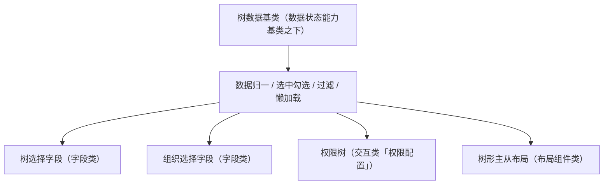

# 组件设计 · 树组件基类（原树域基类）

> 树域语义基类：数据归一 / 展开收起 / 选中与勾选 / 关键字过滤 / 懒加载与缓存——被树选择字段、组织选择字段、权限树与树形主从布局共享
> 实现侧命名与落点见《[前端基类清单](../../../../../前端基类清单.md)》（§2.1 全量基类登记表、§5 组件基类；继承链全系统唯一一份）。**本节点目录名沿用「域基类」的历史命名，正文按新口径称「组件基类」。**

[文档首页](../../../../../文档首页.md) › [项目规划说明](../../../../../规划/项目规划说明.md) › [组件设计](../../../01_组件设计_总览.md) › 树域基类　|　[← 展示域基类](../02_组件设计_展示域基类/02_组件设计_展示域基类.md)　[图表域基类 →](../04_组件设计_图表域基类/04_组件设计_图表域基类.md)

> 可交互原型：[03_原型设计_树域基类.html](03_原型设计_树域基类.html)（演示节点加载 / 懒加载、展开收起、单选与勾选、关键字过滤）

## 1. 目的与适用范围 

定义 BMS 前端**树域基类**的组件设计：树域语义（树数据）统一**数据归一、展开收起、选中 / 勾选模型、过滤、懒加载与缓存**。它是组件设计体系**树域语义基类**，为**树选择字段、组织选择字段、权限树、树形主从布局**等树形态组件提供统一的「数据归一、展开收起、选中/勾选模型、过滤、懒加载」契约。

### 1.1 定位与继承体系 

| 职责 | 归属 |
| --- | --- |
| 数据归一、展开 / 收起、选中 / 勾选（级联）模型、过滤、懒加载、节点插槽 | **本节点（组件基类 树组件基类，父基类 数据状态能力基类，链：总基类 → 组件根 → 数据状态能力基类 → 树组件基类）** |
| 字段语义（标签 / 必填 / 校验 / 权限） | [输入组件基类](../01_组件设计_输入域基类/01_组件设计_输入域基类.md) 与[字段壳基类](../../02_能力类/10_组件设计_字段壳能力/10_组件设计_字段壳能力.md)（树选择 / 组织选择字段叠加） |
| 点选交互（加载中/禁用/键盘） | [交互能力](../../02_能力类/01_组件设计_交互能力/01_组件设计_交互能力.md) |
| 左树右表布局结构 | [布局组件类「树形主从布局」](../../../03_布局组件类/05_组件设计_树形主从布局/05_组件设计_树形主从布局.md)（消费本基类） |

上游依据：[《前端开发规范》](../../../../../规范/前端开发规范.md)（§3 域基类、依赖方向）、[《前端基类清单》](../../../../../前端基类清单.md)「域基类」节、[《架构设计 · 前端组件体系》](../../../../架构设计/05_架构设计_前端组件体系.md)（域基类为继承链一层）。

> 本篇为 **基础组件类 · 域基类「树域基类」**。**范围边界**：布局结构归树形主从布局节点；字段外观归输入域基类与字段壳；本节点只做树语义（数据与选择模型）。

## 2. 职责与组成 

| 组成部分 | 职责 |
| --- | --- |
| 树数据语义（组件基类） | 树数据：加载 / 懒加载 / 归一 / 选中·勾选 / 过滤 / 缓存（组件基类承载） |
| 域包装件 | 继承链上的域层包装（组件基类之上、具体组件之下）：节点插槽、空态与加载态，承载树语义并可被模板层消费 |
| 懒加载与释放 | 子级按需加载并缓存；加载请求经[异步资源基类](../../01_机制基类/05_组件设计_异步资源基类/05_组件设计_异步资源基类.md)登记（卸载自动取消） |
| 过滤协作 | 本地过滤保留命中节点及祖先路径；远程过滤按关键字参数取数 |

- **继承方式**：组件基类是**继承链上的组件基类**（其上位基类之上、具体组件 / 件之下）；被字段类 / 布局类经树域派生取得公共行为语义，不在链外自由挂接（口径见[《前端开发规范》](../../../../../规范/前端开发规范.md)§1「架构铁律」与 §3.4）。
- 本基类只做树语义（数据与选择模型）；具体渲染形态由派生组件扩展。

## 3. 交互与契约语义 

| 语义项 | 说明 |
| --- | --- |
| 树数据 | 本地树数据与远程懒加载二选一（本地模式直接给定树） |
| 节点字段映射 | 节点唯一键（默认 `id`）、显示文本字段（默认 `label`）、子节点字段（默认 `children`） |
| 远程/懒加载 | 无参取根、传节点取子级；子级按需加载并缓存（重复展开不重复请求） |
| 勾选模式 | 勾选（含级联策略）；可设勾选不级联（父子独立） |
| 单选高亮 | 单选高亮模式（选择结果回传） |
| 手风琴 | 同级只展开一个 |
| 关键字过滤 | 本地过滤保留命中节点及其祖先路径；远程过滤按关键字参数 |
| 初始展开 | 初始全展开（大节点量不推荐） |
| 事件语义 | 节点选中（单选）、勾选变化（含级联结果与半选）、节点交互（点击/展开/收起）透传、懒加载子级完成 |
| 插槽语义 | 节点内容（默认显示文本 + 可选图标/状态点）、空态、节点悬浮操作 |

## 4. 基类行为 

| 项 | 设计 |
| --- | --- |
| 数据归一 | 后端树 → 前端节点（唯一键 / 显示文本 / 子节点字段映射）；空子节点归一为加载占位（懒加载判定） |
| 懒加载 | 子级按需加载并缓存（重复展开不重复请求）；已加载标记避免重复 |
| 选择模型 | 单选与勾选二选一或并存；勾选默认可级联、可设父子独立；受控由调用方决定 |
| 过滤 | 本地过滤保留命中节点及其祖先路径；远程过滤走加载接口 + 关键字参数（按域决定） |
| 空态 / 加载态 | 空数据走展示类「异常与空状态」；加载中骨架 / 加载指示 |
| 释放 | 懒加载请求经[异步资源基类](../../01_机制基类/05_组件设计_异步资源基类/05_组件设计_异步资源基类.md)登记（卸载自动取消） |
| 依赖方向 | 只依赖 组件基类 与 组件根；被字段类 / 布局类消费，不反向依赖 |

## 5. 场景集成 

| 场景 | 说明 |
| --- | --- |
| 树选择字段 | 树域（树数据语义）+ 输入域基类（受控值、字段壳、校验）：选择结果以 id 或路径回填 |
| 组织选择字段 | 树域 + 选项源能力 / 组织接口：单选组织节点 |
| 权限树 | 勾选模式 + 级联策略（角色授权）：半选态回传 |
| 树形主从布局 | 左侧树域组件（单选）驱动右侧列表 / 详情刷新 |

## 6. 依赖接口与上游变更 

### 6.1 上游接口与口径 

| 项 | 说明 | 目标文档 |
| --- | --- | --- |
| 分层权威 | 域基类职责与继承链口径 | [《前端开发规范》](../../../../../规范/前端开发规范.md) 第 3 节（登记项①） |
| 树数据契约 | 组织 / 字典 / 权限树数据结构与懒加载接口 | [《概要设计 · 组织管理》](../../../../概要设计/01_概要设计_总览.md)、[《概要设计 · 表单定制》](../../../../概要设计/36_概要设计_表单定制.md)（登记项②） |
| 组件分层 | 组件根 / 组件基类 / 域基类的继承与依赖关系 | [《架构设计 · 前端架构》](../../../../架构设计/08_架构设计_前端架构.md)（登记项③） |
| 新增依赖 | **无**（复用既有树控件与令牌） | — |

### 6.2 需登记的上游变更 

| 变更点 | 目标文档 | 内容 |
| --- | --- | --- |
| ① 树域基类契约 | [《前端开发规范》](../../../../../规范/前端开发规范.md) 第 3 节 | 明确 树域基类：数据归一 / 懒加载 / 选中·勾选 / 过滤 / 释放 |
| ② 树数据接口 | [《概要设计》](../../../../概要设计/01_概要设计_总览.md) 对应节点 | 组织树 / 权限树 / 字典树的加载与懒加载接口口径（配合树选择、组织选择字段登记） |
| ③ 组件分层与目录 | [《架构设计 · 前端架构》](../../../../架构设计/08_架构设计_前端架构.md)「组件体系（基类体系与目录登记）」节 | 登记树域基类为继承链一层（组件基类之上、具体组件/件之下）与「组件根 → 组件基类 → 树域 → 字段 / 布局组件派生」依赖方向 |

> 按[《文档生成规范》](../../../../../规范/文档生成规范.md)「引用与追溯」节，上述变更需用户确认后由上游文档同步。

## 7. 权限 / i18n / 移动端 

- **权限**：树节点越权由后端过滤（数据范围）；前端可叠加禁用态（字段权限/动作权限），不在本基类判权。
- **i18n**：节点显示文本由数据源下发（含 locale）；空态 / 加载文案走全局语言能力。
- **移动端**：PC 与移动端同一契约多实现（树语义一致；触控展开/收起）。

## 8. 性能与边界 

| 场景 | 设计 |
| --- | --- |
| 大数据量 | 懒加载优先；一次性加载大树上限保护（超限提示或虚拟滚动协作）；初始全展开慎用 |
| 更新 | 勾选/展开只更新局部状态；避免深度监听整树 |
| 边界 | 键重复、懒加载失败重试、过滤后展开态丢失、勾选级联与半选回传、受控与非受控混用 |
| 不支持 | 布局结构（树形主从布局）、字段外观（输入域基类 / 字段壳能力）、权限判定 |

## 9. 检查清单 

- □ 契约语义：本地数据/远程懒加载/节点字段映射/勾选与级联/单选/手风琴/过滤/初始展开；选中、勾选、节点交互与懒加载完成事件
- □ 行为：数据归一、懒加载缓存、选择模型清晰、过滤保留祖先、空态/加载态、释放走异步资源
- □ 被字段类 / 布局类消费；依赖方向单向（不反向依赖具体组件）
- □ 权限/i18n/移动端符合第 7 节；性能边界符合第 8 节
- □ 三项上游登记已确认

> 组件设计节点（树域基类）· 与[《前端开发规范》](../../../../../规范/前端开发规范.md)[《前端基类清单》](../../../../../前端基类清单.md)[《架构设计 · 前端架构》](../../../../架构设计/08_架构设计_前端架构.md)[输入域基类](../01_组件设计_输入域基类/01_组件设计_输入域基类.md)[字段壳能力](../../02_能力类/10_组件设计_字段壳能力/10_组件设计_字段壳能力.md)[交互能力](../../02_能力类/01_组件设计_交互能力/01_组件设计_交互能力.md)《命名规范》配套
