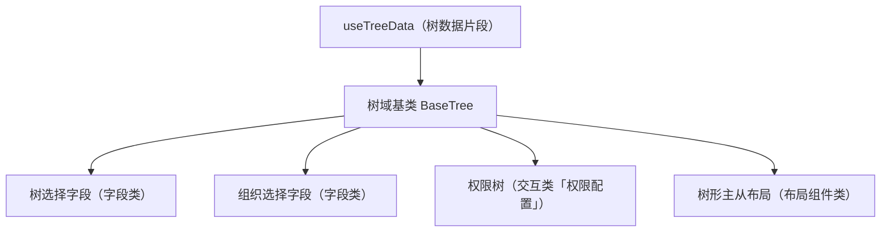

# 组件设计 · 树域基类

> BaseTree（树域基类，组合 useTreeData；树选择 / 组织树 / 权限树 / 树形主从共用）

[文档首页](../../../../../文档首页.md) › [项目规划说明](../../../../../规划/项目规划说明.md) › [组件设计](../../../01_组件设计_总览.md) › 树域基类　|　[← 展示域基类](../02_组件设计_展示域基类/02_组件设计_展示域基类.md)　[图表域基类 →](../04_组件设计_图表域基类/04_组件设计_图表域基类.md)

> 可交互原型：[03_原型设计_树域基类.html](03_原型设计_树域基类.html)（演示节点加载 / 懒加载、展开收起、单选与勾选、关键字过滤）

## 1. 目的与适用范围 

定义 BMS 前端 `apps/desktop/`（`frontend-mobile/` 同款）**树域基类**的组件设计：抽象基类 `BaseTree.vue`（树域组件包装），**组合能力片段** `useTreeData`（树数据：加载 / 懒加载 / 选中 / 过滤）。它是组件设计体系**树域语义基类**，为**树选择字段、组织选择字段、权限树、树形主从布局**等树形态组件提供统一的「数据归一、展开收起、选中/勾选模型、过滤、懒加载」契约。

### 1.1 定位与继承体系 

| 职责 | 归属 |
| --- | --- |
| 数据归一、展开 / 收起、选中 / 勾选（级联）模型、过滤、懒加载、节点插槽 | **本节点（树域基类）** |
| 字段语义（label/必填/校验/权限） | [输入域基类](../01_组件设计_输入域基类/01_组件设计_输入域基类.md) 与[字段壳片段](../../02_能力片段/10_组件设计_字段壳片段/10_组件设计_字段壳片段.md)（树选择 / 组织选择字段叠加） |
| 点选交互（loading/disabled/键盘） | [交互片段](../../02_能力片段/01_组件设计_交互片段/01_组件设计_交互片段.md) |
| 左树右表布局结构 | [布局组件类「树形主从布局」](../../../03_布局组件类/05_组件设计_树形主从布局/05_组件设计_树形主从布局.md)（消费本基类） |

上游依据：[《前端开发规范》](../../../../../规范/前端开发规范.md)（§3 域基类、依赖方向）、[《前端基类清单》](../../../../../前端基类清单.md)「域基类」节、[《架构设计 · 前端组件体系》](../../../../架构设计/05_架构设计_前端组件体系.md)（域基类按需）。

> 本篇为 **基础组件类 · 域基类「树域基类」**。**范围边界**：布局结构归树形主从布局节点；字段外观归输入域基类与字段壳；本节点只做树语义（数据与选择模型）。

## 2. 组件清单与职责 

| 组件 / 工具 | 位置 | 职责 |
| --- | --- | --- |
| `BaseTree.vue` | `src/components/base/tree/` | 树域组件包装（域基类，**组合片段** `useTreeData`）：`el-tree` 二次封装、节点插槽、空态与加载态 |
| `useTreeData.ts` | `src/components/base/tree/` | 树数据片段：加载 / 懒加载 / 归一 / 选中·勾选 / 过滤 / 缓存 |

- 命名遵循[《命名规范》](../../../../../规范/命名规范.md)：域基类组件 `BaseXxx`、片段 `useXxx`；目录遵循[《前端开发规范》](../../../../../规范/前端开发规范.md)（能力片段与域基类归 `src/components/base/<能力域>/`）。
- **继承方式**：Vue 组合式 API 无类继承，组件通过组合 `useTreeData` + 以 `BaseTree.vue` 为模板包装；本体系用"声明继承自基类"统一表述。
- **实现口径（2026-09-16，`02_04` 交付）**：`BaseTree.vue` + `useTreeBase`（落 `src/components/base/tree/`，双端同款）；**框架无关**——递归原生列表兜底，`el-tree` / Vant 由字段类 / 布局类子类接入；「过滤保留命中节点及祖先路径」「手风琴」「全展开」在域层实现（片段 `useTreeData` 的 `filter` 为平铺命中列表）。

## 3. 基类契约（Props 与事件） 

| 属性 | 类型 | 默认 | 说明 |
| --- | --- | --- | --- |
| `data` | TreeNode[] | `[]` | 树数据（本地模式；与 `load` 二选一） |
| `load` | (node?) => Promise\<TreeNode[]\> | — | 远程 / 懒加载（无参取根，传 node 取子级） |
| `nodeKey` | string | 'id' | 节点唯一键字段 |
| `labelKey` | string | 'label' | 节点显示文本字段 |
| `childrenKey` | string | 'children' | 子节点字段 |
| `checkable` | boolean | false | 勾选模式（含级联策略） |
| `checkStrictly` | boolean | false | 勾选不级联（父子独立） |
| `selectable` | boolean | true | 单选高亮模式 |
| `accordion` | boolean | false | 手风琴（同级只展开一个） |
| `filterable` | boolean | false | 关键字过滤 |
| `defaultExpandAll` | boolean | false | 初始全展开（大节点量不推荐） |

| 事件 | 载荷 | 说明 |
| --- | --- | --- |
| `select` | node | 节点选中（单选） |
| `check` | checkedNodes | 勾选变化（含级联结果） |
| `node-click` / `node-expand` / `node-collapse` | node | 节点交互（透传） |
| `loaded` | node | 懒加载子级完成 |

- 插槽：`default`（节点内容，默认 label + 可选图标/状态点）、`empty`（空态）、`actions`（节点悬浮操作）。

## 4. 基类行为 

| 项 | 设计 |
| --- | --- |
| 数据归一 | 后端树 → 前端节点（`nodeKey` / `labelKey` / `childrenKey` 映射）；空 `children` 归一为加载占位（懒加载判定） |
| 懒加载 | 子级按需加载并缓存（重复展开不重复请求）；`loaded` 标记避免重复 |
| 选择模型 | 单选（`select`）与勾选（`check`，默认可级联、`checkStrictly` 独立）二选一或并存；受控由调用方决定（`v-model:checked` 类） |
| 过滤 | 本地过滤保留命中节点及其祖先路径；远程过滤走 `load` + 关键字参数（按域决定） |
| 空态 / 加载态 | 空数据走展示类「异常与空状态」；加载中骨架 / loading 指示 |
| 释放 | 懒加载请求经[异步资源基类](../../01_机制基类/05_组件设计_异步资源基类/05_组件设计_异步资源基类.md)登记（卸载自动取消） |
| 依赖方向 | 只依赖 能力片段 与 组件根；被字段类 / 布局类消费，不反向依赖 |

## 5. 场景集成 

| 场景 | 说明 |
| --- | --- |
| 树选择字段 | `BaseTree` + 输入域基类（受控值、字段壳、校验）：选择结果以 id 或路径回填 |
| 组织选择字段 | `BaseTree` + 组织数据源（`useOptionSource` / 组织接口）：单选组织节点 |
| 权限树 | 勾选模式 + 级联策略（角色授权）：半选态回传 |
| 树形主从布局 | 左侧 `BaseTree`（单选）驱动右侧列表 / 详情刷新 |

## 6. 依赖接口与上游变更 

### 6.1 上游接口与口径 

| 项 | 说明 | 目标文档 |
| --- | --- | --- |
| 分层权威 | 域基类职责与组合轨口径 | [《前端开发规范》](../../../../../规范/前端开发规范.md) 第 3 节（登记项①） |
| 树数据契约 | 组织 / 字典 / 权限树数据结构与懒加载接口 | [《概要设计 · 组织管理》](../../../../概要设计/01_概要设计_总览.md)、[《概要设计 · 表单定制》](../../../../概要设计/36_概要设计_表单定制.md)（登记项②） |
| 组件分层 | `src/components/base/tree/` 目录与继承链 | [《架构设计 · 前端架构》](../../../../架构设计/08_架构设计_前端架构.md)（登记项③） |
| 新增依赖 | **无**（复用 Element Plus `el-tree`） | — |

### 6.2 需登记的上游变更 

| 变更点 | 目标文档 | 内容 |
| --- | --- | --- |
| ① 树域基类契约 | [《前端开发规范》](../../../../../规范/前端开发规范.md) 第 3 节 | 明确 `BaseTree` 组合 `useTreeData`：数据归一 / 懒加载 / 选中·勾选 / 过滤 / 释放 |
| ② 树数据接口 | [《概要设计》](../../../../概要设计/01_概要设计_总览.md) 对应节点 | 组织树 / 权限树 / 字典树的加载与懒加载接口口径（配合树选择、组织选择字段登记） |
| ③ 组件分层与目录 | [《架构设计 · 前端架构》](../../../../架构设计/08_架构设计_前端架构.md)「组件目录」节 | 登记 `src/components/base/tree/` 与「组件根 → 片段 → 树域基类 → 字段 / 布局组件」依赖方向 |

> 按[《文档生成规范》](../../../../../规范/文档生成规范.md)「引用与追溯」节，上述变更需用户确认后由上游文档同步。

## 7. 权限 / i18n / 移动端 

- **权限**：树节点越权由后端过滤（数据范围）；前端可叠加禁用态（字段权限/动作权限），不在本基类判权。
- **i18n**：节点 label 由数据源下发（含 locale）；空态 / 加载文案走 vue-i18n。
- **移动端**：独立工程，树语义同款（触控展开/收起）。

## 8. 性能与边界 

| 场景 | 设计 |
| --- | --- |
| 大数据量 | 懒加载优先；一次性加载大树上限保护（超限提示或虚拟滚动协作）；`defaultExpandAll` 慎用 |
| 更新 | 勾选/展开只更新局部状态；避免深度 watch 整树 |
| 边界 | 键重复、懒加载失败重试、过滤后展开态丢失、勾选级联与半选回传、受控与非受控混用 |
| 不支持 | 布局结构（树形主从布局）、字段外观（输入域基类/字段壳）、权限判定 |

## 9. 检查清单 

- □ 契约：`data`/`load`/`nodeKey`/`labelKey`/`checkable`/`checkStrictly`/`selectable`/`filterable` + `select`/`check`/`loaded`
- □ 行为：数据归一、懒加载缓存、选择模型清晰、过滤保留祖先、空态/加载态、释放走异步资源
- □ 被字段类 / 布局类消费；依赖方向单向（不反向依赖具体组件）
- □ 权限/i18n/移动端符合第 7 节；性能边界符合第 8 节
- □ 三项上游登记已确认

> 组件设计节点（树域基类）· 与[《前端开发规范》](../../../../../规范/前端开发规范.md)[《前端基类清单》](../../../../../前端基类清单.md)[《架构设计 · 前端架构》](../../../../架构设计/08_架构设计_前端架构.md)[输入域基类](../01_组件设计_输入域基类/01_组件设计_输入域基类.md)[字段壳片段](../../02_能力片段/10_组件设计_字段壳片段/10_组件设计_字段壳片段.md)[交互片段](../../02_能力片段/01_组件设计_交互片段/01_组件设计_交互片段.md)《命名规范》配套
