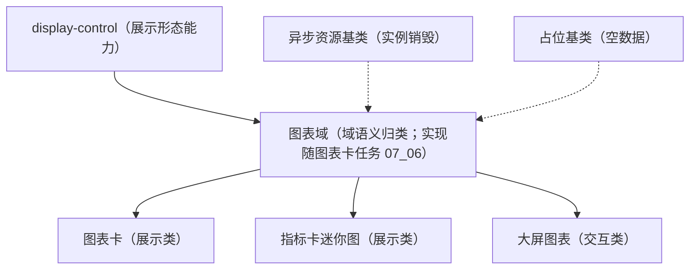

# 组件设计 · 图表域基类

> BaseChart（图表域基类；ECharts 实例生命周期 / 尺寸自适应 / 主题令牌 / 空态占位，图表卡与指标卡共用；规则与登记已就位，实现随图表卡任务 `07_06` 演练新增）

[文档首页](../../../../../文档首页.md) › [项目规划说明](../../../../../规划/项目规划说明.md) › [组件设计](../../../01_组件设计_总览.md) › 图表域基类　|　[← 树域基类](../03_组件设计_树域基类/03_组件设计_树域基类.md)　[编辑器域基类 →](../05_组件设计_编辑器域基类/05_组件设计_编辑器域基类.md)

> 可交互原型：[04_原型设计_图表域基类.html](04_原型设计_图表域基类.html)（演示主题随亮暗适配、空数据占位、容器尺寸自适应重绘与懒加载骨架）

## 1. 目的与适用范围 

定义 BMS 前端（核心 `frontend/packages/core` 纯 TS；渲染插件与宿主按同一契约装配）**图表域基类**的组件设计：图表域（域语义归类）统一**图表实例生命周期**（按需加载 / 销毁）、**尺寸自适应**（ResizeObserver）、**主题令牌适配**（亮暗 / 租户品牌）、**空数据占位**与加载态。它是组件设计体系**图表域语义基类**，供 [展示类「图表卡」](../../../07_展示类/04_组件设计_图表卡/04_组件设计_图表卡.md)、[展示类「指标卡」](../../../07_展示类/10_组件设计_指标卡/10_组件设计_指标卡.md) 与[交互类「大屏设计器与播放」](../../../08_交互类/09_组件设计_大屏设计器与播放/09_组件设计_大屏设计器与播放.md) 共用。图表域**规则与登记已就位**（ECharts 独立分包）；实现随图表卡任务 `07_06` 演练新增。

### 1.1 定位与继承体系 

| 职责 | 归属 |
| --- | --- |
| 实例生命周期、尺寸自适应、主题适配、空态占位、加载态、导出 | **本节点（图表域基类）** |
| 图表配置（series / xAxis…）与业务取数 | 使用方（图表卡 / 大屏卡片配置） |
| 密度 / 令牌 / 空值展示语义 | [展示形态能力](../../02_能力类/03_组件设计_展示形态能力/03_组件设计_展示形态能力.md) |
| 空态视觉 | [展示类「异常与空状态」](../../../07_展示类/05_组件设计_异常与空状态/05_组件设计_异常与空状态.md) |

上游依据：[《前端开发规范》](../../../../../规范/前端开发规范.md)（§3 域基类）、[《架构设计 · 前端组件体系》](../../../../架构设计/05_架构设计_前端组件体系.md)（分包与加载策略：ECharts 独立分包）、[《布局设计 · 设计令牌》](../../../../布局设计/02_布局设计_设计令牌.html)（主题令牌消费）。

> 本篇为 **基础组件类 · 域基类「图表域基类」**。**范围边界**：图表配置与取数归使用方；空态视觉归展示类「异常与空状态」；本节点只做"实例与呈现环境"的域契约。

## 2. 组件清单与职责 

| 组件 / 工具 | 位置 | 职责 |
| --- | --- | --- |
| 图表域语义（`BaseChart` 口径；实现待建） | 随图表卡任务 `07_06` 按「核心能力 + 投影 + 插件包装」演练新增 | 容器与自适应、ECharts 按需加载、主题注入、空态/加载态、实例 `expose` |
| 实例管理（按需投影 / 组合式；实现待建） | 随图表卡任务 `07_06` 演练新增 | 实例管理：init / setOption / resize（节流）/ dispose（登记异步资源）/ 主题重绘 |

- 命名与落点遵循[《命名规范》](../../../../../规范/命名规范.md)与[《前端开发规范》](../../../../../规范/前端开发规范.md)：核心类 `BaseXxx`、投影 `useXxx`（只落 `frontend/packages/vue/src/bindings/`）；图表域实现随 `07_06` 落渲染插件层（`frontend/packages/ui-ep` / `ui-vant`；ECharts 独立分包）。
- **实现口径（2026-09-17，新体系）**：本节点**规则与登记已就位**（《前端基类清单》『域基类』节：新增域流程 / 域基类约束 / `BaseXxx` + 投影 + 插件包装）；`BaseChart` 实现与用例随**图表卡任务 `07_06`** 演练新增（ECharts 独立分包）。

## 3. 基类契约（Props 与事件） 

| 属性 | 类型 | 默认 | 说明 |
| --- | --- | --- | --- |
| `option` | object | — | ECharts 配置（series / 坐标轴 / tooltip…） |
| `height` | string \| number | '320' | 图表高度（`auto` 时随容器） |
| `themeMode` | 'auto' \| 'light' \| 'dark' | 'auto' | 主题（`auto` 跟随全局亮暗 / 租户品牌令牌） |
| `autoResize` | boolean | true | 容器尺寸变化自动 `resize`（ResizeObserver + 节流） |
| `loading` | boolean | false | 加载态（骨架 / ECharts loading） |
| `empty` | boolean | false | 空数据（走占位语义，不初始化实例） |
| `renderer` | 'canvas' \| 'svg' | 'canvas' | 渲染器（大屏 / 多实例场景可选 svg） |

| 方法 / 事件 | 说明 |
| --- | --- |
| `setOption(option, notMerge?)` | 更新配置（增量或全量） |
| `resize()` | 手动重算尺寸（容器隐藏后显示需调用） |
| `getInstance()` | 取 ECharts 实例（`expose`，高级用法） |
| `toDataURL(type?)` | 导出图片（打印 / 导出复用） |
| `dispose()` | 销毁实例（组件卸载自动销毁） |
| `chart-ready` / `chart-click` / `chart-legend-change` | 就绪与交互事件（透传常用项） |

## 4. 基类行为 

| 项 | 设计 |
| --- | --- |
| 按需加载 | ECharts 与图表类型组件**异步 import**（独立分包，不进首屏）；加载期显示骨架 |
| 实例生命周期 | init 于容器可见时（`empty`/`loading` 不 init）；销毁登记[异步资源基类](../../01_机制基类/05_组件设计_异步资源基类/05_组件设计_异步资源基类.md)，卸载自动 `dispose` |
| 尺寸自适应 | ResizeObserver 监听容器（重绘节流，避免抖动）；容器隐藏时尺寸为 0 的守卫（显示后再 resize） |
| 主题适配 | 亮暗 / 品牌切换时按令牌重建 option 主题（颜色只取设计令牌，不硬编码色值）；`themeMode` 手动覆盖自动 |
| 空态 / 加载态 | `empty` 走占位空态（不初始化实例）；`loading` 骨架防抖 |
| 导出 | `toDataURL` 供打印 / 导出复用（与打印导出组件协作） |
| 依赖方向 | 只依赖 展示形态能力（`display-control`）/ 机制基类 / 组件根；被图表卡、指标卡、大屏消费，不反向依赖 |

## 5. 场景集成 

| 场景 | 说明 |
| --- | --- |
| 图表卡 | 工作台 / 报表页的图表卡片（标题 + 图表 + 工具区） |
| 指标卡 | 迷你趋势图（折线 / 柱状） |
| 大屏设计器 | 大屏图表组件（多实例、缩放适配、自动轮播提示） |
| 打印导出 | 导出图表为图片嵌入文档 |

## 6. 依赖接口与上游变更 

### 6.1 上游接口与口径 

| 项 | 说明 | 目标文档 |
| --- | --- | --- |
| 分层权威 | 域基类职责与分包加载口径 | [《前端开发规范》](../../../../../规范/前端开发规范.md) 第 3 节（登记项①） |
| 设计令牌 | 图表主题色随亮暗 / 品牌 | [《布局设计 · 设计令牌》](../../../../布局设计/02_布局设计_设计令牌.html)（登记项②） |
| 报表 / 大屏协作 | 报表设计器与大屏的图表契约 | [《概要设计 · 报表》](../../../../概要设计/01_概要设计_总览.md)、[交互类「大屏设计器与播放」](../../../08_交互类/09_组件设计_大屏设计器与播放/09_组件设计_大屏设计器与播放.md)（登记项③） |
| 新增依赖 | ECharts（技术选型已定案，独立分包） | — |

### 6.2 需登记的上游变更 

| 变更点 | 目标文档 | 内容 |
| --- | --- | --- |
| ① 图表域基类契约 | [《前端开发规范》](../../../../../规范/前端开发规范.md) 第 3 节 | 明确 `BaseChart`：实例生命周期 / 尺寸自适应 / 主题令牌 / 空态占位 / 导出 |
| ② 图表主题令牌 | [《布局设计 · 设计令牌》](../../../../布局设计/02_布局设计_设计令牌.html)「图表令牌」节 | 图表色板 / 坐标轴 / 文字颜色令牌（亮暗与品牌），图表只消费令牌 |
| ③ 报表 / 大屏图表契约 | [《概要设计》](../../../../概要设计/01_概要设计_总览.md) 对应节点 | 图表数据接口与配置 schema（报表 / 大屏设计器共用本基类） |

> 按[《文档生成规范》](../../../../../规范/文档生成规范.md)「引用与追溯」节，上述变更需用户确认后由上游文档同步。

## 7. 权限 / i18n / 移动端 

- **权限**：图表数据由后端按数据范围过滤；前端不二次过滤。
- **i18n**：图表标题 / 图例文案由配置与数据下发；tooltip 数值格式走格式化工具（按 locale）。
- **移动端**：渲染插件 `frontend/packages/ui-vant` 与 `ui-ep` 同一契约多实现（图表能力一致：触控缩放 / 响应式尺寸）。

## 8. 性能与边界 

| 场景 | 设计 |
| --- | --- |
| 分包 | ECharts 与图表类型异步加载、独立分包；首屏不含 |
| 多实例 | 大屏多图表实例：共享 ECharts 模块、`svg` 渲染可选、懒初始化（进入视口再 init） |
| 边界 | 容器隐藏尺寸 0、resize 抖动、主题切换残留旧色、`empty` 与 `loading` 并置、实例未销毁泄漏 |
| 不支持 | 图表配置与取数（使用方）、空态视觉（展示类「异常与空状态」）、权限判定 |

## 9. 检查清单 

- □ 契约：`option`/`height`/`themeMode`/`autoResize`/`loading`/`empty`/`renderer` + `setOption`/`resize`/`toDataURL`/`dispose`
- □ 行为：异步加载与骨架、卸载自动销毁（登记异步资源）、ResizeObserver 节流、主题令牌消费（不硬编码色值）、`empty` 不 init
- □ 被图表卡 / 指标卡 / 大屏消费；依赖方向单向
- □ 权限/i18n/移动端符合第 7 节；性能边界符合第 8 节
- □ 三项上游登记已确认

> 组件设计节点（图表域基类）· 与[《前端开发规范》](../../../../../规范/前端开发规范.md)[《架构设计 · 前端组件体系》](../../../../架构设计/05_架构设计_前端组件体系.md)[《布局设计 · 设计令牌》](../../../../布局设计/02_布局设计_设计令牌.html)[展示形态能力](../../02_能力类/03_组件设计_展示形态能力/03_组件设计_展示形态能力.md)[展示类「图表卡」](../../../07_展示类/04_组件设计_图表卡/04_组件设计_图表卡.md)[占位基类](../../01_机制基类/04_组件设计_占位基类/04_组件设计_占位基类.md)《命名规范》配套
