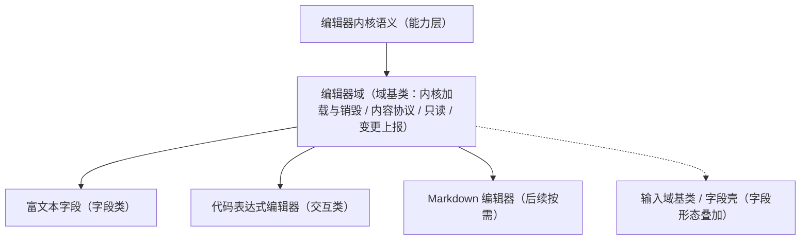

# 组件设计 · 编辑器域基类

> 编辑器域语义基类：内核懒加载与销毁 / 内容协议（富文本 / Markdown / 代码）/ 只读态 / 变更上报——富文本字段与代码表达式编辑器共用
> 实现侧命名与落点见《[前端基类清单](../../../../../前端基类清单.md)》（「域基类」节），实现契约细节见项目详细设计。

[文档首页](../../../../../文档首页.md) › [项目规划说明](../../../../../规划/项目规划说明.md) › [组件设计](../../../01_组件设计_总览.md) › 编辑器域基类　|　[← 图表域基类](../04_组件设计_图表域基类/04_组件设计_图表域基类.md)　[交互能力 →](../../02_能力类/01_组件设计_交互能力/01_组件设计_交互能力.md)

> 可交互原型：[05_原型设计_编辑器域基类.html](05_原型设计_编辑器域基类.html)（演示内核懒加载、内容协议（富文本 / 代码）、只读态与内容变更上报；原型以可编辑区示意，真实实现用对应编辑器内核）

## 1. 目的与适用范围 

定义 BMS 前端**编辑器域基类**的组件设计：编辑器域语义（编辑器内核）统一**内核按需加载与销毁、内容协议、只读态、变更上报**。它是组件设计体系**编辑器域语义基类**，为 [字段类「富文本字段」](../../../06_字段类/07_组件设计_富文本字段/07_组件设计_富文本字段.md)、[交互类「代码表达式编辑器」](../../../08_交互类/04_组件设计_代码表达式编辑器/04_组件设计_代码表达式编辑器.md) 等提供统一的「内核加载、内容协议、只读、变更上报、销毁」契约。

### 1.1 定位与继承体系 

| 职责 | 归属 |
| --- | --- |
| 内核懒加载与销毁、内容协议（HTML / Markdown / 代码）、只读态、变更上报、工具栏插槽 | **本节点（编辑器域基类）** |
| 字段外观（标签/必填/校验/权限） | [输入域基类](../01_组件设计_输入域基类/01_组件设计_输入域基类.md) 与[字段壳能力](../../02_能力类/10_组件设计_字段壳能力/10_组件设计_字段壳能力.md)（富文本字段叠加） |
| 具体编辑器产品的配置项 | 使用方与实现（本节点定义协议与生命周期） |
| 内容渲染展示（只读展示富文本） | 展示类（渲染器按内容协议展示） |

上游依据：[《前端开发规范》](../../../../../规范/前端开发规范.md)（§3 域基类）、[《架构设计 · 前端组件体系》](../../../../架构设计/05_架构设计_前端组件体系.md)（重组件异步加载与分包：编辑器内核独立分包）、[《概要设计 · 表单定制》](../../../../概要设计/36_概要设计_表单定制.md)（字段类型与编辑器形态）。

> 本篇为 **基础组件类 · 域基类「编辑器域基类」**。**范围边界**：字段形态归输入域基类与字段壳；具体编辑器配置归使用方；内容安全的服务端净化仍为最终防线；本节点只做"编辑器内核与内容协议"的域契约。

## 2. 职责与组成 

| 组成部分 | 职责 |
| --- | --- |
| 编辑器内核语义（能力层） | 内核按需加载（独立分包）、实例创建与销毁（登记异步资源）、内容协议读写（能力层承载） |
| 域包装件 | 继承链上的域层包装（能力层之上、具体组件之下）：容器 / 工具栏插槽、按内容协议加载内核、只读态、变更上报，可被模板层消费 |
| 降级通道 | 内核未注入（占位）时降级为纯文本编辑区，保证可用 |

- **继承方式**：域基类是**继承链上的一层**（能力层之上、具体组件/件之下）；富文本字段与代码表达式编辑器经编辑器域派生取得公共行为语义，不在链外自由挂接（口径见[《前端开发规范》](../../../../../规范/前端开发规范.md)§1「架构铁律」与 §3.4）。

## 3. 交互与契约语义 

| 语义项 | 说明 |
| --- | --- |
| 内容 | 内容协议按编辑器种类：富文本＝HTML、Markdown＝Markdown 文本、代码＝纯文本 |
| 编辑器种类 | 富文本 / Markdown / 代码 三态（决定加载的内核） |
| 代码语言 | 代码模式的语法语言（如 sql / json / javascript） |
| 只读 | 只读（禁编辑、保复制与滚动） |
| 高度 | 编辑区高度 |
| 占位文案 | 占位提示（i18n） |
| 上传配置 | 富文本图片 / 附件上传配置（复用上传引擎能力） |
| 操作语义 | 聚焦 / 失焦控制；内容读写（按内容协议归一） |
| 事件语义 | 内容变更（受控）、业务变更上报（去抖后）、内核加载完成（懒加载完成时） |

## 4. 基类行为 

| 项 | 设计 |
| --- | --- |
| 懒加载 | 内核与语言包**异步加载**（独立分包）；首次进入视口 / 聚焦 / 表单编辑态时加载，加载期骨架 |
| 销毁 | 实例销毁登记[异步资源基类](../../01_机制基类/05_组件设计_异步资源基类/05_组件设计_异步资源基类.md)，卸载自动销毁（防止 DOM / 定时器泄漏） |
| 内容协议 | 富文本＝HTML（提交前与渲染时按白名单净化，服务端二次净化）；Markdown＝Markdown 文本；代码＝纯文本（含语言标记）；**协议在域内统一，避免同一字段多种表示** |
| 只读态 | 只读时禁编辑、保复制与滚动；字段场景下由字段壳决定纯文本回显或只读编辑器 |
| 变更上报 | 受控内容更新 + 去抖业务变更上报；大文档输入避免高频全量上报（增量或提交时读取） |
| 上传协作 | 富文本内图片 / 附件走[上传引擎能力](../../02_能力类/13_组件设计_上传引擎能力/13_组件设计_上传引擎能力.md)与[预签名能力](../../02_能力类/22_组件设计_预签名能力/22_组件设计_预签名能力.md)（占位先行） |
| 依赖方向 | 只依赖 能力层 / 机制基类 / 组件根；被字段类 / 交互类消费，不反向依赖 |

## 5. 场景集成 

| 场景 | 说明 |
| --- | --- |
| 富文本字段 | 编辑器域（富文本协议）叠加输入域基类与字段壳：公告、说明、审批意见 |
| 代码表达式编辑器 | 编辑器域（代码协议 + 代码语言）：表单公式、报表表达式、规则脚本 |
| 内容展示 | 富文本渲染器按富文本协议只读展示（净化后渲染） |
| 表单设计器 | 属性面板内的富文本 / 代码配置项复用本基类 |

## 6. 依赖接口与上游变更 

### 6.1 上游接口与口径 

| 项 | 说明 | 目标文档 |
| --- | --- | --- |
| 分层权威 | 域基类职责与内容协议口径 | [《前端开发规范》](../../../../../规范/前端开发规范.md) 第 3 节（登记项①） |
| 编辑器选型与分包 | 编辑器内核异步加载 | [《架构设计 · 前端组件体系》](../../../../架构设计/05_架构设计_前端组件体系.md)「分包与加载策略」节（登记项②） |
| 字段交互 | 富文本字段的校验 / 字数限制 | [字段类「富文本字段」](../../../06_字段类/07_组件设计_富文本字段/07_组件设计_富文本字段.md)（登记项③） |
| 新增依赖 | 编辑器内核（随实现锁定版本） | — |

### 6.2 需登记的上游变更 

| 变更点 | 目标文档 | 内容 |
| --- | --- | --- |
| ① 编辑器域基类契约 | [《前端开发规范》](../../../../../规范/前端开发规范.md) 第 3 节 | 明确 编辑器域基类：懒加载 / 销毁 / 内容协议（富文本 / Markdown / 代码）/ 只读 / 变更上报 |
| ② 分包与选型 | [《架构设计 · 前端组件体系》](../../../../架构设计/05_架构设计_前端组件体系.md) | 编辑器内核版本与异步分包策略（首屏不含） |
| ③ 字段交互与安全 | [字段类「富文本字段」](../../../06_字段类/07_组件设计_富文本字段/07_组件设计_富文本字段.md) | 字数 / 校验 / 图片上传口径；内容净化（前端白名单 + 服务端二次）责任边界 |

> 按[《文档生成规范》](../../../../../规范/文档生成规范.md)「引用与追溯」节，上述变更需用户确认后由上游文档同步。

## 7. 权限 / i18n / 移动端 

- **权限**：编辑 / 只读由字段权限决定（不可编辑下发只读）；本基类不判权。
- **i18n**：工具栏与占位文案走全局语言能力（内核语言包按 locale 懒加载）。
- **移动端**：PC 与移动端同一契约多实现（内容协议同源；编辑器产品可不同，数据兼容）。

## 8. 性能与边界 

| 场景 | 设计 |
| --- | --- |
| 分包 | 内核与语言包异步加载、独立分包；同屏多编辑器共享内核模块 |
| 大文档 | 避免每次按键全量序列化；业务变更去抖；超长文档提示或降级纯文本 |
| 边界 | XSS（富文本必须净化，双端）、协议不一致（历史数据迁移）、卸载未保存（配合表单脏数据拦截）、实例泄漏、只读与禁用混淆 |
| 不支持 | 字段外观（输入域基类 / 字段壳）、具体工具栏产品配置（使用方）、权限判定 |

## 9. 检查清单 

- □ 契约语义：内容协议（富文本/Markdown/代码）/编辑器种类/代码语言/只读/高度/占位/上传配置；聚焦、内容读写、内容变更与内核就绪事件
- □ 行为：内核懒加载（独立分包）、卸载自动销毁（登记异步资源）、内容协议统一、只读保复制、净化责任边界清晰
- □ 被富文本字段 / 代码表达式编辑器消费；依赖方向单向
- □ 权限/i18n/移动端符合第 7 节；性能边界符合第 8 节
- □ 三项上游登记已确认

> 组件设计节点（编辑器域基类）· 与[《前端开发规范》](../../../../../规范/前端开发规范.md)[《架构设计 · 前端组件体系》](../../../../架构设计/05_架构设计_前端组件体系.md)[《概要设计 · 表单定制》](../../../../概要设计/36_概要设计_表单定制.md)[输入域基类](../01_组件设计_输入域基类/01_组件设计_输入域基类.md)[字段壳能力](../../02_能力类/10_组件设计_字段壳能力/10_组件设计_字段壳能力.md)[上传引擎能力](../../02_能力类/13_组件设计_上传引擎能力/13_组件设计_上传引擎能力.md)[富文本字段](../../../06_字段类/07_组件设计_富文本字段/07_组件设计_富文本字段.md)《命名规范》配套
