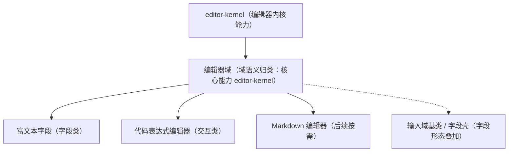

# 组件设计 · 编辑器域基类

> BaseEditor（编辑器域基类，组合核心能力 `editor-kernel`；富文本 / Markdown / 代码编辑器共用；域包装按「核心能力 + 投影 + 插件包装」随域 05+ 回补波重建）

[文档首页](../../../../../文档首页.md) › [项目规划说明](../../../../../规划/项目规划说明.md) › [组件设计](../../../01_组件设计_总览.md) › 编辑器域基类　|　[← 图表域基类](../04_组件设计_图表域基类/04_组件设计_图表域基类.md)　[交互能力 →](../../02_能力片段/01_组件设计_交互片段/01_组件设计_交互片段.md)

> 可交互原型：[05_原型设计_编辑器域基类.html](05_原型设计_编辑器域基类.html)（演示内核懒加载、内容协议（富文本 / 代码）、只读态与内容变更上报；原型以可编辑区示意，真实实现用对应编辑器内核）

## 1. 目的与适用范围 

定义 BMS 前端（核心 `frontend/packages/core` 纯 TS；渲染插件与宿主按同一契约装配）**编辑器域基类**的组件设计：编辑器域能力已在核心类化——`editor-kernel`（编辑器内核：懒加载 / 销毁 / 内容协议）。它是组件设计体系**编辑器域语义基类**，为 [字段类「富文本字段」](../../../06_字段类/07_组件设计_富文本字段/07_组件设计_富文本字段.md)、[交互类「代码表达式编辑器」](../../../08_交互类/04_组件设计_代码表达式编辑器/04_组件设计_代码表达式编辑器.md) 等提供统一的「内核加载、内容协议、只读、变更上报、销毁」契约。原 `BaseEditor.vue` 域包装随旧层删除（历史经 git 追溯），按「核心能力 + 投影 + 插件包装」随域 05+ 回补波重建。

### 1.1 定位与继承体系 

| 职责 | 归属 |
| --- | --- |
| 内核懒加载与销毁、内容协议（HTML / Markdown / 代码）、只读态、变更上报、工具栏插槽 | **本节点（编辑器域基类）** |
| 字段外观（label/必填/校验/权限） | [输入域基类](../01_组件设计_输入域基类/01_组件设计_输入域基类.md) 与[字段壳能力](../../02_能力片段/10_组件设计_字段壳片段/10_组件设计_字段壳片段.md)（富文本字段叠加） |
| 具体编辑器产品的配置项（CodeMirror / wangEditor） | 使用方与实现（本节点定义协议与生命周期） |
| 内容渲染展示（只读展示富文本） | 展示类（渲染器按内容协议展示） |

上游依据：[《前端开发规范》](../../../../../规范/前端开发规范.md)（§3 域基类）、[《架构设计 · 前端组件体系》](../../../../架构设计/05_架构设计_前端组件体系.md)（重组件异步加载与分包：CodeMirror / 富文本独立分包）、[《概要设计 · 表单定制》](../../../../概要设计/36_概要设计_表单定制.md)（字段类型与编辑器形态）。

> 本篇为 **基础组件类 · 域基类「编辑器域基类」**。**范围边界**：字段形态归输入域基类与字段壳；具体编辑器配置归使用方；内容安全的服务端净化仍为最终防线；本节点只做"编辑器内核与内容协议"的域契约。

## 2. 组件清单与职责 

| 组件 / 工具 | 位置 | 职责 |
| --- | --- | --- |
| 编辑器域能力（`editor-kernel`） | `frontend/packages/core/src/capabilities/editor-kernel.ts` | 内核能力：按需 `import`（独立分包）、实例创建与销毁（登记异步资源）、内容协议读写 |
| 域包装（原 `BaseEditor.vue`，已删除） | —（随域 05+ 回补波按「核心能力 + 投影 + 插件包装」重建） | 编辑器域组件包装：容器 / 工具栏插槽、按 `kind` 加载内核、只读态、变更上报（由渲染插件层承接） |

- 命名与落点遵循[《命名规范》](../../../../../规范/命名规范.md)与[《前端开发规范》](../../../../../规范/前端开发规范.md)：核心类 `BaseXxx`、能力 `key` kebab-case、投影 `useXxx`（只落 `frontend/packages/vue/src/bindings/`）；核心能力落 `frontend/packages/core/src/capabilities/`，域包装随回补波落渲染插件层（`frontend/packages/ui-ep` / `ui-vant`）。
- **继承方式**：Vue 组合式 API 无类继承（域包装为可选语义归类）；组件经 `editor-kernel` 能力（+ 投影）组合取得；本体系用"声明继承自基类"统一表述。
- **实现口径（2026-09-17，新体系）**：域能力已在核心类化——编辑器域 = `editor-kernel`（落 `frontend/packages/core/src/capabilities/`；投影按需）；**框架无关**——内核未注入（占位）时 textarea 降级，真实内核（CodeMirror / 富文本）由 `loader` 注入、独立分包；`rich` 协议含前端白名单净化（`sanitizeHtml`；服务端二次净化仍为最终防线）。原 `BaseEditor.vue` + 域组合式已随旧层删除（历史经 git 追溯）。

## 3. 基类契约（Props 与事件） 

| 属性 | 类型 | 默认 | 说明 |
| --- | --- | --- | --- |
| `modelValue` | string | '' | 内容（协议按 `kind`：rich＝HTML、markdown＝Markdown 文本、code＝纯文本） |
| `kind` | 'rich' \| 'markdown' \| 'code' | 'rich' | 编辑器种类（决定加载的内核） |
| `language` | string | '' | `code` 模式语言（如 sql / json / javascript） |
| `readonly` | boolean | false | 只读（禁编辑、保复制与滚动） |
| `height` | string \| number | '240' | 编辑区高度 |
| `placeholder` | string | '' | 占位文案（i18n） |
| `upload` | object | — | 富文本图片 / 附件上传配置（复用上传引擎能力） |

| 方法 / 事件 | 说明 |
| --- | --- |
| `focus()` / `blur()` | 焦点控制（`expose`） |
| `getContent()` / `setContent(v)` | 内容读写（协议按 `kind` 归一） |
| `update:modelValue` | 内容变更（受控） |
| `change` | 业务变更上报（去抖后） |
| `kernel-ready` | 内核加载完成（懒加载完成时） |

## 4. 基类行为 

| 项 | 设计 |
| --- | --- |
| 懒加载 | 内核与语言包**异步 import**（独立分包）；首次进入视口 / 聚焦 / 表单编辑态时加载，加载期骨架 |
| 销毁 | 实例销毁登记[异步资源基类](../../01_机制基类/05_组件设计_异步资源基类/05_组件设计_异步资源基类.md)，卸载自动销毁（防止 DOM / 定时器泄漏） |
| 内容协议 | `rich`＝HTML（前端提交前与渲染时按白名单净化，服务端二次净化）；`markdown`＝Markdown 文本；`code`＝纯文本（含语言标记）；**协议在域内统一，避免同一字段多种表示** |
| 只读态 | `readonly=true` 禁编辑、保复制与滚动；字段场景下由字段壳决定纯文本回显或只读编辑器 |
| 变更上报 | 受控 `update:modelValue` + 去抖 `change`；大文档输入避免高频全量 emit（增量或提交时读取） |
| 上传协作 | 富文本内图片 / 附件走[上传引擎能力](../../02_能力片段/13_组件设计_上传引擎片段/13_组件设计_上传引擎片段.md)（`upload-engine`，占位先行）与[预签名能力](../../02_能力片段/22_组件设计_预签名片段/22_组件设计_预签名片段.md)（`presigned-url`） |
| 依赖方向 | 只依赖 能力类 / 机制基类 / 组件根；被字段类 / 交互类消费，不反向依赖 |

## 5. 场景集成 

| 场景 | 说明 |
| --- | --- |
| 富文本字段 | 编辑器域（rich）叠加输入域基类与字段壳：公告、说明、审批意见 |
| 代码表达式编辑器 | 编辑器域（code + language）：表单公式、报表表达式、规则脚本 |
| 内容展示 | 富文本渲染器按 `rich` 协议只读展示（净化后渲染） |
| 表单设计器 | 属性面板内的富文本 / 代码配置项复用本基类 |

## 6. 依赖接口与上游变更 

### 6.1 上游接口与口径 

| 项 | 说明 | 目标文档 |
| --- | --- | --- |
| 分层权威 | 域基类职责与内容协议口径 | [《前端开发规范》](../../../../../规范/前端开发规范.md) 第 3 节（登记项①） |
| 编辑器选型与分包 | CodeMirror / 富文本异步加载 | [《架构设计 · 前端组件体系》](../../../../架构设计/05_架构设计_前端组件体系.md)「分包与加载策略」节（登记项②） |
| 字段交互 | 富文本字段的校验 / 字数限制 | [字段类「富文本字段」](../../../06_字段类/07_组件设计_富文本字段/07_组件设计_富文本字段.md)（登记项③） |
| 新增依赖 | 编辑器内核（CodeMirror / 富文本，随实现锁定版本） | — |

### 6.2 需登记的上游变更 

| 变更点 | 目标文档 | 内容 |
| --- | --- | --- |
| ① 编辑器域基类契约 | [《前端开发规范》](../../../../../规范/前端开发规范.md) 第 3 节 | 明确 编辑器域 = `editor-kernel` 能力：懒加载 / 销毁 / 内容协议（rich / markdown / code）/ 只读 / 变更上报 |
| ② 分包与选型 | [《架构设计 · 前端组件体系》](../../../../架构设计/05_架构设计_前端组件体系.md) | 编辑器内核版本与异步分包策略（首屏不含） |
| ③ 字段交互与安全 | [字段类「富文本字段」](../../../06_字段类/07_组件设计_富文本字段/07_组件设计_富文本字段.md) | 字数 / 校验 / 图片上传口径；内容净化（前端白名单 + 服务端二次）责任边界 |

> 按[《文档生成规范》](../../../../../规范/文档生成规范.md)「引用与追溯」节，上述变更需用户确认后由上游文档同步。

## 7. 权限 / i18n / 移动端 

- **权限**：编辑 / 只读由字段权限决定（`editable=false` 传 `readonly`）；本基类不判权。
- **i18n**：工具栏与占位文案走 vue-i18n（内核语言包按 locale 懒加载）。
- **移动端**：渲染插件 `frontend/packages/ui-vant` 与 `ui-ep` 同一契约多实现（内容协议同源；编辑器产品可不同，数据兼容）。

## 8. 性能与边界 

| 场景 | 设计 |
| --- | --- |
| 分包 | 内核与语言包异步加载、独立分包；同屏多编辑器共享内核模块 |
| 大文档 | 避免每次按键全量序列化；`change` 去抖；超长文档提示或降级纯文本 |
| 边界 | XSS（富文本必须净化，双端）、协议不一致（历史数据迁移）、卸载未保存（配合表单脏数据拦截）、实例泄漏、只读与禁用混淆 |
| 不支持 | 字段外观（输入域基类 / 字段壳）、具体工具栏产品配置（使用方）、权限判定 |

## 9. 检查清单 

- □ 契约：`modelValue`/`kind`/`language`/`readonly`/`height`/`placeholder`/`upload` + `focus`/`getContent`/`setContent`/`change`
- □ 行为：内核懒加载（独立分包）、卸载自动销毁（登记异步资源）、内容协议统一、只读保复制、净化责任边界清晰
- □ 被富文本字段 / 代码表达式编辑器消费；依赖方向单向
- □ 权限/i18n/移动端符合第 7 节；性能边界符合第 8 节
- □ 三项上游登记已确认

> 组件设计节点（编辑器域基类）· 与[《前端开发规范》](../../../../../规范/前端开发规范.md)[《架构设计 · 前端组件体系》](../../../../架构设计/05_架构设计_前端组件体系.md)[《概要设计 · 表单定制》](../../../../概要设计/36_概要设计_表单定制.md)[输入域基类](../01_组件设计_输入域基类/01_组件设计_输入域基类.md)[字段壳能力](../../02_能力片段/10_组件设计_字段壳片段/10_组件设计_字段壳片段.md)[上传引擎能力](../../02_能力片段/13_组件设计_上传引擎片段/13_组件设计_上传引擎片段.md)[富文本字段](../../../06_字段类/07_组件设计_富文本字段/07_组件设计_富文本字段.md)《命名规范》配套
