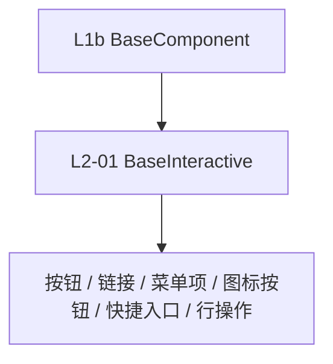

# 组件设计 · 交互组件基类

> BaseInteractive · useInteractiveBase（可点击/可操作组件通用）

[文档首页](../../../../../文档首页.md) › [项目规划说明](../../../../../规划/项目规划说明.md) › [组件设计](../../../01_组件设计_总览.md) › 交互组件基类　|　[← 最基础组件基类](../../L1b_最基础组件基类/01_组件设计_最基础组件基类/01_组件设计_最基础组件基类.md)　[输入组件基类 →](../02_组件设计_输入组件基类/02_组件设计_输入组件基类.md)

> 可交互原型：[01_原型设计_交互组件基类.html](01_原型设计_交互组件基类.html)（演示可点击语义、loading/disabled、焦点与键盘（Enter/Space）、点击防抖、危险操作确认钩子与点击埋点）

## 1. 目的与适用范围 

定义 BMS 前端 `frontend/`（`frontend-mobile/` 同款）**交互组件基类**的组件设计：`BaseInteractive` 与 `useInteractiveBase`，为**所有可点击/可操作组件**（按钮、链接、菜单项、图标按钮、快捷入口、行操作等）提供公共交互语义。它是组件设计体系 **L2 形态基类第 1 篇**，继承 [L1b 最基础组件基类](../../L1b_最基础组件基类/01_组件设计_最基础组件基类/01_组件设计_最基础组件基类.md)，是[《前端开发规范》](../../../../../规范/前端开发规范.md) §3 分层的组件侧落地。

### 1.1 定位 

| 职责 | 归属 |
| --- | --- |
| 可点击语义、loading/disabled、焦点与键盘、点击防抖、危险确认钩子、点击埋点 | **本节点（L2-01）** |
| 透传/尺寸/密度/主题/i18n/可访问性基础 | [L1b](../../L1b_最基础组件基类/01_组件设计_最基础组件基类/01_组件设计_最基础组件基类.md) |
| 输入形态（值绑定/前后缀/清空） | [L2-02 输入组件基类](../02_组件设计_输入组件基类/02_组件设计_输入组件基类.md) |
| 权限（按钮显隐/禁用） | [07 基础类 02 权限指令](../../../09_基础类/02_组件设计_权限指令/02_组件设计_权限指令.md) |

上游依据：[《前端开发规范》](../../../../../规范/前端开发规范.md)（§3 分层、§5.2 props/emit）、[《布局设计 · 设计令牌》](../../../../布局设计/02_布局设计_设计令牌.html)（交互态令牌 hover/active/focus/disabled）。

> 本篇为 **02 基础组件类 · L2 形态基类第 1 篇**。**范围边界**：通用能力归 L1b；输入形态归 L2-02；权限判定不在本基类（由动作权限指令与字段权限处理）。

## 2. 组件清单与职责 

| 组件 / 工具 | 位置 | 职责 |
| --- | --- | --- |
| `BaseInteractive.vue` | `src/base/l2/` | 可交互抽象基类：点击/键盘触发、loading/disabled、焦点环、防抖、危险确认、埋点 |
| `useInteractiveBase.ts` | `src/base/l2/` | 组合式等价能力，供 `<script setup>` 组件使用 |

## 3. 契约（Props 与事件） 

| 属性 | 类型 | 默认 | 说明 |
| --- | --- | --- | --- |
| `loading` | boolean | false | 加载态（禁用点击并显示 loading） |
| `disabled` | boolean | false | 禁用态（不可点击、不可聚焦） |
| `debounce` | number | 0 | 点击防抖（ms，0 不防抖） |
| `dangerConfirm` | string | '' | 危险操作确认文案（设置则点击前二次确认） |
| `confirmOn` | 'click' \| 'before' | 'before' | 确认触发时机（`before` 先确认后回调） |
| `role` | string | 'button' | 可访问角色 |

| 事件 | 载荷 | 说明 |
| --- | --- | --- |
| `click` | event | 有效点击（已通过 disabled/loading/防抖/确认） |
| `key-enter` / `key-space` | event | 键盘触发 |

- 插槽：`default`（内容）、`loading`（自定义加载态）。

## 4. 交互与实现约定 

| 项 | 设计 |
| --- | --- |
| 点击语义 | `disabled`/`loading` 时不触发；点击后按 `debounce` 去抖；`dangerConfirm` 生效则先确认 |
| 键盘 | Enter/Space 触发 `click`；`disabled` 时从 tab 序列移除 |
| 焦点 | 焦点环用交互态令牌；`:focus-visible` 仅键盘可见 |
| loading | 显示 loading 且防重复提交（提交类组件默认） |
| 埋点 | 统一曝光/点击埋点钩子（可关） |
| 组合 | 可同时组合 L2-02 输入基类（如可点击标签输入），无冲突 |

## 5. 场景集成 

| 场景 | 说明 |
| --- | --- |
| 按钮/图标按钮 | 主操作、行操作 |
| 菜单项/快捷入口 | 导航类点击 |
| 危险操作 | 删除/停用等二次确认 |

## 6. 依赖接口与上游变更 

### 6.1 上游接口与口径 

| 项 | 说明 | 目标文档 |
| --- | --- | --- |
| 分层权威 | L2 交互基类职责 | [《前端开发规范》](../../../../../规范/前端开发规范.md) 第 3 节（登记项①） |
| 交互态令牌 | hover/active/focus/disabled 令牌 | [《布局设计 · 设计令牌》](../../../../布局设计/02_布局设计_设计令牌.html)（登记项②） |
| 组件分层 | `src/base/l2` 与继承链 | [《架构设计 · 前端架构》](../../../../架构设计/28_架构设计_前端架构.md)（登记项③） |
| 新增依赖 | **无** | — |

### 6.2 需登记的上游变更 

| 变更点 | 目标文档 | 内容 |
| --- | --- | --- |
| ① 交互组件基类契约 | [《前端开发规范》](../../../../../规范/前端开发规范.md) 第 3 节 | 明确 L2 交互基类契约：可点击语义、loading/disabled、键盘（Enter/Space）、防抖、危险确认钩子、点击埋点 |
| ② 交互态令牌 | [《布局设计 · 设计令牌》](../../../../布局设计/02_布局设计_设计令牌.html)「交互态令牌」节 | 明确 hover/active/focus-visible/disabled 令牌与焦点环规范，组件只消费令牌 |
| ③ 组件分层与目录 | [《架构设计 · 前端架构》](../../../../架构设计/28_架构设计_前端架构.md)「组件分层」节 | 登记 `src/base/l2` 与 L1b→L2→L3→L4 继承链 |

> 按[《文档生成规范》](../../../../../规范/文档生成规范.md)「引用与追溯」节，上述变更需用户确认后由上游文档同步。

## 7. 权限 / i18n / 移动端 

- **权限**：按钮显隐/禁用用 `v-perm`（[07 基础类 02](../../../09_基础类/02_组件设计_权限指令/02_组件设计_权限指令.md)），本基类不判权限。
- **i18n**：确认/加载文案经 L0 `t`。
- **移动端**：独立工程，交互语义同款（触控无 hover）。

## 8. 性能与边界 

| 场景 | 设计 |
| --- | --- |
| 渲染 | 薄基类；无额外包裹元素 |
| 防抖 | 提交类默认防抖 + loading 双保险 |
| 边界 | 双击/连点、disabled 仍可聚焦、危险确认取消、埋点重复、键盘与鼠标并存 |
| 不支持 | 通用能力（L1b）、输入形态（L2-02）、权限判定、具体按钮样式 |

## 9. 检查清单 

- □ 契约：`loading`/`disabled`/`debounce`/`dangerConfirm`/`confirmOn`/`role`
- □ 行为：点击语义、键盘 Enter/Space、焦点环（focus-visible）、loading 防重复、埋点
- □ 与 L1b 能力组合；依赖方向单向
- □ 权限/i18n/移动端符合第 7 节；性能边界符合第 8 节
- □ 三项上游登记已确认

> 组件设计节点（L2-01）· 与[《前端开发规范》](../../../../../规范/前端开发规范.md)[《布局设计 · 设计令牌》](../../../../布局设计/02_布局设计_设计令牌.html)[《架构设计 · 前端架构》](../../../../架构设计/28_架构设计_前端架构.md)[L1b 最基础组件基类](../../L1b_最基础组件基类/01_组件设计_最基础组件基类/01_组件设计_最基础组件基类.md)[L2-02 输入组件基类](../02_组件设计_输入组件基类/02_组件设计_输入组件基类.md)[07 基础类 02 权限指令](../../../09_基础类/02_组件设计_权限指令/02_组件设计_权限指令.md)《命名规范》配套
