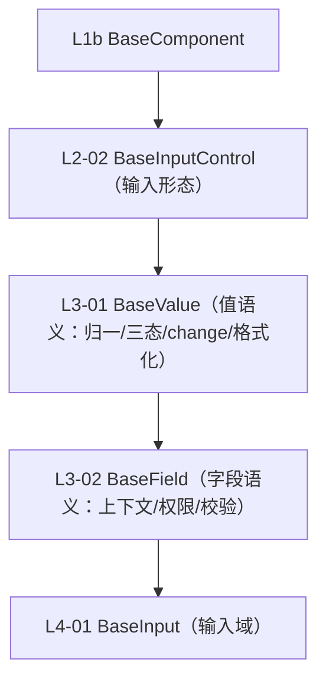

# 组件设计 · 输入组件基类

> BaseInputControl · useInputControlBase（输入型组件通用形态）

[文档首页](../../../../../文档首页.md) › [项目规划说明](../../../../../规划/项目规划说明.md) › [组件设计](../../../01_组件设计_总览.md) › 输入组件基类　|　[← 交互组件基类](../01_组件设计_交互组件基类/01_组件设计_交互组件基类.md)　[展示组件基类 →](../03_组件设计_展示组件基类/03_组件设计_展示组件基类.md)

> 可交互原型：[02_原型设计_输入组件基类.html](02_原型设计_输入组件基类.html)（演示值绑定、前后缀/前置后置插槽、清空、只读、输入法组合事件与聚焦/失焦；并与 L3 字段语义区分）

## 1. 目的与适用范围 

定义 BMS 前端 `frontend/`（`frontend-mobile/` 同款）**输入组件基类**的组件设计：`BaseInputControl` 与 `useInputControlBase`，为**所有输入型组件**（文本框、文本域、密码、数字、下拉、日期等）提供**通用输入形态**——值绑定、插槽（前缀/后缀/前置/后置）、清空、只读、输入法组合事件。它是组件设计体系 **L2 形态基类第 2 篇**，继承 [L1b 最基础组件基类](../../L1b_最基础组件基类/01_组件设计_最基础组件基类/01_组件设计_最基础组件基类.md)。

### 1.1 定位（与 L3 字段基类的区别） 

- **L2-02 只管"输入长什么样、怎么输入"**：`modelValue` 双向绑定、插槽、清空、只读、composition 事件；**不含**三态、校验触发、字段上下文、字段权限。
- **L3 `BaseValue`/`BaseField` 才提供字段语义**；因此 03 基础控件与 01 字段控件继承链为：`具体控件 → BaseInput(L4) → BaseField(L3) → BaseValue(L3) → BaseInputControl(L2) → BaseComponent(L1b) → BaseFrontend(L0)`。

上游依据：[《前端开发规范》](../../../../../规范/前端开发规范.md)（§3 分层、§5.2）、[《布局设计 · 表单页》](../../../../布局设计/08_布局设计_表单页.html)（输入控件通用形态、只读/编辑分态）、[《概要设计 · 表单定制》](../../../../概要设计/36_概要设计_表单定制.md)（基础控件类型）。

> 本篇为 **02 基础组件类 · L2 形态基类第 2 篇**。**范围边界**：通用能力归 L1b；值/字段语义归 L3；输入域细化归 [L4-01](../../L4_域基类/01_组件设计_输入域基类/01_组件设计_输入域基类.md)。

## 2. 组件清单与职责 

| 组件 / 工具 | 位置 | 职责 |
| --- | --- | --- |
| `BaseInputControl.vue` | `src/base/l2/` | 输入形态基类：受控绑定、插槽、清空、只读、composition、focus/blur |
| `useInputControlBase.ts` | `src/base/l2/` | 组合式等价能力 |

## 3. 契约（Props 与事件） 

| 属性 | 类型 | 默认 | 说明 |
| --- | --- | --- | --- |
| `modelValue` | any | `undefined` | 受控值（v-model） |
| `placeholder` | string | '' | 占位（i18n） |
| `readonly` | boolean | false | 只读（可聚焦不可改） |
| `clearable` | boolean | false | 可清空 |
| `autofocus` | boolean | false | 自动聚焦 |

| 事件 | 载荷 | 说明 |
| --- | --- | --- |
| `update:modelValue` | value | 值变化 |
| `change` | value | 值提交（输入法组合结束后） |
| `focus` / `blur` | event | 焦点 |
| `clear` | — | 清空 |

- 具名插槽：`prefix`、`suffix`、`prepend`、`append`；单根元素 + attrs 透传（继承 L1b）。

## 4. 行为与实现约定 

| 项 | 设计 |
| --- | --- |
| 受控 | 只认 `modelValue`，输入即 `update:modelValue` |
| 输入法组合 | 组合期间不抛 `change`，`compositionend` 后抛（中文输入不误触发） |
| 清空 | `clearable` 且非只读/禁用时显示；清空后值由 L3 `BaseValue` 归一（本层置空） |
| 只读 | `readonly` 可聚焦可复制；禁用用 L1b `disabled` |
| 插槽 | 前后缀/前置后置插槽，供业务图标与单位；建议单一用途 |
| 组合 | 可组合 L2-01 交互基类（如可点击输入框）；不引入字段语义 |

## 5. 场景集成 

| 场景 | 说明 |
| --- | --- |
| 03 基础控件 | 文本框/文本域/密码/数字/下拉继承链经 L3/L4 到本层 |
| 04 字段类 | 字典/日期等输入型字段 |
| 查询筛选区 | 查询条件输入控件 |

## 6. 依赖接口与上游变更 

### 6.1 上游接口与口径 

| 项 | 说明 | 目标文档 |
| --- | --- | --- |
| 分层权威 | L2 输入基类职责 | [《前端开发规范》](../../../../../规范/前端开发规范.md) 第 3 节（登记项①） |
| 输入通用形态 | 只读/编辑分态、插槽、清空 | [《布局设计 · 表单页》](../../../../布局设计/08_布局设计_表单页.html)（登记项②） |
| 基础控件类型 | `text/textarea/password/number/select…` 注册 | [《概要设计 · 表单定制》](../../../../概要设计/36_概要设计_表单定制.md)（登记项③） |
| 新增依赖 | **无** | — |

### 6.2 需登记的上游变更 

| 变更点 | 目标文档 | 内容 |
| --- | --- | --- |
| ① 输入组件基类契约 | [《前端开发规范》](../../../../../规范/前端开发规范.md) 第 3 节 | 明确 L2 输入基类只负责输入形态（受控/插槽/清空/只读/composition），不含字段语义（三态/校验/权限） |
| ② 输入控件通用形态 | [《布局设计 · 表单页》](../../../../布局设计/08_布局设计_表单页.html)「输入控件」节 | 明确前后缀插槽、清空、只读可聚焦等通用形态 |
| ③ 基础控件类型注册 | [《概要设计 · 表单定制》](../../../../概要设计/36_概要设计_表单定制.md)「组件类型与自建字段边界」节 | 明确基础输入类型由 03 基础控件提供、经 L2-02→L3→L4 继承链，映射表指向 05 |

> 按[《文档生成规范》](../../../../../规范/文档生成规范.md)「引用与追溯」节，上述变更需用户确认后由上游文档同步。

## 7. 权限 / i18n / 移动端 

- **权限**：不做权限判定（字段权限见 [L3-04](../../L3_受控值与字段基类/04_组件设计_字段权限基类/04_组件设计_字段权限基类.md)）。
- **i18n**：占位/文案经 L0 `t`。
- **移动端**：触屏输入、数字键盘类型（`inputmode`）由具体控件在移动端细化。

## 8. 性能与边界 

| 场景 | 设计 |
| --- | --- |
| 渲染 | 单根、薄基类 |
| 输入 | 受控更新；`change` 与输入法组合分离；可选去抖（由具体控件决定） |
| 边界 | 组合输入中断、清空与只读冲突、插槽冲突、`modelValue` 未更新回显、空值语义（由 L3 归一） |
| 不支持 | 通用能力（L1b）、值/字段语义（L3）、域细化（L4）、权限 |

## 9. 检查清单 

- □ 契约：`modelValue`/`placeholder`/`readonly`/`clearable`/`autofocus` + 焦点/清空事件
- □ 插槽：prefix/suffix/prepend/append；单根 + attrs 透传
- □ 输入法组合事件分离；`change` 时机正确；只读可聚焦可复制
- □ 与 L3 字段语义边界清晰（本层不含三态/校验/权限）
- □ 权限/i18n/移动端符合第 7 节；性能边界符合第 8 节
- □ 三项上游登记已确认

> 组件设计节点（L2-02）· 与[《前端开发规范》](../../../../../规范/前端开发规范.md)[《布局设计 · 表单页》](../../../../布局设计/08_布局设计_表单页.html)[《概要设计 · 表单定制》](../../../../概要设计/36_概要设计_表单定制.md)[L1b 最基础组件基类](../../L1b_最基础组件基类/01_组件设计_最基础组件基类/01_组件设计_最基础组件基类.md)[L2-01 交互组件基类](../01_组件设计_交互组件基类/01_组件设计_交互组件基类.md)[L2-03 展示组件基类](../03_组件设计_展示组件基类/03_组件设计_展示组件基类.md)[L4-01 输入域基类](../../L4_域基类/01_组件设计_输入域基类/01_组件设计_输入域基类.md)《命名规范》配套
