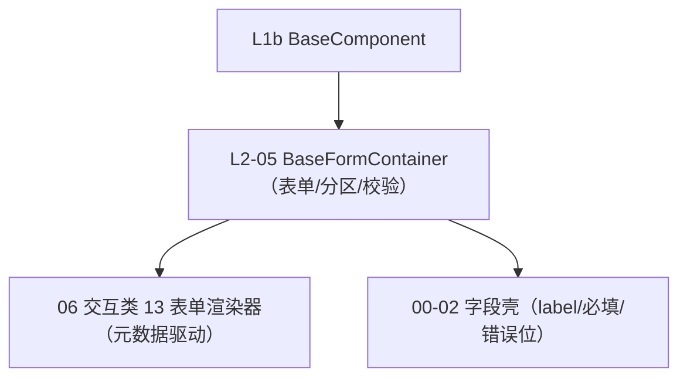

# 组件设计 · 表单容器基类

> BaseFormContainer · useFormContainerBase（表单/分区/校验汇总）

[文档首页](../../../../../文档首页.md) › [项目规划说明](../../../../../规划/项目规划说明.md) › [组件设计](../../../01_组件设计_总览.md) › 表单容器基类　|　[← 容器组件基类](../04_组件设计_容器组件基类/04_组件设计_容器组件基类.md)　[媒体组件基类 →](../06_组件设计_媒体组件基类/06_组件设计_媒体组件基类.md)

> 可交互原型：[05_原型设计_表单容器基类.html](05_原型设计_表单容器基类.html)（演示 label 位置/宽度、栅格列数、规则汇总、validate/reset/clearValidate、错误汇总与滚动定位、只读态）

## 1. 目的与适用范围 

定义 BMS 前端 `frontend/`（`frontend-mobile/` 同款）**表单容器基类**的组件设计：`BaseFormContainer` 与 `useFormContainerBase`，为**表单/分区容器**提供公共能力——label 位置与宽度、栅格列数、校验规则汇总、`validate`/`resetFields`/`clearValidate`、错误汇总与滚动定位、只读态。它是组件设计体系 **L2 形态基类第 5 篇**，继承 [L1b 最基础组件基类](../../L1b_最基础组件基类/01_组件设计_最基础组件基类/01_组件设计_最基础组件基类.md)。

### 1.1 定位 

| 职责 | 归属 |
| --- | --- |
| label 位置/宽度、栅格列数、规则汇总、validate/reset、错误汇总与滚动定位、只读态 | **本节点（L2-05）** |
| 字段级控件与值绑定 | L2-02 / L3 / L4 |
| 字段外层（label/必填/错误位） | [L3-03 字段壳基类](../../L3_受控值与字段基类/03_组件设计_字段壳基类/03_组件设计_字段壳基类.md) |
| 元数据驱动渲染（分区/明细/提交） | [06 交互类 13 表单渲染器](../../../08_交互类/12_组件设计_表单渲染器/12_组件设计_表单渲染器.md) |
| 服务端动态校验 | [《概要设计 · 表单定制》](../../../../概要设计/36_概要设计_表单定制.md) |

上游依据：[《前端开发规范》](../../../../../规范/前端开发规范.md)（§3 分层、§5.2）、[《布局设计 · 表单页》](../../../../布局设计/08_布局设计_表单页.html)（校验与提交、只读/编辑分态）、[《概要设计 · 表单定制》](../../../../概要设计/36_概要设计_表单定制.md)（服务端动态校验）。

> 本篇为 **02 基础组件类 · L2 形态基类第 5 篇**。**范围边界**：元数据取数与控件分发归 [13 表单渲染器](../../../08_交互类/12_组件设计_表单渲染器/12_组件设计_表单渲染器.md)；字段壳归 L3-03；具体控件归 L4/05/01。

## 2. 组件清单与职责 

| 组件 / 工具 | 位置 | 职责 |
| --- | --- | --- |
| `BaseFormContainer.vue` | `src/base/l2/` | 表单容器基类：label 位置/宽度、栅格、规则汇总、校验/重置、错误定位、只读态 |
| `useFormContainerBase.ts` | `src/base/l2/` | 组合式等价能力（rules 汇总、validate 代理） |

## 3. 契约（Props 与事件） 

| 属性 | 类型 | 默认 | 说明 |
| --- | --- | --- | --- |
| `model` | Record\<string, any\> | {} | 表单数据 |
| `rules` | Record\<string, Rule[]\> | {} | 校验规则（汇总，来自字段/元数据） |
| `labelPosition` | 'left' \| 'right' \| 'top' | 'right' | 标签位置 |
| `labelWidth` | string \| number | '' | 标签宽度 |
| `columns` | 1 \| 2 \| 3 | 3 | 栅格列数（响应式断点可覆写） |
| `readonly` | boolean | false | 只读态（全字段 disabled/纯文本） |
| `disabled` | boolean | false | 全局禁用 |

| 事件 | 载荷 | 说明 |
| --- | --- | --- |
| `validate` | (valid, fields) | 校验结果 |
| `submit` | model | 提交（由使用方接入） |
| `reset` | — | 重置完成 |

- 暴露方法：`validate()`、`validateField(keys)`、`resetFields()`、`clearValidate()`、`scrollToError(fieldKey?)`。

## 4. 行为与实现约定 

| 项 | 设计 |
| --- | --- |
| 规则汇总 | 字段/元数据规则汇总到容器；后端动态校验由提交时兜底 |
| 校验 | `validate()` 汇总结果并按失败字段定位滚动；`clearValidate` 清错误 |
| 重置 | `resetFields()` 复位初始值（编辑态复位到拉取值） |
| 只读态 | 全字段只读（不区分字段 `editable`，见 [L3-04](../../L3_受控值与字段基类/04_组件设计_字段权限基类/04_组件设计_字段权限基类.md)） |
| 栅格 | 主表 3 列、窄容器单列、长字段跨整行；标签位置随断点 |
| 提交 | 与渲染器/页面协作，`saveLoading` 防重复；整表单事务由使用方保证 |

## 5. 场景集成 

| 场景 | 说明 |
| --- | --- |
| 表单页 | 主表分区（配合 [13 表单渲染器](../../../08_交互类/12_组件设计_表单渲染器/12_组件设计_表单渲染器.md)） |
| 弹窗/抽屉表单 | 窄容器单列表单（配合 06 交互类 01） |
| 查询筛选区 | 查询条件的轻量表单容器 |

## 6. 依赖接口与上游变更 

### 6.1 上游接口与口径 

| 项 | 说明 | 目标文档 |
| --- | --- | --- |
| 分层权威 | L2 表单容器基类职责 | [《前端开发规范》](../../../../../规范/前端开发规范.md) 第 3 节（登记项①） |
| 校验与提交 | 前端校验与提交、只读分态 | [《布局设计 · 表单页》](../../../../布局设计/08_布局设计_表单页.html)（登记项②） |
| 动态校验 | 服务端动态校验一致性 | [《概要设计 · 表单定制》](../../../../概要设计/36_概要设计_表单定制.md)（登记项③） |
| 新增依赖 | **无**：复用 `el-form` | — |

### 6.2 需登记的上游变更 

| 变更点 | 目标文档 | 内容 |
| --- | --- | --- |
| ① 表单容器基类契约 | [《前端开发规范》](../../../../../规范/前端开发规范.md) 第 3 节 | 明确 L2 表单容器（label 位置/宽度、栅格、规则汇总、validate/reset/clearValidate、错误定位、只读态） |
| ② 校验与提交 | [《布局设计 · 表单页》](../../../../布局设计/08_布局设计_表单页.html)「校验与提交」节 | 明确错误汇总与滚动定位、只读态、栅格与标签位置 |
| ③ 服务端动态校验 | [《概要设计 · 表单定制》](../../../../概要设计/36_概要设计_表单定制.md)「服务端动态校验」节 | 前端规则与后端一致、后端强制；错误返回结构供定位 |

> 按[《文档生成规范》](../../../../../规范/文档生成规范.md)「引用与追溯」节，上述变更需用户确认后由上游文档同步。

## 7. 权限 / i18n / 移动端 

- **权限**：字段权限由 [L3-04](../../L3_受控值与字段基类/04_组件设计_字段权限基类/04_组件设计_字段权限基类.md) 判定后传入（不渲染/disabled）。
- **i18n**：错误文案按 `error.*` 映射（i18n）。
- **移动端**：单列、label 顶部、操作按钮吸附。

## 8. 性能与边界 

| 场景 | 设计 |
| --- | --- |
| 校验 | 规则汇总一次构建；异步校验并发；失败定位滚动 |
| 大表单 | 分区懒渲染；重字段懒加载 |
| 边界 | 规则与元数据不同步、异步唯一性校验竞态、409 版本冲突、只读态与字段 editable 混淆、错误定位失效、重置初始值来源、跨分区校验 |
| 不支持 | 元数据取数/分发（13）、字段壳（L3-03）、控件（L2-02/L3/L4）、后端强校验 |

## 9. 检查清单 

- □ 契约：`model`/`rules`/`labelPosition`/`labelWidth`/`columns`/`readonly`/`disabled`
- □ 方法：validate/validateField/resetFields/clearValidate/scrollToError
- □ 规则汇总、错误汇总与滚动定位、只读态、栅格与标签位置
- □ 与 13 渲染器、L3-03 字段壳边界清晰
- □ 权限/i18n/移动端符合第 7 节；性能边界符合第 8 节
- □ 三项上游登记已确认

> 组件设计节点（L2-05）· 与[《前端开发规范》](../../../../../规范/前端开发规范.md)[《布局设计 · 表单页》](../../../../布局设计/08_布局设计_表单页.html)[《概要设计 · 表单定制》](../../../../概要设计/36_概要设计_表单定制.md)[L1b 最基础组件基类](../../L1b_最基础组件基类/01_组件设计_最基础组件基类/01_组件设计_最基础组件基类.md)[L2-04 容器组件基类](../04_组件设计_容器组件基类/04_组件设计_容器组件基类.md)[L2-06 媒体组件基类](../06_组件设计_媒体组件基类/06_组件设计_媒体组件基类.md)[L3-03 字段壳基类](../../L3_受控值与字段基类/03_组件设计_字段壳基类/03_组件设计_字段壳基类.md)[06 交互类 13 表单渲染器](../../../08_交互类/12_组件设计_表单渲染器/12_组件设计_表单渲染器.md)《命名规范》配套
