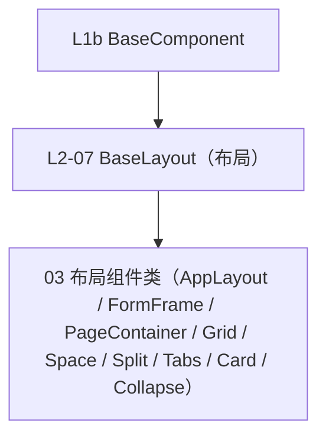

# 组件设计 · 布局组件基类

> BaseLayout · useLayoutBase（布局组件通用）

[文档首页](../../../../../文档首页.md) › [项目规划说明](../../../../../规划/项目规划说明.md) › [组件设计](../../../01_组件设计_总览.md) › 布局组件基类　|　[← 媒体组件基类](../06_组件设计_媒体组件基类/06_组件设计_媒体组件基类.md)　[受控值基类 →](../../L3_受控值与字段基类/01_组件设计_受控值基类/01_组件设计_受控值基类.md)

> 可交互原型：[07_原型设计_布局组件基类.html](07_原型设计_布局组件基类.html)（演示栅格/断点、间距/对齐、布局容器根元素与透传，供 03 布局组件类继承）

## 1. 目的与适用范围 

定义 BMS 前端 `frontend/`（`frontend-mobile/` 同款）**布局组件基类**的组件设计：`BaseLayout` 与 `useLayoutBase`，为**所有布局组件**（主框架布局壳、表单框架壳、页面容器、栅格、间距/分割线、分栏、内容页签、卡片、折叠面板等）提供公共能力——栅格与响应式断点、间距/对齐令牌、布局根元素与 attrs 透传、显示/隐藏。它是组件设计体系 **L2 形态基类第 7 篇**，继承 [L1b 最基础组件基类](../../L1b_最基础组件基类/01_组件设计_最基础组件基类/01_组件设计_最基础组件基类.md)。

### 1.1 定位 

| 职责 | 归属 |
| --- | --- |
| 栅格/断点、间距/对齐令牌、布局根元素与透传、显隐 | **本节点（L2-07）** |
| 通用字段/方法（日志/配置/i18n/生命周期） | [L0 总基类](../../L0_总基类/01_组件设计_总基类/01_组件设计_总基类.md) |
| 透传/尺寸/密度/主题/i18n/可访问性 | [L1b 最基础组件基类](../../L1b_最基础组件基类/01_组件设计_最基础组件基类/01_组件设计_最基础组件基类.md) |
| 容器语义（滚动/懒加载/虚拟等） | [L2-04 容器组件基类](../04_组件设计_容器组件基类/04_组件设计_容器组件基类.md) |
| 具体布局组件 | 03 布局组件类 |

上游依据：[《前端开发规范》](../../../../../规范/前端开发规范.md)「前端基础类体系」节（§3.4 L2）、[《布局设计 · 设计令牌》](../../../../布局设计/02_布局设计_设计令牌.html)（栅格/断点/间距令牌）、[《布局设计 · 响应式适配》](../../../../布局设计/11_布局设计_响应式适配.html)（断点）。

> 本篇为 **02 基础组件类 · L2 形态基类第 7 篇**。**范围边界**：通用能力归 L0/L1b；容器语义归 L2-04/L2-05；具体布局组件归 03 布局组件类（本节点被其继承）。

## 2. 组件清单与职责 

| 组件 / 工具 | 位置 | 职责 |
| --- | --- | --- |
| `BaseLayout.vue` | `src/base/l2/` | 布局基类：栅格与断点、间距/对齐、布局根元素与透传、显隐 |
| `useLayoutBase.ts` | `src/base/l2/` | 组合式：断点监听、栅格跨度计算、间距/对齐令牌 |

## 3. 契约（Props 与能力） 

| 属性 | 类型 | 默认 | 说明 |
| --- | --- | --- | --- |
| `span` | number \| object | 24 | 栅格跨度（响应式可传 `{ xs, sm, md, lg, xl }`） |
| `offset` | number | 0 | 偏移 |
| `gap` | 'none' \| 'small' \| 'default' \| 'large' | 'default' | 间距（令牌） |
| `align` | 'start' \| 'center' \| 'end' \| 'stretch' | 'stretch' | 交叉轴对齐 |
| `justify` | 'start' \| 'center' \| 'end' \| 'space-between' \| 'space-around' | 'start' | 主轴对齐 |
| `wrap` | boolean | true | 换行 |
| `responsive` | boolean | true | 启用断点响应 |

| 能力 | 说明 |
| --- | --- |
| 断点 | 监听断点（xs/sm/md/lg/xl），按令牌切换跨度/方向/标签位置 |
| 令牌 | 间距/对齐/尺寸只消费设计令牌 |
| 根元素 | 单根元素 + attrs 透传（继承 L1b） |
| 显隐 | `visible` 控制渲染（继承 L1b） |

## 4. 行为与实现约定 

| 项 | 设计 |
| --- | --- |
| 栅格 | 24 栅格 + `span/offset`；响应式对象按断点取跨度 |
| 断点 | 与[《布局设计 · 响应式适配》](../../../../布局设计/11_布局设计_响应式适配.html)一致；窄屏自动转单列/纵向 |
| 间距/对齐 | 令牌驱动，避免硬编码 px |
| 嵌套 | 支持布局嵌套；避免过深（建议 ≤3 层） |
| 依赖方向 | 只依赖 L0/L1b；被 03 布局组件类继承 |

## 5. 场景集成 

| 场景 | 说明 |
| --- | --- |
| 03 布局组件类 | 主框架/表单框架/页面容器/栅格/分栏/卡片等继承本层 |
| 响应式页面 | 断点驱动的列数与方向切换 |

## 6. 依赖接口与上游变更 

### 6.1 上游接口与口径 

| 项 | 说明 | 目标文档 |
| --- | --- | --- |
| 分层权威 | L2 布局基类职责 | [《前端开发规范》](../../../../../规范/前端开发规范.md)「前端基础类体系」节（登记项①） |
| 栅格/断点令牌 | 栅格、断点、间距令牌 | [《布局设计 · 设计令牌》](../../../../布局设计/02_布局设计_设计令牌.html)（登记项②） |
| 响应式断点 | 断点定义与策略 | [《布局设计 · 响应式适配》](../../../../布局设计/11_布局设计_响应式适配.html)（登记项③） |
| 新增依赖 | **无**：复用 `el-row`/`el-col` 或自绘 | — |

### 6.2 需登记的上游变更 

| 变更点 | 目标文档 | 内容 |
| --- | --- | --- |
| ① 布局组件基类契约 | [《前端开发规范》](../../../../../规范/前端开发规范.md)「前端基础类体系」节 | L2 形态基类新增**布局**一类（`BaseLayout`）：栅格/断点、间距/对齐令牌、布局根元素与透传；03 布局组件类继承 |
| ② 栅格与断点令牌 | [《布局设计 · 设计令牌》](../../../../布局设计/02_布局设计_设计令牌.html)「栅格与间距令牌」节 | 明确 24 栅格、断点（xs/sm/md/lg/xl）与间距令牌，布局组件只消费令牌 |
| ③ 响应式断点 | [《布局设计 · 响应式适配》](../../../../布局设计/11_布局设计_响应式适配.html)「断点」节 | 明确断点阈值与窄屏布局策略，供布局基类消费 |

> 按[《文档生成规范》](../../../../../规范/文档生成规范.md)「引用与追溯」节，上述变更需用户确认后由上游文档同步。

## 7. 权限 / i18n / 移动端 

- **权限**：布局不做权限判定；区域内动作按动作权限显示。
- **i18n**：布局内文案由使用方提供。
- **移动端**：断点驱动单列/纵向；安全区适配。

## 8. 性能与边界 

| 场景 | 设计 |
| --- | --- |
| 渲染 | 薄基类；断点监听去抖 |
| 边界 | 嵌套过深、断点抖动、响应式跨度与容器列数冲突、间距令牌缺失回退、多根元素透传 |
| 不支持 | 容器语义（L2-04/L2-05）、具体布局组件（03）、字段/展示语义 |

## 9. 检查清单 

- □ 契约：`span`/`offset`/`gap`/`align`/`justify`/`wrap`/`responsive`
- □ 断点与栅格、间距/对齐令牌、根元素透传与显隐
- □ 继承 L0/L1b，被 03 布局组件类继承；依赖方向单向
- □ 权限/i18n/移动端符合第 7 节；边界符合第 8 节
- □ 三项上游登记已确认

> 组件设计节点（L2-07）· 与[《前端开发规范》](../../../../../规范/前端开发规范.md)[《布局设计 · 设计令牌》](../../../../布局设计/02_布局设计_设计令牌.html)[《布局设计 · 响应式适配》](../../../../布局设计/11_布局设计_响应式适配.html)[L1b 最基础组件基类](../../L1b_最基础组件基类/01_组件设计_最基础组件基类/01_组件设计_最基础组件基类.md)[L2-04 容器组件基类](../04_组件设计_容器组件基类/04_组件设计_容器组件基类.md)[L3-01 受控值基类](../../L3_受控值与字段基类/01_组件设计_受控值基类/01_组件设计_受控值基类.md)《命名规范》配套
