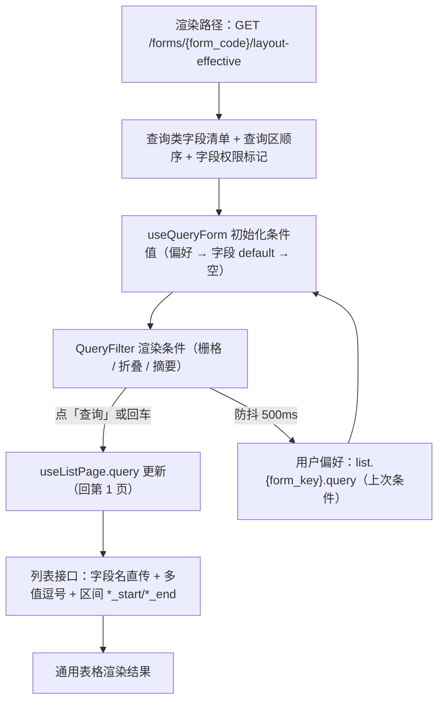

# 组件设计 · 查询筛选区

> QueryFilter · QueryField · useQueryForm · useQueryScheme · 查询方案

[文档首页](../../../../文档首页.md) › [项目规划说明](../../../../规划/项目规划说明.md) › [组件设计](../../01_组件设计_总览.md) › 查询筛选区　|　[← 通用表格](../01_组件设计_通用表格/01_组件设计_通用表格.md)　[状态标签与描述列表 →](../03_组件设计_状态标签与描述列表/03_组件设计_状态标签与描述列表.md)

> 可交互原型：[11_原型设计_查询筛选区.html](02_原型设计_查询筛选区.html)（演示基础条件区、折叠与窄屏、条件控件矩阵、高级查询入口与条件摘要、查询方案的保存与应用）

## 1. 目的与适用范围 <a id="purpose"></a>

定义 BMS 前端 `frontend/` **查询筛选区**的组件设计：条件容器 `QueryFilter`、按字段类型分发的条件渲染器 `QueryField`、条件面板 `QuerySchemePanel`，以及组合式函数 `useQueryForm`（条件值、默认值、摘要、重置、参数序列化）与 `useQueryScheme`（查询方案 CRUD）。适用于管理端全部列表页（用户、角色、菜单、字典、公告、日志、任务等）与主从模块的明细筛选场景。

本节对应[《项目规划说明》](../../../../规划/项目规划说明.md)前端与「前端页面清单与菜单机制」章节；页面形态依据[《布局设计 · 列表页》](../../../布局设计/07_布局设计_列表页.html)「筛选区」节（label 上方、一行最多 3 项、可折叠、查询/重置/展开按钮同排）与[《布局设计 · 表单定制》](../../../布局设计/14_布局设计_表单定制.html)「查询表单区与明细区配置」「渲染规则（三态共用/回退/权限叠加）」节（查询表单区字段与顺序、三端一致）；窄屏口径依据[《布局设计 · 响应式适配》](../../../布局设计/11_布局设计_响应式适配.html)（< 1024px 默认折叠，仅保留关键字 + 查询/重置）；上游设计依据[《概要设计 · 表单定制》](../../../概要设计/36_概要设计_表单定制.md)（查询表单区配置与「查询类」字段元数据）、[《概要设计 · 菜单管理》](../../../概要设计/07_概要设计_菜单管理.md)（`sys_field` 字段定义与 `sys_role_field` 字段权限）、[《概要设计 · 字典管理》](../../../概要设计/09_概要设计_字典管理.md)（字典取数与高级查询、`sys_query_scheme` 查询方案）、[《概要设计 · 用户喜好》](../../../概要设计/04_概要设计_用户喜好.md)（`list.{form_key}` 偏好）、[《概要设计 · 导入导出》](../../../概要设计/19_概要设计_导入导出.md)（导出参数与列表筛选一致）；接口口径依据[《API接口规范》](../../../../规范/API接口规范.md)「参数与分页」节与[《架构设计 · 接口与集成》](../../../架构设计/06_架构设计_接口与集成.md)「接口规范」节；权限依据[《架构设计 · 子系统 · 权限计算引擎》](../../../架构设计/11_架构设计_子系统_权限计算引擎.md)「业务与动作权限码清单」节与[《英文简称规范》](../../../../规范/英文简称规范.md)「动作码简称」节；协作节点为[请求封装](../../04_基础类/01_组件设计_请求封装/01_组件设计_请求封装.md)（`useListPage` 取数与回第 1 页）、[通用表格](../01_组件设计_通用表格/01_组件设计_通用表格.md)（表格区与「搜索无结果」重置入口）、[字典字段](../../01_字段类/01_组件设计_字典字段/01_组件设计_字典字段.md)（字典下拉与高级查询抽屉）、[日期时间字段](../../01_字段类/02_组件设计_日期时间字段/02_组件设计_日期时间字段.md)（日期范围）、[树选择字段](../../01_字段类/04_组件设计_树选择字段/04_组件设计_树选择字段.md)（部门树选择与含下级）、[开关与枚举字段](../../01_字段类/08_组件设计_开关与枚举字段/08_组件设计_开关与枚举字段.md)（是/否与枚举条件）、[权限指令](../../04_基础类/02_组件设计_权限指令/02_组件设计_权限指令.md)（字段可见性）、[格式化工具](../../04_基础类/03_组件设计_格式化工具/03_组件设计_格式化工具.md)（条件值展示格式化）。

> 本篇为组件设计体系展示类第 02 篇。**范围边界**：表格渲染、分页与排序归[通用表格](../01_组件设计_通用表格/01_组件设计_通用表格.md)；查询执行与列表状态归[请求封装](../../04_基础类/01_组件设计_请求封装/01_组件设计_请求封装.md) `useListPage`；工具栏（新增/导出/自定义列）归列表页自身；字典高级查询的**条件构建与执行**归[字典字段](../../01_字段类/01_组件设计_字典字段/01_组件设计_字典字段.md)「高级查询」节，本节点只负责**入口挂载与结果落地**。

## 2. 组件清单与职责 <a id="components"></a>

| 组件 / 工具 | 位置 | 职责 |
| --- | --- | --- |
| `QueryFilter.vue` | `src/components/query/` | 条件容器：栅格布局（一行 3 项）、折叠/展开、查询/重置按钮、条件摘要 chips、方案入口挂载、窄屏降级 |
| `QueryField.vue` | `src/components/query/` | 条件渲染器：按字段类型分发到具体控件（输入框/字典下拉/日期范围/树选择/数值区间/开关/枚举），并携带高级查询入口 |
| `QuerySchemePanel.vue` | `src/components/query/` | 查询方案面板：应用方案、保存当前条件、另存为、设默认、重命名、删除、恢复默认 |
| `useQueryForm.ts` | `src/utils/useQueryForm.ts` | 条件状态：初值（元数据 default + 偏好）、条件摘要计算、重置、参数序列化、失效条件剔除、条件偏好读写 |
| `useQueryScheme.ts` | `src/utils/useQueryScheme.ts` | 查询方案：列表拉取、应用（回填条件）、保存/另存/设默认/删除，走通用查询方案接口 |

- 命名遵循[《命名规范》](../../../../规范/命名规范.md)：组件 PascalCase、组合式函数 `use` + 名词、目录遵循[《前端开发规范》](../../../../规范/前端开发规范.md)（`src/components/` 下按域分目录）。
- 移动端（frontend-mobile）不复用上述 PC 组件，按「筛选抽屉」简化实现（见第 11 节）。

## 3. 条件模型与字段映射 <a id="model"></a>

```typescript
interface QueryCondition {
  field: string;                 // 字段 key（与后端字段同名）
  operator: 'eq' | 'ne' | 'contains' | 'starts_with' | 'between'
          | 'gt' | 'lt' | 'is_null' | 'not_null' | 'in' | 'not_in';
  value: string | number | boolean | [any, any] | any[] | null;
  label?: string;                // 摘要展示用（字段名 + 操作符 + 值文本）
}
```

操作符集与[字典字段](../../01_字段类/01_组件设计_字典字段/01_组件设计_字典字段.md)「高级查询」节的条件组**同一套白名单**；前端条件控件只暴露常用子集（`eq`、`in`、`contains`、`between`、`is_null`），高级操作符由字典高级查询（[字典字段](../../01_字段类/01_组件设计_字典字段/01_组件设计_字典字段.md)）承载。

字段类型 → 控件与查询语义（默认映射，可由字段属性覆盖）：

| 字段类型 | 控件 | 默认操作符 | 参数序列化 |
| --- | --- | --- | --- |
| `text` / `longtext` | 输入框 | `contains` | `field=关键字` |
| 关键字（关键字条件） | 输入框（**恒为第一项**） | `contains` | `keyword=关键字`（跨字段模糊，后端定义命中列） |
| `select`（字典单选） | 字典下拉（02 `DictSelect`） | `eq` | `field=value` |
| `multi_select`（字典多选） | 多选下拉 | `in` | `field=v1,v2`（命中任一） |
| 枚举（自定义选项集） | 下拉（[开关与枚举字段](../../01_字段类/08_组件设计_开关与枚举字段/08_组件设计_开关与枚举字段.md)形态） | `eq` / `in` | `field=value` / `field=v1,v2` |
| `switch`（布尔） | 下拉「全部 / 是 / 否」 | `eq` | `field=1` / `field=0`（未选不传） |
| `number` / 金额 | 数值区间（两个输入框） | `between` | `field_start=n1&field_end=n2`（单边可空） |
| `datetime` / 日期 | 日期范围（03 `DateRangeField`，UTC） | `between` | `field_start=ISO&field_end=ISO`（对齐 [日期时间字段](../../01_字段类/02_组件设计_日期时间字段/02_组件设计_日期时间字段.md) `*_start`/`*_end` 口径） |
| 部门 / 组织 | 树选择（05 `DeptTreeSelect`）+「含下级」 | `eq` | `field_id=xx&include_children=true` |
| `file` / 富文本等 | 默认不可查（可在表单定制声明可查并指定控件） | — | — |

- **查询类字段判定**：由表单元数据声明（`sys_field.type` + 表单定制的查询区配置）；未声明时按上表「可查类型」默认判定，`file` 等默认不可查。判定与下发口径的登记见[第 10 节](#api)。
- **条件顺序**：按表单定制查询表单区配置的字段顺序；未配置时取字段 `sort` 升序（[《布局设计 · 表单定制》](../../../布局设计/14_布局设计_表单定制.html)「查询表单区与明细区配置」节）。
- **不可见即不可查**：`visible=false` 的字段不下发条件（后端读时过滤，前端不感知）。

## 4. 数据流与取数 <a id="dataflow"></a>



| 项 | 设计 |
| --- | --- |
| 取数归属 | 条件值由 `useQueryForm` 持有并写入 `useListPage` 的 `query`（[请求封装](../../04_基础类/01_组件设计_请求封装/01_组件设计_请求封装.md)）；组件**不自行发列表请求** |
| 查询触发 | 仅「查询」按钮与文本条件回车触发；条件变更**不自动查询**（[《布局设计 · 列表页》](../../../布局设计/07_布局设计_列表页.html)） |
| 回第 1 页 | 查询/重置后 `page=1`；分页、排序变化保留筛选条件（[请求封装](../../04_基础类/01_组件设计_请求封装/01_组件设计_请求封装.md) `onPageChange`/`onSortChange`） |
| 条件复用 | 导出参数与列表筛选/排序一致（导入导出节点）；查询方案应用同样写入同一份条件 |

## 5. 栅格与折叠 <a id="layout"></a>

| 项 | 设计 |
| --- | --- |
| 栅格 | `label` 在字段上方（`label-position="top"`）；宽屏一行 **3 项**（栅格三列），跨列由表单定制的跨列配置决定 |
| 折叠阈值 | 条件 **≤ 3 项不折叠**（一行展示）；**> 3 项默认折叠**为一行，其余隐藏 |
| 展开/收起 | 行末「▾ / ▴」小图标（tooltip 走 i18n）；展开后每行 3 项；**折叠只改变行数，按钮位置不动** |
| 按钮排布 | 「查询」（primary）+「重置」（次按钮）+「▾」横排在条件**第一行行末**、同行垂直居中 |
| 关键字 | 存在关键字条件时**恒为第一项**（不参与折叠隐藏） |
| 窄屏 | `< 1024px` 默认折叠，**仅保留关键字 + 查询/重置**（[《布局设计 · 响应式适配》](../../../布局设计/11_布局设计_响应式适配.html)）；`< 768px` 单列（移动端为独立工程，见第 11 节） |
| 布局来源 | 查询表单区字段与顺序来自表单定制（三级解析 + 权限叠加，权限优先）；渲染器遇未知字段引用**跳过不阻断** |

## 6. 查询、重置与条件持久化 <a id="query-reset"></a>

### 6.1 查询与重置 <a id="reset"></a>

| 动作 | 行为 |
| --- | --- |
| 查询 | 收集当前条件 → 序列化为请求参数 → 写入 `useListPage.query` → 回第 1 页并请求；校验失败（如区间起 > 止）内联提示且不提交 |
| 回车 | 文本类条件（含关键字）回车等价点「查询」；下拉/日期等非文本控件回车不触发 |
| 重置 | **恢复字段默认值**（元数据 `default`，无默认则为空）→ 回第 1 页 → **立即重新查询**；同时清除条件偏好中的该项 |
| 空条件 | 未填条件不参与请求（不传空串/null）；「未选」与「选空值」由控件自身区分（开关的「全部」= 不传） |

### 6.2 条件持久化（`list.{form_key}.query`） <a id="persist"></a>

条件值随用户偏好持久化（[《概要设计 · 用户喜好》](../../../概要设计/04_概要设计_用户喜好.md)「列表页个性化」，键 `list.{form_key}`，与列显隐/顺序/宽度、每页条数、密度同一份 JSON）：

```json
{
  "query": { "keyword": "zhang", "status": "enabled", "created_start": "2026-09-01T00:00:00Z", "created_end": "2026-09-12T23:59:59Z" },
  "columns": [{ "prop": "username", "visible": true, "order": 1, "width": 180 }],
  "pageSize": 20,
  "density": "default"
}
```

| 项 | 设计 |
| --- | --- |
| 写入时机 | 点「查询」成功后防抖 500ms 写入（`PUT /preferences/{key}`）；「重置」清除 query 子键 |
| 读取时机 | 进入列表页时读取（`GET /preferences/{key}`，缺失回退 localStorage 副本 `bms:table:{form_key}`） |
| 失效剔除 | 偏好中的条件字段在启动时逐项校验：字段已停用/不可见、选项值失效（字典条目删除）、不是当前表单的查询类字段 → **剔除该条件**并在下一次查询时静默生效（连续剔除 ≥ 1 项时提示一次「部分筛选条件已失效，已忽略」） |
| 不持久化项 | 排序列、页码、选中行、展开状态（会话态，见 [通用表格](../01_组件设计_通用表格/01_组件设计_通用表格.md)） |

## 7. 条件摘要 <a id="summary"></a>

- 「查询」执行后，条件区下方渲染**条件摘要 chips**（仅展示**已生效**条件），形如 `状态: 启用 ×`、`创建时间: 2026-09-01 ~ 2026-09-12 ×`、`部门: 研发中心（含下级） ×`。
- 单个 chip 的 `×` 移除该条件 → **回第 1 页并立即重查**；摘要区右侧提供「清空全部」（等价重置）。
- 条件值展示统一走[格式化工具](../../04_基础类/03_组件设计_格式化工具/03_组件设计_格式化工具.md)（日期/金额/布尔文案），字典与枚举值翻译复用 [字典字段](../../01_字段类/01_组件设计_字典字段/01_组件设计_字典字段.md)/[开关与枚举字段](../../01_字段类/08_组件设计_开关与枚举字段/08_组件设计_开关与枚举字段.md)口径（不逐条请求）。
- 摘要为空时不渲染该区域；窄屏下摘要折叠为一行横向滚动。

## 8. 高级查询集成（字典类条件） <a id="advanced"></a>

| 项 | 设计 |
| --- | --- |
| 入口 | 字典类条件（`select` / `multi_select` / 枚举引用字典）控件右侧提供**漏斗图标**（tooltip 走 i18n）；无字典条件时不渲染 |
| 面板 | 打开[字典字段](../../01_字段类/01_组件设计_字典字段/01_组件设计_字典字段.md)「高级查询」节的 `DictAdvancedQuery` 抽屉/内联面板，条件组与查询提供者能力由 [字典字段](../../01_字段类/01_组件设计_字典字段/01_组件设计_字典字段.md)承载 |
| 落地一：取项回填 | 用户在高级查询里筛出字典条目 → 应用 → 回填该条件值（单选填一项、多选填多项），随后按普通条件提交 |
| 落地二：筛选注入 | 以字典字段为业务维度构造复杂条件 → 应用 → 作为该字段的筛选参数注入（`value in (...)` 或多条件组合），摘要区展示为「高级条件」chip（可整体移除） |
| 状态回显 | 高级条件已在摘要区可见并可移除；重新打开面板时按已应用条件回填 |
| 界面定制 | 高级查询界面配置（可选属性字段、操作符集合、默认方案、结果列）复用表单定制的 `layout_config`（[《概要设计 · 表单定制》](../../../概要设计/36_概要设计_表单定制.md)），本节点只提供入口 |

## 9. 查询方案 <a id="scheme"></a>

### 9.1 定位与作用域 <a id="scheme-scope"></a>

查询方案 = 「一组筛选条件 + 展示配置」的命名集合，供用户一键复用（如「我负责的启用中用户」「本月待审单据」）。存储复用并**泛化**[《概要设计 · 字典管理》](../../../概要设计/09_概要设计_字典管理.md)的 `sys_query_scheme`：

| 字段 | 列表筛选方案取值 | 说明 |
| --- | --- | --- |
| `target` | `business` | `items`（字典条目）/ `business`（列表筛选，本节点） |
| `field_key` | `form_key`（如 `user_form`） | 列表页标识；`dict_type` 置空 |
| `dict_type` / `provider_key` | `NULL` | 列表筛选不使用字典类型与查询提供者 |
| `conditions` | 条件组 JSON（与 [字典字段](../../01_字段类/01_组件设计_字典字段/01_组件设计_字典字段.md)同结构） | `{logic:'AND', children:[{field, operator, value}]}` |
| `params` / `layout` | 可选 | 额外筛选参数（如 `include_children`）与展示配置（列/条数，可选） |
| `scope` / `owner_id` / `is_default` / `shared` | `user` / `tenant` / `platform` | 个人方案（`owner_id`=当前用户）/ 租户方案 / 平台方案；三级优先级 **个人 > 租户 > 平台** |

- **权限**：个人方案（新增/修改/删除/应用）**登录即可**；租户/共享方案维护需动作权限码 `query:scheme`（新登记，见[第 10 节](#api)）。
- 三级优先级与「恢复默认」逐级回退口径与[字典字段](../../01_字段类/01_组件设计_字典字段/01_组件设计_字典字段.md)「高级查询」节一致。

### 9.2 操作 <a id="scheme-ops"></a>

| 操作 | 行为 |
| --- | --- |
| 应用 | 载入方案 `conditions` → 覆盖当前条件 → 回第 1 页并查询；摘要区显示「方案：xxx」标记 |
| 保存 | 以当前条件覆盖所选方案（个人方案直接保存；租户/平台方案需权限码，且不可直接覆盖，改为「另存为」） |
| 另存为 | 以当前条件新建方案（命名 + 作用域选择：个人/租户（需权限）/平台（需权限）+ 是否共享） |
| 设默认 | 设为进入该列表页时自动应用的方案（个人默认；租户/平台默认需权限码） |
| 重命名 / 删除 | 个人方案本人可改可删；租户/平台方案需权限码；删除后若为默认则回退上一级 |
| 恢复默认 | 按三级优先级回退；无任何方案时使用字段默认值（等价重置） |
| 实时预览 | 面板内展示方案的条件摘要（复用[第 7 节](#summary) chips 渲染） |

- 方案入口位于**条件区右侧**（图标 + tooltip「查询方案」），下拉面板列出可用方案（标注 个人/租户/平台 与默认标记）。

## 10. 依赖接口与上游变更 <a id="api"></a>

### 10.1 上游接口与口径 <a id="api-contract"></a>

| 项 | 说明 | 目标文档 |
| --- | --- | --- |
| 查询字段元数据 | 渲染路径 `GET /forms/{form_code}/layout-effective` 下发查询类字段清单、顺序、控件、操作符与默认值 | [《概要设计 · 表单定制》](../../../概要设计/36_概要设计_表单定制.md)（登记项③） |
| 字段定义与权限 | 字段实体 `sys_field`（type/sort/status）与 `sys_role_field`（visible/editable） | [《概要设计 · 菜单管理》](../../../概要设计/07_概要设计_菜单管理.md) |
| 筛选参数序列化 | 字段名直传；多值逗号分隔（`in` 语义）；区间 `*_start` / `*_end`；布尔 `1/0`；排序 `order_by`/`order` | [《API接口规范》](../../../../规范/API接口规范.md)「参数与分页」节、[《架构设计 · 接口与集成》](../../../架构设计/06_架构设计_接口与集成.md)「接口规范」节（登记项③含参数口径） |
| 条件持久化 | `list.{form_key}.query` 子键结构（与列配置同一份偏好 JSON） | [《概要设计 · 用户喜好》](../../../概要设计/04_概要设计_用户喜好.md)（登记项④） |
| 查询方案 | 泛化 `sys_query_scheme`（`target=business`、`field_key=form_key`、`dict_type` 可空）与通用方案接口 | [《概要设计 · 字典管理》](../../../概要设计/09_概要设计_字典管理.md)（登记项①） |
| 方案权限码 | 新增业务码 `query`（列表查询方案管理）+ 动作码 `scheme` → 权限码 `query:scheme` | [《架构设计 · 子系统 · 权限计算引擎》](../../../架构设计/11_架构设计_子系统_权限计算引擎.md)「业务与动作权限码清单」节、[《英文简称规范》](../../../../规范/英文简称规范.md)「动作码简称」节（登记项②） |
| 字典取数与翻译 | 字典条件的候选项与 label 翻译 | [《概要设计 · 字典管理》](../../../概要设计/09_概要设计_字典管理.md)、[字典字段](../../01_字段类/01_组件设计_字典字段/01_组件设计_字典字段.md) |
| 高级查询 | 条件组、查询提供者与执行引擎 | [字典字段](../../01_字段类/01_组件设计_字典字段/01_组件设计_字典字段.md)「高级查询」节 |
| 导出联动 | 导出参数与列表筛选/排序一致 | [《概要设计 · 导入导出》](../../../概要设计/19_概要设计_导入导出.md) |
| 新增依赖 | **无**：Element Plus 内置 `el-form` / `el-popover` / `el-drawer` / `el-tag` 覆盖全部能力 | — |

### 10.2 需登记的上游变更 <a id="api-upstream"></a>

| 变更点 | 目标文档 | 内容 |
| --- | --- | --- |
| ① 泛化 `sys_query_scheme` | [《概要设计 · 字典管理》](../../../概要设计/09_概要设计_字典管理.md)「核心表」「接口清单」节 | 表语义由「字典高级查询方案」泛化为「查询方案」：`target=items\|business`；`business` 时 `field_key=form_key`、`dict_type`/`provider_key` 为空；索引补 `(target, field_key, scope, owner_id)`；新增通用接口 `GET/POST/PUT/DELETE /api/v1/query-schemes`（按 `target` 区分字典方案与列表方案），字典侧原 `/dicts/query-schemes` 保留兼容 |
| ② 新增方案权限码 | [《架构设计 · 子系统 · 权限计算引擎》](../../../架构设计/11_架构设计_子系统_权限计算引擎.md)「业务与动作权限码清单」节；[《英文简称规范》](../../../../规范/英文简称规范.md)「动作码简称」节 | 业务清单新增 `query`（列表查询方案管理，默认归属系统管理员）；动作清单新增 `scheme`（查询方案管理：租户/共享方案维护），典型权限码 `query:scheme`（个人方案免权限码）；既有 `dict:query-scheme` 保持不变（字典高级查询方案存量动作码） |
| ③ 「查询类」字段判定与下发 | [《概要设计 · 表单定制》](../../../概要设计/36_概要设计_表单定制.md)「布局定制」「数据模型」节；[《API接口规范》](../../../../规范/API接口规范.md)「参数与分页」节 | 明确查询类字段判定（字段 `type` → 是否可查 + 控件 + 操作符 + 默认值 + 顺序），并在 `layout-effective` 响应中下发查询区结构；同时明确筛选参数序列化口径（多值逗号分隔、区间 `*_start`/`*_end`、布尔 `1/0`） |
| ④ 条件持久化结构 | [《概要设计 · 用户喜好》](../../../概要设计/04_概要设计_用户喜好.md)功能点与数据模型节 | `list.{form_key}` 的 `pref_value` 增 `query` 子键（保存上次筛选条件），明确失效条件的处理口径（字段停用/不可见/选项失效即剔除）与「重置」清除该子键 |

> 按[《文档生成规范》](../../../../规范/文档生成规范.md)「引用与追溯」节，上述变更需用户确认后由上游文档同步；本节点只定义组件契约，不单独裁决接口与权限码。

## 11. 字段权限 / i18n / 移动端 <a id="cooperate"></a>

- **字段权限**：`visible=false` 的条件不渲染（后端读时过滤字段）；条件区不因权限而改变顺序；查询参数只包含当前用户可见字段（后端 `require_permission` 兜底，[权限指令](../../04_基础类/02_组件设计_权限指令/02_组件设计_权限指令.md)）。
- **i18n**：字段 label 由元数据按 locale 下发；「查询 / 重置 / 展开 / 收起 / 查询方案 / 保存 / 另存为 / 设默认 / 恢复默认 / 无匹配方案」等界面文案走 vue-i18n；字典/枚举选项 label 按 [字典字段](../../01_字段类/01_组件设计_字典字段/01_组件设计_字典字段.md)口径翻译；**不翻译用户输入的条件值**。
- **移动端**：`van-popup` **底部筛选抽屉** + 单列条件（label 上方）+ 底部固定「重置 / 查询」栏；「关键字」条件常驻列表页顶部（点击展开抽屉）；条件配置与 PC **同一份元数据**（移动端单列重排，对齐表单定制「三端一致」口径）；摘要以横向滚动 chips 展示；条件持久化与失效剔除同源（同一偏好键，跨端同步）。
- **无障碍与交互**：条件控件不自定义与 Element Plus 冲突的交互；回车/清空行为与组件库一致。

## 12. 性能与边界 <a id="performance"></a>

| 场景 | 设计 |
| --- | --- |
| 元数据 | 查询区结构随布局元数据缓存（`GET /forms/{code}/layout-effective`，短 TTL + 版本失效），同列表页多次进入零额外请求 |
| 条件变更 | 变更不触发列表请求；仅「查询/重置/移除 chip/应用方案」触发；偏好写入防抖 500ms 合并 |
| 字典条件 | 候选条目走 [字典字段](../../01_字段类/01_组件设计_字典字段/01_组件设计_字典字段.md)的批量取数与缓存（表单页/列表页合并请求），不逐条件单独请求 |
| 高级条件 | 高级查询面板**按需加载**（打开时才拉属性 schema 与提供者清单）；面板关闭即释放 |
| 方案列表 | 方案下拉按需拉取（打开面板时），按作用域分组；个人方案数量上限（默认 20）超限提示 |
| 折叠 | 折叠/展开用 `v-show`（不销毁控件），保留已填条件与校验状态 |
| 条件数量 | 查询区字段上限随表单定制（单表单字段上限 200）；前端建议可见条件 ≤ 12 项，超出依赖折叠与方案 |
| 边界 | 区间起 > 止校验、日期跨时区（按用户时区边界转 UTC）、多值去重、开关「全部」不传参、失效条件剔除、方案引用的字段已停用（应用时剔除并提示）、窄屏仅关键字、偏好超 64KB 裁剪 |
| 不支持 | 条件间联动表达式（显隐/必填联动由表单定制的字段属性与业务页面处理）、跨表单联合查询（走报表/数据集） |

## 13. 检查清单 <a id="checklist"></a>

- □ 条件来源：元数据「查询类」字段（顺序/控件/操作符/默认值）+ 页面 `fields` prop 按 key 合并覆盖；未知字段引用跳过不阻断
- □ 字段类型 → 控件映射正确（文本/字典/枚举/开关/数值区间/日期范围/部门树/关键字），操作符与 [字典字段](../../01_字段类/01_组件设计_字典字段/01_组件设计_字典字段.md)白名单一致
- □ 栅格与折叠：一行 3 项、≤3 不折叠、>3 折叠 + 行末「▾」、按钮位置不动、关键字恒第一项、<1024px 仅关键字
- □ 查询/重置语义：手动查询（文本回车等价）、重置回默认值 + 回第 1 页 + 立即重查、未填条件不传参
- □ 条件持久化 `list.{form_key}.query`：防抖写入、进入时回填、失效条件剔除 + 一次性提示、重置清除该子键
- □ 条件摘要 chips：仅展示生效条件、单个移除即重查、可清空全部、展示值走 [格式化工具](../../04_基础类/03_组件设计_格式化工具/03_组件设计_格式化工具.md)格式化
- □ 高级查询：字典类条件挂漏斗入口、取项回填与筛选注入两种落地、摘要可见可移除、面板按需加载
- □ 查询方案：三级作用域与优先级、应用/保存/另存为/设默认/重命名/删除/恢复默认齐备、个人方案免权限码、租户/共享需 `query:scheme`
- □ 字段权限（visible 不渲染）、i18n（文案与选项翻译）、移动端（筛选抽屉 + 单列 + 关键字常驻 + 偏好同源）符合第 11 节
- □ 四项上游登记已确认：泛化 `sys_query_scheme`、新增 `query:scheme`、查询类字段判定与参数口径、`list.{form_key}.query` 结构

> 组件设计节点 · 与[《布局设计 · 列表页》](../../../布局设计/07_布局设计_列表页.html)[《布局设计 · 表单定制》](../../../布局设计/14_布局设计_表单定制.html)[《布局设计 · 响应式适配》](../../../布局设计/11_布局设计_响应式适配.html)[《概要设计 · 表单定制》](../../../概要设计/36_概要设计_表单定制.md)[《概要设计 · 字典管理》](../../../概要设计/09_概要设计_字典管理.md)[《概要设计 · 用户喜好》](../../../概要设计/04_概要设计_用户喜好.md)[《API接口规范》](../../../../规范/API接口规范.md)[通用表格](../01_组件设计_通用表格/01_组件设计_通用表格.md)[请求封装](../../04_基础类/01_组件设计_请求封装/01_组件设计_请求封装.md)[《命名规范》](../../../../规范/命名规范.md)配套
