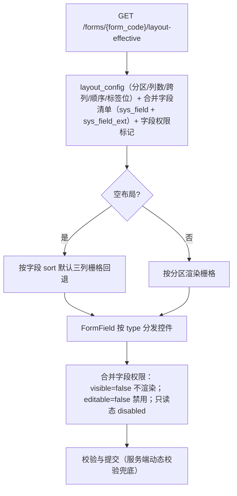

# 组件设计 · 表单渲染器

> FormRenderer · FormField · useFormRender

[文档首页](../../../../文档首页.md) › [项目规划说明](../../../../规划/项目规划说明.md) › [组件设计](../../01_组件设计_总览.md) › 表单渲染器　|　[← 水印](../../02_展示类/14_组件设计_水印/14_组件设计_水印.md)　[多标签导航 →](../14_组件设计_多标签导航/14_组件设计_多标签导航.md)

> 可交互原型：[13_原型设计_表单渲染器.html](13_原型设计_表单渲染器.html)（演示布局元数据驱动的分区/栅格渲染、字段按类型分发、三态（新增/编辑/查看）、权限叠加、校验与提交、明细区）

## 1. 目的与适用范围 <a id="purpose"></a>

定义 BMS 前端 `frontend/` **表单渲染器**的组件设计：渲染容器 `FormRenderer.vue`（按布局元数据渲染主表/分区/明细、三态、权限叠加、校验与提交），字段渲染器 `FormField.vue`（按字段类型分发到具体控件），以及组合式函数 `useFormRender.ts`（元数据取数、字段分发映射、三态与权限合并、校验、明细、提交）。适用于**全部业务表单页**（表单页 Tab）与列表页查询区/明细区的**布局驱动渲染**（[《概要设计 · 表单定制》](../../../概要设计/36_概要设计_表单定制.md)核心）。

本节对应[《项目规划说明》](../../../../规划/项目规划说明.md)「功能模块」之**表单定制**模块「布局驱动渲染」；上游设计依据[《概要设计 · 表单定制》](../../../概要设计/36_概要设计_表单定制.md)（`layout-effective` 渲染路径、三态共用、权限叠加、服务端动态校验、明细区/查询区配置、组件类型）与[《架构设计 · 表单定制》](../../../架构设计/26_架构设计_子系统_表单定制.md)（前端布局驱动渲染器、字段组件映射、空布局回退）；页面形态依据[《布局设计 · 表单页》](../../../布局设计/08_布局设计_表单页.html)（主表三列、窄容器单列、长字段跨整行、系统信息、明细 Tab、只读 disabled）与[《布局设计 · 表单定制》](../../../布局设计/14_布局设计_表单定制.html)「渲染规则（三态共用/回退/权限叠加）」节、[《布局设计 · 表格明细》](../../../布局设计/09_布局设计_表格明细.html)（明细行内编辑）；协作节点为字段类 [01 字典字段](../../01_字段类/01_组件设计_字典字段/01_组件设计_字典字段.md)～[12 级联选择](../../01_字段类/12_组件设计_级联选择/12_组件设计_级联选择.md)（控件分发）、[02 展示类 01 通用表格](../../02_展示类/01_组件设计_通用表格/01_组件设计_通用表格.md)（明细/查询区）、[02 展示类 03 状态标签与描述列表](../../02_展示类/03_组件设计_状态标签与描述列表/03_组件设计_状态标签与描述列表.md)（只读渲染）、[03 交互类 06 表单设计器](../06_组件设计_表单设计器/06_组件设计_表单设计器.md)（设计态与渲染器**同一套组件**，所见即所得）、[04 基础类 01 请求封装](../../04_基础类/01_组件设计_请求封装/01_组件设计_请求封装.md)（取数/提交）、[04 基础类 03 格式化工具](../../04_基础类/03_组件设计_格式化工具/03_组件设计_格式化工具.md)（校验器工厂）。

> 本篇为组件设计体系交互类第 13 篇。**范围边界**：**布局配置**（设计器）归[03 交互类 06 表单设计器](../06_组件设计_表单设计器/06_组件设计_表单设计器.md)；**字段控件本体**归字段类 01-12（本节点只做**分发与组合**）；**服务端动态校验**归[《架构设计 · 表单定制》](../../../架构设计/26_架构设计_子系统_表单定制.md)（前端对齐规则，后端强制）；**列表页查询区/明细区**的筛选与列配置分别复用 [11 查询筛选区](../../02_展示类/02_组件设计_查询筛选区/02_组件设计_查询筛选区.md) 与 [10 通用表格](../../02_展示类/01_组件设计_通用表格/01_组件设计_通用表格.md)；移动端不复用 PC 组件（见第 12 节）。

## 2. 组件清单与职责 <a id="components"></a>

| 组件 / 工具 | 位置 | 职责 |
| --- | --- | --- |
| `FormRenderer.vue` | `src/components/form/` | 渲染容器：按布局元数据渲染分区/栅格/分组、三态（新增/编辑/查看）、系统信息区、明细 Tab、权限叠加、校验与提交、空布局回退、加载/错误态 |
| `FormField.vue` | `src/components/form/` | 字段渲染器：按字段 `type` 分发到对应控件（字段类 01-12），统一 label/占位/必填/只读/脱敏/默认值/提示与校验规则绑定 |
| `useFormRender.ts` | `src/utils/useFormRender.ts` | 组合式函数：`layout-effective` 取数、字段清单与权限标记合并、字段分发映射、三态与只读判定、校验规则构建、明细数据、提交 |

- 命名遵循[《命名规范》](../../../../规范/命名规范.md)：组件 PascalCase、组合式函数 `use` + 名词；目录遵循[《前端开发规范》](../../../../规范/前端开发规范.md)（`src/components/` 按域分目录，表单渲染归 `form/`；组合式函数放 `src/utils/`）。
- **设计态与渲染态同源**：`FormRenderer` 与[03 交互类 06 表单设计器](../06_组件设计_表单设计器/06_组件设计_表单设计器.md)的画布复用同一 `FormField` 与栅格口径，保证所见即所得。

## 3. 元数据与渲染流程 <a id="flow"></a>



| 步骤 | 说明 |
| --- | --- |
| 取元数据 | 渲染路径接口一次返回布局 + 合并字段清单 + 当前用户字段权限标记（短缓存/版本失效） |
| 空布局回退 | 无配置时按字段 `sort` 默认三列栅格（与既有表单页一致，保证可用） |
| 字段分发 | `FormField` 按 `type` 映射控件（见第 5 节） |
| 权限叠加 | 布局可见性 + `sys_role_field`（visible/editable）叠加，**权限优先** |
| 未知字段 | 布局引用失效字段自动跳过并提示，不阻断 |
| 三态 | 新增/编辑/查看共用一套布局（见第 4 节） |

## 4. Props 与事件 <a id="props"></a>

| 属性 | 类型 | 默认 | 说明 |
| --- | --- | --- | --- |
| `formCode` | string | — | 表单标识（渲染路径 `form_code`） |
| `mode` | 'create' \| 'edit' \| 'view' | 'create' | 三态 |
| `modelValue` | Record\<string, any\> | {} | 表单数据（`v-model`） |
| `mainId` | string \| number \| null | null | 记录主键（`edit`/`view` 拉详情） |
| `detailTabs` | DetailTabConfig[] \| null | null | 明细区 Tab 配置（主从模块） |
| `labelPosition` | 'top' \| 'left' | 'top' | 标签位置（缺省按布局元数据） |
| `readonly` | boolean | false | 强制只读（覆盖 mode） |

| 事件 | 载荷 | 说明 |
| --- | --- | --- |
| `update:modelValue` | Record | 数据变化 |
| `submit` | payload | 提交（由页面接入 create/update，或组件内提交） |
| `saved` | id | 保存成功 |
| `change` | `{ field, value }` | 字段变化 |

- 暴露方法：`validate()`、`getModel()`、`setModel(data)`、`resetFields()`、`submit()`。

## 5. 字段分发映射 <a id="field-map"></a>

| 字段 `type` | 控件（组件设计节点） |
| --- | --- |
| `text` | `el-input`（[01 字典字段](../../01_字段类/01_组件设计_字典字段/01_组件设计_字典字段.md) 视配置；长文本 `longtext` 用 textarea） |
| `longtext` | textarea（可切富文本时用 [08 富文本字段](../../01_字段类/07_组件设计_富文本字段/07_组件设计_富文本字段.md)） |
| `number` / `amount` / `percent` | [04 数值与金额字段](../../01_字段类/03_组件设计_数值与金额字段/03_组件设计_数值与金额字段.md) |
| `date` / `datetime` | [03 日期时间字段](../../01_字段类/02_组件设计_日期时间字段/02_组件设计_日期时间字段.md) |
| `select` / `multi_select`（字典） | [01 字典字段](../../01_字段类/01_组件设计_字典字段/01_组件设计_字典字段.md)（`DictSelect`/`DictMultiSelect`） |
| `select`（自定义选项/枚举） | [09 开关与枚举字段](../../01_字段类/08_组件设计_开关与枚举字段/08_组件设计_开关与枚举字段.md) |
| `switch` | [09 开关与枚举字段](../../01_字段类/08_组件设计_开关与枚举字段/08_组件设计_开关与枚举字段.md) |
| `file` / `image` | [06 文件上传字段](../../01_字段类/06_组件设计_文件上传字段/06_组件设计_文件上传字段.md) |
| `richtext` | [07 富文本字段](../../01_字段类/07_组件设计_富文本字段/07_组件设计_富文本字段.md) |
| `dept` / `tree` | [04 树选择字段](../../01_字段类/04_组件设计_树选择字段/04_组件设计_树选择字段.md) |
| `user` / `post` / `org` | [05 组织选择字段](../../01_字段类/05_组件设计_组织选择字段/05_组件设计_组织选择字段.md) |
| `transfer` | [09 穿梭框](../../01_字段类/09_组件设计_穿梭框/09_组件设计_穿梭框.md) |
| `cascader` | [12 级联选择](../../01_字段类/12_组件设计_级联选择/12_组件设计_级联选择.md) |
| `tags` | [11 标签输入](../../01_字段类/11_组件设计_标签输入/11_组件设计_标签输入.md) |
| `captcha` | [10 验证码](../../01_字段类/10_组件设计_验证码/10_组件设计_验证码.md)（登录/表单场景） |
| 未知类型 | 纯文本回退 + 开发告警（不阻断） |

- 控件由 `FormField` 统一装配：label、占位（i18n/字段属性）、必填、默认值、提示、只读（disabled）、脱敏、校验规则（服务端一致的规则工厂）。

## 6. 栅格、三态与权限 <a id="grid-modes"></a>

| 项 | 设计 |
| --- | --- |
| 栅格 | `label-position="top"`；主表分区按列数 1/2/3（`el-col :span="24/列数"`）；长文本/备注跨整行（`span=24`）；窄容器（窄抽屉/移动端）单列 |
| 分区/分组 | > 8 字段用分区标题（`el-divider`）分组；顺序按布局 `sort` |
| 三态共用 | 新增/编辑/详情同一布局（[《布局设计 · 表单定制》](../../../布局设计/14_布局设计_表单定制.html)）；只读态按 `editable` 与字段类型决定「纯文本/disabled 输入框」 |
| 权限叠加 | `visible=false` 不渲染；`editable=false` 编辑态禁用；权限优先于布局 |
| 系统信息 | 详情页系统信息区（ID/版本/创建/修改等）disabled 只读三列（[《布局设计 · 表单页》](../../../布局设计/08_布局设计_表单页.html)） |
| 脱敏 | 敏感字段默认掩码，持 `data:plain` 明文切换（[04 基础类 02 权限指令](../../04_基础类/02_组件设计_权限指令/02_组件设计_权限指令.md)） |

## 7. 明细区 <a id="detail"></a>

| 项 | 设计 |
| --- | --- |
| 结构 | 多个明细 Tab；每个明细为可编辑表格（[10 通用表格](../../02_展示类/01_组件设计_通用表格/01_组件设计_通用表格.md) 行内编辑，仅编辑态可用） |
| 关联 | 明细行含「主表数据 id」列，对应当前主表 ID；新增主表明细 id 在保存事务内回填 |
| 列配置 | 列显隐/顺序/宽度来自布局 `detail` 配置（[03 交互类 06 表单设计器](../06_组件设计_表单设计器/06_组件设计_表单设计器.md)） |
| 整体保存 | 主表 + 全部明细**单事务**提交，保证一致性（[《布局设计 · 表单页》](../../../布局设计/08_布局设计_表单页.html)「校验与提交」节） |
| 行操作 | 新增行/删除行/行内编辑（编辑态）；校验行级规则 |

## 8. 校验与提交 <a id="validate"></a>

| 项 | 设计 |
| --- | --- |
| 前端校验 | 按字段属性（必填/长度/范围/正则/选项集）构建规则（[04 基础类 03 格式化工具](../../04_基础类/03_组件设计_格式化工具/03_组件设计_格式化工具.md) 规则工厂），与后端一致 |
| 服务端校验 | 后端按生效布局**动态校验**（强制，前端不依赖）；字段级错误返回并定位 |
| 提交 | `validate()` 通过 → 提交（create/update）；`saveLoading` 防重复；成功 → `saved` → 页面刷新列表 |
| 乐观锁 | `edit` 携带 `version`；409 提示「记录已被修改」并重载 |
| 冲突/错误 | 按错误码提示并定位字段（i18n） |

## 9. 组合式函数 useFormRender <a id="use-form-render"></a>

```typescript
interface UseFormRenderOptions { formCode: string; mode: Mode; mainId?: string | number; }
interface UseFormRenderReturn {
  layout: Ref<FormLayoutConfig | null>;
  fields: Ref<FieldMeta[]>;            // 合并字段清单（含权限标记）
  model: Ref<Record<string, any>>;
  rules: Ref<Record<string, FormItemRule[]>>;
  readonly: ComputedRef<boolean>;      // view 或无 editable
  loading: Ref<boolean>;
  load: () => Promise<void>;           // layout-effective + 详情
  loadDetail: () => Promise<void>;
  validate: () => Promise<boolean>;
  submit: () => Promise<void>;
  fieldComponent: (type) => Component; // 类型分发
}
```

| 行 | 设计 |
| --- | --- |
| 取数 | `load()` 取布局元数据 + 合并字段 + 权限标记；`edit/view` 再取详情 |
| 分发 | `fieldComponent(type)` 返回控件组件；未知类型回退纯文本 |
| 权限 | `readonly` 由 `mode='view'` 或整体无 `editable` 决定；字段级 `editable` 逐字段禁用 |
| 校验 | 构建 `rules`；`validate()` 触发；明细行级校验 |
| 提交 | 主表 + 明细单事务；成功回调 |
| 空布局 | 无 layout 时按 `fields.sort` 默认栅格 |

## 10. 场景集成 <a id="scenes"></a>

| 场景 | 说明 |
| --- | --- |
| 业务表单页（记录 Tab） | 本节点主体：按布局渲染主表 + 明细（[《布局设计 · 表单页》](../../../布局设计/08_布局设计_表单页.html)） |
| 表单设计器画布预览 | [03 交互类 06 表单设计器](../06_组件设计_表单设计器/06_组件设计_表单设计器.md) 复用 `FormField`（所见即所得） |
| 明细区 | 可编辑表格（[10 通用表格](../../02_展示类/01_组件设计_通用表格/01_组件设计_通用表格.md)） |
| 列表页查询区 | 归 [11 查询筛选区](../../02_展示类/02_组件设计_查询筛选区/02_组件设计_查询筛选区.md)（同一字段元数据） |
| 打印/导出 | 按布局渲染打印模板 |
| 移动端 | 独立工程单列渲染（同一元数据），不复用 PC 组件 |

## 11. 依赖接口与上游变更 <a id="api"></a>

### 11.1 上游接口与口径 <a id="api-contract"></a>

| 项 | 说明 | 目标文档 |
| --- | --- | --- |
| 渲染路径 | `GET /forms/{form_code}/layout-effective`（布局 + 合并字段 + 权限标记） | [《概要设计 · 表单定制》](../../../概要设计/36_概要设计_表单定制.md) |
| 业务详情/写接口 | 各模块 create/update/detail（动态校验在 service 层） | [《概要设计 · 表单定制》](../../../概要设计/36_概要设计_表单定制.md) |
| 字段/权限 | `sys_field`/`sys_field_ext`/`sys_role_field` | [《概要设计 · 菜单管理》](../../../概要设计/07_概要设计_菜单管理.md)、[《概要设计 · 角色管理》](../../../概要设计/06_概要设计_角色管理.md) |
| 组件类型 | 字段类型与控件映射（含新增类型） | [《概要设计 · 表单定制》](../../../概要设计/36_概要设计_表单定制.md)（登记项②） |
| 新增依赖 | **无**：复用字段类控件与 Element Plus | — |

### 11.2 需登记的上游变更 <a id="api-upstream"></a>

| 变更点 | 目标文档 | 内容 |
| --- | --- | --- |
| ① 渲染器前端契约 | [《概要设计 · 表单定制》](../../../概要设计/36_概要设计_表单定制.md)「功能点分解」「渲染规则」节；[《架构设计 · 表单定制》](../../../架构设计/26_架构设计_子系统_表单定制.md)「前端渲染与设计器架构」节 | 明确布局驱动渲染器契约：`layout-effective` 下发分区/列数/跨列/顺序/标签位 + 合并字段 + 权限标记；三态共用；空布局按 `sort` 回退；权限优先；明细区列配置与整体单事务提交；设计器与渲染器**同一套字段组件** |
| ② 字段类型→控件映射（含新增） | [《概要设计 · 表单定制》](../../../概要设计/36_概要设计_表单定制.md)「组件类型与自建字段边界」节 | 明确 `type → 控件` 映射表，含新增 **穿梭框/级联/标签输入/验证码** 等组件类型（登记各字段类节点）；未知类型纯文本回退 + 告警 |
| ③ 服务端动态校验一致性 | [《架构设计 · 表单定制》](../../../架构设计/26_架构设计_子系统_表单定制.md)「服务端动态校验」节 | 明确字段级动态校验错误返回结构与前端定位口径（字段 key + 规则类型），前端规则与服务端一致、后端强制 |

> 按[《文档生成规范》](../../../../规范/文档生成规范.md)「引用与追溯」节，上述变更需用户确认后由上游文档同步；本节点只定义组件契约，不单独裁决接口与校验规则。

## 12. 权限 / i18n / 移动端 <a id="cooperate"></a>

- **权限**：字段 `visible`/`editable` 叠加布局、权限优先；敏感字段默认脱敏、`data:plain` 明文（[04 基础类 02 权限指令](../../04_基础类/02_组件设计_权限指令/02_组件设计_权限指令.md)）；后端 `require_permission` 与动态校验兜底。
- **i18n**：字段 label、提示、占位按元数据 locale 下发（`sys_field_i18n`/`sys_field_ext_i18n`）；错误文案按 `error.404xx` 映射（i18n）；**不翻译用户数据**。
- **移动端**：不复用 PC 组件；`frontend-mobile` 按同一 `layout-effective` 元数据**单列重排**渲染（[《布局设计 · 移动端细化》](../../../布局设计/16_布局设计_移动端细化.html)），校验规则与提交同源。

## 13. 性能与边界 <a id="performance"></a>

| 场景 | 设计 |
| --- | --- |
| 元数据 | 渲染路径短缓存 + 版本失效；同表单多次进入零额外请求 |
| 字段渲染 | 按需懒加载重控件（富文本/代码/图表）；字典/组织走各自缓存与批量接口 |
| 校验 | 前端规则工厂即时；服务端动态校验在提交时；异步唯一性校验防抖 |
| 明细 | 行内编辑按需渲染；大数据明细分页/虚拟滚动 |
| 边界 | 空布局回退、未知字段跳过、未知类型纯文本、字段停用、权限叠加、脱敏切换、区间起止校验、必填失败定位、409 冲突、明细行级错误、窄容器单列、只读态 |
| 不支持 | 布局配置（06 表单设计器）、字段控件本体（字段类 01-12）、服务端动态校验（后端）、查询区（11）、移动端组件复用 |

## 14. 检查清单 <a id="checklist"></a>

- □ 组件分层：`FormRenderer` 容器与提交、`FormField` 类型分发、`useFormRender` 元数据/校验/分发；设计器与渲染器同一套字段组件
- □ 元数据：`layout-effective` 取布局 + 合并字段 + 权限标记；空布局按 `sort` 回退；未知字段跳过
- □ 字段分发：`type → 控件` 映射覆盖字段类 01-12（含穿梭框/级联/标签/验证码）；未知类型纯文本 + 告警
- □ 栅格与形态：分区/分组、列数 1/2/3、跨整行、标签位、窄容器单列
- □ 三态与权限：三态共用；`visible=false` 不渲染、`editable=false` 禁用、权限优先；系统信息只读三列；脱敏
- □ 明细区：多 Tab、行内编辑（编辑态）、列配置、主从单事务提交、行级校验
- □ 校验提交：前端规则与后端动态校验一致；必填/区间/409 冲突处理
- □ 权限（字段权限/脱敏）、i18n（label/错误码，数据不翻译）、移动端（单列同源）符合第 12 节
- □ 性能：元数据缓存、重控件懒加载、字典批量、明细分页/虚拟滚动
- □ 三项上游登记已确认：渲染器前端契约、字段类型→控件映射（含新增）、服务端动态校验一致性

> 组件设计节点 · 与[《概要设计 · 表单定制》](../../../概要设计/36_概要设计_表单定制.md)[《架构设计 · 表单定制》](../../../架构设计/26_架构设计_子系统_表单定制.md)[《布局设计 · 表单页》](../../../布局设计/08_布局设计_表单页.html)[《布局设计 · 表单定制》](../../../布局设计/14_布局设计_表单定制.html)[《布局设计 · 表格明细》](../../../布局设计/09_布局设计_表格明细.html)[01 字典字段](../../01_字段类/01_组件设计_字典字段/01_组件设计_字典字段.md)[02 展示类 01 通用表格](../../02_展示类/01_组件设计_通用表格/01_组件设计_通用表格.md)[03 交互类 06 表单设计器](../06_组件设计_表单设计器/06_组件设计_表单设计器.md)[04 基础类 03 格式化工具](../../04_基础类/03_组件设计_格式化工具/03_组件设计_格式化工具.md)《命名规范》配套
