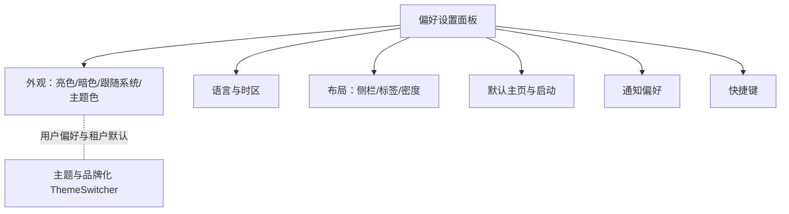

# 组件设计 · 偏好设置面板

> PreferencePanel · PreferenceSection · usePreference（协作：主题与品牌化 / 国际化）

[文档首页](../../../../文档首页.md) › [项目规划说明](../../../../规划/项目规划说明.md) › [组件设计](../../01_组件设计_总览.md) › 偏好设置面板　|　[← 向导与步骤](../17_组件设计_向导与步骤/17_组件设计_向导与步骤.md)　19-批量操作栏（规划中）

> 可交互原型：[18_原型设计_偏好设置面板.html](18_原型设计_偏好设置面板.html)（演示抽屉面板、分组偏好项（外观/语言时区/布局/列表密度/默认页/通知）、即时预览、恢复默认与保存同步）

## 1. 目的与适用范围 

定义 BMS 前端 `frontend/` **偏好设置面板**的组件设计：面板壳 `PreferencePanel.vue`（抽屉/弹窗、分组、即时预览、保存与恢复默认）、分组 `PreferenceSection.vue`（分组标题 + 偏好项）、状态 `usePreference.ts`（读取/保存/同步用户偏好）。用于承载**个人偏好**（主题外观、语言与时区、布局（侧栏折叠/标签）、列表密度、默认主页、通知偏好、快捷键等），是[《概要设计 · 用户喜好》](../../../概要设计/04_概要设计_用户喜好.md)的前端呈现。

### 1.1 定位与边界 

职责边界与相关节点分流如下：

- **与主题品牌化的关系**：**租户品牌化**（Logo/主色/名称）由 03 交互类 20 主题与品牌化（规划中）管理（管理员配置、全局生效）；**用户偏好**中的「亮色/暗色/跟随系统」是用户级覆盖，优先级：用户偏好 > 租户默认品牌 > 平台默认（口径由[《布局设计 · 主题与租户品牌化》](../../../布局设计/03_布局设计_主题与租户品牌化.html)定义）。
- **与布局的关系**：侧栏折叠、列表密度、标签开关等偏好影响主框架渲染，具体布局见[《布局设计 · 主框架》](../../../布局设计/04_布局设计_主框架.html)/[《布局设计 · 导航》](../../../布局设计/05_布局设计_导航.html)。
- **入口**：顶栏用户菜单「偏好设置」（[《布局设计 · 导航》](../../../布局设计/05_布局设计_导航.html)）。

上游/协作：[03 交互类 12 国际化文案编辑器](../12_组件设计_国际化文案编辑器/12_组件设计_国际化文案编辑器.md)（语言切换口径）、[04 基础类 03 格式化工具](../../04_基础类/03_组件设计_格式化工具/03_组件设计_格式化工具.md)（时区/格式化联动）、03 交互类 20 主题与品牌化（规划中）、03 交互类 21 租户切换（规划中）。

> 本篇为组件设计体系交互类第 18 篇。**范围边界**：**偏好项的后端存储与同步**归[《概要设计 · 用户喜好》](../../../概要设计/04_概要设计_用户喜好.md)（本节点只做前端呈现与读写）；**主题品牌化**归 03 交互类 20 主题与品牌化（规划中）；**语言资源与文案编辑**归[03 交互类 12 国际化文案编辑器](../12_组件设计_国际化文案编辑器/12_组件设计_国际化文案编辑器.md)；**布局规则**归对应布局设计。

## 2. 组件清单与职责 

| 组件 / 工具 | 位置 | 职责 |
| --- | --- | --- |
| `PreferencePanel.vue` | `src/components/preference/` | 面板壳：抽屉/弹窗、分组渲染、即时预览、保存/取消/恢复默认、重置确认 |
| `PreferenceSection.vue` | `src/components/preference/` | 分组容器：标题/描述 + 偏好项插槽 |
| `usePreference.ts` | `src/stores/preference.ts` | 偏好状态：读取（本地 + 服务端合并）、保存、同步、默认值、应用（主题/语言/密度等） |

- 命名遵循[《命名规范》](../../../../规范/命名规范.md)：组件 PascalCase；目录遵循[《前端开发规范》](../../../../规范/前端开发规范.md)（偏好归 `preference/`）。

## 3. Props 与事件（PreferencePanel） 

| 属性 | 类型 | 默认 | 说明 |
| --- | --- | --- | --- |
| `visible` | boolean | false | 面板显隐（v-model） |
| `mode` | 'drawer' \| 'dialog' | 'drawer' | 呈现形态（宽屏抽屉、窄屏/弹窗） |
| `livePreview` | boolean | true | 变更即时预览（未保存前预览，取消回滚） |
| `groups` | string[] | 全部 | 显示哪些分组（按需裁剪，如仅在设置页显示全部） |
| `scopeTabs` | boolean | false | 是否以 Tab 分组（偏好项多时） |

| 事件 | 载荷 | 说明 |
| --- | --- | --- |
| `update:visible` | boolean | 显隐同步 |
| `save` | preference | 保存（写服务端 + 本地） |
| `reset` | — | 恢复默认 |
| `change` | (key, value) | 单项变更（即时预览用） |

### 3.1 偏好项（内置） 

| 分组 | 偏好键 | 说明 |
| --- | --- | --- |
| 外观 | `themeMode` | 亮色/暗色/跟随系统（用户级覆盖租户品牌） |
| 外观 | `accent` | 强调色（可选，若允许用户覆盖） |
| 语言与时区 | `locale` | 界面语言（[03 交互类 12 国际化文案编辑器](../12_组件设计_国际化文案编辑器/12_组件设计_国际化文案编辑器.md)） |
| 语言与时区 | `timezone` | 时区（影响日期时间显示，[04 基础类 03 格式化工具](../../04_基础类/03_组件设计_格式化工具/03_组件设计_格式化工具.md)） |
| 布局 | `sidebarCollapsed` | 侧栏默认折叠（[《布局设计 · 导航》](../../../布局设计/05_布局设计_导航.html)） |
| 布局 | `tabsEnabled` / `tabsStyle` | 多标签开关/样式（[03 交互类 14 多标签导航](../14_组件设计_多标签导航/14_组件设计_多标签导航.md)） |
| 布局 | `listDensity` | 列表密度（紧凑/舒适/宽松，[02 展示类 01 通用表格](../../02_展示类/01_组件设计_通用表格/01_组件设计_通用表格.md)） |
| 默认主页 | `defaultRoute` | 登录后默认页（有权限范围内） |
| 通知偏好 | `notify.*` | 各渠道/类型通知开关（[02 展示类 06 通知与消息](../../02_展示类/06_组件设计_通知与消息/06_组件设计_通知与消息.md)） |
| 快捷键 | `shortcuts` | 快捷键启用/自定义（可选） |

## 4. 交互与同步 

| 项 | 设计 |
| --- | --- |
| 入口 | 顶栏用户菜单「偏好设置」；打开抽屉；设置页可复用分组 |
| 即时预览 | `livePreview` 时变更立即应用于界面（主题/密度/语言）；「取消」回滚到打开前快照 |
| 保存 | 保存 → 写服务端（用户喜好接口）+ 本地；成功后 Toast；关闭面板 |
| 恢复默认 | 二次确认 → 重置为默认值（平台默认 ∩ 租户默认）并保存 |
| 生效时机 | 主题/密度即时；语言/时区切换后刷新文案与时间（提示可能重载）；默认主页下次登录/打开生效 |
| 同步 | 登录后拉取用户偏好合并（服务端为准，本地即时缓存）；多端修改以服务端最新为准；保存冲突提示 |
| 未登录 | 本地存储生效（登录后合并） |
| 权限 | 偏好为个人级，无需业务权限；可覆盖项受租户策略限制（如租户禁用暗色则不显示） |
| 窄屏 | 抽屉全宽或弹窗；分组可折叠/Tab |
| 快捷键 | 可选支持（如 `Ctrl+,` 打开偏好），见第 6.2 节登记 |

## 5. 场景集成 

| 场景 | 说明 |
| --- | --- |
| 顶栏用户菜单 | 打开偏好抽屉 |
| 独立设置页 | 复用分组组件承载全部偏好 |
| 首次登录引导 | 可选引导用户设置语言/主题 |
| 租户策略 | 租户禁用的偏好项隐藏/禁用 |

## 6. 依赖接口与上游变更 

### 6.1 上游接口与口径 

| 项 | 说明 | 目标文档 |
| --- | --- | --- |
| 用户偏好接口 | `GET/PUT /user/preferences`（偏好键值集合） | [《概要设计 · 用户喜好》](../../../概要设计/04_概要设计_用户喜好.md)（登记项①） |
| 偏好项集合 | 分组与键定义 | [《概要设计 · 用户喜好》](../../../概要设计/04_概要设计_用户喜好.md) |
| 主题优先级 | 用户偏好 > 租户品牌 > 平台默认 | [《布局设计 · 主题与租户品牌化》](../../../布局设计/03_布局设计_主题与租户品牌化.html)（登记项③） |
| 语言 | 语言切换与资源加载 | [03 交互类 12 国际化文案编辑器](../12_组件设计_国际化文案编辑器/12_组件设计_国际化文案编辑器.md) |
| 入口 | 顶栏用户菜单项与快捷键 | [《布局设计 · 导航》](../../../布局设计/05_布局设计_导航.html)（登记项②） |
| 新增依赖 | **无**：`el-drawer` + 分组表单 | — |

### 6.2 需登记的上游变更 

| 变更点 | 目标文档 | 内容 |
| --- | --- | --- |
| ① 用户偏好项集合 | [《概要设计 · 用户喜好》](../../../概要设计/04_概要设计_用户喜好.md)「数据模型」「接口设计」节 | 明确偏好键集合与默认值：`themeMode/accent/locale/timezone/sidebarCollapsed/tabsEnabled/tabsStyle/listDensity/defaultRoute/notify.*/shortcuts`；`GET/PUT /user/preferences`；多端合并（服务端为准）与冲突口径；标注组件设计 交互类 18 为组件契约依据 |
| ② 偏好入口与快捷键 | [《布局设计 · 导航》](../../../布局设计/05_布局设计_导航.html)「用户菜单」节 | 明确「偏好设置」入口位置、抽屉形态、可选快捷键（如 `Ctrl+,`）；标注组件契约 |
| ③ 主题优先级 | [《布局设计 · 主题与租户品牌化》](../../../布局设计/03_布局设计_主题与租户品牌化.html)「主题解析」节 | 明确优先级：用户偏好（亮/暗/跟随系统）> 租户默认品牌 > 平台默认；租户可禁用项（如禁用暗色）则不展示；标注组件契约 |

> 按[《文档生成规范》](../../../../规范/文档生成规范.md)「引用与追溯」节，上述变更需用户确认后由上游文档同步；本节点只定义组件契约，不单独裁决数据结构与优先级。

## 7. 权限 / i18n / 移动端 

- **权限**：个人偏好无需业务权限；租户策略可限制可选范围（受控项隐藏/禁用）；`defaultRoute` 限定在用户有权限的页面内。
- **i18n**：偏好项名称/描述走 vue-i18n；切换语言即时生效（异步加载资源，可能短暂加载态）。
- **移动端**：抽屉全宽或整页；分组折叠/Tab；触控友好（[《布局设计 · 移动端》](../../../布局设计/15_布局设计_移动端.html)）。

## 8. 性能与边界 

| 场景 | 设计 |
| --- | --- |
| 加载 | 登录后合并偏好（服务端 + 本地），首屏尽早应用主题避免闪烁（localStorage 预读） |
| 保存 | 防抖/显式保存；失败重试与提示 |
| 优化 | 分组按需渲染；即时预览仅影响根级 CSS 变量/类名 |
| 边界 | 未登录本地生效、多端冲突、租户禁用项、恢复默认确认、取消回滚快照、语言资源加载失败、默认页无权限、主题闪烁（预读）、时区非法值 |
| 不支持 | 偏好后端存储（用户喜好）、主题品牌化（20）、语言资源管理（12）、布局规则（布局设计） |

## 9. 检查清单 

- □ 组件分层：`PreferencePanel` 壳、`PreferenceSection` 分组、`usePreference` 状态
- □ 偏好项：外观/语言时区/布局（侧栏/标签/密度）/默认主页/通知/快捷键齐全且与登记一致
- □ 交互：即时预览、保存、取消回滚、恢复默认确认、生效时机（即时/刷新/下次登录）
- □ 同步：服务端 + 本地合并、多端冲突提示、未登录本地生效、首屏预读防闪烁
- □ 主题优先级（用户 > 租户 > 平台）、租户受控项隐藏
- □ 权限（个人级/受控项/defaultRoute 有权限）、i18n（偏好项文案/切换生效）、移动端（抽屉全宽/折叠）符合第 7 节
- □ 性能边界：预读防闪烁、防抖保存、按需渲染
- □ 三项上游登记已确认：用户偏好项集合、偏好入口与快捷键、主题优先级

> 组件设计节点 · 与[《概要设计 · 用户喜好》](../../../概要设计/04_概要设计_用户喜好.md)[《布局设计 · 导航》](../../../布局设计/05_布局设计_导航.html)[《布局设计 · 主题与租户品牌化》](../../../布局设计/03_布局设计_主题与租户品牌化.html)[《布局设计 · 主框架》](../../../布局设计/04_布局设计_主框架.html)[03 交互类 12 国际化文案编辑器](../12_组件设计_国际化文案编辑器/12_组件设计_国际化文案编辑器.md)[03 交互类 14 多标签导航](../14_组件设计_多标签导航/14_组件设计_多标签导航.md)[02 展示类 01 通用表格](../../02_展示类/01_组件设计_通用表格/01_组件设计_通用表格.md)[02 展示类 06 通知与消息](../../02_展示类/06_组件设计_通知与消息/06_组件设计_通知与消息.md)[04 基础类 03 格式化工具](../../04_基础类/03_组件设计_格式化工具/03_组件设计_格式化工具.md)《命名规范》配套
