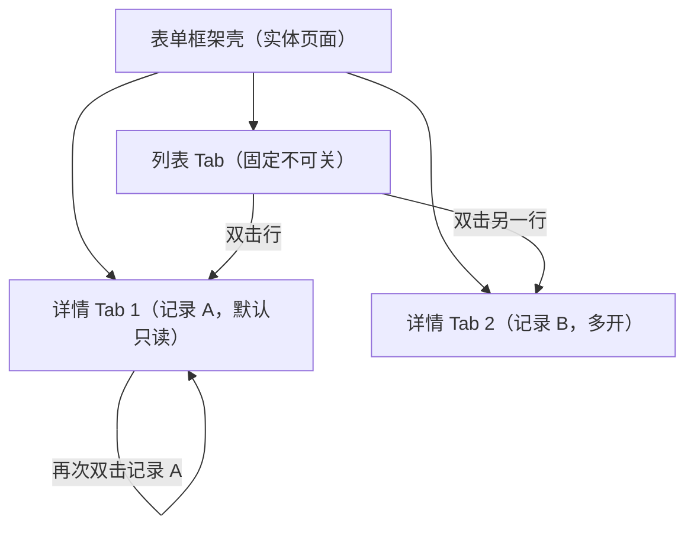

# 组件设计 · 多标签导航

> 页面级标签与表单框架双层标签的呈现与交互：固定与关闭规则 / 右键菜单 / 标签缓存 / 溢出滚动 / 脏数据确认
> 实现侧命名与落点见《[前端基类清单](../../../../前端基类清单.md)》，实现契约细节见项目详细设计。

[文档首页](../../../../文档首页.md) › [项目规划说明](../../../../规划/项目规划说明.md) › [组件设计](../../01_组件设计_总览.md) › 多标签导航　|　[← 页面容器](../03_组件设计_页面容器/03_组件设计_页面容器.md)　[树形主从布局 →](../05_组件设计_树形主从布局/05_组件设计_树形主从布局.md)

> 可交互原型：[04_原型设计_多标签导航.html](04_原型设计_多标签导航.html)（演示页面级多标签、固定首 Tab、右键菜单（关闭/关闭其他/关闭右侧/刷新）、脏数据拦截、表单框架双层 Tab）

## 1. 目的与适用范围 

定义 BMS 前端**多标签导航**的组件设计：页面级标签栏（主框架内容区顶部多标签、路由联动、右键菜单、标签缓存、溢出滚动）与表单框架双层标签（列表 Tab 固定 + 详情 Tab 多开）。适用于**主框架页面级导航**与**表单框架壳**的标签体系，是管理端「多页并行、状态保留」的核心交互。

本节对应[《项目规划说明》](../../../../规划/项目规划说明.md)「前端页面清单与菜单机制」；上游设计依据[《布局设计 · 主框架》](../../../布局设计/04_布局设计_主框架.html)（Tab 栏：工作台固定首 Tab、不可关闭）、[《布局设计 · 表单框架》](../../../布局设计/06_布局设计_表单框架.html)（列表 Tab 固定 + 详情 Tab 多开、双击行开详情、关闭激活相邻）、[《布局设计 · 导航》](../../../布局设计/05_布局设计_导航.html)、[《布局设计 · 响应式适配》](../../../布局设计/11_布局设计_响应式适配.html)（窄屏标签溢出）；协作节点为[基础组件类「页签状态能力」](../../02_基础组件类/02_能力类/15_组件设计_页签状态能力/15_组件设计_页签状态能力.md)（页签状态与标签缓存键，继承链上的能力域基类）、[容器组件类「弹窗抽屉表单」](../../04_容器组件类/01_组件设计_弹窗抽屉表单/01_组件设计_弹窗抽屉表单.md)（脏数据关闭确认）、[交互类「表单渲染器」](../../08_交互类/12_组件设计_表单渲染器/12_组件设计_表单渲染器.md)（详情 Tab 内容）。

> 本篇为「多标签导航」节点。**范围边界**：**标签状态管理**（增删/切换/缓存键/缓存清单）归[基础组件类「页签状态能力」](../../02_基础组件类/02_能力类/15_组件设计_页签状态能力/15_组件设计_页签状态能力.md)（继承链上的能力域基类），本节点专注**呈现与交互**（标签栏 UI、右键菜单、固定/关闭规则、溢出）；**路由生成**归[《架构设计 · 前端架构》](../../../架构设计/08_架构设计_前端架构.md)（本节点只做标签与路由的联动）；**侧边菜单**归[交互类「侧边菜单」](../../08_交互类/13_组件设计_侧边菜单/13_组件设计_侧边菜单.md)；移动端不使用多标签（见第 8 节）。

## 2. 职责与组成 

| 组成部分 | 职责 |
| --- | --- |
| 页面级标签栏件 | 标签渲染、固定首 Tab（工作台）、激活态、路由联动、右键菜单、溢出横向滚动、关闭联动、拖拽排序（可选）、标签缓存联动 |
| 双层标签件 | 表单框架双层标签：列表 Tab（固定不可关）+ 详情 Tab（多开），双击行开详情、已开激活不重复新建、关闭后激活相邻、脏数据拦截 |
| 页签状态能力域基类 | 标签状态（清单/激活/缓存），打开、切换、关闭、关闭其他/右侧、缓存键与缓存清单 |

## 3. 交互与契约语义 

| 语义项 | 说明 |
| --- | --- |
| 标签项 | 标签键、标题、路由路径、可否关闭、图标、脏数据标记（key / title / path / closable / icon / dirty），由页签状态能力域基类提供 |
| 激活标签 | 当前激活标签键（与路由联动） |
| 固定标签 | 固定为不可关的首位标签（缺省为工作台） |
| 打开上限 | 最多同时打开 12 个（超出时关闭最久未激活的可关闭标签并提示） |
| 关闭确认 | 关闭前检查脏数据标记并确认 |
| 拖拽排序 | 标签可拖拽调整顺序（可选） |
| 刷新入口 | 可显示刷新当前标签入口（重新加载当前路由） |
| 事件语义 | 切换标签 / 关闭标签（脏数据先确认）/ 右键菜单批量操作（关闭其他、关闭右侧、关闭全部）/ 刷新标签 |

## 4. 页面级标签 

| 项 | 设计 |
| --- | --- |
| 固定首 Tab | 工作台固定为**首 Tab 且不可关闭**（[《布局设计 · 主框架》](../../../布局设计/04_布局设计_主框架.html)）；其余标签按打开顺序排列 |
| 打开/激活 | 点击侧边菜单或路由跳转 → 若已打开则激活（不重复新建），否则追加 |
| 关闭 | 关闭当前 → 激活**相邻**标签（优先右、否则左）；固定 Tab 不显示关闭按钮 |
| 右键菜单 | 刷新 / 关闭当前 / 关闭其他 / 关闭右侧 / 关闭全部（保留固定 Tab） |
| 标签缓存 | 标签组件按缓存键缓存（页签状态能力域基类提供），切回保留状态；刷新时按标签键移除缓存重挂载 |
| 溢出 | 标签过多时横向滚动（鼠标滚轮/箭头），当前标签自动滚入可视区（[《布局设计 · 响应式适配》](../../../布局设计/11_布局设计_响应式适配.html)） |
| 脏数据 | 带脏数据标记的标签关闭前二次确认（[容器组件类「弹窗抽屉表单」](../../04_容器组件类/01_组件设计_弹窗抽屉表单/01_组件设计_弹窗抽屉表单.md)） |
| 上限 | 超过打开上限时关闭最久未激活的可关闭标签并提示 |
| 徽标 | 标签可带图标（菜单图标）与未读/待办角标（可选，复用通知角标口径） |

## 5. 表单框架双层标签 

| 项 | 设计 |
| --- | --- |
| 列表 Tab | 固定不可关，承载列表页（[《布局设计 · 表单框架》](../../../布局设计/06_布局设计_表单框架.html)） |
| 详情 Tab | 双击列表行打开对应记录详情；**不同记录各自新开 Tab**，已打开则激活不重复新建；标题取记录标识字段 |
| 默认只读 | 详情 Tab 默认只读，点「修改」进编辑态；保存后回填 id 并刷新列表 |
| 关闭 | 关闭详情 Tab → 激活相邻 Tab，无详情 Tab 则回列表 Tab（列表不可关） |
| 脏数据 | 编辑未保存切换/关闭详情 Tab → 脏数据确认（表单页提供脏数据标记） |
| 与页面级关系 | 表单框架壳位于页面级 Tab 内容区，形成「页面级 Tab → 表单框架层 Tab」两级嵌套；两级缓存独立 |
| 工具栏 | 列表页与表单页各自工具栏（表单框架层不提供统一工具栏） |

## 6. 场景集成 

| 场景 | 说明 |
| --- | --- |
| 主框架 | 页面级多标签（工作台固定首 Tab） |
| 实体模块（用户/角色/业务表单） | 表单框架双层标签（列表 + 详情多开） |
| 移动端 | **不使用多标签**（底部标签导航，单页栈）；见第 8 节 |

## 7. 依赖接口与上游变更 

### 7.1 上游接口与口径 

| 项 | 说明 | 目标文档 |
| --- | --- | --- |
| 标签状态 | 页签状态能力（增删/切换/缓存键/缓存清单；继承链上的能力域基类） | [基础组件类「页签状态能力」](../../02_基础组件类/02_能力类/15_组件设计_页签状态能力/15_组件设计_页签状态能力.md) |
| 路由联动 | 动态路由 path/name 与标签 key 对应 | [《架构设计 · 前端架构》](../../../架构设计/08_架构设计_前端架构.md) |
| 主框架标签 | 工作台固定首 Tab、不可关 | [《布局设计 · 主框架》](../../../布局设计/04_布局设计_主框架.html) |
| 表单框架标签 | 列表固定 + 详情多开、关闭相邻 | [《布局设计 · 表单框架》](../../../布局设计/06_布局设计_表单框架.html) |
| 新增依赖 | **无**：复用既有标签栏与右键菜单基础件 | — |

### 7.2 需登记的上游变更 

| 变更点 | 目标文档 | 内容 |
| --- | --- | --- |
| ① 多标签导航交互细则 | [《布局设计 · 主框架》](../../../布局设计/04_布局设计_主框架.html)「Tab 栏」节 | 补多标签交互细则：右键菜单（刷新/关闭当前/其他/右侧/全部）、关闭后激活相邻、溢出横向滚动与当前标签自动滚入、开启上限与超限处理、脏数据关闭确认、标签图标/角标；标注组件设计·多标签导航为组件契约依据 |
| ② 表单框架双层标签细则 | [《布局设计 · 表单框架》](../../../布局设计/06_布局设计_表单框架.html)「列表/详情 Tab」节 | 补详情 Tab 多开规则（不同记录新开、已开激活）、关闭后激活相邻、两级 Tab 缓存独立、表单框架壳不提供统一工具栏 |
| ③ 路由与标签缓存联动 | [《架构设计 · 前端架构》](../../../架构设计/08_架构设计_前端架构.md)「动态菜单与权限渲染」节 | 明确标签 key 与路由 name/path 的对应、标签缓存键（含参数，详情 Tab 按记录区分）、路由守卫与标签打开/关闭的一致性 |

> 按[《文档生成规范》](../../../../规范/文档生成规范.md)「引用与追溯」节，上述变更需用户确认后由上游文档同步；本节点只定义组件契约，不单独裁决路由与缓存键。

## 8. 权限 / i18n / 移动端 

- **权限**：标签仅承载已授权菜单对应的页面（路由守卫拦截未授权）；关闭/切换不涉及权限；标签标题用菜单 i18n。
- **i18n**：标签标题由菜单名按 locale 下发；详情 Tab 标题为记录标识（用户数据不翻译）；界面文案（右键菜单/提示）走全局语言能力。
- **移动端**：不使用多标签导航（底部标签导航 + 页面栈）；本节不覆盖移动端。

## 9. 性能与边界 

| 场景 | 设计 |
| --- | --- |
| 缓存 | 标签级缓存；上限控制；大量标签时按最久未激活优先关闭；详情 Tab 多开缓存需可控（上限/按需释放） |
| 渲染 | 标签栏轻量；溢出横向滚动；不渲染未激活标签内容（已挂载的走缓存） |
| 路由 | 标签切换复用缓存，不重复请求；刷新精确重挂载当前标签 |
| 边界 | 固定 Tab 关闭保护、最大数超限、脏数据关闭确认、路由参数变化（详情 Tab 按记录区分）、重复打开、关闭激活相邻、两级 Tab 嵌套、溢出滚动 |
| 不支持 | 标签状态管理（页签状态能力，继承链上的能力域基类）、路由生成（前端架构）、侧边菜单（交互类「侧边菜单」）、移动端多标签 |

## 10. 检查清单 

- □ 组成与分层：页面级标签栏件、双层标签件；标签状态经继承链上的页签状态能力域基类
- □ 页面级：固定首 Tab 不可关、打开/激活不重复、关闭激活相邻、右键菜单（刷新/关闭当前/其他/右侧/全部）、溢出滚动、图标/角标、上限
- □ 双层：列表 Tab 固定、详情多开、已开激活、默认只读、关闭相邻、脏数据拦截、两级缓存独立
- □ 标签缓存：按标签缓存、刷新精确重挂载、详情 Tab 按记录区分缓存键
- □ 权限（授权页面/路由守卫）、i18n（菜单名/记录标识/文案）、移动端（不使用多标签）符合第 8 节
- □ 性能边界：缓存上限、最久未激活优先、溢出滚动、复用缓存不重复请求、脏数据确认
- □ 三项上游登记已确认：多标签交互细则、表单框架双层标签细则、路由与标签缓存联动

> 组件设计节点 · 与[《布局设计 · 主框架》](../../../布局设计/04_布局设计_主框架.html)[《布局设计 · 表单框架》](../../../布局设计/06_布局设计_表单框架.html)[《布局设计 · 导航》](../../../布局设计/05_布局设计_导航.html)[《布局设计 · 响应式适配》](../../../布局设计/11_布局设计_响应式适配.html)[《架构设计 · 前端架构》](../../../架构设计/08_架构设计_前端架构.md)[容器组件类「弹窗抽屉表单」](../../04_容器组件类/01_组件设计_弹窗抽屉表单/01_组件设计_弹窗抽屉表单.md)[交互类「表单渲染器」](../../08_交互类/12_组件设计_表单渲染器/12_组件设计_表单渲染器.md)[页签状态能力](../../02_基础组件类/02_能力类/15_组件设计_页签状态能力/15_组件设计_页签状态能力.md)《命名规范》配套
