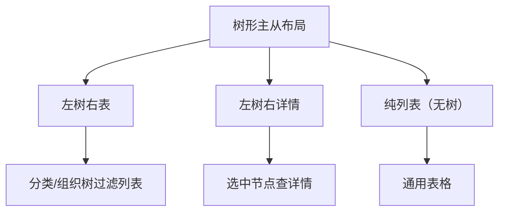

# 组件设计 · 树形主从布局

> 左树右表 / 左树右详情的主从布局：左右比例与可调分割 / 选中联动过滤 / 树搜索与维护 / 窄屏抽屉 / 空态
> 实现侧命名与落点见《[前端基类清单](../../../../前端基类清单.md)》，实现契约细节见项目详细设计。

[文档首页](../../../../文档首页.md) › [项目规划说明](../../../../规划/项目规划说明.md) › [组件设计](../../01_组件设计_总览.md) › 树形主从布局　|　[← 多标签导航](../04_组件设计_多标签导航/04_组件设计_多标签导航.md)　[栅格 →](../06_组件设计_栅格/06_组件设计_栅格.md)

> 可交互原型：[05_原型设计_树形主从布局.html](05_原型设计_树形主从布局.html)（演示左树右表联动、树搜索、选中过滤、可调分割、窄屏树抽屉、空态）

## 1. 目的与适用范围 

定义 BMS 前端**树形主从布局**的组件设计：布局壳（左侧主（树）+ 右侧从（列表/详情），可选分割条、折叠、窄屏抽屉）与主树（分类/组织/目录树的搜索、选中、懒加载、右键/工具栏增删改入口）。适用于**左树右表**（按分类/组织树过滤列表）与**左树右详情**（选中树节点查详情）的管理页，是[《布局设计 · 列表页》](../../../布局设计/07_布局设计_列表页.html)「左树右表」形态的**通用布局组件**。

### 1.1 定位 

职责边界与形态分流如下：

- **左树右表**：左侧分类/组织/目录树，右侧筛选区 + 通用表格（按选中节点过滤）。
- **左树右详情**：左树为导航，右侧为记录详情（只读/编辑）。
- 上游设计依据[《布局设计 · 列表页》](../../../布局设计/07_布局设计_列表页.html)（左树右表形态）、[《布局设计 · 表单框架》](../../../布局设计/06_布局设计_表单框架.html)（主从表单）、[《布局设计 · 响应式适配》](../../../布局设计/11_布局设计_响应式适配.html)（窄屏左树收进抽屉）、[《布局设计 · 主框架》](../../../布局设计/04_布局设计_主框架.html)；协作节点为[字段类「树选择字段」](../../06_字段类/04_组件设计_树选择字段/04_组件设计_树选择字段.md)（树渲染/搜索/懒加载口径）、[展示类「通用表格」](../../07_展示类/01_组件设计_通用表格/01_组件设计_通用表格.md)（右侧从区）、[展示类「查询筛选区」](../../07_展示类/02_组件设计_查询筛选区/02_组件设计_查询筛选区.md)、[展示类「异常与空状态」](../../07_展示类/05_组件设计_异常与空状态/05_组件设计_异常与空状态.md)、[布局组件类「多标签导航」](../04_组件设计_多标签导航/04_组件设计_多标签导航.md)（详情可开标签）。

> 本篇为「树形主从布局」节点。**范围边界**：**树控件本身的渲染/搜索/懒加载**已在[字段类「树选择字段」](../../06_字段类/04_组件设计_树选择字段/04_组件设计_树选择字段.md)定义，本节点复用其树能力，专注**主从布局**（左右比例、联动过滤、窄屏适配、空态）；**列表与筛选**归[展示类「通用表格」](../../07_展示类/01_组件设计_通用表格/01_组件设计_通用表格.md)/[展示类「查询筛选区」](../../07_展示类/02_组件设计_查询筛选区/02_组件设计_查询筛选区.md)；**布局形态规范**归[《布局设计 · 列表页》](../../../布局设计/07_布局设计_列表页.html)。

## 2. 职责与组成 

| 组成部分 | 职责 |
| --- | --- |
| 主从布局壳件 | 左主右从、可调分割（可选）、折叠、窄屏抽屉、空态、左右插槽 |
| 主树件 | 复用树数据能力域基类（搜索/选中/懒加载/展开），工具栏（新增/编辑/删除/刷新）、右键菜单、选中回调 |
| 主从状态 | 主从状态（选中节点、树展开集、比例、窄屏抽屉开关） |

## 3. 交互与契约语义 

| 语义项 | 说明 |
| --- | --- |
| 主区宽度（masterWidth） | 主区宽度（像素或百分比）；可调时作为初始值，缺省 260 |
| 可调分割（resizable） | 可拖动分割条调整左右比例 |
| 主区折叠（collapsible） | 主区可折叠/展开，缺省可折叠 |
| 主区标题（masterTitle） | 如「组织」/「分类」 |
| 未选中占位（emptyText） | 从区未选中节点时的占位文案，缺省「请选择左侧节点」 |
| 比例持久化键（splitStorageKey） | 分割比例持久化到用户偏好的键 |
| 选中通知 | 主树选中节点（空表示清除）→ 触发从区重新查询 |
| 折叠通知 | 主区折叠状态变化 |

### 3.1 主树交互与契约语义 

| 语义项 | 说明 |
| --- | --- |
| 树数据（treeData） | 节点含 id / parentId / label / children / leaf? / count? |
| 加载模式（loadMode） | 枚举：全量（all）/ 懒加载（lazy），缺省全量 |
| 懒加载取数（loadChildren） | 懒加载子节点的取数语义（懒加载模式） |
| 多选（checkable） | 多选时从区按多节点并集过滤 |
| 节点计数（showCount） | 节点右侧显示记录数 |
| 工具栏（toolbar） | 显示增删改/刷新工具栏 |
| 维护权限（managePermission） | 树节点增删改所需权限码（无权限隐藏对应入口） |
| 选中通知 | 选中节点（空表示清除） |
| 节点维护通知 | 新增 / 编辑 / 删除入口（弹窗由业务实现） |
| 刷新通知 | 刷新树（可指定父节点） |

## 4. 布局与联动 

| 项 | 设计 |
| --- | --- |
| 结构 | 左主（树）固定/可调 + 右从（列表/详情）自适应；分割条可拖动（`resizable`） |
| 联动过滤 | 选中树节点 → 从区带 `nodeId` 重新查询（树节点与列表数据的关联字段由业务约定）；支持多选并集 |
| 未选中 | 从区显示占位（`emptyText`）或显示全部（可配 `showAllOnEmpty`）（[展示类「异常与空状态」](../../07_展示类/05_组件设计_异常与空状态/05_组件设计_异常与空状态.md)） |
| 树搜索 | 复用树控件搜索（关键字过滤/高亮，[字段类「树选择字段」](../../06_字段类/04_组件设计_树选择字段/04_组件设计_树选择字段.md)） |
| 树多选 | `checkable` 时选中多个节点，从区按并集过滤并显示「已选 N 项」 |
| 树维护 | 工具栏/右键菜单新增/编辑/删除节点（权限控制），成功后刷新树 |
| 树节点计数 | `showCount` 时节点右侧显示记录数（可选） |
| 懒加载 | `loadMode='lazy'` 按需加载子节点（大数据量树） |
| 折叠 | 主区折叠后从区占满，提供展开入口；折叠状态可选持久化 |
| 窄屏 | 窄屏（[《布局设计 · 响应式适配》](../../../布局设计/11_布局设计_响应式适配.html)）主树收进抽屉，由「筛选/树」按钮唤起；从区全宽 |
| 空树 | 无节点时显示空态与「新增」入口 |
| 与标签 | 从区列表双击可开详情标签（[布局组件类「多标签导航」](../04_组件设计_多标签导航/04_组件设计_多标签导航.md)）；左树右详情形态右侧即详情 |

## 5. 场景集成 

| 场景 | 说明 |
| --- | --- |
| 组织/用户 | 左组织树 + 右用户列表 |
| 分类/商品（业务） | 左分类树 + 右商品/条目列表 |
| 部门/岗位 | 左部门树 + 右岗位列表 |
| 目录/报表 | 左目录树 + 右报表/数据集 |
| 左树右详情 | 左导航树 + 右记录详情（可编辑） |

## 6. 依赖接口与上游变更 

### 6.1 上游接口与口径 

| 项 | 说明 | 目标文档 |
| --- | --- | --- |
| 树数据 | 树接口（分类/组织/目录树，含 `id/parentId/label/children/count?`） | [《布局设计 · 列表页》](../../../布局设计/07_布局设计_列表页.html)（登记项①） |
| 列表过滤 | 从区列表按 `nodeId`/`nodeIds` 过滤参数 | [展示类「通用表格」](../../07_展示类/01_组件设计_通用表格/01_组件设计_通用表格.md) |
| 树数据能力域基类 | 搜索/懒加载/展开/选中（继承链上的能力域基类） | [字段类「树选择字段」](../../06_字段类/04_组件设计_树选择字段/04_组件设计_树选择字段.md) |
| 分割比例 | 主从比例持久化（用户偏好） | [《概要设计 · 用户喜好》](../../../概要设计/04_概要设计_用户喜好.md)（登记项②） |
| 新增依赖 | **无**：复用既有树、表格与分割条基础件 | — |

### 6.2 需登记的上游变更 

| 变更点 | 目标文档 | 内容 |
| --- | --- | --- |
| ① 树形主从布局细则 | [《布局设计 · 列表页》](../../../布局设计/07_布局设计_列表页.html)「左树右表」节 | 补通用主从布局细则：主区宽度与可调分割、树选中→从区过滤（多选并集）、未选中占位/显示全部、树搜索与计数、树节点增删改入口、折叠、空树；标注组件设计·树形主从布局为组件契约依据 |
| ② 主从比例与折叠偏好 | [《概要设计 · 用户喜好》](../../../概要设计/04_概要设计_用户喜好.md) | 明确主从分割比例/主区折叠状态存用户偏好（跨端同步口径） |
| ③ 窄屏主树抽屉 | [《布局设计 · 响应式适配》](../../../布局设计/11_布局设计_响应式适配.html)「列表页窄屏」节 | 明确窄屏左树收进抽屉、由按钮唤起、从区全宽；抽屉宽度与关闭行为 |

> 按[《文档生成规范》](../../../../规范/文档生成规范.md)「引用与追溯」节，上述变更需用户确认后由上游文档同步；本节点只定义组件契约，不单独裁决布局与数据结构。

## 7. 权限 / i18n / 移动端 

- **权限**：树节点增删改按 `managePermission` 隐藏/禁用（[基础类「权限指令」](../../09_基础类/02_组件设计_权限指令/02_组件设计_权限指令.md)）；数据范围权限作用于从区列表查询（后端）。
- **i18n**：主区标题/树节点名由业务 i18n（分类名可翻译）；界面文案（占位/工具栏/确认）走全局语言能力。
- **移动端**：主树默认收起为抽屉，从区全宽；手势与抽屉配合（[《布局设计 · 移动端》](../../../布局设计/15_布局设计_移动端.html)）。

## 8. 性能与边界 

| 场景 | 设计 |
| --- | --- |
| 大树 | `loadMode='lazy'` 懒加载；搜索走接口；虚拟滚动（可选，超大节点数） |
| 联动 | 选中变化触发一次从区查询；防抖；请求竞态取最新（[基础类「请求封装」](../../09_基础类/01_组件设计_请求封装/01_组件设计_请求封装.md)） |
| 渲染 | 从区表格分页；主区树按需渲染 |
| 边界 | 空树、未选中节点、多选并集、懒加载失败重试、节点删除后选中项失效（回退父节点/清空）、窄屏抽屉、比例持久化键冲突、折叠后入口、请求竞态 |
| 不支持 | 树控件内部实现（树选择字段）、列表/筛选实现（通用表格/查询筛选区）、移动端手势细节（移动端布局） |

## 9. 检查清单 

- □ 组成与分层：主从布局壳件、主树件、主从状态；树数据经继承链上的树数据能力域基类（复用树选择字段语义）
- □ 布局：左主右从、可调分割（`resizable`）、折叠、窄屏抽屉、空态、左右插槽
- □ 联动：选中过滤（多选并集）、未选中占位/显示全部、树搜索、计数、树节点增删改入口
- □ 数据：全量/懒加载、请求竞态取最新、节点删除后选中回退
- □ 权限（树维护按权限码/数据范围）、i18n（节点名/文案）、移动端（抽屉 + 从区全宽）符合第 7 节
- □ 性能边界：大树懒加载/虚拟滚动、联动防抖、竞态处理
- □ 三项上游登记已确认：树形主从布局细则、主从比例与折叠偏好、窄屏主树抽屉

> 组件设计节点 · 与[《布局设计 · 列表页》](../../../布局设计/07_布局设计_列表页.html)[《布局设计 · 表单框架》](../../../布局设计/06_布局设计_表单框架.html)[《布局设计 · 响应式适配》](../../../布局设计/11_布局设计_响应式适配.html)[《布局设计 · 移动端》](../../../布局设计/15_布局设计_移动端.html)[《概要设计 · 用户喜好》](../../../概要设计/04_概要设计_用户喜好.md)[字段类「树选择字段」](../../06_字段类/04_组件设计_树选择字段/04_组件设计_树选择字段.md)[展示类「通用表格」](../../07_展示类/01_组件设计_通用表格/01_组件设计_通用表格.md)[展示类「查询筛选区」](../../07_展示类/02_组件设计_查询筛选区/02_组件设计_查询筛选区.md)《命名规范》配套
