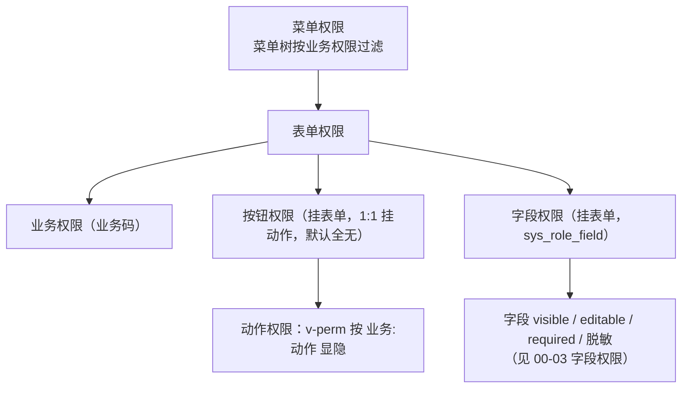

# 组件设计 · 权限指令

> v-perm · hasPerm · usePermissionStore · canAccess（字段权限见 00-03）

[文档首页](../../../../文档首页.md) › [项目规划说明](../../../../规划/项目规划说明.md) › [组件设计](../../01_组件设计_总览.md) › 权限指令　|　[← 请求封装](../01_组件设计_请求封装/01_组件设计_请求封装.md)　[格式化工具 →](../03_组件设计_格式化工具/03_组件设计_格式化工具.md)

> 可交互原型：[20_原型设计_权限指令.html](02_原型设计_权限指令.html)（演示 v-perm 按钮显隐、无权限跳 403、双重控制；字段权限 visible/editable 见 [00-03 字段权限原型](../../00_基础组件类/L3_受控值与字段基类/04_组件设计_字段权限基类/03_原型设计_字段权限基类.html)）

## 1. 目的与适用范围 <a id="purpose"></a>

定义 BMS 前端 `frontend/` **动作权限渲染**的通用契约：按钮级动作权限指令 `v-perm`、权限判断组合式函数 `hasPerm`/`usePermissionStore`、路由守卫与无权限兜底。适用于 PC 管理端全部页面与按钮。

> **范围变更**：原「权限指令与字段权限」中的**字段权限**部分（`useFieldPerm`/`v-plain`/字段数据来源/只读分态/脱敏）已迁出，**权威定义见 [00-03 字段权限](../../00_基础组件类/L3_受控值与字段基类/04_组件设计_字段权限基类/04_组件设计_字段权限基类.md)**；本篇专注**动作/按钮权限**。

本节对应[《项目规划说明》](../../../../规划/项目规划说明.md)权限体系；架构依据[《架构设计 · 权限计算引擎》](../../../架构设计/11_架构设计_子系统_权限计算引擎.md)（权限分层、双端下发）、[《架构设计 · 前端架构》](../../../架构设计/28_架构设计_前端架构.md)（动态菜单与权限渲染、`v-perm`）与[《架构设计 · 接口与集成》](../../../架构设计/06_架构设计_接口与集成.md)（`require_permission` 两级校验）；数据来源依据[《概要设计 · 菜单管理》](../../../概要设计/07_概要设计_菜单管理.md)（权限码下发）；无权限页面依据[《布局设计 · 异常与空状态》](../../../布局设计/12_布局设计_异常与空状态.html)（403）。

> 本篇为基础类节点之一。组件设计只描述契约，编码约定以[《前端开发规范》](../../../../规范/前端开发规范.md)「动态菜单与权限」节为准。

## 2. 组件清单与职责 <a id="components"></a>

| 组件 / 工具 | 位置 | 职责 |
| --- | --- | --- |
| `v-perm`（指令） | `src/directives/perm.ts` | 按动作权限码控制元素显隐；无权限时移除 DOM |
| `hasPerm()` | `src/utils/perm.ts` | 编程式权限判断（`hasPerm('user:create')`） |
| `usePermissionStore` | `src/stores/permission.ts` | 当前用户权限集合、菜单树、表单/字段元数据、权限版本；登录/刷新后装配 |
| `canAccess()` | `src/router/guard.ts` | 路由守卫：登录态 + 权限码校验，无权限跳 403 |
| `PermButton`（可选组件） | `src/components/common/PermButton.vue` | `v-perm` 的组件化封装（需按条件渲染 disabled 提示时使用） |

- 命名遵循[《命名规范》](../../../../规范/命名规范.md)：指令 `v-perm="'业务:动作'"`、组合式函数 `use` + 名词、store `useXxxStore`。
- 移动端（frontend-mobile）工程独立，按钮显隐用轻量 `hasPerm` 判断，不用 PC 指令（见第 9 节）。

## 3. 权限模型与数据来源 <a id="model"></a>

### 3.1 权限分层 <a id="model-layer"></a>



- 权限码格式 `业务:动作`（如 `user:create`、`wf:approve`）；业务存 `sys_business`、动作存 `sys_action`（平台库）。
- 前端权限集合来自菜单接口下发；后端 `require_permission("业务:动作")` 强制校验，前端显隐仅为体验（**双重控制**，默认无按钮权限）。
- **字段权限**（`visible`/`editable`/`required`/脱敏）不在本篇，见 [00-03 字段权限](../../00_基础组件类/L3_受控值与字段基类/04_组件设计_字段权限基类/04_组件设计_字段权限基类.md)。

### 3.2 动作权限数据来源 <a id="model-action"></a>

| 项 | 设计 |
| --- | --- |
| 动作定义 | `sys_action`（业务:动作），角色经授权持有 |
| 下发路径 | `GET /api/v1/menus/my` 随菜单下发当前用户动作权限集合 |
| 默认口径 | 默认无按钮权限（未授予即不渲染）；菜单权限决定页面可达 |
| 存储 | `usePermissionStore.permissions: Set<string>`，O(1) 判断 |

## 4. v-perm 指令 <a id="v-perm"></a>

```html
<!-- 单个权限码 -->
<el-button v-perm="'user:create'" type="primary">新增</el-button>
<!-- 任一满足（数组） -->
<el-button v-perm="['user:update', 'user:assign_role']">分配岗位</el-button>
<!-- 取反（如「取消置顶」仅在有权限时显示） -->
<el-button v-perm.not="'notice:update'">只读提示</el-button>
```

| 项 | 设计 |
| --- | --- |
| 语义 | 有权限 → 保留元素；无权限 → 从 DOM 移除（非 `display:none`，避免被绕过） |
| 参数 | 支持 string 或 string[]；数组默认「任一满足」（anyOf），可用修饰符 `.all` 要求全部满足 |
| 时机 | `mounted` 与 `updated` 时评估；权限集合变化（登录/切换租户/权限版本变更）触发重新评估 |
| 与 disabled 区别 | 需要「可见但禁用并提示原因」时，用 `PermButton` 组件传 `disabled`，而非 `v-perm` 移除 |
| 无权限默认 | 默认无按钮权限：未授予的动作权限对应按钮不渲染 |

## 5. 编程式判断与 Store <a id="store"></a>

### 5.1 usePermissionStore <a id="perm-store"></a>

| 成员 | 说明 |
| --- | --- |
| `permissions: Set<string>` | 当前用户动作权限码集合（`业务:动作`） |
| `menus` | 动态菜单树（按业务权限过滤，含 i18n 名称） |
| `formMeta` | 表单元数据（按钮/字段定义与本用户 visible/editable/required 状态）；字段权限消费见 [00-03](../../00_基础组件类/L3_受控值与字段基类/04_组件设计_字段权限基类/04_组件设计_字段权限基类.md) |
| `permVersion` | 权限版本号；变更（角色/授权/主体绑定）时 +1，触发重新装配 |
| `has(code)` | 判断单个/数组权限码 |
| `load()` | 拉取菜单与权限（登录后、租户切换、权限版本变化时） |
| `reset()` | 登出/会话失效时清空 |

### 5.2 hasPerm 与 route guard <a id="has-perm"></a>

```typescript
function hasPerm(code: string | string[], mode?: 'any' | 'all'): boolean
// 用于不可直接指令化的场景：v-if、计算属性、方法内判断、路由 meta 校验
```

- 路由守卫 `canAccess()`：登录态校验（无 → 跳登录并带 `redirect`）→ 路由 `meta.perm` 权限码校验（无 → 跳 403 页，见[《布局设计 · 异常与空状态》](../../../布局设计/12_布局设计_异常与空状态.html)）。
- 路由动态注册由菜单树驱动，前端不硬编码路由表；无权限路由不注册。

## 6. 与请求封装协作 <a id="cooperate-request"></a>

- 双重控制：前端 `v-perm` 显隐 + 后端 `require_permission`；即使前端被绕过，后端仍拒绝。
- 403 响应由响应拦截器统一提示并跳 403（见 [请求封装](../01_组件设计_请求封装/01_组件设计_请求封装.md)第 9 节）。
- 权限版本变更（实时推送或下次请求）→ `usePermissionStore.load()` 重新装配菜单、权限集合与字段元数据；字段权限重算见 [00-03](../../00_基础组件类/L3_受控值与字段基类/04_组件设计_字段权限基类/04_组件设计_字段权限基类.md)。

## 7. 性能与边界 <a id="performance"></a>

| 场景 | 设计 |
| --- | --- |
| 大量按钮 | 权限集合用 `Set` O(1) 判断；指令求值轻量 |
| 指令重评估 | 仅在权限版本变化或组件更新时评估，避免频繁遍历 |
| DOM | 无权限元素不移入 DOM，减少渲染开销 |
| 安全边界 | 前端显隐不构成安全边界，后端强校验为准（见[《架构设计 · 性能与安全》](../../../架构设计/27_架构设计_性能与安全.md)） |
| 边界态 | 未登录/租户未解析时的权限为空集，页面显示加载/跳登录 |

## 8. i18n <a id="i18n"></a>

- 菜单名、按钮名、字段标签均由后端按 locale 下发（i18n 附表），前端不硬编码。
- 无权限提示、403 页文案走 vue-i18n 语言包（`common.noPermission` 等）。

## 9. 移动端说明 <a id="mobile"></a>

- frontend-mobile 独立工程，使用轻量 `hasPerm` 判断控制按钮与入口显隐（Vant 组件），不复用 PC 的 `v-perm` 指令实现。
- 字段权限同为表单元数据下发，契约见 [00-03 字段权限](../../00_基础组件类/L3_受控值与字段基类/04_组件设计_字段权限基类/04_组件设计_字段权限基类.md)；移动端表单按 `visible` 跳过、`editable` 置只读。

## 10. 检查清单 <a id="checklist"></a>

- □ `v-perm` 按 `业务:动作` 显隐，无权限移除 DOM；数组默认 anyOf，`.all` 可要求全部
- □ `hasPerm` 与 `usePermissionStore` 权限集合来自菜单接口，路由守卫校验登录态与 `meta.perm`
- □ 双重控制落实：前端显隐 + 后端 `require_permission` 强校验
- □ 权限版本变更触发重新装配；403 跳转与提示符合[《布局设计 · 异常与空状态》](../../../布局设计/12_布局设计_异常与空状态.html)
- □ 菜单/按钮文案走 i18n 附表，前端不硬编码
- □ 字段权限职责已分离，统一见 [00-03 字段权限](../../00_基础组件类/L3_受控值与字段基类/04_组件设计_字段权限基类/04_组件设计_字段权限基类.md)
- □ 移动端独立实现，动作权限契约同源（第 9 节）

> 组件设计节点 · 与[《架构设计 · 权限计算引擎》](../../../架构设计/11_架构设计_子系统_权限计算引擎.md)[《概要设计 · 菜单管理》](../../../概要设计/07_概要设计_菜单管理.md)[《布局设计 · 异常与空状态》](../../../布局设计/12_布局设计_异常与空状态.html)[00-03 字段权限](../../00_基础组件类/L3_受控值与字段基类/04_组件设计_字段权限基类/04_组件设计_字段权限基类.md)[《前端开发规范》](../../../../规范/前端开发规范.md)配套
