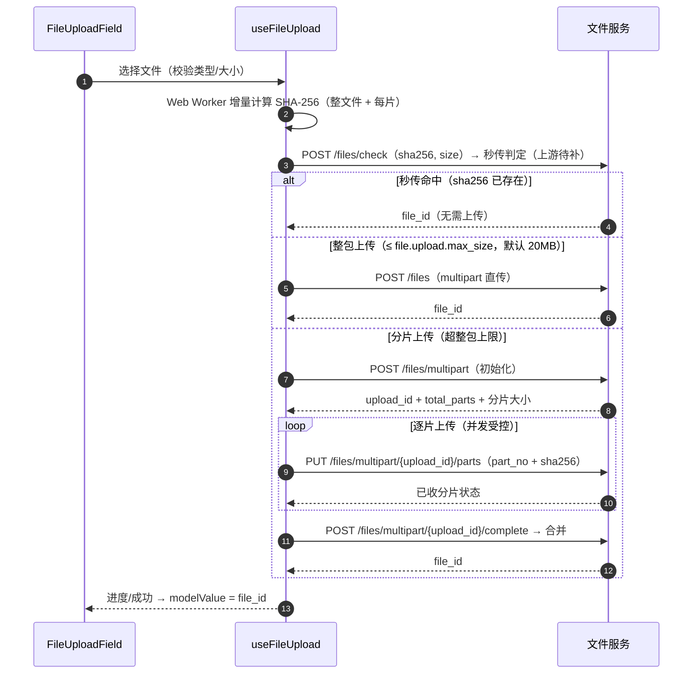

# 组件设计 · 文件上传字段

> FileUploadField · ImageUploadField · useFileUpload · FileListField

[文档首页](../../../../文档首页.md) › [项目规划说明](../../../../规划/项目规划说明.md) › [组件设计](../../01_组件设计_总览.md) › 文件上传字段　|　[← 组织选择字段](../05_组件设计_组织选择字段/05_组件设计_组织选择字段.md)　[富文本字段 →](../07_组件设计_富文本字段/07_组件设计_富文本字段.md)

> 可交互原型：[07_原型设计_文件上传字段.html](06_原型设计_文件上传字段.html)（演示文件/图片上传、类型与大小限制、分片进度、秒传、失败重试、只读回显与下载预览）

## 1. 目的与适用范围 

定义 BMS 前端 `frontend/` **文件与图片上传字段**的通用组件设计：通用文件上传（FileUploadField）、图片上传（ImageUploadField）、只读文件列表（FileListField），以及上传引擎组合式函数 `useFileUpload`（分片、秒传、断点续传、进度、重试）。适用于附件、证明材料、头像、图片凭证等上传场景。

本节对应[《项目规划说明》](../../../../规划/项目规划说明.md)前端与文件管理章节；上游设计依据[《概要设计 · 文件管理》](../../../概要设计/13_概要设计_文件管理.md)（文件表 `sys_file`、整包/分片上传/下载预览接口、类型与限额）与[《架构设计 · 文件管理子系统》](../../../架构设计/16_架构设计_子系统_文件管理.md)（对象存储私有桶、分片状态机、断点续传、孤儿分片回收）；页面形态依据[《布局设计 · 表单页》](../../../布局设计/08_布局设计_表单页.html)（附件字段、只读/编辑分态）。

> 本篇为组件设计体系字段类第 06 篇；富文本内嵌图片上传见 [富文本字段](../07_组件设计_富文本字段/07_组件设计_富文本字段.md)节点（复用本节点上传引擎）。

## 2. 组件清单与职责 

| 组件 / 工具 | 位置 | 职责 |
| --- | --- | --- |
| `FileUploadField.vue` | `src/components/field/` | 通用文件上传：单/多文件、类型白名单、大小限制、进度、失败重试、拖拽 |
| `ImageUploadField.vue` | `src/components/field/` | 图片上传：缩略图预览、多图、可选压缩与尺寸校验、头像裁剪形态 |
| `FileListField.vue` | `src/components/field/` | 只读文件列表：文件名、大小、下载、预览（图片/PDF） |
| `useFileUpload()` | `src/utils/useFileUpload.ts` | 上传引擎：分片、秒传（哈希）、断点续传、并发控制、进度聚合 |

- 字段类组件统一受控：`modelValue` / `update:modelValue` + `change`（见[《组件设计 · 总览》](../../01_组件设计_总览.md)）；`modelValue` 为文件 id 或 id 数组（非文件对象）。
- 命名遵循[《命名规范》](../../../../规范/命名规范.md)。

## 3. 上传流程（分片 / 秒传 / 断点续传） 

| 阶段 | 说明 |
| --- | --- |
| 前端校验 | 扩展名 + MIME + 大小 + 数量，超限即时提示（不发起请求） |
| 哈希口径 | 整文件与每个分片统一 **SHA-256**（与 `sys_file.sha256`、分片校验口径一致）；在 Web Worker 中分片增量计算，同一遍读取同时产出分片哈希与整文件哈希，不阻塞主线程 |
| 秒传 | 先按 `sha256 + size` 调 `POST /files/check` 判定，命中直接返回既有 `file_id`（该接口上游未定义，本节点登记为上游变更，见第 9 节）；`checkInstant=false` 时跳过哈希与判定 |
| 整包 | 文件 ≤ 整包上限（`file.upload.max_size`，默认 20MB）走 `POST /files` 一次直传 |
| 分片 | 超整包上限走分片：`POST /files/multipart` 初始化 → 逐片 `PUT /files/multipart/{upload_id}/parts`（携分片 `sha256`）→ `complete` 合并；并发受控（默认 3），分片大小以初始化返回为准 |
| 断点续传 | 中断后重新初始化并查询已传分片状态，仅补传缺失分片（`part_no` 维度） |
| 合并 | 全部分片成功后调 `complete`，后端合并（MinIO 组合对象）并做整文件校验，返回最终 `file_id` |

## 4. 类型与限额 

| 项 | 设计 |
| --- | --- |
| 类型白名单 | 后端白名单 `file.upload.whitelist`（MIME 清单）兜底；字段元数据可进一步收窄（如附件 `pdf,doc,docx,xls,xlsx,png,jpg`；图片 `png,jpg,jpeg,webp`）；前端按扩展名 + MIME 双重校验 |
| 大小上限 | 整包上限 `file.upload.max_size`（20971520，20MB，超限转分片）与单文件上限 `file.upload.max_file_size`（2147483648，2GB），均来自[《概要设计 · 系统参数》](../../../概要设计/10_概要设计_系统参数.md)「默认参数种子」；字段元数据可声明更小上限（如头像 2MB）；见[《概要设计 · 文件管理》](../../../概要设计/13_概要设计_文件管理.md) |
| 数量上限 | 单字段最大文件数（如 9 张图 / 10 个附件） |
| 后端兜底 | 前端限制仅为体验，后端按类型/大小/病毒扫描兜底（[《架构设计 · 文件管理子系统》](../../../架构设计/16_架构设计_子系统_文件管理.md)） |
| 违规提示 | 类型不允许（错误码 50101）、超出大小（50102）等，组件内联提示（见 [请求封装](../../07_基础类/01_组件设计_请求封装/01_组件设计_请求封装.md)错误码分段 5xxxx） |

## 5. FileUploadField Props 与事件 

| 属性 | 类型 | 默认 | 说明 |
| --- | --- | --- | --- |
| `modelValue` | string \| string[] \| null | — | 文件 id（多文件为数组） |
| `multiple` | boolean | false | 是否多文件 |
| `limit` | number | 10 | 最大文件数 |
| `accept` | string | '' | 类型白名单（扩展名，逗号分隔） |
| `maxSize` | number | 2048 | 单文件大小上限（MB，默认对齐 `file.upload.max_file_size` 2GB） |
| `chunkThreshold` | number | 20 | 触发分片的大小阈值（MB，默认对齐 `file.upload.max_size` 20MB） |
| `chunkSize` | number | 5 | 分片大小（MB）；以 `POST /files/multipart` 返回的 `part_size` 为准，属性仅兜底 |
| `checkInstant` | boolean | true | 是否启用秒传（算 SHA-256 后询问后端）；关闭则省去哈希计算直接上传 |
| `hashConcurrency` | number | 1 | 哈希计算 Worker 并发（大文件增量计算，默认单 Worker） |
| `concurrency` | number | 3 | 分片并发数 |
| `drag` | boolean | true | 是否支持拖拽上传 |
| `disabled` | boolean | false | 只读/无权限（`editable=false` 由表单页传入） |
| `fileListMode` | 'list' \| 'card' | 'list' | 展示形态 |

| 事件 | 载荷 | 说明 |
| --- | --- | --- |
| `update:modelValue` | string \| string[] \| null | v-model 绑定（上传成功后回填 id） |
| `change` | id \| id[] \| null | 变化通知（含增删） |
| `success` | file, response | 单个文件上传成功 |
| `error` | file, err | 上传失败（供页面统一提示/重试） |
| `progress` | { percent, fileId } | 总体/单文件进度 |

## 6. ImageUploadField 

| 项 | 设计 |
| --- | --- |
| 预览 | 缩略图网格 + 点击放大（`el-image` 预览） |
| 压缩 | 可选：前端按最大边长/质量压缩后再上传（超过尺寸阈值时） |
| 尺寸校验 | 可选最小/最大宽高、宽高比校验（如头像 1:1） |
| 头像形态 | 单图 + 圆形裁剪（`avatar` 模式）；裁剪实现可对接交互类裁剪组件 |
| 多图排序 | 支持拖拽排序（多图场景），顺序即 `modelValue` 数组顺序 |

## 7. 进度、失败重试与取消 

| 项 | 设计 |
| --- | --- |
| 进度聚合 | 多文件上传时展示总体进度 + 单文件进度条；分片模式按已传分片聚合 |
| 失败重试 | 单文件失败可重试（断点续传：仅补缺失分片）；不重复上传已传分片 |
| 取消 | 支持取消在途上传（中断分片请求，`AbortController`） |
| 并发控制 | 分片并发数受控；多文件并发受控（避免打满带宽） |
| 幂等 | 上传会话/分片以 `upload_id + index` 幂等，重复上传同一分片不产生副作用 |

## 8. 只读回显与下载预览 

| 场景 | 展示 |
| --- | --- |
| 表单只读态 | `FileListField`：文件名 + 大小 + 图标；图片显示缩略图 |
| 下载 | 点击文件名下载（走下载接口/预签名 URL，携带权限校验） |
| 预览 | 图片、PDF 支持在线预览（图片用 `el-image`，PDF 用内嵌预览） |
| 空值 | `—`（未上传） |
| 已删除文件 | 显示「文件已失效」占位，不可下载 |

## 9. 依赖接口与上游变更 

| 项 | 说明 | 目标文档 |
| --- | --- | --- |
| 整包上传 | `POST /files`（≤20MB，类型白名单 + 大小 + 配额校验，返回 `file_id`） | [《概要设计 · 文件管理》](../../../概要设计/13_概要设计_文件管理.md) |
| 分片上传 | `POST /files/multipart`（初始化，返回 `upload_id`/`total_parts`）、`PUT /files/multipart/{upload_id}/parts`（`part_no` + SHA256 校验）、`POST /files/multipart/{upload_id}/complete`（合并） | [《概要设计 · 文件管理》](../../../概要设计/13_概要设计_文件管理.md) |
| 秒传判定（**上游待补**） | `POST /files/check`（入参 `sha256` + `size`，命中返回既有 `file_id`）：上游文件管理未定义该接口，本节点登记为上游变更，须先补契约与实现 | [《概要设计 · 文件管理》](../../../概要设计/13_概要设计_文件管理.md)、[《架构设计 · 文件管理子系统》](../../../架构设计/16_架构设计_子系统_文件管理.md) |
| 下载/预览 | `GET /files/{id}/download-url`、`GET /files/{id}/preview-url`（返回限时预签名 URL，后端不代理文件流） | [《概要设计 · 文件管理》](../../../概要设计/13_概要设计_文件管理.md) |
| 文件表 | `sys_file`：`id`、`name`、`bucket`、`object_key`、`size`、`mime_type`、`sha256`、`uploader_id`、`upload_id`、`total_parts`、`status`（上传中/完成）、`deleted_at`、审计字段、`version` | [《概要设计 · 文件管理》](../../../概要设计/13_概要设计_文件管理.md) |
| 权限码 | `file:upload`（上传）、`file:download`（下载/预览）、`file:manage`/`file:delete`（列表与删除） | [《概要设计 · 文件管理》](../../../概要设计/13_概要设计_文件管理.md) |
| 限额参数 | `file.upload.max_size`（20MB 整包）、`file.upload.max_file_size`（2GB 单文件）、`file.upload.whitelist`（类型白名单） | [《概要设计 · 系统参数》](../../../概要设计/10_概要设计_系统参数.md) |
| 字段 widget | 表单元数据标注上传字段的 `accept`/`maxSize`/`limit`/`type`(file\|image)：字段定义由菜单管理（`sys_field`）承载，组件类型/属性由表单定制叠加（自建字段类型白名单含 `file`） | [《概要设计 · 菜单管理》](../../../概要设计/07_概要设计_菜单管理.md) + [《概要设计 · 表单定制》](../../../概要设计/36_概要设计_表单定制.md) |

> 整包/分片/下载预览接口路径以[《概要设计 · 文件管理》](../../../概要设计/13_概要设计_文件管理.md)为权威（本节点已对齐）；`POST /files/check`（秒传判定）为上游未定义的**新增项**，须先在文件管理概要与文件管理子系统架构补设计再实现，本节点先按上表契约约定。

## 10. 性能与边界 

| 场景 | 设计 |
| --- | --- |
| 大文件 | 分片上传 + 秒传 + 断点续传；并发受控 |
| 弱网 | 失败可续传；进度可视；超时按请求层配置（上传实例超时更长，见 [请求封装](../../07_基础类/01_组件设计_请求封装/01_组件设计_请求封装.md)） |
| 内存 | 分片读取，避免整文件读入内存（大文件场景） |
| 多文件 | 并发上限 + 队列；避免同时过多请求 |
| 首屏 | 只读态批量取文件名/缩略图（按 id 批量），不逐个请求 |
| 边界 | 0 字节、超限、类型不符、同名文件、上传中断纳入测试 |

## 11. 字段权限 / i18n / 移动端 

- **字段权限**：`visible=false` 不渲染；`editable=false` 传 `disabled`（见 [权限指令](../../07_基础类/02_组件设计_权限指令/02_组件设计_权限指令.md)）；下载/预览受 `file:download` 等动作权限约束，后端校验。
- **i18n**：上传提示（类型/大小/数量）、进度文案、错误提示走 vue-i18n；文件名按原样展示（不翻译）。
- **移动端**：frontend-mobile 用 Vant `Uploader`（支持拍照/相册），分片与秒传能力同源（大文件可退化为直传），不复用 PC 组件。

## 12. 检查清单 

- □ 受控组件（`modelValue` 为文件 id）；单选/多选、数量上限、拖拽
- □ 类型白名单（扩展名 + MIME 双重）与大小上限前端校验，后端兜底
- □ 哈希口径统一 SHA-256（Web Worker 增量计算，整文件 + 每片）；分片 + 秒传 + 断点续传 + 合并；并发受控
- □ 进度聚合、失败重试（补缺失分片）、取消在途上传
- □ 图片：缩略图预览、压缩、尺寸/比例校验、多图排序、头像裁剪形态
- □ 只读回显 `FileListField`：文件名/大小/下载/预览（图片、PDF）；失效文件占位
- □ 上传/下载受动作权限约束；错误码 5xxxx 内联提示
- □ 字段权限与移动端口径符合第 11 节

> 组件设计节点 · 与[《概要设计 · 文件管理》](../../../概要设计/13_概要设计_文件管理.md)[《架构设计 · 文件管理子系统》](../../../架构设计/16_架构设计_子系统_文件管理.md)[《布局设计 · 表单页》](../../../布局设计/08_布局设计_表单页.html)[《命名规范》](../../../../规范/命名规范.md)配套
