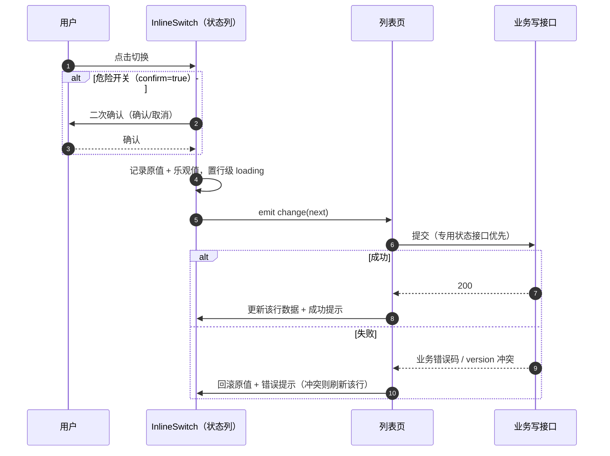

# 组件设计 · 开关与枚举字段

> SwitchField · EnumField · EnumCheckboxField · InlineSwitch · useEnumOptions · getEnumLabel

[文档首页](../../../../文档首页.md) › [项目规划说明](../../../../规划/项目规划说明.md) › [组件设计](../../01_组件设计_总览.md) › 开关与枚举字段　|　[← 富文本字段](../07_组件设计_富文本字段/07_组件设计_富文本字段.md)　[穿梭框 →](../09_组件设计_穿梭框/09_组件设计_穿梭框.md)

> 可交互原型：[09_原型设计_开关与枚举字段.html](08_原型设计_开关与枚举字段.html)（演示开关编辑与三态、列表内联切换与失败回滚、自定义枚举五种形态、选项集编辑与字典引用、只读回显与导入导出映射）

## 1. 目的与适用范围 <a id="purpose"></a>

定义 BMS 前端 `frontend/` **开关与枚举字段**的通用组件设计：布尔开关 `SwitchField`（含列表/详情内联切换 `InlineSwitch`）、自定义选项集枚举 `EnumField`（单选：radio / button / segmented）与 `EnumCheckboxField`（多选：checkbox / tag），以及选项集解析组合式函数 `useEnumOptions` 与回显工具 `getEnumLabel`、布尔值归一工具 `toBoolValue`。覆盖值域与存储映射、三态与默认值、校验、列表内联切换、只读回显（含可选颜色标签）与导入导出映射。适用于用户/角色/菜单/租户/系统参数等管理页的「启用停用」开关、状态标记、优先级与类型等自定义枚举字段。

本节对应[《项目规划说明》](../../../../规划/项目规划说明.md)前端与字典管理章节；上游设计依据[《概要设计 · 表单定制》](../../../概要设计/36_概要设计_表单定制.md)（字段类型白名单 `switch`/`select`/`multi_select`、字段属性调整与选项集、服务端动态校验）、[《概要设计 · 菜单管理》](../../../概要设计/07_概要设计_菜单管理.md)（`sys_field` 字段维护与 `sys_role_field` 字段权限）、[《概要设计 · 字典管理》](../../../概要设计/09_概要设计_字典管理.md)（字典取数与缓存）、[《概要设计 · 导入导出》](../../../概要设计/19_概要设计_导入导出.md)（行级枚举校验与错误行报告）；页面形态依据[《布局设计 · 表单页》](../../../布局设计/08_布局设计_表单页.html)（只读/编辑分态）与[《布局设计 · 列表页》](../../../布局设计/07_布局设计_列表页.html)（无操作列、行内状态变更、状态 tag 语义色，配合[《布局设计 · 表格明细》](../../../布局设计/09_布局设计_表格明细.html)）；查询区条件形态依据[《布局设计 · 表单定制》](../../../布局设计/14_布局设计_表单定制.html)；协作节点为[字典字段](../01_组件设计_字典字段/01_组件设计_字典字段.md)（字典取数与翻译）、状态标签与描述列表（状态标签本体）、[请求封装](../../07_基础类/01_组件设计_请求封装/01_组件设计_请求封装.md)（错误码提示与列表分页）、[权限指令](../../07_基础类/02_组件设计_权限指令/02_组件设计_权限指令.md)（字段权限）、[格式化工具](../../07_基础类/03_组件设计_格式化工具/03_组件设计_格式化工具.md)（布尔与多值文本格式化）。

> 本篇为组件设计体系字段类第 08 篇。**范围边界**：字典来源的单选/多选**下拉与级联**形态归[《组件设计 · 字典字段》](../01_组件设计_字典字段/01_组件设计_字典字段.md)；本篇负责布尔开关与**非字典来源**（自定义选项集）的枚举字段；只读态颜色标签在本篇仅保留**开关**（`tagColor`），标签本体归 [状态标签与描述列表](../../05_展示类/03_组件设计_状态标签与描述列表/03_组件设计_状态标签与描述列表.md)（`StatusTag` + `statusColor`，取色三层优先级见该节点）。

## 2. 组件清单与职责 <a id="components"></a>

| 组件 / 工具 | 位置 | 职责 |
| --- | --- | --- |
| `SwitchField.vue` | `src/components/field/` | 布尔开关：`el-switch` 封装，三态（未设置）、启用/停用文案变体、危险切换确认、加载态、只读回显 |
| `InlineSwitch.vue` | `src/components/field/` | 列表/详情内联切换：基于 `SwitchField`，负责乐观值、二次确认、行级 loading、失败回滚 |
| `EnumField.vue` | `src/components/field/` | 枚举单选：按 `widget` 渲染 radio / button / segmented 三种形态 |
| `EnumCheckboxField.vue` | `src/components/field/` | 枚举多选：按 `widget` 渲染 checkbox / tag 两种形态，含数量上下限 |
| `useEnumOptions()` | `src/utils/useEnumOptions.ts` | 选项集解析：静态 `options` 或字典引用 → 统一 `OptionItem[]`（含顺序、去重、i18n、颜色） |
| `getEnumLabel()` / `formatEnumText()` | `src/utils/enumValue.ts` | 枚举值 → label（单值/多值文本），缺失回退原值；多值按选项集顺序输出 |
| `toBoolValue()` / `formatBoolText()` | `src/utils/boolValue.ts` | 后端值（0/1、'0'/'1'、true/false、是/否）→ 布尔；布尔 → 只读文本（是/否或 activeText） |

- 字段类组件统一**受控**：`modelValue` / `update:modelValue` 双向绑定，变更额外抛 `change`（见[《组件设计 · 总览》](../../01_组件设计_总览.md)通用设计约定）。
- 命名遵循[《命名规范》](../../../../规范/命名规范.md)：组件 PascalCase 单数名词、组合式函数 `use` + 名词、工具函数 camelCase、布尔字段 `is_` 前缀。
- 移动端（frontend-mobile）工程独立，不引用上述 PC 组件（见第 11 节）。

## 3. 值域与存储口径 <a id="value"></a>

| 字段类型 | 前端值 | 库值 / 列类型 | 空值 | 说明 |
| --- | --- | --- | --- | --- |
| `switch`（布尔开关） | `boolean \| null` | `SMALLINT`（1=是/启用，0=否/停用） | `null` | 前端**只暴露布尔**，1/0 由 `toBoolValue` / `fromBoolValue` 在组件边界归一 |
| `select`（枚举单选，自定义选项集） | `string \| number \| null` | `VARCHAR(64)` | `null` | 值即选项 `value`；不存 label |
| `multi_select`（枚举多选，自定义选项集） | `Array<string \| number>` | `VARCHAR(255)`（按选项集顺序、去重后用 `,` 分隔） | `[]` | 展示顺序按选项集 `sort`，与用户勾选顺序无关 |

- **唯一真值来源是选项 `value`**：前端任何展示文本（label、是/否）都由 `value` 经 `getEnumLabel` / `formatBoolText` 得出，不落库、不参与比较。
- **归一容错**：后端历史值与接口直出可能出现 `0`/`1`/`'0'`/`'1'`/`'true'`/`'是'`/`'否'`，统一由 `toBoolValue()` 归一为布尔；无法识别的值按 `null` 处理并记录一次性告警（开发环境）。
- **写回统一**：布尔写回 `1`/`0`（未设置写 `NULL`）；多选写回按选项集顺序排序去重后的 `value` 数组，序列化交给请求层。
- 自建字段对应的物理列类型为 `SMALLINT`（switch）、`VARCHAR(64)`（select）、`VARCHAR(255)`（multi_select），见[《概要设计 · 表单定制》](../../../概要设计/36_概要设计_表单定制.md)数据模型节。

## 4. SwitchField Props 与事件 <a id="switch-props"></a>

| 属性 | 类型 | 默认 | 说明 |
| --- | --- | --- | --- |
| `modelValue` | boolean \| null | — | 布尔值；`null` 表示未设置（三态） |
| `activeText` / `inactiveText` | string | '' | 文案变体（如「启用 / 停用」），空则只显示开关本体；走 i18n |
| `allowNull` | boolean | false | 是否允许三态（`true` 时开放清空入口并可展示不确定态） |
| `indeterminate` | boolean | false | 只读/编辑态的不确定展示（`null` 时置灰且不显示开/关轨道） |
| `confirm` | boolean \| string | false | 切换前二次确认；字符串为自定义确认文案（危险开关：如「停用后该用户将立即退出登录，确认停用？」） |
| `loading` | boolean | false | 外部提交中（内联切换由 `InlineSwitch` 驱动） |
| `size` | 'default' \| 'small' | 'default' | 尺寸（表格内用 `small`） |
| `disabled` | boolean | false | 只读/无权限（`editable=false` 由表单页传入） |
| `beforeChange` | (next: boolean) => Promise\<boolean\> | — | 切换前置钩子（返回 `false` 则撤销切换），表单页用于联动校验 |

| 事件 | 载荷 | 说明 |
| --- | --- | --- |
| `update:modelValue` | boolean \| null | v-model 绑定 |
| `change` | value: boolean \| null, prev: boolean \| null | 变更通知（**确认通过后**才抛出，未确认不产生变更） |
| `confirm-cancel` | — | 二次确认被取消（供页面统计/提示） |

- **确认与受控的配合**：`confirm` 生效时组件先弹确认，确认前不修改 `modelValue`；确认后抛 `update:modelValue` + `change`，由父层提交（异步提交期间置 `loading`，失败由父层回滚 `modelValue`）。
- 表单页用法：

```html
<SwitchField v-model="form.enabled" active-text="启用" inactive-text="停用"
             :confirm="isDangerous" :loading="saving" :disabled="readonly" />
```

## 5. 列表/详情内联切换 <a id="inline"></a>

[《布局设计 · 列表页》](../../../布局设计/07_布局设计_列表页.html)「交互与状态约定」节已定案「行内状态变更（启用/停用、审批）成功后局部刷新并提示」，且列表页**无操作列**——内联切换即放置在状态列内，不新增操作按钮。

| 项 | 设计 |
| --- | --- |
| 触发 | 状态列内 `InlineSwitch`（`size='small'`），点击即切换；不可编辑时降级为只读文本（`formatBoolText`） |
| 接口 | **复用业务既有写接口**：优先业务专用状态接口（如 `PUT /users/{id}/status`），无专用接口时用该记录 update 接口；**不新增 toggle 接口** |
| 权限 | 记录级可编辑（`sys_role_field.editable`）+ 业务动作权限（如 `user:update`、`tenant:manage`）；不满足则只读（见 [权限指令](../../07_基础类/02_组件设计_权限指令/02_组件设计_权限指令.md)） |
| 确认 | 危险开关（`confirm`）弹二次确认（`ElMessageBox.confirm`，危险按钮样式 danger）；普通开关免确认（对齐列表页既有口径） |
| 成功 | 行级 `ElMessage.success` 提示 + **局部刷新该行**（不整表重载），行内其他字段不闪动 |
| 失败 | 回滚为原值（乐观值丢弃）+ 错误码文案提示（[请求封装](../../07_基础类/01_组件设计_请求封装/01_组件设计_请求封装.md)错误码 → i18n 映射） |
| 并发 | 同一行切换中禁用再次点击（行级 `loading`）；不同行互不影响 |
| 乐观锁 | 后端 `version` 冲突时提示「数据已被他人修改」并刷新该行 |



## 6. 枚举字段：形态与选项集 <a id="enum"></a>

### 6.1 形态由字段属性决定 <a id="enum-widget"></a>

| `widget` | 形态 | 组件 | 适用 |
| --- | --- | --- | --- |
| `radio` | 单选框组（`el-radio-group`） | `EnumField` | 2-5 个选项、需展示全部候选（默认形态） |
| `button` | 按钮组（`el-radio-group` + `el-radio-button`） | `EnumField` | 选项少、强调操作感（如优先级） |
| `segmented` | 分段控件（`el-segmented`） | `EnumField` | 2-4 个互斥视图切换（如时间粒度），**建议 ≤ 5 项** |
| `checkbox` | 复选框组（`el-checkbox-group`） | `EnumCheckboxField` | 多选、选项 ≤ 8 |
| `tag` | 标签点选（`el-check-tag`） | `EnumCheckboxField` | 多选、选项多且需紧凑（技能标签、业务标签） |

- 形态由字段属性 `widget` 声明（默认 `radio` / `checkbox`）；选项数量超过 8 的**单选**场景建议改用字典下拉（[字典字段](../01_组件设计_字典字段/01_组件设计_字典字段.md)）。
- 移动端形态降级为 `van-radio-group` / `van-checkbox-group`（见第 11 节）。

### 6.2 选项集来源 <a id="enum-source"></a>

| 来源 | 声明方式 | 解析路径 |
| --- | --- | --- |
| 静态选项集 | 字段属性 `options`（JSON 数组） | `useEnumOptions` 直接解析，零网络开销 |
| 字典引用 | 字段属性 `dictType`（引用字典 type） | 复用 02 的 `POST /dicts/batch`（版本比对）与 `useDictStore` 缓存、`getDictLabel` 翻译，**不重复实现取数** |

`OptionItem` 结构（静态来源写出，字典来源由解析器映射）：

```typescript
interface OptionItem {
  value: string | number;   // 唯一真值来源
  label: string;            // 当前 locale 展示文本
  labelKey?: string;        // i18n key（静态来源可选，与 label 二选一）
  color?: string;           // 语义色（只读标签用，缺省回退默认色）
  disabled?: boolean;       // 不可选（存量值仍可回显）
  sort?: number;            // 展示顺序
}
```

- **解析顺序**：`sort` 升序 → 相同 `value` 去重（保留首个）→ `labelKey` 经 vue-i18n 翻译（缺翻译回退 `label`）→ 产出只读 `OptionItem[]`。
- **停用/删除选项**：不影响存量数据回显——`getEnumLabel` 找不到选项时回退原值 `value` 并开发环境告警；业务侧「停用条目不参与新选择、已引用旧值不受影响」口径与[《概要设计 · 字典管理》](../../../概要设计/09_概要设计_字典管理.md)业务规则节一致。
- **禁用选项**：`disabled=true` 的选项在选择集合中不可新增，但存量值保留展示（编辑态可见但不可再次勾选）。

### 6.3 Props 与事件（`EnumField` / `EnumCheckboxField`） <a id="enum-props"></a>

| 属性 | 类型 | 默认 | 说明 |
| --- | --- | --- | --- |
| `modelValue` | string \| number \| Array \| null | — | 单选为标量，多选为数组 |
| `widget` | 'radio' \| 'button' \| 'segmented' \| 'checkbox' \| 'tag' | radio / checkbox | 形态（字段属性下发） |
| `options` | OptionItem[] | [] | 静态选项集（与 `dictType` 二选一） |
| `dictType` | string \| null | null | 引用字典类型码（取数与翻译复用 02） |
| `minItems` / `maxItems` | number \| null | null | 多选数量上下限（超限内联提示并阻止提交） |
| `disabled` | boolean | false | 只读/无权限（`editable=false` 由表单页传入） |
| `size` | 'default' \| 'small' | 'default' | 尺寸 |
| `tagColor` | boolean | false | 只读态是否以颜色标签渲染；标签由 [状态标签与描述列表](../../05_展示类/03_组件设计_状态标签与描述列表/03_组件设计_状态标签与描述列表.md) `StatusTag` 渲染（取色与形态见该节点「取色优先级」节） |

| 事件 | 载荷 | 说明 |
| --- | --- | --- |
| `update:modelValue` | 标量 \| 数组 \| null | v-model 绑定 |
| `change` | value | 变更通知（多选为归一排序后的数组） |
| `exceed` | value, limit | 超出 `maxItems` / 低于 `minItems` 时抛出 |

## 7. 校验与默认值 <a id="validate"></a>

| 项 | 规则 |
| --- | --- |
| 布尔必填 | **仅当三态且值为 `null`** 判未填；`false` 视为已填（勾选类语义：显式关闭是有效选择） |
| 布尔非必填 | `null` 与 `false` 均可提交；只读回显分别呈现「—」与「否/停用」 |
| 多选必填 | 空数组判未填；`minItems` / `maxItems` 超限内联提示并阻止提交 |
| 单选必填 | `null` 判未填；选中值不在选项集内视为非法（存量脏值仅在只读态回退原值，编辑态要求重选） |
| 默认值 | 统一由字段属性 `default` 提供：布尔默认 `false`（三态时可为 `null`）、单选默认某个 `value`、多选默认 `[]`；新增表单按默认值预填，字段属性变更不回写存量数据 |
| 服务端一致 | 新增/编辑接口按当前生效布局配置做动态校验（必填/选项集），前端校验仅为体验前置，**以服务端为准**（[《概要设计 · 表单定制》](../../../概要设计/36_概要设计_表单定制.md)「服务端动态校验」节） |
| 配置错误 | `minItems > maxItems`、`default` 不在选项集内等属性非法值由定制侧拦截（表单定制 40408），前端不静默修正 |
| 时机 | `change` 即时校验 + `blur` 校验 + 提交前统一校验；错误文案走 i18n |

## 8. 只读回显与颜色标签 <a id="readonly"></a>

| 场景 | 设计 |
| --- | --- |
| 开关（表单只读态 / 详情页） | 组件置 `disabled` 展示开关本体 + `activeText`/`inactiveText`；无文案配置时按 `formatBoolText` 输出「是/否」 |
| 开关（列表列，不可编辑） | 只读文本「是/否」（或字段配置的启用/停用文案），**不渲染开关控件** |
| 枚举单选只读 | `getEnumLabel(value)` 纯文本 label；缺 label 回退原值 |
| 枚举多选只读 | 按选项集顺序取 label，**顿号（、）分隔**；超长时单行省略并 `title` 全文 |
| 未设置 | 统一 `—`（布尔 `null`、枚举 `null`、多选 `[]`） |
| 颜色标签（可选） | `tagColor=true` 时由 [状态标签与描述列表](../../05_展示类/03_组件设计_状态标签与描述列表/03_组件设计_状态标签与描述列表.md) 的 `StatusTag` 渲染（本节点不再自绘）：取色走该节点「取色优先级」节的三层优先级——数据源自带色（`OptionItem.color`）→ 字段级 `colorMap` → 内置语义映射 → 兜底 `info`；颜色引用设计令牌，形态支持胶囊/点状/圆点/图标 |
| 查询区筛选 | 状态/类型类查询条件以「全部 / 是 / 否」或枚举下拉呈现（[《布局设计 · 表单定制》](../../../布局设计/14_布局设计_表单定制.html)查询类字段），本节点只提供值映射，不定义查询区布局 |
| 导出与打印 | 一律取 label / 是 否 文本口径（第 9 节），不导出库值 |

## 9. 导入导出协作 <a id="import"></a>

| 项 | 导出 | 导入（宽容归一） |
| --- | --- | --- |
| 开关 | 「是 / 否」 | 接受 `是`/`否`、`1`/`0`、`true`/`false`（大小写与全半角归一、首尾空白去除）；未知值 → 行级错误 |
| 枚举单选 | 选项 label | 优先按 label 反查 `value`；也接受直接填 `value`；两者都不匹配 → 行级错误 |
| 枚举多选 | 按选项集顺序拼接 label，分隔符统一「、」 | 接受 `、` / `,` / `|` / `;` 混合分隔，拆分去重后逐个反查；存在未识别项 → 行级错误 |

- 模板列注释给出可选值清单（label 列表，开关列注明「是/否」），降低填写错误。
- 校验在导入解析阶段完成，逐行失败**跳过该行并记错误行号与原因**，成功与失败行数汇总返回（[《概要设计 · 导入导出》](../../../概要设计/19_概要设计_导入导出.md)业务规则节）；提交带 `Idempotency-Key`，重复提交被拦截。
- 导入导出模板列按布局配置生成（平台字段 + 已生效自建字段），列头与表单一致；本节点**不新增接口**，只约定值 ↔ 文本的映射口径。

## 10. 依赖接口与上游变更 <a id="api"></a>

### 10.1 上游接口与口径 <a id="api-contract"></a>

| 项 | 说明 | 目标文档 |
| --- | --- | --- |
| 字段类型与列类型 | `switch` / `select` / `multi_select` 在字段类型白名单内，物理列 `SMALLINT` / `VARCHAR(64)` / `VARCHAR(255)` | [《概要设计 · 表单定制》](../../../概要设计/36_概要设计_表单定制.md)、[《概要设计 · 菜单管理》](../../../概要设计/07_概要设计_菜单管理.md) |
| 字段属性承载位 | 组件形态（`widget`）、选项集（`options` 或 `dictType`）、`default`、`minItems`/`maxItems` 需在表单元数据中下发（登记项①） | [《概要设计 · 表单定制》](../../../概要设计/36_概要设计_表单定制.md) |
| 字典取数 | 引用字典 type 时复用 `POST /dicts/batch`（版本比对）与 `GET /dicts/{type}`，翻译走 `getDictLabel` | [《概要设计 · 字典管理》](../../../概要设计/09_概要设计_字典管理.md)、[字典字段](../01_组件设计_字典字段/01_组件设计_字典字段.md) |
| 内联切换写接口 | 复用业务既有写接口（专用状态接口优先，如 `PUT /users/{id}/status`），不新增 toggle 接口（登记项②） | [《概要设计 · 用户管理》](../../../概要设计/03_概要设计_用户管理.md) 等业务模块、[《布局设计 · 列表页》](../../../布局设计/07_布局设计_列表页.html) |
| 危险开关确认 | 危险切换复用二次确认机制（`ElMessageBox.confirm` + danger 样式）与其 `sys_config` 语义（登记项③） | [《布局设计 · 列表页》](../../../布局设计/07_布局设计_列表页.html)、[《概要设计 · 表单定制》](../../../概要设计/36_概要设计_表单定制.md) |
| 导入导出映射 | 开关「是/否」、枚举 label ↔ value 反查、未知值行级错误 | [《概要设计 · 导入导出》](../../../概要设计/19_概要设计_导入导出.md) |
| 字段权限 | 可见/可编辑由 `sys_role_field`（表单页传 `disabled`）；记录级可编辑决定内联切换是否可用 | [《概要设计 · 菜单管理》](../../../概要设计/07_概要设计_菜单管理.md)、[权限指令](../../07_基础类/02_组件设计_权限指令/02_组件设计_权限指令.md) |
| 错误提示 | 切换失败、校验失败、导入行级错误复用错误码 → i18n 文案映射 | [请求封装与错误处理](../../07_基础类/01_组件设计_请求封装/01_组件设计_请求封装.md) |
| 新增依赖 | **无**：Element Plus 内置 `el-switch` / `el-radio-group` / `el-radio-button` / `el-checkbox-group` / `el-check-tag` / `el-segmented` 覆盖全部形态 | — |

### 10.2 需登记的上游变更 <a id="api-upstream"></a>

| 变更点 | 目标文档 | 内容 |
| --- | --- | --- |
| ① 平台字段自定义选项集与组件形态承载位 | [《概要设计 · 表单定制》](../../../概要设计/36_概要设计_表单定制.md)「字段属性调整」「数据模型」节；[《概要设计 · 菜单管理》](../../../概要设计/07_概要设计_菜单管理.md)字段维护节 | `sys_field` 目前仅有 `form_id/field_key/name/type/sort/status`，无 `options`/`widget` 承载位。需明确：平台字段的自定义选项集与组件形态由**表单定制的字段属性层**承载（与 `sys_field_ext.options` 同构 JSON），而非给 `sys_field` 加列；据此下发到前端 |
| ② 列表内联切换的接口与权限 | 各业务概要节点（如[《概要设计 · 用户管理》](../../../概要设计/03_概要设计_用户管理.md)）「接口清单」节；[《布局设计 · 列表页》](../../../布局设计/07_布局设计_列表页.html) | 明确状态类字段的专用切换接口（如 `PUT /users/{id}/status`）与记录级可编辑校验；无专用接口的业务沿用 update 接口；不新增 toggle 接口 |
| ③ 危险开关的二次确认与语义 | [《概要设计 · 表单定制》](../../../概要设计/36_概要设计_表单定制.md)字段属性节；[《布局设计 · 列表页》](../../../布局设计/07_布局设计_列表页.html) | 字段属性登记「危险开关（危险切换需二次确认）」标记与确认文案来源（i18n），复用既有确认口径，不引入新机制 |

> 按[《文档生成规范》](../../../../规范/文档生成规范.md)「引用与追溯」节，上述变更需用户确认后由上游文档同步；本节点只定义组件契约，不单独裁决接口与元数据结构。

## 11. 字段权限 / i18n / 移动端 <a id="cooperate"></a>

- **字段权限**：`visible=false` 由表单页不渲染；`editable=false` 传 `disabled`（编辑态置灰或只读文本），组件不感知权限逻辑；列表内联切换额外要求记录级可编辑（第 5 节）。开关与枚举均为枚举码值，无脱敏需求（见[权限指令](../../07_基础类/02_组件设计_权限指令/02_组件设计_权限指令.md)）。
- **i18n**：`activeText`/`inactiveText`、确认文案、校验提示、导入错误行文案走 vue-i18n；选项 label 优先 `labelKey` 翻译，字典来源按字典 `_i18n` 附表由接口按 locale 下发；**不翻译用户输入与库值**。
- **移动端**：`frontend-mobile`（Vue 3 + Vant）用 `van-switch` / `van-radio-group` / `van-checkbox-group` / `van-tag` 实现简化版，**只读一律纯文本**（是/否、枚举 label），不做颜色标签；值域、归一与校验口径与 PC 同源（第 3、7 节），不套用 PC 组件。
- **查询区**：状态类条件在查询区以「全部 / 是 / 否」或枚举下拉呈现，取数走本节点的值映射；查询区布局与折叠由[《布局设计 · 列表页》](../../../布局设计/07_布局设计_列表页.html)与展示类「查询筛选区」（11）承载。

## 12. 性能与边界 <a id="performance"></a>

| 场景 | 设计 |
| --- | --- |
| 静态选项集 | 内存解析、零网络开销；解析结果按「字段 key + locale」缓存于表单页作用域 |
| 字典引用 | 复用 02 的批量取数与缓存（表单页多字段合并 `POST /dicts/batch`，版本比对命中时零传输） |
| 千行列表 | 状态列内联切换为轻量控件（`size='small'`）；切换仅更新该行数据对象，避免整表重渲染；行级 `loading` 不阻塞其他行 |
| 大选项集 | 单选选项 > 8 建议改字典下拉（02）；`segmented` 建议 ≤ 5 项，超出给配置告警（定制侧） |
| 连点与并发 | 切换中禁用再次点击；同一行串行；失败回滚原值，冲突（`version`）则刷新该行 |
| 边界 | 三态 `null`、存量脏值（`'0'`/`'1'`/`'是'`/`'否'`）、选项缺失/停用、多选重复值与顺序、`minItems > maxItems` 配置错误、超上限提示、只读缺 label 回退原值，均纳入单测 |
| 不支持 | 开关的动画/过渡自定义、枚举的分组展示（分组枚举按业务拆多个字段）、基于枚举的联动显隐表达式（由表单定制的联动能力承载） |

## 13. 检查清单 <a id="checklist"></a>

- □ 受控组件（`modelValue` / `update:modelValue` + `change`）；布尔只暴露 `true/false`，`1/0` 与其他形态由 `toBoolValue` 归一
- □ 三态：`null` 表未设置、可展示不确定态；必填仅 `null` 判未填（`false` 视为已填）
- □ 内联切换：复用业务既有写接口（专用状态接口优先）、需记录级可编辑、危险开关二次确认、失败回滚、局部刷新与行级 loading
- □ 枚举形态由 `widget` 决定（radio / button / segmented / checkbox / tag）；标记 `disabled` 选项不可新增但存量可回显
- □ 选项集来源支持静态 `options` 与字典 `dictType`（复用 02 取数与翻译），解析含排序、去重与 i18n 回退
- □ 多选 `minItems` / `maxItems` 生效；默认值走字段属性 `default`；与服务端动态校验一致
- □ 只读回显纯文本（开关 是/否 或启用/停用；枚举 label 顿号分隔；空值 `—`）；颜色标签（`tagColor=true`）由 [状态标签与描述列表](../../05_展示类/03_组件设计_状态标签与描述列表/03_组件设计_状态标签与描述列表.md) 的 `StatusTag` 渲染，取色与形态以该节点为准
- □ 导入导出：开关「是/否」宽容归一、枚举 label 优先反查 value、多选分隔符拆分、未知值行级错误
- □ 字段权限（visible/editable）、i18n（文案与选项翻译）、移动端（Vant 简化版、只读纯文本）符合第 11 节
- □ 三项上游登记已确认：选项集与形态承载位、内联切换接口与权限、危险开关二次确认

> 组件设计节点 · 与[《概要设计 · 表单定制》](../../../概要设计/36_概要设计_表单定制.md)[《概要设计 · 菜单管理》](../../../概要设计/07_概要设计_菜单管理.md)[《概要设计 · 字典管理》](../../../概要设计/09_概要设计_字典管理.md)[《概要设计 · 导入导出》](../../../概要设计/19_概要设计_导入导出.md)[《布局设计 · 列表页》](../../../布局设计/07_布局设计_列表页.html)[《布局设计 · 表单页》](../../../布局设计/08_布局设计_表单页.html)[字典字段](../01_组件设计_字典字段/01_组件设计_字典字段.md)[《命名规范》](../../../../规范/命名规范.md)配套
