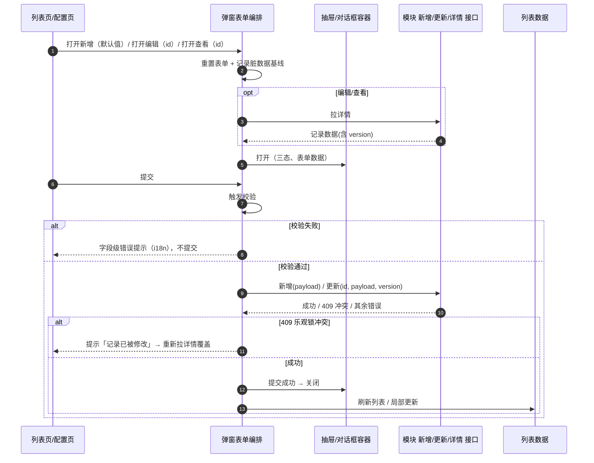
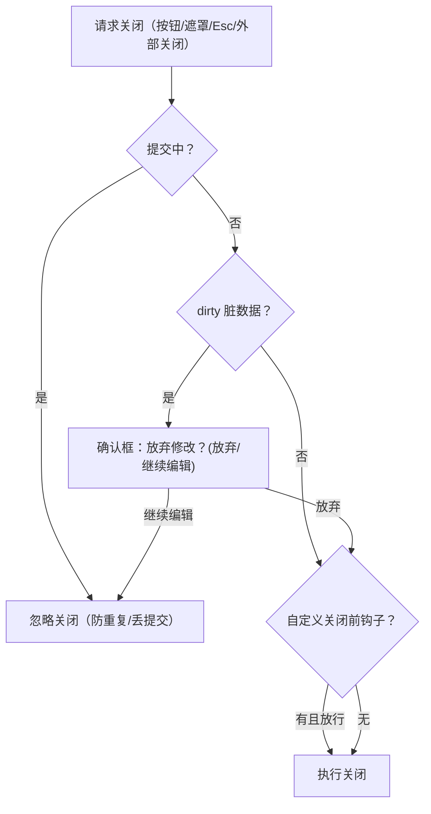

# 组件设计 · 弹窗抽屉表单

> 轻量表单与确认的弹窗/抽屉容器：抽屉与对话框选用 / 新增·编辑·查看三态 / 尺寸阶梯 / 脏数据拦截 / 提交与页脚权限
> 实现侧命名与落点见《[前端基类清单](../../../../前端基类清单.md)》，实现契约细节见项目详细设计。

[文档首页](../../../../文档首页.md) › [项目规划说明](../../../../规划/项目规划说明.md) › [组件设计](../../01_组件设计_总览.md) › 弹窗抽屉表单　|　[← 折叠面板](../../03_布局组件类/11_组件设计_折叠面板/11_组件设计_折叠面板.md)　[滚动容器 →](../02_组件设计_滚动容器/02_组件设计_滚动容器.md)

> 可交互原型：[14_原型设计_弹窗抽屉表单.html](01_原型设计_弹窗抽屉表单.html)（演示抽屉/对话框选用与尺寸阶梯、新增/编辑/查看三态、脏数据拦截与关闭规则、提交反馈、页脚动作权限、嵌套弹窗与确认类对话框）

## 1. 目的与适用范围 

定义 BMS 前端**弹窗/抽屉表单**的组件设计：表单抽屉容器、表单对话框容器与确认对话框，以及轻量表单的开关/三态/校验/提交/脏数据编排与确认类交互。适用于管理端**轻量表单与快捷操作**（快速新建、字典项编辑、权限配置、导入映射、批量操作配置）与**确认类交互**（删除、危险操作二次确认）。

本节对应[《项目规划说明》](../../../../规划/项目规划说明.md)前端章节；页面形态依据[《布局设计 · 弹窗》](../../../布局设计/10_布局设计_弹窗.html)（抽屉/对话框选用、尺寸阶梯、底部操作栏、遮罩与 Esc 关闭规则）、[《布局设计 · 表单页》](../../../布局设计/08_布局设计_表单页.html)「表单组织」「校验与提交」节（label 上方、窄容器单列、必填与乐观锁、提交后刷新列表）、[《布局设计 · 列表页》](../../../布局设计/07_布局设计_列表页.html)（工具栏与行内操作、删除二次确认）、[《布局设计 · 表单定制》](../../../布局设计/14_布局设计_表单定制.html)「渲染规则（三态共用/回退/权限叠加）」节（新增/编辑/详情一套布局、权限优先）；上游设计依据[《概要设计 · 表单定制》](../../../概要设计/36_概要设计_表单定制.md)（`GET /forms/{form_code}/layout-effective` 渲染元数据、字段属性与服务端动态校验）、[《概要设计 · 菜单管理》](../../../概要设计/07_概要设计_菜单管理.md)（`sys_button` 动作挂接、`sys_field`/`sys_role_field` 字段权限）；协作节点为[请求封装](../../09_基础类/01_组件设计_请求封装/01_组件设计_请求封装.md)（提交与错误处理）、[格式化工具](../../09_基础类/03_组件设计_格式化工具/03_组件设计_格式化工具.md)（脏数据比对、校验器工厂）、[权限指令](../../09_基础类/02_组件设计_权限指令/02_组件设计_权限指令.md)（动作权限与字段权限）、[字典字段](../../06_字段类/01_组件设计_字典字段/01_组件设计_字典字段.md)～[开关与枚举字段](../../06_字段类/08_组件设计_开关与枚举字段/08_组件设计_开关与枚举字段.md)（插槽内字段渲染）、[状态标签与描述列表](../../07_展示类/03_组件设计_状态标签与描述列表/03_组件设计_状态标签与描述列表.md)（查看态的只读展示口径）。

> 本篇为「弹窗抽屉表单」节点。**范围边界**：**完整记录的查看/编辑走表单页 Tab**（[《布局设计 · 表单框架》](../../../布局设计/06_布局设计_表单框架.html)，本节点**不承载**），弹窗/抽屉只承载**轻量表单与快捷操作**；字段的控件渲染、字典/组织等数据源、校验规则分别归字段类各节点与[《概要设计 · 表单定制》](../../../概要设计/36_概要设计_表单定制.md)；文件上传字段归 [文件上传字段](../../06_字段类/06_组件设计_文件上传字段/06_组件设计_文件上传字段.md)；导入映射/导出参数表单归 导入导出；移动端不复用 PC 组件（见第 11 节）。

## 2. 职责与组成 

| 组成部分 | 职责 |
| --- | --- |
| 表单抽屉容器 | 抽屉形态的轻量表单外壳：开关、三态标题、尺寸阶梯、固定页脚（提交/取消）、脏数据拦截、提交中状态，内容区承载表单 |
| 表单对话框容器 | 对话框形态：开关、尺寸阶梯（420/480/520）、简单表单（≤ 4 字段）与确认引导，其余契约与抽屉共用 |
| 确认对话框 | 确认类交互：正文自定义（含二次输入确认）、危险语义、禁止遮罩/Esc 关闭、确认回调的提交中状态 |
| 弹窗表单编排 | 开关/三态/表单数据状态、打开新增·编辑·查看、校验、提交（新增/更新）、脏数据基线与比对、成功后关闭并回调 |
| 确认服务 | 确认类契约单份在核心、由渲染侧注入实现，统一危险样式与关闭规则；复杂内容转确认对话框 |

- 表单抽屉与表单对话框**共用同一份契约语义**（差异仅形态与尺寸阶梯），页面按[《布局设计 · 弹窗》](../../../布局设计/10_布局设计_弹窗.html)选用原则二选一；页脚与脏数据编排统一，两个容器不各写一套。

## 3. 选用与尺寸 

### 3.1 容器选用 

| 场景 | 选用 | 说明 |
| --- | --- | --- |
| 轻量表单（快捷新建、子项编辑，≤ 6 字段） | 抽屉（**首选**） | 保留列表上下文，[《布局设计 · 弹窗》](../../../布局设计/10_布局设计_弹窗.html) |
| 简单表单（≤ 4 字段，如重置密码） | 对话框 | 字段少而短，不承载大表单 |
| 确认/危险操作（删除、停用、驳回） | 对话框（确认类） | 正文说明后果，确定按钮危险语义 |
| 完整记录查看/编辑、含明细 | **不使用本节点** | 走表单页 Tab（表单框架），弹窗空间不足 |
| 导入映射、批量操作配置 | 抽屉（复杂表单档 640/720） | 参数多，窄抽屉内部滚动 |

- 标题 = **动作 + 对象**（「新增部门」「编辑用户」），由三态 + 对象名生成，避免只写对象名。
- 抽屉内表单字段**单列**、label 在上方（[《布局设计 · 表单页》](../../../布局设计/08_布局设计_表单页.html)「表单组织」节）；对话框内字段同样单列。

### 3.2 尺寸阶梯 

| 容器 | 档位令牌 | 宽度 | 适用 |
| --- | --- | --- | --- |
| 抽屉 | `sm` / `md` / `lg` / `xl` | 400 / 480 / 640 / 720+ px | 简单表单 / 常规表单 / 复杂表单或明细 / 大表单或自定义列 |
| 对话框 | `sm` / `md` / `lg` | 420 / 480 / 520 px | 确认类 / 简单表单 / 通知引导 |

- 尺寸接受**档位令牌**（`sm`/`md`/`lg`/`xl`）或显式数值，缺省 `md`；不得随意填非阶梯宽度（[《布局设计 · 弹窗》](../../../布局设计/10_布局设计_弹窗.html)检查清单）。
- 抽屉高度撑满、正文内部滚动、页脚固定；对话框按内容高度、超长正文内部滚动、页脚固定。

## 4. 交互与契约语义 

### 4.1 状态与开关语义 

| 语义项 | 说明 |
| --- | --- |
| 显隐 | 受控显隐（双向绑定）；打开时锁定背景滚动，关闭即销毁内容（表单重置、避免残留校验态） |
| 三态 | `create` / `edit` / `view`；决定标题、字段可编辑性与页脚按钮 |
| 尺寸档位 | `sm` / `md` / `lg` / `xl` 或显式宽度，缺省 `md`（见 3.2） |
| 提交中 | 提交中状态：页脚保存按钮进入提交中，禁止任何方式关闭 |
| 关闭规则 | 关闭前脏数据拦截（可显式关闭，如查看态）；表单类默认不允许点遮罩关闭；Esc 关闭但同样走脏数据拦截；确认类强制禁止遮罩与 Esc |
| 页脚与权限 | 是否渲染页脚操作栏；保存/取消文案可定制（如「同意 / 提交」）；保存/删除按钮挂动作权限码（如 `user:create` / `user:update` / `business:delete`），无权限不渲染 |
| 删除入口 | 查看/编辑态可选删除入口，走危险二次确认 |
| 关闭前钩子 | 可自定义关闭前钩子（与脏数据拦截串联，先脏数据后自定义钩子） |

### 4.2 变更通知语义 

| 语义项 | 说明 |
| --- | --- |
| 显隐同步 | 显隐变化同步（双向绑定） |
| 打开时机 | 打开前 / 打开动画结束两个时机 |
| 提交 | 点保存、校验通过后抛出表单数据（由页面或弹窗表单编排接管提交） |
| 成功 | 提交成功（用于关闭并刷新列表/局部更新） |
| 取消与关闭 | 取消 / 关闭前 / 关闭完成三个时机 |
| 脏状态变化 | 表单脏状态变化（供页面提示或跨组件联动） |

### 4.3 内容插槽语义 

| 语义项 | 说明 |
| --- | --- |
| 表单内容（默认） | 表单内容（字段栅格、字典/组织等控件，复用字段类各节点渲染器） |
| 标题 | 自定义标题（缺省按三态生成） |
| 提示条 | 标题下提示/说明条（i18n 文案，如「保存后将同步至全部租户」） |
| 页脚附加 | 页脚左侧附加按钮（如「重置」；主操作仍在右侧） |
| 自定义页脚 | 完全自定义页脚（覆盖默认保存/取消，需自行处理提交中状态与权限） |

### 4.4 命令语义 

| 语义项 | 说明 |
| --- | --- |
| 提交 | 触发校验并提交（供页面工具栏/快捷键调用） |
| 关闭 | 走完整关闭流程（含脏数据拦截与自定义关闭前钩子） |
| 重置 | 重置表单与校验态（打开时默认执行） |
| 回填 | 直接注入/回填表单数据（详情异步返回时用） |

## 5. 表单内容与三态 

| 态 | 数据来源 | 字段可编辑性 | 页脚 |
| --- | --- | --- | --- |
| `create` | 元数据默认值 + 页面默认数据 | 可编辑（字段级不可编辑的禁用） | 取消 / 保存 |
| `edit` | 按 id 拉详情回填 | 可编辑（字段级不可编辑的禁用） | 取消 / 保存（可选删除） |
| `view` | 按 id 拉详情回填 | 全部禁用（与[《布局设计 · 表单页》](../../../布局设计/08_布局设计_表单页.html)只读态一致：禁用输入框） | 关闭（持权限时显示「编辑」转 `edit`） |

- **三态共用一套布局**（[《布局设计 · 表单定制》](../../../布局设计/14_布局设计_表单定制.html)「渲染规则」节）：字段清单/顺序/跨列来自 `GET /forms/{form_code}/layout-effective`，只读态不另做布局；不可见字段不渲染，字段级不可编辑的字段在编辑态禁用（后端写时校验兜底）。
- **字段渲染复用**：插槽内使用与表单页同一套字段渲染器与[字段类](../../06_字段类/01_组件设计_字典字段/01_组件设计_字典字段.md)控件（字典 / 日期 / 金额 / 树选择 / 组织选择 / 上传 / 富文本 / 枚举 / 穿梭框等），保证同一字段在表单页与弹窗内取值、校验、只读口径一致。
- **字段组织**：单选/文本等 label 上方**单列**；> 8 字段用分区标题；长文本/备注跨整行。
- **敏感字段**：默认脱敏展示，持 `data:plain` 显示明文切换（[权限指令](../../09_基础类/02_组件设计_权限指令/02_组件设计_权限指令.md)），提交不回传脱敏值。
- **字段子集（快速表单，可选）**：轻量新增/编辑可只渲染布局声明的字段子集，未列字段取默认值；该能力依赖表单元数据声明（见第 10 节登记项②）。

## 6. 打开 / 提交 / 关闭生命周期 

| 项 | 设计 |
| --- | --- |
| 打开 | 打开新增（默认值）、打开编辑（拉详情）、打开查看（拉详情 + 只读）；打开前重置表单与校验态、重建脏数据基线 |
| 提交前 | 触发校验；失败内联提示不提交；提交中状态防重复提交 |
| 提交 | 由弹窗表单编排调模块新增/更新接口（走[请求封装](../../09_基础类/01_组件设计_请求封装/01_组件设计_请求封装.md)）；编辑携带记录 `version`（乐观锁） |
| 提交后 | 成功 → 成功通知 → 关闭容器 → 刷新列表或按返回数据局部更新（[《布局设计 · 表单页》](../../../布局设计/08_布局设计_表单页.html)「校验与提交」节）；失败 → 保留弹窗与已填值，按错误码提示 |
| 冲突 | 409「记录已被修改」→ 提示并重新拉详情覆盖（不清空弹窗） |
| 关闭 | 走第 7 节拦截链；关闭即销毁内容，下次打开重新初始化 |

## 7. 关闭与未保存拦截 

| 项 | 设计 |
| --- | --- |
| 脏数据基线 | 打开时记录表单数据快照为基线（脏数据比对复用格式化工具口径）；字段变化与基线不等即 dirty |
| 拦截范围 | 按钮取消、点遮罩、Esc、外部关闭统一走拦截链（可显式关闭拦截，如查看态） |
| 确认文案 | 「有未保存的修改，确定放弃吗？」（i18n）；确认框危险按钮为「放弃修改」，次按钮「继续编辑」 |
| 遮罩 / Esc | 表单类**默认不允许**点遮罩关闭；Esc 允许但同样走脏数据拦截；安全场景可显式关闭两者 |
| 提交中 | 禁止任何方式关闭（含 Esc/遮罩/取消按钮），保存按钮进入提交中状态 |
| 查看态 | 无编辑、无脏数据，关闭拦截自动失效，直接关闭 |
| 钩子顺序 | 先脏数据拦截，通过后再执行自定义关闭前钩子（如保存草稿提示），两者串联 |

## 8. 确认类对话框 

| 工具 | 用途 | 说明 |
| --- | --- | --- |
| 轻量确认封装 | 轻量确认（删除、启停、简单危险操作） | 统一警示语义、确定按钮危险样式、禁止点遮罩与 Esc 关闭；返回 Promise，确认后可带提交中状态 |
| 确认对话框 | 需自定义正文/二次输入确认 | 自定义内容插槽（如「输入操作对象名称以确认」）、确认回调的提交中状态、危险语义；关闭规则同确认类（禁遮罩/Esc） |

- **危险操作二次确认**（[《布局设计 · 列表页》](../../../布局设计/07_布局设计_列表页.html)「删除二次确认」节）：删除/停用/驳回等必须显式确认，正文说明后果（「删除后不可恢复」），确定按钮危险语义。
- **确认后行为**：成功后关闭并刷新列表/局部移除行，失败保留并提示错误码文案，不整表重载（对齐 [开关与枚举字段](../../06_字段类/08_组件设计_开关与枚举字段/08_组件设计_开关与枚举字段.md)内联切换口径）。
- **权限**：危险按钮按动作权限码显隐（如 `business:delete`），无权限不渲染。

## 9. 场景集成 

| 场景 | 形态 | 说明 |
| --- | --- | --- |
| 列表页快捷新增/编辑（子项） | 抽屉 `sm`/`md` | 字典项、岗位、参数等轻量实体；保留列表上下文 |
| 权限配置 / 复杂参数 | 抽屉 `lg`/`xl` | 内部滚动，页脚固定；正文分组 |
| 重置密码 / 简单操作 | 对话框 `md` | ≤ 4 字段，短小 |
| 删除 / 危险操作 | 轻量确认 / 确认对话框 | 不可遮罩/Esc，确定按钮危险语义 |
| 导入映射 / 批量配置 | 抽屉 `xl`（或转表单页） | 参数多时优先抽屉；过大改走表单页 |
| 完整记录查看/编辑 | **不使用本节点** | 走表单页 Tab（表单框架），避免两套编辑口径 |

## 10. 依赖接口与上游变更 

### 10.1 上游接口与口径 

| 项 | 说明 | 目标文档 |
| --- | --- | --- |
| 表单元数据 | `GET /forms/{form_code}/layout-effective` 下发字段清单、顺序、跨列、属性与字段权限标记（三态共用） | [《概要设计 · 表单定制》](../../../概要设计/36_概要设计_表单定制.md) |
| 字段定义与权限 | `sys_field`（type/sort/status）与 `sys_role_field`（visible/editable） | [《概要设计 · 菜单管理》](../../../概要设计/07_概要设计_菜单管理.md) |
| 动态校验 | 新增/编辑由服务端按生效布局动态校验必填/长度/范围/正则/选项集，前端规则与之对齐 | [《概要设计 · 表单定制》](../../../概要设计/36_概要设计_表单定制.md) |
| 提交与乐观锁 | 模块新增/更新接口；编辑携带 `version`，冲突（409）提示重载 | [《布局设计 · 表单页》](../../../布局设计/08_布局设计_表单页.html)、[《API接口规范》](../../../../规范/API接口规范.md) |
| 动作权限 | 页脚保存/删除按钮挂对应动作权限码（`business:create`/`update`/`delete`） | [《概要设计 · 菜单管理》](../../../概要设计/07_概要设计_菜单管理.md)、[权限指令](../../09_基础类/02_组件设计_权限指令/02_组件设计_权限指令.md) |
| 脏数据工具 | 表单数据快照做脏数据基线比对 | [格式化工具](../../09_基础类/03_组件设计_格式化工具/03_组件设计_格式化工具.md) |
| 新增依赖 | **无**：复用既有抽屉/对话框/确认等基础件 | — |

### 10.2 需登记的上游变更 

| 变更点 | 目标文档 | 内容 |
| --- | --- | --- |
| ① 弹窗关闭规则与未保存拦截 | [《布局设计 · 弹窗》](../../../布局设计/10_布局设计_弹窗.html)「抽屉」「对话框」「底部操作栏」节 | 补「表单类弹窗/抽屉默认禁止点遮罩关闭、Esc 走脏数据拦截、提交中禁止关闭」与「未保存拦截（脏数据确认：放弃修改/继续编辑）」口径；补「嵌套弹窗（≥ 2 层）层级与仅锁最上层滚动」约定；标注组件设计 14 为组件契约依据 |
| ② 弹窗字段子集与三态承载 | [《概要设计 · 表单定制》](../../../概要设计/36_概要设计_表单定制.md)「功能点分解」「数据模型与表结构」节 | 明确「弹窗/抽屉表单」为三态（新增/编辑/详情）承载形态之一，复用 `layout-effective` 元数据与字段权限；布局配置可选声明「弹窗字段子集」（`layout_config.modal_fields`，未列字段取默认值），服务端动态校验仍按全量字段属性执行（子集仅影响渲染，不放松校验） |
| ③ 弹窗页脚动作权限口径 | [《概要设计 · 菜单管理》](../../../概要设计/07_概要设计_菜单管理.md)「核心表」「功能点分解」节 | 明确弹窗/抽屉页脚动作按钮（保存/删除）挂表单对应动作权限码（`create`/`update`/`delete`），与页面工具栏按钮同一套动作码；「弹窗内界面按钮」归入 `sys_button.type=interface` 挂接口径，默认无权限不渲染 |

> 按[《文档生成规范》](../../../../规范/文档生成规范.md)「引用与追溯」节，上述变更需用户确认后由上游文档同步；本节点只定义组件契约，不单独裁决布局规则与元数据结构。

## 11. 权限 / i18n / 移动端 

- **权限**：页脚保存/删除按钮按动作权限码显隐；字段按可见/可编辑标记渲染（权限优先于布局）；敏感字段默认脱敏、持 `data:plain` 显示明文；后端接口权限与动态校验兜底（[权限指令](../../09_基础类/02_组件设计_权限指令/02_组件设计_权限指令.md)）。
- **i18n**：标题（动作词 + 对象名）、页脚文案、脏数据确认、错误提示、字段 label 均按 locale 下发或走全局语言能力；字段 label 来自 `layout-effective`（`sys_field_i18n`）；错误文案按错误码映射（`error.xxxxx`），后端不拼文案；**不翻译用户输入**。
- **移动端**：不复用 PC 组件；移动端为同一契约的多实现（同一套契约断言保障）——快捷操作按底部弹出 + 表单实现，确认类用移动端确认对话框（关闭前拦截）；三态、字段权限、脱敏与校验复用同一份元数据与同一套校验规则，提交走同一后端接口（跨端一致）。

## 12. 性能与边界 

| 场景 | 设计 |
| --- | --- |
| 实例复用 | 容器关闭即销毁表单内容与校验态；同一页面复用单个编排实例，避免多份状态 |
| 打开成本 | 新增用本地默认值即时打开；编辑/查看拉详情期间显示加载态，避免白屏 |
| 重复提交 | 提交中状态 + 禁用取消/关闭；成功后才关闭 |
| 滚动锁 | 背景滚动锁定仅作用于最上层弹窗；嵌套弹窗退出时恢复上层滚动（防止背景跳动） |
| 层级 | 嵌套弹窗层级递增；确认框置于当前弹窗之上；同一层级同时只允许一个主表单弹窗 |
| 校验 | 前端校验复用 [格式化工具](../../09_基础类/03_组件设计_格式化工具/03_组件设计_格式化工具.md)校验器工厂，规则与后端动态校验一致；异步校验（如唯一性）防抖并显示加载态 |
| 大数据 | 字段过多（> 12）或含明细时**不推荐弹窗**，引导走表单页；抽屉正文内部滚动，页脚常驻 |
| 边界 | 打开时详情请求失败（错误态 + 重试，不空表单提交）、409 乐观锁冲突、字段被停用（跳过不阻断）、脏数据拦截与自定义关闭前钩子串联、提交中关闭、嵌套弹窗滚动锁、Esc/遮罩规则、关闭即销毁后状态重置、移动端底部弹出 |
| 不支持 | 完整记录与明细编辑（表单页 Tab）、字段控件实现（字段类各节点）、导入导出参数表单（[导入导出](../../08_交互类/01_组件设计_导入导出/01_组件设计_导入导出.md)）、设计器配置（表单定制） |

## 13. 检查清单 

- □ 选用正确：轻量表单走抽屉（首选），简单表单/确认走对话框，完整记录走表单页（本节点不承载）
- □ 尺寸走阶梯（抽屉 400/480/640/720，对话框 420/480/520），标题为「动作 + 对象」
- □ 抽屉/对话框共用同一份契约语义；表单对话框不重复实现页脚与脏数据逻辑
- □ 三态齐备：新增默认值、编辑回填、查看只读（与表单页一致）；字段清单/权限来自 `layout-effective`，权限优先
- □ 生命周期：打开重置 + 建脏数据基线、校验失败不提交、提交中防重复、成功关闭并刷新/局部更新、409 冲突重载
- □ 关闭与未保存拦截：脏数据确认（放弃/继续编辑）、表单类禁遮罩/Esc 拦截、提交中禁关、自定义关闭前钩子串联
- □ 确认类：轻量确认/确认对话框危险语义、禁遮罩/Esc、确认提交中状态、确认后刷新/局部移除；危险按钮按权限显隐
- □ 权限（页脚动作权限/字段可见可编辑/脱敏）、i18n（标题/文案/错误码/字段 label）、移动端（底部弹出/确认对话同源口径）符合第 11 节
- □ 性能边界：实例复用 + 关闭即销毁、滚动仅锁最上层、嵌套层级递增、大数据引导表单页、打开失败错误态不空提交
- □ 三项上游登记已确认：弹窗关闭与未保存拦截口径、弹窗字段子集与三态承载、弹窗页脚动作权限口径

> 组件设计节点 · 与[《布局设计 · 弹窗》](../../../布局设计/10_布局设计_弹窗.html)[《布局设计 · 表单页》](../../../布局设计/08_布局设计_表单页.html)[《布局设计 · 列表页》](../../../布局设计/07_布局设计_列表页.html)[《布局设计 · 表单定制》](../../../布局设计/14_布局设计_表单定制.html)[《概要设计 · 表单定制》](../../../概要设计/36_概要设计_表单定制.md)[《概要设计 · 菜单管理》](../../../概要设计/07_概要设计_菜单管理.md)[请求封装](../../09_基础类/01_组件设计_请求封装/01_组件设计_请求封装.md)[权限指令](../../09_基础类/02_组件设计_权限指令/02_组件设计_权限指令.md)[格式化工具](../../09_基础类/03_组件设计_格式化工具/03_组件设计_格式化工具.md)《命名规范》配套
