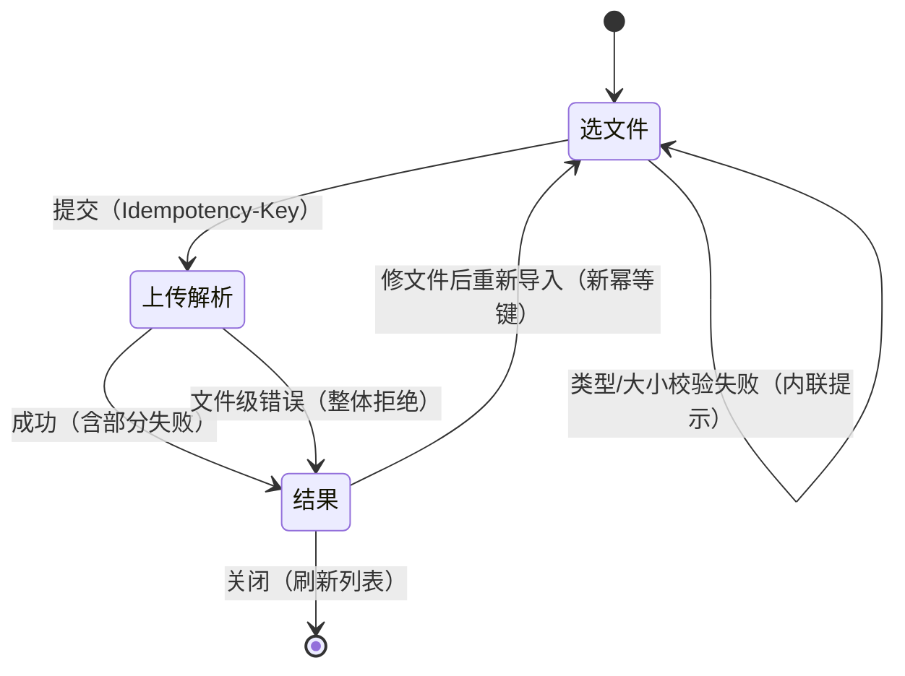

# 组件设计 · 导入导出

> ImportDialog · ExportButton · useImport · useExport

[文档首页](../../../../文档首页.md) › [项目规划说明](../../../../规划/项目规划说明.md) › [组件设计](../../01_组件设计_总览.md) › 导入导出　|　[← 弹窗抽屉表单](../01_组件设计_弹窗抽屉表单/01_组件设计_弹窗抽屉表单.md)　[审批流展示 →](../03_组件设计_审批流展示/03_组件设计_审批流展示.md)

> 可交互原型：[15_原型设计_导入导出.html](02_原型设计_导入导出.html)（演示模板下载、拖拽/选择文件、类型与大小校验、上传进度、错误行报告与错误明细下载、导出参数与脱敏提示、大数据量异步导出、按钮动作权限）

## 1. 目的与适用范围 

定义 BMS 前端 `frontend/` **导入导出**的组件设计：导入对话框 `ImportDialog.vue`（模板下载、文件选择/拖拽、上传解析、错误行报告），导出按钮 `ExportButton.vue`（按当前筛选导出、脱敏提示、异步导出反馈），以及组合式函数 `useImport.ts`（文件校验、幂等键、上传进度、结果与错误行）与 `useExport.ts`（取数参数、文件下载、大数据量异步）。适用于各列表页工具栏的**批量导入**与**当前筛选条件导出**（用户等主数据与业务列表）。

本节对应[《项目规划说明》](../../../../规划/项目规划说明.md)「功能模块」之**导入导出**模块；交互形态依据[《布局设计 · 列表页》](../../../布局设计/07_布局设计_列表页.html)「工具栏」节（导入/导出按钮位置与图标、权限控制）与[《布局设计 · 异常与空状态》](../../../布局设计/12_布局设计_异常与空状态.html)「加载与长任务」节（长任务进度反馈与完成通知、断网/超时重试）；上游设计依据[《概要设计 · 导入导出》](../../../概要设计/19_概要设计_导入导出.md)（模板下载、执行导入、列表导出接口；错误行报告结构；幂等键；脱敏与操作日志）与[《架构设计 · 文件管理》](../../../架构设计/16_架构设计_子系统_文件管理.md)「上传安全」「Excel 导入导出」节（xlsx 白名单、大小上限、openpyxl）；协作节点为[请求封装](../../07_基础类/01_组件设计_请求封装/01_组件设计_请求封装.md)（上传/下载封装与错误处理）、[通用表格](../../05_展示类/01_组件设计_通用表格/01_组件设计_通用表格.md)（错误行报告表格与列表页工具栏）、[查询筛选区](../../05_展示类/02_组件设计_查询筛选区/02_组件设计_查询筛选区.md)（导出参数与筛选/排序一致）、[弹窗抽屉表单](../01_组件设计_弹窗抽屉表单/01_组件设计_弹窗抽屉表单.md)（导入对话框容器复用其关闭规则）、[权限指令](../../07_基础类/02_组件设计_权限指令/02_组件设计_权限指令.md)（`import:execute` / `export:download` 按钮显隐）、[格式化工具](../../07_基础类/03_组件设计_格式化工具/03_组件设计_格式化工具.md)（文件名时间、数值格式化）。

> 本篇为组件设计体系交互类第 02 篇。**范围边界**：文件分片上传/秒传/断点续传与文件预览归 [文件上传字段](../../04_字段类/06_组件设计_文件上传字段/06_组件设计_文件上传字段.md)；Excel 解析、校验与落库在**后端**（openpyxl），本节点只负责前端交互与取数；列表渲染与筛选归 [10](../../05_展示类/01_组件设计_通用表格/01_组件设计_通用表格.md)/[11](../../05_展示类/02_组件设计_查询筛选区/02_组件设计_查询筛选区.md)；操作日志与审计归概要/架构对应节点；移动端无批量导入入口（见第 9 节）。

## 2. 组件清单与职责 

| 组件 / 工具 | 位置 | 职责 |
| --- | --- | --- |
| `ImportDialog.vue` | `src/components/import-export/` | 导入对话框：三步（选文件 → 上传解析 → 结果/错误行）、模板下载、类型/大小校验、进度、幂等键管理、错误行报告表格与错误明细下载 |
| `ExportButton.vue` | `src/components/import-export/` | 导出按钮：按当前筛选/排序取数下载、脱敏提示、加载态、大数据量异步反馈、动作权限显隐 |
| `useImport.ts` | `src/utils/useImport.ts` | 导入状态机：文件校验、幂等键（生成/复用/重置）、上传进度、结果与错误行、模板与错误明细下载、重置 |
| `useExport.ts` | `src/utils/useExport.ts` | 导出：取数参数构造（对齐列表/查询区）、请求 blob 与触发下载、文件名（含时间）、同步/异步分支、加载态 |

- 命名遵循[《命名规范》](../../../../规范/命名规范.md)：组件 PascalCase、组合式函数 `use` + 名词；目录遵循[《前端开发规范》](../../../../规范/前端开发规范.md)（`src/components/` 按域分目录，导入导出归 `import-export/`；组合式函数放 `src/utils/`）。
- `ImportDialog` 复用 [弹窗抽屉表单](../01_组件设计_弹窗抽屉表单/01_组件设计_弹窗抽屉表单.md) 表单对话框容器的关闭与遮罩规则（上传/解析中禁止关闭，见第 3.6 节），不另起一套弹窗。

## 3. 导入 ImportDialog 

### 3.1 Props / 事件 / 插槽 

| 属性 | 类型 | 默认 | 说明 |
| --- | --- | --- | --- |
| `modelValue` | boolean | false | 显隐（`v-model`） |
| `biz` | string | — | 业务标识（后端路径 `{biz}`，如 `users`），决定模板与执行接口 |
| `bizName` | string | '' | 业务中文名（标题「批量导入用户」与错误明细文件名） |
| `templateParams` | Record\<string, any\> | {} | 模板下载参数（如按表单定制生成列的租户上下文） |
| `accept` | string | '.xlsx' | 接受的文件类型（类型白名单，仅 xlsx） |
| `maxSize` | number | 20 | 文件大小上限（MB，对齐[《概要设计 · 导入导出》](../../../概要设计/19_概要设计_导入导出.md)默认 20MB） |
| `autoCloseOnSuccess` | boolean | false | 全部成功后是否自动关闭（默认停留展示结果） |
| `closeOnClickModal` | boolean | false | 点遮罩关闭（默认关闭） |

| 事件 | 载荷 | 说明 |
| --- | --- | --- |
| `update:modelValue` | boolean | 显隐同步 |
| `template-download` | biz | 点「下载模板」 |
| `imported` | `{ success_count, fail_count, total }` | 导入执行返回（含错误行） |
| `closed` | — | 关闭完成（调用方重置/刷新列表） |

| 插槽 | 说明 |
| --- | --- |
| `tips` | 标题下说明条（i18n），如「按模板填写，单次最多 N 行」 |
| `extra` | 上传前附加选项（如数据覆盖策略，需后端支持时使用） |

- 暴露方法：`open()`、`reset()`、`submit()`、`downloadTemplate()`、`downloadErrorReport()`。

### 3.2 导入步骤 

| 步骤 | 界面 | 说明 |
| --- | --- | --- |
| ① 选文件 | 模板下载区 + 拖拽/点击选择（`el-upload` `drag`、`:auto-upload=false`、`:limit=1`） | 显示文件名与大小；类型/大小不合法即内联报错，禁用提交 |
| ② 上传解析 | 圆形/线性进度（`onUploadProgress`）+ 文案「解析校验中…」 | 阶段：上传中 → 解析校验中（后端处理，无细分进度时用不确定进度条 + 文案） |
| ③ 结果 | 汇总（总行数 / 成功 / 失败）+ 错误行报告表格 + 「下载错误明细」；底部「重新导入」「完成」 | 全部成功可直接「完成」；部分失败提示修正后重新导入（**重新导入需新幂等键**） |

### 3.3 文件校验与上传 

| 项 | 设计 |
| --- | --- |
| 类型 | 仅 `.xlsx`（对齐[《概要设计 · 导入导出》](../../../概要设计/19_概要设计_导入导出.md)白名单）；由 `accept` + 前端二次校验扩展名校验（防止拖拽绕过） |
| 大小 | 默认 20MB（`maxSize`，`sys_config` 可配）；超限即时报错，不发起请求 |
| 空文件/无数据行 | 提交后由后端返回文件级错误（错误码 5xxxx 文件段），前端整体拒绝并提示，不展示错误行表 |
| 模板列核对 | **后端**核对表头与模板列，不匹配整体拒绝（前端不解析 Excel，避免引入解析库与口径分歧） |
| 上传封装 | 走[请求封装](../../07_基础类/01_组件设计_请求封装/01_组件设计_请求封装.md)的 multipart 上传（携带 `onUploadProgress`）；单文件、不自动上传 |
| 重试 | 网络失败可「重试」（**复用同一幂等键**，避免半成功重复）；更换文件视为新导入（新幂等键） |

### 3.4 幂等键管理 

- 幂等键（`Idempotency-Key`）在**选定文件时生成**（UUID），随执行请求头提交；[《概要设计 · 导入导出》](../../../概要设计/19_概要设计_导入导出.md)为 Redis SETNX 前置拦截 + 唯一约束兜底。
- **复用场景**：网络失败/超时后「重试」复用该键，后端重复键直接返回首次结果，避免重复落库。
- **重置场景**：更换文件、修改后「重新导入」、关闭对话框再打开，一律**重新生成**幂等键（新一次导入）。
- 重复提交提示：命中幂等键时后端返回首次处理结果，前端展示为「本次为重复提交，返回首次结果」并展示同一错误行报告。

### 3.5 错误行报告 

| 区域 | 内容 |
| --- | --- |
| 汇总 | 总行数 / 成功行数 / 失败行数（数值强调）；全部成功时用成功态，部分失败用警告态 |
| 明细表 | 表格列：**行号**（Excel 行号，从 2 起，与文件一致）、**列/字段**（可选，登记项①）、**原因**（i18n 文案）；分页展示（默认每页 20，超 1000 行仅展示前 N 并提示下载完整明细） |
| 下载错误明细 | 「下载错误明细」按钮获取错误明细 xlsx（见登记项①）；文件名 `{bizName}-导入错误明细-{yyyyMMddHHmmss}.xlsx` |
| 修正闭环 | 提示「按行号修正后重新导入」；「重新导入」回到选文件步并重置（新幂等键） |

- 错误原因由后端返回明确文案或错误码，前端按错误码映射 i18n（`error.{code}`）；行级校验口径（必填/格式/枚举/唯一性）归[《概要设计 · 导入导出》](../../../概要设计/19_概要设计_导入导出.md)。

### 3.6 关闭与长任务 

- **上传/解析中禁止关闭**（含遮罩、Esc、取消），与 [弹窗抽屉表单](../01_组件设计_弹窗抽屉表单/01_组件设计_弹窗抽屉表单.md)关闭规则一致；结果步可自由关闭。
- 长任务反馈对齐[《布局设计 · 异常与空状态》](../../../布局设计/12_布局设计_异常与空状态.html)「加载与长任务」节：进度 + 文案，超时给「重试」，不白屏假死；大批量解析耗时较长时提示「解析中，请勿关闭」。

## 4. 导出 ExportButton / useExport 

### 4.1 Props 与事件 

| 属性 | 类型 | 默认 | 说明 |
| --- | --- | --- | --- |
| `biz` | string | — | 业务标识（后端路径 `{biz}`） |
| `params` | Record\<string, any\> | {} | 取数参数：**当前筛选条件 + 排序**（见 4.2） |
| `filename` | string | '' | 文件名前缀（缺省取业务名），实际名含导出时间 |
| `scope` | 'filtered' \| 'selected' | 'filtered' | 导出范围：当前筛选结果 / 选中行（选中行导出传 id 列表） |
| `selectedIds` | Array\<string \| number\> | [] | `scope='selected'` 时的行 id |
| `maskSensitive` | boolean | true | 敏感字段脱敏；持 `data:plain` 时页面可传 false 导出明文 |
| `perm` | string | 'export:download' | 导出动作权限码（无权限不渲染） |
| `asyncThreshold` | number | 0 | 行数阈值（0 = 前端不判断）；超过时按钮提示「将转后台导出」并走异步分支 |
| `totalCount` | number | 0 | 当前筛选总条数（用于提示「导出 N 条」与异步判断） |
| `disabled` | boolean | false | 禁用（如未选择行时的选中导出） |

| 事件 | 载荷 | 说明 |
| --- | --- | --- |
| `export-start` | scope | 开始导出 |
| `export-done` | filename | 同步导出完成并触发下载 |
| `export-async` | task | 数据量过大转后台任务（完成后站内通知，见登记项③） |

- 暴露方法：`exportData()`。
- 按钮形态：`el-button` 次按钮（列表页工具栏右侧），前置图标 `Download`（[《布局设计 · 列表页》](../../../布局设计/07_布局设计_列表页.html)），加载态 `loading`。

### 4.2 取数参数口径 

- **导出与列表查询同一口径**：`params` 直接复用列表接口的查询参数（关键字、字段条件、多值逗号、区间 `*_start`/`*_end`、布尔 `1/0`、多列排序 `order_by`/`order`），见 [查询筛选区](../../05_展示类/02_组件设计_查询筛选区/02_组件设计_查询筛选区.md)与[《概要设计 · 导入导出》](../../../概要设计/19_概要设计_导入导出.md)「业务规则」节。
- **列顺序遵循导出模板**：导出列不随页面列显隐/顺序偏好变化（页面的列偏好属展示层，见用户喜好 `list.{form_key}`）。
- **权限过滤**：导出文件不含后端未授权字段；敏感字段默认脱敏，持 `data:plain` 方可明文（`maskSensitive=false`）。
- **选中行导出**：传选中 id 列表，仅导出选中行；未选中时按钮禁用。

### 4.3 下载与大数据量 

| 场景 | 设计 |
| --- | --- |
| 同步下载 | 请求返回文件流 → 前端 `Blob` + `a[download]` 触发下载；文件名从 `Content-Disposition` 解析，缺省用 `{业务名}-{yyyyMMddHHmmss}.xlsx`（时间走 [格式化工具](../../07_基础类/03_组件设计_格式化工具/03_组件设计_格式化工具.md)） |
| 脱敏提示 | 按钮悬停/点击前提示「敏感字段将脱敏导出」；明文导出需 `data:plain`（[权限指令](../../07_基础类/02_组件设计_权限指令/02_组件设计_权限指令.md)） |
| 大数据量异步 | 超过 `asyncThreshold`（或后端判定）→ 返回后台任务，前端提示「数据量较大，已转后台导出，完成后在通知中心查看下载」，不阻塞页面（[《布局设计 · 异常与空状态》](../../../布局设计/12_布局设计_异常与空状态.html)长任务口径） |
| 无数据 | 导出结果为 0 行时提示「当前筛选无数据可导出」，不起下载 |
| 错误 | 按[请求封装](../../07_基础类/01_组件设计_请求封装/01_组件设计_请求封装.md)统一处理：无权限 403、限流 5xxxx、服务错误提示重试 |

## 5. 场景集成 

| 场景 | 形态 | 说明 |
| --- | --- | --- |
| 列表页批量导入 | 工具栏「导入」→ `ImportDialog` | 模板下载、上传、错误行报告（[《布局设计 · 列表页》](../../../布局设计/07_布局设计_列表页.html)工具栏） |
| 列表页导出 | 工具栏「导出」→ `ExportButton`（`scope='filtered'`） | 导出当前筛选与排序结果 |
| 选中行导出 | 工具栏/批量操作「导出选中」→ `ExportButton`（`scope='selected'`） | 需选中行，传 id 列表 |
| 主数据批量维护 | 用户/部门/岗位等 | 复用同一对话框，仅 `biz`/`bizName`/模板不同 |
| 导入模板下载 | 对话框内 | 模板列随表单定制（平台字段 + 生效自建字段），列头固定 |
| 移动端 | **不支持** | 管理端能力，移动端不做批量维护入口（[《概要设计 · 导入导出》](../../../概要设计/19_概要设计_导入导出.md)页面清单） |

## 6. 依赖接口与上游变更 

### 6.1 上游接口与口径 

| 项 | 说明 | 目标文档 |
| --- | --- | --- |
| 模板下载 | `GET /api/v1/imports/{biz}/template` | [《概要设计 · 导入导出》](../../../概要设计/19_概要设计_导入导出.md) |
| 执行导入 | `POST /api/v1/imports/{biz}/execute`（multipart xlsx + `Idempotency-Key`），返回 `{total, success_count, fail_count, errors:[{row, message}]}` | [《概要设计 · 导入导出》](../../../概要设计/19_概要设计_导入导出.md)、[《架构设计 · 接口与集成》](../../../架构设计/06_架构设计_接口与集成.md) |
| 列表导出 | `GET /api/v1/{biz}/export?当前筛选与排序`（Excel 文件流） | [《概要设计 · 导入导出》](../../../概要设计/19_概要设计_导入导出.md) |
| 上传安全 | xlsx 类型白名单、大小上限（默认 20MB，`sys_config` 可配） | [《架构设计 · 文件管理》](../../../架构设计/16_架构设计_子系统_文件管理.md)、[《概要设计 · 导入导出》](../../../概要设计/19_概要设计_导入导出.md) |
| 权限 | `import:execute`（导入）、`export:download`（导出）；按钮挂动作权限 | [《概要设计 · 导入导出》](../../../概要设计/19_概要设计_导入导出.md)、[权限指令](../../07_基础类/02_组件设计_权限指令/02_组件设计_权限指令.md) |
| 脱敏 | 敏感字段导出默认脱敏，`data:plain` 方可明文 | [《概要设计 · 导入导出》](../../../概要设计/19_概要设计_导入导出.md) |
| 错误处理 | 文件段 5xxxx 错误码，前端映射 i18n | [《概要设计 · 导入导出》](../../../概要设计/19_概要设计_导入导出.md)、[《API接口规范》](../../../../规范/API接口规范.md) |
| 新增依赖 | **无**：`el-upload` 拖拽 + `onUploadProgress` + `Blob` 下载均为 Element Plus / 浏览器原生能力 | — |

### 6.2 需登记的上游变更 

| 变更点 | 目标文档 | 内容 |
| --- | --- | --- |
| ① 错误行报告结构与错误明细下载 | [《概要设计 · 导入导出》](../../../概要设计/19_概要设计_导入导出.md)「接口设计」「数据模型与表设计」节 | 执行导入响应的 `errors` 项由 `{row, message}` 扩展为 `{row, column?, message}`（`column` 可选：出错列/字段，便于定位）；新增错误明细下载接口 `GET /api/v1/imports/{biz}/error-report/{token}`（按首次结果生成 xlsx，限时有效），供前端「下载错误明细」使用 |
| ② 「导入」入口与导出按钮口径 | [《布局设计 · 列表页》](../../../布局设计/07_布局设计_列表页.html)「工具栏」节 | 工具栏右侧补「导入」按钮（与「导出」并列，`import:execute` 显隐）与导入对话框形态（模板下载 / 文件选择 / 上传解析 / 错误行报告）；明确导出按钮「按当前筛选与排序导出、列顺序遵循导出模板、敏感字段默认脱敏」与「导出 N 条」提示口径 |
| ③ 大数据量异步导出 | [《概要设计 · 导入导出》](../../../概要设计/19_概要设计_导入导出.md)「业务规则」「接口设计」节；[《架构设计 · 接口与集成》](../../../架构设计/06_架构设计_接口与集成.md) | 导出超过阈值（行数或耗时，`sys_config` 可配）时转**后台任务导出**：接口返回任务标识而非文件流，完成后经通知中心/站内消息提供限时下载；前端导出按钮据此给「已转后台，完成后通知」反馈（对齐全量导出与长任务不阻塞页面） |

> 按[《文档生成规范》](../../../../规范/文档生成规范.md)「引用与追溯」节，上述变更需用户确认后由上游文档同步；本节点只定义组件契约，不单独裁决接口与表结构。

## 7. 权限 / i18n / 移动端 

- **权限**：导入/导出按钮按动作权限码 `import:execute` / `export:download` 显隐（默认无权限不显隐，[权限指令](../../07_基础类/02_组件设计_权限指令/02_组件设计_权限指令.md)）；明文导出需 `data:plain`；后端 `require_permission` 与导出字段授权兜底。
- **i18n**：标题、按钮、步骤文案、错误原因、汇总与提示均走 vue-i18n 或按错误码映射（`error.{code}`）；列头来自导入模板（后端按 locale 生成）；文件名时间按用户时区（[格式化工具](../../07_基础类/03_组件设计_格式化工具/03_组件设计_格式化工具.md)）；**不翻译用户数据**。
- **移动端**：**不提供**批量导入入口；导出在移动端非 MVP 能力（[《概要设计 · 导入导出》](../../../概要设计/19_概要设计_导入导出.md)页面清单：移动端无独立页面）。

## 8. 性能与边界 

| 场景 | 设计 |
| --- | --- |
| 文件校验 | 前端只做类型/大小/空文件快速校验，**不解析 Excel**；模板列核对交后端，避免引入解析库与口径分歧 |
| 上传 | 单文件 multipart + `onUploadProgress`；大文件仍受 20MB 上限（批量导入场景为 Excel，非大附件） |
| 进度与长任务 | 上传进度可量化；解析校验阶段用不确定进度 + 文案，超时/失败给重试（复用幂等键） |
| 错误行 | 分页展示，超阈值仅展示前 N 行并引导下载完整明细；错误明细文件由后端生成（不在前端拼大表） |
| 导出 | 同步导出用流式响应；超过阈值转后台任务，避免长连接与页面假死；导出与列表同口径，不额外全量查询 |
| 幂等 | 重试复用键、换文件换键；避免半成功重复落库 |
| 边界 | 类型/大小非法、空文件、模板列不匹配（整体拒绝）、部分行失败（错误行报告）、重复提交（返回首次结果）、无数据导出、无权限、限流、断网/超时重试、解析超时、大数据量异步、选中行导出未选中禁用 |
| 不支持 | 前端解析 Excel、分片上传/断点续传（归 [文件上传字段](../../04_字段类/06_组件设计_文件上传字段/06_组件设计_文件上传字段.md)）、导出列自定义（列顺序遵循导出模板）、多文件同时导入（一次一个） |

## 9. 检查清单 

- □ 组件分层：`ImportDialog` 三步交互与容器、`ExportButton` 触发下载、`useImport` 状态机与幂等键、`useExport` 取数与下载，职责不重叠
- □ 导入：模板下载、拖拽/选择、类型（.xlsx）与大小（默认 20MB）校验、上传进度、解析文案；关闭规则复用 [弹窗抽屉表单](../01_组件设计_弹窗抽屉表单/01_组件设计_弹窗抽屉表单.md)（上传/解析中禁关）
- □ 幂等键：选定文件生成、重试复用、换文件/重新导入重置；重复提交展示首次结果
- □ 错误行报告：汇总（总/成功/失败）+ 明细表（行号/列/原因）+ 分页 + 「下载错误明细 xlsx」+ 修正闭环提示
- □ 导出：按当前筛选与排序取数（与列表/查询区口径一致）、列顺序遵循导出模板、脱敏默认与 `data:plain` 明文、文件名含时间、无数据/无权限/限流/超时处理
- □ 大数据量异步导出：超阈值转后台、提示完成后通知下载，不阻塞页面
- □ 权限（`import:execute`/`export:download`/`data:plain`）、i18n（文案、错误码、列头、文件名时间）、移动端（不支持批量导入）符合第 7 节
- □ 性能边界：前端不解析 Excel、解析阶段进度与重试、错误明细后端生成、导出同口径不额外全量
- □ 三项上游登记已确认：错误行报告结构与错误明细下载、导入入口与导出按钮口径、大数据量异步导出

> 组件设计节点 · 与[《布局设计 · 列表页》](../../../布局设计/07_布局设计_列表页.html)[《布局设计 · 异常与空状态》](../../../布局设计/12_布局设计_异常与空状态.html)[《概要设计 · 导入导出》](../../../概要设计/19_概要设计_导入导出.md)[《架构设计 · 文件管理》](../../../架构设计/16_架构设计_子系统_文件管理.md)[《架构设计 · 接口与集成》](../../../架构设计/06_架构设计_接口与集成.md)[通用表格](../../05_展示类/01_组件设计_通用表格/01_组件设计_通用表格.md)[查询筛选区](../../05_展示类/02_组件设计_查询筛选区/02_组件设计_查询筛选区.md)[弹窗抽屉表单](../01_组件设计_弹窗抽屉表单/01_组件设计_弹窗抽屉表单.md)[请求封装](../../07_基础类/01_组件设计_请求封装/01_组件设计_请求封装.md)[权限指令](../../07_基础类/02_组件设计_权限指令/02_组件设计_权限指令.md)[格式化工具](../../07_基础类/03_组件设计_格式化工具/03_组件设计_格式化工具.md)《命名规范》配套
