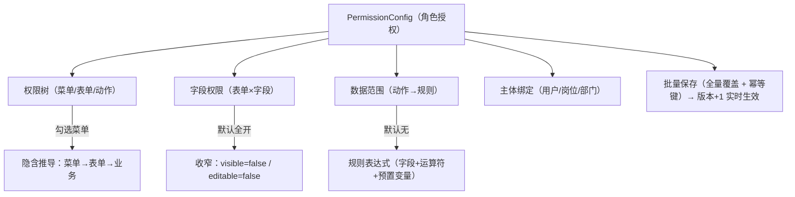

# 组件设计 · 权限配置

> PermissionConfig · PermTree · FieldPermMatrix · DataScopeConfig · SubjectBinding · usePermissionConfig

[文档首页](../../../../文档首页.md) › [项目规划说明](../../../../规划/项目规划说明.md) › [组件设计](../../01_组件设计_总览.md) › 权限配置　|　[← 流程建模器](../07_组件设计_流程建模器/07_组件设计_流程建模器.md)　[报表设计器 →](../09_组件设计_报表设计器/09_组件设计_报表设计器.md)

> 可交互原型：[08_原型设计_权限配置.html](08_原型设计_权限配置.html)（演示菜单/表单/动作权限树与隐含推导、字段权限矩阵、动作数据范围规则、主体绑定、批量覆盖提交与幂等、脏数据拦截）

## 1. 目的与适用范围 <a id="purpose"></a>

定义 BMS 前端 `frontend/` **权限配置**的组件设计：总容器 `PermissionConfig.vue`（角色授权页签装配与批量提交），菜单/表单/动作权限树 `PermTree.vue`，字段权限矩阵 `FieldPermMatrix.vue`，动作数据范围 `DataScopeConfig.vue`，主体绑定 `SubjectBinding.vue`，以及组合式函数 `usePermissionConfig.ts`（授权状态、隐含推导、批量覆盖提交、幂等键、脏数据）。适用于**角色管理**页（PC 管理端，安全管理员）对角色进行菜单/表单/动作/字段权限与数据范围的授予。

本节对应[《项目规划说明》](../../../../规划/项目规划说明.md)「功能模块」之**角色管理**模块与「权限模型」「业务与动作清单」章节；上游设计依据[《概要设计 · 角色管理》](../../../概要设计/06_概要设计_角色管理.md)（授权功能点、批量接口与错误码、主体绑定、三权分立）与[《概要设计 · 菜单管理》](../../../概要设计/07_概要设计_菜单管理.md)（菜单→表单→业务挂接、按钮挂动作、字段挂表单）、[《架构设计 · 权限计算引擎》](../../../架构设计/11_架构设计_子系统_权限计算引擎.md)（权限收敛、数据范围规则、版本失效）；协作节点为[03_交互类 05 代码表达式编辑器](../05_组件设计_代码表达式编辑器/05_组件设计_代码表达式编辑器.md)（数据范围规则表达式编辑）、[04 字段类 04 树选择字段](../../04_字段类/04_组件设计_树选择字段/04_组件设计_树选择字段.md)（菜单/部门树）、[04 字段类 05 组织选择字段](../../04_字段类/05_组件设计_组织选择字段/05_组件设计_组织选择字段.md)（用户/岗位/部门主体选择）、[05 展示类 01 通用表格](../../05_展示类/01_组件设计_通用表格/01_组件设计_通用表格.md)（字段权限矩阵）、[03_交互类 01 弹窗抽屉表单](../01_组件设计_弹窗抽屉表单/01_组件设计_弹窗抽屉表单.md)（确认与脏数据拦截）、[07 基础类 01 请求封装](../../07_基础类/01_组件设计_请求封装/01_组件设计_请求封装.md)、[07 基础类 02 权限指令](../../07_基础类/02_组件设计_权限指令/02_组件设计_权限指令.md)（`role:grant`）。

> 本篇为组件设计体系交互类第 08 篇。**范围边界**：权限**计算**（主体链收敛、缓存与版本失效）归[《架构设计 · 权限计算引擎》](../../../架构设计/11_架构设计_子系统_权限计算引擎.md)；角色增删改与列表归[05 展示类 01 通用表格](../../05_展示类/01_组件设计_通用表格/01_组件设计_通用表格.md)与页面；菜单/表单/按钮/字段**实体维护**归[《概要设计 · 菜单管理》](../../../概要设计/07_概要设计_菜单管理.md)，本节点只做**授权勾选与提交**；移动端不提供权限配置（见第 11 节）。

## 2. 组件清单与职责 <a id="components"></a>

| 组件 / 工具 | 位置 | 职责 |
| --- | --- | --- |
| `PermissionConfig.vue` | `src/components/permission/` | 总容器：页签装配（权限树/字段权限/数据范围/主体绑定）、角色切换、批量保存与撤销、脏数据拦截、加载与空态 |
| `PermTree.vue` | `src/components/permission/` | 菜单/表单/动作权限树：三态勾选、菜单→表单→业务隐含推导、按钮级动作（默认无）、挂接缺失提示、搜索与展开 |
| `FieldPermMatrix.vue` | `src/components/permission/` | 字段权限矩阵：表单 × 字段的 `visible`/`editable` 勾选，默认全开、授予后收窄；批量全选/清空、搜索、分组、分页或虚拟滚动 |
| `DataScopeConfig.vue` | `src/components/permission/` | 动作数据范围：按动作选择 → 规则表达式编辑（内嵌表达式编辑器）→ 预置变量插入与校验 → 默认无数据权限 |
| `SubjectBinding.vue` | `src/components/permission/` | 主体绑定：用户/岗位/部门 Tab、远程搜索多选、跨字段逻辑引用、解绑、单主体角色数上限提示 |
| `usePermissionConfig.ts` | `src/utils/usePermissionConfig.ts` | 组合式函数：授权状态、隐含推导、全量覆盖提交（先删后插）、`Idempotency-Key`、脏数据基线、批量结果处理 |

- 命名遵循[《命名规范》](../../../../规范/命名规范.md)：组件 PascalCase、组合式函数 `use` + 名词；目录遵循[《前端开发规范》](../../../../规范/前端开发规范.md)（`src/components/` 按域分目录，权限归 `permission/`；组合式函数放 `src/utils/`）。

## 3. 授权页面结构 <a id="layout"></a>



| 页签 | 说明 |
| --- | --- |
| 权限树 | 菜单/表单树 + 动作（按钮默认无）；勾选菜单隐含表单与业务权限（业务权限**不直接授予**） |
| 字段权限 | 表单 × 字段矩阵，默认全部可见可编辑，授予后收窄 |
| 数据范围 | 按动作配置规则表达式，默认无数据权限 |
| 主体绑定 | 用户/岗位/部门主体与角色的绑定（可跨 Tab 多主体） |

- 保存为**整份授权全量覆盖提交**（先删后插、单事务，[《概要设计 · 角色管理》](../../../概要设计/06_概要设计_角色管理.md)「分页/幂等/限流」节）；保存后权限版本 +1（一次递增）实时生效。
- 未保存变更标记（脏数据），切换角色/页签/离开前拦截（[03_交互类 01 弹窗抽屉表单](../01_组件设计_弹窗抽屉表单/01_组件设计_弹窗抽屉表单.md)口径）。

## 4. 权限树 PermTree <a id="tree"></a>

| 项 | 设计 |
| --- | --- |
| 数据来源 | 菜单树 + 表单挂接 + 按钮（动作）清单（[《概要设计 · 菜单管理》](../../../概要设计/07_概要设计_菜单管理.md)「动态菜单接口」）；按当前角色已授予状态回显 |
| 层级 | 菜单 → 表单 → 业务（推导）→ 动作（按钮，1:1 挂动作）；菜单勾选**隐含**其表单与业务权限 |
| 动作默认 | 按钮级动作**默认全无**，需显式勾选（勾选即写入 `perm_type=action`） |
| 三态 | 父级勾选联动子级；子级部分勾选显示半选；菜单取消勾选连带取消其表单/动作 |
| 挂接缺失 | 菜单缺表单、表单缺业务 → 该节点标记「未挂接」并提示先完成挂接（错误码 30046），不可授予 |
| 搜索/展开 | 按名称搜索并高亮；展开/收起全部；大菜单树懒渲染 |
| 提交 | 勾选仅改本地状态；「保存」统一提交（全量覆盖） |

- 业务权限为**推导结果**，界面以只读标识展示（不提供直接勾选入口）。

## 5. 字段权限矩阵 FieldPermMatrix <a id="field-perm"></a>

| 项 | 设计 |
| --- | --- |
| 维度 | 行 = 表单（页面），列 = 字段的 `visible` / `editable`；或按表单分组列出字段清单 |
| 默认 | 未配置的字段**全部可见可编辑**；授予后收窄（`visible=false`、`editable=false`） |
| 批量操作 | 全选可见/可编辑、全选不可见、按列批量；搜索字段；仅显示已收窄字段的过滤 |
| 与布局叠加 | 字段权限与[03_交互类 06 表单设计器](../06_组件设计_表单设计器/06_组件设计_表单设计器.md)的布局可见性**叠加、权限优先**（布局可见但权限不可见则不渲染） |
| 校验 | 字段须属该表单字段集合，不匹配拒绝（错误码 30049） |
| 提交 | 全量覆盖提交（`sys_role_field` 先删后插） |

## 6. 动作数据范围 DataScopeConfig <a id="data-scope"></a>

| 项 | 设计 |
| --- | --- |
| 定位 | 按**动作**配置数据范围规则；默认**无**数据权限（不附加条件） |
| 规则形态 | 字段 + 运算符 + 预置变量（如 `dept_id = @current_dept`、`dept_id IN @current_dept_tree`、`created_by = @current_user`） |
| 编辑 | 内嵌[03_交互类 05 代码表达式编辑器](../05_组件设计_代码表达式编辑器/05_组件设计_代码表达式编辑器.md)表达式编辑能力：预置变量/字段插入、运算符提示、校验 |
| 预置变量 | `@current_user` / `@current_dept` / `@current_dept_tree` / `@tenant` 等（由后端下发，[《架构设计 · 权限计算引擎》](../../../架构设计/11_架构设计_子系统_权限计算引擎.md)「数据范围」节） |
| 校验 | 表达式合法且引用已注册字段/变量；非法拒绝保存（错误码 30047） |
| 生效 | 读时注入条件、写时校验（双向）；租户过滤强制叠加，不得跨租户 |
| 模板 | 常用范围模板（本人/本部门/本部门及下级/本租户）一键套用 |

## 7. 主体绑定 SubjectBinding <a id="subject"></a>

| 项 | 设计 |
| --- | --- |
| 主体类型 | 用户 / 岗位 / 部门（后续实体仅扩枚举）；任意主体链 |
| 选择 | 远程搜索多选（[04 字段类 05 组织选择字段](../../04_字段类/05_组件设计_组织选择字段/05_组件设计_组织选择字段.md)）；部门用树选择（[04 字段类 04 树选择字段](../../04_字段类/04_组件设计_树选择字段/04_组件设计_树选择字段.md)） |
| 绑定/解绑 | 勾选即绑定、移除即解绑；写入/删除 `sys_role_assign`（`role:grant`） |
| 上限 | 单主体可绑定角色数上限（`role.max_per_subject`，默认 20）超限提示 |
| 生效 | 变更后权限版本 +1，关联用户缓存失效、下次请求重算（[《概要设计 · 角色管理》](../../../概要设计/06_概要设计_角色管理.md)） |
| 删除保护 | 删除角色前校验仍存在主体绑定则拒绝（错误码 30044） |

## 8. 组合式函数 usePermissionConfig <a id="use-config"></a>

```typescript
interface UsePermissionConfigOptions {
  roleId: string;
  onSaved?: () => void;
}

interface UsePermissionConfigReturn {
  role: Ref<Role | null>;
  tree: Ref<PermNode[]>;                 // 菜单/表单/动作树（含已授予状态）
  checkedKeys: Ref<string[]>;            // 勾选集合
  inferred: ComputedRef<InferredPerm[]>; // 隐含推导（菜单→表单→业务）
  fieldMatrix: Ref<FieldPermRow[]>;
  dataScopes: Ref<DataScopeRow[]>;
  subjects: Ref<SubjectRow[]>;
  dirty: ComputedRef<boolean>;
  loading: Ref<boolean>;
  saving: Ref<boolean>;
  load: () => Promise<void>;              // 并行拉取授权/字段/数据范围/主体
  toggleNode / toggleField / setDataScope / addSubject / removeSubject;
  save: () => Promise<void>;              // 全量覆盖提交（Idempotency-Key）
  reset: () => void;
}
```

| 行 | 设计 |
| --- | --- |
| 取数 | `load()` 并行拉取权限树、字段权限、数据范围、主体绑定（`Promise.allSettled`，单失败可重试） |
| 隐含推导 | 勾选菜单时由前端展示推导出的表单/业务（只读），提交时后端据挂接关系落库（前端不落推导结果） |
| 提交 | `save()` 打包四类授权全量覆盖提交，携带 `Idempotency-Key`；单事务、失败整体回滚；成功一次版本 +1 |
| 脏数据 | 打开时以 `stableStringify`（[07 基础类 03 格式化工具](../../07_基础类/03_组件设计_格式化工具/03_组件设计_格式化工具.md)）记基线，比对得 `dirty`；拦截口径同 [03_交互类 01 弹窗抽屉表单](../01_组件设计_弹窗抽屉表单/01_组件设计_弹窗抽屉表单.md) |
| 错误处理 | 30044/30046/30047/30048/30049 按错误码定位到对应页签与项并提示（i18n） |

## 9. 场景集成 <a id="scenes"></a>

| 场景 | 说明 |
| --- | --- |
| 角色管理页 · 授权 | 本节点主体；角色列表双击进详情后进入授权页签 |
| 新增角色后授权 | 新建角色 → 授权页签逐步授予 |
| 三权分立校验 | 授予将造成管理员职责互斥/兼任 → 后端拒绝（30048），前端提示 |
| 数据范围 | 动作级规则，读时注入/写时校验（权限引擎） |
| 移动端 | **不提供**权限配置（安全管理员管理端能力） |

## 10. 依赖接口与上游变更 <a id="api"></a>

### 10.1 上游接口与口径 <a id="api-contract"></a>

| 项 | 说明 | 目标文档 |
| --- | --- | --- |
| 授权列表/提交 | `GET/PUT /roles/{id}/permissions`（菜单/表单/动作，全量覆盖 + `Idempotency-Key`） | [《概要设计 · 角色管理》](../../../概要设计/06_概要设计_角色管理.md) |
| 字段权限 | `GET/PUT /roles/{id}/fields`（`visible`/`editable`） | [《概要设计 · 角色管理》](../../../概要设计/06_概要设计_角色管理.md) |
| 数据范围 | `GET/PUT /roles/{id}/data-scopes`（动作→规则表达式） | [《概要设计 · 角色管理》](../../../概要设计/06_概要设计_角色管理.md) |
| 主体绑定 | `GET/POST /roles/{id}/subjects`、`DELETE /roles/{id}/subjects/{type}/{id}` | [《概要设计 · 角色管理》](../../../概要设计/06_概要设计_角色管理.md) |
| 权限树数据 | 菜单树 + 表单/业务挂接 + 按钮（动作）清单 | [《概要设计 · 菜单管理》](../../../概要设计/07_概要设计_菜单管理.md) |
| 数据范围变量 | 预置变量与已注册字段清单（规则表达式上下文） | [《架构设计 · 权限计算引擎》](../../../架构设计/11_架构设计_子系统_权限计算引擎.md)（登记项③） |
| 表达式校验 | 数据范围规则表达式校验（同源接口） | [03_交互类 05 代码表达式编辑器](../05_组件设计_代码表达式编辑器/05_组件设计_代码表达式编辑器.md) |
| 权限/错误码 | `role:query`/`grant`；30044/30046/30047/30048/30049 | [《概要设计 · 角色管理》](../../../概要设计/06_概要设计_角色管理.md) |
| 新增依赖 | **无**：`el-tree`/`el-table`/`el-checkbox` 等均为 Element Plus 内置 | — |

### 10.2 需登记的上游变更 <a id="api-upstream"></a>

| 变更点 | 目标文档 | 内容 |
| --- | --- | --- |
| ① 授权交互与批量接口口径 | [《概要设计 · 角色管理》](../../../概要设计/06_概要设计_角色管理.md)「接口设计」「业务规则」节 | 明确授权页签（权限树/字段权限/数据范围/主体绑定）与「全量覆盖提交（先删后插、单事务）+ `Idempotency-Key` + 版本一次 +1」口径；明确**隐含推导**（菜单→表单→业务）由后端按挂接关系落库、前端只读展示；明确字段权限默认全开、动作默认全无、数据范围默认无 |
| ② 权限树挂接与按钮/字段来源 | [《概要设计 · 菜单管理》](../../../概要设计/07_概要设计_菜单管理.md)「核心表」「接口设计」节 | 明确授权树所需的菜单/表单/业务挂接与按钮（动作）清单、字段清单接口口径；挂接缺失（菜单缺表单/表单缺业务）时的授权拦截与提示（30046） |
| ③ 数据范围规则编辑与校验 | [《架构设计 · 权限计算引擎》](../../../架构设计/11_架构设计_子系统_权限计算引擎.md)「数据范围」节；[《概要设计 · 角色管理》](../../../概要设计/06_概要设计_角色管理.md) | 明确数据范围规则表达式可用的**预置变量与已注册字段**来源下发，以及表达式校验接口（与[03_交互类 05 代码表达式编辑器](../05_组件设计_代码表达式编辑器/05_组件设计_代码表达式编辑器.md)同源）；保存前沙箱解析校验、读写双向生效与租户强制叠加 |

> 按[《文档生成规范》](../../../../规范/文档生成规范.md)「引用与追溯」节，上述变更需用户确认后由上游文档同步；本节点只定义组件契约，不单独裁决接口与数据结构。

## 11. 权限 / i18n / 移动端 <a id="cooperate"></a>

- **权限**：授权页与写操作需 `role:grant`（查询 `role:query`）；三权分立冲突由后端拒绝（30048）并提示；平台专属条目（内置角色）禁改归属（30043）；后端 `require_permission` 兜底（[07 基础类 02 权限指令](../../07_基础类/02_组件设计_权限指令/02_组件设计_权限指令.md)）。
- **i18n**：菜单/表单/按钮/字段名按 locale 下发（各 `_i18n` 附表）；页面文案、校验与错误码按 `error.300xx` 映射走 vue-i18n；**不翻译用户输入**。
- **移动端**：不提供权限配置界面（安全管理员管理端能力）。

## 12. 性能与边界 <a id="performance"></a>

| 场景 | 设计 |
| --- | --- |
| 大树 | 菜单/表单树懒渲染、搜索过滤；字段矩阵分页或虚拟滚动；避免一次性渲染超大树 |
| 取数 | 权限树/字段/数据范围/主体并行拉取；权限树数据走菜单缓存 |
| 提交 | 全量覆盖提交（先删后插）单事务；保存中禁用重复提交；`Idempotency-Key` 防重复 |
| 推导 | 隐含推导仅前端展示，避免在前端落库；提交后以后端返回为准回显 |
| 生效 | 授权变更版本 +1 一次递增，避免多次失效；保存成功提示「已生效」 |
| 边界 | 挂接缺失（30046）、字段不匹配（30049）、规则表达式非法（30047）、三权冲突（30048）、内置角色保护（30043）、主体上限、脏数据拦截、保存失败保留本地、空角色未授权、大树性能 |
| 不支持 | 权限计算/缓存（权限引擎）、菜单/字段实体维护（菜单管理）、角色增删改列表（页面）、移动端 |

## 13. 检查清单 <a id="checklist"></a>

- □ 组件分层：`PermissionConfig` 装配与提交、`PermTree` 权限树、`FieldPermMatrix` 字段矩阵、`DataScopeConfig` 数据范围、`SubjectBinding` 主体绑定、`usePermissionConfig` 状态与提交，职责不重叠
- □ 权限树：菜单→表单→业务隐含推导（只读展示）、动作默认无、三态勾选联动、挂接缺失提示、搜索/懒渲染
- □ 字段权限：表单×字段矩阵、默认全开、收窄、批量操作、与布局叠加（权限优先）、不匹配拒绝（30049）
- □ 数据范围：动作→规则表达式、默认无、预置变量/字段插入与校验（30047）、模板、读写双向与租户叠加
- □ 主体绑定：用户/岗位/部门、远程多选、上下限、变更版本 +1、删除保护（30044）
- □ 提交：全量覆盖（先删后插、单事务）、`Idempotency-Key`、版本一次 +1、脏数据拦截、错误码定位
- □ 权限（`role:grant`、三权分立 30048、内置角色 30043）、i18n（名称/文案/错误码）、移动端（不提供）符合第 11 节
- □ 性能边界：大树懒渲染/虚拟滚动、并行取数、覆盖提交、推导仅展示、版本一次递增
- □ 三项上游登记已确认：授权交互与批量接口口径、权限树挂接与按钮/字段来源、数据范围规则编辑与校验

> 组件设计节点 · 与[《概要设计 · 角色管理》](../../../概要设计/06_概要设计_角色管理.md)[《概要设计 · 菜单管理》](../../../概要设计/07_概要设计_菜单管理.md)[《架构设计 · 权限计算引擎》](../../../架构设计/11_架构设计_子系统_权限计算引擎.md)[《架构设计 · 前端架构》](../../../架构设计/28_架构设计_前端架构.md)[03_交互类 05 代码表达式编辑器](../05_组件设计_代码表达式编辑器/05_组件设计_代码表达式编辑器.md)[04 字段类 04 树选择字段](../../04_字段类/04_组件设计_树选择字段/04_组件设计_树选择字段.md)[04 字段类 05 组织选择字段](../../04_字段类/05_组件设计_组织选择字段/05_组件设计_组织选择字段.md)[05 展示类 01 通用表格](../../05_展示类/01_组件设计_通用表格/01_组件设计_通用表格.md)[07 基础类 02 权限指令](../../07_基础类/02_组件设计_权限指令/02_组件设计_权限指令.md)《命名规范》配套
