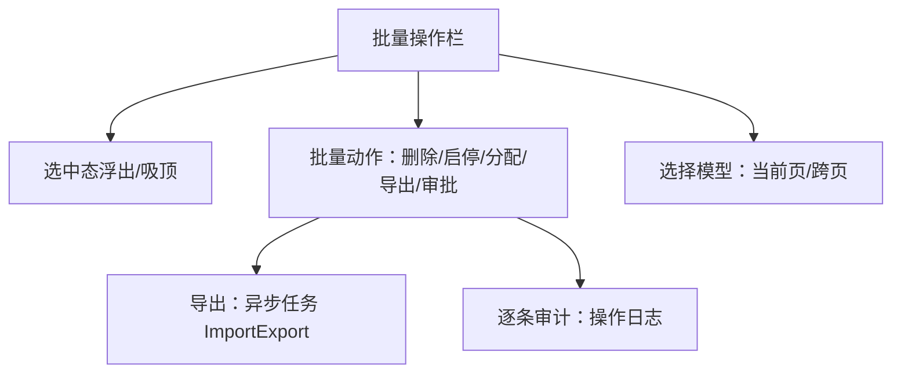

# 组件设计 · 批量操作栏

> BatchActionBar · useSelection（协作：通用表格 / 导入导出 / 权限指令）

[文档首页](../../../../文档首页.md) › [项目规划说明](../../../../规划/项目规划说明.md) › [组件设计](../../01_组件设计_总览.md) › 批量操作栏　|　[← 偏好设置面板](../18_组件设计_偏好设置面板/18_组件设计_偏好设置面板.md)　[主题与品牌化 →](../20_组件设计_主题与品牌化/20_组件设计_主题与品牌化.md)

> 可交互原型：[19_原型设计_批量操作栏.html](19_原型设计_批量操作栏.html)（演示选中浮出操作栏、显示选中数、批量启停/删除/导出、跨页选择、权限控制、二次确认与异步结果反馈）

## 1. 目的与适用范围 

定义 BMS 前端 `frontend/` **批量操作栏**的组件设计：操作栏 `BatchActionBar.vue`（列表选中行后出现、显示选中数量、批量操作按钮、清除选择、进度与结果反馈）与选择模型 `useSelection.ts`（当前页/跨页选择、全选、选中集合维护）。用于**列表页多选后的批量操作**（批量删除、批量启用/停用、批量移动/分配、批量导出、批量审批等），是[《布局设计 · 列表页》](../../../布局设计/07_布局设计_列表页.html)「批量操作」形态的通用组件。

### 1.1 定位与边界 

职责边界与相关节点分流如下：

- **选择模型**：由[05 展示类 01 通用表格](../../05_展示类/01_组件设计_通用表格/01_组件设计_通用表格.md)提供行选择能力，本节点维护**选中集合**与**跨页选择**语义。
- **批量动作**：删除/启停等由业务提供；**批量导出**复用[06 交互类 02 导入导出](../02_组件设计_导入导出/02_组件设计_导入导出.md)（大结果集异步任务）。
- **权限**：按钮按权限码显示/禁用（[07 基础类 02 权限指令](../../07_基础类/02_组件设计_权限指令/02_组件设计_权限指令.md)）。

上游/协作：[《概要设计 · 操作日志》](../../../概要设计/11_概要设计_操作日志.md)（批量操作逐条审计）、[《概要设计 · 导入导出》](../../../概要设计/19_概要设计_导入导出.md)（批量导出异步任务）、[05 展示类 06 通知与消息](../../05_展示类/06_组件设计_通知与消息/06_组件设计_通知与消息.md)（异步结果通知）、[07 基础类 01 请求封装](../../07_基础类/01_组件设计_请求封装/01_组件设计_请求封装.md)。

> 本篇为组件设计体系交互类第 19 篇。**范围边界**：**行选择控件**归[05 展示类 01 通用表格](../../05_展示类/01_组件设计_通用表格/01_组件设计_通用表格.md)；**导出实现**归[06 交互类 02 导入导出](../02_组件设计_导入导出/02_组件设计_导入导出.md)；**批量接口的幂等/事务**归各业务概要（本节点只定义交互契约）。

## 2. 组件清单与职责 

| 组件 / 工具 | 位置 | 职责 |
| --- | --- | --- |
| `BatchActionBar.vue` | `src/components/batch/` | 操作栏：选中数、动作按钮（含下拉更多）、清除选择、跨页提示、吸顶/浮出、进度与结果反馈、权限过滤 |
| `useSelection.ts` | `src/components/batch/` | 选择模型：当前页/跨页选中集合、全选、反选、清除、`keyOf`、选中数、跨页合并 |

- 命名遵循[《命名规范》](../../../../规范/命名规范.md)：组件 PascalCase；目录遵循[《前端开发规范》](../../../../规范/前端开发规范.md)（批量归 `batch/`）。

## 3. Props 与事件（BatchActionBar） 

| 属性 | 类型 | 默认 | 说明 |
| --- | --- | --- | --- |
| `selected` | any[] | [] | 选中项（行对象或 id 集合，v-model:selected） |
| `total` | number | 0 | 当前查询总记录数（用于跨页全选提示） |
| `actions` | BatchAction[] | [] | 动作定义（`{ key, label, icon?, type?, danger?, permission?, confirm?, handler }`） |
| `placement` | 'float' \| 'sticky' | 'float' | 浮出（表格上方浮层）或吸顶（随滚动吸顶） |
| `crossPage` | boolean | false | 是否支持跨页选择（服务端全选） |
| `maxBeyond` | number | 0 | 超过该数量需二次确认（0=不限制） |
| `clearAfterAction` | boolean | true | 动作完成后是否清空选择 |

| 事件 | 载荷 | 说明 |
| --- | --- | --- |
| `update:selected` | any[] | 选中变化 |
| `action` | (key, selected) | 触发批量动作 |
| `clear` | — | 清除选择 |
| `progress` / `done` | ({ current, total }) / result | 异步进度与完成（批量导出/长任务） |

- 暴露方法：`run(key)`、`setProgress(current,total)`、`clear()`。

## 4. 交互与反馈 

| 项 | 设计 |
| --- | --- |
| 出现时机 | `selected.length > 0` 时出现；清空后隐藏（浮现/吸顶，见 `placement`） |
| 选中数 | 显示「已选 N 项」；跨页时显示「已选 N 项（可全选本条件下共 M 项）」 |
| 全选/反选 | 当前页全选由表格提供；跨页全选（`crossPage`）进入服务端全选模式，切换页/条件清空 |
| 动作按钮 | 常用动作直显，更多收进下拉；危险动作（删除）红色并二次确认 |
| 权限 | 按 `permission` 过滤/禁用（[07 基础类 02 权限指令](../../07_基础类/02_组件设计_权限指令/02_组件设计_权限指令.md)） |
| 二次确认 | 删除/不可逆动作弹确认（含数量、影响）；超过 `maxBeyond` 强制确认 |
| 异步任务 | 长任务（批量导出/导入）展示进度或转后台任务并通知（[06 交互类 02 导入导出](../02_组件设计_导入导出/02_组件设计_导入导出.md)） |
| 结果反馈 | 全成功 Toast + 刷新列表；部分成功提示「成功 X / 失败 Y」并支持查看失败明细 |
| 完成后 | `clearAfterAction` 清空选择；保留选中（如连续操作）可配 |
| 审计 | 批量操作逐条记录操作日志（[《概要设计 · 操作日志》](../../../概要设计/11_概要设计_操作日志.md)） |
| 无障碍 | 键盘可达、操作栏出现时焦点管理（可选） |

## 5. 场景集成 

| 场景 | 批量动作 |
| --- | --- |
| 用户/角色管理 | 批量启用/停用、批量分配角色/部门、批量删除 |
| 字典/参数 | 批量启用/停用、批量删除 |
| 业务数据（商品/订单等） | 批量上下架、批量审核、批量导出 |
| 通知/公告 | 批量已读/删除 |
| 文件管理 | 批量下载/移动/删除 |
| 跨页操作 | 按当前筛选条件全选后批量处理 |

## 6. 依赖接口与上游变更 

### 6.1 上游接口与口径 

| 项 | 说明 | 目标文档 |
| --- | --- | --- |
| 批量接口 | 批量删除/启停等（`ids[]`，幂等、部分失败返回明细） | 各业务概要（[《概要设计 · 导入导出》](../../../概要设计/19_概要设计_导入导出.md) 参照） |
| 批量导出 | 大结果集异步任务 | [06 交互类 02 导入导出](../02_组件设计_导入导出/02_组件设计_导入导出.md) |
| 审计 | 逐条操作日志 | [《概要设计 · 操作日志》](../../../概要设计/11_概要设计_操作日志.md)（登记项②） |
| 权限码 | 动作权限 | [07 基础类 02 权限指令](../../07_基础类/02_组件设计_权限指令/02_组件设计_权限指令.md) |
| 列表批量形态 | 操作栏出现时机/位置/反馈 | [《布局设计 · 列表页》](../../../布局设计/07_布局设计_列表页.html)（登记项①） |
| 跨页选择 | 服务端全选语义 | [《布局设计 · 列表页》](../../../布局设计/07_布局设计_列表页.html)（登记项③） |
| 新增依赖 | **无**：自绘操作栏 + 下拉 | — |

### 6.2 需登记的上游变更 

| 变更点 | 目标文档 | 内容 |
| --- | --- | --- |
| ① 批量操作栏细则 | [《布局设计 · 列表页》](../../../布局设计/07_布局设计_列表页.html)「批量操作」节 | 补批量操作细则：选中后操作栏出现（浮出/吸顶）、显示选中数、常用动作直显+更多下拉、危险动作二次确认与超量确认、权限过滤、完成后清空、部分成功反馈；标注组件设计 交互类 19 为组件契约依据 |
| ② 批量操作审计 | [《概要设计 · 操作日志》](../../../概要设计/11_概要设计_操作日志.md)「记录范围」节 | 明确批量操作逐条记审计日志（操作人/动作/对象/结果），部分失败记录失败项与原因 |
| ③ 跨页（全选）选择语义 | [《布局设计 · 列表页》](../../../布局设计/07_布局设计_列表页.html)「选择模型」节 | 明确当前页/跨页选择：跨页全选按「当前筛选条件」由服务端全选，切换条件清空，批接口接受条件或显式 id 集 |

> 按[《文档生成规范》](../../../../规范/文档生成规范.md)「引用与追溯」节，上述变更需用户确认后由上游文档同步；本节点只定义组件契约，不单独裁决接口与选择语义。

## 7. 权限 / i18n / 移动端 

- **权限**：动作按钮按权限码过滤/禁用；数据范围权限由后端在批量执行时校验（越权项拒绝）；危险动作可加二次确认/审批。
- **i18n**：动作名称/确认文案走业务 i18n；界面文案（已选 N 项/成功失败提示）走 vue-i18n（含复数）。
- **移动端**：操作栏转为底部固定操作条/抽屉，按钮收纳进「更多」；全选/跨页在移动端简化为当前页（[《布局设计 · 移动端》](../../../布局设计/15_布局设计_移动端.html)）。

## 8. 性能与边界 

| 场景 | 设计 |
| --- | --- |
| 大量选择 | 跨页选择只存 id 集合或条件（不全量拉取行数据）；显示数量用 count |
| 大结果导出 | 走异步任务，避免同步阻塞 |
| 刷新 | 动作后按需局部刷新；避免整表重取 |
| 边界 | 选中项被其他操作删除（执行时跳过/报失败）、部分成功、跨页后翻页/条件变化、超大量确认、权限不足、并发执行、异步任务未完成即离开页（后台任务通知）、选中行数据变更导致 id 失效 |
| 不支持 | 行选择控件（通用表格）、导出实现（导入导出）、批量接口事务（业务概要） |

## 9. 检查清单 

- □ 组件分层：`BatchActionBar` 操作栏、`useSelection` 选择模型；与通用表格选择联动
- □ 出现/隐藏：选中后出现、清空隐藏、浮出/吸顶、选中数展示
- □ 动作：常用直显+更多下拉、危险动作二次确认、超量确认、权限过滤
- □ 选择模型：当前页/跨页全选、条件变化清空、只存 id/条件不全量拉取
- □ 反馈：进度/异步任务、全成功/部分成功（成功 X 失败 Y 明细）、完成后清空/保留
- □ 审计：逐条操作日志，部分失败记录原因
- □ 权限（动作码/数据范围）、i18n（动作名/复数文案）、移动端（底部操作条/更多）符合第 7 节
- □ 性能边界：大选择只存 id、大导出异步、局部刷新、选中失效处理
- □ 三项上游登记已确认：批量操作栏细则、批量操作审计、跨页选择语义

> 组件设计节点 · 与[《布局设计 · 列表页》](../../../布局设计/07_布局设计_列表页.html)[《概要设计 · 操作日志》](../../../概要设计/11_概要设计_操作日志.md)[《概要设计 · 导入导出》](../../../概要设计/19_概要设计_导入导出.md)[05 展示类 01 通用表格](../../05_展示类/01_组件设计_通用表格/01_组件设计_通用表格.md)[05 展示类 06 通知与消息](../../05_展示类/06_组件设计_通知与消息/06_组件设计_通知与消息.md)[06 交互类 02 导入导出](../02_组件设计_导入导出/02_组件设计_导入导出.md)[07 基础类 01 请求封装](../../07_基础类/01_组件设计_请求封装/01_组件设计_请求封装.md)[07 基础类 02 权限指令](../../07_基础类/02_组件设计_权限指令/02_组件设计_权限指令.md)《命名规范》配套
