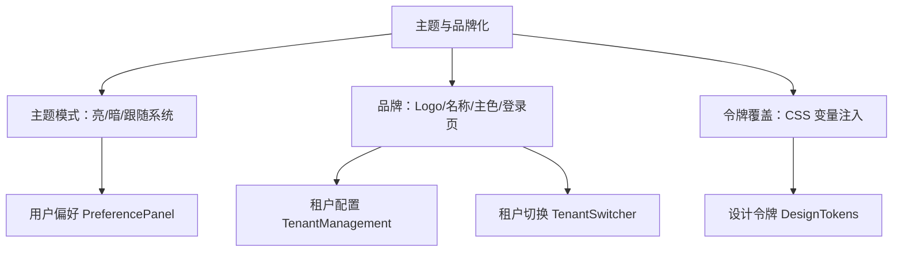

# 组件设计 · 主题与品牌化

> ThemeSwitcher · ThemeProvider · useTheme（协作：偏好设置面板 / 租户切换）

[文档首页](../../../../文档首页.md) › [项目规划说明](../../../../规划/项目规划说明.md) › [组件设计](../../01_组件设计_总览.md) › 主题与品牌化　|　[← 批量操作栏](../19_组件设计_批量操作栏/19_组件设计_批量操作栏.md)　[租户切换 →](../21_组件设计_租户切换/21_组件设计_租户切换.md)

> 可交互原型：[20_原型设计_主题与品牌化.html](20_原型设计_主题与品牌化.html)（演示亮/暗/跟随系统、租户品牌（Logo/名称/主色/登录页）、CSS 变量注入与解析优先级、品牌实时预览）

## 1. 目的与适用范围 

定义 BMS 前端 `frontend/` **主题与品牌化**的组件设计：主题切换器 `ThemeSwitcher.vue`（用户级选择亮色/暗色/跟随系统、可选主题色）、品牌应用器 `ThemeProvider.vue`（将租户品牌配置注入 CSS 变量、设置标题/favicon/登录页外观）、状态 `useTheme.ts`（解析优先级、应用、持久化）。用于**全局主题切换**与**租户品牌定制**，是[《布局设计 · 主题与租户品牌化》](../../../布局设计/03_布局设计_主题与租户品牌化.html)与[《布局设计 · 设计令牌》](../../../布局设计/02_布局设计_设计令牌.html)的前端实现。

### 1.1 定位与边界 

职责边界与相关节点分流如下：

- **用户级**：主题模式（亮/暗/跟随系统）由[06 交互类 18 偏好设置面板](../18_组件设计_偏好设置面板/18_组件设计_偏好设置面板.md)承载，本节点负责**应用**。
- **租户级**：Logo/名称/主色/默认主题/登录页外观由平台管理员在租户设置配置（[《概要设计 · 租户管理》](../../../概要设计/25_概要设计_租户管理.md)），本节点负责**解析并注入**。
- **优先级**：用户偏好（主题模式）> 租户默认品牌 > 平台默认；**租户主色**除非用户被允许覆盖，否则以租户为准（口径见 1.1 与登记项①）。

上游/协作：[《布局设计 · 主题与租户品牌化》](../../../布局设计/03_布局设计_主题与租户品牌化.html)（解析与令牌派生）、[《布局设计 · 设计令牌》](../../../布局设计/02_布局设计_设计令牌.html)（令牌层）、[《概要设计 · 租户管理》](../../../概要设计/25_概要设计_租户管理.md)（品牌配置字段）、[06 交互类 21 租户切换](../21_组件设计_租户切换/21_组件设计_租户切换.md)（切换后重载品牌）、[06 交互类 12 国际化文案编辑器](../12_组件设计_国际化文案编辑器/12_组件设计_国际化文案编辑器.md)（品牌名多语言可选）。

> 本篇为组件设计体系交互类第 20 篇。**范围边界**：**主题模式偏好项与面板**归[06 交互类 18 偏好设置面板](../18_组件设计_偏好设置面板/18_组件设计_偏好设置面板.md)；**设计令牌值与派生规则**归[《布局设计 · 设计令牌》](../../../布局设计/02_布局设计_设计令牌.html)（本节点只做令牌消费与品牌覆盖变量）；**租户品牌配置存储**归[《概要设计 · 租户管理》](../../../概要设计/25_概要设计_租户管理.md)；**租户切换流程**归[06 交互类 21 租户切换](../21_组件设计_租户切换/21_组件设计_租户切换.md)。

## 2. 组件清单与职责 

| 组件 / 工具 | 位置 | 职责 |
| --- | --- | --- |
| `ThemeSwitcher.vue` | `src/components/theme/` | 主题切换器：亮/暗/跟随系统（图标/下拉/分段），可选主题色选择与预览；写入用户偏好并即时应用 |
| `ThemeProvider.vue` | `src/app/` | 品牌应用器：拉取/接收租户品牌，注入 CSS 变量、设置 document title/favicon、登录页品牌样式；包裹应用根 |
| `useTheme.ts` | `src/stores/theme.ts` | 状态：当前主题模式、解析后的有效主题、租户品牌、令牌注入、系统主题监听、持久化 |

- 命名遵循[《命名规范》](../../../../规范/命名规范.md)：组件 PascalCase；令牌变量名遵循[《布局设计 · 设计令牌》](../../../布局设计/02_布局设计_设计令牌.html)。

## 3. Props 与事件 

### 3.1 ThemeSwitcher 

| 属性 | 类型 | 默认 | 说明 |
| --- | --- | --- | --- |
| `modelValue` | 'light' \| 'dark' \| 'system' | 'system' | 当前模式（v-model，写用户偏好） |
| `showAccent` | boolean | false | 是否显示主题色选择（租户允许时） |
| `accent` | string | '' | 用户强调色（可选，覆盖租户主色） |
| `variant` | 'icon' \| 'segment' \| 'list' | 'icon' | 呈现形态 |

| 事件 | 载荷 | 说明 |
| --- | --- | --- |
| `update:modelValue` | mode | 模式变化 |
| `change` | (mode, accent) | 应用并保存 |

### 3.2 ThemeProvider 

| 属性 | 类型 | 默认 | 说明 |
| --- | --- | --- | --- |
| `brand` | BrandConfig \| null | null | 租户品牌（`logo/name/favicon/primaryColor/defaultMode/loginBg`）；null 用平台默认 |
| `followSystem` | boolean | true | 是否监听系统主题变化 |

- 暴露方法（`useTheme`）：`setMode(mode)`、`setAccent(color)`、`applyBrand(brand)`、`resolve()`（解析有效主题）、`toggle()`（亮↔暗）。

## 4. 主题解析与令牌注入 

| 项 | 设计 |
| --- | --- |
| 解析优先级 | 用户模式（light/dark）> 租户 `defaultMode` > 平台默认；`system` 时按 `prefers-color-scheme` 动态解析 |
| 系统监听 | `matchMedia('(prefers-color-scheme: dark)')` 监听变化，`system` 模式下实时切换 |
| 令牌注入 | 在根元素设置 `data-theme`（light/dark）+ 品牌变量（`--brand-primary` 及派生色，见设计令牌）；组件消费令牌不硬编码色值 |
| 品牌色派生 | 由主色派生 hover/active/浅色背景/边框等（算法口径见[《布局设计 · 设计令牌》](../../../布局设计/02_布局设计_设计令牌.html)） |
| 品牌要素 | Logo（侧栏/登录页/浏览器 favicon）、名称（标题/侧栏/登录页）、登录页背景（可配）；品牌名可选多语言 |
| 防闪烁 | 首屏在应用挂载前由内联脚本/localStorage 预读主题并设置 `data-theme`，避免闪白/闪黑 |
| 登录/无租户 | 未登录用平台默认；租户由域名/子域/登录信息确定后应用其品牌 |
| 租户切换 | 切换租户后重新 `applyBrand` 并重载页面（[06 交互类 21 租户切换](../21_组件设计_租户切换/21_组件设计_租户切换.md)） |
| 无刷新切换 | 主题模式切换不刷新，仅切换 `data-theme`/变量；品牌变更（Logo/名称）即时更新 DOM 与 title |
| 持久化 | 用户模式存用户偏好（服务端 + 本地）；租户品牌由服务端下发 |

## 5. 场景集成 

| 场景 | 说明 |
| --- | --- |
| 全局 | `ThemeProvider` 包裹应用，登录后拉取租户品牌 |
| 顶栏/偏好 | `ThemeSwitcher` 在顶栏或偏好面板中 |
| 租户设置（管理员） | 配置 Logo/名称/主色/默认模式/登录页（表单由业务实现，复用本组件预览） |
| 登录页 | 品牌 Logo/名称/背景；登录后按用户偏好覆盖主题模式 |
| 多租户 | 切换租户重载品牌 |

## 6. 依赖接口与上游变更 

### 6.1 上游接口与口径 

| 项 | 说明 | 目标文档 |
| --- | --- | --- |
| 品牌配置 | 租户品牌字段（logo/name/favicon/primaryColor/defaultMode/loginBg） | [《概要设计 · 租户管理》](../../../概要设计/25_概要设计_租户管理.md)（登记项③） |
| 品牌接口 | `GET /tenant/brand`（或登录响应内）；切换租户后重取 | [《概要设计 · 租户管理》](../../../概要设计/25_概要设计_租户管理.md) |
| 令牌 | CSS 变量名与派生算法 | [《布局设计 · 设计令牌》](../../../布局设计/02_布局设计_设计令牌.html)（登记项②） |
| 解析优先级 | 用户 > 租户 > 平台；租户可禁用项 | [《布局设计 · 主题与租户品牌化》](../../../布局设计/03_布局设计_主题与租户品牌化.html)（登记项①） |
| 用户模式 | 主题模式存用户偏好 | [《概要设计 · 用户喜好》](../../../概要设计/04_概要设计_用户喜好.md) |
| 新增依赖 | **无**：CSS 变量 + `matchMedia` | — |

### 6.2 需登记的上游变更 

| 变更点 | 目标文档 | 内容 |
| --- | --- | --- |
| ① 主题解析与品牌优先级 | [《布局设计 · 主题与租户品牌化》](../../../布局设计/03_布局设计_主题与租户品牌化.html)「主题解析」节 | 明确解析优先级（用户模式 > 租户默认 > 平台默认）、`system` 动态解析、租户可禁用项（如禁用暗色/禁用用户改色）、品牌色 vs 用户强调色的覆盖关系、首屏防闪烁预读；标注组件设计 交互类 20 为组件契约依据 |
| ② 品牌令牌覆盖 | [《布局设计 · 设计令牌》](../../../布局设计/02_布局设计_设计令牌.html)「品牌覆盖」节 | 明确品牌主色如何覆盖/派生令牌变量（hover/active/浅底/边框）、`data-theme` 约定、组件只消费令牌不硬编码 |
| ③ 租户品牌配置字段 | [《概要设计 · 租户管理》](../../../概要设计/25_概要设计_租户管理.md)「数据模型」「接口设计」节 | 明确租户品牌字段：`logo/name/favicon/primaryColor/defaultMode/loginBg`（可选品牌名多语言）；品牌接口与缓存；租户切换后重取 |

> 按[《文档生成规范》](../../../../规范/文档生成规范.md)「引用与追溯」节，上述变更需用户确认后由上游文档同步；本节点只定义组件契约，不单独裁决令牌算法与优先级。

## 7. 权限 / i18n / 移动端 

- **权限**：品牌配置为管理员权限（租户设置）；普通用户仅可切换主题模式（受租户策略约束）；品牌接口的可见字段按租户解析。
- **i18n**：品牌名可配多语言（[06 交互类 12 国际化文案编辑器](../12_组件设计_国际化文案编辑器/12_组件设计_国际化文案编辑器.md)）；主题切换器文案走 vue-i18n。
- **移动端**：与 PC 同一套令牌与品牌；跟随系统在移动端更常用；切换器形态适配触控（[《布局设计 · 移动端》](../../../布局设计/15_布局设计_移动端.html)）。

## 8. 性能与边界 

| 场景 | 设计 |
| --- | --- |
| 首屏 | 内联脚本预读主题设 `data-theme`，避免闪烁；品牌接口尽早拉取 |
| 切换 | 仅改变根属性/变量，CSS 过渡平滑；不重渲染业务组件 |
| 资源 | Logo/favicon 用 CDN/本地缓存；登录页背景图懒加载 |
| 边界 | 首屏闪烁、系统主题变化、租户禁用暗色、用户强调色与租户主色冲突、品牌资源 404 降级、多租户切换重载、无品牌配置用平台默认、登录前后主题不一致（登录后按用户偏好覆盖）、缓存旧品牌 |
| 不支持 | 用户偏好面板（18）、设计令牌值定义（布局）、租户品牌存储（租户管理）、租户切换流程（21） |

## 9. 检查清单 

- □ 组件分层：`ThemeSwitcher` 切换器、`ThemeProvider` 品牌应用器、`useTheme` 状态
- □ 主题模式：亮/暗/跟随系统、系统监听、无刷新切换；用户偏好承载（18）
- □ 解析优先级：用户 > 租户 > 平台；`system` 动态解析；租户可禁用项
- □ 品牌：Logo/名称/favicon/主色/登录页；品牌色派生令牌；标题与登录页应用
- □ 令牌注入：`data-theme` + 品牌变量；组件只消费令牌；防闪烁预读
- □ 多租户：切换重载品牌；登录前后主题覆盖
- □ 权限（管理员配品牌/用户切模式）、i18n（品牌名多语言/文案）、移动端（同令牌/跟随系统）符合第 7 节
- □ 性能边界：防闪烁、仅切属性变量、资源缓存与降级
- □ 三项上游登记已确认：主题解析与品牌优先级、品牌令牌覆盖、租户品牌配置字段

> 组件设计节点 · 与[《布局设计 · 主题与租户品牌化》](../../../布局设计/03_布局设计_主题与租户品牌化.html)[《布局设计 · 设计令牌》](../../../布局设计/02_布局设计_设计令牌.html)[《布局设计 · 导航》](../../../布局设计/05_布局设计_导航.html)[《概要设计 · 租户管理》](../../../概要设计/25_概要设计_租户管理.md)[《概要设计 · 用户喜好》](../../../概要设计/04_概要设计_用户喜好.md)[06 交互类 12 国际化文案编辑器](../12_组件设计_国际化文案编辑器/12_组件设计_国际化文案编辑器.md)[06 交互类 18 偏好设置面板](../18_组件设计_偏好设置面板/18_组件设计_偏好设置面板.md)[06 交互类 19 批量操作栏](../19_组件设计_批量操作栏/19_组件设计_批量操作栏.md)《命名规范》配套
