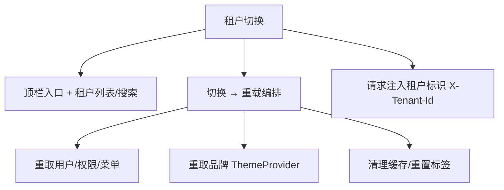

# 组件设计 · 租户切换

> TenantSwitcher · useTenant（协作：主题与品牌化 / 侧边菜单 / 请求封装）

[文档首页](../../../../文档首页.md) › [项目规划说明](../../../../规划/项目规划说明.md) › [组件设计](../../01_组件设计_总览.md) › 租户切换　|　[← 主题与品牌化](../20_组件设计_主题与品牌化/20_组件设计_主题与品牌化.md)　[打印与导出 PDF →](../22_组件设计_打印与导出PDF/22_组件设计_打印与导出PDF.md)

> 可交互原型：[21_原型设计_租户切换.html](21_原型设计_租户切换.html)（演示一人多租户列表、搜索、当前租户标记、切换确认与切换后重载（权限/菜单/品牌/数据范围））

## 1. 目的与适用范围 

定义 BMS 前端 `frontend/` **租户切换**的组件设计：切换器 `TenantSwitcher.vue`（顶栏入口、当前租户展示、租户下拉/弹层列表、搜索、切换确认）、状态 `useTenant.ts`（当前租户、可切换租户列表、切换与重载编排、租户标识注入）。用于**一人多租户**（用户在多个租户下有账号）或平台管理员切换进入某租户的场景，是[《概要设计 · 租户管理》](../../../概要设计/25_概要设计_租户管理.md)「多租户」的前端呈现。

### 1.1 定位与边界 

职责边界与相关节点分流如下：

- **入口**：顶栏（[《布局设计 · 导航》](../../../布局设计/05_布局设计_导航.html)）；一号多租户时显示，单租户隐藏。
- **切换**：切换后**重新加载**用户信息、权限、菜单、品牌与数据范围；清理与旧租户相关的缓存/标签。
- **租户标识**：请求头/登录态携带 `tenantId`（[07 基础类 01 请求封装](../../07_基础类/01_组件设计_请求封装/01_组件设计_请求封装.md)）；切换后所有请求以新租户为准。
- **品牌**：切换后重取租户品牌并重载（[06 交互类 20 主题与品牌化](../20_组件设计_主题与品牌化/20_组件设计_主题与品牌化.md)）。

上游/协作：[《概要设计 · 租户管理》](../../../概要设计/25_概要设计_租户管理.md)（我的租户列表、切换）、[《概要设计 · 身份认证SSO》](../../../概要设计/26_概要设计_身份认证SSO.md)（切换令牌/会话）、[06 交互类 15 侧边菜单](../15_组件设计_侧边菜单/15_组件设计_侧边菜单.md)（菜单重取）、[06 交互类 14 多标签导航](../14_组件设计_多标签导航/14_组件设计_多标签导航.md)（切换重置标签）、[《架构设计 · 前端架构》](../../../架构设计/28_架构设计_前端架构.md)（重载编排）。

> 本篇为组件设计体系交互类第 21 篇。**范围边界**：**租户管理与切换接口**归[《概要设计 · 租户管理》](../../../概要设计/25_概要设计_租户管理.md)；**认证/令牌**归[《概要设计 · 身份认证SSO》](../../../概要设计/26_概要设计_身份认证SSO.md)；**品牌应用**归[06 交互类 20 主题与品牌化](../20_组件设计_主题与品牌化/20_组件设计_主题与品牌化.md)；**重载与路由/缓存机制**归[《架构设计 · 前端架构》](../../../架构设计/28_架构设计_前端架构.md)（本节点做切换编排）。

## 2. 组件清单与职责 

| 组件 / 工具 | 位置 | 职责 |
| --- | --- | --- |
| `TenantSwitcher.vue` | `src/components/tenant/` | 切换器：顶栏入口（当前租户名/图标）、下拉/弹层租户列表、搜索、当前标记、切换确认、单租户隐藏 |
| `TenantList.vue` | `src/components/tenant/` | 租户列表：租户项（名称/编码/Logo/角色）、搜索、分页（租户多时） |
| `useTenant.ts` | `src/stores/tenant.ts` | 状态与编排：当前租户、可切换列表、切换（写会话/令牌 → 重载用户/权限/菜单/品牌 → 清缓存 → 跳默认主页） |

- 命名遵循[《命名规范》](../../../../规范/命名规范.md)：组件 PascalCase；目录遵循[《前端开发规范》](../../../../规范/前端开发规范.md)（租户归 `tenant/`）。

## 3. Props 与事件（TenantSwitcher） 

| 属性 | 类型 | 默认 | 说明 |
| --- | --- | --- | --- |
| `current` | TenantBrief | null | 当前租户（`id/name/code/logo?`） |
| `tenants` | TenantBrief[] | [] | 可切换租户列表（已登录用户的租户）；长度 ≤1 时隐藏 |
| `variant` | 'dropdown' \| 'popover' \| 'select' | 'dropdown' | 呈现形态（顶栏常用 dropdown） |
| `searchable` | boolean | true | 是否支持搜索（租户多时） |
| `confirm` | boolean | true | 切换是否二次确认（提示将重载） |
| `reloadOnSwitch` | boolean | true | 切换后是否整体重载（推荐） |

| 事件 | 载荷 | 说明 |
| --- | --- | --- |
| `change` | tenant | 切换目标租户 |
| `switched` | tenant | 切换完成（已重载） |

- 暴露方法（`useTenant`）：`switchTo(tenantId)`、`list()`、`current()`、`isMulti()`。

## 4. 交互与切换编排 

| 项 | 设计 |
| --- | --- |
| 显示条件 | 可切换租户数 > 1 时显示入口；单租户隐藏；平台管理员可切换进入任意租户（列表可能含「全部/平台」） |
| 当前展示 | 顶栏显示当前租户名称（+ Logo），点击展开列表 |
| 列表 | 租户名称/编码/该租户下的角色/Logo；支持搜索；租户多时分页/虚拟滚动 |
| 当前标记 | 当前租户高亮 + 勾选；不可选自身（或选自身无操作） |
| 切换确认 | 提示「切换将重新加载，未保存修改将丢失」，有脏数据时强化提示 |
| 切换编排 | ①调用切换接口（换取新租户会话/令牌，[《概要设计 · 身份认证SSO》](../../../概要设计/26_概要设计_身份认证SSO.md)）→ ②重取用户/权限/菜单 → ③重取品牌（[06 交互类 20 主题与品牌化](../20_组件设计_主题与品牌化/20_组件设计_主题与品牌化.md)）→ ④清理缓存与页面级标签（[06 交互类 14 多标签导航](../14_组件设计_多标签导航/14_组件设计_多标签导航.md)）→ ⑤跳转该租户默认主页（或保留等价路由，无权限则回主页） |
| 请求标识 | 后续请求头携带 `X-Tenant-Id`（[07 基础类 01 请求封装](../../07_基础类/01_组件设计_请求封装/01_组件设计_请求封装.md)）；切换后旧租户缓存失效 |
| 数据范围 | 切换后列表/权限按新租户数据范围（后端）；前端清空旧的查询条件缓存 |
| 失败处理 | 切换接口失败保留原租户并提示；重载阶段失败可重试/回退 |
| 加载态 | 切换过程全屏/入口加载态，防重复点击 |
| 记忆 | 记住上次租户（下次登录默认进入），或由后端默认租户决定（口径见登记项①） |

## 5. 场景集成 

| 场景 | 说明 |
| --- | --- |
| 一号多租户 | 同一账号在多个租户有角色，顶栏切换 |
| 平台管理员 | 切换进入指定租户进行运维/支持（带审计） |
| 服务商多客户 | SaaS 运维在客户租户间切换 |
| 切换后深链 | 目标租户无对应权限则回默认主页 |

## 6. 依赖接口与上游变更 

### 6.1 上游接口与口径 

| 项 | 说明 | 目标文档 |
| --- | --- | --- |
| 我的租户列表 | `GET /tenant/my`（当前用户可访问租户） | [《概要设计 · 租户管理》](../../../概要设计/25_概要设计_租户管理.md)（登记项①） |
| 切换接口 | `POST /tenant/switch`（换新租户会话/令牌） | [《概要设计 · 租户管理》](../../../概要设计/25_概要设计_租户管理.md) |
| 租户标识 | 请求头 `X-Tenant-Id` 约定 | [07 基础类 01 请求封装](../../07_基础类/01_组件设计_请求封装/01_组件设计_请求封装.md) |
| 品牌重载 | 切换后重取品牌 | [06 交互类 20 主题与品牌化](../20_组件设计_主题与品牌化/20_组件设计_主题与品牌化.md) |
| 重载编排 | 用户/权限/菜单/缓存/标签重载 | [《架构设计 · 前端架构》](../../../架构设计/28_架构设计_前端架构.md)（登记项③） |
| 入口 | 顶栏租户入口与显示条件 | [《布局设计 · 导航》](../../../布局设计/05_布局设计_导航.html)（登记项②） |
| 新增依赖 | **无**：`el-dropdown`/`el-popover` | — |

### 6.2 需登记的上游变更 

| 变更点 | 目标文档 | 内容 |
| --- | --- | --- |
| ① 我的租户与切换接口 | [《概要设计 · 租户管理》](../../../概要设计/25_概要设计_租户管理.md)「接口设计」「数据模型」节 | 明确 `GET /tenant/my`（可切换租户：id/name/code/logo/角色）、`POST /tenant/switch`（返回新租户会话/令牌）；默认租户与「记住上次租户」口径；平台管理员可切换范围与审计；标注组件设计 交互类 21 为组件契约依据 |
| ② 租户切换入口 | [《布局设计 · 导航》](../../../布局设计/05_布局设计_导航.html)「租户入口」节 | 明确顶栏租户切换入口位置、显示条件（>1 才显示）、下拉/弹层形态、切换确认与加载态 |
| ③ 切换重载与租户标识 | [《架构设计 · 前端架构》](../../../架构设计/28_架构设计_前端架构.md)「多租户」节 | 明确切换后重载编排（用户/权限/菜单/品牌）、缓存与标签清理、请求头 `X-Tenant-Id` 注入与旧租户缓存失效、失败回退 |

> 按[《文档生成规范》](../../../../规范/文档生成规范.md)「引用与追溯」节，上述变更需用户确认后由上游文档同步；本节点只定义组件契约，不单独裁决接口与重载机制。

## 7. 权限 / i18n / 移动端 

- **权限**：仅显示用户有权的租户；平台管理员切换范围按平台权限；切换后权限**整体重算**；切换动作（尤其管理员进入租户）记审计日志（[《概要设计 · 审计合规》](../../../概要设计/28_概要设计_审计合规.md)）。
- **i18n**：租户名称可由租户自配（不翻译或按租户多语言）；切换器文案走 vue-i18n。
- **移动端**：入口收入「我的」或抽屉；租户列表全屏页/底部抽屉（[《布局设计 · 移动端》](../../../布局设计/15_布局设计_移动端.html)）。

## 8. 性能与边界 

| 场景 | 设计 |
| --- | --- |
| 租户多 | 列表分页/虚拟滚动 + 搜索；当前租户置顶 |
| 切换 | 全量重载（清缓存、重取权限/菜单/品牌），入口加载态防重复 |
| 缓存 | 切换后清空旧租户的请求缓存、标签、查询条件 |
| 边界 | 单租户隐藏、切换失败回退、目标租户无权限回主页、脏数据提示、重复点击、深链路由在新租户无权限、会话/令牌过期、品牌与权限加载失败重试 |
| 不支持 | 租户管理后台与切换接口（租户管理）、认证/令牌（身份认证）、品牌应用（20）、重载机制实现（前端架构） |

## 9. 检查清单 

- □ 组件分层：`TenantSwitcher` 入口、`TenantList` 列表、`useTenant` 状态与编排
- □ 显示条件：可切换租户 >1 显示、单租户隐藏、当前租户展示
- □ 列表：名称/编码/角色/Logo、搜索、分页/虚拟滚动、当前高亮、平台管理员范围
- □ 切换：二次确认（脏数据强化）、加载态、切换编排（会话→用户/权限/菜单→品牌→清缓存/标签→跳主页）
- □ 请求标识：`X-Tenant-Id` 注入、旧租户缓存失效、数据范围重算
- □ 失败处理：切换失败保留原租户、重载失败重试/回退、无权限回主页
- □ 权限（有权租户/管理员范围/审计）、i18n（租户名/文案）、移动端（入口收纳/全屏列表）符合第 7 节
- □ 性能边界：大列表分页、全量重载防重复、缓存清理
- □ 三项上游登记已确认：我的租户与切换接口、租户切换入口、切换重载与租户标识

> 组件设计节点 · 与[《概要设计 · 租户管理》](../../../概要设计/25_概要设计_租户管理.md)[《概要设计 · 身份认证SSO》](../../../概要设计/26_概要设计_身份认证SSO.md)[《概要设计 · 审计合规》](../../../概要设计/28_概要设计_审计合规.md)[《布局设计 · 导航》](../../../布局设计/05_布局设计_导航.html)[《架构设计 · 前端架构》](../../../架构设计/28_架构设计_前端架构.md)[06 交互类 14 多标签导航](../14_组件设计_多标签导航/14_组件设计_多标签导航.md)[06 交互类 15 侧边菜单](../15_组件设计_侧边菜单/15_组件设计_侧边菜单.md)[06 交互类 20 主题与品牌化](../20_组件设计_主题与品牌化/20_组件设计_主题与品牌化.md)[07 基础类 01 请求封装](../../07_基础类/01_组件设计_请求封装/01_组件设计_请求封装.md)《命名规范》配套
