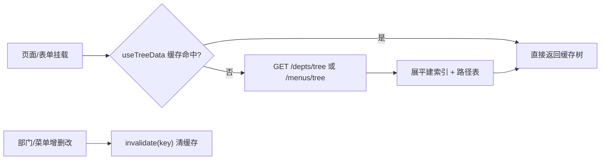

# 组件设计 · 树选择字段

> TreeSelectField · DeptTreeSelect · MenuTreeSelect · useTreeData

[文档首页](../../../../文档首页.md) › [项目规划说明](../../../../规划/项目规划说明.md) › [组件设计](../../01_组件设计_总览.md) › 树选择字段　|　[← 数值与金额字段](../03_组件设计_数值与金额字段/03_组件设计_数值与金额字段.md)　[组织选择字段 →](../05_组件设计_组织选择字段/05_组件设计_组织选择字段.md)

> 可交互原型：[05_原型设计_树选择字段.html](04_原型设计_树选择字段.html)（演示部门树/菜单树选择、单选多选、联想过滤、懒加载、只读路径回显、查询区筛选）

## 1. 目的与适用范围 

定义 BMS 前端 `frontend/` **树形结构选择字段**的通用组件设计：通用树选择（TreeSelectField）、部门树选择（DeptTreeSelect）、菜单树选择（MenuTreeSelect），以及树数据取数与缓存工具 `useTreeData`。适用于需要从层级数据中选择节点的场景：所属部门、上级部门、数据权限范围、菜单挂载点、分类/分组节点。

本节对应[《项目规划说明》](../../../../规划/项目规划说明.md)前端与组织权限章节；上游设计依据[《概要设计 · 部门管理》](../../../概要设计/08_概要设计_部门管理.md)（部门树接口与层级）、[《概要设计 · 菜单管理》](../../../概要设计/07_概要设计_菜单管理.md)（菜单树接口、图标与权限码）、[《概要设计 · 岗位管理》](../../../概要设计/05_概要设计_岗位管理.md)（组织归属）；页面形态依据[《布局设计 · 列表页》](../../../布局设计/07_布局设计_列表页.html)（部门查询用树选择）与[《布局设计 · 表单页》](../../../布局设计/08_布局设计_表单页.html)（上下级字段）。

> 本篇为组件设计体系字段类第 04 篇；组织成员（人员）选择见 [组织选择字段](../05_组件设计_组织选择字段/05_组件设计_组织选择字段.md)节点。

## 2. 组件清单与职责 

| 组件 / 工具 | 位置 | 职责 |
| --- | --- | --- |
| `TreeSelectField.vue` | `src/components/field/` | 通用树选择（`el-tree-select`）：单选/多选、联想过滤、可选叶子约束、懒加载 |
| `DeptTreeSelect.vue` | `src/components/field/` | 部门树选择：绑定部门接口，排除自身/子树（选上级部门时防环） |
| `MenuTreeSelect.vue` | `src/components/field/` | 菜单树选择：绑定菜单接口，排除自身/子树（选上级菜单） |
| `useTreeData()` | `src/utils/useTreeData.ts` | 树数据取数：接口拉取、展平建索引、路径查找、缓存与失效 |

- 字段类组件统一受控：`modelValue` / `update:modelValue` + `change`（见[《组件设计 · 总览》](../../01_组件设计_总览.md)）。
- 命名遵循[《命名规范》](../../../../规范/命名规范.md)。

## 3. 树数据来源与取数策略 

| 项 | 设计 |
| --- | --- |
| 部门树 | `GET /api/v1/depts/tree`（层级、`id` 字符串、`parent_id`、`name`、`sort`）；见[《概要设计 · 部门管理》](../../../概要设计/08_概要设计_部门管理.md) |
| 菜单树 | `GET /api/v1/menus/tree`（含 `type` 目录/菜单/按钮、`perm` 权限码、`icon`）；见[《概要设计 · 菜单管理》](../../../概要设计/07_概要设计_菜单管理.md) |
| 取数 | 默认整树拉取（树规模有限），组件内**共享缓存**（同一会话同一接口只拉一次，标注版本失效） |
| 懒加载 | 超大树（节点数超阈值，如 > 2000）改为懒加载（`lazy` + `load`），点击展开时按 `parent_id` 拉子节点 |
| 失效 | 部门/菜单增删改后须使对应树缓存失效（模块内调用 `invalidate('dept')`） |
| 索引 | 拉取后展平建 `Map<id, node>` 与 `Map<id, pathNodes>`，用于快速回显路径与校验 |

## 4. TreeSelectField Props 与事件 

| 属性 | 类型 | 默认 | 说明 |
| --- | --- | --- | --- |
| `modelValue` | string \| string[] \| null | — | 选中节点 id（多选为数组） |
| `treeKey` | 'dept' \| 'menu' \| 自定义 | — | 数据源标识（决定接口与缓存 key） |
| `multiple` | boolean | false | 是否多选（`show-checkbox`） |
| `checkStrictly` | boolean | true | 父子是否独立（默认独立，即父节点可单独选中） |
| `onlyLeaf` | boolean | false | 是否只允许选叶子节点 |
| `excludeIds` | string[] | [] | 排除节点（含子树），用于「选上级」时排除自身 |
| `filterable` | boolean | true | 是否可联想过滤（按名称，300ms 防抖） |
| `lazy` | boolean | false | 是否懒加载 |
| `checkStrategy` | 'all' \| 'parent' \| 'child' | 'all' | 多选校验策略（是否含父/子） |
| `disabled` | boolean | false | 只读/无权限（`editable=false` 由表单页传入） |
| `placeholder` | string | 请选择 | 占位文案 |

| 事件 | 载荷 | 说明 |
| --- | --- | --- |
| `update:modelValue` | string \| string[] \| null | v-model 绑定 |
| `change` | id \| id[] \| null | 变化通知 |
| `node-click` | node | 节点点击（联动其他字段） |

## 5. 部门树与菜单树差异 

| 维度 | 部门树 | 菜单树 |
| --- | --- | --- |
| 数据源 | `GET /depts/tree` | `GET /menus/tree` |
| 节点展示 | 名称 + （状态/人数可选） | 名称 + 类型图标 + 权限码（可选） |
| 排除自身 | 选上级部门时必须排除自身与子树（防环） | 选上级菜单时同 |
| 典型用法 | 所属部门、数据权限范围 | 菜单挂载点、权限码归属 |
| 校验 | 上级不得为自身或后代；部门层级深度限制 | 目录/菜单/按钮类型约束 |

## 6. 单选 / 多选 / 只允许叶子 

- **单选**：默认；选中后回填 `modelValue`（id）。
- **多选**：`multiple=true`，`show-checkbox`；`checkStrictly=true` 时父子独立，`false` 时父子联动。
- **只选叶子**：`onlyLeaf=true` 时非叶子节点不可选（点击展开），用于「必须挂到具体部门」场景。
- **校验策略** `checkStrategy`：多选时校验选中集合是否含父+子（`parent`/`child` 互斥或 `all` 允许并存），避免数据权限重叠。

## 7. 只读回显与列表渲染 

| 场景 | 展示 |
| --- | --- |
| 只读回显 | 显示节点**完整路径**（如「总部 / 研发部 / 前端组」），由 `useTreeData().pathOf(id)` 得出 |
| 列表列 | 部门列显示部门名称（或路径），用节点索引映射；节点已删除时回退 `id` |
| 多选回显 | `标签1、标签2`（超过 N 个折叠为「标签1 等 M 项」） |
| 空值 | `—` |

## 8. 查询区筛选协作 

- 列表页查询区「部门」用 `DeptTreeSelect`（[《布局设计 · 列表页》](../../../布局设计/07_布局设计_列表页.html)：部门用树选择），支持「含下级」勾选（提交 `dept_id` + `include_children`）。
- 查询条件变化回第 1 页；分页/排序保留筛选（`useListPage`，见 [请求封装](../../09_基础类/01_组件设计_请求封装/01_组件设计_请求封装.md)）。

## 9. 依赖接口与上游变更 

| 项 | 说明 | 目标文档 |
| --- | --- | --- |
| 部门树接口 | `GET /depts/tree` 返回层级结构；节点含 `id/parent_id/name/sort` | [《概要设计 · 部门管理》](../../../概要设计/08_概要设计_部门管理.md) |
| 菜单树接口 | `GET /menus/tree` 返回层级结构；节点含 `type/perm/icon` | [《概要设计 · 菜单管理》](../../../概要设计/07_概要设计_菜单管理.md) |
| 含下级查询 | 列表查询支持 `include_children`（部门范围） | [《概要设计 · 部门管理》](../../../概要设计/08_概要设计_部门管理.md) / [《概要设计 · 用户管理》](../../../概要设计/03_概要设计_用户管理.md) |
| 字段 widget | 表单元数据需标注树字段的数据源（dept/menu）与选择模式：字段定义由菜单管理（`sys_field`）承载，组件类型与校验属性由表单定制叠加 | [《概要设计 · 菜单管理》](../../../概要设计/07_概要设计_菜单管理.md) + [《概要设计 · 表单定制》](../../../概要设计/36_概要设计_表单定制.md) |
| 自建字段类型限制 | 树选择**不在**租户自建字段类型白名单内（白名单：text/longtext/number/datetime/select/multi_select/switch/file）：本组件仅用于平台字段（如部门字段 `dept_id`、菜单 `parent_id`）；租户自建字段如需按树过滤，须先扩展白名单（登记为上游变更建议） | [《概要设计 · 表单定制》](../../../概要设计/36_概要设计_表单定制.md) |

> 树接口的字段名以对应概要节点为准；如接口返回结构变化，先同步上游再更新本节点与前端类型。

## 10. 性能与大数据量 

| 场景 | 设计 |
| --- | --- |
| 整树拉取 | 树规模有限时一次拉取 + 缓存，避免重复请求 |
| 超大节点 | 节点数 > 2000 改懒加载；下拉面板虚拟滚动 |
| 联想过滤 | 本地过滤（已有整树时）或远程过滤（懒加载模式），300ms 防抖 |
| 路径查找 | 展平索引 `Map`，O(1) 回显路径 |
| 缓存失效 | 增删改后精准失效对应 key，避免脏数据 |
| 首屏 | 仅当字段可见（`visible=true`）时才触发取数 |

## 11. 字段权限 / i18n / 移动端 

- **字段权限**：`visible=false` 不渲染（可避免无谓取数）；`editable=false` 传 `disabled`（见 [权限指令](../../09_基础类/02_组件设计_权限指令/02_组件设计_权限指令.md)）；数据权限（可见部门范围）由后端按角色过滤树节点。
- **i18n**：部门/菜单名称由后端按 locale 下发（i18n 附表）；过滤占位、「含下级」等文案走 vue-i18n。
- **移动端**：frontend-mobile 用 Vant 级联/弹层树选择，数据源与路径回显口径同源，不复用 PC 组件。

## 12. 检查清单 

- □ 受控组件 + `change`；单选/多选/只允许叶子可配；`checkStrictly` 语义正确
- □ 数据源支持 dept / menu 及自定义；整树缓存 + 失效机制；超大树懒加载
- □ 选上级时 `excludeIds` 排除自身与子树，防环；层级深度与类型校验
- □ 只读回显显示完整路径（`pathOf`）；节点已删除回退 id；多选折叠展示
- □ 查询区「部门」用树选择，支持「含下级」（`include_children`），变化回第 1 页
- □ 联想过滤 300ms 防抖；大数据量虚拟滚动；不可见字段不取数
- □ 字段权限（visible/editable）与数据权限过滤树节点
- □ 移动端口径同源（第 11 节）

> 组件设计节点 · 与[《概要设计 · 部门管理》](../../../概要设计/08_概要设计_部门管理.md)[《概要设计 · 菜单管理》](../../../概要设计/07_概要设计_菜单管理.md)[《布局设计 · 列表页》](../../../布局设计/07_布局设计_列表页.html)[《命名规范》](../../../../规范/命名规范.md)配套
