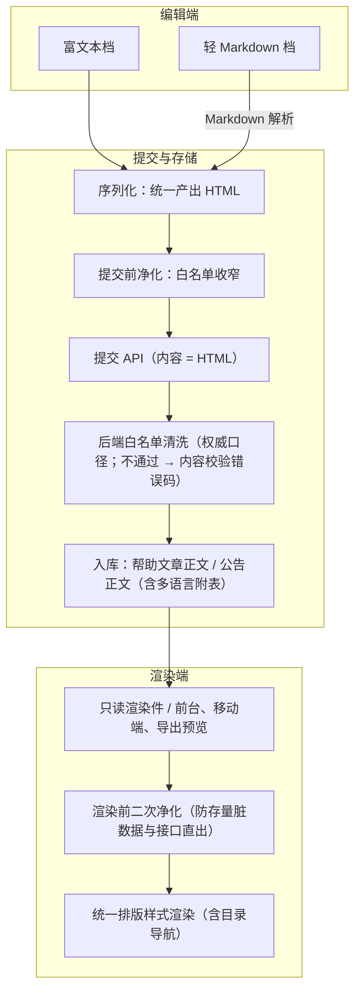

# 组件设计 · 富文本字段

> 富文本编辑与只读渲染的字段：双模式（富文本 / 轻 Markdown） / 全量档工具栏（图片、附件卡片、表格、公式、代码高亮、目录导航） / HTML 白名单双向净化 / 上传协作 / 摘要与只读回显
> 实现侧命名与落点见《[前端基类清单](../../../../前端基类清单.md)》，实现契约细节见项目详细设计。

[文档首页](../../../../文档首页.md) › [项目规划说明](../../../../规划/项目规划说明.md) › [组件设计](../../01_组件设计_总览.md) › 富文本字段　|　[← 文件上传字段](../06_组件设计_文件上传字段/06_组件设计_文件上传字段.md)　[开关与枚举字段 →](../08_组件设计_开关与枚举字段/08_组件设计_开关与枚举字段.md)

> 可交互原型：[08_原型设计_富文本字段.html](07_原型设计_富文本字段.html)（演示富文本/轻 Markdown 双模式、工具栏全量档、公式与代码高亮、附件卡片、白名单双向净化与只读渲染、字数校验与目录导航）

## 1. 目的与适用范围 

定义 BMS 前端**富文本字段**的组件设计：富文本编辑字段与只读渲染件、轻 Markdown 编辑档（源码编辑 + 实时预览），覆盖双模式（富文本 / 轻 Markdown）、全量档工具栏（图片、附件卡片、表格、公式、代码高亮、目录导航）、HTML 白名单**双向** XSS 清洗、内嵌图片与附件复用[文件上传字段](../06_组件设计_文件上传字段/06_组件设计_文件上传字段.md)的上传引擎、列表摘要与只读回显。适用于公告正文、帮助文章正文（含多语言附表）、邮件模板、业务长文本说明等场景。

本节对应[《项目规划说明》](../../../../规划/项目规划说明.md)前端与帮助中心/公告章节；上游设计依据[《概要设计 · 帮助中心》](../../../概要设计/17_概要设计_帮助中心.md)（帮助文章正文在线编辑、XSS 白名单清洗、内容校验错误码）、[《概要设计 · 公告管理》](../../../概要设计/18_概要设计_公告管理.md)（公告正文、公告渲染口径）、[《概要设计 · 表单定制》](../../../概要设计/36_概要设计_表单定制.md)（字段属性组件类型切换、字段类型白名单）、[《架构设计 · 前端架构》](../../../架构设计/08_架构设计_前端架构.md)（技术要点、性能预算与分包）与[《架构设计 · 性能与安全》](../../../架构设计/31_架构设计_性能与安全.md)（XSS 防护：纯文本默认转义、富文本白名单净化）；页面形态依据[《布局设计 · 表单页》](../../../布局设计/08_布局设计_表单页.html)（只读/编辑分态）；协作节点为[文件上传字段](../06_组件设计_文件上传字段/06_组件设计_文件上传字段.md)（图片与附件上传引擎）、[请求封装](../../09_基础类/01_组件设计_请求封装/01_组件设计_请求封装.md)（错误码提示）、[权限指令](../../09_基础类/02_组件设计_权限指令/02_组件设计_权限指令.md)（字段权限）、[格式化工具](../../09_基础类/03_组件设计_格式化工具/03_组件设计_格式化工具.md)（文本处理口径）。

> 本篇为「富文本字段」节点。**范围边界**：编辑器的内核加载、内容协议与只读/变更契约归[编辑器域基类](../../02_基础组件类/03_域基类/05_组件设计_编辑器域基类/05_组件设计_编辑器域基类.md)；字段外观（标签/必填/校验/权限）叠加[输入域基类](../../02_基础组件类/03_域基类/01_组件设计_输入域基类/01_组件设计_输入域基类.md)与[字段壳能力](../../02_基础组件类/02_能力类/10_组件设计_字段壳能力/10_组件设计_字段壳能力.md)；只读展示渲染归[展示域基类](../../02_基础组件类/03_域基类/02_组件设计_展示域基类/02_组件设计_展示域基类.md)。内容形态为 **HTML**（统一入库口径）：轻 Markdown 档保存时解析为 HTML 并净化后入库，不保留 Markdown 原文；图片/附件上传复用[文件上传字段](../06_组件设计_文件上传字段/06_组件设计_文件上传字段.md)，不重复设计。分层权威见[《前端开发规范》](../../../../规范/前端开发规范.md)「前端基类体系」节。

## 2. 职责与组成 

| 组成部分 | 职责 |
| --- | --- |
| 富文本编辑字段 | 富文本档编辑：编辑器内核与工具栏、字数/长度校验、只读/禁用态、受控值（HTML 字符串） |
| 只读渲染件 | 只读渲染：净化后 HTML + 统一排版样式（标题层级、表格、代码块、公式、图片自适应、目录导航） |
| 轻 Markdown 编辑档 | 源码编辑 + 实时预览，保存时解析为 HTML（帮助中心技术文档场景），不保留 Markdown 原文 |
| 编辑器组合逻辑 | 编辑器生命周期与模式切换、内容序列化（HTML/纯文本）、可选目录提取、实例销毁与内存回收 |
| 内容净化 | HTML 白名单净化（提交前与渲染前两次过滤，白名单与后端同源） |
| Markdown 解析 | Markdown → HTML（表格/代码/公式扩展），解析结果仍走内容净化 |
| 继承链 | 富文本编辑字段 → [编辑器域基类](../../02_基础组件类/03_域基类/05_组件设计_编辑器域基类/05_组件设计_编辑器域基类.md)（叠加[输入域基类](../../02_基础组件类/03_域基类/01_组件设计_输入域基类/01_组件设计_输入域基类.md)与[字段壳能力](../../02_基础组件类/02_能力类/10_组件设计_字段壳能力/10_组件设计_字段壳能力.md)）→ 能力层（[编辑器内核能力](../../02_基础组件类/02_能力类/17_组件设计_编辑器内核能力/17_组件设计_编辑器内核能力.md)、[上传引擎能力](../../02_基础组件类/02_能力类/13_组件设计_上传引擎能力/13_组件设计_上传引擎能力.md)）→ 组件根 → 根系；只读渲染件 → [展示域基类](../../02_基础组件类/03_域基类/02_组件设计_展示域基类/02_组件设计_展示域基类.md)；行为在链上层维护，不在组件内重复实现 |

- 富文本编辑字段统一**受控**：受控双向绑定，变更额外抛出业务变更通知（见[《组件设计 · 总览》](../../01_组件设计_总览.md)通用设计约定）；值为 **HTML 字符串**（空值为统一空值）。
- 移动端与 PC 端同接口多实现（契约套件同一套断言）：只读按同一份净化后 HTML 渲染，需编辑时用源码输入，不直接复用 PC 组件（见第 12 节）。

## 3. 内容链路与双模式 

| 模式 | 适用场景 | 编辑形态 | 保存口径 |
| --- | --- | --- | --- |
| 富文本档（内容协议 `rich`） | 公告正文、帮助文章（图文混排）、邮件模板 | 所见即所得（全量档工具栏） | 编辑器输出 HTML → 提交前净化 → 提交 |
| 轻 Markdown 档（内容协议 `markdown`） | 帮助中心技术文档（代码/表格/公式为主，编辑者偏好源码） | 左侧源码（等宽字体）+ 右侧实时预览（防抖） | Markdown 解析 → 提交前净化 → 提交 **HTML** |
| 模式来源 | 由表单元数据或字段属性决定，**字段级固定** | — | 同一字段不做 HTML → Markdown 逆向转换（有损）；确需换模式时按纯文本源码降级展示并提示人工校对 |

- 两档共用同一套净化与渲染链路，**入库后不再区分来源模式**，前台/移动端/导出/AI 知识源只看 HTML。
- 编辑器与插件**异步按需加载**（独立分包）：仅当页面出现富文本字段时拉取，不进入首屏主包（见第 11 节）。

## 4. 内容安全与白名单（XSS 双向清洗） 

| 层 | 位置 | 职责 |
| --- | --- | --- |
| 前端净化（编辑入库前） | 富文本档 / 轻 Markdown 档序列化处 | 提交前净化一次，剔除粘贴带入的脏标签、事件属性与危险 URL；避免脏数据进库 |
| 前端净化（渲染前） | 只读渲染件 / Markdown 预览 | 二次净化，防**存量脏数据**与接口直出（后端被绕过/历史数据）；只读回显只渲染净化后 HTML |
| 后端清洗（权威口径） | 后端接口与序列化处理 | 按白名单清洗，防接口直写脏数据；不通过返回内容校验错误码（帮助 40005，公告按公告模块 7xxxx 段） |
| 渲染原则 | 只读渲染件 | **禁止未净化内容直出**；纯文本字段仍走默认转义；导出/打印同样只取净化后 HTML |

白名单（前后端同源，本节点登记为上游变更，见第 10 节）：

| 类别 | 允许 |
| --- | --- |
| 块级 | `p` `div` `h1`-`h6` `blockquote` `pre` `hr` `ul` `ol` `li` `table` `thead` `tbody` `tr` `th` `td` |
| 行内 | `span` `strong` `em` `u` `s` `code` `br` `sub` `sup` `a`（`href` 限 `http`/`https`/`mailto`/站内相对路径，渲染时强制 `rel="noopener noreferrer"`） |
| 图片 | `img`（`src` 仅允许站内文件预览 URL/预签名 URL，禁止 `data:` 与 `javascript:`；保留 `alt`/`title`；统一 `referrerpolicy="no-referrer"`） |
| 公式 | 公式渲染输出结构（公式节点及其白名单子节点） |
| 代码高亮 | `pre > code` 及 `class="language-*"`（语言白名单限定常用语言） |
| 附件卡片 | 附件卡片链接（携带 `data-file-id`/`data-file-name` 属性，渲染层转[文件上传字段](../06_组件设计_文件上传字段/06_组件设计_文件上传字段.md)的下载/预览） |
| 样式 | `style` 属性按**属性级白名单**收窄（仅 `text-align` / `text-indent` / `width` / `height` / `max-width`），其余剥离；禁 `expression()`、`url(...)` |
| 禁止 | `script` `style` `iframe` `object` `embed` `form` `input` `video` `audio` `svg`、全部 `on*` 事件属性、`javascript:`/`data:text/html` URL、外链视频嵌入 |

- **净化口径**：按标签/属性/URL 协议白名单与属性级 `style` 白名单执行（补齐链接安全属性、校验图片 URL）；同一份白名单常量供 Markdown 预览与只读渲染共用。
- **粘贴处理**：粘贴内容先净化再入编辑器（Word/网页粘贴），脚本与事件属性一律剥离；外链图片默认保留并统一 `referrerpolicy`，字段属性可配置「仅允许站内图片」时剥除外链。
- **与字段权限的关系**：字段不可见不渲染、不可编辑走只读渲染；正文本身不落脱敏字段，脱敏不适用于富文本正文。

## 5. 交互与契约语义 

| 语义项 | 说明 |
| --- | --- |
| 受控值 | 两档统一受控，值为 HTML 字符串（空值为统一空值） |
| 编辑模式 | 富文本 / 轻 Markdown 两档，字段级固定，来自表单元数据或字段属性 |
| 工具栏档位 | 全量档（含公式/代码块/附件卡片/目录）或常用集，按字段属性裁剪 |
| 占位与禁用 | 占位文案走 i18n；禁用/无权限走只读渲染 |
| 字数与长度上限 | 纯文本字数上限（去标签计数）与 HTML 长度兜底上限（对齐后端内容列长度），超限内联提示并阻止提交 |
| 内容能力开关 | 图片、附件卡片、公式、代码高亮、表格按字段属性启停（图片与附件复用上传引擎） |
| 目录导航 | 只读渲染时可按标题层级生成目录导航 |
| 值变化通知 | 受控更新与业务变更（净化后 HTML、纯文本摘要）；聚焦/失焦配合表单校验触发时机；上传失败提示 |
| 内容操作 | 取净化后 HTML（提交用）、取纯文本（摘要/字数用）、设置内容、光标处插入、空值判定、聚焦 |

## 6. 工具栏与插件语义（全量档） 

| 分组 | 项 | 说明 |
| --- | --- | --- |
| 文本 | 加粗、斜体、下划线、删除线、上下标、文字颜色、背景色、字号、字体 | 编辑器内核内置 |
| 段落 | 标题、引用、有序/无序列表、对齐与缩进、分割线 | 编辑器内核内置 |
| 插入 | 表格、链接、图片上传、附件卡片、代码块（高亮）、公式、目录导航 | 图片与附件复用上传引擎；公式与代码高亮由编辑器插件提供；附件卡片与目录导航由本节点定义（内容协议见第 4 节） |
| 其他 | 撤销/重做、全屏、清空、字数统计 | 编辑器内核内置 |
| 排除项 | 视频、外链视频、协同编辑 | 本次范围不支持（见第 11 节边界） |

- **附件卡片**：插入带 `data-file-id`/`data-file-name`/`data-file-size` 的链接节点，编辑器内渲染为卡片（图标 + 文件名 + 大小）；只读渲染层转[文件上传字段](../06_组件设计_文件上传字段/06_组件设计_文件上传字段.md)的下载/预览入口，下载受 `file:download` 动作权限约束。
- **目录导航**：只读渲染态按标题层级自动生成锚点目录（侧栏或悬浮，滚动高亮）；编辑器内不放大纲面板（简化实现，升级项），关闭时不生成。
- **公式**：公式渲染资源按需异步加载；渲染态直接复用同一套样式渲染公式输出结构，不二次解析。
- **代码高亮**：编辑器内按语言高亮；只读渲染按语言类名高亮，语言限定常用白名单（避免整包引入全部语言）。
- 工具栏按字段属性裁剪（如公告可关闭公式/代码块），常用集仅保留文本与段落两组 + 图片。

## 7. 轻 Markdown 模式 

| 项 | 设计 |
| --- | --- |
| 解析器 | Markdown 解析（基线语法 + 表格/任务列表 + 代码高亮扩展），输出 HTML 后统一净化 |
| 编辑形态 | 左侧源码（等宽字体、行号可选）+ 右侧实时预览（防抖）；支持缩进、粘贴图片自动上传并插入图片语法 |
| 语法集 | 标题/列表/表格/引用/代码块/行内代码/链接/图片/公式/附件语法糖（解析为附件卡片标记） |
| 安全 | 解析结果一律净化：原始 HTML 仅白名单放行，**禁止直通**（防 Markdown 内嵌脚本） |
| 存储 | 保存时解析 → 净化 → 提交 HTML（与富文本档同一入库口径），不保留 Markdown 原文列 |
| 切换 | 字段级固定（元数据编辑模式）；跨模式切换不做自动逆向转换（HTML → Markdown 有损），需人工校对后保存 |

## 8. 图片与附件上传协作 

- 内嵌图片：复用 [文件上传字段](../06_组件设计_文件上传字段/06_组件设计_文件上传字段.md) 的上传引擎（分片、秒传、断点续传、进度、失败重试）；上传成功插入图片节点（预览地址 + 文件标识），编辑器内以占位图 + 进度呈现。
- 附件卡片：同样复用上传与下载/预览能力；卡片携带文件标识与展示用文件名/大小（避免渲染时逐个查询）。
- 限额与类型：继承文件上传字段的字段级 `accept` / `maxSize` / `limit` 口径；富文本内嵌图片默认 10MB/张、类型 `png,jpg,jpeg,webp,gif`，数量上限由字段属性声明。
- 失败与删除：上传失败内联提示且不阻断正文编辑（占位可重试/移除）；删除图片或附件**不删文件**，由文件管理侧的孤儿回收策略统一清理（见[《概要设计 · 文件管理》](../../../概要设计/13_概要设计_文件管理.md)与[《架构设计 · 文件管理子系统》](../../../架构设计/20_架构设计_子系统_文件管理.md)）。
- 失效文件：渲染时文件标识对应文件已失效（删除/过期）时展示「文件已失效」占位，不可下载。

## 9. 只读回显与渲染 

| 场景 | 设计 |
| --- | --- |
| 表单只读态 / 详情页 | 只读渲染件：净化后 HTML + 统一排版样式（标题层级、表格边框、代码块、引用、图片最大宽度 100%、表格横向滚动） |
| 列表页摘要 | 取纯文本截断 + 单行省略；**列表不渲染 HTML**（避免直出内容开销与样式污染） |
| 目录导航 | 开启时按标题层级生成锚点目录，滚动高亮当前节 |
| 打印 / 导出预览 | 复用同一净化后 HTML 与样式表；PDF/Word 导出由导出引擎按 HTML 片段渲染 |
| 前台与移动端 | 帮助中心前台、公告查看、移动端均用同一净化后 HTML 口径，各端按自身样式适配 |
| 空值 | 展示占位 `—` 或「暂无内容」 |
| 多语言 | 正文按帮助文章 / 公告多语言附表按 locale 取用，缺省回退默认语言（见第 12 节） |

## 10. 依赖接口与上游变更 

### 10.1 上游接口与口径 

| 项 | 说明 | 目标文档 |
| --- | --- | --- |
| 内容字段口径 | 帮助文章正文、公告正文（含多语言附表）统一存 **HTML**；长度上限以列定义为准（超限即内容校验失败） | [《概要设计 · 公告管理》](../../../概要设计/18_概要设计_公告管理.md)、[《概要设计 · 帮助中心》](../../../概要设计/17_概要设计_帮助中心.md) |
| 清洗与错误码 | 后端白名单清洗为权威口径，清洗/长度校验不通过返回内容校验失败（帮助 40005；公告按 7xxxx 段） | [《概要设计 · 帮助中心》](../../../概要设计/17_概要设计_帮助中心.md)、[《概要设计 · 公告管理》](../../../概要设计/18_概要设计_公告管理.md) |
| 白名单口径 | 前后端同源 HTML 白名单（允许标签/属性/URL 协议）与 `style` 属性级白名单（第 4 节表格） | [《概要设计 · 帮助中心》](../../../概要设计/17_概要设计_帮助中心.md)、[《概要设计 · 公告管理》](../../../概要设计/18_概要设计_公告管理.md)、[《架构设计 · 性能与安全》](../../../架构设计/31_架构设计_性能与安全.md) |
| 字段属性组件类型 | 表单定制字段属性需支持「组件类型 = 富文本」，富文本以长文本类型承载（字段类型白名单**不新增类型**，仅为组件类型切换） | [《概要设计 · 表单定制》](../../../概要设计/36_概要设计_表单定制.md)、[《概要设计 · 菜单管理》](../../../概要设计/07_概要设计_菜单管理.md) |
| 自建字段 | 租户自建富文本字段**本次不放开**（字段类型白名单保持 `text/longtext/number/datetime/select/multi_select/switch/file`）；如需放开须单独评估（存储列类型、清洗口径、导入导出） | [《概要设计 · 表单定制》](../../../概要设计/36_概要设计_表单定制.md) |
| 渲染路径 | 表单元数据提供字段类型、组件类型、编辑模式与限额，前端据此选择编辑器与工具栏 | [《概要设计 · 菜单管理》](../../../概要设计/07_概要设计_菜单管理.md)、[《概要设计 · 表单定制》](../../../概要设计/36_概要设计_表单定制.md) |
| 图片/附件上传 | 复用 [文件上传字段](../06_组件设计_文件上传字段/06_组件设计_文件上传字段.md) 与文件管理接口（上传、分片、下载/预览 URL） | [《概要设计 · 文件管理》](../../../概要设计/13_概要设计_文件管理.md) |
| 检索与 AI | HTML 入检索/AI 知识源前须去标签转纯文本（标签不参与检索与切片） | [《架构设计 · 全文检索》](../../../架构设计/25_架构设计_子系统_全文检索.md)、[《架构设计 · AI 服务》](../../../架构设计/26_架构设计_子系统_AI服务.md) |
| 错误提示 | 上传/内容校验等错误提示复用 [请求封装](../../09_基础类/01_组件设计_请求封装/01_组件设计_请求封装.md)的错误码 → i18n 文案映射 | [请求封装与错误处理](../../09_基础类/01_组件设计_请求封装/01_组件设计_请求封装.md) |

### 10.2 依赖选型与登记 

| 项 | 说明 | 目标文档 |
| --- | --- | --- |
| 编辑器内核 / 公式渲染 / 代码高亮 / Markdown 解析 / HTML 白名单净化 | 上述第三方组件属**实现侧选型**（具体库与版本以《[前端基类清单](../../../../前端基类清单.md)》与详细设计为准）；本节点只约定组件契约语义与内容协议 | [《架构设计 · 前端架构》](../../../架构设计/08_架构设计_前端架构.md)「技术要点」、[《项目规划说明》](../../../../规划/项目规划说明.md)前端技术选型（登记项④） |

> 按[《文档生成规范》](../../../../规范/文档生成规范.md)「引用与追溯」节，上述变更需用户确认后由上游文档同步；本节点只约定组件契约，不重复选型论证。

## 11. 性能与边界 

| 项 | 设计 |
| --- | --- |
| 加载策略 | 编辑器内核、编辑插件、公式与代码高亮资源均**异步按需加载**并独立分包，仅富文本字段所在页面进入时拉取，不进入首屏主包（对齐[《架构设计 · 前端架构》](../../../架构设计/08_架构设计_前端架构.md)「路由分片后单页 JS 包 gzip ≤ 300KB」预算） |
| 公式 / 高亮 | 公式资源仅公式档加载；代码高亮只注册常用语言（不整包引入全部语言）；字体异步加载避免阻塞 |
| 大文档 | 字数上限（默认 2 万字）+ HTML 长度上限双兜底；超长内容提示分段；Markdown 预览防抖 |
| 粘贴 | 粘贴先净化；大图片按上传能力压缩后再上传；外链图片统一 `referrerpolicy` 或按字段属性剥除 |
| 内存 | 组件卸载与页面切换时销毁编辑器实例；Tab 缓存场景切回时按需重建 |
| 渲染 | 只读渲染一次性注入净化后 HTML；列表页不渲染 HTML（摘要取纯文本） |
| 边界 | 空内容、纯图片、仅公式、超长文本、超长 HTML、粘贴 Word/网页、外链图片、失效文件标识图片、模式切换（不逆向）纳入测试 |
| 不支持 | 视频/外链视频、协同编辑（多人同时编辑）、版本对比与历史回滚（由审计与业务侧承载） |

## 12. 字段权限 / i18n / 移动端 

- **字段权限**：字段不可见不渲染；不可编辑走只读渲染（不加载编辑器内核，节省体积）；正文不含脱敏字段，脱敏不适用（见 [权限指令](../../09_基础类/02_组件设计_权限指令/02_组件设计_权限指令.md)）。
- **i18n**：工具栏提示、占位文案、字数超限、上传失败提示走全局语言能力（错误码起于 [请求封装](../../09_基础类/01_组件设计_请求封装/01_组件设计_请求封装.md)）；正文内容按多语言附表存储、按 locale 取用，**不翻译用户输入内容**；公式与代码块不参与翻译。
- **移动端**：只读按同一份净化后 HTML 渲染（H5 适配：图片 100% 宽、表格横向滚动、代码块换行、公式限宽）；需编辑时提供 Markdown/纯文本源码输入，**不引入移动端富文本编辑器**；双端共用 HTML 入库口径、同接口多实现（契约套件同一套断言），展示一致。

## 13. 检查清单 

- □ 受控组件（值为 HTML 字符串）；双模式（富文本 / 轻 Markdown）按字段元数据固定，不做逆向转换
- □ 工具栏全量档：图片、附件卡片、表格、公式、代码高亮、目录导航；不含视频
- □ XSS 双向清洗：提交前净化 + 渲染前净化（白名单），后端清洗为权威口径（40005 兜底）；禁止未净化内容直出
- □ 白名单（标签/属性/URL 协议/`style` 属性级）与后端同源，已在帮助中心、公告管理、性能与安全登记
- □ 图片/附件复用上传引擎（分片/秒传/断点续传/进度/失败重试）；下载受 `file:download` 约束；删除内容不删文件
- □ 列表摘要取纯文本不渲染 HTML；只读渲染统一排版样式；目录导航按标题层级生成
- □ 编辑器与插件异步按需加载、独立分包、不进入首屏主包；卸载即销毁实例
- □ 字段权限（不可编辑走只读渲染）、i18n 提示与多语言正文、移动端只读 + 源码输入
- □ 上游变更已登记：字段属性组件类型、内容口径与白名单、依赖选型

> 组件设计节点 · 与[《概要设计 · 帮助中心》](../../../概要设计/17_概要设计_帮助中心.md)[《概要设计 · 公告管理》](../../../概要设计/18_概要设计_公告管理.md)[《概要设计 · 表单定制》](../../../概要设计/36_概要设计_表单定制.md)[《架构设计 · 前端架构》](../../../架构设计/08_架构设计_前端架构.md)[文件上传字段](../06_组件设计_文件上传字段/06_组件设计_文件上传字段.md)[《命名规范》](../../../../规范/命名规范.md)配套
