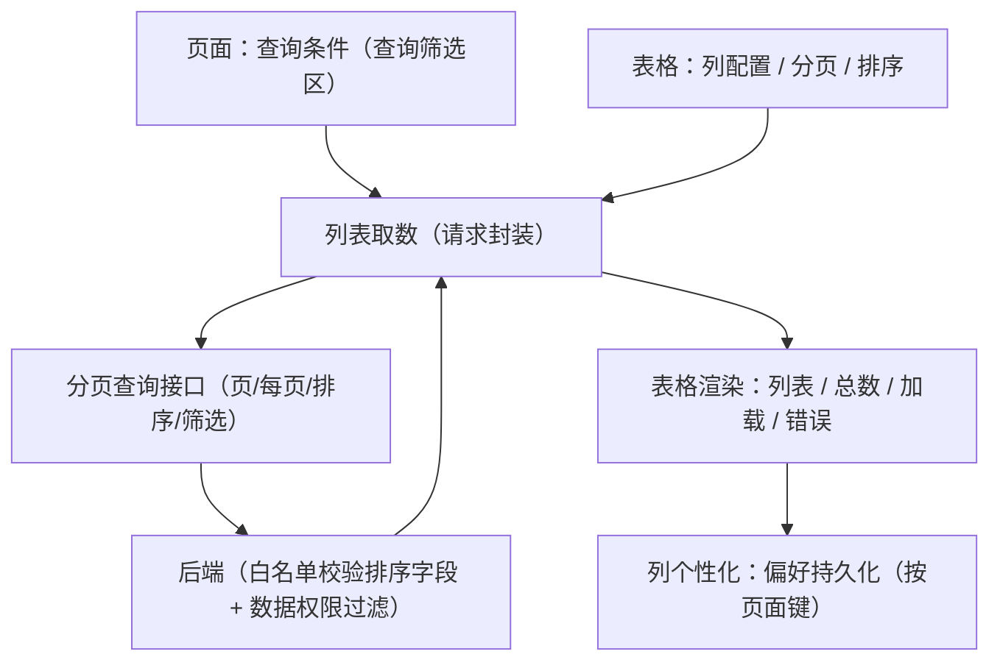

# 组件设计 · 通用表格

> 声明式列配置的数据表格：取数与分页排序 / 多选与展开 / 树形 / 行内编辑 / 列个性化持久化 / 工具栏与空·加载·错误态
> 实现侧命名与落点见《[前端基类清单](../../../../前端基类清单.md)》，实现契约细节见项目详细设计。

[文档首页](../../../../文档首页.md) › [项目规划说明](../../../../规划/项目规划说明.md) › [组件设计](../../01_组件设计_总览.md) › 通用表格　|　[← 开关与枚举字段](../../06_字段类/08_组件设计_开关与枚举字段/08_组件设计_开关与枚举字段.md)　[查询筛选区 →](../02_组件设计_查询筛选区/02_组件设计_查询筛选区.md)

> 可交互原型：[01_原型设计_通用表格.html](01_原型设计_通用表格.html)（演示基础列渲染、分页与多列排序、多选批量、树形表格、列设置与密度、行内编辑与空行）

## 1. 目的与适用范围 

定义 BMS 前端**通用表格**的组件设计：声明式列配置、数据取数与分页排序、多选与展开、树形表格、行内编辑、列个性化持久化、工具栏与空/加载/错误态。适用于管理端全部列表页（用户、角色、菜单、字典、公告、日志、任务等）、表单页的表格明细区，以及查询筛选区下方的数据展示。

本节对应[《项目规划说明》](../../../../规划/项目规划说明.md)前端与「前端页面清单与菜单机制」章节；页面形态依据[《布局设计 · 列表页》](../../../布局设计/07_布局设计_列表页.html)（工具栏 + 筛选 + 表格三段式、**无操作列**、双击行打开表单、状态标签语义色）、[《布局设计 · 表格明细》](../../../布局设计/09_布局设计_表格明细.html)（明细区列布局、工具栏、行内编辑、自动空行）、[《布局设计 · 表单框架》](../../../布局设计/06_布局设计_表单框架.html)（列表 Tab 与记录 Tab 交互协议）、[《布局设计 · 响应式适配》](../../../布局设计/11_布局设计_响应式适配.html)与[《布局设计 · 异常与空状态》](../../../布局设计/12_布局设计_异常与空状态.html)（空态、加载分级、失败兜底）；上游设计依据[《概要设计 · 用户喜好》](../../../概要设计/04_概要设计_用户喜好.md)（列表列个性化偏好）、[《概要设计 · 表单定制》](../../../概要设计/36_概要设计_表单定制.md)（明细区列配置）、[《概要设计 · 导入导出》](../../../概要设计/19_概要设计_导入导出.md)（导出参数与列表一致）、[《概要设计 · 菜单管理》](../../../概要设计/07_概要设计_菜单管理.md)（字段与列可见性）；接口与性能依据[《架构设计 · 接口与集成》](../../../架构设计/09_架构设计_接口与集成.md)（统一响应、分页与排序）、[《架构设计 · 前端架构》](../../../架构设计/08_架构设计_前端架构.md)（列表页个性化、性能预算）与[《API接口规范》](../../../../规范/API接口规范.md)「参数与分页」节；协作节点为[请求封装](../../09_基础类/01_组件设计_请求封装/01_组件设计_请求封装.md)（列表取数与错误码）、[字典字段](../../06_字段类/01_组件设计_字典字段/01_组件设计_字典字段.md)（字典列批量翻译）、状态标签与描述列表（状态列标签）、[权限指令](../../09_基础类/02_组件设计_权限指令/02_组件设计_权限指令.md)（列级权限与脱敏）、[格式化工具](../../09_基础类/03_组件设计_格式化工具/03_组件设计_格式化工具.md)（列格式化口径）、导入导出（导出按钮）与[开关与枚举字段](../../06_字段类/08_组件设计_开关与枚举字段/08_组件设计_开关与枚举字段.md)（状态列内联切换）。

> 本篇为「通用表格」节点。**范围边界**：查询条件区归展示类「查询筛选区」；表格明细的**布局与事务**归[《布局设计 · 表格明细》](../../../布局设计/09_布局设计_表格明细.html)，本节点只提供其复用的表格能力；导出实现归[导入导出](../../08_交互类/01_组件设计_导入导出/01_组件设计_导入导出.md)，本节点只提供工具栏入口与参数口径；列配置与偏好持久化语义分别归[列配置能力](../../02_基础组件类/02_能力类/28_组件设计_列配置能力/28_组件设计_列配置能力.md)与[偏好持久化能力](../../02_基础组件类/02_能力类/16_组件设计_偏好持久化能力/16_组件设计_偏好持久化能力.md)。

## 2. 职责与组成 

| 组成部分 | 职责 |
| --- | --- |
| 表格容器件 | 列渲染、数据、分页、选择、展开、树形、行内编辑、空/加载/错误态，内置分页区与工具栏位 |
| 工具栏件 | 图标按钮（刷新/密度/列设置/全屏/自动列宽/导出）与自定义插槽；仅编辑态按钮由调用方控制 |
| 列设置抽屉 | 列显隐、拖动排序、列宽重置、恢复默认（对齐[《布局设计 · 列表页》](../../../布局设计/07_布局设计_列表页.html)「自定义列」抽屉） |
| 列配置解析（列配置能力） | 声明式列与表单元数据合并、内置渲染器（字典列/标签列/脱敏列/格式化列）优先级、可见列计算 |
| 排序状态 | 多列排序状态：表头点击与 Shift 叠加、优先级序号、排序参数序列化（随组件内聚） |
| 偏好读写（偏好持久化能力） | 列个性化读写：按页面的列表偏好（列显隐/顺序/宽度、每页条数、密度）、防抖保存、本地回退、恢复默认 |

- 命名遵循[《命名规范》](../../../../规范/命名规范.md)；实现侧命名与落点见《[前端基类清单](../../../../前端基类清单.md)》。
- 移动端不复用本组件（卡片/列表形态，见第 12 节）。

## 3. 列配置语义 

| 列要素 | 语义 |
| --- | --- |
| 字段 | 与后端字段同名；命名映射（驼峰 ↔ 下划线）在数据类型层完成 |
| 列头文案 | 元数据驱动时为 i18n key（见第 12 节） |
| 宽度 | 固定列宽；虚拟表格模式必填 |
| 最小宽度 | 自适应基准（未指定固定宽时） |
| 固定 | 左 / 右固定 |
| 排序 | 参与后端排序（可指定后端排序字段名，缺省取字段名） |
| 对齐 | 左 / 居中 / 右 |
| 溢出省略 | 溢出省略 + 悬浮全文 |
| 格式化 | 纯展示列格式化（复用[格式化工具](../../09_基础类/03_组件设计_格式化工具/03_组件设计_格式化工具.md)） |
| 字典翻译 | 字典列走[字典字段](../../06_字段类/01_组件设计_字典字段/01_组件设计_字典字段.md)批量翻译 |
| 状态标签 | 状态列由[状态标签与描述列表](../03_组件设计_状态标签与描述列表/03_组件设计_状态标签与描述列表.md)渲染（语义色三层取色与形态见该节点） |
| 脱敏 | 脱敏列（配合动作权限查看明文） |
| 默认可见 | 默认是否显示（用户可改） |
| 行内可编辑 | 行内编辑模式下可编辑 |
| 控件插槽 | 具名插槽（复杂单元格） |
| 本地排序 | 仅当数据已全量在前端时使用 |

渲染优先级（同一列自上而下命中即用）：**具名插槽** → 字典翻译 → 状态标签 → 脱敏 → 格式化 → 原值（空值统一 `—`）。

- **列来源**：① 页面声明式传入（默认）；② 表单元数据生成（[《概要设计 · 表单定制》](../../../概要设计/36_概要设计_表单定制.md)明细区列配置 → 字段清单映射为列，含列头/宽度/固定/可见性）；两者按字段合并，元数据提供默认值、页面声明可覆盖。
- **列宽**：显式宽度优先；未指定时按最小宽度自适应（超出容器横向滚动）；「自动列宽」按表头与当前页内容宽度测算后写回列宽；用户拖拽列宽优先于二者（见第 9 节持久化）。
- **列渲染器**：字典列**批量翻译**（一列一次翻译，禁止逐行请求，见[字典字段](../../06_字段类/01_组件设计_字典字段/01_组件设计_字典字段.md)）；状态列可选内联切换（复用[开关与枚举字段](../../06_字段类/08_组件设计_开关与枚举字段/08_组件设计_开关与枚举字段.md)的内联开关语义）；金额/日期列统一走[格式化工具](../../09_基础类/03_组件设计_格式化工具/03_组件设计_格式化工具.md)。

## 4. 数据流与取数 

| 项 | 设计 |
| --- | --- |
| 取数归属 | 页面经列表取数（[请求封装](../../09_基础类/01_组件设计_请求封装/01_组件设计_请求封装.md)）持有查询条件/列表/总数/加载/错误；表格只负责渲染与交互回传，**不自行发请求**（表格明细区可由页面传入数据源或分页接口） |
| 查询变化 | 筛选条件变化回第 1 页；分页/排序变化保留筛选条件（[《布局设计 · 列表页》](../../../布局设计/07_布局设计_列表页.html)交互约定） |
| 行数据持有 | 列表数据由页面组件持有，不入全局状态（[《前端开发规范》](../../../../规范/前端开发规范.md)状态管理约定） |
| 局部更新 | 行内状态变更/删除成功后**局部更新该行或重新拉取当前页**，不整表重建 |

## 5. 分页与多列排序 

### 5.1 分页 

| 项 | 设计 |
| --- | --- |
| 参数 | 页码（从 1 起）/ 每页条数；响应含列表与总数（[《API接口规范》](../../../../规范/API接口规范.md)「参数与分页」节） |
| 每页条数 | 默认 **20**，可选 10/20/50/100，**上限 200**；选择结果写入用户偏好（第 9 节） |
| 表单页明细区 | 默认 **10 条/页**（≤ 10 行不分页），与[《布局设计 · 表格明细》](../../../布局设计/09_布局设计_表格明细.html)一致 |
| 区布局 | 「总数, 选择页码, 跳页, 每页条数, 页码」靠右，与表格工具栏（靠左）同处表格下方一行 |
| 游标分页 | 日志/审计类超长列表用游标/条数分页（无总页数）：表格隐藏页码、显示「加载更多」或无限滚动，排序仅支持后端默认序 |
| 数据量保护 | 单页请求条数 ≤ 200；全量数据不落地前端（导出走[导入导出](../../08_交互类/01_组件设计_导入导出/01_组件设计_导入导出.md)流式/分批） |

### 5.2 多列排序 

- **交互**：点击表头切换单列排序（升/降/取消）；**Shift + 点击**叠加多列，表头显示优先级序号（1/2/3），最多 **3 列**；表头悬浮提示当前排序组合。
- **参数序列化**（排序状态随表格组件内聚）：单列为「排序字段 + 方向」；多列以逗号分隔字段列表、方向数组与位置一一对应，缺省降序；排序字段缺省取列字段名。
- **白名单**：后端按字段白名单校验，**不在白名单的字段忽略该排序项**（不报错、不拼接 SQL）；前端仅在可排序列开启排序入口，双层防注入。
- **不持久化排序**：排序属会话态（不进用户偏好），页面可指定初始排序；数据在前端全量时可用本地比较做排序（不提交后端）。

## 6. 选择、展开与行交互 

| 项 | 设计 |
| --- | --- |
| 多选列 | 有批量操作时才出现，窄列；行点击**不**默认勾选（需点复选框）；选中集跨页保留策略由页面声明（默认**不跨页保留**） |
| 批量操作 | 工具栏或操作区按钮随选中态启用/禁用（[《布局设计 · 列表页》](../../../布局设计/07_布局设计_列表页.html)检查清单）；批量删除二次确认 |
| 双击行 | 双击行打开表单 Tab（列表页**无操作列**，见[《布局设计 · 表单框架》](../../../布局设计/06_布局设计_表单框架.html)）；可编辑单元格避免误触 |
| 展开行 | 展开行承载只读表格明细（最近 N 条、不分页、不承载增删），见[《布局设计 · 表格明细》](../../../布局设计/09_布局设计_表格明细.html)；展开内容用插槽 |
| 行内切换 | 状态列可选内联开关（行级加载、失败回滚、局部刷新，见[开关与枚举字段](../../06_字段类/08_组件设计_开关与枚举字段/08_组件设计_开关与枚举字段.md)） |
| 行交互 | 悬停高亮；行高按密度（宽松 / 紧凑）；斑马纹与边框由主题令牌统一（不逐页配置） |

## 7. 树形模式 

| 项 | 设计 |
| --- | --- |
| 场景 | 部门管理、菜单管理、字典分类等树形数据（[《概要设计 · 部门管理》](../../../概要设计/08_概要设计_部门管理.md)、[《概要设计 · 菜单管理》](../../../概要设计/07_概要设计_菜单管理.md)） |
| 配置 | 行键、子节点字段、默认展开、缩进（配置语义，随表格能力） |
| 分页 | 树形数据**不分页**（树量级小，一次返回；对齐概设「树形返回不分页」约定） |
| 层级约束 | 层级深度与子节点数由业务侧约束（如部门树最大深度 10、单节点子部门 ≤ 500），前端只展示不校验 |
| 行交互 | 展开/收起由首列缩进箭头承担；树形模式下同样支持多选与双击行 |
| 限制 | 树形模式**不与**虚拟表格模式叠加 |

## 8. 行内编辑模式（供表格明细复用） 

| 项 | 设计 |
| --- | --- |
| 开关 | 编辑态开关（表单页编辑态开启、只读态关闭）；可整表或按列控制 |
| 编辑方式 | 单元格内直接渲染字段组件（文本/数字/日期/字典/开关等，复用字段类节点），未保存修改随整体保存提交 |
| 自动空行 | 编辑态表格末行**自动追加一行空明细**供录入；只读态不显示（[《布局设计 · 表格明细》](../../../布局设计/09_布局设计_表格明细.html)工具栏节） |
| 空行过滤 | 保存前由调用方过滤未录入任何数据的行 |
| 校验 | 调用方可触发校验（基于[格式化工具](../../09_基础类/03_组件设计_格式化工具/03_组件设计_格式化工具.md)的规则）；错误内联展示，校验不通过阻止提交 |
| 行操作 | 新增行/删除行/上移/下移由调用方触发；删除二次确认 |
| 保存归属 | **事务与整体保存归调用方**（表单页/表格明细）：主表 + 明细单事务、乐观锁版本、失败整体回滚 |
| 性能 | 单元格编辑只触发该行重渲染，不整表重渲染 |

## 9. 列个性化与持久化 

按**页面维度**（页面键，如 `user_form`）存用户列表偏好 `list.{form_key}`（[《概要设计 · 用户喜好》](../../../概要设计/04_概要设计_用户喜好.md)），PC 多设备与移动端读同一份偏好；接口 `GET /preferences/{key}`、`PUT /preferences/{key}`、`DELETE /preferences/{key}`（恢复默认），批量保存走批量接口。

偏好内容（展示层字段，不含数据）：列显隐/顺序/宽度、每页条数、密度。

| 项 | 设计 |
| --- | --- |
| 应用时机 | 渲染前合并：列定义（元数据/声明式）→ 偏好覆盖（显隐/顺序/宽度）→ 计算可见列 |
| 保存时机 | 列设置/密度/每页条数变更后**防抖 500ms** 保存；列宽拖拽结束后保存 |
| 恢复默认 | 「恢复默认」调恢复接口并清本地副本（对齐[《布局设计 · 列表页》](../../../布局设计/07_布局设计_列表页.html)「自定义列」抽屉） |
| 本地回退 | 偏好接口失败/未登录态用本地副本快速回退；登录拉取后以服务端为准覆盖 |
| 约束 | 单键 ≤ 64KB（[《概要设计 · 用户喜好》](../../../概要设计/04_概要设计_用户喜好.md)上限）：列数量异常时裁剪并告警；仅保存**展示层**字段，不含数据 |
| 不受偏好影响 | 排序列、页码、展开状态、选中行（会话态，不持久化） |

## 10. 工具栏与状态视图 

### 10.1 工具栏 

| 按钮 | 说明 |
| --- | --- |
| 刷新 | 重新加载当前页（保留筛选、排序与分页） |
| 密度 | 宽松 / 紧凑切换，写入偏好（第 9 节） |
| 列设置 | 打开列设置抽屉（显隐、拖动排序、列宽重置、恢复默认） |
| 全屏 | 表格区域全屏查看（Esc 退出；不影响筛选区） |
| 自动列宽 | 按表头与当前页内容测算列宽并写回（用户拖拽过的列不覆盖） |
| 导出 | 委托[导入导出](../../08_交互类/01_组件设计_导入导出/01_组件设计_导入导出.md)；**导出参数与列表当前筛选/排序一致**（含多列排序），受导出业务权限约束 |
| 自定义 | 新增行/删除行/上移/下移（仅编辑态，由调用方经插槽注入） |

- 按钮一律**图标 + 悬浮提示**（文案走 i18n，对齐[《布局设计 · 表格明细》](../../../布局设计/09_布局设计_表格明细.html)工具栏约定）；无权限的按钮不渲染（[权限指令](../../09_基础类/02_组件设计_权限指令/02_组件设计_权限指令.md)）。

### 10.2 空/加载/错误态 

| 状态 | 设计 |
| --- | --- |
| 首次加载（第 1 页首次请求） | **骨架屏**（与列结构一致的占位行） |
| 后续加载/刷新 | 内容区遮罩加载（不整页闪烁，[《布局设计 · 异常与空状态》](../../../布局设计/12_布局设计_异常与空状态.html)加载分级） |
| 列表无数据 | 空插画 + 「暂无数据」；有权限时给「去创建」主按钮（插槽可覆盖） |
| 搜索无结果 | 「未找到相关内容」+ 「清除筛选/重置」（由[查询筛选区](../02_组件设计_查询筛选区/02_组件设计_查询筛选区.md)提供重置入口） |
| 加载失败 | 表格区内联错误态（文案取错误码 i18n）+ **重试**按钮（复用列表取数重试） |
| 无权限 | 403 由请求层跳 403 页（[请求封装](../../09_基础类/01_组件设计_请求封装/01_组件设计_请求封装.md)），表格不自行处理 |

## 11. 依赖接口与上游变更 

### 11.1 上游接口与口径 

| 项 | 说明 | 目标文档 |
| --- | --- | --- |
| 分页与排序参数 | 页码/每页条数（默认 20、上限 200）、多值排序字段（逗号分隔）、方向数组、游标分页 | [《API接口规范》](../../../../规范/API接口规范.md)、[《架构设计 · 接口与集成》](../../../架构设计/09_架构设计_接口与集成.md)（登记项①） |
| 列个性化偏好 | `list.{form_key}` 存列显隐/顺序/宽度 + 每页条数 + 密度；偏好读写接口 | [《概要设计 · 用户喜好》](../../../概要设计/04_概要设计_用户喜好.md)（登记项②） |
| 明细区列配置 | 表单定制的明细区列配置需能生成表列（字段 → 列映射） | [《概要设计 · 表单定制》](../../../概要设计/36_概要设计_表单定制.md)（登记项③） |
| 导出参数 | 导出参数与列表筛选/排序一致（含多列排序） | [《概要设计 · 导入导出》](../../../概要设计/19_概要设计_导入导出.md)（登记项④） |
| 列可见性 | 字段不可见的列不参与渲染（后端默认不返回该字段）；可编辑列受行内编辑约束 | [《概要设计 · 菜单管理》](../../../概要设计/07_概要设计_菜单管理.md)、[权限指令](../../09_基础类/02_组件设计_权限指令/02_组件设计_权限指令.md) |
| 字典列翻译 | 列字典值批量翻译（一列一次请求） | [《概要设计 · 字典管理》](../../../概要设计/09_概要设计_字典管理.md)、[字典字段](../../06_字段类/01_组件设计_字典字段/01_组件设计_字典字段.md) |
| 树形数据 | 部门/菜单树一次性返回（不分页） | [《概要设计 · 部门管理》](../../../概要设计/08_概要设计_部门管理.md)、[《概要设计 · 菜单管理》](../../../概要设计/07_概要设计_菜单管理.md) |
| 错误码提示 | 加载失败、批量操作失败复用错误码 → i18n 文案 | [请求封装](../../09_基础类/01_组件设计_请求封装/01_组件设计_请求封装.md) |
| 新增依赖 | **无**：复用既有表格/分页/抽屉等基础件 | — |

### 11.2 需登记的上游变更 

| 变更点 | 目标文档 | 内容 |
| --- | --- | --- |
| ① 多列排序参数 | [《架构设计 · 接口与集成》](../../../架构设计/09_架构设计_接口与集成.md)「接口规范」节；[《API接口规范》](../../../../规范/API接口规范.md)「参数与分页」节 | 排序字段支持**多值**（逗号分隔）与方向数组（位置一一对应，缺省降序）；排序字段白名单按单个字段校验，非法字段忽略该项；各业务查询接口同步该口径 |
| ② 列表偏好结构 | [《概要设计 · 用户喜好》](../../../概要设计/04_概要设计_用户喜好.md)功能点与数据模型节 | 明确偏好值结构：列（字段/可见/顺序/宽度）、每页条数、密度；沿用单键 ≤ 64KB 上限与偏好键白名单校验 |
| ③ 明细区列配置生成表列 | [《概要设计 · 表单定制》](../../../概要设计/36_概要设计_表单定制.md)布局定制节 | 明细区列配置需给出字段 → 表列映射（字段/列头/宽度/固定/默认可见性），与[本节点列配置语义](#columns)对齐 |
| ④ 导出参数含排序 | [《概要设计 · 导入导出》](../../../概要设计/19_概要设计_导入导出.md)业务规则节 | 导出参数与列表查询一致，含多列排序；导出列顺序遵循导出模板而非页面列偏好 |

> 按[《文档生成规范》](../../../../规范/文档生成规范.md)「引用与追溯」节，上述变更需用户确认后由上游文档同步；本节点只定义表格语义与契约，不单独裁决接口参数。

## 12. 字段权限 / i18n / 脱敏 / 移动端 

- **字段权限**：字段不可见的列不渲染（后端读时过滤字段，前端不感知）；行内编辑列受可编辑约束；列级权限与表单页字段权限同源（[权限指令](../../09_基础类/02_组件设计_权限指令/02_组件设计_权限指令.md)）。
- **i18n**：列头文案支持 i18n key（元数据驱动时按 locale 下发）；工具栏提示、密度/分页文案、空态与错误态文案走全局语言能力；**列名与数据不翻译用户输入**。
- **脱敏**：脱敏列默认掩码展示（[格式化工具](../../09_基础类/03_组件设计_格式化工具/03_组件设计_格式化工具.md)）；持查看明文动作权限时该列渲染明文切换入口（[权限指令](../../09_基础类/02_组件设计_权限指令/02_组件设计_权限指令.md)）。
- **移动端**：移动端不用表格（卡片/列表形态，触底加载），不提供列显隐/顺序；**分页与排序参数口径同源**（页码/每页条数、多列排序），每页条数沿用同一份偏好（跨端同步）。

## 13. 性能与边界 

| 场景 | 设计 |
| --- | --- |
| 单页数据量 | 默认 20 条，上限 200 条；超长列表（审计/日志）用游标分页 + 虚拟表格（阈值 **200 行**，显式开启） |
| 虚拟表格限制 | 虚拟模式下列宽必须显式声明（建议 ≥ 100px），不支持树形/展开行/行内编辑；固定列与自动列宽不适用 |
| 千行列表 | 非虚拟模式下用分页控制行数；字典列批量翻译（一列一次请求）、格式化函数纯函数且缓存区域/语言格式化器 |
| 列数 | 建议 ≤ 20 列（超出走列设置裁剪与横向滚动）；列配置计算仅依赖元数据与偏好，无网络开销 |
| 行内编辑 | 行级更新、单元格编辑不整表重渲染；校验只针对已渲染行 |
| 偏好写入 | 防抖 500ms 合并写；失败静默回退本地副本（不阻塞交互） |
| 边界 | 空数据、单页仅 1 条、最后一页被删空后回退上一页、多列排序字段非法、列宽拖拽到极限、树形层级过深（滚动）、编辑态空行未录入、偏好超 64KB 裁剪、游标分页与排序冲突（禁用排序入口） |
| 不支持 | 表格内拖拽行排序（明细行上下移由按钮承载）、列冻结任意位置（仅左右固定）、单元格合并（复杂报表走[图表卡](../04_组件设计_图表卡/04_组件设计_图表卡.md)等报表节点）、前端全量排序大数据集 |

## 14. 检查清单 

- □ 列配置声明式与表单元数据生成两条来源，按字段合并，渲染优先级正确（插槽 > 字典 > 标签 > 脱敏 > 格式化 > 原值）
- □ 取数走列表取数（[请求封装](../../09_基础类/01_组件设计_请求封装/01_组件设计_请求封装.md)）；筛选变化回第 1 页、分页/排序保留筛选；行数据不入全局状态
- □ 分页：默认 20、可选 10/20/50/100、上限 200；明细区默认 10/页；日志类支持游标分页
- □ 多列排序：表头点击 + Shift 叠加（≤ 3 列，含优先级序号）；字段与方向一一对应；后端白名单双层防注入；排序不持久化
- □ 多选列按需（行点击不勾选）；双击行打开表单；展开行承载只读明细；状态列可内联切换（[开关与枚举字段](../../06_字段类/08_组件设计_开关与枚举字段/08_组件设计_开关与枚举字段.md)）
- □ 树形模式（行键 + 子节点字段、不分页）与虚拟模式互斥
- □ 行内编辑：编辑态开关、编辑态末行自动空行、空行过滤、校验阻止提交；事务与整体保存归调用方
- □ 列个性化存 `list.{form_key}`（列显隐/顺序/宽度 + 每页条数 + 密度），防抖保存、本地回退、恢复默认；单键 ≤ 64KB
- □ 工具栏按钮（刷新/密度/列设置/全屏/自动列宽/导出）图标 + 提示；导出参数与列表筛选/排序一致且受导出权限约束
- □ 状态视图：首屏骨架屏、后续遮罩加载、空态与搜索无结果文案、失败内联错误 + 重试
- □ 字段权限（列可见性/行内编辑）、i18n（列头 key/工具栏/空态）、脱敏（掩码 + 明文权限）、移动端（卡片形态 + 参数同源）符合第 12 节
- □ 四项上游登记已确认：多列排序参数、列表偏好结构、明细区列配置生成表列、导出参数含排序

> 组件设计节点 · 与[《布局设计 · 列表页》](../../../布局设计/07_布局设计_列表页.html)[《布局设计 · 表格明细》](../../../布局设计/09_布局设计_表格明细.html)[《概要设计 · 用户喜好》](../../../概要设计/04_概要设计_用户喜好.md)[《概要设计 · 表单定制》](../../../概要设计/36_概要设计_表单定制.md)[《概要设计 · 导入导出》](../../../概要设计/19_概要设计_导入导出.md)[《架构设计 · 接口与集成》](../../../架构设计/09_架构设计_接口与集成.md)[《API接口规范》](../../../../规范/API接口规范.md)[请求封装](../../09_基础类/01_组件设计_请求封装/01_组件设计_请求封装.md)[《命名规范》](../../../../规范/命名规范.md)配套
