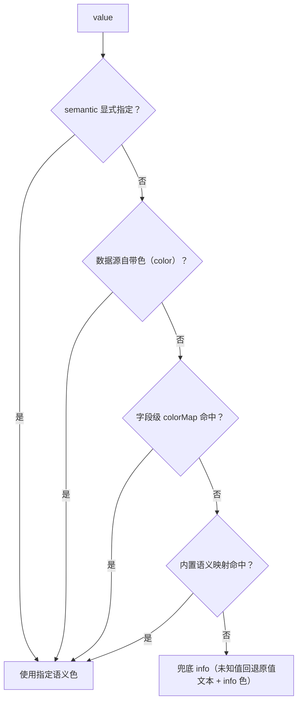

# 组件设计 · 状态标签与描述列表

> 只读状态与只读字段展示：状态标签形态与语义色取色优先级 / 描述列表容器与描述项渲染（各类型只读回显、长文本折叠、空值占位）
> 实现侧命名与落点见《[前端基类清单](../../../../前端基类清单.md)》，实现契约细节见项目详细设计。

[文档首页](../../../../文档首页.md) › [项目规划说明](../../../../规划/项目规划说明.md) › [组件设计](../../01_组件设计_总览.md) › 状态标签与描述列表　|　[← 查询筛选区](../02_组件设计_查询筛选区/02_组件设计_查询筛选区.md)　[图表卡 →](../04_组件设计_图表卡/04_组件设计_图表卡.md)

> 可交互原型：[12_原型设计_状态标签与描述列表.html](03_原型设计_状态标签与描述列表.html)（演示标签形态、取色三层优先级、描述列表基础与复杂值渲染、场景集成）

## 1. 目的与适用范围 

定义 BMS 前端 **状态标签与描述列表**的组件设计：状态标签件（语义色胶囊/点状，含取色优先级）、描述列表容器件与描述项渲染器，以及语义色映射（三层优先级解析）。适用于管理端所有**只读状态呈现**（列表状态列、详情、审批状态）与**非表单场景的只读字段展示**（弹窗/抽屉详情、列表展开行、公告与帮助查看的元信息、工作台卡片、移动端卡片）。

本节对应[《项目规划说明》](../../../../规划/项目规划说明.md)前端章节；视觉依据[《布局设计 · 设计令牌》](../../../布局设计/02_布局设计_设计令牌.html)（语义色固定：`--color-success` / `--color-warning` / `--color-danger` / `--color-info`，审批状态色全局统一、禁硬编码色值）与[《布局设计 · 表格明细》](../../../布局设计/09_布局设计_表格明细.html)「表格布局约定」节（状态用 tag 语义色）；场景依据[《布局设计 · 列表页》](../../../布局设计/07_布局设计_列表页.html)（状态列、双击行打开表单）、[《布局设计 · 弹窗》](../../../布局设计/10_布局设计_弹窗.html)（抽屉/对话框详情）、[《布局设计 · 异常与空状态》](../../../布局设计/12_布局设计_异常与空状态.html)（空值占位口径）、[《布局设计 · 响应式适配》](../../../布局设计/11_布局设计_响应式适配.html)（断点与列数）；上游设计依据[《概要设计 · 字典管理》](../../../概要设计/09_概要设计_字典管理.md)（字典条目与运行时下发）、[《概要设计 · 表单定制》](../../../概要设计/36_概要设计_表单定制.md)（详情字段清单与字段属性）、[《概要设计 · 菜单管理》](../../../概要设计/07_概要设计_菜单管理.md)（`sys_field`/`sys_role_field`）；协作节点为[开关与枚举字段](../../06_字段类/08_组件设计_开关与枚举字段/08_组件设计_开关与枚举字段.md)（枚举值与颜色标签）、[通用表格](../01_组件设计_通用表格/01_组件设计_通用表格.md)（标签列渲染器）、[字典字段](../../06_字段类/01_组件设计_字典字段/01_组件设计_字典字段.md)（字典 label 批量翻译）、[日期时间字段](../../06_字段类/02_组件设计_日期时间字段/02_组件设计_日期时间字段.md)/[数值与金额字段](../../06_字段类/03_组件设计_数值与金额字段/03_组件设计_数值与金额字段.md)/[树选择字段](../../06_字段类/04_组件设计_树选择字段/04_组件设计_树选择字段.md)/[组织选择字段](../../06_字段类/05_组件设计_组织选择字段/05_组件设计_组织选择字段.md)/[文件上传字段](../../06_字段类/06_组件设计_文件上传字段/06_组件设计_文件上传字段.md)/[富文本字段](../../06_字段类/07_组件设计_富文本字段/07_组件设计_富文本字段.md)（各类型只读回显）、[查询筛选区](../02_组件设计_查询筛选区/02_组件设计_查询筛选区.md)（条件摘要 chips）、[权限指令](../../09_基础类/02_组件设计_权限指令/02_组件设计_权限指令.md)（字段权限与脱敏查看明文）、[格式化工具](../../09_基础类/03_组件设计_格式化工具/03_组件设计_格式化工具.md)（值格式化口径）。

> 本篇为「状态标签与描述列表」节点。**范围边界**：**表单页内只读态**仍用 disabled 输入框三列栅格（[《布局设计 · 表单页》](../../../布局设计/08_布局设计_表单页.html)已定案，本节点**不重复实现**）；字典与枚举的**值翻译**归 [字典字段](../../06_字段类/01_组件设计_字典字段/01_组件设计_字典字段.md)/[开关与枚举字段](../../06_字段类/08_组件设计_开关与枚举字段/08_组件设计_开关与枚举字段.md)，本节点只负责「颜色 + 形态 + 只读排版」；富文本正文渲染归 [富文本字段](../../06_字段类/07_组件设计_富文本字段/07_组件设计_富文本字段.md)，本节点只取纯文本摘要；审批流的**流程与时间线**归 [审批流展示](../../08_交互类/02_组件设计_审批流展示/02_组件设计_审批流展示.md)，本节点提供其状态标签口径。

## 2. 职责与组成 

| 组成部分 | 职责 |
| --- | --- |
| 状态标签件 | 状态标签：胶囊/点状形态、语义色取色优先级、尺寸、可选图标、无文案时的 tooltip |
| 描述列表容器件 | 描述列表容器：1/2/3 列响应式、跨列、边框/无边框、分组小标题、密度 |
| 描述项渲染器 | 描述项：label + 值渲染分发（各类型只读回显）、长文本折叠、空值占位、脱敏与具名插槽 |
| 语义色映射 | 语义色映射：内置 `value → 语义色` 常量表、三层优先级解析、语义色 → 设计令牌变量名 |

- 移动端按需实现，按标签 + 单元格形态（见第 9 节）。

## 3. 状态标签 

### 3.1 状态值语义与形态 

| 语义项 | 说明 |
| --- | --- |
| 状态值 | 库值，取色与内置映射的输入 |
| 展示文案 | 缺省由调用方按字典/枚举口径翻译后传入 |
| 颜色映射 | 字段级 `value → 语义色` 映射（优先级 ②） |
| 数据源色 | 字典条目 `color` / 枚举选项色（优先级 ①） |
| 语义色指定 | 直接指定语义色（优先级最高，用于无数据源的临时状态） |
| 点状前缀 | 状态点 + 文案；无文案圆点场景见 3.3 |
| 图标前缀 | 图标 + 文案（走设计令牌尺寸） |
| 尺寸 | default / small（表格内用 small） |
| 浅色底 | 浅色底样式（缺省浅色底） |
| 悬浮提示 | 无文案圆点形态必填文案来源 |
| 点击事件 | 可选：点击标签触发联动（如按该状态筛选，由页面接入 [查询筛选区](../02_组件设计_查询筛选区/02_组件设计_查询筛选区.md)） |

### 3.2 取色优先级（三层 + 兜底） 

| 层 | 来源 | 说明 |
| --- | --- | --- |
| ① 数据源自带色 | 字典条目 `color`（登记项①）/ 枚举选项色（[开关与枚举字段](../../06_字段类/08_组件设计_开关与枚举字段/08_组件设计_开关与枚举字段.md)） | 由维护者在配置侧指定，最权威 |
| ② 字段级映射 | 字段属性 `colorMap`（登记项③） | 非字典自定义状态（如前端内置枚举）的配色入口 |
| ③ 内置语义映射 | 内置语义色常量表 | 覆盖平台通用状态（见 3.4），保证全局一致 |
| 兜底 | `info` | 未命中任何层时用 info 色并回退显示原值（开发环境告警一次） |

- **审批/流程状态色固定**：通过 = `success`、待审 = `warning`、驳回 = `danger`（对齐[《布局设计 · 设计令牌》](../../../布局设计/02_布局设计_设计令牌.html)），**不因模块改色**；如数据源配了冲突色，仍以「令牌语义优先」为原则在评审中纠正。

### 3.3 形态 

| 形态 | 说明 |
| --- | --- |
| 胶囊（默认） | 圆角胶囊 + 语义色；文案为状态 label |
| 点状 | 状态点（实心圆）+ 文案，用于审批流/依赖状态等「状态灯」场景 |
| 圆点（无文案） | 仅圆点（宽度 8px），悬浮提示为状态文案；列表紧凑列与工作台卡片用 |
| 图标 | 图标 + 文案（如 ✓ 已通过、✕ 已驳回），图标尺寸随字号 |
| 浅色底 | 浅色背景 + 语义色文字，用于大面积状态区（详情页头、卡片） |

- 颜色一律引用设计令牌 CSS 变量（`var(--color-success)` 等），**禁止硬编码色值**；不自定义圆角、内边距等非令牌样式。

### 3.4 内置语义映射（常量表） 

| 语义色 | 令牌 | 命中值（示例，含中英） |
| --- | --- | --- |
| `success` | `--color-success` | `enabled`、`normal`、`active`、`approved`、`passed`、`finished`、`启用`、`正常`、`已通过`、`已完成` |
| `warning` | `--color-warning` | `pending`、`auditing`、`processing`、`partial`、`待审`、`进行中`、`待处理`、`部分完成` |
| `danger` | `--color-danger` | `locked`、`rejected`、`failed`、`overdue`、`错误`、`锁定`、`驳回`、`失败`、`已逾期` |
| `info` | `--color-info` | `disabled`、`inactive`、`draft`、`canceled`、`stopped`、`停用`、`未开始`、`草稿`、`已取消` |
| `primary` | `--color-primary` | 不使用于业务状态（仅保留给「当前/主态」标记，如当前节点） |

- 常量表键为**小写归一后**的值（去首尾空格 + 转小写）；布尔值映射 `true→success`、`false→info`（与[开关与枚举字段](../../06_字段类/08_组件设计_开关与枚举字段/08_组件设计_开关与枚举字段.md)只读口径一致）。
- 表可扩展：新增平台通用状态时在内置映射常量表追加并同步[《布局设计 · 设计令牌》](../../../布局设计/02_布局设计_设计令牌.html)映射表（登记项②）。

## 4. 描述列表 

### 4.1 容器语义与响应式 

| 语义项 | 说明 |
| --- | --- |
| 描述项配置 | 描述项配置（与元数据按字段名合并，见第 7 节） |
| 数据源 | 单条记录对象 |
| 列数 | 1 / 2 / 3 / 自动；自动按断点：≥1536 → 3、1024-1535 → 2、<1024 → 1（对齐[《布局设计 · 响应式适配》](../../../布局设计/11_布局设计_响应式适配.html)） |
| 边框 | 是否带边框（弹窗/卡片内可关） |
| 密度 | default / small（展开行/卡片用紧凑） |
| label 位置 | 左 / 顶部（窄容器与移动端用顶部） |
| 标题与分组 | 标题与分组小标题（> 8 项时分段，与表单页分组口径一致） |
| 纯文本模式 | 全部值以纯文本渲染（不使用状态标签/链接等富形态） |

- **跨列**：长文本、富文本摘要、文件列表、备注等默认跨整行（跨度 = 列数）；由描述项配置或元数据 `crossColumn` 决定。

### 4.2 描述项配置语义 

描述项配置字段（契约级最小示意）：字段名、字段名文案（元数据按 locale 下发）、字段类型（决定值渲染器，缺省按数据类型推断）、字典类型、枚举选项集、状态色映射（`value → 语义色`）、脱敏标记、跨整行标记、指定列跨度（1..列数）、自定义空值占位（缺省 —）、具名插槽（自定义渲染）。

## 5. 描述项值渲染 

| 字段类型 | 渲染 | 说明 |
| --- | --- | --- |
| 文本 / 长文本 | 纯文本；> 120 字符**折叠 2 行** + 「展开 / 收起」 | 折叠态带全文悬浮提示；展开后行高自适应 |
| 数字 / 金额 / 百分比 | 数值/金额/百分比格式化（[格式化工具](../../09_基础类/03_组件设计_格式化工具/03_组件设计_格式化工具.md)） | 金额默认 2 位 + 币种符号 |
| 日期 / 日期时间 | 日期时间格式化（用户时区，系统信息区格式 `yyyy-MM-dd HH:mm`） | 空值 `—` |
| 字典（单选/多选） | 字典 label 批量翻译；多值顿号分隔 | 批量翻译（[字典字段](../../06_字段类/01_组件设计_字典字段/01_组件设计_字典字段.md)），不逐条请求 |
| 枚举 / 开关 | 枚举 label 翻译 / 是 否（[开关与枚举字段](../../06_字段类/08_组件设计_开关与枚举字段/08_组件设计_开关与枚举字段.md)） | 纯文本模式关闭时状态类字段默认以状态标签渲染 |
| 状态（带语义色） | 状态标签（紧凑尺寸），取色见第 3.2 节 | 详情页头/关键状态可用浅色底 |
| 组织 / 树选择 | 名称或完整路径（[树选择字段](../../06_字段类/04_组件设计_树选择字段/04_组件设计_树选择字段.md)/[组织选择字段](../../06_字段类/05_组件设计_组织选择字段/05_组件设计_组织选择字段.md) 回显口径） | 缺 label 回退 id |
| 文件 / 图片 | 数量 + 首个文件名（图片给缩略图；点击预览/下载） | 受 `file:download` 权限；失效文件显示「文件已失效」 |
| 富文本 | **纯文本摘要**（去标签，取前 120 字符） | 不渲染 HTML；完整正文用 [富文本字段](../../06_字段类/07_组件设计_富文本字段/07_组件设计_富文本字段.md) 渲染器 |
| 敏感字段（脱敏标记） | 默认脱敏展示；持 `data:plain` 显示明文切换 | 与 [权限指令](../../09_基础类/02_组件设计_权限指令/02_组件设计_权限指令.md) 口径一致 |
| 空值 | 统一 `—`（自定义占位可覆盖） | 空数组/空字符串/`null` 同等处理 |
| 自定义 | 具名插槽 | 插槽内仍复用本节点格式化与脱敏约定 |

## 6. 场景集成 

| 场景 | 形态 | 说明 |
| --- | --- | --- |
| 弹窗 / 抽屉详情 | 描述列表 1-2 列、边框可关、紧凑密度 | 宽度按[《布局设计 · 弹窗》](../../../布局设计/10_布局设计_弹窗.html)阶梯（640/720）；只读、无表单校验 |
| 列表展开行 | 描述列表 1-2 列紧凑 / 或状态标签单独使用 | 承载只读明细摘要（[《布局设计 · 表格明细》](../../../布局设计/09_布局设计_表格明细.html)展开行只读） |
| 列表状态列 | 状态标签（紧凑尺寸，纯文本模式不适用） | 由 [通用表格](../01_组件设计_通用表格/01_组件设计_通用表格.md) 标签列渲染器调用（登记项②：10 改为引用本节点） |
| 公告 / 帮助查看 | 元信息区描述列表 + 正文用 [富文本字段](../../06_字段类/07_组件设计_富文本字段/07_组件设计_富文本字段.md) 渲染 | 本节点只负责元信息（发布时间、作者、分类、状态） |
| 工作台卡片 | 描述列表 1 列紧凑 或 少量字段 + 状态标签圆点 | 卡片内字段数 ≤ 5，超出改用「查看详情」入口 |
| 移动端卡片 | 单元格形态（见第 9 节） | 与 PC 同源格式化与空值口径 |
| 表单页只读态 | **不使用本节点** | 表单页只读态用 disabled 输入框三列栅格（[《布局设计 · 表单页》](../../../布局设计/08_布局设计_表单页.html)），避免两套只读口径并存 |

## 7. 配置来源与字段权限 

| 项 | 设计 |
| --- | --- |
| 配置来源 | **元数据为主**：详情字段清单/顺序/跨列随表单元数据（[《概要设计 · 表单定制》](../../../概要设计/36_概要设计_表单定制.md)布局 + 字段权限）下发；页面可按字段名合并覆盖（弹窗/卡片等临时展示场景） |
| 字段权限 | `visible=false` 不渲染该描述项（后端读时过滤字段）；`editable=false` 对只读展示无影响 |
| 脱敏 | 敏感字段默认脱敏；持 `data:plain` 动作权限时提供「查看明文」切换（[权限指令](../../09_基础类/02_组件设计_权限指令/02_组件设计_权限指令.md)） |
| i18n | 描述项 label 由元数据按 locale 下发（`sys_field_i18n`）；空值占位、展开/收起、查看明文等界面文案走全局语言能力；**状态 label 由 02/09 口径翻译，不翻译用户输入** |
| 与表单页关系 | 同一字段在表单页只读态（disabled 输入框）与描述列表（本节点）**取值口径与格式化必须一致**（同一套格式化口径），仅排版不同 |

## 8. 依赖接口与上游变更 

### 8.1 上游接口与口径 

| 项 | 说明 | 目标文档 |
| --- | --- | --- |
| 语义色令牌 | `--color-success` / `--color-warning` / `--color-danger` / `--color-info` / `--color-primary`；禁硬编码色值 | [《布局设计 · 设计令牌》](../../../布局设计/02_布局设计_设计令牌.html)（登记项②） |
| 字典条目颜色 | 运行时接口下发条目 `color`（可选），供状态标签取色 | [《概要设计 · 字典管理》](../../../概要设计/09_概要设计_字典管理.md)（登记项①） |
| 字典 label 翻译 | 字典 label 翻译与列表批量翻译复用 [字典字段](../../06_字段类/01_组件设计_字典字段/01_组件设计_字典字段.md)缓存 | [《概要设计 · 字典管理》](../../../概要设计/09_概要设计_字典管理.md)、[字典字段](../../06_字段类/01_组件设计_字典字段/01_组件设计_字典字段.md) |
| 字段属性 | 字段级 `colorMap`（value→语义色）与只读展示形态（胶囊/点状/图标） | [《概要设计 · 表单定制》](../../../概要设计/36_概要设计_表单定制.md)（登记项③） |
| 字段清单与权限 | 详情字段清单/顺序/跨列与 `visible`/`editable` | [《概要设计 · 菜单管理》](../../../概要设计/07_概要设计_菜单管理.md) |
| 文件与富文本 | 文件列表与富文本摘要取值 | [文件上传字段](../../06_字段类/06_组件设计_文件上传字段/06_组件设计_文件上传字段.md)、[富文本字段](../../06_字段类/07_组件设计_富文本字段/07_组件设计_富文本字段.md) |
| 新增依赖 | **无**：复用既有标签/描述列表/提示等基础件 | — |

### 8.2 需登记的上游变更 

| 变更点 | 目标文档 | 内容 |
| --- | --- | --- |
| ① 字典条目增 `color` | [《概要设计 · 字典管理》](../../../概要设计/09_概要设计_字典管理.md)「核心表」「接口清单」「页面清单」节 | `sys_dict_item` 增 `color`（语义色枚举 `success/warning/danger/info/primary`，可空）；运行时接口 `GET /dicts/{type}`、`POST /dicts/batch` 条目字段增加 `color`（缓存条目结构同步，Redis 键不变）；字典条目维护页增加颜色配置项 |
| ② 设计令牌补状态语义色映射 | [《布局设计 · 设计令牌》](../../../布局设计/02_布局设计_设计令牌.html)「颜色令牌」节 | 补「状态语义色映射表」（内置 `value → 语义色` 命中值 + 三层优先级：数据源色 > 字段映射 > 内置）+ 点状/图标/圆点的使用口径；重申状态色不因模块改色 |
| ③ 字段属性支持状态色映射与只读形态 | [《概要设计 · 表单定制》](../../../概要设计/36_概要设计_表单定制.md)「字段属性调整」节 | 字段属性增「状态色映射（value→语义色，JSON）」与「只读展示形态（胶囊/点状/图标，默认胶囊）」，随字段元数据下发；用于非字典来源的自定义状态字段 |

> 按[《文档生成规范》](../../../../规范/文档生成规范.md)「引用与追溯」节，上述变更需用户确认后由上游文档同步；本节点只定义组件契约，不单独裁决数据结构。本节点交付后，[开关与枚举字段](../../06_字段类/08_组件设计_开关与枚举字段/08_组件设计_开关与枚举字段.md)「颜色标签（可选渲染）」与 [通用表格](../01_组件设计_通用表格/01_组件设计_通用表格.md)「标签列渲染器」改为**引用本节点**（本次已回写）。

## 9. 字段权限 / i18n / 移动端 

- **字段权限**：`visible=false` 的描述项不渲染；脱敏字段默认掩码，持 `data:plain` 权限可切换明文；状态标签不承载权限逻辑。
- **i18n**：状态 label、描述项 label 与界面文案均走 locale 下发或全局语言能力；语义色与形态不随语言变化。
- **移动端**：按需实现（同接口多实现 + 契约套件同一套断言）；状态用移动端标签（浅色/圆角对齐 PC 语义色）、描述项用单元格形态（label 左、值右）；长文本折叠与空值 `—` 口径同 PC；格式化复用同一套口径（同一时区与小数规则）。

## 10. 性能与边界 

| 场景 | 设计 |
| --- | --- |
| 大量标签 | 取色为常量表 O(1) 查找，千行列表内标签渲染无额外开销；同一状态值可缓存解析结果 |
| 描述列表 | 纯展示组件、无网络请求；字典 label 走 [字典字段](../../06_字段类/01_组件设计_字典字段/01_组件设计_字典字段.md)批量翻译与缓存；弹窗/抽屉内按打开时机渲染（关闭即销毁） |
| 长文本折叠 | 折叠态用行数限制样式，展开不重新请求；避免在长列表内渲染完整长文本 |
| 令牌应用 | 颜色只引用 CSS 变量（支持租户主题切换即时生效），不在样式逻辑中硬编码色值 |
| 边界 | 未知状态值（回退原值 + info 色 + 开发环境告警）、空值与空数组、超长文本、多值超长（省略 + 悬浮提示）、文件失效、脱敏切换、语义色缺失（兜底 info）、窄容器列数降级、移动端单列 |
| 不支持 | 状态图例/统计（走 [图表卡](../04_组件设计_图表卡/04_组件设计_图表卡.md)）、审批流时间线与节点图（[审批流展示](../../08_交互类/02_组件设计_审批流展示/02_组件设计_审批流展示.md)）、富文本正文渲染（[富文本字段](../../06_字段类/07_组件设计_富文本字段/07_组件设计_富文本字段.md)）、表单页只读态（布局设计已定案） |

## 11. 检查清单 

- □ 取色三层优先级正确（数据源色 > 字段级状态色映射 > 内置映射 > 兜底 info），审批状态色固定（通过=success、待审=warning、驳回=danger）
- □ 颜色一律引用设计令牌，无硬编码色值；语义色与令牌映射表一致
- □ 标签形态齐备（胶囊 / 点状 / 圆点 / 图标 / 浅色底），尺寸 default/small，无文案圆点有悬浮提示
- □ 描述列表：列数响应式（3/2/1）、跨列、边框可选、label 位置、分组标题、密度；纯文本模式时全部纯文本
- □ 描述项值渲染覆盖文本/长文本（2 行折叠）/数字金额/日期/字典/枚举开关/状态/组织树/文件/富文本摘要/脱敏/空值 `—`/自定义插槽
- □ 配置来源：元数据为主 + 页面配置覆盖；`visible=false` 不渲染；敏感字段默认脱敏且持查看明文动作权限可看明文
- □ 与表单页只读态分工清晰（表单页用 disabled 输入框，本节点用于非表单只读展示），同字段格式化口径一致
- □ 场景集成：弹窗/抽屉详情、列表展开行、状态列（通用表格引用）、公告帮助元信息、工作台卡片、移动端卡片
- □ 移动端（标签 + 单元格，口径同源）与性能边界（常量取色、批量翻译、行数限制折叠）符合第 9、10 节
- □ 三项上游登记已确认（字典条目 `color`、设计令牌状态色映射、字段属性状态色映射与只读形态），09/10 已回写为引用本节点

> 组件设计节点 · 与[《布局设计 · 设计令牌》](../../../布局设计/02_布局设计_设计令牌.html)[《布局设计 · 表格明细》](../../../布局设计/09_布局设计_表格明细.html)[《概要设计 · 字典管理》](../../../概要设计/09_概要设计_字典管理.md)[《概要设计 · 表单定制》](../../../概要设计/36_概要设计_表单定制.md)[开关与枚举字段](../../06_字段类/08_组件设计_开关与枚举字段/08_组件设计_开关与枚举字段.md)[通用表格](../01_组件设计_通用表格/01_组件设计_通用表格.md)[格式化工具](../../09_基础类/03_组件设计_格式化工具/03_组件设计_格式化工具.md)[《命名规范》](../../../../规范/命名规范.md)配套
