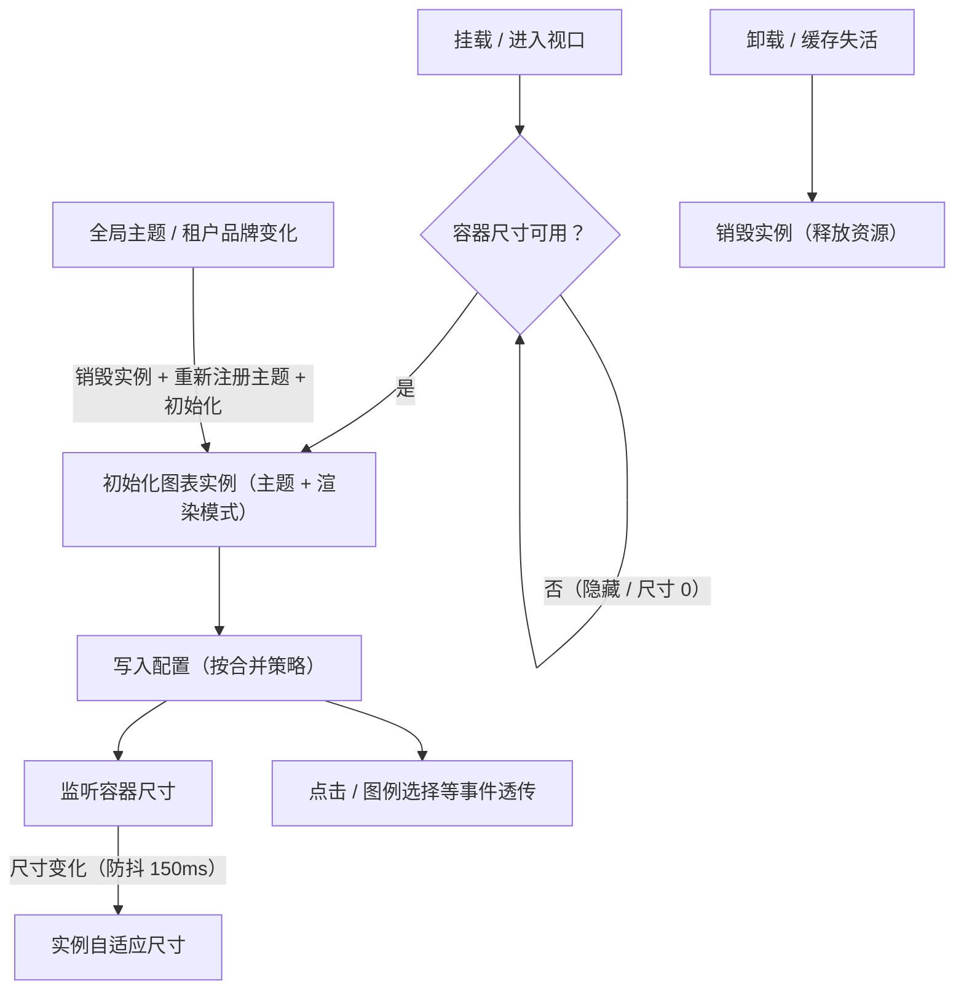
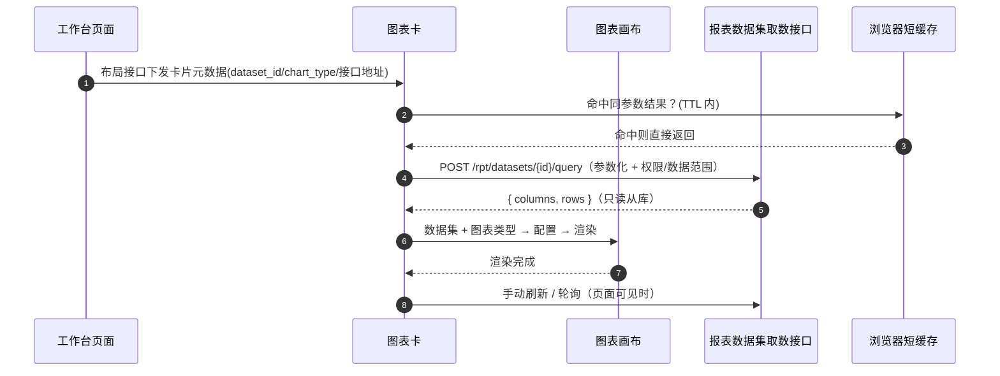

# 组件设计 · 图表卡

> 工作台图表卡与图表渲染：常用图表类型与地图 / 数据集取数与短缓存 / 卡头与数据表视图 / 令牌色板与深浅主题 / 自适应与降级态
> 实现侧命名与落点见《[前端基类清单](../../../../前端基类清单.md)》，实现契约细节见项目详细设计。

[文档首页](../../../../文档首页.md) › [项目规划说明](../../../../规划/项目规划说明.md) › [组件设计](../../01_组件设计_总览.md) › 图表卡　|　[← 状态标签与描述列表](../03_组件设计_状态标签与描述列表/03_组件设计_状态标签与描述列表.md)　[异常与空状态 →](../05_组件设计_异常与空状态/05_组件设计_异常与空状态.md)

> 可交互原型：[13_原型设计_图表卡.html](04_原型设计_图表卡.html)（演示常用图表类型、数据集 → 图表类型实时渲染、令牌色板与深浅主题、工作台卡片形态与空/加载/错误/降级态、容器 resize 自适应）

## 1. 目的与适用范围 

定义 BMS 前端 **图表渲染**的组件设计：基础图表封装（实例绑定、配置与数据类型、自适应尺寸、加载/空/错误态、主题）、工作台图表卡容器（卡头、数据集取数、刷新/下钻、空/加载/错误/降级态）、实例管理（实例生命周期、容器尺寸监听、主题切换）与图表主题（设计令牌 → 图表主题）。实例管理与主题消费由**图表组件基类**承担（能力域基类是继承链上的一类基类，主体内建沿继承轨派生；图表库独立分包），主题色板消费设计令牌能力。适用于**首页工作台数据集图表卡**（[《布局设计 · 首页工作台》](../../../布局设计/13_布局设计_首页工作台.html)）与**报表查看/移动端数据查询**的图表渲染（[《概要设计 · 报表中心》](../../../概要设计/27_概要设计_报表中心.md)）；图表渲染器向二者共用，卡片容器只服务工作台场景。

本节对应[《项目规划说明》](../../../../规划/项目规划说明.md)「功能模块」之**首页工作台**与**报表中心**模块、技术选型的图表库选型说明；视觉依据[《布局设计 · 设计令牌》](../../../布局设计/02_布局设计_设计令牌.html)（图表色板与语义色、禁硬编码色值）与[《布局设计 · 首页工作台》](../../../布局设计/13_布局设计_首页工作台.html)「卡片形态规范」节（图卡尺寸、图表必须含坐标轴/图例/数据集标注、空态插画、单卡异常降级）；异常口径依据[《布局设计 · 异常与空状态》](../../../布局设计/12_布局设计_异常与空状态.html)与[《布局设计 · 响应式适配》](../../../布局设计/11_布局设计_响应式适配.html)（断点与容器尺寸）；上游设计依据[《架构设计 · 前端架构》](../../../架构设计/08_架构设计_前端架构.md)「技术要点」节（图表渲染、按需引入与分包）、[《架构设计 · 首页工作台》](../../../架构设计/29_架构设计_子系统_首页工作台.md)「卡片注册机制」「前端渲染架构」节（通用图表卡、数据集卡、网格自适应）、[《架构设计 · 报表BI》](../../../架构设计/23_架构设计_子系统_报表BI.md)（数据集执行与图表类型）、[《概要设计 · 首页工作台》](../../../概要设计/35_概要设计_首页工作台.md)（`sys_dashboard_card` 的 `dataset_id`/`chart_type`、布局接口下发卡片元数据）、[《概要设计 · 报表中心》](../../../概要设计/27_概要设计_报表中心.md)（`rpt_dataset` 字段清单、数据集执行与安全校验）；协作节点为[请求封装](../../09_基础类/01_组件设计_请求封装/01_组件设计_请求封装.md)（并行取数与错误处理）、[格式化工具](../../09_基础类/03_组件设计_格式化工具/03_组件设计_格式化工具.md)（数值/日期轴与提示格式化）、[日期时间字段](../../06_字段类/02_组件设计_日期时间字段/02_组件设计_日期时间字段.md)（时间范围参数）、[状态标签与描述列表](../03_组件设计_状态标签与描述列表/03_组件设计_状态标签与描述列表.md)（数据表视图与状态语义色）、[通用表格](../01_组件设计_通用表格/01_组件设计_通用表格.md)（图表卡的数据表视图回退）、[权限指令](../../09_基础类/02_组件设计_权限指令/02_组件设计_权限指令.md)（`rpt:view` 口径）。

> 本篇为「图表卡」节点。**范围边界**：图表**设计态**（拖拽配置图表配置、数据集 SQL 建模、大屏自由画布）归[《概要设计 · 报表中心》](../../../概要设计/27_概要设计_报表中心.md)与报表设计器/大屏设计器页面，本节点**不做设计器**；数据聚合、SQL 与结果集口径归报表数据集；通用表格渲染归[通用表格](../01_组件设计_通用表格/01_组件设计_通用表格.md)；状态语义色与纯值格式化归[状态标签与描述列表](../03_组件设计_状态标签与描述列表/03_组件设计_状态标签与描述列表.md)/[格式化工具](../../09_基础类/03_组件设计_格式化工具/03_组件设计_格式化工具.md)，本节点只负责「图表渲染、卡片容器、取数编排、主题与自适应」。

## 2. 职责与组成 

| 组成部分 | 职责 |
| --- | --- |
| 基础图表件 | 基础图表封装：图表实例绑定、配置与数据类型、自适应尺寸、加载/空/错误态、事件透传（图表类型按需注册统一完成） |
| 图表卡件 | 工作台图表卡容器：卡头（标题/操作）、数据集取数、刷新/轮询、下钻事件、编辑态移除、空/加载/错误/降级态、数据表视图切换 |
| 实例管理（图表组件基类） | 实例生命周期、容器尺寸监听 + 防抖、主题/租户切换重建、视口懒渲染、导出图片、卸载释放 |
| 图表主题工具 | 主题工具：读取设计令牌变量生成图表主题、注册主题名、深层色板/坐标轴/提示/图例默认值、深色模式变体 |

- 移动端按需实现：工作台图表卡按[《布局设计 · 首页工作台》](../../../布局设计/13_布局设计_首页工作台.html)「移动端工作台」节显示摘要或省略，报表移动端「数据查询」同源图表类型/配置口径与令牌色板（见第 10 节）。

## 3. 基础图表封装 

### 3.1 配置与事件语义 

| 语义项 | 说明 |
| --- | --- |
| 完整图表配置 | 完整图表配置；与便捷图表类型二选一（同时给出时以完整配置为准，类型仅作兜底） |
| 便捷图表类型 | 见第 7 节；未给完整配置时按类型 + 数据集生成基础配置 |
| 数据集结果 | `{ columns, rows }`（字段声明来自报表数据集）；用于按类型生成或作为图表数据源 |
| 画布高度 | 数字按 px；工作台卡片内由容器高度决定，默认撑满 |
| 渲染模式 | 画布 / 矢量；工作台与报表默认画布（大数据量），低数量可矢量 |
| 主题 | 自动 / 浅色 / 深色；自动跟随全局主题（深浅）、租户品牌与令牌，见第 4 节 |
| 加载态 | 加载动画 |
| 空数据态 | 空数据态（显示空态插画 + 文案，不渲染坐标轴） |
| 错误态 | 错误文案 + 重试按钮；优先级高于空数据态 |
| 合并策略 | 更新配置时是否不与旧配置合并（切换图表类型时为不合并，防残留） |
| 自动自适应 | 是否自动监听容器尺寸变化（见 3.3） |
| 懒渲染 | 是否进入视口后才初始化渲染（工作台多卡场景，见第 12 节） |
| 事件透传 | 需要透传的图表事件（如点击、图例选择、缩放） |
| 工具箱 | 是否显示右上工具箱（保存图片/还原/数据视图） |
| 数据集标注 | 数据集名称 + 口径说明，渲染为图表脚注（[《布局设计 · 首页工作台》](../../../布局设计/13_布局设计_首页工作台.html)「图表必须含数据集标注」） |
| 事件 | 初始化完成、容器尺寸变化、错误态重试（由调用方重新取数）、数据点点击（下钻由图表卡转下钻事件） |

- **方法（供调用方使用）**：获取实例、写入配置、自适应尺寸、派发动作、导出图片、清空。
- 配置中的色板缺省即用主题色板；调用方**不应**在业务配置里写死色值（需要固定语义色时引用令牌变量，由图表主题工具提供取值口径）。

### 3.2 图表类型与构成映射 

图表类型与默认构成（类型 + 数据集 → 基础配置的生成依据）：

| 图表类型 | 构成 | 适用 / 默认构成 |
| --- | --- | --- |
| `line` | 折线（平滑可选） | 趋势；x 轴类目/时间、y 轴数值、轴提示 |
| `area` | 折线 + 面积 | 趋势与累计；默认单色渐变面积 |
| `bar` | 柱 | 分类对比；类目轴 x |
| `hbar` | 柱（y 类目） | 排名/长名称分类；横向条形 |
| `stacked_bar` | 柱 + 堆叠 | 结构占比；多序列堆叠 |
| `pie` | 饼 | 占比；默认标签含百分比 |
| `doughnut` | 饼 + 中空半径 | 占比（中空，可放汇总数） |
| `scatter` | 散点 | 相关性；双数值轴 |
| `funnel` | 漏斗 | 转化漏斗 |
| `radar` | 雷达 | 多维对比 |
| `gauge` | 仪表盘 | 单一指标达成率（统计卡） |
| `table` | 无（回退数据表） | 明细/宽表；渲染走[通用表格](../01_组件设计_通用表格/01_组件设计_通用表格.md)的只读数据表，不画裸图 |
| `map` | 地图 | 地域分布；**地理数据按需懒加载**，见第 7 节 |

- 支撑图表类型所需的基础组件（网格/提示/图例/工具箱/缩放/标注线、各系列构成、画布/矢量渲染器）由图表主题工具统一按需注册；**未使用的图表类型不注册**，保证分包体积。
- `table` 与其他图表可**同源切换**（图表卡卡头提供「图表 / 数据表」切换，复用同一份数据集）。

### 3.3 实例生命周期与自适应 

| 项 | 设计 |
| --- | --- |
| 初始化时机 | 容器可见且宽高均 > 0 时初始化；尺寸为 0（隐藏 Tab、未展开卡片、网格布局尚未完成）时延迟到首次可见（配合懒渲染 + 视口监听） |
| 自适应 | 组件内监听**画布容器**（不是 window）；防抖 150ms；网格拖拽/缩放**结束时**由容器尺寸变化自然触发，不逐帧刷新 |
| 主题切换 | 深浅模式/租户品牌切换 → 销毁后用新主题名重新初始化并写回配置（图表主题在实例创建时固化，不能热改） |
| 配置更新 | 默认增量合并；切换图表类型或字段结构变化时全量替换，避免旧系列残留 |
| 释放 | 组件卸载与缓存失活（工作台切换 Tab）时销毁实例；恢复后按需重建；避免离屏实例常驻内存 |
| 事件 | 统一注册/解绑；组件卸载时全部解绑，防内存泄漏 |

### 3.4 空 / 加载 / 错误态 

| 态 | 表现 | 说明 |
| --- | --- | --- |
| 加载 | 加载动画（或容器骨架块） | 首次加载与刷新共用；不阻塞卡头操作 |
| 空数据 | 空态插画 + 文案「暂无数据」 | 行数为 0 或无有效数值；**不渲染坐标轴与图例**（[《布局设计 · 首页工作台》](../../../布局设计/13_布局设计_首页工作台.html)「无数据时显示空态插画」） |
| 错误 | 错误文案 + 「重试」按钮 | 单卡降级，不阻塞整页；重试由调用方重新取数 |
| 数据集不可用 | 「数据集不可用」降级占位（无重试或仅提示） | 数据集已停用/删除（错误码 90001）；工作台允许编辑态移除该卡 |
| 无权限 | 「无权限查看」提示 | 数据取数被报表中心权限/数据范围拦截（`rpt:view` 缺失或数据范围为空） |

## 4. 主题与色板 

### 4.1 色板来源与令牌 

图表配色**统一来自设计令牌**，由图表主题工具在运行时读取 CSS 变量生成图表主题对象；**禁止在图表配置中硬编码色值**（对齐 [状态标签与描述列表](../03_组件设计_状态标签与描述列表/03_组件设计_状态标签与描述列表.md)「颜色一律引用设计令牌」）。色板结构（具体值在[《布局设计 · 设计令牌》](../../../布局设计/02_布局设计_设计令牌.html)「图表色板」节定义，本节点登记）：

| 序 | 令牌 | 基准值 | 说明 |
| --- | --- | --- | --- |
| 1 | `--chart-color-1` | `#0969da` | 主序列（对齐 `--color-primary`） |
| 2 | `--chart-color-2` | `#2da44e` | 第二序列（对齐 `--color-success`） |
| 3 | `--chart-color-3` | `#d4a72c` | 第三序列（对齐 `--color-warning`） |
| 4 | `--chart-color-4` | `#cf222e` | 第四序列（对齐 `--color-danger`） |
| 5 | `--chart-color-5` | `#57606a` | 第五序列（对齐 `--color-info`） |
| 6 | `--chart-color-6` | `#8250df` | 扩展序列（紫） |
| 7 | `--chart-color-7` | `#1b7c83` | 扩展序列（青） |
| 8 | `--chart-color-8` | `#bc4c00` | 扩展序列（橙） |

| 辅助令牌 | 取值 | 用途 |
| --- | --- | --- |
| `--chart-axis` | `--color-border` | 坐标轴线、刻度 |
| `--chart-grid` | `--color-border`（低透明度） | 网格线（仅数值轴） |
| `--chart-text` | `--color-text-secondary` | 坐标轴标签、图例文字 |
| `--chart-tooltip-bg` | `--color-bg-page` | 提示背景 |
| `--chart-tooltip-text` | `--color-text` | 提示文字 |

- **序列取色**：多序列按 `--chart-color-1..8` 顺序循环；**语义场景**（如达成率达标/预警、地域高低）显式映射到语义色（`--color-success` / `--color-warning` / `--color-danger`），与 [状态标签与描述列表](../03_组件设计_状态标签与描述列表/03_组件设计_状态标签与描述列表.md) 语义色口径一致，不因图表而自造色。
- **面积/饼图透明度、渐变**由主题按主色生成（不新增令牌）；深色模式下自动调整网格/文字对比度。

### 4.2 深浅模式与租户品牌 

| 项 | 设计 |
| --- | --- |
| 深浅模式 | 主题从全局主题机制/偏好读取（[《架构设计 · 前端架构》](../../../架构设计/08_架构设计_前端架构.md)主题机制）；切换时重新读取变量并重建实例 |
| 租户品牌 | 租户覆盖 `--color-primary` 等变量后，图表第 1 序列与强调色随之变化（[《布局设计 · 主题与租户品牌化》](../../../布局设计/03_布局设计_主题与租户品牌化.html)） |
| 主题名 | 注册浅色/深色两个图表主题；实例以主题名初始化 |
| 图标与标注 | 提示、图例、坐标轴默认值（字号、字体栈、轴指示、零值线）在主题中统一定义，业务配置不重复设置 |

## 5. 工作台图表卡 

### 5.1 配置与事件语义 

| 语义项 | 说明 |
| --- | --- |
| 卡片元数据 | `code`/`name`/`card_type`/`dataset_id`/`chart_type`/`default_width`/`default_height`，由布局接口下发（[《概要设计 · 首页工作台》](../../../概要设计/35_概要设计_首页工作台.md)） |
| 数据集查询参数 | 如时间范围 `*_start`/`*_end`、筛选条件，序列化口径对齐[查询筛选区](../02_组件设计_查询筛选区/02_组件设计_查询筛选区.md) |
| 卡片内容区高度 | 由网格卡片高度驱动 |
| 图表类型覆盖 | 卡内临时切换图表类型（不持久化；持久化需改卡片定义，走报表设计器） |
| 视图 | 图表 / 数据表（数据表视图走 [通用表格](../01_组件设计_通用表格/01_组件设计_通用表格.md)只读数据表） |
| 刷新与轮询 | 是否显示刷新按钮；轮询秒数（0 = 不轮询）；启用时受页面可见性约束（不可见暂停） |
| 编辑态 | 显示移除/拖拽手柄（由工作台编辑模式传入） |
| 查看详情 | 卡头跳转（报表查看/业务明细） |
| 数据集标注 | 数据集名 + 口径说明，缺省取卡片元数据的 `dataset_name` |
| 事件 | 刷新、数据点下钻（携带点击维度值，由工作台路由到明细/报表）、编辑态移除（仅前端布局变更，保存时提交）、卡内状态变化（loading/empty/error/unavailable/forbidden，供工作台统计） |
| 插槽 | 卡头自定义操作、空态、错误态、脚注（标注）、卡内参数区（如时间范围切换） |

### 5.2 卡片形态 

| 区域 | 内容 |
| --- | --- |
| 卡头 | 标题（卡片名，按 locale 下发）+ 右侧操作：视图切换（图表/数据表，可选）、刷新、查看详情、编辑态移除；标题字号与[《布局设计 · 首页工作台》](../../../布局设计/13_布局设计_首页工作台.html)「通用卡片头」一致 |
| 内容区 | 图表画布（撑满）；数据表视图时为只读数据表；空/加载/错误态占位 |
| 脚注 | 数据集标注与「最后更新时间」，字号 `small`；无标注时不渲染 |
| 尺寸 | 图卡默认 `6×4` / `12×4`（[《布局设计 · 首页工作台》](../../../布局设计/13_布局设计_首页工作台.html)「卡片尺寸规格」）；尺寸由网格容器决定，图表随容器 resize 自适应 |

- 图表**必须含坐标轴、图例与数据集标注**（饼/仪表盘等无坐标轴时不强制坐标轴，但需数值标注与口径说明），禁止只渲染裸图形。
- 卡头操作按钮按权限/场景显隐（查看详情受 `rpt:view` 与目标路由权限约束）。

### 5.3 数据集取数 

| 项 | 设计 |
| --- | --- |
| 取数归属 | 图表卡负责取数编排与状态机；图表画布只接收数据/配置，不发起请求（保持纯渲染） |
| 接口 | 数据集运行取数接口（见第 10 节登记项①）：参数化、只读从库、强制租户与数据范围过滤；请求走[请求封装](../../09_基础类/01_组件设计_请求封装/01_组件设计_请求封装.md) |
| 参数 | `params` 序列化与[查询筛选区](../02_组件设计_查询筛选区/02_组件设计_查询筛选区.md)一致（区间 `*_start`/`*_end`、多值逗号、布尔 `1/0`） |
| 并行与隔离 | 工作台多卡**并行拉取**（全部完成，单卡失败不影响其他卡）（[《架构设计 · 首页工作台》](../../../架构设计/29_架构设计_子系统_首页工作台.md)「数据拉取」节） |
| 短缓存 | 同卡同参数结果浏览器短缓存（如 30s，对齐统计卡口径），防高频刷新打库；手动刷新强制绕过 |
| 轮询 | 仅当轮询开启且页面可见；页面不可见时暂停 |
| 下钻 | 数据点点击 → 下钻事件携带维度值，由工作台路由到明细/报表（本节点不定义下钻目标） |
| 数据表视图 | 切换到数据表视图时用同一份数据集渲染只读数据表（[通用表格](../01_组件设计_通用表格/01_组件设计_通用表格.md)），支持导出复用导入导出节点 |

## 6. 实例管理（图表组件基类） 

| 项 | 设计 |
| --- | --- |
| 实例管理 | 初始化 / 销毁 / 主题切换重建全部内聚，组件只写入配置 |
| 尺寸监听 | 监听容器；防抖；容器尺寸 0 时不触发自适应（防异常警告） |
| 懒渲染 | 视口监听，进入视口才初始化，配合缓存激活/失活暂停与恢复 |
| 主题联动 | 订阅全局主题变化，变化时重建实例并重放最近一次配置 |
| 卸载 | 卸载时统一销毁 + 断开监听，防泄漏 |

- 实例管理归**图表组件基类**（继承链上的一层，只依赖图表库与前端框架，不含业务）；基础图表件与报表侧自定义图表可复用同一实现。

## 7. 图表类型扩展与地图 

| 项 | 设计 |
| --- | --- |
| 按需注册 | 图表主题工具集中按需注册：折线/柱/饼/散点/漏斗/雷达/仪表盘系列、网格/提示/图例/工具箱/缩放/标注线组件、画布/矢量渲染器；数据表类型不注册图表库 |
| 地图懒加载 | 地图类型所需的区域地理数据**异步按需加载**并注册地图，加载失败降级为提示；地理数据资源不进首屏包 |
| 类型扩展 | 新增图表类型 = 在图表类型枚举 + 主题工具注册 + 基础图表件生成器补一条映射，不改卡片容器；`chart_type` 与报表设计器保持一致（[《概要设计 · 报表中心》](../../../概要设计/27_概要设计_报表中心.md)） |
| 自定义配置 | 报表/工作台可用完整配置覆盖生成结果（设计态产出图表配置）；色板与辅助样式仍由主题统一，业务不写死色值 |

## 8. 场景集成 

| 场景 | 用法 | 说明 |
| --- | --- | --- |
| 首页工作台数据集卡 | 图表卡（网格内） | 主要场景；含编辑态移除、刷新、下钻、空/加载/错误/数据集不可用降级 |
| 工作台统计卡 | 仪表盘类型或纯数值 + 图表卡 | 统计卡以数值为主，图表为辅；聚合接口 `/dashboard/stats` 短缓存 |
| 报表查看 | 图表画布（复用渲染器） | 按报表的 `chart_config` 渲染；参数筛选走报表页自身，卡片容器不参与 |
| 数据集卡编辑（工作台编辑态） | 选数据集 + 图表类型 | 创建/编辑入口归工作台编辑面板与卡片管理页；本节点只渲染 |
| 移动端数据查询 | 移动端按需自封装 | 同源配置与令牌色板；工作台图表卡移动端显示摘要或省略 |
| 数据表回退 | 图表卡数据表视图 | 图表不适用/宽表场景切只读数据表（[通用表格](../01_组件设计_通用表格/01_组件设计_通用表格.md)） |

## 9. 依赖接口与上游变更 

### 9.1 上游接口与口径 

| 项 | 说明 | 目标文档 |
| --- | --- | --- |
| 卡片元数据 | 布局接口下发 `dataset_id`/`chart_type`/默认尺寸/数据接口地址（前端不硬编码卡片与图表类型） | [《概要设计 · 首页工作台》](../../../概要设计/35_概要设计_首页工作台.md)、[《架构设计 · 首页工作台》](../../../架构设计/29_架构设计_子系统_首页工作台.md) |
| 数据集执行 | 按 `dataset_id` 取数：参数化、只读从库、字段清单、租户与数据范围过滤 | [《概要设计 · 报表中心》](../../../概要设计/27_概要设计_报表中心.md)、[《架构设计 · 报表BI》](../../../架构设计/23_架构设计_子系统_报表BI.md) |
| 图表配置 | 报表的 `chart_config` 语义；工作台数据集卡以 `chart_type` 为主 | [《概要设计 · 报表中心》](../../../概要设计/27_概要设计_报表中心.md) |
| 图表色板 | 设计令牌「图表色板」与辅助令牌；图表主题接令牌 | [《布局设计 · 设计令牌》](../../../布局设计/02_布局设计_设计令牌.html)（登记项②） |
| 卡片尺寸与自适应 | 图卡规格、网格 resize、图表必须含坐标轴/图例/标注 | [《布局设计 · 首页工作台》](../../../布局设计/13_布局设计_首页工作台.html) |
| 空/错误态 | 空态插画、单卡错误重试、数据集降级 | [《布局设计 · 异常与空状态》](../../../布局设计/12_布局设计_异常与空状态.html)、[《布局设计 · 首页工作台》](../../../布局设计/13_布局设计_首页工作台.html) |
| 权限 | 数据取数沿用报表 `rpt:view` 与动作级数据范围；无权限时卡内降级 | [《概要设计 · 报表中心》](../../../概要设计/27_概要设计_报表中心.md)、[权限指令](../../09_基础类/02_组件设计_权限指令/02_组件设计_权限指令.md) |
| 新增依赖 | 图表库（独立分包、按需引入；原型离线用本地 vendor 资源） | [《项目规划说明》](../../../../规划/项目规划说明.md)技术栈、[《架构设计 · 前端架构》](../../../架构设计/08_架构设计_前端架构.md)（登记项④） |

### 9.2 需登记的上游变更 

| 变更点 | 目标文档 | 内容 |
| --- | --- | --- |
| ① 数据集运行取数接口 | [《概要设计 · 报表中心》](../../../概要设计/27_概要设计_报表中心.md)「接口清单」「业务规则」节；[《架构设计 · 报表BI》](../../../架构设计/23_架构设计_子系统_报表BI.md) | 新增数据集运行取数接口 `POST /api/v1/rpt/datasets/{id}/query`（参数化、只读从库、字段清单校验、租户 + 数据范围过滤、超时与限流、结果集限深），供**工作台数据集图表卡**与报表查询复用；与设计态 `/datasets/{id}/test` 区分（test 为建模测试，query 为运行取数）；错误码沿用 90001/90003/90005/90006 |
| ② 设计令牌新增图表色板 | [《布局设计 · 设计令牌》](../../../布局设计/02_布局设计_设计令牌.html)「颜色令牌」节 | 新增图表色板 `--chart-color-1..8` 与辅助令牌 `--chart-axis`/`--chart-grid`/`--chart-text`/`--chart-tooltip-bg`/`--chart-tooltip-text`；补充「图表主题接令牌、深浅模式与租户品牌随令牌变化、禁硬编码色值」口径 |
| ③ 工作台卡片元数据与图表配置 | [《概要设计 · 首页工作台》](../../../概要设计/35_概要设计_首页工作台.md)「核心表」「接口设计」节；[《架构设计 · 首页工作台》](../../../架构设计/29_架构设计_子系统_首页工作台.md) | `sys_dashboard_card`（数据集卡）明确 `dataset_id` + `chart_type`（可空 `chart_config` 承载图例/坐标轴等可选覆盖，非法配置忽略并回退默认）；布局接口下发的卡片元数据增加 `dataset_name`（数据集标注）与数据接口地址；数据集卡取数失败/停用按单卡降级 |
| ④ 前端架构补充图表封装与分包 | [《架构设计 · 前端架构》](../../../架构设计/08_架构设计_前端架构.md)「技术要点」「前端性能」节 | 技术要点补「图表库按需引入 + 独立分包懒加载 + 图表主题接设计令牌」；性能预算补「图表库不进首屏主包，图表页路由级懒加载」 |

> 按[《文档生成规范》](../../../../规范/文档生成规范.md)「引用与追溯」节，上述变更需用户确认后由上游文档同步；本节点只定义组件契约，不单独裁决接口与数据结构。本节点交付后，[《架构设计 · 首页工作台》](../../../架构设计/29_架构设计_子系统_首页工作台.md)「通用图表卡」引用本节点为组件契约依据。

## 10. 字段权限 / i18n / 移动端 

- **权限**：数据取数沿用报表中心 `rpt:view` 与动作级数据范围（租户强制隔离）；被拦截时卡内显示「无权限查看」降级，不报错中断整页；「查看详情」跳转按目标路由权限显隐（[权限指令](../../09_基础类/02_组件设计_权限指令/02_组件设计_权限指令.md)）。
- **i18n**：卡片标题、图例/字段名按数据集 `fields` 声明与 locale 下发（对齐 [《架构设计 · 国际化》](../../../架构设计/24_架构设计_子系统_国际化.md)）；「加载中 / 暂无数据 / 加载失败 / 重试 / 数据集不可用 / 无权限查看 / 最后更新」等界面文案走全局语言能力；坐标轴与提示的数值/日期格式复用[格式化工具](../../09_基础类/03_组件设计_格式化工具/03_组件设计_格式化工具.md)与内置国际化格式化（按 locale），**不翻译用户数据**。
- **移动端**：按需实现同接口多实现（契约套件同一套断言）；工作台图表卡按[《布局设计 · 首页工作台》](../../../布局设计/13_布局设计_首页工作台.html)「移动端工作台」节显示**摘要或省略**（受 `mobile_supported` 标记约束）；报表移动端「数据查询」由移动端工程封装，但 **`chart_type`、配置生成口径与令牌色板同源**，取数走同一后端接口（跨端一致）。

## 11. 性能与边界 

| 场景 | 设计 |
| --- | --- |
| 包体积 | 图表库按需注册 + 独立分包懒加载，**不进首屏主包**；地图地理数据按需加载；原型用本地单文件仅为离线演示（[《架构设计 · 前端架构》](../../../架构设计/08_架构设计_前端架构.md)性能预算） |
| 多卡同屏 | 视口内才初始化（懒渲染）；离屏/隐藏 Tab 不渲染；实例按需创建，避免一次性初始化十余个画布 |
| resize | 容器尺寸监听 + 防抖 150ms；网格拖拽/缩放结束触发一次；避免逐帧自适应抖动 |
| 大数据量 | 画布渲染；折线/柱状开启缩放、抽样/大数据模式；结果集上限与分页/聚合由数据集承担（超限提示 90005） |
| 取数 | 多卡并行拉取、单卡失败隔离；同参数短缓存（~30s）防打库；轮询受页面可见性约束 |
| 内存 | 卸载与缓存失活时销毁实例；主题切换重建前先销毁；事件统一解绑 |
| 边界 | 空结果（空态不画轴）、单点/单序列、超长类目标签（省略 + 提示）、超多序列（色板循环 + 图例滚动分页）、结果集超限、数据集停用/删除（降级）、无权限（降级）、从库不可用/超时（错误重试）、地图地理数据加载失败（降级提示）、容器尺寸为 0（延迟初始化）、深浅/租户切换重建、移动端摘要/省略 |
| 不支持 | 图表设计器（拖拽配置归报表设计器）、大屏自由画布（归大屏设计器）、数据集 SQL 与聚合（归报表数据集）、通用表格渲染（归 [通用表格](../01_组件设计_通用表格/01_组件设计_通用表格.md)）、纯值格式化与状态色（归 [状态标签与描述列表](../03_组件设计_状态标签与描述列表/03_组件设计_状态标签与描述列表.md)/[格式化工具](../../09_基础类/03_组件设计_格式化工具/03_组件设计_格式化工具.md)） |

## 12. 检查清单 

- □ 组件分层正确：基础图表件纯渲染（不取数）、图表卡取数编排、图表组件基类承载实例/自适应/主题、图表主题工具接令牌，职责不重叠
- □ 图表类型枚举覆盖常用集 + 地图（line/area/bar/hbar/stacked_bar/pie/doughnut/scatter/funnel/radar/gauge/table/map），`table` 回退数据表不画裸图
- □ 颜色一律来自设计令牌图表色板（`--chart-color-1..8`）与辅助令牌，无硬编码色值；语义场景映射语义色；深浅/租户切换重建实例
- □ 生命周期与自适应：视口懒初始化、容器尺寸监听 + 防抖、网格缩放只触发一次、卸载/失活销毁、事件解绑
- □ 状态齐备：加载、空态（不画轴）、错误（重试）、数据集不可用降级、无权限降级、地图加载失败降级
- □ 图表卡形态：卡头（标题/视图切换/刷新/详情/编辑态移除）、脚注数据集标注、图表含坐标轴/图例/标注；尺寸随网格自适应
- □ 取数：数据集运行接口参数化、并行 + 单卡隔离、同参数短缓存、轮询受页面可见性约束、下钻事件携带维度值
- □ 图表库按需注册 + 独立分包 + 地图地理数据懒加载，不进首屏；大数据量画布渲染 + 缩放/抽样 + 结果集限深
- □ 权限（`rpt:view` + 数据范围，无权限降级）、i18n（标题/字段/locale 数值日期/界面文案，不翻译用户数据）、移动端（摘要/省略，口径同源）符合第 10 节
- □ 四项上游登记已确认：数据集运行取数接口、设计令牌图表色板、工作台卡片元数据与图表配置、前端架构图表封装与分包；《架构设计 · 首页工作台》通用图表卡引用本节点

> 组件设计节点 · 与[《布局设计 · 首页工作台》](../../../布局设计/13_布局设计_首页工作台.html)[《布局设计 · 设计令牌》](../../../布局设计/02_布局设计_设计令牌.html)[《布局设计 · 异常与空状态》](../../../布局设计/12_布局设计_异常与空状态.html)[《架构设计 · 前端架构》](../../../架构设计/08_架构设计_前端架构.md)[《架构设计 · 首页工作台》](../../../架构设计/29_架构设计_子系统_首页工作台.md)[《架构设计 · 报表BI》](../../../架构设计/23_架构设计_子系统_报表BI.md)[《概要设计 · 首页工作台》](../../../概要设计/35_概要设计_首页工作台.md)[《概要设计 · 报表中心》](../../../概要设计/27_概要设计_报表中心.md)[通用表格](../01_组件设计_通用表格/01_组件设计_通用表格.md)[状态标签与描述列表](../03_组件设计_状态标签与描述列表/03_组件设计_状态标签与描述列表.md)[格式化工具](../../09_基础类/03_组件设计_格式化工具/03_组件设计_格式化工具.md)《命名规范》配套
