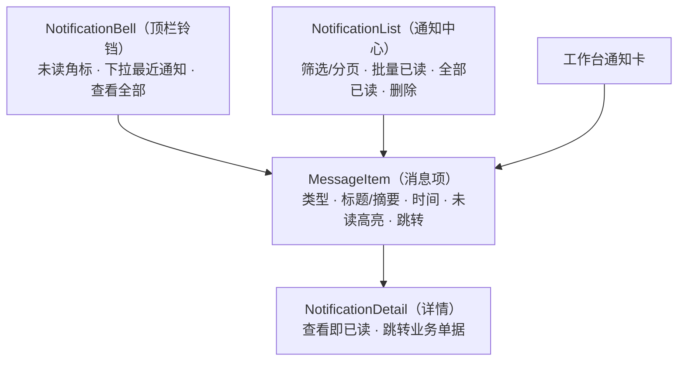

# 组件设计 · 通知与消息

> NotificationBell · NotificationList · MessageItem · NotificationDetail · useNotification

[文档首页](../../../../文档首页.md) › [项目规划说明](../../../../规划/项目规划说明.md) › [组件设计](../../01_组件设计_总览.md) › 通知与消息　|　[← 异常与空状态](../05_组件设计_异常与空状态/05_组件设计_异常与空状态.md)　[全局搜索 →](../07_组件设计_全局搜索/07_组件设计_全局搜索.md)

> 可交互原型：[06_原型设计_通知与消息.html](06_原型设计_通知与消息.html)（演示顶栏铃铛与未读角标、下拉最近通知、通知中心列表/详情、单条/批量/全部已读、单条删除、Socket.IO 实时推送与断线补偿）

## 1. 目的与适用范围 <a id="purpose"></a>

定义 BMS 前端 `frontend/` **通知与消息**的组件设计：顶栏铃铛 `NotificationBell.vue`（未读角标 + 下拉最近通知），通知列表 `NotificationList.vue`（筛选/分页/批量已读），消息项 `MessageItem.vue`（类型/标题/时间/未读高亮/跳转），通知详情 `NotificationDetail.vue`（内容 + 跳转业务单据），以及组合式函数 `useNotification.ts`（未读数、Socket.IO 实时、批量已读、断线补偿）。适用于**通知中心**页（PC 管理端）与**顶栏铃铛**（全局）、**首页工作台通知卡**（复用 `MessageItem`）。

本节对应[《项目规划说明》](../../../../规划/项目规划说明.md)「功能模块」之**通知中心**模块；上游设计依据[《概要设计 · 通知中心》](../../../概要设计/16_概要设计_通知中心.md)（`sys_notification`、列表/详情/未读/已读/删除接口、实时推送事件与错误码）与[《架构设计 · 实时推送》](../../../架构设计/16_架构设计_子系统_实时推送.md)（Socket.IO 订阅与断线补偿）、[《架构设计 · 通知公告》](../../../架构设计/20_架构设计_子系统_通知公告.md)（通知生成与推送）；页面形态依据[《布局设计 · 导航》](../../../布局设计/05_布局设计_导航.html)（顶栏通知铃铛单一入口与角标）、[《布局设计 · 首页工作台》](../../../布局设计/13_布局设计_首页工作台.html)（通知卡）、[《布局设计 · 移动端细化》](../../../布局设计/16_布局设计_移动端细化.html)（移动端列表与左滑删除）；协作节点为[05 展示类 05 异常与空状态](../05_组件设计_异常与空状态/05_组件设计_异常与空状态.md)（空态/加载）、[07 基础类 01 请求封装](../../09_基础类/01_组件设计_请求封装/01_组件设计_请求封装.md)（未读数缓存/错误处理）、[07 基础类 02 权限指令](../../09_基础类/02_组件设计_权限指令/02_组件设计_权限指令.md)（`notification:*`）、[07 基础类 03 格式化工具](../../09_基础类/03_组件设计_格式化工具/03_组件设计_格式化工具.md)（相对时间）。

> 本篇为组件设计体系展示类第 06 篇。**范围边界**：通知的**产生与落库**归各业务模块与[《概要设计 · 通知中心》](../../../概要设计/16_概要设计_通知中心.md)；**公告**（面向全员 `sys_notice`，数据表与页面独立）归[《概要设计 · 公告管理》](../../../概要设计/18_概要设计_公告管理.md)（本节点不覆盖公告）；**通知偏好**（渠道开关/免打扰）归[《概要设计 · 用户喜好》](../../../概要设计/04_概要设计_用户喜好.md)（发送侧过滤，前端只读展示）；移动端不复用 PC 组件（见第 12 节）。

## 2. 组件清单与职责 <a id="components"></a>

| 组件 / 工具 | 位置 | 职责 |
| --- | --- | --- |
| `NotificationBell.vue` | `src/components/notification/` | 顶栏铃铛：未读角标（实时增量）、点击下拉最近 N 条（`MessageItem`）、「查看全部」入口、空态 |
| `NotificationList.vue` | `src/components/notification/` | 通知中心列表：类型/已读筛选、分页、勾选批量已读、全部已读、单条删除、加载/空/错误态 |
| `MessageItem.vue` | `src/components/notification/` | 消息项：类型图标、标题/摘要、时间（相对时间）、未读高亮、点击跳转（`biz_type`/`biz_id`）、删除；供列表、铃铛下拉、工作台通知卡复用 |
| `NotificationDetail.vue` | `src/components/notification/` | 通知详情：标题/内容/时间/类型；查看即标记已读（幂等）；`biz_type`/`biz_id` 跳转业务单据 |
| `useNotification.ts` | `src/utils/useNotification.ts` | 组合式函数：未读数、列表/详情取数、Socket.IO 订阅（`notification.new`/`approval.todo`）、批量已读、删除、断线补偿 |

- 命名遵循[《命名规范》](../../../../规范/命名规范.md)：组件 PascalCase、组合式函数 `use` + 名词；目录遵循[《前端开发规范》](../../../../规范/前端开发规范.md)（`src/components/` 按域分目录，通知归 `notification/`；组合式函数放 `src/utils/`）。

## 3. 总体结构 <a id="layout"></a>



| 区域 | 内容 |
| --- | --- |
| 顶栏铃铛（全局） | 未读角标（Socket.IO 实时增量）、下拉最近 N 条（`MessageItem`）、「查看全部」跳通知中心 |
| 通知中心（页面） | 筛选（类型/已读）、列表（分页/无限滚动）、批量操作（勾选批量已读、全部已读）、单条删除 |
| 详情 | 点击消息项打开（抽屉/详情页）：内容 + 跳转业务单据；查看即已读 |

## 4. 顶栏铃铛 NotificationBell <a id="bell"></a>

| 属性 / 事件 | 说明 |
| --- | --- |
| `unreadCount` | 未读数（由 `useNotification` 提供，角标显示；`0` 不显示，`>99` 显示 `99+`） |
| `recent` | 最近 N 条（缺省 5，`MessageItem` 列表） |
| `maxCount` | 角标上限（缺省 99） |
| 事件 `view-all` / `open` / `read` | 查看全部 / 打开详情 / 标记已读（由调用方路由或 `useNotification` 处理） |

- **单一入口**：待办与通知未读角标统一挂在**顶栏通知铃铛**（[《布局设计 · 导航》](../../../布局设计/05_布局设计_导航.html)「待办与通知角标单一入口」口径），不随工作台卡片显隐变化。
- 角标随 `notification.new`/`approval.todo` 实时 +1；断线重连后由 `useNotification` 拉取未读数补偿（见第 9 节）。
- 免打扰时段站内信仍落库但推送延后（[《概要设计 · 通知中心》](../../../概要设计/16_概要设计_通知中心.md)「通知生成与已读流程」节），前端角标以实际未读数为准。

## 5. 通知列表 NotificationList <a id="list"></a>

| 属性 | 类型 | 默认 | 说明 |
| --- | --- | --- | --- |
| `type` | string \| null | null | 类型筛选（站内信/待办提醒/系统提示） |
| `readState` | 'all' \| 'unread' \| 'read' | 'all' | 已读状态筛选 |
| `pageSize` | number | 20 | 分页大小（PC 分页 / 移动端无限滚动） |
| `selectable` | boolean | true | 是否可勾选（批量已读） |

| 操作 | 行为 |
| --- | --- |
| 筛选/分页 | 类型与已读筛选；PC 分页、移动端触底加载（[《布局设计 · 移动端细化》](../../../布局设计/16_布局设计_移动端细化.html)） |
| 批量已读 | 勾选后「批量已读」→ `POST /notifications/read`（body id 列表，上限 500，超限 70003） |
| 全部已读 | 「全部已读」→ `POST /notifications/read-all`（二次确认可选） |
| 单条删除 | 删除（软删除，仅本人；归属校验 70002/70006）；已删除不进列表与未读数 |
| 状态 | 加载（骨架/遮罩）、空态（[05 展示类 05 异常与空状态](../05_组件设计_异常与空状态/05_组件设计_异常与空状态.md)）、错误重试 |

- 数据强制按当前用户过滤（本人可见本人通知），无动作级数据范围（[《概要设计 · 通知中心》](../../../概要设计/16_概要设计_通知中心.md)「权限与配置」节）。

## 6. 消息项 MessageItem <a id="item"></a>

| 属性 | 类型 | 默认 | 说明 |
| --- | --- | --- | --- |
| `item` | Notification | — | 通知数据（`title`/`content`/`type`/`is_read`/`biz_type`/`biz_id`/`created_at`） |
| `showDelete` | boolean | true | 是否显示删除 |
| `compact` | boolean | false | 紧凑模式（铃铛下拉/工作台通知卡用） |

| 展示 | 说明 |
| --- | --- |
| 类型 | 类型图标 + 类型名（站内信/待办提醒/系统提示）；待办提醒可用点状状态（复用 [05 展示类 03 状态标签与描述列表](../03_组件设计_状态标签与描述列表/03_组件设计_状态标签与描述列表.md) 语义色） |
| 标题/摘要 | 标题 + 内容摘要（1 行省略）；未读加粗/高亮 |
| 时间 | 相对时间（如「3 分钟前」，复用 [07 基础类 03 格式化工具](../../09_基础类/03_组件设计_格式化工具/03_组件设计_格式化工具.md)），tooltip 显示绝对时间 |
| 跳转 | 有 `biz_type`/`biz_id` 时点击跳转业务单据（路由由调用方决定）；无则打开详情 |
| 未读 | 未读高亮圆点；点击/打开详情后标记已读 |
| 删除 | 单条删除入口（`showDelete` 且持 `notification:delete`） |

- 三处复用同一 `MessageItem`：通知中心列表、铃铛下拉、工作台通知卡（[《布局设计 · 首页工作台》](../../../布局设计/13_布局设计_首页工作台.html)「通知/公告卡」）。

## 7. 通知详情 NotificationDetail <a id="detail"></a>

| 项 | 设计 |
| --- | --- |
| 打开 | 点击消息项/铃铛项打开；**查看即标记已读**（幂等，重复打开无副作用），并同步角标 |
| 内容 | 标题、类型、时间、内容（运行时按收件人 locale 渲染，见第 12 节）；不渲染富文本 HTML（纯文本，必要时按 [08 富文本字段](../../06_字段类/07_组件设计_富文本字段/07_组件设计_富文本字段.md) 清洗后渲染） |
| 跳转 | `biz_type`/`biz_id` 提供「查看单据」按钮，路由到业务单据（按目标路由权限显隐） |
| 形态 | PC 用抽屉/弹窗或详情页；移动端独立页（复用后端 API） |

## 8. 已读与删除语义 <a id="read-delete"></a>

| 操作 | 接口 | 语义 |
| --- | --- | --- |
| 单条已读 | 打开详情触发 | 幂等（重复标记无副作用） |
| 批量已读 | `POST /notifications/read` | 幂等；id 列表上限 500（70003）；与实时推送并发时角标一致（见第 9 节） |
| 全部已读 | `POST /notifications/read-all` | 幂等；更新本人全部未读 |
| 单条删除 | `DELETE /notifications/{id}` | 软删除，仅本人（归属校验）；删除后不进列表与未读数，数据保留至归档 |

- 已读状态**跨端一致**（PC/Mobile 同源后端）；删除为软删除（[《概要设计 · 通知中心》](../../../概要设计/16_概要设计_通知中心.md)「数据模型」节）。

## 9. 组合式函数 useNotification <a id="use-notification"></a>

```typescript
interface UseNotificationReturn {
  unreadCount: Ref<number>;
  recent: Ref<Notification[]>;
  list: Ref<Notification[]>;
  total: Ref<number>;
  loading: Ref<boolean>;
  connected: Ref<boolean>;
  loadUnread: () => Promise<void>;          // 初始化 / 重连补偿
  loadList: (params) => Promise<void>;
  loadDetail: (id: string) => Promise<Notification>;   // 自动已读
  markRead: (ids: string[]) => Promise<void>;
  markAllRead: () => Promise<void>;
  remove: (id: string) => Promise<void>;
  subscribe: () => void;                     // Socket.IO 订阅
  unsubscribe: () => void;
}
```

| 行 | 设计 |
| --- | --- |
| 未读数 | 初始化拉取 `GET /notifications/unread-count`（短 TTL 缓存）；角标值以服务端为准 |
| 实时 | Socket.IO 订阅 `notification.new`（新站内信）与 `approval.todo`（审批待办）→ 角标 +1 / 列表插入 |
| 断线补偿 | 断线重连后**拉取未读数**补偿（不依赖逐条推送补齐，[《概要设计 · 通知中心》](../../../概要设计/16_概要设计_通知中心.md)「通知生成与已读流程」节）；`connected` 状态可展示 |
| 并发一致 | 批量/全部已读为 bulk 更新，服务端加锁避免与实时推送并发丢失角标增量；前端以服务端返回值校准角标 |
| 免打扰 | 延后推送期间角标仍可能在下次补偿时体现（以服务端未读数为准） |
| 释放 | 页面卸载/登出时 `unsubscribe`，避免连接与监听泄漏 |

## 10. 场景集成 <a id="scenes"></a>

| 场景 | 组合 | 说明 |
| --- | --- | --- |
| 顶栏铃铛（全局） | `NotificationBell` + 下拉 `MessageItem` | 单一入口角标，实时增量 |
| 通知中心页 | `NotificationList` + `NotificationDetail` | 列表/详情/已读/删除 |
| 首页工作台通知卡 | `MessageItem`（compact） | 卡片内最近通知（[《布局设计 · 首页工作台》](../../../布局设计/13_布局设计_首页工作台.html)） |
| 审批待办 | `approval.todo` 推送 + 顶栏角标 | 待办数与通知共用角标入口 |
| 移动端通知列表 | Vant 列表 + 左滑删除 | 独立工程、复用后端 API |
| 通知偏好 | 只读展示入口 | 偏好配置归[《概要设计 · 用户喜好》](../../../概要设计/04_概要设计_用户喜好.md) |

## 11. 依赖接口与上游变更 <a id="api"></a>

### 11.1 上游接口与口径 <a id="api-contract"></a>

| 项 | 说明 | 目标文档 |
| --- | --- | --- |
| 列表/详情 | `GET /notifications`、`GET /notifications/{id}`（查看即已读） | [《概要设计 · 通知中心》](../../../概要设计/16_概要设计_通知中心.md) |
| 未读数 | `GET /notifications/unread-count`（角标初始化/重连补偿，短 TTL） | [《概要设计 · 通知中心》](../../../概要设计/16_概要设计_通知中心.md) |
| 已读/删除 | `POST /notifications/read`、`/read-all`、`DELETE /notifications/{id}` | [《概要设计 · 通知中心》](../../../概要设计/16_概要设计_通知中心.md) |
| 实时推送 | `notification.new` / `approval.todo`（Socket.IO），断线重连补偿 | [《架构设计 · 实时推送》](../../../架构设计/16_架构设计_子系统_实时推送.md)、[《架构设计 · 通知公告》](../../../架构设计/20_架构设计_子系统_通知公告.md) |
| 消息字段与跳转 | `type`/`biz_type`/`biz_id`/`is_read`/`created_at` | [《概要设计 · 通知中心》](../../../概要设计/16_概要设计_通知中心.md) |
| 权限/错误码 | `notification:query/update/delete`；70001/70002/70003/70005/70006 | [《概要设计 · 通知中心》](../../../概要设计/16_概要设计_通知中心.md) |
| 新增依赖 | **无**：`socket.io-client`、Element Plus 组件均已在技术栈 | — |

### 11.2 需登记的上游变更 <a id="api-upstream"></a>

| 变更点 | 目标文档 | 内容 |
| --- | --- | --- |
| ① 通知前端组件契约与消息字段 | [《概要设计 · 通知中心》](../../../概要设计/16_概要设计_通知中心.md)「接口设计」「数据模型与表设计」节 | 明确前端组件契约（铃铛/角标、列表、消息项、详情）与消息项展示字段（类型/标题/摘要/相对时间/未读高亮）及跳转（`biz_type`/`biz_id`）；批量已读上限（500，70003）与单条删除软删除口径；角标以服务端未读数为准 |
| ② 前端 Socket.IO 订阅与断线补偿 | [《架构设计 · 实时推送》](../../../架构设计/16_架构设计_子系统_实时推送.md)「协作」节；[《架构设计 · 通知公告》](../../../架构设计/20_架构设计_子系统_通知公告.md) | 明确前端订阅 `notification.new`/`approval.todo` 的角标增量更新、**断线重连后拉取未读数补偿**、批量已读与推送并发的角标一致（服务端加锁 + 前端以返回值校准）；免打扰延后推送的前端表现 |
| ③ 顶栏铃铛位置与工作台复用 | [《布局设计 · 导航》](../../../布局设计/05_布局设计_导航.html)「待办与通知角标」节；[《布局设计 · 首页工作台》](../../../布局设计/13_布局设计_首页工作台.html) | 明确顶栏通知铃铛为未读/待办角标**单一入口**（不随卡片显隐）；工作台通知卡复用 `MessageItem`（compact）；标注组件设计 展示类 06 为组件契约依据 |

> 按[《文档生成规范》](../../../../规范/文档生成规范.md)「引用与追溯」节，上述变更需用户确认后由上游文档同步；本节点只定义组件契约，不单独裁决接口与表结构。

## 12. 权限 / i18n / 移动端 <a id="cooperate"></a>

- **权限**：列表/详情 `notification:query`；已读 `notification:update`；删除 `notification:delete`（[07 基础类 02 权限指令](../../09_基础类/02_组件设计_权限指令/02_组件设计_权限指令.md)）；数据按 `user_id` 固有隔离；角标为登录态内建能力。
- **i18n**：界面文案（筛选/操作/空态/错误码 `error.700xx`）走 vue-i18n；**通知内容按收件人 locale 运行时渲染**（gettext，[《概要设计 · 通知中心》](../../../概要设计/16_概要设计_通知中心.md)），前端只展示不二次翻译；时间用相对时间。
- **移动端**：不复用 PC 组件；Vant 列表 + 左滑删除 + 触底加载 + 角标（TabBar/顶栏），复用后端 API 与角标补偿口径（[《布局设计 · 移动端细化》](../../../布局设计/16_布局设计_移动端细化.html)）。

## 13. 性能与边界 <a id="performance"></a>

| 场景 | 设计 |
| --- | --- |
| 未读数 | 服务端短 TTL 缓存；前端初始化/重连拉取，避免高频轮询 |
| 实时 | Socket.IO 单连接订阅两个事件；批量已读后不重拉全量，以返回值校准角标 |
| 列表 | 分页/无限滚动；消息项轻量（图标+文本）；铃铛下拉仅最近 N 条 |
| 删除/已读 | bulk 更新；幂等可重试；删除后本地移除 |
| 边界 | 未读数竞态（批量已读 vs 推送）、断线/重连补偿、角标超 99、空列表、加载失败重试、越权（70002）、批量上限（70003）、软删除、免打扰延后、跨端一致 |
| 不支持 | 通知生成/落库/渠道过滤（后端与用户喜好）、公告（公告管理）、动态路由跳转目标（业务页面）、移动端组件 |

## 14. 检查清单 <a id="checklist"></a>

- □ 组件分层：`NotificationBell`/`NotificationList`/`MessageItem`/`NotificationDetail`/`useNotification` 职责清晰，`MessageItem` 三处复用
- □ 铃铛：未读角标（实时增量、>99 显示 99+、单一入口）、下拉最近通知、查看全部；不随工作台卡片显隐
- □ 列表：类型/已读筛选、分页/无限滚动、批量已读（上限 500）、全部已读、单条删除（仅本人、软删除）、空/加载/错误态
- □ 消息项：类型图标、标题/摘要、相对时间、未读高亮、`biz_type/biz_id` 跳转、删除入口
- □ 详情：查看即已读（幂等）、时间/类型/内容、跳转业务单据
- □ 实时与补偿：订阅 `notification.new`/`approval.todo`、断线重连拉取未读数、批量已读与推送并发角标一致
- □ 权限（`notification:*`、user_id 隔离）、i18n（文案/内容按收件人 locale/相对时间）、移动端（Vant + 左滑删除）符合第 12 节
- □ 性能边界：未读数缓存、分页/轻量消息项、bulk 更新、角标校准、连接释放
- □ 三项上游登记已确认：通知前端组件契约与消息字段、前端 Socket.IO 订阅与断线补偿、顶栏铃铛位置与工作台复用

> 组件设计节点 · 与[《概要设计 · 通知中心》](../../../概要设计/16_概要设计_通知中心.md)[《概要设计 · 用户喜好》](../../../概要设计/04_概要设计_用户喜好.md)[《架构设计 · 实时推送》](../../../架构设计/16_架构设计_子系统_实时推送.md)[《架构设计 · 通知公告》](../../../架构设计/20_架构设计_子系统_通知公告.md)[《布局设计 · 导航》](../../../布局设计/05_布局设计_导航.html)[《布局设计 · 首页工作台》](../../../布局设计/13_布局设计_首页工作台.html)[《布局设计 · 移动端细化》](../../../布局设计/16_布局设计_移动端细化.html)[05 展示类 05 异常与空状态](../05_组件设计_异常与空状态/05_组件设计_异常与空状态.md)[07 基础类 01 请求封装](../../09_基础类/01_组件设计_请求封装/01_组件设计_请求封装.md)《命名规范》配套
