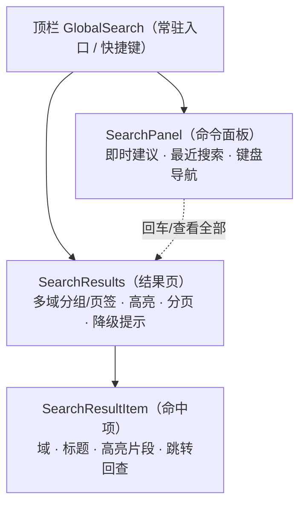

# 组件设计 · 全局搜索

> GlobalSearch · SearchPanel · SearchResults · SearchResultItem · useGlobalSearch

[文档首页](../../../../文档首页.md) › [项目规划说明](../../../../规划/项目规划说明.md) › [组件设计](../../01_组件设计_总览.md) › 全局搜索　|　[← 通知与消息](../06_组件设计_通知与消息/06_组件设计_通知与消息.md)　[文件预览 →](../08_组件设计_文件预览/08_组件设计_文件预览.md)

> 可交互原型：[07_原型设计_全局搜索.html](07_原型设计_全局搜索.html)（演示顶栏搜索入口、命令面板即时建议、多域分组结果与高亮、审计日志页签、降级提示）

## 1. 目的与适用范围 <a id="purpose"></a>

定义 BMS 前端 `frontend/` **全局搜索**的组件设计：顶栏搜索入口 `GlobalSearch.vue`（输入框/快捷键呼出），命令面板 `SearchPanel.vue`（即时建议与最近搜索），结果页 `SearchResults.vue`（多域分组/页签、高亮、分页、降级提示、审计日志页签），命中项 `SearchResultItem.vue`（域/标题/高亮片段/跳转回查），以及组合式函数 `useGlobalSearch.ts`（防抖、域过滤、分页、降级与错误处理）。适用于**顶栏全局搜索**（PC + 移动端）与**主数据多域聚合检索**（阶段十四）。

本节对应[《项目规划说明》](../../../../规划/项目规划说明.md)「功能模块」之**全文检索**模块「全局搜索（主数据多域聚合）」；上游设计依据[《概要设计 · 全文检索》](../../../概要设计/33_概要设计_全文检索.md)（主数据全局搜索、审计日志检索、权限过滤、只返回 ID 与高亮、降级兜底、接口与错误码）与[《架构设计 · 全文检索》](../../../架构设计/21_架构设计_子系统_全文检索.md)（ES 检索、事件同步、索引规划、降级）；页面形态依据[《布局设计 · 导航》](../../../布局设计/05_布局设计_导航.html)（顶栏搜索入口）与[《布局设计 · 移动端细化》](../../../布局设计/16_布局设计_移动端细化.html)（移动端搜索）；协作节点为[05 展示类 05 异常与空状态](../05_组件设计_异常与空状态/05_组件设计_异常与空状态.md)（空态/降级/加载）、[07 基础类 01 请求封装](../../09_基础类/01_组件设计_请求封装/01_组件设计_请求封装.md)（限流/超时/错误码）、[07 基础类 02 权限指令](../../09_基础类/02_组件设计_权限指令/02_组件设计_权限指令.md)（可检索域=权限并集、`log:query`）、[07 基础类 03 格式化工具](../../09_基础类/03_组件设计_格式化工具/03_组件设计_格式化工具.md)（时间格式化）。

> 本篇为组件设计体系展示类第 07 篇。**范围边界**：检索引擎（ES 索引、事件同步、文本解析、索引重建）归[《架构设计 · 全文检索》](../../../架构设计/21_架构设计_子系统_全文检索.md)；**域内列表页**（用户/部门/字典等）归各自页面；**详情数据**一律回查数据库（本节点只展示 ID + 高亮并跳转，不承载详情）；**语义搜索/文件问答**（Milvus 向量）归 [06 交互类 11 AI 助手](../../08_交互类/10_组件设计_AI助手/10_组件设计_AI助手.md)（与本节点关键词检索互补）；审计日志检索为结果页一种模式（`log:query`）；移动端不复用 PC 组件（见第 11 节）。

## 2. 组件清单与职责 <a id="components"></a>

| 组件 / 工具 | 位置 | 职责 |
| --- | --- | --- |
| `GlobalSearch.vue` | `src/components/search/` | 顶栏搜索入口：输入框/触发按钮、快捷键呼出命令面板、跳转结果页、最近搜索入口；顶栏常驻（PC + 移动端形态不同） |
| `SearchPanel.vue` | `src/components/search/` | 命令面板：即时建议（防抖）、可检索域提示、最近搜索、键盘导航（上下选择/回车打开）、空态 |
| `SearchResults.vue` | `src/components/search/` | 结果页：多域分组/页签、命中高亮、分页/限深、审计日志检索页签（`log:query`）、降级提示条、空/加载/错误态 |
| `SearchResultItem.vue` | `src/components/search/` | 命中项：域标识、标题、高亮片段（关键词 `<em>` 高亮，安全渲染）、跳转目标（回查库详情路由） |
| `useGlobalSearch.ts` | `src/utils/useGlobalSearch.ts` | 组合式函数：关键词与域状态、防抖、请求（限深/限流/超时）、分组聚合、降级提示、错误码处理、最近搜索 |

- 命名遵循[《命名规范》](../../../../规范/命名规范.md)：组件 PascalCase、组合式函数 `use` + 名词；目录遵循[《前端开发规范》](../../../../规范/前端开发规范.md)（`src/components/` 按域分目录，搜索归 `search/`；组合式函数放 `src/utils/`）。
- **高亮安全**：ES 返回高亮片段含标记（`<em>` 等），渲染前需**白名单清洗**（只保留高亮标签，其余转义），复用 [08 富文本字段](../../06_字段类/07_组件设计_富文本字段/07_组件设计_富文本字段.md) 净化口径，防 XSS。

## 3. 总体结构 <a id="layout"></a>



| 区域 | 内容 |
| --- | --- |
| 顶栏入口 | 搜索框/图标（[《布局设计 · 导航》](../../../布局设计/05_布局设计_导航.html)顶栏常驻）；PC 支持快捷键（如 `Ctrl/Cmd + K`）呼出命令面板 |
| 命令面板 | 即时建议（防抖）、可检索域清单、最近搜索、键盘上下选择 + 回车打开/查看全部 |
| 结果页 | 多域分组/页签（全部/各域）、关键词高亮、分页/限深、审计日志检索页签（有 `log:query` 才显示）、降级提示条 |

## 4. 顶栏入口 GlobalSearch <a id="entry"></a>

| 属性 / 事件 | 说明 |
| --- | --- |
| `hotkey` | 快捷键（缺省 `mod+k`），呼出命令面板 |
| `placeholder` | 占位（i18n，如「搜索用户、部门、单据…」） |
| `domains` | 可检索域（由权限并集决定，见第 9 节）；无权限域不展示 |
| 事件 `search` / `open-result` | 提交关键词 → 结果页 / 打开某命中 |

- 顶栏搜索为**常驻入口**（不占独立菜单，[《概要设计 · 全文检索》](../../../概要设计/33_概要设计_全文检索.md)「菜单挂接」节）；移动端顶栏搜索图标进入搜索页。
- 可检索域 = 用户已授予业务权限的**并集**（用户/部门/角色/字典/产品单据/文件元数据/帮助文章），无权限域不展示。

## 5. 命令面板 SearchPanel <a id="panel"></a>

| 项 | 设计 |
| --- | --- |
| 触发 | 顶栏输入框聚焦 / 快捷键；输入即防抖（200-300ms）请求即时建议 |
| 即时建议 | 返回各域 Top N 命中（`SearchResultItem` 紧凑形态），最多若干条 |
| 键盘导航 | ↑/↓ 选择、回车打开选中/跳结果页、Esc 关闭 |
| 最近搜索 | 本地保存（用户维度）最近关键词，可点击复搜/清除 |
| 域提示 | 展示可检索域标签；点击限定域 |
| 空态 | 无建议时提示（配合 [05 展示类 05 异常与空状态](../05_组件设计_异常与空状态/05_组件设计_异常与空状态.md)） |

## 6. 结果页 SearchResults <a id="results"></a>

| 属性 | 类型 | 默认 | 说明 |
| --- | --- | --- | --- |
| `keyword` | string | '' | 关键词（URL 同步，可分享/刷新保持） |
| `activeDomain` | string | 'all' | 当前域分组/页签 |
| `pageSize` | number | 20 | 分页大小（limit/offset 限深，默认 ≤ 100 页） |

| 项 | 设计 |
| --- | --- |
| 多域分组 | 「全部」聚合 + 各域页签（用户/部门/角色/字典/产品单据/文件/帮助文章）；「全部」下按域分组展示 Top N + 各域「更多」 |
| 高亮 | 标题/片段关键词高亮（`<em>`，白名单清洗后渲染） |
| 分页 | 分页/无限滚动；限深超限提示（10001 参数/限深） |
| 详情回查 | 命中只含 ID + 高亮；点击跳转目标路由，由目标页**回查数据库**取最新（[《概要设计 · 全文检索》](../../../概要设计/33_概要设计_全文检索.md)「业务规则」节） |
| 审计日志页签 | 仅持 `log:query` 时显示；检索需时间范围（单次 ≤ 31 天，超限 10107），跨月自动多索引 |
| 降级提示 | ES 故障降级数据库模糊查询时，顶部降级提示条（10103「结果可能不完整」，[05 展示类 05 异常与空状态](../05_组件设计_异常与空状态/05_组件设计_异常与空状态.md)） |
| 状态 | 空态（未找到相关内容）、加载（骨架）、错误重试、限流提示（通用段） |

## 7. 命中项 SearchResultItem <a id="item"></a>

| 属性 | 类型 | 说明 |
| --- | --- | --- |
| `hit` | SearchHit | `{ doc_type, biz_id, title, highlight, updated_at }` |
| `compact` | boolean | 紧凑形态（命令面板） |

| 展示 | 说明 |
| --- | --- |
| 域标识 | 域图标/名称（用户/部门/角色/字典/单据/文件/帮助文章） |
| 标题 | 命中标题（高亮） |
| 片段 | 高亮摘要（1-2 行省略；高亮标签白名单清洗） |
| 时间 | `updated_at`（[07 基础类 03 格式化工具](../../09_基础类/03_组件设计_格式化工具/03_组件设计_格式化工具.md)） |
| 跳转 | 按 `doc_type` + `biz_id` 路由到目标详情（目标页回查库取最新数据） |

## 8. 组合式函数 useGlobalSearch <a id="use-search"></a>

```typescript
interface UseGlobalSearchReturn {
  keyword: Ref<string>;
  domains: Ref<{ key: string; label: string }[]>;   // 权限并集
  activeDomain: Ref<string>;
  results: Ref<Record<string, SearchHit[]>>;        // 按域分组
  suggestions: Ref<SearchHit[]>;
  recent: Ref<string[]>;
  total: Ref<number>;
  loading: Ref<boolean>;
  degraded: Ref<boolean>;                            // ES 降级中
  loadDomains: () => Promise<void>;
  suggest: (q: string) => Promise<void>;             // 防抖即时建议
  search: (params: { q: string; types?: string[]; page?: number }) => Promise<void>;
  loadMore: () => Promise<void>;
  openHit: (hit: SearchHit) => void;                 // 跳转回查
}
```

| 行 | 设计 |
| --- | --- |
| 域 | `loadDomains()` 由权限并集得出；无权限域不展示、不查询 |
| 请求 | `suggest` 防抖 200-300ms；`search` 携带 `q`/`types`/`page`/`size`（`GET /search/global`），限深 ≤ 100 页 |
| 降级 | 响应含降级标记（10103）→ `degraded=true` 展示提示条；10101/10102（不可用/超时）→ 错误态 + 重试 |
| 限流/超时 | 收到通用段限流错误码 → 提示稍后重试；ES 短超时快速失败 |
| 最近搜索 | 本地（用户维度，localStorage/偏好）保存最近关键词，去重 + 上限 |
| 审计日志 | 结果页切到「审计日志」页签时改调 `GET /search/logs`（`log:query`，时间范围必填，跨月路由） |

## 9. 场景集成 <a id="scenes"></a>

| 场景 | 说明 |
| --- | --- |
| 顶栏全局搜索（PC） | 常驻入口，快捷键呼出命令面板，回车进结果页 |
| 全局搜索结果页 | 多域分组/页签、高亮、分页、降级提示、审计日志页签 |
| 移动端搜索 | 顶栏搜索图标 → 搜索页（单列结果列表，复用 `/search/global`） |
| 审计日志检索 | 结果页「审计日志」页签（`log:query`，时间范围必填，单次 ≤ 31 天） |
| 文件内容检索 | 文件域结果（`file:query` + 数据范围），命中文件 ID + 上下文高亮；不可检索文件提示（10106） |
| 索引重建/健康 | 归任务调度页与监控；本节点不提供管理入口（仅结果页可展示降级提示） |

## 10. 依赖接口与上游变更 <a id="api"></a>

### 10.1 上游接口与口径 <a id="api-contract"></a>

| 项 | 说明 | 目标文档 |
| --- | --- | --- |
| 全局搜索 | `GET /search/global`（q/types/page/size，多域聚合 + 高亮，详情回查库） | [《概要设计 · 全文检索》](../../../概要设计/33_概要设计_全文检索.md) |
| 审计日志检索 | `GET /search/logs`（log_type、q、start_time、end_time 必填，跨月路由） | [《概要设计 · 全文检索》](../../../概要设计/33_概要设计_全文检索.md) |
| 文件内容检索 | `GET /search/files`（q、file_type、page、size，返回文件 ID + 高亮） | [《概要设计 · 全文检索》](../../../概要设计/33_概要设计_全文检索.md) |
| 权限过滤 | 可检索域=目标域既有业务权限并集；审计 `log:query`；文件 `file:query` + 数据范围 | [《概要设计 · 全文检索》](../../../概要设计/33_概要设计_全文检索.md) |
| 降级与错误码 | 10101/10102/10103/10104/10106/10107；ES 降级数据库模糊查询 | [《架构设计 · 全文检索》](../../../架构设计/21_架构设计_子系统_全文检索.md) |
| 顶栏入口 | 全局搜索为顶栏常驻入口（不占菜单） | [《布局设计 · 导航》](../../../布局设计/05_布局设计_导航.html) |
| 新增依赖 | **无**：Element Plus + 浏览器原生能力可覆盖（快捷键/防抖/高亮清洗） | — |

### 10.2 需登记的上游变更 <a id="api-upstream"></a>

| 变更点 | 目标文档 | 内容 |
| --- | --- | --- |
| ① 前端搜索交互与多域/页签/降级 | [《概要设计 · 全文检索》](../../../概要设计/33_概要设计_全文检索.md)「接口设计」「页面清单」节 | 明确前端交互（顶栏常驻入口 + 快捷键命令面板 + 结果页多域分组/页签）、命中项字段（域/标题/高亮/更新时间）与**详情回查跳转**；可检索域=权限并集；**审计日志检索页签仅 `log:query` 可见**（时间范围必填、单次 ≤ 31 天）；**降级提示条**（10103）与空/加载/错误/限流态 |
| ② 前端查询接口与降级口径 | [《架构设计 · 全文检索》](../../../架构设计/21_架构设计_子系统_全文检索.md)「接口」「性能」节 | 明确前端查询限深（≤ 100 页）、限流（按用户）、ES 短超时快速失败与降级提示（10101/10102/10103）；索引重建/健康状态归任务调度/监控页（前端不新增入口） |
| ③ 顶栏搜索入口形态 | [《布局设计 · 导航》](../../../布局设计/05_布局设计_导航.html)「顶栏」节 | 明确顶栏全局搜索入口（输入框/图标 + 快捷键呼出命令面板）与移动端搜索入口；标注组件设计 展示类 07 为组件契约依据 |

> 按[《文档生成规范》](../../../../规范/文档生成规范.md)「引用与追溯」节，上述变更需用户确认后由上游文档同步；本节点只定义组件契约，不单独裁决接口与索引策略。

## 11. 权限 / i18n / 移动端 <a id="cooperate"></a>

- **权限**：本模块不新增权限码；可检索域=目标域既有业务权限并集，无权限域不展示/不查询（[07 基础类 02 权限指令](../../09_基础类/02_组件设计_权限指令/02_组件设计_权限指令.md)）；审计日志页签需 `log:query`；文件内容 `file:query` + 数据范围；租户过滤 + 动作级数据范围由后端强制（前端不感知越权内容）。
- **i18n**：界面文案、错误码（`error.10xxx`）走 vue-i18n；**用户输入关键词不翻译**；命中标题/片段按原文语言展示；高亮标签不参与翻译。
- **移动端**：不复用 PC 组件；顶栏搜索图标 → 搜索页（单列结果列表 + 高亮 + 详情跳转），复用 `/search/global`（[《布局设计 · 移动端细化》](../../../布局设计/16_布局设计_移动端细化.html)）。

## 12. 性能与边界 <a id="performance"></a>

| 场景 | 设计 |
| --- | --- |
| 请求 | 即时建议防抖 200-300ms；结果页按域分页/限深；ES 短超时快速失败 |
| 渲染 | 命中项轻量（标题+片段）；高亮片段截断；结果页按域懒加载「更多」 |
| 安全 | 高亮片段白名单清洗（防 XSS）；详情回查不信任 ES 快照 |
| 降级 | ES 故障降级数据库模糊查询 + 提示条（10103）；恢复后无需前端处理 |
| 边界 | 空关键词、超长关键词、无结果、限流、超时、降级、目标索引未就绪（10104）、文件不可检索（10106）、审计时间范围超限（10107）、可检索域为空、快捷键冲突、最近搜索上限 |
| 不支持 | 检索引擎/索引同步/重建（架构）、域内列表页、详情数据（回查库）、语义搜索/文件问答（AI 助手）、移动端组件 |

## 13. 检查清单 <a id="checklist"></a>

- □ 组件分层：`GlobalSearch` 顶栏入口、`SearchPanel` 命令面板、`SearchResults` 结果页、`SearchResultItem` 命中项、`useGlobalSearch` 状态与请求，职责不重叠
- □ 顶栏常驻入口 + 快捷键命令面板 + 最近搜索 + 键盘导航；可检索域=权限并集，无权限域不展示
- □ 结果页：多域分组/页签、关键词高亮（白名单清洗）、分页/限深、详情回查跳转、审计日志页签（`log:query`，时间范围必填 ≤ 31 天）、降级提示条
- □ 命中项：域标识/标题/高亮片段/时间/跳转；不承载详情数据
- □ 组合式：防抖建议、请求限深/限流/超时、降级与错误码（101xx）、最近搜索
- □ 权限（域权限并集/`log:query`/`file:query`/数据范围）、i18n（文案/错误码，关键词不翻译）、移动端（顶栏搜索 + 单列结果）符合第 11 节
- □ 性能边界：防抖、分页限深、短超时、高亮清洗、详情回查
- □ 三项上游登记已确认：前端搜索交互与多域/页签/降级、前端查询接口与降级口径、顶栏搜索入口形态

> 组件设计节点 · 与[《概要设计 · 全文检索》](../../../概要设计/33_概要设计_全文检索.md)[《架构设计 · 全文检索》](../../../架构设计/21_架构设计_子系统_全文检索.md)[《布局设计 · 导航》](../../../布局设计/05_布局设计_导航.html)[《布局设计 · 移动端细化》](../../../布局设计/16_布局设计_移动端细化.html)[05 展示类 05 异常与空状态](../05_组件设计_异常与空状态/05_组件设计_异常与空状态.md)[04 字段类 08 富文本字段](../../06_字段类/07_组件设计_富文本字段/07_组件设计_富文本字段.md)[07 基础类 01 请求封装](../../09_基础类/01_组件设计_请求封装/01_组件设计_请求封装.md)[07 基础类 02 权限指令](../../09_基础类/02_组件设计_权限指令/02_组件设计_权限指令.md)《命名规范》配套
