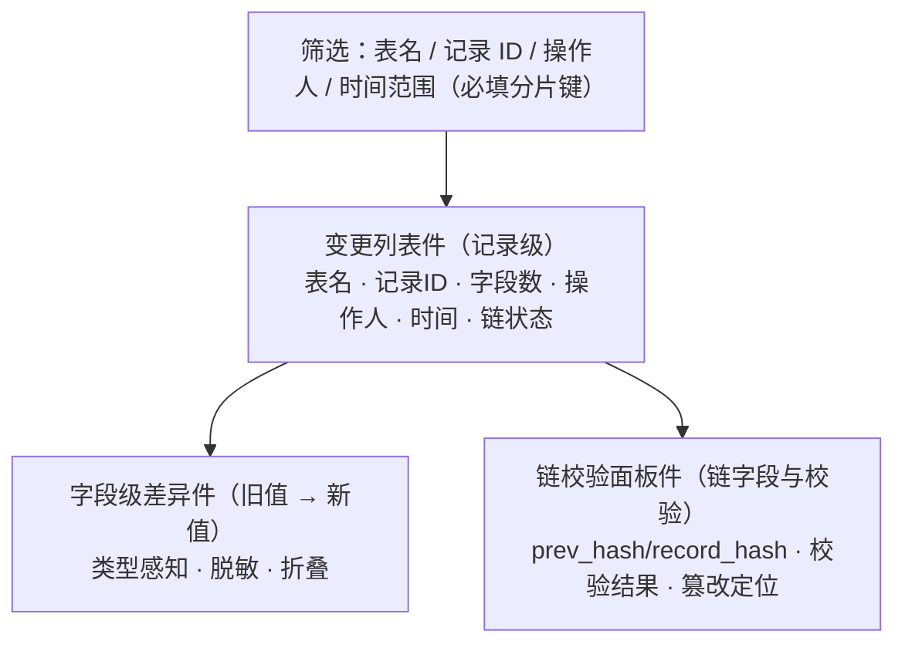

# 组件设计 · 审计差异查看

> 变更记录的字段级差异查看：时间范围（分片键）筛选 / 记录级变更列表 / 旧值 → 新值类型感知渲染与脱敏 / 哈希链字段展示与校验结果 / 篡改记录定位
> 实现侧命名与落点见《[前端基类清单](../../../../前端基类清单.md)》，实现契约细节见项目详细设计。

[文档首页](../../../../文档首页.md) › [项目规划说明](../../../../规划/项目规划说明.md) › [组件设计](../../01_组件设计_总览.md) › 审计差异查看　|　[← 文件预览](../08_组件设计_文件预览/08_组件设计_文件预览.md)　[指标卡 →](../10_组件设计_指标卡/10_组件设计_指标卡.md)

> 可交互原型：[09_原型设计_审计差异查看.html](09_原型设计_审计差异查看.html)（演示变更列表与时间范围筛选、字段级旧值/新值 diff 与类型感知渲染、敏感字段脱敏、链字段展示与校验结果、篡改记录定位）

## 1. 目的与适用范围 

定义 BMS 前端 **审计差异查看**的组件设计：差异查看容器（变更列表 + 详情差异 + 链校验装配），变更列表（记录级列表），字段级差异（旧值/新值对比，类型感知 + 脱敏），链校验面板（`prev_hash`/`record_hash` 展示与校验结果、篡改定位），以及取数与值渲染编排（分片时间范围查询、详情取数、链校验、值渲染分发）。适用于**数据变更审计**页（PC 管理端，审计管理员）。

本节对应[《项目规划说明》](../../../../规划/项目规划说明.md)「功能模块」之**审计合规**模块「字段级变更审计」「审计数据查询」；上游设计依据[《概要设计 · 审计合规》](../../../概要设计/28_概要设计_审计合规.md)（`sys_data_audit_log`、字段旧值/新值、哈希链、三权分立、按月分片、接口与错误码）与[《架构设计 · 审计哈希链》](../../../架构设计/19_架构设计_子系统_审计哈希链.md)（链构造与校验、跨月衔接、归档导出）、[《架构设计 · 数据访问与分片》](../../../架构设计/13_架构设计_子系统_数据访问与分片.md)（按月分片路由）；协作节点为[展示类「通用表格」](../01_组件设计_通用表格/01_组件设计_通用表格.md)（列表）、[展示类「状态标签与描述列表」](../03_组件设计_状态标签与描述列表/03_组件设计_状态标签与描述列表.md)（字段值格式化与只读渲染）、[展示类「异常与空状态」](../05_组件设计_异常与空状态/05_组件设计_异常与空状态.md)（空/加载/错误/缺分片键提示）、[字段类「富文本字段」](../../06_字段类/07_组件设计_富文本字段/07_组件设计_富文本字段.md)（富文本值只读渲染与清洗）、[基础类「请求封装」](../../09_基础类/01_组件设计_请求封装/01_组件设计_请求封装.md)、[基础类「权限指令」](../../09_基础类/02_组件设计_权限指令/02_组件设计_权限指令.md)（`log:query`/`log:manage`）。

> 本篇为「审计差异查看」节点。**范围边界**：审计**写入**（变更捕获、哈希链构造、有序消费、分片落库）归[《架构设计 · 审计哈希链》](../../../架构设计/19_架构设计_子系统_审计哈希链.md)；**操作/登录/开放接口日志**列表归[《概要设计 · 操作日志》](../../../概要设计/11_概要设计_操作日志.md)（本节点只覆盖**数据变更审计差异**）；**链校验工具本身**（逐条重算）在后端，本节点只触发与展示结果；归档数据查询复用归档管理入口；移动端不提供（见第 10 节）。

## 2. 职责与组成 

| 组成部分 | 职责 |
| --- | --- |
| 差异查看容器件 | 筛选区（表名/记录 ID/操作人/时间范围必填）、列表装配、详情差异抽屉、链校验入口挂载、加载/空/错误态 |
| 变更列表件 | 记录级行（表名、记录 ID、变更字段数、操作人、时间、链状态）；分页/游标；点击展开详情 |
| 字段级差异件 | 旧值 → 新值对比；类型感知渲染（文本/数字/日期/布尔/JSON/富文本/字典）；敏感字段脱敏；空值占位；长值折叠 |
| 链校验面板件 | 链字段展示（`prev_hash`/`record_hash` 缩写 + 复制/全文）与链完整性校验结果（通过/异常 + 篡改记录定位跳转） |
| 取数与值渲染编排（随组件内聚） | 时间范围（分片键）校验、列表/详情取数、值渲染判定、链校验触发与结果、错误码处理 |

- 值展示复用展示族基类（能力域基类的一类）的只读值语义；主体内建经继承轨派生，不在组件内重复实现值格式化。

## 3. 总体结构 

| 区域 | 内容 |
| --- | --- |
| 筛选区 | 表名、记录 ID、操作人、**时间范围（分片键，必填）**；查询/重置 |
| 变更列表 | 记录级行：表名、记录 ID、变更字段数、操作人、时间、链状态（正常/待校验） |
| 详情差异 | 展开某记录：按字段列出旧值 → 新值（字段级差异件） |
| 链校验 | 记录详情展示 `prev_hash`/`record_hash`；面板可触发/查看链校验结果与篡改定位 |

## 4. 变更列表 

| 语义项 | 说明 |
| --- | --- |
| 筛选与分片键 | 表名 / 记录 ID / 操作人 / 时间范围（`start`/`end`）；**时间范围必填**（按月分片路由），缺失时拒绝并提示（91002），前端查询前校验；后端按分片路由 |
| 记录行 | 表名（`table_name`）、记录 ID（`record_id`）、变更字段数（`fields`）、操作人（`operator`）、时间（`created_at`，[基础类「格式化工具」](../../09_基础类/03_组件设计_格式化工具/03_组件设计_格式化工具.md)）、链状态（`chainStatus`） |
| 分页 | 分页；大数据量游标分页兜底（`cursor`，last_id + 排序键） |
| 链状态 | 展示记录链是否已校验/正常（由链校验结果回填，缺省「未校验」） |
| 操作 | 查看差异（点击展开详情） |
| 状态 | 加载/空/错误（[展示类「异常与空状态」](../05_组件设计_异常与空状态/05_组件设计_异常与空状态.md)） |

## 5. 字段级差异 

| 语义项 | 说明 |
| --- | --- |
| 字段 | `field`：字段名（可映射元数据 label） |
| 旧值 / 新值 | `oldValue` / `newValue`：JSON 序列化，已脱敏 |
| 渲染类型 | `valueType`：枚举 `text` / `number` / `date` / `boolean` / `json` / `richtext` / `dict`（缺省按值推断） |

| 类型 | 渲染 |
| --- | --- |
| 文本/长文本 | 纯文本；长值折叠 2 行 + 展开（复用 [展示类「状态标签与描述列表」](../03_组件设计_状态标签与描述列表/03_组件设计_状态标签与描述列表.md) 口径） |
| 数字/金额 | 数字/金额格式化（[基础类「格式化工具」](../../09_基础类/03_组件设计_格式化工具/03_组件设计_格式化工具.md)） |
| 日期时间 | 日期时间格式化（用户时区） |
| 布尔 | 是 / 否（语义色可选，复用 [展示类「状态标签与描述列表」](../03_组件设计_状态标签与描述列表/03_组件设计_状态标签与描述列表.md)） |
| JSON | 结构化展示（[基础类「格式化工具」](../../09_基础类/03_组件设计_格式化工具/03_组件设计_格式化工具.md) + 折叠；不裸文本） |
| 富文本 | 纯文本摘要或白名单清洗后渲染（[字段类「富文本字段」](../../06_字段类/07_组件设计_富文本字段/07_组件设计_富文本字段.md)） |
| 字典/枚举 | label 翻译（[字段类「字典字段」](../../06_字段类/01_组件设计_字典字段/01_组件设计_字典字段.md)、[字段类「开关与枚举字段」](../../06_字段类/08_组件设计_开关与枚举字段/08_组件设计_开关与枚举字段.md) 口径） |
| 脱敏 | 敏感字段（密码/token/密钥/手机号等）**后端已脱敏**，前端不再还原；展示 `***` |

- 差异呈现：`旧值 → 新值` 左右对比（新增字段新值仅显示、删除字段旧值仅显示）；变化字段高亮（新增/修改/删除色）。
- 富文本/HTML 类新值必须**白名单清洗**后渲染（防存储型 XSS）。

## 6. 链字段与校验 

| 项 | 设计 |
| --- | --- |
| 链字段展示 | `prev_hash`/`record_hash` 缩写（前 8 位 + …）+ 悬浮/点击查看全文 + 复制 |
| 校验入口 | 按租户/月份范围触发链校验（`log:manage`）；结果展示通过/异常 |
| 校验结果 | 通过：绿色提示；异常（91001）：列出被篡改记录定位（`id`/时间/摘要）并可**跳转定位**到列表对应行 |
| 任务状态 | 校验进行中（91004）提示稍后查询结果 |
| 只读 | 本模块全部只读接口，无写操作 |

## 7. 取数与编排语义 

| 语义项 | 说明 |
| --- | --- |
| 时间范围校验 | 校验时间范围（分片键）是否已填；未填时禁用查询并提示（91002） |
| 取数 | 列表/详情取数走 `log:query`；大数据量游标分页 |
| 链校验 | 链校验触发走 `log:manage`；异常定位回填列表的链状态并支持跳转 |
| 值渲染 | 按字段元数据/值推断渲染类型；脱敏值直接展示 `***` |
| 错误 | 91001 链异常、91002 缺分片键、91003 不存在（已归档）、91004 校验中，按码提示（i18n） |
| 归档 | 热表与归档库均未命中 → 提示已归档至冷存储（91003）；归档库只读查询复用归档管理入口 |

## 8. 场景集成 

| 场景 | 说明 |
| --- | --- |
| 数据变更审计页 | 本节点主体：筛选 → 列表 → 字段差异 → 链字段 |
| 链校验结果 | 与数据变更审计合并入口（`log:manage`） |
| 归档数据查询 | 归档库只读（归档管理模块提供入口，本节点不重复） |
| 操作/登录日志 | 归[《概要设计 · 操作日志》](../../../概要设计/11_概要设计_操作日志.md)（本节点不覆盖） |
| 移动端 | **不提供**审计查询（管理端专有） |

## 9. 依赖接口与上游变更 

### 9.1 上游接口与口径 

| 项 | 说明 | 目标文档 |
| --- | --- | --- |
| 数据变更查询 | `GET /audit/data-changes`（表名/记录 ID/操作人/时间范围，分片路由） | [《概要设计 · 审计合规》](../../../概要设计/28_概要设计_审计合规.md) |
| 变更详情 | `GET /audit/data-changes/{id}`（含链字段 `prev_hash`/`record_hash`） | [《概要设计 · 审计合规》](../../../概要设计/28_概要设计_审计合规.md) |
| 链校验 | `GET /audit/chain/verify`（按租户/月份范围，返回篡改记录定位） | [《概要设计 · 审计合规》](../../../概要设计/28_概要设计_审计合规.md) |
| 归档查询 | `GET /audit/archive/query`（归档库只读） | [《概要设计 · 审计合规》](../../../概要设计/28_概要设计_审计合规.md) |
| 哈希链口径 | `record_hash = SHA256(prev_hash + 规范化记录内容)`；跨月衔接 | [《架构设计 · 审计哈希链》](../../../架构设计/19_架构设计_子系统_审计哈希链.md) |
| 分片 | 按月分片，时间范围必填 | [《架构设计 · 数据访问与分片》](../../../架构设计/13_架构设计_子系统_数据访问与分片.md) |
| 权限/错误码 | `log:query`/`log:manage`；91001/91002/91003/91004 | [《概要设计 · 审计合规》](../../../概要设计/28_概要设计_审计合规.md) |
| 新增依赖 | **无**：复用既有表格、描述列表与格式化能力 | — |

### 9.2 需登记的上游变更 

| 变更点 | 目标文档 | 内容 |
| --- | --- | --- |
| ① 差异查看交互契约 | [《概要设计 · 审计合规》](../../../概要设计/28_概要设计_审计合规.md)「页面清单」「接口设计」节 | 明确前端交互：筛选（表名/记录 ID/操作人/**时间范围必填分片键**）、变更列表（记录级 + 链状态）、**字段级旧值 → 新值差异**与类型感知渲染（文本/数字/日期/布尔/JSON/富文本/字典）、敏感字段后端脱敏后展示；归档库只读查询入口；错误码 91001/91002/91003/91004 |
| ② 前端链字段与校验结果展示 | [《架构设计 · 审计哈希链》](../../../架构设计/19_架构设计_子系统_审计哈希链.md)「链校验」节 | 明确前端 `prev_hash`/`record_hash` 展示口径（缩写 + 全文/复制）、链校验结果（通过/异常）与**篡改记录定位跳转**；校验进行中提示；前端不重算哈希（只展示后端结果） |
| ③ 差异查看分包与大数据渲染 | [《架构设计 · 前端架构》](../../../架构设计/08_架构设计_前端架构.md)「技术要点」「前端性能」节 | 明确审计差异查看按需分包懒加载；变更列表游标分页、长值折叠、JSON 结构化折叠、虚拟滚动（大数据量）；值渲染复用格式化与富文本清洗 |

> 按[《文档生成规范》](../../../../规范/文档生成规范.md)「引用与追溯」节，上述变更需用户确认后由上游文档同步；本节点只定义组件契约，不单独裁决链算法与分片策略。

## 10. 权限 / i18n / 移动端 

- **权限**：查询 `log:query`（审计管理员）；链校验触发/巡检结果 `log:manage`；三权分立（审计管理员只读，无写权限，[《概要设计 · 审计合规》](../../../概要设计/28_概要设计_审计合规.md)「权限与配置」节）；后端权限校验兜底（[基础类「权限指令」](../../09_基础类/02_组件设计_权限指令/02_组件设计_权限指令.md)）。
- **i18n**：界面文案、错误码（`error.910xx`）走全局语言能力；字段名可映射元数据 label；**审计值原文不翻译**（字典/枚举值按 01/09 口径翻译展示）。
- **移动端**：**不提供**审计查询（审计数据仅管理端审计管理员查看，[《概要设计 · 审计合规》](../../../概要设计/28_概要设计_审计合规.md)「页面清单」节）。

## 11. 性能与边界 

| 场景 | 设计 |
| --- | --- |
| 分包 | 审计差异查看按需分包懒加载 |
| 列表 | 分页 + 游标兜底；时间范围限定分片；避免无时间范围全分片扫描（91002） |
| 差异渲染 | 长值折叠、JSON 结构化折叠、富文本摘要/清洗；变化字段高亮；按需展开 |
| 链校验 | 重操作单独限流；进行中提示；结果大范围时摘要 + 定位 |
| 边界 | 缺时间范围（91002）、记录不存在/已归档（91003）、校验中（91004）、链异常（91001）、脱敏值、空旧值/空新值（新增/删除字段）、超长值/大 JSON、富文本清洗、游标分页、热点月份限流 |
| 不支持 | 审计写入与链构造（后端）、链校验算法（后端）、操作/登录日志列表（操作日志）、归档执行（归档管理）、移动端 |

## 12. 检查清单 

- □ 组成分层：差异查看容器装配、变更列表、字段级差异、链校验面板、取数与编排，职责不重叠
- □ 筛选：表名/记录 ID/操作人/**时间范围必填（分片键）**；缺范围提示 91002；分页 + 游标兜底
- □ 列表：记录级行（表名/记录ID/字段数/操作人/时间/链状态）；点击展开详情
- □ 字段差异：旧值 → 新值；类型感知（文本/数字/日期/布尔/JSON/富文本/字典）；脱敏值展示 `***`；新增/删除字段单侧值；长值折叠
- □ 链字段：`prev_hash`/`record_hash` 缩写 + 全文/复制；校验结果（通过/异常 91001 + 篡改定位跳转）；校验中 91004
- □ 权限（`log:query`/`log:manage`、审计管理员只读）、i18n（文案/错误码，值不翻译）、移动端（不提供）符合第 10 节
- □ 性能边界：分包、游标分页、长值/JSON 折叠、富文本清洗、链校验限流
- □ 三项上游登记已确认：差异查看交互契约、前端链字段与校验结果展示、差异查看分包与大数据渲染

> 组件设计节点 · 与[《概要设计 · 审计合规》](../../../概要设计/28_概要设计_审计合规.md)[《概要设计 · 操作日志》](../../../概要设计/11_概要设计_操作日志.md)[《架构设计 · 审计哈希链》](../../../架构设计/19_架构设计_子系统_审计哈希链.md)[《架构设计 · 数据访问与分片》](../../../架构设计/13_架构设计_子系统_数据访问与分片.md)[展示类「通用表格」](../01_组件设计_通用表格/01_组件设计_通用表格.md)[展示类「状态标签与描述列表」](../03_组件设计_状态标签与描述列表/03_组件设计_状态标签与描述列表.md)[展示类「异常与空状态」](../05_组件设计_异常与空状态/05_组件设计_异常与空状态.md)[字段类「富文本字段」](../../06_字段类/07_组件设计_富文本字段/07_组件设计_富文本字段.md)[基础类「格式化工具」](../../09_基础类/03_组件设计_格式化工具/03_组件设计_格式化工具.md)[基础类「权限指令」](../../09_基础类/02_组件设计_权限指令/02_组件设计_权限指令.md)《命名规范》配套
