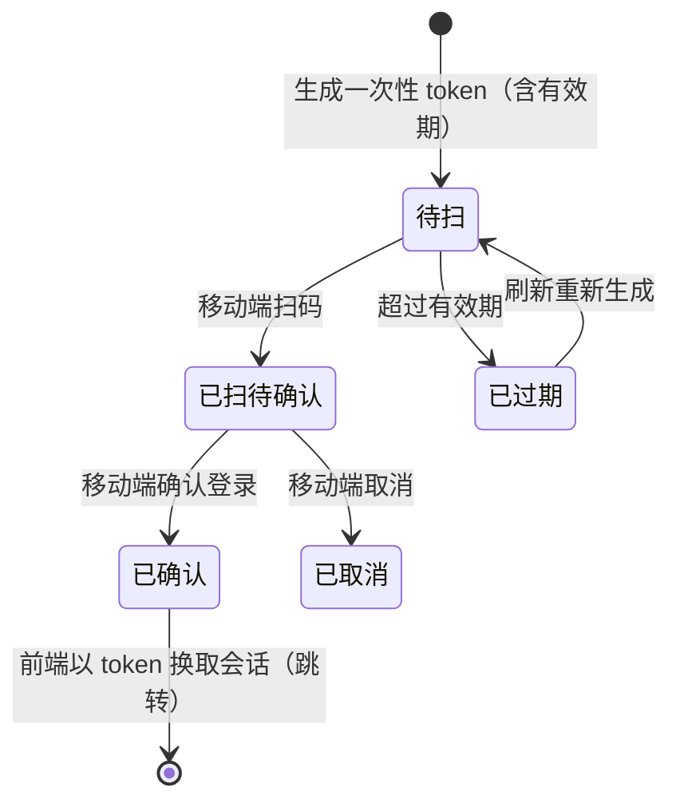

# 组件设计 · 二维码

> 二维码生成与状态展示：内容 / 尺寸 / 容错 / 配色 / 居中 logo / 下载与复制 / 过期遮罩与刷新 / 扫码登录状态机（可选）
> 实现侧命名与落点见《[前端基类清单](../../../../前端基类清单.md)》，实现契约细节见项目详细设计。

[文档首页](../../../../文档首页.md) › [项目规划说明](../../../../规划/项目规划说明.md) › [组件设计](../../01_组件设计_总览.md) › 二维码　|　[← 头像与用户信息](../12_组件设计_头像与用户信息/12_组件设计_头像与用户信息.md)　[水印 →](../14_组件设计_水印/14_组件设计_水印.md)

> 可交互原型：[13_原型设计_二维码.html](13_原型设计_二维码.html)（演示真实二维码生成、尺寸/容错/前景背景色/居中 logo、下载、扫码登录状态机与轮询/过期）

## 1. 目的与适用范围 

定义 BMS 前端 **二维码**的组件设计：二维码件（内容/URL 生成、尺寸、容错级别、前景背景色、居中 logo、下载/复制、过期遮罩）与生成编排（生成、下载、刷新/过期、可选状态轮询）。适用于**扫码登录**（可选能力）、**分享链接/内容二维码**（公告、帮助文章、报表、单据分享）、**资产/单据二维码**、**移动端扫码对接入口**。

本节对应[《项目规划说明》](../../../../规划/项目规划说明.md)技术选型与前端章节；上游设计依据[《概要设计 · 身份认证 SSO》](../../../概要设计/26_概要设计_身份认证SSO.md)（SSO 登录；扫码登录为可选扩展）、[《概要设计 · 公告管理》](../../../概要设计/18_概要设计_公告管理.md)/[《概要设计 · 帮助中心》](../../../概要设计/17_概要设计_帮助中心.md)（内容分享）、[《概要设计 · 报表中心》](../../../概要设计/27_概要设计_报表中心.md)（报表分享）；视觉依据[《布局设计 · 设计令牌》](../../../布局设计/02_布局设计_设计令牌.html)（尺寸、颜色、圆角）；协作节点为[基础类「格式化工具」](../../09_基础类/03_组件设计_格式化工具/03_组件设计_格式化工具.md)（复制文本）、[展示类「异常与空状态」](../05_组件设计_异常与空状态/05_组件设计_异常与空状态.md)（生成失败/过期/空态）。

> 本篇为「二维码」节点。**范围边界**：**扫码登录**为**可选能力**（是否启用取决于 IdP/登录策略与上游确认，登记项②），本节点提供二维码展示与状态展示；**分享的业务内容与链接**归各业务模块；**移动端扫码（相机读取）**为移动端工程独立能力，本节点不覆盖；二维码**内容的安全性**（不编码敏感信息）由调用方保证；移动端展示按需实现（见第 2 / 9 节）。

## 2. 职责与组成 

| 组成部分 | 职责 |
| --- | --- |
| 二维码件 | 按内容/URL 生成、尺寸、容错级别、前景/背景色、居中 logo、下载/复制、过期遮罩与刷新、可选状态展示（扫码登录） |
| 生成编排（随组件内聚） | 生成（前端生成库）、下载（PNG/SVG）、刷新与过期控制、可选轮询（扫码状态） |

- **生成方式**：前端生成，**独立分包懒加载**；登录页/分享弹窗按需加载，不进首屏主包（登记项①）。

## 3. 交互与契约语义 

| 语义项 | 说明 |
| --- | --- |
| 编码内容 | `value`：URL/文本；为空不渲染并提示 |
| 尺寸 | `size`：默认 160；扫码登录档 200，分享档 160，紧凑档 120 |
| 容错级别 | `level`：`L` / `M` / `Q` / `H`（含 logo 时建议 H） |
| 前景/背景色 | `fgColor` / `bgColor`：引用设计令牌，保证对比度 |
| 居中 logo | `logo`：图片地址；建议 ≤ 尺寸 1/5 |
| 下载与复制 | `downloadable`：是否可下载（默认开，位图/矢量图）；`copyable`：是否可复制内容 |
| 状态 | `status`：`active` / `expired` / `scanning` / `confirmed` / `failed`（扫码登录用；`expired` 显示遮罩 + 刷新） |
| 轮询 | `pollable`：是否轮询状态（扫码登录）；`pollInterval`：轮询间隔；`expiresIn`：有效期（秒，0 = 不自动过期） |
| 交互 | 过期/手动刷新（`refresh`）、下载（`download`）、轮询状态变化（`status-change`：scanning/confirmed/expired/failed） |
| 对外语义 | 刷新、下载（位图/矢量图）、取图片数据地址 |

## 4. 生成与渲染 

| 项 | 设计 |
| --- | --- |
| 内容 | `value` 为 URL/文本；为空时显示占位提示（不生成） |
| 容错级别 | `L/M/Q/H`；含 logo 用 `H` 保证可扫 |
| 颜色 | 前景/背景引用令牌，保证对比度；**背景不可透明**（部分扫码器不识别） |
| logo | 居中叠加（建议 ≤ 1/5 尺寸），高容错；logo 加载失败则无 logo 渲染 |
| 尺寸 | 按场景档位；容器窄时缩放展示（不改变生成尺寸） |
| 下载 | 导出位图（PNG）或矢量图（SVG，清晰） |
| 复制 | 复制编码内容（[基础类「格式化工具」](../../09_基础类/03_组件设计_格式化工具/03_组件设计_格式化工具.md) 剪贴板工具） |
| 安全 | 不编码敏感信息（密码/token 明文）；扫码登录用**一次性短时 token**（不是用户凭据） |

## 5. 扫码登录状态机（可选） 

| 状态 | 展示 |
| --- | --- |
| 待扫 `active` | 正常二维码 + 「请用移动端扫码」 |
| 已扫待确认 `scanning` | 二维码上覆盖「已扫码，请在移动端确认」 |
| 已确认 `confirmed` | 成功态，换取会话并跳转 |
| 已过期 `expired` | 遮罩「二维码已过期」+ 刷新按钮（`refresh`） |
| 失败 `failed` | 提示并允许刷新；扫码登录为可选能力，未启用时不展示 |

- **轮询**：`pollable` 时按 `pollInterval` 轮询状态（页面不可见暂停）；`confirmed` 后以 token 换取会话；token 一次性、短时有效。
- **安全**：轮询与换取会话接口防重放；不在二维码中放置用户名/密码。

## 6. 生成与过期编排 

| 语义项 | 说明 |
| --- | --- |
| 生成 | 按需加载生成库后生成图片数据；内容为空不生成 |
| 过期 | `expiresIn` 倒计时，到点置过期（并停止轮询）；刷新重新生成 |
| 轮询 | 轮询存在时按间隔轮询，页面不可见时暂停；已确认/已过期停止 |
| 下载 | 位图/矢量图导出；文件名含业务标识 |
| 释放 | 卸载停止轮询与定时器 |

## 7. 场景集成 

| 场景 | 说明 |
| --- | --- |
| 扫码登录 | 登录页可选入口（状态机 + 轮询 + 过期刷新）；是否启用由上游确认 |
| 分享链接/内容 | 公告、帮助文章、报表、单据分享弹窗内二维码 |
| 资产/单据二维码 | 打印在单据/标签上（下载矢量图高清） |
| 移动端扫码 | 移动端相机扫码为移动端工程独立能力（本节点只提供展示） |
| 移动端渲染 | 按需实现（尺寸与内容同源） |

## 8. 依赖接口与上游变更 

### 8.1 上游接口与口径 

| 项 | 说明 | 目标文档 |
| --- | --- | --- |
| 生成库 | 前端二维码生成库（懒加载、独立分包） | [《项目规划说明》](../../../../规划/项目规划说明.md)技术栈（登记项①） |
| 扫码登录（可选） | 一次性 token 生成/轮询/换取会话 | [《概要设计 · 身份认证 SSO》](../../../概要设计/26_概要设计_身份认证SSO.md)（登记项②） |
| 尺寸/颜色 | 二维码尺寸档位、前景背景色（令牌）、logo 建议 | [《布局设计 · 设计令牌》](../../../布局设计/02_布局设计_设计令牌.html)（登记项③） |
| 分享 | 分享链接由业务模块提供；下载/复制 | [《概要设计 · 公告管理》](../../../概要设计/18_概要设计_公告管理.md)等 |
| 新增依赖 | **是**：前端二维码生成库（独立分包懒加载） | [《项目规划说明》](../../../../规划/项目规划说明.md)（登记项①） |

### 8.2 需登记的上游变更 

| 变更点 | 目标文档 | 内容 |
| --- | --- | --- |
| ① 新增二维码生成库 | [《项目规划说明》](../../../../规划/项目规划说明.md)技术栈表与说明节 | 新增前端二维码生成库（MIT 许可，离线可用）；二维码组件**独立分包懒加载**，不进首屏主包 |
| ② 扫码登录可选能力 | [《概要设计 · 身份认证 SSO》](../../../概要设计/26_概要设计_身份认证SSO.md)「功能点分解」「接口设计」节 | 明确「扫码登录」为**可选扩展**（默认不启用，需确认）；启用时定义一次性 token 生成/轮询/换取会话接口、状态机（待扫/已扫待确认/已确认/过期/失败）与安全（防重放、短时、不含凭据） |
| ③ 二维码尺寸与颜色令牌 | [《布局设计 · 设计令牌》](../../../布局设计/02_布局设计_设计令牌.html)「图标与图片」节 | 补二维码尺寸档位（120/160/200）、前景/背景色引用令牌（保证对比、背景不透明）、居中 logo 建议（≤ 1/5、高容错）口径 |

> 按[《文档生成规范》](../../../../规范/文档生成规范.md)「引用与追溯」节，上述变更需用户确认后由上游文档同步；本节点只定义组件契约，不单独裁决技术选型与扫码登录接口。

## 9. 权限 / i18n / 移动端 

- **权限**：二维码内容/分享按其所属业务权限（分享链接受目标资源权限）；扫码登录为登录态前能力；下载/复制不额外鉴权（内容本身已授权）。
- **i18n**：提示文案（请扫码/已扫码待确认/已过期/刷新）走全局语言能力；内容不翻译。
- **移动端**：**展示**在移动端按需实现（尺寸与内容同源）；**扫码（相机读取）**为移动端工程独立能力，本节点不覆盖。

## 10. 性能与边界 

| 场景 | 设计 |
| --- | --- |
| 分包 | 生成库懒加载、独立分包；仅生成时加载 |
| 生成 | 短内容即时生成；长内容（URL + 参数）仍毫秒级；生成失败提示重试 |
| 轮询 | 页面不可见暂停；终态停止；`pollInterval` 可配，避免频繁请求 |
| 过期 | 倒计时到点置过期并停止轮询；刷新重新生成（内容可动态） |
| 边界 | 内容为空、内容过长（超容量）、对比度不足、背景透明、logo 过大导致不可扫、过期/刷新、生成库加载失败、轮询失败/超时、扫码登录未启用 |
| 不支持 | 移动端相机扫码、扫码登录接口实现（后端/可选）、分享业务逻辑（各模块）、移动端宿主装配（各端工程） |

## 11. 检查清单 

- □ 组成分层：二维码件展示与下载、生成编排（生成/过期/轮询）；生成库懒加载
- □ 生成：内容/URL、容错级别、前景背景色（令牌、背景不透明）、居中 logo（≤1/5、高容错）、尺寸档位
- □ 下载（PNG/SVG）、复制内容（可选）、内容为空占位、生成失败重试
- □ 扫码登录（可选）：状态机（待扫/已扫待确认/已确认/过期/失败）、轮询（不可见暂停、终态停止）、过期刷新、一次性 token 安全
- □ 权限（内容所属权限）、i18n（提示文案）、移动端（展示；相机扫码归移动端工程）符合第 9 节
- □ 性能边界：分包懒加载、轮询暂停/停止、过期倒计时、长内容、对比度
- □ 三项上游登记已确认：新增二维码生成库、扫码登录可选能力、尺寸与颜色令牌

> 组件设计节点 · 与[《概要设计 · 身份认证 SSO》](../../../概要设计/26_概要设计_身份认证SSO.md)[《概要设计 · 公告管理》](../../../概要设计/18_概要设计_公告管理.md)[《概要设计 · 帮助中心》](../../../概要设计/17_概要设计_帮助中心.md)[《布局设计 · 设计令牌》](../../../布局设计/02_布局设计_设计令牌.html)[展示类「异常与空状态」](../05_组件设计_异常与空状态/05_组件设计_异常与空状态.md)[基础类「格式化工具」](../../09_基础类/03_组件设计_格式化工具/03_组件设计_格式化工具.md)《命名规范》配套
