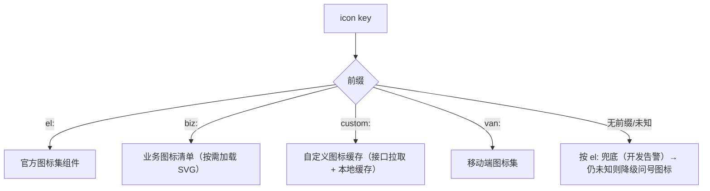

# 组件设计 · 图标选择器

> 图标的选择、解析渲染与清单管理：搜索 / 分类 / 网格 / 最近使用 / 已选预览 / 多来源解析与降级 / 自定义图标维护
> 实现侧命名与落点见《[前端基类清单](../../../../前端基类清单.md)》，实现契约细节见项目详细设计。

[文档首页](../../../../文档首页.md) › [项目规划说明](../../../../规划/项目规划说明.md) › [组件设计](../../01_组件设计_总览.md) › 图标选择器　|　[← 审批流展示](../02_组件设计_审批流展示/02_组件设计_审批流展示.md)　[代码表达式编辑器 →](../04_组件设计_代码表达式编辑器/04_组件设计_代码表达式编辑器.md)

> 可交互原型：[03_原型设计_图标选择器.html](03_原型设计_图标选择器.html)（演示图标选择器搜索/分类/网格/最近使用/已选预览、只读渲染器解析与降级、图标清单浏览与自定义图标管理、SVG 安全提示）

## 1. 目的与适用范围 

定义 BMS 前端 PC 管理端**图标选择与渲染**的组件设计：图标选择件（搜索、分类、网格、最近使用、已选预览）、只读渲染件（按 icon key 统一解析渲染）、图标清单管理件（浏览/搜索/复制、租户自定义图标增删改启停与引用检查），以及图标注册表语义（内置清单、动态解析、分类与搜索、最近使用、自定义图标缓存）。适用于**菜单图标**、**首页工作台快捷入口/卡片图标**、**帮助/公告分类图标**与**图标清单管理页**（PC 管理端）。

本节对应[《项目规划说明》](../../../../规划/项目规划说明.md)技术选型（官方图标集）；视觉与来源依据[《布局设计 · 设计令牌》](../../../布局设计/02_布局设计_设计令牌.html)「图标与图片」节（PC 用平台官方图标集、业务图标自绘随代码维护、图标尺寸随字号 14/16/20px）；上游设计依据[《概要设计 · 菜单管理》](../../../概要设计/07_概要设计_菜单管理.md)（`sys_menu.icon` 字段与菜单维护）、[《概要设计 · 首页工作台》](../../../概要设计/35_概要设计_首页工作台.md)（快捷入口/卡片图标）；协作节点为[文件上传字段](../../06_字段类/06_组件设计_文件上传字段/06_组件设计_文件上传字段.md)（自定义图标 SVG 上传）、[富文本字段](../../06_字段类/07_组件设计_富文本字段/07_组件设计_富文本字段.md)（SVG 清洗口径参照）、[弹窗抽屉表单](../../04_容器组件类/01_组件设计_弹窗抽屉表单/01_组件设计_弹窗抽屉表单.md)（自定义图标编辑弹窗）、[通用表格](../../07_展示类/01_组件设计_通用表格/01_组件设计_通用表格.md)（清单/引用表格）、[请求封装](../../09_基础类/01_组件设计_请求封装/01_组件设计_请求封装.md)（自定义图标取数）、[权限指令](../../09_基础类/02_组件设计_权限指令/02_组件设计_权限指令.md)（`icon:manage`）、[格式化工具](../../09_基础类/03_组件设计_格式化工具/03_组件设计_格式化工具.md)（搜索归一）。

> 本篇为「图标选择器」节点。**范围边界**：图标**资源本身**（平台官方图标、业务自绘 SVG）由官方图标集与发布流程随代码维护，本节点只负责**选取、解析渲染与清单管理**；SVG 上传的存储/分片归 [文件上传字段](../../06_字段类/06_组件设计_文件上传字段/06_组件设计_文件上传字段.md)；SVG 内容安全清洗属后端与渲染方（参照 [富文本字段](../../06_字段类/07_组件设计_富文本字段/07_组件设计_富文本字段.md)白名单净化口径）；菜单/卡片的其他字段维护归各自页面；移动端不复用 PC 件（见第 10 节）。

## 2. 职责与组成 

| 组成部分 | 职责 |
| --- | --- |
| 图标选择件 | 弹层、关键词搜索、分类 Tab、图标网格、悬浮名称、已选预览、最近使用、清除与校验 |
| 只读渲染件 | 按 icon key 动态解析平台官方 / 业务自绘 / 租户自定义图标并渲染，未知 key 降级 + 告警 |
| 图标清单管理件 | 内置/业务/自定义图标浏览与搜索、复制 icon key、引用计数；租户自定义图标新增（上传 SVG）/编辑/启停/删除（引用检查） |
| 图标注册表语义 | 内置清单、动态解析、分类、搜索、最近使用缓存、自定义图标注册与缓存、key→图标映射 |
| 继承链 | 本节点各件 → 组件根 → 根系；注册表等体系公共机制复用机制基类，横切能力为**继承链上的能力层**；主体内建走继承轨，行为在链上层维护、不在件内重复实现 |

- 所有渲染图标的入口统一走只读渲染件（或注册表解析），避免各处各自引用图标；尺寸统一走设计令牌（14/16/20px，[《布局设计 · 设计令牌》](../../../布局设计/02_布局设计_设计令牌.html)）。

## 3. 图标清单与取值格式 

### 3.1 icon key 取值格式 

统一以**带前缀的 icon key** 标识图标来源，避免多来源同名冲突：

| 来源 | 前缀 | 格式 | 示例 | 载体 |
| --- | --- | --- | --- | --- |
| 平台官方 | `el:` | `el:{PascalCase}` | `el:User`、`el:Setting` | 官方图标集（PC） |
| 业务自绘（随代码发布） | `biz:` | `biz:{kebab-case}` | `biz:purchase-order`、`biz:receipt` | 随代码发布的业务 SVG + 清单 |
| 租户自定义（运行时） | `custom:` | `custom:{id}` | `custom:1024` | 后端 `sys_icon`（SVG），见登记项① |
| 移动端图标集（仅移动端） | `van:` | `van:{name}` | `van:todo-o` | 移动端图标集（不共用 PC 选择件） |

- 存储到业务的字段（如 `sys_menu.icon`、卡片配置）一律存**完整 icon key**；渲染时由注册表解析来源与图标。
- **兼容**：历史裸名（无前缀，如 `User`）在解析时按 `el:` 处理并给出开发环境告警，便于平滑迁移（登记项②）。

### 3.2 注册与解析 

- 内置官方图标清单按需引入（**图标选择独立分包懒加载**，见登记项④）。
- 业务自绘图标经业务图标清单**默认懒加载**，只在被解析或被清单页浏览时加载。
- 自定义图标由接口拉取（列表 + SVG 内容/URL），注册表缓存（内存 + 本地缓存，带版本失效）；解析失败/已删除 → 降级问号图标并告警。

## 4. 图标选择器 

### 4.1 交互与契约语义 

| 语义项 | 说明 |
| --- | --- |
| 选中值 | 选中的 icon key（`el:`/`biz:`/`custom:`），受控双向绑定 |
| 尺寸 | 触发框尺寸（对齐表单控件尺寸：小/默认/大） |
| 占位文案 | 占位文案（i18n） |
| 可清除 | 是否可清除 |
| 禁用 | 禁用（字段不可编辑时由表单传禁用） |
| 限定分类 | 限定分类（如仅 `menu` 可用集合）；缺省展示全部 |
| 含自定义 | 是否包含租户自定义图标 |
| 最近使用数量 | 最近使用展示数量（0 = 不展示） |
| 弹层挂载 | 弹层挂载 body（抽屉/弹窗内避免裁剪） |
| 触发形态 | 输入框（表单内）/ 按钮（工具栏） |
| 动作通知 | 选中/清除同步；值变化（含清除） |
| 扩展位 | 自定义触发元素（按钮形态时）；弹层底部附加（如「管理图标」入口，持 `icon:manage` 时链接到清单管理件） |
| 对外动作 | 打开 / 关闭 / 清除 |

### 4.2 交互与形态 

| 项 | 设计 |
| --- | --- |
| 展开 | 点击触发框打开弹层（挂载 body）；弹层含搜索框、分类 Tab、图标网格、最近使用 |
| 搜索 | 关键词按 **icon key/名称** 归一匹配（小写、去前缀、支持 kebab）返回结果；输入防抖 200ms；无结果空态 |
| 分类 | 分类 Tab（如「全部 / 菜单常用 / 方向 / 编辑 / 媒体 / 业务 / 自定义」）；分类由注册表提供，可由限定分类收窄 |
| 网格 | 图标网格（每行 8-10 个），悬浮显示图标名提示，点击选中并关闭；当前选中高亮 |
| 已选预览 | 触发框内显示图标 + icon key（可选）；弹层顶部展示「已选」 |
| 最近使用 | 按用户记录最近 N 个（本地按用户存储）；数量与是否展示由最近使用数量控制 |
| 清除 | 允许清除（可清除），清除后值为空 |
| 校验 | 表单校验规则 `icon` 校验 icon key 可解析；非法/未知 key 提示「图标不可用」 |
| 目录来源 | 候选来自注册表（内置 + 业务 + 自定义），自定义按「含自定义」决定是否出现 |

### 4.3 列表/工具栏场景 

- 菜单树内联编辑图标时用小尺寸；工具栏筛选/批量场景可用按钮触发形态。

## 5. 只读渲染器 

| 语义项 | 说明 |
| --- | --- |
| 图标名 | icon key（`el:`/`biz:`/`custom:`） |
| 尺寸 | 尺寸（数字 px 或令牌）；缺省按场景（内联 14、菜单 16、按钮 20） |
| 颜色 | 颜色（缺省继承 `currentColor`，用设计令牌变量） |
| 旋转 | 旋转（加载态） |
| 兜底图标 | 解析失败时的兜底图标 |

- **渲染策略**：`el:` → 官方图标集组件；`biz:` → 按需加载业务 SVG；`custom:` → 内联 SVG（运行时内容，经安全清洗）；未知 → 兜底图标 + 开发环境告警一次（同名去重）。
- **嵌入位置**：菜单项、按钮前置图标、卡片标题、状态/列表单元格、快捷入口宫格；全部走本件，保证多来源图标**统一尺寸、颜色与降级**。
- **无图标名时不渲染**（不占位）；颜色一律用设计令牌变量，不硬编码。

## 6. 图标清单管理 

### 6.1 清单浏览 

| 项 | 设计 |
| --- | --- |
| 来源分组 | 「平台图标」（`el:`）、「业务图标」（`biz:`）、「自定义图标」（`custom:`）分组展示，可切换 |
| 搜索/分类 | 关键词搜索 + 分类筛选；结果网格展示（名称 + 预览 + 来源标签） |
| 复制 key | 点击「复制 icon key」，便于配置菜单/卡片时粘贴 |
| 引用计数 | 展示该图标被菜单/卡片等引用次数（可选，数据来自引用扫描；点击查看引用明细） |
| 只读范围 | 平台/业务图标随代码维护，管理页**只读浏览**（新增/修改走发布流程） |

### 6.2 自定义图标管理（租户级） 

| 操作 | 行为 | 权限 |
| --- | --- | --- |
| 新增 | 上传 SVG + 填写名称（icon key 的 kebab 段）/分类/标签 + 预览 → 保存（`custom:{id}`） | `icon:manage` |
| 编辑 | 修改名称/分类/标签、替换 SVG | `icon:manage` |
| 启停 | 停用后不在选择器候选与渲染清单中出现（已引用的按降级处理） | `icon:manage` |
| 删除 | **引用检查**：被菜单/卡片引用时提示先解除引用或用「停用」代替（不可直接删除） | `icon:manage` |

- **上传要求**：仅 SVG（类型白名单）、大小上限（如 100KB）；**SVG 内容安全清洗**（移除脚本/事件属性/外链，参照 [富文本字段](../../06_字段类/07_组件设计_富文本字段/07_组件设计_富文本字段.md)白名单净化口径），后端存储前清洗、前端内联渲染前再清洗（双向）。
- **名称与 i18n**：自定义图标名称支持多语言（登记项①附表 `sys_icon_i18n`，可选），列表按 locale 展示。
- **编辑弹窗**复用 [弹窗抽屉表单](../../04_容器组件类/01_组件设计_弹窗抽屉表单/01_组件设计_弹窗抽屉表单.md)表单对话框；列表/引用用 [通用表格](../../07_展示类/01_组件设计_通用表格/01_组件设计_通用表格.md)。

## 7. 图标注册表语义 

| 项 | 设计 |
| --- | --- |
| 注册项语义 | 完整 icon key、展示名（官方图标为专有名，自定义为名称）、来源（`el`/`biz`/`custom`/`van`）、分类、标签（搜索用） |
| 内置清单 | 官方图标清单（构建期生成）+ 业务图标清单（按需加载） |
| 自定义清单 | 运行时拉取（`GET /api/v1/icons`），缓存 + 版本失效；登录后/进入列表页时加载 |
| 解析缓存 | 已解析图标内存缓存；未知 key 缓存降级结果并**告警一次** |
| 最近使用 | 本地按用户存储，去重、上限（默认 24），写入防抖 |
| 搜索 | 归一（小写、去前缀、kebab/Pascal 互转）+ 名称/标签匹配；大清单先在注册表层过滤再渲染 |

## 8. 场景集成 

| 场景 | 用法 | 说明 |
| --- | --- | --- |
| 菜单管理（`sys_menu.icon`） | 图标选择件（限定 `menu` 分类） | 选了 key 存库，菜单树用只读渲染件渲染（[《概要设计 · 菜单管理》](../../../概要设计/07_概要设计_菜单管理.md)） |
| 首页工作台快捷入口/卡片 | 图标选择件 + 只读渲染件 | 快捷入口宫格图标、卡片标题图标 |
| 帮助/公告分类 | 图标选择件 | 分类图标维护 |
| 图标清单管理页 | 图标清单管理件 | 浏览/搜索/复制；自定义图标增删改启停 |
| 表单定制字段属性 | 图标选择件（可选） | 字段只读展示形态的图标（若启用） |
| 移动端 | 移动端图标集（`van:`） | 不复用 PC 选择件与渲染件；同源 icon key 口径，配置侧仍存 `el:`/`biz:` 时移动端做映射或降级 |

## 9. 依赖接口与上游变更 

### 9.1 上游接口与口径 

| 项 | 说明 | 目标文档 |
| --- | --- | --- |
| 菜单图标字段 | `sys_menu.icon` 存 icon key；菜单维护页用图标选择件 | [《概要设计 · 菜单管理》](../../../概要设计/07_概要设计_菜单管理.md)（登记项①） |
| 自定义图标 | `sys_icon`（租户库）与接口 `/api/v1/icons`（列表/新增/编辑/启停/删除）；SVG 上传与清洗 | [《概要设计 · 菜单管理》](../../../概要设计/07_概要设计_菜单管理.md)（登记项①） |
| 权限 | 清单浏览登录可见；自定义管理 `icon:manage` | [《概要设计 · 菜单管理》](../../../概要设计/07_概要设计_菜单管理.md)、[权限指令](../../09_基础类/02_组件设计_权限指令/02_组件设计_权限指令.md)（登记项①） |
| icon key 口径 | `el:`/`biz:`/`custom:` 前缀、解析与降级、尺寸 14/16/20px | [《布局设计 · 设计令牌》](../../../布局设计/02_布局设计_设计令牌.html)（登记项②） |
| 命名 | icon key 命名约定（前缀 + 风格） | [《命名规范》](../../../../规范/命名规范.md)（登记项③） |
| 依赖引入 | 官方图标集按需引入 + 图标选择独立分包懒加载；业务 SVG 按需加载 | [《架构设计 · 前端架构》](../../../架构设计/08_架构设计_前端架构.md)（登记项④） |
| 上传安全 | SVG 白名单、大小上限、内容清洗（移除脚本/事件/外链） | [《架构设计 · 文件管理》](../../../架构设计/20_架构设计_子系统_文件管理.md)、[富文本字段](../../06_字段类/07_组件设计_富文本字段/07_组件设计_富文本字段.md) |

### 9.2 需登记的上游变更 

| 变更点 | 目标文档 | 内容 |
| --- | --- | --- |
| ① 图标 key 与自定义图标管理 | [《概要设计 · 菜单管理》](../../../概要设计/07_概要设计_菜单管理.md)「核心表」「接口设计」「功能点分解」节 | `sys_menu.icon` 明确存 **icon key**（`el:`/`biz:`/`custom:`）；新增租户库表 `sys_icon`（`id`、`code`、`name`、`category`、`tags`、`svg`（或文件引用）、`status`、审计字段，可配 `sys_icon_i18n` 名称多语言）与接口 `GET/POST/PUT/DELETE /api/v1/icons`（列表/新增/编辑/启停/删除），删除时做**引用检查**；新增动作权限码 `icon:manage`（自定义图标维护，默认归属系统管理员），清单浏览登录即可 |
| ② 设计令牌补图标取值与解析口径 | [《布局设计 · 设计令牌》](../../../布局设计/02_布局设计_设计令牌.html)「图标与图片」节 | 补「icon key 取值格式（`el:`/`biz:`/`custom:`）」「统一经只读渲染件渲染、未知 key 降级问号 + 告警」「尺寸 14/16/20px 与颜色用令牌变量」；明确业务图标随代码发布与运营期自定义图标的边界 |
| ③ 命名规范补 icon key 命名 | [《命名规范》](../../../../规范/命名规范.md)「前端命名」节 | 补充 icon key 命名：前缀 `el:`/`biz:`/`custom:`/`van:`；`biz:` 段 kebab-case（与业务 SVG 文件名一致）；自定义图标 `code` kebab-case 唯一 |
| ④ 前端图标引入与分包 | [《架构设计 · 前端架构》](../../../架构设计/08_架构设计_前端架构.md)「技术要点」「前端性能」节 | 官方图标集按需引入；图标选择件/清单页（需全量图标）独立分包懒加载；业务自绘 SVG 按需加载；自定义图标运行时拉取 + 本地缓存 |

> 按[《文档生成规范》](../../../../规范/文档生成规范.md)「引用与追溯」节，上述变更需用户确认后由上游文档同步；本节点只定义组件语义与契约，不单独裁决表结构与权限码。

## 10. 权限 / i18n / 移动端 

- **权限**：图标清单浏览登录即可；自定义图标的新增/编辑/启停/删除需 `icon:manage`（按钮按动作权限显隐）；图标选择件的「管理图标」入口按权限显示（[权限指令](../../09_基础类/02_组件设计_权限指令/02_组件设计_权限指令.md)）；SVG 上传与清洗由后端兜底。
- **i18n**：图标分类名、按钮、占位、空态、告警文案走全局语言能力；官方图标名不翻译（专有名）；`biz:`/`custom:` 图标名称按 locale 下发（`sys_icon_i18n`，可选）；搜索支持中文别名（标签）。
- **移动端**：不复用 PC 图标选择件/只读渲染件；移动端用移动端图标集（`van:`）与内联 SVG 渲染；配置侧 icon key 在移动端做**映射或降级**（`el:`/`biz:` 映射到相近移动端图标或自绘 SVG）；移动端不做清单管理页。

## 11. 性能与边界 

| 场景 | 设计 |
| --- | --- |
| 图标数量 | 官方图标约 300+，网格按可视区分片/虚拟滚动渲染；搜索在注册表层过滤后再渲染 |
| 分包 | 全量图标库仅图标选择件/清单页需要 → 独立分包懒加载；常规页面只按名引用的图标随业务分包 |
| 业务 SVG | 业务图标清单按需加载，仅在解析或浏览时加载对应 SVG，不一次性进主包 |
| 自定义图标 | 接口拉取 + 内存/本地缓存（版本失效）；不在每次渲染请求 |
| 渲染缓存 | 解析结果缓存；未知 key 降级结果缓存并去重告警 |
| 搜索 | 输入防抖 200ms；归一化（小写、去前缀、kebab/Pascal 互转） |
| 边界 | 未知 key（降级 + 告警）、已停用/删除的自定义图标（引用处降级问号）、无搜索结果（空态）、同名冲突（前缀区分）、历史裸名（按 `el:` 兼容）、清除后为空、SVG 超限/含脚本（拒绝 + 清洗）、最近使用超限（裁剪）、弹层在抽屉内的层级 |
| 不支持 | 引入外部多图标库（离线/体积成本）、运行时图标代码编辑、移动端清单管理 |

## 12. 检查清单 

- □ 组件分层：图标选择件选取、只读渲染件只读渲染、图标清单管理件清单管理、图标注册表解析与缓存，职责不重叠
- □ icon key 格式统一（`el:`/`biz:`/`custom:`/`van:`），存储存完整 key；历史裸名按 `el:` 兼容并告警
- □ 选择器：搜索（防抖/归一）、分类 Tab、网格（分片/虚拟滚动）、悬浮名称、已选预览、最近使用、清除、校验、弹层挂载
- □ 渲染器：多来源解析、统一尺寸（14/16/20）与令牌颜色、未知 key 降级问号 + 去重告警、无图标名不渲染
- □ 清单管理：来源分组、搜索/分类、复制 key、引用计数；自定义图标增删改启停 + **引用检查** + SVG 白名单/大小/双向清洗
- □ 注册表：内置清单 + 业务图标清单按需加载 + 自定义缓存（版本失效）、解析缓存、最近使用用户维度
- □ 权限（`icon:manage`）、i18n（分类/文案/名称多语言，官方图标名不翻译）、移动端（移动端图标 + 映射/降级）符合第 10 节
- □ 性能边界：图标选择独立分包、业务 SVG 按需加载、自定义图标缓存、搜索防抖、未知/失效 key 降级
- □ 四项上游登记已确认：icon key 与自定义图标管理（`sys_icon`/`icon:manage`）、设计令牌图标取值口径、命名规范 icon key、前端图标引入与分包

> 组件设计节点 · 与[《布局设计 · 设计令牌》](../../../布局设计/02_布局设计_设计令牌.html)[《概要设计 · 菜单管理》](../../../概要设计/07_概要设计_菜单管理.md)[《概要设计 · 首页工作台》](../../../概要设计/35_概要设计_首页工作台.md)[《架构设计 · 前端架构》](../../../架构设计/08_架构设计_前端架构.md)[文件上传字段](../../06_字段类/06_组件设计_文件上传字段/06_组件设计_文件上传字段.md)[富文本字段](../../06_字段类/07_组件设计_富文本字段/07_组件设计_富文本字段.md)[弹窗抽屉表单](../../04_容器组件类/01_组件设计_弹窗抽屉表单/01_组件设计_弹窗抽屉表单.md)[权限指令](../../09_基础类/02_组件设计_权限指令/02_组件设计_权限指令.md)[格式化工具](../../09_基础类/03_组件设计_格式化工具/03_组件设计_格式化工具.md)《命名规范》配套
