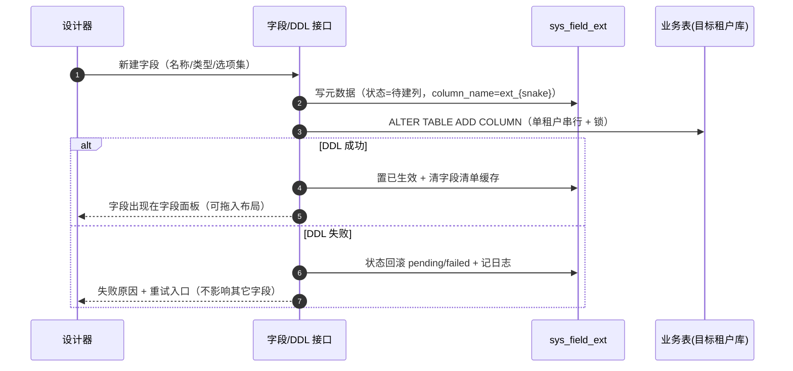

# 组件设计 · 表单设计器

> FormDesigner · FieldPanel · DesignerCanvas · FieldPropertyPanel · ExtFieldDialog · useFormDesigner

[文档首页](../../../../文档首页.md) › [项目规划说明](../../../../规划/项目规划说明.md) › [组件设计](../../01_组件设计_总览.md) › 表单设计器　|　[← 代码表达式编辑器](../04_组件设计_代码表达式编辑器/04_组件设计_代码表达式编辑器.md)　[流程建模器 →](../06_组件设计_流程建模器/06_组件设计_流程建模器.md)

> 可交互原型：[05_原型设计_表单设计器.html](05_原型设计_表单设计器.html)（演示三区结构、字段拖拽入画布与分区内排序、分区列数/跨列、字段属性面板、租户自建字段、查询区/明细区配置、三级层级与保存发布、脏数据拦截）

## 1. 目的与适用范围 <a id="purpose"></a>

定义 BMS 前端 `frontend/` **表单设计器**的组件设计：总容器 `FormDesigner.vue`（工具栏 + 三区布局 + 层级切换 + 保存/发布/恢复），字段面板 `FieldPanel.vue`，布局画布 `DesignerCanvas.vue`（分区/分组、列数、跨列、顺序、实时预览），字段属性面板 `FieldPropertyPanel.vue`，自建字段对话框 `ExtFieldDialog.vue`，以及组合式函数 `useFormDesigner.ts`（布局模型、拖拽、层级、保存发布、脏数据）。适用于**表单定制**模块的在线布局设计（PC 管理端）。

本节对应[《项目规划说明》](../../../../规划/项目规划说明.md)「功能模块」之**表单定制**模块；上游设计依据[《概要设计 · 表单定制》](../../../概要设计/36_概要设计_表单定制.md)（三级布局解析、字段属性、租户自建字段动态 DDL、服务端动态校验）与[《架构设计 · 表单定制》](../../../架构设计/28_架构设计_子系统_表单定制.md)（布局体系、`sys_form_layout`/`sys_field_ext`、前端设计器架构）；页面形态依据[《布局设计 · 表单定制》](../../../布局设计/14_布局设计_表单定制.html)「设计器布局与交互」「字段属性面板」「租户自建字段」「查询表单区与明细区配置」「渲染规则」节，以及[《布局设计 · 表单页》](../../../布局设计/08_布局设计_表单页.html)（渲染器三态与栅格口径）、[《布局设计 · 列表页》](../../../布局设计/07_布局设计_列表页.html)（查询区折叠）、[《布局设计 · 表格明细》](../../../布局设计/09_布局设计_表格明细.html)（明细列配置）；协作节点为[01 字典字段](../../06_字段类/01_组件设计_字典字段/01_组件设计_字典字段.md)～[08 开关与枚举字段](../../06_字段类/08_组件设计_开关与枚举字段/08_组件设计_开关与枚举字段.md)（字段组件按 type 渲染）、[05 展示类 01 通用表格](../../07_展示类/01_组件设计_通用表格/01_组件设计_通用表格.md)（明细区/查询区列配置口径）、[05 展示类 03 状态标签与描述列表](../../07_展示类/03_组件设计_状态标签与描述列表/03_组件设计_状态标签与描述列表.md)（只读形态）、[03_交互类 01 弹窗抽屉表单](../../04_容器组件类/01_组件设计_弹窗抽屉表单/01_组件设计_弹窗抽屉表单.md)（自建字段/布局命名弹窗、脏数据拦截）、[03_交互类 04 图标选择器](../03_组件设计_图标选择器/03_组件设计_图标选择器.md)（字段只读展示形态图标，可选）、[03_交互类 02 导入导出](../01_组件设计_导入导出/01_组件设计_导入导出.md)（导入模板列联动）；基础类 [04_基础类 01 请求封装](../../09_基础类/01_组件设计_请求封装/01_组件设计_请求封装.md)（保存/发布/DDL 请求）、[04_基础类 03 格式化工具](../../09_基础类/03_组件设计_格式化工具/03_组件设计_格式化工具.md)（`stableStringify` 脏数据比对）。

> 本篇为组件设计体系交互类第 06 篇。**范围边界**：**服务端**动态校验、DDL 执行、三级解析与缓存归[《架构设计 · 表单定制》](../../../架构设计/28_架构设计_子系统_表单定制.md)与[《概要设计 · 表单定制》](../../../概要设计/36_概要设计_表单定制.md)；**字段组件本体**归字段类节点 01-08，设计器只做选择与属性绑定；**业务表单页/列表页的渲染器**按布局渲染（其栅格/三态口径归[《布局设计 · 表单页》](../../../布局设计/08_布局设计_表单页.html)，本节点提供设计态的画布预览）；流程建模器等其它设计器各自成篇；移动端不提供设计器（见第 12 节）。

## 2. 组件清单与职责 <a id="components"></a>

| 组件 / 工具 | 位置 | 职责 |
| --- | --- | --- |
| `FormDesigner.vue` | `src/components/form-designer/` | 总容器：工具栏（表单选择、三级层级、保存/发布/恢复默认）、三区布局装配、视图切换（主表/查询区/明细区）、脏数据拦截、加载与空态 |
| `FieldPanel.vue` | `src/components/form-designer/` | 字段面板：平台字段（`sys_field`）+ 租户自建字段（`sys_field_ext`）分组展示、搜索、拖拽源、新建自定义字段入口、字段状态标记（停用/建列失败） |
| `DesignerCanvas.vue` | `src/components/form-designer/` | 布局画布：分区/分组容器、分区列数（1/2/3）、字段跨列、分区内与跨分区拖拽排序、字段行内操作（删除/跨列/选中）、实时预览（与真实渲染器同源） |
| `FieldPropertyPanel.vue` | `src/components/form-designer/` | 属性面板：选中字段的必填/默认值/提示/校验规则/组件类型/选项集/只读/隐藏；分区属性（标题/列数）；查询区/明细区配置 |
| `ExtFieldDialog.vue` | `src/components/form-designer/` | 新建自定义字段：名称（含 i18n）/类型/选项集/列名预览（只读 `ext_` 前缀）、保存触发后端 DDL、DDL 状态与重试 |
| `useFormDesigner.ts` | `src/utils/useFormDesigner.ts` | 组合式函数：布局模型（分区/字段）、字段清单取数、层级状态、拖拽变更、属性更新、保存/发布/恢复、脏数据基线、空布局回退 |

- 命名遵循[《命名规范》](../../../../规范/命名规范.md)：组件 PascalCase、组合式函数 `use` + 名词；目录遵循[《前端开发规范》](../../../../规范/前端开发规范.md)（`src/components/` 按域分目录，设计器归 `form-designer/`；组合式函数放 `src/utils/`）。
- **画布与真实渲染器同源**（[《架构设计 · 表单定制》](../../../架构设计/28_架构设计_子系统_表单定制.md)「前端渲染与设计器架构」节）：画布复用表单页字段渲染组件与栅格口径，保证「所见即所得」；设计器只加拖拽/选中等编辑态包裹层。

## 3. 总体结构 <a id="layout"></a>

### 3.1 三区 + 工具栏 <a id="structure"></a>


| 区域 | 内容 |
| --- | --- |
| 工具栏 | 表单选择器（下拉选表单，切换前脏数据拦截）、三级层级切换、`保存`（primary）、`发布`（触发 `form.updated`）、`恢复默认`（二次确认，删除当前层级回退下一级） |
| 字段面板（左） | 平台字段 / 租户字段分组；搜索过滤；拖拽源；`＋ 新建自定义字段`；字段状态标记 |
| 布局画布（中） | 视图切换：**主表**（分区/分组）/ **查询区** / **明细区**；主表视图按下文 3.3 |
| 属性面板（右） | 随画布选中联动：字段属性 / 分区属性 / 查询区与明细区配置 |

### 3.2 布局模型（layout_config） <a id="model"></a>

```typescript
interface FormLayoutConfig {
  main: {
    labelPosition: 'top' | 'left';       // 标签位置（默认 top）
    labelWidth?: string;                 // labelPosition=left 时的标签宽度
    sections: LayoutSection[];           // 分区/分组
  };
  query?: { fields: QueryFieldRef[] };   // 查询表单区（列表页筛选）
  detail?: { columns: DetailColumnRef[] }; // 明细区（主从模块）
  dictAdvanced?: Record<string, any>;    // 字典高级查询界面配置（可选，见 01 字典字段）
}

interface LayoutSection {
  id: string; title: string;             // 分区标题（i18n）
  columns: 1 | 2 | 3;                    // 分区列数
  groups?: LayoutGroup[];                // 可选嵌套分组
  fields: LayoutFieldRef[];
}
interface LayoutFieldRef {
  fieldKey: string;                      // 引用 sys_field.key / sys_field_ext.key
  colSpan?: number;                       // 跨列（占满分区宽度）
  sort: number;                           // 分区内顺序
}
```

- 配置存 `sys_form_layout.layout_config`（[《架构设计 · 表单定制》](../../../架构设计/28_架构设计_子系统_表单定制.md)「布局体系」节）；设计器只编辑该 JSON 的**结构**部分，字段属性另存字段属性接口。
- **空布局回退**：`main.sections` 为空时按字段 `sort` 默认栅格渲染（与既有表单页行为一致，保证无配置可用）。
- 未知/失效字段引用在画布与渲染时**跳过不阻断**并提示清理。

### 3.3 主表画布 <a id="canvas"></a>

| 操作 | 交互 |
| --- | --- |
| 拖字段入画布 | 从字段面板拖入分区（`vuedraggable` 跨列表拖拽），落地即在分区末尾追加字段并选中 |
| 分区内排序 / 跨分区 | 分区内拖拽排序；跨分区拖动改变归属（`group` 与列表联动） |
| 新增/删除分区 | 分区标题栏「＋ 分区」；分区删除二次确认（含字段一并移出） |
| 分区列数 | 分区标题栏下拉 1/2/3 列，字段按 `el-col :span="24/columns"` 均分（对齐[《布局设计 · 表单页》](../../../布局设计/08_布局设计_表单页.html)） |
| 字段跨列 | 字段右上角「跨整行」开关 → `colSpan=24` |
| 字段行内操作 | 选中（属性面板联动）、跨列开关、移出分区（回字段面板，非删除字段定义） |
| 实时预览 | 画布即时按布局渲染字段组件（同渲染器）；不提交业务数据 |
| 标签位置 | 工具栏/属性面板切换 `top`/`left`（每个分区用统一标签位置） |

- 分组：> 8 字段建议分区；分区内可用分组小标题（`el-divider`）二级组织（对齐布局 14「分区/分组」要素）。

## 4. 字段面板 FieldPanel <a id="field-panel"></a>

| 项 | 设计 |
| --- | --- |
| 数据来源 | 合并 `sys_field`（平台字段）+ `sys_field_ext`（租户自建字段），随字段清单接口下发（[《架构设计 · 表单定制》](../../../架构设计/28_架构设计_子系统_表单定制.md)「数据与缓存」节） |
| 分组 | 「平台字段」「租户字段」；字段按 `sort` 升序 |
| 搜索 | 按字段名（i18n 当前 locale）过滤；无结果空态 |
| 拖拽 | 每个字段为 `vuedraggable` 拖拽项（`clone` 到画布，源不变） |
| 状态标记 | 已停用 → 置灰 + 「停用」标记（不可拖入新布局）；建列失败 → 「建列失败」+ 重试入口 |
| 已布局标识 | 已在画布中的字段显示「已使用」（可重复拖入同一分区？否——同一字段默认只能出现一次，拖入已存在时提示） |
| 新建入口 | 「＋ 新建自定义字段」打开 `ExtFieldDialog`，成功后在租户字段分组出现 |

## 5. 属性面板 FieldPropertyPanel <a id="property"></a>

| 选中对象 | 可编辑属性 |
| --- | --- |
| 字段 | 必填、默认值、提示文案、校验规则（长度/数值范围/正则）、组件类型、选项集（字典/自定义）、只读、隐藏 |
| 分区 | 分区标题（i18n）、列数、标签位置（若支持逐分区） |
| 画布（全局） | 标签位置、标签宽度 |
| 查询区 | 字段勾选与顺序（拖拽）、操作符/跨列（若提供） |
| 明细区 | 列显隐/顺序/宽度 |

- **组件类型切换**（[《布局设计 · 表单定制》](../../../布局设计/14_布局设计_表单定制.html)「字段属性面板」节）：文本/长文本/数字/日期/单选/多选/开关/文件；切换时做**值兼容性校验**（如多选→单选提示数据不兼容），并对齐[《概要设计 · 表单定制》](../../../概要设计/36_概要设计_表单定制.md)「组件类型与自建字段边界」节（如平台 `longtext` 可切富文本，租户自建富文本不放开）。
- **属性生效范围**：必填/默认值/校验等为平台/租户级（角色差异走布局显隐 + 字段权限）；「隐藏」= 永不渲染，区别于字段权限的按角色隐藏（[《架构设计 · 表单定制》](../../../架构设计/28_架构设计_子系统_表单定制.md)）。
- **保存一致性**：属性变化仅改配置不发版；服务端按配置动态校验（前端提示「前后端双重校验，保存即生效」）。
- 属性面板随画布选中联动；未选中显示画布/查询区/明细区配置入口。

## 6. 租户自建字段 ExtFieldDialog <a id="ext-field"></a>



| 项 | 设计 |
| --- | --- |
| 表单字段 | 名称（中/英文 i18n）、类型、选项集（仅下拉单选/多选）、列名预览（只读 `ext_{蛇形}`，不可手改，防冲突/注入） |
| 类型白名单 | 单行文本 / 长文本 / 数字 / 日期时间 / 下拉单选 / 下拉多选 / 开关 / 文件（对齐[《架构设计 · 表单定制》](../../../架构设计/28_架构设计_子系统_表单定制.md)「字段扩展机制」节；富文本不放开） |
| 列名生成 | 后端生成 `ext_{field_key 蛇形}`，前端仅展示预览 |
| 状态流转 | 待建列 → 已生效 / 失败；字段面板标记状态，失败给「重试」；重试复用同一元数据与列名 |
| 停用 | 停用不删列（数据保留）；重建同名字段复用物理列 |
| 校验 | 名称唯一、类型合法、选项集必填（下拉类）、名称多语言（`sys_field_ext_i18n`） |
| 权限 | `formdesign:manage`（[《概要设计 · 表单定制》](../../../概要设计/36_概要设计_表单定制.md)「权限与配置」节） |

- 分片表/平台库表禁止自建字段（后端拒绝，前端在入口按表单元数据禁用并提示）。

## 7. 查询区与明细区配置 <a id="query-detail"></a>

| 配置 | 说明 |
| --- | --- |
| 查询表单区 | 列表页筛选字段与顺序（拖拽）；默认取查询类字段前 3 项；≤ 3 不折叠、> 3 折叠「更多筛选」（对齐[《布局设计 · 列表页》](../../../布局设计/07_布局设计_列表页.html)与[05 展示类 02 查询筛选区](../../07_展示类/02_组件设计_查询筛选区/02_组件设计_查询筛选区.md)） |
| 明细区 | 主从模块明细列显隐/顺序/宽度（拖拽 + 宽度输入），仅定义租户级默认，用户个人偏好可覆盖（[《概要设计 · 用户喜好》](../../../概要设计/04_概要设计_用户喜好.md)） |
| 字典高级查询界面 | 可选配置（属性字段/操作符/默认方案/结果列），复用 `layout_config.dictAdvanced`（[01 字典字段](../../06_字段类/01_组件设计_字典字段/01_组件设计_字典字段.md)「高级查询」节） |

- 查询区/明细区在同一 `useFormDesigner` 状态内，随「保存」一并写入 `layout_config`。

## 8. 三级层级与保存/发布/恢复 <a id="levels"></a>

| 操作 | 行为 |
| --- | --- |
| 层级切换 | `平台默认`（租户管理员**只读预览**，不可编辑）/ `租户覆盖`（编辑生效于全租户）/ `角色视图`（选角色后编辑，角色内覆盖租户/平台）；切换前脏数据拦截 |
| 保存 | 校验布局（分区/字段引用合法、列数合法）→ 按当前层级写 `sys_form_layout` → 清布局缓存；成功提示「已保存并生效」 |
| 发布 | 保存后触发 `form.updated` 事件（AI 帮助更新与缓存失效，[《架构设计 · 表单定制》](../../../架构设计/28_架构设计_子系统_表单定制.md)「变更传导」节） |
| 恢复默认 | 删除**当前层级**配置 → 回退下一级（租户→平台→空布局默认栅格），二次确认并提示当前将回退到哪一级 |
| 脏数据 | 布局变更后记录基线（`stableStringify`），切换表单/层级/离开页面前拦截（[03_交互类 01 弹窗抽屉表单](../../04_容器组件类/01_组件设计_弹窗抽屉表单/01_组件设计_弹窗抽屉表单.md)拦截口径） |
| 权限 | `formdesign:manage`（保存/发布/恢复/自建字段）；平台默认层级对租户管理员只读（按钮禁用 + 提示） |

## 9. 组合式函数 useFormDesigner <a id="use-designer"></a>

```typescript
interface UseFormDesignerOptions {
  formCode: string;
  onSaved?: () => void;
  onPublished?: () => void;
}

interface UseFormDesignerReturn {
  layout: Ref<FormLayoutConfig>;         // 当前层级布局
  fields: Ref<FieldMeta[]>;              // 合并字段清单（平台 + 租户）
  level: Ref<'platform' | 'tenant' | 'role'>;
  roleId: Ref<string | null>;
  selected: Ref<Selection | null>;       // 选中字段/分区/画布
  readonly: ComputedRef<boolean>;        // 平台默认层级或权限不足
  dirty: ComputedRef<boolean>;           // 与基线比对
  loading: Ref<boolean>;
  saving: Ref<boolean>;
  load: () => Promise<void>;             // 表单 + 字段清单 + 层级布局
  switchLevel: (level, roleId?) => Promise<void>;
  addField / moveField / removeField;    // 画布结构操作
  updateFieldProp / updateSectionProp;   // 属性面板
  save: () => Promise<void>;
  publish: () => Promise<void>;
  restoreDefault: () => Promise<void>;
}
```

| 行 | 设计 |
| --- | --- |
| 取数 | `load()` 并行拉表单元数据、字段清单、当前层级布局（`Promise.allSettled`，单失败给可重试错误态） |
| 结构操作 | `addField`/`moveField`/`removeField` 只改本地 `layout`；跨分区拖拽由 `vuedraggable` 的 `change` 事件驱动 |
| 属性操作 | 更新选中字段属性（本地）+ 变更标记；保存时统一提交布局与属性 |
| 脏数据 | 打开/切换层级时以 `stableStringify(layout)` 记基线，比对得 `dirty` |
| 保存/发布 | `save()` 校验 + 写库 + 清缓存；`publish()` 触发事件；失败保留本地并提示错误码（i18n） |
| 只读 | `readonly` 由层级（platform）与 `formdesign:manage` 共同决定，画布禁用拖拽、属性面板禁用 |

## 10. 场景集成 <a id="scenes"></a>

| 场景 | 说明 |
| --- | --- |
| 表单布局管理（设计器页） | 本节点主体；选表单 → 三级层级 → 拖拽/属性/自建字段 → 保存/发布 |
| 业务表单页 / 列表页渲染 | 按 `layout_config` 渲染（三态共用、权限叠加），本节点只提供设计态画布，不承载业务渲染逻辑 |
| 明细区列配置 | 明细列显隐/顺序/宽度，设计器内配置，用户个人偏好可覆盖 |
| 导入模板列 | 模板列随布局（平台字段 + 生效自建字段）生成（[03_交互类 02 导入导出](../01_组件设计_导入导出/01_组件设计_导入导出.md)） |
| 移动端 | **不提供设计器**；业务表单页按同一布局数据单列重排（[《布局设计 · 移动端细化》](../../../布局设计/16_布局设计_移动端细化.html)） |

## 11. 依赖接口与上游变更 <a id="api"></a>

### 11.1 上游接口与口径 <a id="api-contract"></a>

| 项 | 说明 | 目标文档 |
| --- | --- | --- |
| 布局解析 | `GET /forms/{form_code}/layout-effective`（三级解析 + 字段清单 + 权限标记） | [《概要设计 · 表单定制》](../../../概要设计/36_概要设计_表单定制.md) |
| 布局维护 | `GET/PUT /form-design/layouts`（读某层级布局 / 保存某层级布局） | [《概要设计 · 表单定制》](../../../概要设计/36_概要设计_表单定制.md) |
| 字段清单 | `sys_field` + `sys_field_ext` 合并下发（平台 + 租户自建） | [《概要设计 · 菜单管理》](../../../概要设计/07_概要设计_菜单管理.md)、[《架构设计 · 表单定制》](../../../架构设计/28_架构设计_子系统_表单定制.md) |
| 自建字段与 DDL | `POST /form-design/fields`（新建，触发 DDL）、状态（待建列/已生效/失败）、失败重试 | [《概要设计 · 表单定制》](../../../概要设计/36_概要设计_表单定制.md)、[《架构设计 · 表单定制》](../../../架构设计/28_架构设计_子系统_表单定制.md) |
| 权限 | `formdesign:manage`；平台默认层级只读 | [《概要设计 · 表单定制》](../../../概要设计/36_概要设计_表单定制.md)、[04_基础类 02 权限指令](../../09_基础类/02_组件设计_权限指令/02_组件设计_权限指令.md) |
| 拖拽库 | `vuedraggable`（SortableJS 封装）；与 gridstack / vue-flow 分工 | [《架构设计 · 前端架构》](../../../架构设计/30_架构设计_前端架构.md)（登记项③） |
| 错误码 | 404xx（布局/属性/DDL，见概要） | [《概要设计 · 表单定制》](../../../概要设计/36_概要设计_表单定制.md) |

### 11.2 需登记的上游变更 <a id="api-upstream"></a>

| 变更点 | 目标文档 | 内容 |
| --- | --- | --- |
| ① 设计器交互契约 | [《布局设计 · 表单定制》](../../../布局设计/14_布局设计_表单定制.html)「设计器布局与交互」节 | 补「三区结构 + 工具栏（表单选择/层级/保存发布恢复）」「字段拖拽与分区列数/跨列/顺序」「画布与真实渲染器同源」「切换表单/层级/离开脏数据拦截」「画布/字段面板空态与 DDL 失败重试」细则；标注组件设计 06 为组件契约依据 |
| ② layout_config 结构与自建字段状态接口 | [《概要设计 · 表单定制》](../../../概要设计/36_概要设计_表单定制.md)「数据模型与表结构」「接口设计」节 | 明确 `layout_config` 结构（`main`（labelPosition/labelWidth/sections[columns/groups/fields[colSpan/sort]]）+ `query.fields` + `detail.columns` + `dictAdvanced`）；自建字段接口返回 DDL **状态流转**（pending→active/failed）与重试接口；布局保存响应返回缓存失效与生效范围 |
| ③ 设计器拖拽库与分包 | [《架构设计 · 前端架构》](../../../架构设计/30_架构设计_前端架构.md)「技术要点」「前端性能」节 | 明确 `vuedraggable` 仅用于表单设计器（列表排序/分组拖拽），与 gridstack（网格）、vue-flow（自由画布）三者分工；设计器与拖拽库**独立分包懒加载**，不进首屏主包；画布复用表单页渲染器组件 |

> 按[《文档生成规范》](../../../../规范/文档生成规范.md)「引用与追溯」节，上述变更需用户确认后由上游文档同步；本节点只定义组件契约，不单独裁决表结构与接口。

## 12. 权限 / i18n / 移动端 <a id="cooperate"></a>

- **权限**：`formdesign:manage` 控制保存/发布/恢复/自建字段；平台默认层级对租户管理员只读（按钮禁用并提示）；字段可见/可编辑仍由 `sys_role_field` 叠加、权限优先于布局（[04_基础类 02 权限指令](../../09_基础类/02_组件设计_权限指令/02_组件设计_权限指令.md)）。
- **i18n**：设计器界面文案（按钮/提示/空态/错误码）走 vue-i18n；分区标题、字段名按 locale 维护/下发（`sys_field_i18n`/`sys_field_ext_i18n`）；错误码按 `error.{code}` 映射；**不翻译用户输入**。
- **移动端**：不提供表单设计器（管理端能力）；业务表单页/列表页按同一布局数据渲染（移动端单列重排，[《布局设计 · 移动端细化》](../../../布局设计/16_布局设计_移动端细化.html)）。

## 13. 性能与边界 <a id="performance"></a>

| 场景 | 设计 |
| --- | --- |
| 分包 | 设计器与 `vuedraggable`/SortableJS 独立分包懒加载；业务表单页不加载设计器 |
| 取数 | 表单元数据 + 字段清单 + 层级布局并行拉取；布局解析走服务端缓存（前端不重复解析） |
| 拖拽 | `vuedraggable` 局部更新，避免整表重渲染；画布字段按需渲染（预览组件轻量） |
| 保存 | 保存为整份 `layout_config` 覆盖式提交，无需幂等键；保存中禁用重复提交；发布异步事件不阻塞交互 |
| DDL | 自建字段低频、后端单租户串行；前端只轮询/接收状态，失败可重试，不影响其它字段 |
| 边界 | 平台层级只读、无字段（空面板）、无分区、字段重复拖入、失效字段引用（跳过 + 提示）、DDL 失败/重试、停用字段不可拖入、列数/跨列越界、脏数据拦截、保存失败保留本地、画布 skeleton、错误码定位 |
| 不支持 | 服务端动态校验/DDL/三级解析（后端）、字段组件本体（字段类 01-08）、业务表单页渲染（布局驱动渲染器）、移动端设计器 |

## 14. 检查清单 <a id="checklist"></a>

- □ 组件分层：`FormDesigner` 装配与工具栏、`FieldPanel` 字段源、`DesignerCanvas` 画布、`FieldPropertyPanel` 属性、`ExtFieldDialog` 自建字段、`useFormDesigner` 状态与提交，职责不重叠
- □ 三区结构 + 工具栏齐备；视图切换（主表/查询区/明细区）；画布与真实渲染器同源
- □ 画布交互：拖入/排序/跨分区、分区列数 1/2/3、字段跨列、标签位置；空布局回退默认栅格
- □ 属性面板：必填/默认值/提示/校验/组件类型（含值兼容性校验）/选项集/只读/隐藏；分区属性；查询区/明细区配置
- □ 自建字段：类型白名单、列名预览只读、状态流转（待建列/已生效/失败）与重试、停用不删列重建复用、名称 i18n
- □ 三级层级：平台只读、租户覆盖、角色视图；保存/发布（`form.updated`）/恢复默认（逐级回退）与脏数据拦截
- □ 权限（`formdesign:manage`、平台层级只读、字段权限叠加）、i18n（文案/字段名/错误码）、移动端（不提供设计器）符合第 12 节
- □ 性能边界：设计器独立分包、并行取数、拖拽局部更新、DDL 低频重试、失效字段跳过
- □ 三项上游登记已确认：设计器交互契约、`layout_config` 结构与自建字段状态接口、设计器拖拽库与分包

> 组件设计节点 · 与[《布局设计 · 表单定制》](../../../布局设计/14_布局设计_表单定制.html)[《布局设计 · 表单页》](../../../布局设计/08_布局设计_表单页.html)[《布局设计 · 列表页》](../../../布局设计/07_布局设计_列表页.html)[《概要设计 · 表单定制》](../../../概要设计/36_概要设计_表单定制.md)[《架构设计 · 表单定制》](../../../架构设计/28_架构设计_子系统_表单定制.md)[《架构设计 · 前端架构》](../../../架构设计/30_架构设计_前端架构.md)[03_交互类 01 弹窗抽屉表单](../../04_容器组件类/01_组件设计_弹窗抽屉表单/01_组件设计_弹窗抽屉表单.md)[01 字典字段](../../06_字段类/01_组件设计_字典字段/01_组件设计_字典字段.md)[05 展示类 02 查询筛选区](../../07_展示类/02_组件设计_查询筛选区/02_组件设计_查询筛选区.md)[04_基础类 03 格式化工具](../../09_基础类/03_组件设计_格式化工具/03_组件设计_格式化工具.md)《命名规范》配套
