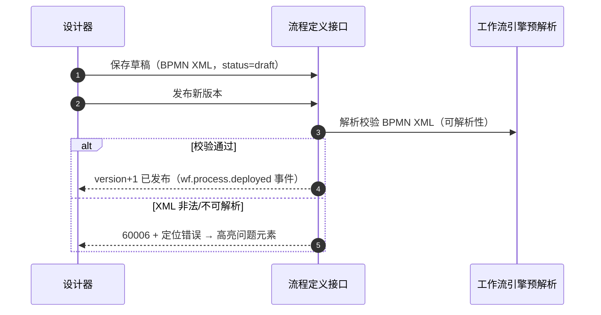

# 组件设计 · 流程建模器

> BPMN 流程定义的在线建模：元素调板拖拽 / 建模画布 / 节点属性（审批人·会签·条件） / XML 导入导出 / 校验 / 保存草稿与版本发布
> 实现侧命名与落点见《[前端基类清单](../../../../前端基类清单.md)》，实现契约细节见项目详细设计。

[文档首页](../../../../文档首页.md) › [项目规划说明](../../../../规划/项目规划说明.md) › [组件设计](../../01_组件设计_总览.md) › 流程建模器　|　[← 表单设计器](../05_组件设计_表单设计器/05_组件设计_表单设计器.md)　[权限配置 →](../07_组件设计_权限配置/07_组件设计_权限配置.md)

> 可交互原型：[06_原型设计_流程建模器.html](06_原型设计_流程建模器.html)（演示 BPMN 建模画布、元素调板拖拽建模、节点属性面板（审批人/会签/条件）、XML 导入导出、校验、保存与版本发布）

## 1. 目的与适用范围 

定义 BMS 前端 PC 管理端**流程建模器**的组件设计：总容器（工具栏 + 三区装配 + 保存/发布），建模画布（BPMN 拖拽建模与事件），元素调板（拖拽建模），节点属性面板（审批人、会签/或签、条件分支、超时），以及建模状态语义（模型状态、选中节点、属性绑定、校验、保存发布）。适用于**流程建模**页（PC 管理端）的 BPMN 定义在线编辑与版本发布。

本节对应[《项目规划说明》](../../../../规划/项目规划说明.md)「功能模块」之**工作流管理**模块「流程建模」；上游设计依据[《概要设计 · 工作流管理》](../../../概要设计/15_概要设计_工作流管理.md)（流程建模、版本管理、审批人来源与会签/或签、接口与错误码）与[《架构设计 · 工作流》](../../../架构设计/21_架构设计_子系统_工作流.md)（BPMN 定义与版本、拖拽建模、工作流引擎）；协作节点为[03_交互类 03 审批流展示](../02_组件设计_审批流展示/02_组件设计_审批流展示.md)（只读 BPMN 图与节点进度，**共用 BPMN 渲染依赖**）、[03_交互类 05 代码表达式编辑器](../04_组件设计_代码表达式编辑器/04_组件设计_代码表达式编辑器.md)（网关条件/数据范围表达式编辑）、[字段类「树选择字段」](../../06_字段类/04_组件设计_树选择字段/04_组件设计_树选择字段.md)与[字段类「组织选择字段」](../../06_字段类/05_组件设计_组织选择字段/05_组件设计_组织选择字段.md)（审批人主体选择）、[03_交互类 01 弹窗抽屉表单](../../04_容器组件类/01_组件设计_弹窗抽屉表单/01_组件设计_弹窗抽屉表单.md)（发布/校验结果弹窗与二次确认）、[04_基础类 01 请求封装](../../09_基础类/01_组件设计_请求封装/01_组件设计_请求封装.md)、[04_基础类 02 权限指令](../../09_基础类/02_组件设计_权限指令/02_组件设计_权限指令.md)（`wf:define`）。

> 本篇为「流程建模器」节点。**范围边界**：**引擎执行**、流程实例/任务/审批记录归[《架构设计 · 工作流》](../../../架构设计/21_架构设计_子系统_工作流.md)与[《概要设计 · 工作流管理》](../../../概要设计/15_概要设计_工作流管理.md)；**只读展示**（实例进度、审批时间线、只读 BPMN 图）归[03_交互类 03 审批流展示](../02_组件设计_审批流展示/02_组件设计_审批流展示.md)；条件表达式的**编辑内核**归[03_交互类 05 代码表达式编辑器](../04_组件设计_代码表达式编辑器/04_组件设计_代码表达式编辑器.md)，本节点负责在节点属性中挂载；移动端不提供建模（见第 12 节）。

## 2. 职责与组成 

| 组成部分 | 职责 |
| --- | --- |
| 建模器总容器件 | 工具栏（新建/打开/导入导出 XML/校验/保存草稿/发布版本/版本历史）、三区装配、脏数据拦截、加载与空态 |
| 建模画布件 | BPMN **可编辑建模**画布：初始化、事件监听（选中/变更）、撤销重做、缩放平移、右键菜单、XML 导入导出；与只读 BPMN 图共用渲染依赖 |
| 元素调板件 | 元素调板：开始/结束事件、用户任务、排他网关、并行网关、连线等可拖拽元素（**BPMN 子集**，对齐工作流引擎可解析范围） |
| 节点属性面板件 | 自建节点属性面板：按元素类型渲染属性（用户任务：审批人来源/多人规则/超时/通知；网关：条件表达式/默认流；流程：定义标识/名称） |
| 建模状态语义 | 建模实例生命周期、选中元素、属性读写、XML 读写、校验、保存/发布、脏数据基线 |
| 继承链 | 本节点各件 → 组件根 → **能力基类** → 具体件；建模编排（定义装载 / 校验合并 / 保存发布 / 脏基线）落为**继承链上的能力基类**，BPMN 渲染与表达式编辑为链上的能力与既有外部能力；主体内建走继承轨，行为在链上层维护、不在件内重复实现 |

- **依赖共用**：建模画布（可编辑）与[03_交互类 03 审批流展示](../02_组件设计_审批流展示/02_组件设计_审批流展示.md)的 BPMN 只读图（只读）共用同一 BPMN 渲染依赖与主题，二者**独立分包懒加载**（登记项③）。

## 3. 总体结构 

| 区域 | 内容 |
| --- | --- |
| 工具栏 | 新建流程、打开（选 `definition_key`）、导入/导出 XML、校验（结构 + 引擎预解析）、保存草稿、`发布版本`（主按钮）、版本历史（只读查看） |
| 元素调板（左） | 可拖拽的 BPMN 元素（BPMN 子集）；拖到画布即创建并选中 |
| 建模画布（中） | 拖拽建模、连线、选中、撤销重做、缩放平移；当前选中驱动属性面板 |
| 属性面板（右） | 按选中元素类型渲染；流程级属性（`definition_key`/名称）在未选中时显示 |

- 全页画布位于[《布局设计 · 主框架》](../../../布局设计/04_布局设计_主框架.html)内容区；工具栏风格对齐管理端（[《布局设计 · 列表页》](../../../布局设计/07_布局设计_列表页.html)工具栏口径）。

## 4. 元素与 BPMN 子集 

| 元素 | 说明 | 可配置属性 |
| --- | --- | --- |
| 开始事件 StartEvent | 流程入口 | 发起人范围（如按业务单据创建人） |
| 用户任务 UserTask | 审批节点（引擎生成待办任务） | 审批人来源、多人规则（会签/或签）、超时、通知 |
| 排他网关 ExclusiveGateway | 条件分支（走其中一条） | 分支连线条件、默认流 |
| 并行网关 ParallelGateway | 并行分支（全部执行） | 分支说明（可选） |
| 结束事件 EndEvent | 流程结束（触发 `wf.instance.finished`） | 结束动作（回调业务，可选） |
| 顺序流 SequenceFlow | 连线 | 条件（网关出线）、名称 |

- **BPMN 子集约束**（对齐[《架构设计 · 工作流》](../../../架构设计/21_架构设计_子系统_工作流.md)与[《概要设计 · 工作流管理》](../../../概要设计/15_概要设计_工作流管理.md)）：以工作流引擎**可解析**为边界，仅提供用户任务、排他/并行网关、开始/结束事件、顺序流；服务任务/脚本任务等高级元素暂不提供。调板与校验据此限制。

## 5. 节点属性（用户任务） 

| 属性 | 类型 / 选项 | 说明 |
| --- | --- | --- |
| 节点名称 | 文本（i18n） | 审批节点名称 |
| 审批人来源 | 主体链（部门负责人/岗位/角色）/ 指定用户 / 指定部门 / 发起人主管 / **表单字段人员** | 引擎运行时按主体链解析（[《架构设计 · 工作流》](../../../架构设计/21_架构设计_子系统_工作流.md)「与其他子系统的协调」节）；选择用[字段类「组织选择字段」](../../06_字段类/05_组件设计_组织选择字段/05_组件设计_组织选择字段.md) |
| 多人规则 | 或签（any）/ 会签（all） | 会签生成多条待办，全部同意方通过；或签任一通过 |
| 超时 | 天/小时（对齐 `wf.task_timeout_days`） | MVP 仅告警提醒，不自动通过（[《概要设计 · 工作流管理》](../../../概要设计/15_概要设计_工作流管理.md)「sys_config 参数」节） |
| 通知 | 站内信 / 实时推送（`approval.todo`） | 待办生成通知方式 |
| 表单/字段 | 审批页展示字段/只读范围（可选） | 与业务表单定制协作（可选） |

- 属性写入 BPMN 元素扩展属性（自定义扩展元素或 BPMN 标准属性），随 XML 保存；**属性面板自建**（基于 BPMN 建模接口 + 事件，风格与基础控件统一，登记项①）。

## 6. 条件分支与表达式 

| 项 | 设计 |
| --- | --- |
| 条件载体 | 排他网关出线（SequenceFlow）上的条件表达式；「默认流」无表达式 |
| 编辑入口 | 属性面板内嵌[03_交互类 05 代码表达式编辑器](../04_组件设计_代码表达式编辑器/04_组件设计_代码表达式编辑器.md)的表达式编辑能力（变量/字段提示 + 校验） |
| 变量来源 | 流程变量（业务单据字段、流程上下文）；由引擎/概要约定（登记项①） |
| 校验 | 语法 + 变量存在性校验（复用表达式校验接口，[03_交互类 05 代码表达式编辑器](../04_组件设计_代码表达式编辑器/04_组件设计_代码表达式编辑器.md)「表达式编辑器」节），保存前强制 |
| 可视化 | 分支条件展示在连线标签；复杂条件展开面板编辑 |

## 7. 版本管理与保存 

| 操作 | 行为 |
| --- | --- |
| 新建 | 输入 `definition_key`（唯一）+ 名称 → 空流程/模板 |
| 保存草稿 | 写流程定义（status=draft），不发布 |
| 发布版本 | `POST /wf/processes/{definition_key}/deploy`：版本号自动 +1、发布 `wf.process.deployed`；新单走最新版本，在途实例按原版本执行（[《概要设计 · 工作流管理》](../../../概要设计/15_概要设计_工作流管理.md)「流程定义与版本管理流程」节） |
| 版本历史 | 列出历史版本（只读，可载入画布查看；不可再被新实例使用） |
| 导入/导出 XML | 导入覆盖当前画布（校验）；导出下载 BPMN XML |
| 校验 | 结构校验（起止事件、连线完整、无孤立节点）+ 引擎预解析；错误码 60006（BPMN 非法） |
| 脏数据 | 模型变更后记基线，切换/离开拦截（[03_交互类 01 弹窗抽屉表单](../../04_容器组件类/01_组件设计_弹窗抽屉表单/01_组件设计_弹窗抽屉表单.md)口径） |
| 删除/下架 | 已发布且被引用不可删除（可下架，错误码 60007） |

## 8. 建模状态语义 

| 项 | 设计 |
| --- | --- |
| 状态内容 | 建模实例、选中元素（类型 + 业务对象）、脏数据判定、只读判定（历史版本只读 / 无 `wf:define`）、加载/保存状态 |
| 生命周期 | 挂载时动态加载 BPMN 建模依赖并初始化；卸载时释放；历史版本以只读进入 |
| 选中联动 | 监听选中变化 → 解析元素类型与扩展属性 → 驱动节点属性面板 |
| 属性写回 | 经 BPMN 建模接口写元素属性，画布即时反映 |
| 脏数据 | 模型变更事件累计；保存/发布成功后重置基线 |
| 校验 | 结构校验（前端）+ 引擎预解析（后端，发布前）；错误定位到元素并在画布高亮 |
| 保存/发布 | 取 XML → 保存草稿 / 发布；失败保留画布并提示错误码（i18n） |

## 9. 与审批流展示的关系 

| 项 | 说明 |
| --- | --- |
| 依赖共用 | 建模画布（可编辑）与实例详情 BPMN 只读图（只读）同源 BPMN 渲染依赖，独立分包懒加载，共享主题与 BPMN 字体资源 |
| 数据一致 | 发布版本的 BPMN XML 即实例详情只读图的数据源（[03_交互类 03 审批流展示](../02_组件设计_审批流展示/02_组件设计_审批流展示.md)「可选 BPMN 只读图」节） |
| 只读回看 | 版本历史以只读模式载入，禁用编辑与调板 |

## 10. 场景集成 

| 场景 | 说明 |
| --- | --- |
| 流程建模页（管理端） | 本节点主体：新建/打开 → 拖拽建模 → 属性 → 校验 → 保存草稿/发布 |
| 流程实例详情 | 只读 BPMN 图高亮当前节点（归 03 审批流展示，共用依赖） |
| 条件表达式 | 属性面板内嵌表达式编辑器（归 05 代码表达式编辑器） |
| 业务模板种子 | 产品仓库（biz）提供流程模板 XML，建模器可载入查看/复制 |
| 移动端 | **不提供建模**；审批详情只读（[《布局设计 · 移动端细化》](../../../布局设计/16_布局设计_移动端细化.html)） |

## 11. 依赖接口与上游变更 

### 11.1 上游接口与口径 

| 项 | 说明 | 目标文档 |
| --- | --- | --- |
| 流程定义列表/保存 | `GET/POST /wf/processes`（含版本，保存 BPMN XML） | [《概要设计 · 工作流管理》](../../../概要设计/15_概要设计_工作流管理.md) |
| 发布版本 | `POST /wf/processes/{definition_key}/deploy`（version+1，`wf.process.deployed`） | [《概要设计 · 工作流管理》](../../../概要设计/15_概要设计_工作流管理.md) |
| 引擎预解析 | 工作流引擎预解析校验（发布前） | [《架构设计 · 工作流》](../../../架构设计/21_架构设计_子系统_工作流.md) |
| 审批人来源 | 主体链解析（部门负责人/岗位/角色）、指定用户/部门、发起人主管、表单字段人员 | [《概要设计 · 工作流管理》](../../../概要设计/15_概要设计_工作流管理.md)（登记项①） |
| 条件表达式 | 网关出线条件；变量来源与校验接口 | [《概要设计 · 工作流管理》](../../../概要设计/15_概要设计_工作流管理.md)、[03_交互类 05 代码表达式编辑器](../04_组件设计_代码表达式编辑器/04_组件设计_代码表达式编辑器.md) |
| 权限 | `wf:define`（定义/版本管理）；历史版本只读 | [《概要设计 · 工作流管理》](../../../概要设计/15_概要设计_工作流管理.md)、[04_基础类 02 权限指令](../../09_基础类/02_组件设计_权限指令/02_组件设计_权限指令.md) |
| 错误码 | 60006 BPMN 非法/引擎解析失败、60007 定义被引用不可删除 | [《概要设计 · 工作流管理》](../../../概要设计/15_概要设计_工作流管理.md) |
| 建模依赖 | BPMN 建模依赖（可编辑）；与只读图共用、独立分包懒加载 | [《架构设计 · 前端架构》](../../../架构设计/08_架构设计_前端架构.md)（登记项③） |

### 11.2 需登记的上游变更 

| 变更点 | 目标文档 | 内容 |
| --- | --- | --- |
| ① 建模器交互与 BPMN 子集/节点属性结构 | [《概要设计 · 工作流管理》](../../../概要设计/15_概要设计_工作流管理.md)「功能点分解」「接口设计」节；[《架构设计 · 工作流》](../../../架构设计/21_架构设计_子系统_工作流.md)「流程定义与版本」节 | 明确建模器支持的 **BPMN 子集**（开始/结束事件、用户任务、排他/并行网关、顺序流）与「工作流引擎可解析」边界；明确用户任务属性结构（审批人来源枚举、多人规则 会签/或签、超时、通知）与条件表达式载体（网关出线条件 + 默认流）；保存草稿/发布版本/历史版本接口口径与错误码（60006/60007） |
| ② 网关条件变量与表达式校验 | [《概要设计 · 工作流管理》](../../../概要设计/15_概要设计_工作流管理.md)「接口设计」节 | 明确网关条件表达式可用的**流程变量/业务字段来源**（随实例上下文下发）与表达式校验接口（与[03_交互类 05 代码表达式编辑器](../04_组件设计_代码表达式编辑器/04_组件设计_代码表达式编辑器.md)同源），保存/发布前强制校验 |
| ③ 前端建模依赖与只读共用 | [《架构设计 · 前端架构》](../../../架构设计/08_架构设计_前端架构.md)「技术要点」「前端性能」节 | 明确 BPMN 可编辑建模与只读图**共用依赖、独立分包懒加载**，含 BPMN 字体/CSS 资源，不进首屏主包；建模器全页画布与只读图主题统一 |

> 按[《文档生成规范》](../../../../规范/文档生成规范.md)「引用与追溯」节，上述变更需用户确认后由上游文档同步；本节点只定义组件语义与契约，不单独裁决接口与 BPMN 属性结构。

## 12. 权限 / i18n / 移动端 

- **权限**：`wf:define` 控制新建/编辑/保存/发布；`wf:query` 可查看历史版本（只读）；无权限时画布与调板禁用（[04_基础类 02 权限指令](../../09_基础类/02_组件设计_权限指令/02_组件设计_权限指令.md)）；后端权限校验兜底。
- **i18n**：界面文案（工具栏/提示/校验/错误码）走全局语言能力；节点名称可配多语言；错误码按 `error.600xx` 映射；**BPMN 元素技术标识不翻译**。
- **移动端**：不提供流程建模器（管理端能力）；审批详情只读 BPMN 图归移动端细化（[《布局设计 · 移动端细化》](../../../布局设计/16_布局设计_移动端细化.html)）。

## 13. 性能与边界 

| 场景 | 设计 |
| --- | --- |
| 分包 | BPMN 可编辑建模与只读图**独立分包懒加载**，含字体/CSS；建模器页面按路由懒加载，不进首屏 |
| 画布性能 | 大规模流程图按需渲染/懒创建；撤销重做走建模命令栈；缩放平移不重排属性面板 |
| 属性写回 | 局部更新元素属性，不整图重绘 |
| 校验 | 前端结构校验即时，引擎预解析在保存/发布时（后端），失败定位元素并高亮 |
| 边界 | 历史版本只读、无权限只读、XML 非法/不可解析（60006）、定义被引用不可删除（60007）、孤立节点/缺少起止事件、条件变量缺失、脏数据拦截、BPMN 渲染资源加载失败（降级提示）、大图滚动缩放、导入覆盖前确认 |
| 不支持 | 引擎执行与实例/任务/审批（后端）、只读实例高亮（交互类「审批流展示」）、BPMN 高级元素（服务/脚本任务）、移动端建模 |

## 14. 检查清单 

- □ 组件分层：建模器总容器装配与工具栏、建模画布与事件、元素调板元素源、节点属性面板、建模状态语义与提交，职责不重叠
- □ 三区结构 + 工具栏齐备；元素调板仅含 BPMN 子集（对齐工作流引擎可解析边界）
- □ 画布：拖拽建模、连线、选中联动、撤销重做、缩放平移；与只读图共用依赖、独立分包
- □ 用户任务属性：审批人来源（主体链/指定/表单字段）、会签/或签、超时、通知；属性写回 BPMN 扩展并随 XML 保存
- □ 条件分支：网关出线条件 + 默认流；内嵌表达式编辑器；变量来源与校验（同源）
- □ 版本：新建/保存草稿/发布版本（version+1 + `wf.process.deployed`）/版本历史只读/导入导出 XML/校验（60006）/删除下架（60007）
- □ 权限（`wf:define`、历史只读）、i18n（文案/节点名/错误码）、移动端（不提供建模）符合第 12 节
- □ 性能边界：独立分包懒加载、画布局部更新、结构校验即时 + 引擎预解析、资源加载失败降级、脏数据拦截
- □ 三项上游登记已确认：建模器交互与 BPMN 子集/节点属性结构、网关条件变量与表达式校验、前端建模依赖与只读共用

> 组件设计节点 · 与[《布局设计 · 主框架》](../../../布局设计/04_布局设计_主框架.html)[《布局设计 · 列表页》](../../../布局设计/07_布局设计_列表页.html)[《布局设计 · 移动端细化》](../../../布局设计/16_布局设计_移动端细化.html)[《概要设计 · 工作流管理》](../../../概要设计/15_概要设计_工作流管理.md)[《架构设计 · 工作流》](../../../架构设计/21_架构设计_子系统_工作流.md)[《架构设计 · 前端架构》](../../../架构设计/08_架构设计_前端架构.md)[03_交互类 03 审批流展示](../02_组件设计_审批流展示/02_组件设计_审批流展示.md)[03_交互类 05 代码表达式编辑器](../04_组件设计_代码表达式编辑器/04_组件设计_代码表达式编辑器.md)[字段类「组织选择字段」](../../06_字段类/05_组件设计_组织选择字段/05_组件设计_组织选择字段.md)[04_基础类 02 权限指令](../../09_基础类/02_组件设计_权限指令/02_组件设计_权限指令.md)《命名规范》配套
