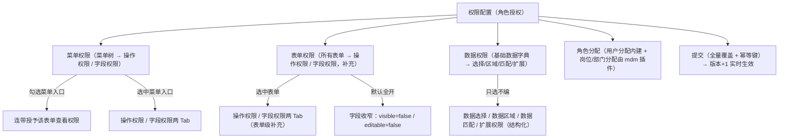

# 组件设计 · 权限配置

> 角色授权的交互：菜单权限与表单权限（操作 / 字段） / 数据权限（只选不编） / 角色分配 / 全量覆盖提交与幂等
> 实现侧命名与落点见《[前端基类清单](../../../../前端基类清单.md)》，实现契约细节见项目详细设计。

[文档首页](../../../../文档首页.md) › [项目规划说明](../../../../规划/项目规划说明.md) › [组件设计](../../01_组件设计_总览.md) › 权限配置　|　[← 流程建模器](../06_组件设计_流程建模器/06_组件设计_流程建模器.md)　[报表设计器 →](../08_组件设计_报表设计器/08_组件设计_报表设计器.md)

> 可交互原型：[07_原型设计_权限配置.html](07_原型设计_权限配置.html)（演示菜单权限与表单权限的操作 / 字段配置、数据权限（字典结构化）、角色分配（用户分配内建 + 岗位/部门分配由 mdm 插件）、全量覆盖提交与幂等、脏数据拦截）

## 1. 目的与适用范围 

定义 BMS 前端 PC 管理端**权限配置**的组件设计：总容器（角色授权页签装配），菜单权限与表单权限（操作 / 字段，含来源判定），数据权限（基础数据字典结构化，只选不编），角色分配，以及授权状态语义（授权状态、连带与来源、全量覆盖提交、幂等键、脏数据）。适用于**角色管理**页（PC 管理端，安全管理员）对角色进行菜单/表单/操作/字段权限与数据权限的授予。

本节对应[《项目规划说明》](../../../../规划/项目规划说明.md)「功能模块」之**角色管理**模块与「权限模型」「业务与动作清单」章节；上游设计依据[《概要设计 · 角色管理》](../../../概要设计/06_概要设计_角色管理.md)（授权功能点、批量接口与错误码、角色分配、三权分立）与[《概要设计 · 菜单管理》](../../../概要设计/07_概要设计_菜单管理.md)（菜单↔表单多对多（关联表 `sys_menu_form`）、表单挂业务、按钮挂动作、字段挂表单）、[《架构设计 · 权限计算引擎》](../../../架构设计/15_架构设计_子系统_权限计算引擎.md)（权限收敛、数据权限、版本失效）；协作节点为[字段类「字典字段」](../../06_字段类/01_组件设计_字典字段/01_组件设计_字典字段.md)（数据权限动态字典）、[字段类「树选择字段」](../../06_字段类/04_组件设计_树选择字段/04_组件设计_树选择字段.md)（菜单树）、[字段类「组织选择字段」](../../06_字段类/05_组件设计_组织选择字段/05_组件设计_组织选择字段.md)（用户分配选择；岗位/部门选择由 mdm 插件提供）、[展示类「通用表格」](../../07_展示类/01_组件设计_通用表格/01_组件设计_通用表格.md)（操作 / 字段权限列表）、[03_交互类 01 弹窗抽屉表单](../../04_容器组件类/01_组件设计_弹窗抽屉表单/01_组件设计_弹窗抽屉表单.md)（确认与脏数据拦截）、[基础类「请求封装」](../../09_基础类/01_组件设计_请求封装/01_组件设计_请求封装.md)、[基础类「权限指令」](../../09_基础类/02_组件设计_权限指令/02_组件设计_权限指令.md)（`role:grant`）。

> 本篇为「权限配置」节点。**范围边界**：权限**计算**（主体链收敛、缓存与版本失效）归[《架构设计 · 权限计算引擎》](../../../架构设计/15_架构设计_子系统_权限计算引擎.md)；角色增删改与列表归[展示类「通用表格」](../../07_展示类/01_组件设计_通用表格/01_组件设计_通用表格.md)与页面；菜单/表单/按钮/字段**实体维护**归[《概要设计 · 菜单管理》](../../../概要设计/07_概要设计_菜单管理.md)，本节点只做**授权勾选与提交**；移动端不提供权限配置（见第 11 节）。

## 2. 职责与组成 

| 组成部分 | 职责 |
| --- | --- |
| 授权总容器件 | 页签装配（菜单权限/表单权限/数据权限/角色分配）、角色切换、脏数据拦截、加载与空态；**不设保存按钮**（保存归宿主页面工具栏） |
| 菜单权限件 | 菜单树（**仅菜单入口**）：三态勾选、勾选连带表单查看、挂接缺失提示、搜索与展开；选中入口后装配「操作权限 / 字段权限」两子页签（带来源判定） |
| 表单权限件 | **所有表单列表**（含无菜单入口的表单）：选中后装配「操作权限 / 字段权限」两子页签（补充授权，带来源判定） |
| 操作权限面板 | 某表单的操作（动作码）清单：查询定位、勾选授予（默认无）、来源只读标注 |
| 字段权限面板 | 某表单的字段可见 / 可编辑清单：默认全开、授予后收窄、来源只读标注 |
| 数据权限件 | 基础数据字典列表 → 数据选择 / 数据区域 / 数据匹配 / 扩展权限四 Tab（结构化、只选不编）；区域 / 匹配用**动态字典件**选择字典数据 |
| 动态字典件 | 按字典类型动态渲染字典数据的通用件（供数据选择 / 数据区域 / 数据匹配使用），继承字典字段族 |
| 角色分配件 | **用户分配**（bms 内建：角色已分配用户列表 + 「选择用户」多选弹窗、移除、计数；写 `sys_user_role`）**＋ 岗位分配 / 部门分配插件页签**（由 mdm 组织域插件经具名插槽挂接，未注册即隐藏） |
| 授权状态语义 | 授权状态、连带与来源、全量覆盖提交（先删后插）、`Idempotency-Key`、脏数据基线、批量结果处理 |
| 继承链 | 本节点各件 → 授权编排能力基类（横切能力，挂组件根）→ 总基类；菜单权限件机制**组合**树族组件基类、字段权限三态落字段权限族组件基类；权限上下文等协作者经单向依赖注入，行为在链上层维护、不在件内重复实现（继承关系以《[前端基类清单](../../../../前端基类清单.md)》为唯一权威源） |

## 3. 授权页面结构 

| 页签 | 说明 |
| --- | --- |
| 菜单权限 | 菜单树（**仅菜单入口**，不含按钮/操作）；勾选＝对用户显示并**连带授予其表单查看权限**；选中入口右侧两 Tab：操作权限 / 字段权限（带来源判定） |
| 表单权限 | **所有表单列表**（含无菜单入口的表单；菜单 ↔ 表单**多对多**）；选中表单右侧两 Tab：操作权限 / 字段权限，作为**补充授权** |
| 数据权限 | 基础数据字典 → 数据选择 / 数据区域 / 数据匹配 / 扩展权限（结构化，只选不编） |
| 角色分配 | 用户分配（bms 内建，写 `sys_user_role`，与用户管理页「用户分配角色」同一张表）；岗位分配 / 部门分配由 mdm 组织域插件经具名插槽挂接（未注册即隐藏） |

- 保存为**整份授权全量覆盖提交**（先删后插、单事务，[《概要设计 · 角色管理》](../../../概要设计/06_概要设计_角色管理.md)「分页/幂等/限流」节）；保存后权限版本 +1（一次递增）实时生效。
- **保存入口唯一**：授权在宿主页面（角色记录 Tab）工具栏统一保存，授权组件内不再另设保存按钮；未保存变更标记（脏数据），切换/关闭前拦截（[03_交互类 01 弹窗抽屉表单](../../04_容器组件类/01_组件设计_弹窗抽屉表单/01_组件设计_弹窗抽屉表单.md)口径）。

## 4. 菜单权限与表单权限 

> 口径（2026-10-05）：菜单树**只设菜单权限**；菜单 ↔ 表单为**多对多**（关联表 `sys_menu_form`，不同入口可指向同一表单、表单可无入口）；操作 / 字段权限从树中移出，改由「菜单入口」与「表单权限」两处配置，均带**来源**（`source_menu_id`）——本入口连带生成的可改、非本入口来源只读。「查看」指**表单权限**（进入该表单），由菜单权限连带授予。

### 4.1 菜单权限（菜单树）

| 项 | 设计 |
| --- | --- |
| 数据来源 | 菜单树 + 菜单↔表单关联（[《概要设计 · 菜单管理》](../../../概要设计/07_概要设计_菜单管理.md)「动态菜单接口」）；按当前角色已授予状态回显 |
| 层级 | **仅菜单入口**（目录 + 叶子菜单）；按钮/操作权限**不**出现在树中 |
| 勾选语义 | 勾选＝菜单入口对用户显示（授予菜单权限），并**连带授予其表单查看权限**；取消勾选＝菜单入口不显示 |
| 连带与撤销 | 取消勾选时**仅撤销本入口连带授予的查看权限**；由其它入口/来源设置的查看权限**保留不动**（只是该入口不显示） |
| 挂接缺失 | 菜单未关联表单 → 该节点标记「未挂接」并提示先完成挂接（错误码 30046），不可授予 |
| 搜索/展开 | 按名称搜索；展开/收起全部；大菜单树懒渲染 |
| 提交 | 勾选仅改本地状态，统一提交（全量覆盖） |

### 4.2 菜单入口的操作 / 字段权限（右侧两 Tab）

| 项 | 设计 |
| --- | --- |
| 定位 | 选中菜单入口后，右侧两个 Tab：**操作权限**（该表单动作码：新增/编辑/删除/导出/导入…，默认无）与**字段权限**（该表单字段，默认全开、授予后收窄） |
| 查看 | 「表单查看」（进入该表单，列表页可见）＝菜单权限**连带**授予 |
| 来源判定 | 权限带**来源**：本菜单入口连带生成的**可改**；非本入口生成（其它入口 / 表单级直接授予 / 预授等）**只读**并标注 |
| 多入口 | 同一表单可被多个菜单入口引用，各入口权限按来源分开；未授予入口的权限不可改 |
| 查询定位 | 操作权限支持按操作名称 / 动作码搜索过滤 |

### 4.3 表单权限（所有表单，补充授权）

| 项 | 设计 |
| --- | --- |
| 定位 | 「表单权限」页签列出**所有表单**（含无菜单入口的表单）；选中表单右侧两 Tab：操作权限 / 字段权限 |
| 补充性质 | 覆盖**无菜单入口的表单**与**表单级直接授予**（`source_menu_id` 为空） |
| 来源判定 | **表单级直接授予的可改**；来自菜单入口的**只读**并标注「来自菜单入口」 |
| 默认 | 操作权限默认无；字段默认全部可见可编辑、授予后收窄 |

- 业务权限为**推导结果**，界面不提供直接勾选入口。

## 5. 字段权限 

| 项 | 设计 |
| --- | --- |
| 维度 | 按表单列出字段的 `visible` / `editable`（在菜单权限 / 表单权限页签的「字段权限」子页签内） |
| 默认 | 未配置的字段**全部可见可编辑**；授予后收窄（`visible=false`、`editable=false`） |
| 批量操作 | 全选可见/可编辑、全选不可见；搜索字段；仅显示已收窄字段的过滤 |
| 来源 | 同操作权限：本菜单入口连带生成的可改、非本入口来源只读（表单权限页签中：表单级直接授予可改、来自菜单入口的只读） |
| 与布局叠加 | 字段权限与[03_交互类 06 表单设计器](../05_组件设计_表单设计器/05_组件设计_表单设计器.md)的布局可见性**叠加、权限优先**（布局可见但权限不可见则不渲染） |
| 校验 | 字段须属该表单字段集合，不匹配拒绝（错误码 30049） |
| 提交 | 全量覆盖提交（`sys_role_field` 先删后插） |

## 6. 数据权限 

> 口径（2026-10-05）：由「按动作的规则表达式」改为**按基础数据字典的结构化数据权限**——**只选不编**（无自由表达式），避免写出预设范围外的规则。

| 项 | 设计 |
| --- | --- |
| 布局 | 左侧「基础数据字典」列表（字典类型）；选中字典后右侧四个 Tab |
| 数据选择 | 该字典数据的分页列表，直接勾选（选中即授权） |
| 数据区域 | 分页列表，每行「开始值 / 结束值」；用**动态字典组件**选择该字典数据 |
| 数据匹配 | 分页列表，每行「字段（默认代码）+ 通配符值」匹配数据内容；仅允许通配符 `*` `?` 与中英文、数字、下划线，含其它字符提示校验失败（30047） |
| 扩展权限 | **明细表**（分页）：每行选择一条扩展权限 + **参数**；点「参数」弹出**参数选择对话框**——由该扩展权限功能自带界面提供，内容存 **JSON** 传入该功能自行解析；未提供参数界面则提示「该扩展权限不需要设置参数」；注册清单按预设 / 二次开发下发，**未注册不显示该 Tab** |
| 取值关系 | 四类条件**并集/兜底**（各 Tab 结果合并）；全部为空 = 无数据权限 |
| 生效 | 读时按授权范围过滤、写时校验（双向）；租户过滤强制叠加，不得跨租户 |
| 组件 | 复用[字段类「字典字段」](../../06_字段类/01_组件设计_字典字段/01_组件设计_字典字段.md)，**新增「动态字典组件」**（按字典类型动态渲染字典数据，供数据选择 / 区域 / 匹配使用）；**扩展权限参数对话框**由各扩展权限功能注册提供（未提供即无参提示） |
| 边界 | 无预设范围外数据（结构受控）；字典未注册 / 无数据 → 空态；扩展筛选器未注册 → 不显示该 Tab |

## 7. 角色分配 

> 口径（2026-10-06）：原「角色分配」改名为「角色分配」，拆分为 bms 内建「用户分配」与 mdm 插件「岗位分配 / 部门分配」。

| 项 | 设计 |
| --- | --- |
| 结构 | 子页签：**用户分配**（bms 内建）+ **岗位分配 / 部门分配**（mdm 组织域插件经具名插槽挂接，未注册即隐藏） |
| 用户分配 | 已分配用户**列表**（姓名 / 账号 / 状态 / 移除）+ 工具栏「选择用户」打开**多选弹窗**（搜索 / 分页）；写/删 `sys_user_role`（`role:grant`）；**与用户管理页「用户分配角色」同一张关系表**；不设数量上限，仅显示已分配计数 |
| 岗位分配 / 部门分配 | 由 mdm 组织域提供插件页签（读 mdm 组织候选 + 读写 mdm 角色-岗位 `org_role_post` / 角色-部门 `org_role_dept`）；bms 不落表 |
| 保存 | 用户分配随宿主工具栏统一保存（全量覆盖提交）；插件页签各自**即时提交**（数据归 mdm，与宿主保存解耦） |
| 生效 | 变更后权限版本 +1，关联用户缓存失效、下次请求重算（[《概要设计 · 角色管理》](../../../概要设计/06_概要设计_角色管理.md)）；mdm 侧变更经事件触发 bms 版本 +1 |
| 删除保护 | 删除角色前校验仍存在角色分配（用户分配 + 经 mdm 只读契约核验的岗位/部门分配）则拒绝（错误码 30044） |
| 前置 | 岗位/部门分配页签依赖基座具名插槽**「显式上下文注入通道」**（角色表单为记录 Tab、非路由页，插件无法经路由参数取角色 id）——已登记为前置、另立项，见[需求 05-10/07-1](../../../../项目/05_前端插件化/需求/06_需求_具名插槽与插件挂接.md) |

## 8. 授权状态语义 

| 项 | 设计 |
| --- | --- |
| 状态内容 | 角色、菜单权限树（仅菜单入口）、菜单入口与表单的操作 / 字段权限（含来源）、数据权限（字典结构化）、角色分配（用户分配 + mdm 插件页签）、脏数据判定、加载/保存状态 |
| 取数 | 并行拉取菜单权限、表单权限（操作 / 字段）、数据权限（字典 + 扩展筛选器）、角色分配（用户分配内建；岗位/部门分配由 mdm 插件自取），单失败可重试 |
| 连带与来源 | 勾选菜单入口由前端呈连带授予表单查看；提交时后端据菜单↔表单挂接关系与来源标记落库；**本入口连带来源项可改，非本入口来源项只读** |
| 提交 | 打包授权（菜单/表单/操作/字段/数据权限/角色分配（用户））全量覆盖提交，携带来源与 `Idempotency-Key`；单事务、失败整体回滚；成功一次版本 +1；**保存入口在宿主页面工具栏，组件内不另设保存**；岗位/部门分配由 mdm 插件即时提交，不入本次载荷 |
| 脏数据 | 打开时以稳定序列化（[基础类「格式化工具」](../../09_基础类/03_组件设计_格式化工具/03_组件设计_格式化工具.md)）记基线，比对得脏数据判定；拦截口径同 [03_交互类 01 弹窗抽屉表单](../../04_容器组件类/01_组件设计_弹窗抽屉表单/01_组件设计_弹窗抽屉表单.md) |
| 错误处理 | 30043/30044/30046/30047/30048/30049 按错误码定位到对应页签与项并提示（i18n） |

## 9. 场景集成 

| 场景 | 说明 |
| --- | --- |
| 角色管理页 · 授权 | 本节点主体；角色列表双击进详情后进入授权页签 |
| 新增角色后授权 | 新建角色 → 授权页签逐步授予 |
| 三权分立校验 | 授予将造成管理员职责互斥/兼任 → 后端拒绝（30048），前端提示 |
| 数据权限 | 基础数据字典结构化权限（只选不编），读时过滤 / 写时校验（权限引擎） |
| 移动端 | **不提供**权限配置（安全管理员管理端能力） |

## 10. 依赖接口与上游变更 

### 10.1 上游接口与口径 

| 项 | 说明 | 目标文档 |
| --- | --- | --- |
| 授权列表/提交 | `GET/PUT /roles/{id}/permissions`（菜单权限 + 表单查看 + 操作权限，含**来源标记**；全量覆盖 + `Idempotency-Key`） | [《概要设计 · 角色管理》](../../../概要设计/06_概要设计_角色管理.md) |
| 字段权限 | `GET/PUT /roles/{id}/fields`（`visible`/`editable`） | [《概要设计 · 角色管理》](../../../概要设计/06_概要设计_角色管理.md) |
| 数据权限 | `GET/PUT /roles/{id}/data-permissions`（角色 × 字典 → 结构化选择 / 区域 / 匹配 / 扩展） | [《概要设计 · 角色管理》](../../../概要设计/06_概要设计_角色管理.md) |
| 角色分配（用户） | `GET/POST /roles/{id}/users`、`DELETE /roles/{id}/users/{user_id}`（维护 `sys_user_role`）；岗位/部门分配接口归 mdm 组织域，由 mdm 插件调用 | [《概要设计 · 角色管理》](../../../概要设计/06_概要设计_角色管理.md) |
| 菜单权限与操作数据 | 菜单树（**仅菜单入口**）+ 菜单↔表单关联（多对多）+ 表单清单 + 表单操作（动作）清单 | [《概要设计 · 菜单管理》](../../../概要设计/07_概要设计_菜单管理.md) |
| 数据权限字典与扩展 | 基础数据字典清单（动态字典件取数）与扩展权限筛选器注册清单（预设 / 二开） | [《架构设计 · 权限计算引擎》](../../../架构设计/15_架构设计_子系统_权限计算引擎.md)（登记项③） |
| 匹配值校验 | 数据匹配通配符值校验（仅 `*` `?` 与中英文 / 数字 / 下划线，越界拒绝，30047） | [《概要设计 · 角色管理》](../../../概要设计/06_概要设计_角色管理.md) |
| 权限/错误码 | `role:query`/`grant`；30043/30044/30046/30047/30048/30049 | [《概要设计 · 角色管理》](../../../概要设计/06_概要设计_角色管理.md) |
| 新增依赖 | **无**：树/表格/勾选等均为既有基础件；操作 / 字段权限面板与表单权限件为本节点新件 | — |

### 10.2 需登记的上游变更 

| 变更点 | 目标文档 | 内容 |
| --- | --- | --- |
| ① 授权交互口径 | [《概要设计 · 角色管理》](../../../概要设计/06_概要设计_角色管理.md)「接口设计」「业务规则」节 | 明确授权页签（菜单权限/表单权限/数据权限/角色分配）与「全量覆盖提交（先删后插、单事务）+ `Idempotency-Key` + 版本一次 +1」口径；明确菜单权限**连带**表单查看、取消仅撤销本入口连带来源；明确「查看」= 表单权限、操作（动作）权限默认无、字段权限默认全开、**数据权限只选不编（结构化）**；明确**保存入口在宿主页面工具栏**（组件内不另设） |
| ② 菜单权限与操作权限来源 | [《概要设计 · 菜单管理》](../../../概要设计/07_概要设计_菜单管理.md)「核心表」「接口设计」节 | 明确授权所需的菜单树（**仅菜单入口**）、菜单↔表单挂接、表单操作（动作）清单与字段清单接口口径；挂接缺失（菜单缺表单）时授权拦截与提示（30046） |
| ③ 数据权限结构化与扩展筛选 | [《架构设计 · 权限计算引擎》](../../../架构设计/15_架构设计_子系统_权限计算引擎.md)「数据权限」节；[《概要设计 · 角色管理》](../../../概要设计/06_概要设计_角色管理.md) | 明确数据权限**按基础数据字典结构化存储**（角色 × 字典：数据选择 / 数据区域 / 数据匹配 / 扩展权限，**只选不编**，取代动作级规则表达式）；明确**动态字典件**取数与扩展权限筛选器的注册 / 下发口径（预设 + 二开，按注册显隐）；匹配值仅允许 `*` `?` 与中英文 / 数字 / 下划线（越界 30047）；读写双向生效与租户强制叠加 |
| ④ 菜单↔表单关联与权限来源 | [《概要设计 · 菜单管理》](../../../概要设计/07_概要设计_菜单管理.md)「核心表」节；[《概要设计 · 角色管理》](../../../概要设计/06_概要设计_角色管理.md)「核心表」节 | 菜单 ↔ 表单改**多对多**（关联表 `sys_menu_form`，`sys_form` 去 `menu_id`）；`sys_role_permission` 新增**来源标记** `source_menu_id`（NULL = 表单级直接授予；唯一键含来源），用于判定「本入口连带可改 / 非本入口来源只读」，供授权界面与权限计算使用 |

> **待调整（2026-10-05）**：权限配置交互（菜单权限树 / 表单权限 / **数据权限（字典结构化、只选不编）** / 操作与字段权限 / 来源判定 / 保存入口唯一 / 扩展权限明细与参数 JSON）已按用户口径更新，但**仍需进一步调整**（细则待用户补充）。**ui-ep 组件实现暂缓**——`PermissionTree` / `PermissionConfig` 调整与**新增「表单权限件」「动态字典件」及操作 / 字段 / 数据权限面板**归《[04 前端组件库](../../../../项目/04_前端组件库/任务/08_交互类/08_交互类_04_权限配置/08_交互类_04_权限配置.md)》「08 交互类 04 权限配置」下**新增嵌套子任务**，先出详细设计再实施；后端**菜单↔表单关联表 `sys_menu_form`**、`sys_role_permission.source_menu_id`、**`sys_data_scope` 结构化**与 `03_01` 已交付实现返工归后端任务。

> **角色分配口径（2026-10-06）**：原「角色分配」改名为**「角色分配」**（全局术语，中英文一并改）。bms 只承载**用户分配**（`sys_user_role`，与用户管理页「用户分配角色」**同一张关系表**）；**岗位分配 / 部门分配**数据与契约**整体归 mdm 组织域**（`org_role_post` / `org_role_dept`），经**具名插槽插件**挂接（缺失即隐藏）；权限收敛经 mdm「按用户解析角色」只读契约跨服务汇总。**已交付的 `SubjectBinding` 组件与其领域函数改名归《08 交互类 04 权限配置》返工**（本轮只改设计）。岗位/部门分配页签依赖基座具名插槽**「显式上下文注入通道」**，已登记为前置、另立项。

> 按[《文档生成规范》](../../../../规范/文档生成规范.md)「引用与追溯」节，上述变更需用户确认后由上游文档同步；本节点只定义组件语义与契约，不单独裁决接口与数据结构。

## 11. 权限 / i18n / 移动端 

- **权限**：授权页与写操作需 `role:grant`（查询 `role:query`）；三权分立冲突由后端拒绝（30048）并提示；平台专属条目（内置角色）禁改归属（30043）；后端权限校验兜底（[基础类「权限指令」](../../09_基础类/02_组件设计_权限指令/02_组件设计_权限指令.md)）。
- **i18n**：菜单/表单/按钮/字段名按 locale 下发（各 `_i18n` 附表）；页面文案、校验与错误码按 `error.300xx` 映射走全局语言能力；**不翻译用户输入**。
- **移动端**：不提供权限配置界面（安全管理员管理端能力）。

## 12. 性能与边界 

| 场景 | 设计 |
| --- | --- |
| 大树 | 菜单树懒渲染、搜索过滤；字段矩阵分页或虚拟滚动；避免一次性渲染超大树 |
| 取数 | 菜单权限、表单权限（操作 / 字段）、数据权限（字典 + 扩展筛选器）、角色分配（用户分配）并行拉取；菜单元数据走菜单缓存 |
| 提交 | 全量覆盖提交（先删后插）单事务；保存入口在宿主工具栏；保存中禁用重复提交；`Idempotency-Key` 防重复 |
| 连带与来源 | 菜单勾选连带表单查看仅前端展示；提交时后端据菜单↔表单关联与来源落库；非本入口来源项只读；提交后以后端返回为准回显 |
| 生效 | 授权变更版本 +1 一次递增，避免多次失效；保存成功提示「已生效」 |
| 边界 | 挂接缺失（30046）、字段不匹配（30049）、匹配通配符非法（30047）、三权冲突（30048）、内置角色保护（30043）、岗位/部门分配插件缺失即隐藏、脏数据拦截、保存失败保留本地、空角色未授权、字典无数据、扩展筛选器未注册（不显示）、大树性能 |
| 不支持 | 权限计算/缓存（权限引擎）、菜单/字段实体维护（菜单管理）、角色增删改列表（页面）、移动端 |

## 13. 检查清单 

- □ 组件分层：授权总容器装配与提交、菜单权限件、表单权限件、操作 / 字段权限面板、数据权限件（与动态字典件）、角色分配件、授权状态语义与提交，职责不重叠
- □ 菜单权限与表单权限：菜单树仅菜单入口（不含按钮/操作）、勾选连带表单查看、菜单入口右侧与表单权限页签各含「操作权限 / 字段权限」两 Tab、权限按来源判定可改 / 只读（`source_menu_id`）、表单列表含无入口表单（菜单↔表单多对多）、挂接缺失提示、搜索/懒渲染
- □ 字段权限：按表单列出字段、默认全开、收窄、批量操作、与布局叠加（权限优先）、不匹配拒绝（30049）、来源只读
- □ 数据权限：基础数据字典 → 数据选择 / 数据区域 / 数据匹配 / 扩展权限四 Tab（**只选不编**）；区域 / 匹配用动态字典件；匹配值仅 `*` `?` 与中英文 / 数字 / 下划线（越界 30047）；**扩展权限为明细表**（每行选一条 + 参数 JSON，参数对话框由扩展功能提供、无参提示）；扩展清单按注册显隐；读写双向与租户叠加
- □ 角色分配：用户分配（列表 + 选择用户弹窗、写 `sys_user_role`、与用户管理页同表、不设上限仅计数）；岗位/部门分配（mdm 插件、缺失即隐藏、即时提交）；变更版本 +1、删除保护（30044）、依赖基座「显式上下文注入通道」
- □ 提交：保存入口唯一（宿主工具栏）、全量覆盖（先删后插、单事务）、`Idempotency-Key`、版本一次 +1、脏数据拦截、错误码定位
- □ 权限（`role:grant`、三权分立 30048、内置角色 30043）、i18n（名称/文案/错误码）、移动端（不提供）符合第 11 节
- □ 性能边界：大树懒渲染/虚拟滚动、并行取数、覆盖提交、连带仅展示、版本一次递增
- □ 四项上游登记已确认：授权交互口径、菜单↔表单关联与操作权限来源、数据权限结构化与扩展筛选、权限来源字段

> 组件设计节点 · 与[《概要设计 · 角色管理》](../../../概要设计/06_概要设计_角色管理.md)[《概要设计 · 菜单管理》](../../../概要设计/07_概要设计_菜单管理.md)[《架构设计 · 权限计算引擎》](../../../架构设计/15_架构设计_子系统_权限计算引擎.md)[《架构设计 · 前端架构》](../../../架构设计/08_架构设计_前端架构.md)[字段类「字典字段」](../../06_字段类/01_组件设计_字典字段/01_组件设计_字典字段.md)[字段类「树选择字段」](../../06_字段类/04_组件设计_树选择字段/04_组件设计_树选择字段.md)[字段类「组织选择字段」](../../06_字段类/05_组件设计_组织选择字段/05_组件设计_组织选择字段.md)[展示类「通用表格」](../../07_展示类/01_组件设计_通用表格/01_组件设计_通用表格.md)[基础类「权限指令」](../../09_基础类/02_组件设计_权限指令/02_组件设计_权限指令.md)《命名规范》配套
