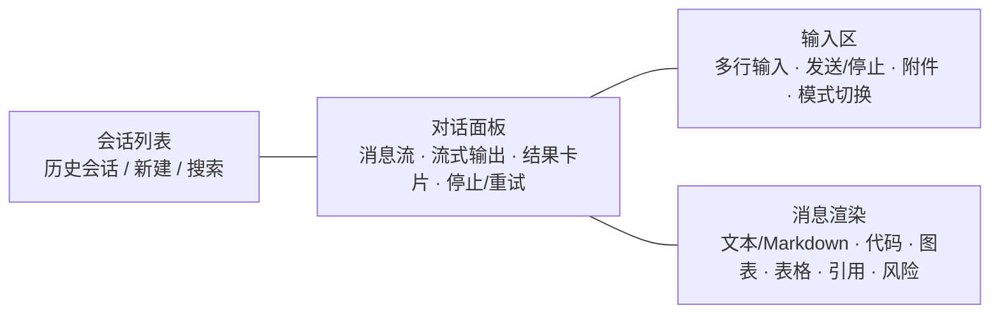

# 组件设计 · AI 助手

> AiAssistant · ChatPanel · MessageBubble · PromptInput · ConversationList · useAiChat

[文档首页](../../../../文档首页.md) › [项目规划说明](../../../../规划/项目规划说明.md) › [组件设计](../../01_组件设计_总览.md) › AI助手　|　[← 大屏设计器与播放](../09_组件设计_大屏设计器与播放/09_组件设计_大屏设计器与播放.md)　[国际化文案编辑器 →](../11_组件设计_国际化文案编辑器/11_组件设计_国际化文案编辑器.md)

> 可交互原型：[10_原型设计_AI助手.html](10_原型设计_AI助手.html)（演示会话列表、对话消息流与流式输出、智能问数图表结果、审批辅助参考意见、文档问答引用、自动执行二次确认与撤销）

## 1. 目的与适用范围 <a id="purpose"></a>

定义 BMS 前端 `frontend/` **AI 助手**的组件设计：总容器 `AiAssistant.vue`（页签与模式装配），对话面板 `ChatPanel.vue`（消息流与流式输出），消息渲染 `MessageBubble.vue`（文本/Markdown/代码/图表/表格/引用/风险提示），输入区 `PromptInput.vue`（发送/停止/附件/模式切换），会话列表 `ConversationList.vue`（历史会话），以及组合式函数 `useAiChat.ts`（会话、流式接收、审计标识、二次确认与撤销）。适用于**AI 助手**页（PC 管理端）的智能问数、审批辅助、文档问答、通用对话与自动执行二次确认。

本节对应[《项目规划说明》](../../../../规划/项目规划说明.md)「功能模块」之**AI 能力**模块（阶段十六）；上游设计依据[《概要设计 · AI 能力》](../../../概要设计/34_概要设计_AI能力.md)（八项能力、默认仅辅助、默认仅辅助与全量审计、prompt 注入防护、RAG 权限约束、自动执行/自动审批开关与白名单、接口与错误码）与[《架构设计 · AI服务》](../../../架构设计/22_架构设计_子系统_AI服务.md)（统一适配层、对话与治理）；协作节点为[05 展示类 04 图表卡](../../07_展示类/04_组件设计_图表卡/04_组件设计_图表卡.md)（问数结果图表化）、[05 展示类 01 通用表格](../../07_展示类/01_组件设计_通用表格/01_组件设计_通用表格.md)（结果表）、[06 交互类 01 弹窗抽屉表单](../../04_容器组件类/01_组件设计_弹窗抽屉表单/01_组件设计_弹窗抽屉表单.md)（自动执行二次确认/撤销确认）、[08 富文本字段](../../06_字段类/07_组件设计_富文本字段/07_组件设计_富文本字段.md)（消息内富文本渲染与清洗）、[06 交互类 05 代码表达式编辑器](../04_组件设计_代码表达式编辑器/04_组件设计_代码表达式编辑器.md)（消息内代码/SQL 只读高亮）、[07 基础类 01 请求封装](../../09_基础类/01_组件设计_请求封装/01_组件设计_请求封装.md)、[07 基础类 02 权限指令](../../09_基础类/02_组件设计_权限指令/02_组件设计_权限指令.md)（`ai:chat`）。

> 本篇为组件设计体系交互类第 11 篇。**范围边界**：**模型适配层、RAG 管线、NL2SQL 生成与安全执行、审计与预算**归[《概要设计 · AI 能力》](../../../概要设计/34_概要设计_AI能力.md)与[《架构设计 · AI服务》](../../../架构设计/22_架构设计_子系统_AI服务.md)（前端只调用接口并展示）；**模型配置页**（provider 维护）归模型配置页，不在本节点；**问数结果图表渲染**复用 [05 展示类 04 图表卡](../../07_展示类/04_组件设计_图表卡/04_组件设计_图表卡.md)；**会话持久化**以 `ai_chat_log` 审计数据为准（会话列表为派生视图）；移动端「问答机器人」复用同一后端接口，前端形态单列（见第 11 节）。

## 2. 组件清单与职责 <a id="components"></a>

| 组件 / 工具 | 位置 | 职责 |
| --- | --- | --- |
| `AiAssistant.vue` | `src/components/ai/` | 总容器：模式/页签（通用对话 / 智能问数 / 审批辅助 / 文档问答）、会话列表与对话区装配、自动执行二次确认入口、空态与错误态 |
| `ChatPanel.vue` | `src/components/ai/` | 对话面板：消息流渲染、滚动定位、流式输出（逐字追加）、停止/重试、结果卡片（图表/表格） |
| `MessageBubble.vue` | `src/components/ai/` | 消息渲染：用户/助手气泡；富文本/Markdown、代码（只读高亮）、图表、表格、引用来源、风险提示、审计标识 |
| `PromptInput.vue` | `src/components/ai/` | 输入区：多行输入、发送/停止、附件（文档问答）、模式切换、字数与敏感提示、快捷问题 |
| `ConversationList.vue` | `src/components/ai/` | 会话列表：历史会话（按时间/模式）、新建、切换、删除、搜索（`ai:manage` 可查全量审计，普通用户仅本人） |
| `useAiChat.ts` | `src/utils/useAiChat.ts` | 组合式函数：会话与消息状态、流式接收（SSE）、停止/重试、审计标识、自动执行二次确认与撤销、错误码处理 |

- 命名遵循[《命名规范》](../../../../规范/命名规范.md)：组件 PascalCase、组合式函数 `use` + 名词；目录遵循[《前端开发规范》](../../../../规范/前端开发规范.md)（`src/components/` 按域分目录，AI 归 `ai/`；组合式函数放 `src/utils/`）。

## 3. 总体结构 <a id="layout"></a>



| 区域 | 内容 |
| --- | --- |
| 会话列表（左） | 历史会话（按时间/模式）、新建会话、切换、删除、搜索；普通用户仅本人会话 |
| 对话面板（中） | 消息流（用户/助手），流式逐字输出，结果卡片（图表/表格），停止/重新生成/复制 |
| 输入区（下） | 多行输入（回车发送、Shift+回车换行）、发送/停止、附件（文档问答）、模式提示、快捷问题 |
| 模式/页签 | 通用对话、智能问数（数据集选择）、审批辅助、文档问答（文件选择） |

## 4. 模式与消息模型 <a id="modes"></a>

| 模式（module） | 说明 | 关键交互 |
| --- | --- | --- |
| ask（通用对话） | 通用问答（帮助/公告知识来源） | 输入即问、流式回答、引用来源 |
| report（智能问数） | NL2SQL：选目标数据集 → 自然语言提问 → 图表/表格结果 | 数据集选择、结果图表化、SQL 只读展示（可选） |
| approval（审批辅助） | 历史审批 RAG 生成参考意见与风险提示 | 由审批页「AI 辅助」入口发起、仅辅助展示 |
| doc_qa（文档问答） | 选文件 → 基于文件内容问答（RAG） | 文件选择、引用分段 |

```typescript
interface AiMessage {
  id: string;
  role: 'user' | 'assistant';
  status: 'streaming' | 'done' | 'error' | 'stopped';
  text: string;                              // Markdown 文本
  result?: {                                 // 结构化结果（问数/表格）
    kind: 'chart' | 'table';
    chartType?: string; datasetId?: string;
    columns?: string[]; rows?: any[][];
  };
  references?: { type: 'file' | 'article' | 'record'; title: string; id: string }[];
  risk?: string[];                           // 审批辅助风险提示
  auditId?: string;                          // 审计标识（ai_chat_log）
}
```

- **默认仅辅助**：AI 输出以意见、草稿、检索结果展示，不直接执行业务动作（[《概要设计 · AI 能力》](../../../概要设计/34_概要设计_AI能力.md)「业务规则」节）。
- 消息 `text` 为 Markdown：由渲染器解析；**富文本/HTML 片段经清洗**（复用 [08 富文本字段](../../06_字段类/07_组件设计_富文本字段/07_组件设计_富文本字段.md) 白名单净化口径），代码块只读高亮（复用 [06 交互类 05 代码表达式编辑器](../04_组件设计_代码表达式编辑器/04_组件设计_代码表达式编辑器.md) 只读能力）。

## 5. 智能问数（report） <a id="ask-data"></a>

| 项 | 设计 |
| --- | --- |
| 入口 | 助手页「智能问数」模式：选择目标数据集（白名单内且有 `rpt` 权限） |
| 输入 | 自然语言问题（如「上月各部门收款合计」） |
| 返回 | 结果图表化（默认按字段类型选图，可切换图表类型）或表格；可选展示生成的 SQL（只读高亮） |
| 安全 | 数据集白名单 + 只读从库 + SQL 安全校验（前端只展示结果；拒绝场景提示 10206/10207） |
| 渲染 | 图表复用 [05 展示类 04 图表卡](../../07_展示类/04_组件设计_图表卡/04_组件设计_图表卡.md) `EChart`；表格复用 [05 展示类 01 通用表格](../../07_展示类/01_组件设计_通用表格/01_组件设计_通用表格.md) |
| 数据范围 | 结果按用户动作级数据范围过滤（后端），前端不绕过 |

## 6. 审批辅助（approval） <a id="approval"></a>

| 项 | 设计 |
| --- | --- |
| 入口 | 审批页「AI 辅助」按钮发起（携带单据/实例上下文） |
| 返回 | 参考意见 + 风险提示；**仅辅助展示**，审批结论仍由人工提交（不自动回填/提交） |
| 引用 | 历史审批记录引用（按当前用户数据权限过滤） |
| 空态 | 无历史数据/过滤后为空 → 「无参考数据」（[《概要设计 · AI 能力》](../../../概要设计/34_概要设计_AI能力.md) 异常分支） |
| 落审计 | 全量落 `ai_chat_log`（前端展示审计标识） |

## 7. 文档问答（doc_qa） <a id="doc-qa"></a>

| 项 | 设计 |
| --- | --- |
| 入口 | 助手页「文档问答」模式：选择文件（[07 文件上传字段](../../06_字段类/06_组件设计_文件上传字段/06_组件设计_文件上传字段.md) 选择器/文件库） |
| 返回 | 基于分段内容的回答 + **引用来源**（文件名 + 分段定位） |
| 降级 | 文件未分段/向量库不可用 → 提示（10213）并可降级关键词检索 |
| 权限 | 上下文按数据范围过滤；越权内容不进入上下文（后端保证） |

## 8. 流式输出与错误 <a id="stream"></a>

| 项 | 设计 |
| --- | --- |
| 传输 | **SSE（Server-Sent Events）** 流式返回 token/片段；`useAiChat` 组装消息并逐帧追加（传输协议口径见登记项②） |
| 停止 | 「停止」中断流（`AbortController`/关闭 SSE），消息置 `stopped`，保留已接收内容 |
| 重试/重新生成 | 对 `error`/`stopped` 消息提供「重新生成」（复用原输入） |
| 审计标识 | 每次交互返回 `auditId`（`ai_chat_log` 记录标识），气泡可展示/复制；审计落库失败按 10216 提示 |
| 错误 | 模型不可用/未配置（10201）、调用超时（10202）、输出校验未通过（10203）、预算超限（10204）、租户无端点（10205）按错误码提示（i18n）；限流命中通用段提示 |
| 重试策略 | 后端超时重试一次后熔断告警，前端给「重新生成」（不自动重试风暴） |

## 9. 自动执行 / 自动审批的二次确认与撤销 <a id="auto"></a>

| 项 | 设计 |
| --- | --- |
| 前置 | `ai.auto_execute` / `ai.auto_approve` 开关；未开启时按钮隐藏或提示（10208/10209）；白名单外拒绝（10210） |
| 确认 | AI 生成执行内容/审批结论 → **展示待确认内容** → 强制二次确认（复用 [06 交互类 01 弹窗抽屉表单](../../04_容器组件类/01_组件设计_弹窗抽屉表单/01_组件设计_弹窗抽屉表单.md)），缺少确认拒绝（10211） |
| 执行 | 经既有接口通道执行（写接口带幂等键 / wf 审批通道），全量落审计与操作日志 |
| 撤销 | 提供「撤销」入口（动作可撤销时），撤销落审计；状态不允许 → 10212 |
| 依赖 | `ai.auto_approve` 依赖 `ai.auto_execute`（配置侧校验，前端不放开依赖情况下两者同开） |

## 10. 组合式函数 useAiChat <a id="use-chat"></a>

```typescript
interface UseAiChatOptions { module?: 'ask' | 'report' | 'approval' | 'doc_qa'; onAudit?: (id: string) => void; }
interface UseAiChatReturn {
  conversations: Ref<Conversation[]>;
  current: Ref<Conversation | null>;
  messages: Ref<AiMessage[]>;
  streaming: Ref<boolean>;
  send: (input: { text: string; datasetId?: string; fileId?: string; context?: any }) => Promise<void>;
  stop: () => void;
  regenerate: (messageId: string) => Promise<void>;
  newConversation / switchConversation / removeConversation;
  confirmAction: (actionId: string) => Promise<void>;   // 自动执行二次确认
  revokeAction: (actionId: string) => Promise<void>;    // 撤销
}
```

| 行 | 设计 |
| --- | --- |
| 会话 | 会话列表来自交互记录（普通用户本人，`ai:manage` 可查全量审计）；新建/切换/删除 |
| 发送 | 组装 `{module, prompt, datasetId/fileId, context}` → `POST /ai/chat`（或问数/审批辅助专用接口）；审计标识回调 |
| 流式 | SSE 逐帧追加到当前助手消息；停止用 `AbortController` |
| 降级 | 模型不可用/超时/预算超限按错误码提示；文档问答可降级关键词检索 |
| 权限 | `ai:chat` 控制入口；`ai:manage` 控制审计查询/模型配置；RAG 上下文权限由后端过滤（前端不感知越权内容） |

## 11. 场景集成 <a id="scenes"></a>

| 场景 | 说明 |
| --- | --- |
| AI 助手页 | 本节点主体：四模式统一对话界面 |
| 审批页「AI 辅助」 | 以弹窗/内联面板发起审批辅助（复用 `ChatPanel`/`MessageBubble`） |
| 帮助中心「AI 生成草稿」 | 帮助草稿入口（归帮助管理，展示草稿与质量评估，不在本节点） |
| 模型配置页 | provider 维护与审计查询（归模型配置页，`ai:manage`） |
| 移动端问答机器人 | 复用 `/ai/chat` 的问答对话（企微/钉钉内嵌），单列形态，不复用 PC 组件 |

## 12. 依赖接口与上游变更 <a id="api"></a>

### 12.1 上游接口与口径 <a id="api-contract"></a>

| 项 | 说明 | 目标文档 |
| --- | --- | --- |
| 对话 | `POST /api/v1/ai/chat`（module: ask/approval/doc_qa/content，返回结果 + 审计标识） | [《概要设计 · AI 能力》](../../../概要设计/34_概要设计_AI能力.md) |
| 智能问数 | `POST /api/v1/ai/report/query`（数据集白名单 + 只读从库 + 安全校验，结果图表化） | [《概要设计 · AI 能力》](../../../概要设计/34_概要设计_AI能力.md) |
| 审批辅助 | `POST /api/v1/ai/approval/suggest`（历史审批 RAG，仅辅助展示） | [《概要设计 · AI 能力》](../../../概要设计/34_概要设计_AI能力.md) |
| 确认/撤销 | `POST /api/v1/ai/actions/{action_id}/confirm`、`/revoke` | [《概要设计 · AI 能力》](../../../概要设计/34_概要设计_AI能力.md) |
| 审计查询 | `GET /api/v1/ai/chat/logs`（`ai:manage`） | [《概要设计 · AI 能力》](../../../概要设计/34_概要设计_AI能力.md) |
| 图表渲染 | 问数结果图表复用 `EChart`/`chartTheme` | [05 展示类 04 图表卡](../../07_展示类/04_组件设计_图表卡/04_组件设计_图表卡.md) |
| 权限/错误码 | `ai:chat`（对话）/`ai:manage`（模型与审计）；102xx 错误码 | [《概要设计 · AI 能力》](../../../概要设计/34_概要设计_AI能力.md) |
| 新增依赖 | **无**：SSE 用浏览器原生 `EventSource`/`fetch` 流；无额外前端库 | — |

### 12.2 需登记的上游变更 <a id="api-upstream"></a>

| 变更点 | 目标文档 | 内容 |
| --- | --- | --- |
| ① 助手前端交互与消息/引用结构 | [《概要设计 · AI 能力》](../../../概要设计/34_概要设计_AI能力.md)「接口设计」「功能分解与业务流程」节 | 明确助手四模式（ask/report/approval/doc_qa）前端交互与消息结构（文本 Markdown/代码/图表结果/表格/**引用来源**/风险提示/审计标识）；问数结果图表化字段；审批辅助仅辅助展示；自动执行二次确认与撤销前端入口 |
| ② 流式对话传输协议 | [《架构设计 · AI服务》](../../../架构设计/22_架构设计_子系统_AI服务.md)「协作」「接口」节 | 明确流式输出传输方式（**SSE**：`text/event-stream`，事件含 token 片段/结束/错误/审计标识），前端停止（AbortController）与重试口径；审计落库失败（10216）与预算/限流前置提示 |
| ③ 助手前端分包与复用 | [《架构设计 · 前端架构》](../../../架构设计/28_架构设计_前端架构.md)「技术要点」「前端性能」节 | 明确 AI 助手按需分包懒加载；消息渲染复用富文本清洗（[08 富文本字段](../../06_字段类/07_组件设计_富文本字段/07_组件设计_富文本字段.md)）与只读代码高亮（[06 交互类 05 代码表达式编辑器](../04_组件设计_代码表达式编辑器/04_组件设计_代码表达式编辑器.md)）、图表复用 [05 展示类 04 图表卡](../../07_展示类/04_组件设计_图表卡/04_组件设计_图表卡.md) |

> 按[《文档生成规范》](../../../../规范/文档生成规范.md)「引用与追溯」节，上述变更需用户确认后由上游文档同步；本节点只定义组件契约，不单独裁决接口与传输协议。

## 13. 权限 / i18n / 移动端 <a id="cooperate"></a>

- **权限**：对话/问数/审批辅助/文档问答需 `ai:chat`（问数另需数据集 `rpt` 权限，后端校验）；审计查询与模型配置 `ai:manage`；自动执行/自动审批受开关与白名单约束；RAG 上下文权限由后端按数据范围过滤（[07 基础类 02 权限指令](../../09_基础类/02_组件设计_权限指令/02_组件设计_权限指令.md)）。
- **i18n**：界面文案、错误码（`error.102xx`）走 vue-i18n；**AI 输出内容不翻译**（按用户语言/模型决定）；系统提示与界面文案语言遵循 [《概要设计 · AI 能力》](../../../概要设计/34_概要设计_AI能力.md) 与 [《架构设计 · 国际化》](../../../架构设计/20_架构设计_子系统_国际化.md)。
- **移动端**：问答机器人复用 `/ai/chat`，以企业微信/钉钉内嵌对话页（单列）实现，不复用 PC 组件；本节点不覆盖移动端组件。

## 14. 性能与边界 <a id="performance"></a>

| 场景 | 设计 |
| --- | --- |
| 分包 | AI 助手按需分包懒加载；消息内图表按需加载 `EChart` |
| 流式 | SSE 逐帧渲染，长回答虚拟滚动/按需渲染；组件卸载中断流并释放 |
| 消息渲染 | Markdown/代码高亮按需；富文本片段白名单清洗；图表结果懒初始化 |
| 取数 | 问数结果限深/限流/只读从库（后端）；同会话历史按需分页加载 |
| 边界 | 模型不可用（10201）、超时（10202）、输出校验（10203）、预算超限（10204）、无端点（10205）、白名单（10206/10210）、SQL 校验（10207）、开关未开（10208/10209）、缺确认（10211）、不可撤销（10212）、文件未分段（10213）、审计失败（10216）、限流；空会话、流中断（停止）、超长回答、无引用、无权限 |
| 不支持 | 模型适配/RAG/NL2SQL 生成与执行/审计与预算（后端）、模型配置页、帮助草稿生成（帮助管理）、移动端组件 |

## 15. 检查清单 <a id="checklist"></a>

- □ 组件分层：`AiAssistant` 装配、`ChatPanel` 消息流、`MessageBubble` 渲染、`PromptInput` 输入、`ConversationList` 会话、`useAiChat` 状态与流式，职责不重叠
- □ 四模式：通用对话 / 智能问数（数据集+图表结果） / 审批辅助（参考意见+风险，仅辅助） / 文档问答（文件+引用）
- □ 消息渲染：Markdown、代码只读高亮、图表/表格结果、引用来源、风险提示、审计标识；富文本白名单清洗
- □ 流式与错误：SSE 逐帧、停止（AbortController）、重新生成；102xx 错误码提示；审计失败提示
- □ 自动执行/自动审批：开关与白名单、待确认内容展示、强制二次确认、撤销（落审计）
- □ 权限（`ai:chat`/`ai:manage`/数据集权限/数据范围）、i18n（文案/错误码，输出不翻译）、移动端（复用接口、单列）符合第 13 节
- □ 性能边界：分包懒加载、流式按需渲染、消息/图表懒加载、取数限流限深
- □ 三项上游登记已确认：助手前端交互与消息/引用结构、流式对话传输协议（SSE）、助手前端分包与复用

> 组件设计节点 · 与[《概要设计 · AI 能力》](../../../概要设计/34_概要设计_AI能力.md)[《架构设计 · AI服务》](../../../架构设计/22_架构设计_子系统_AI服务.md)[《架构设计 · 前端架构》](../../../架构设计/28_架构设计_前端架构.md)[05 展示类 04 图表卡](../../07_展示类/04_组件设计_图表卡/04_组件设计_图表卡.md)[05 展示类 01 通用表格](../../07_展示类/01_组件设计_通用表格/01_组件设计_通用表格.md)[04 字段类 08 富文本字段](../../06_字段类/07_组件设计_富文本字段/07_组件设计_富文本字段.md)[03_交互类 01 弹窗抽屉表单](../../04_容器组件类/01_组件设计_弹窗抽屉表单/01_组件设计_弹窗抽屉表单.md)[03_交互类 05 代码表达式编辑器](../04_组件设计_代码表达式编辑器/04_组件设计_代码表达式编辑器.md)[07 基础类 02 权限指令](../../09_基础类/02_组件设计_权限指令/02_组件设计_权限指令.md)《命名规范》配套
