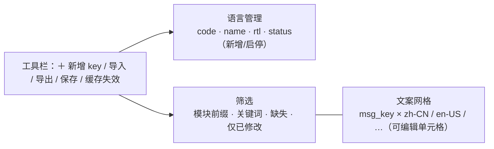

# 组件设计 · 国际化文案编辑器

> 多语言文案在线维护：语言清单增改启停 / 文案键 × 多语言可编辑网格 / 筛选 / 批量保存与缓存失效 / 导入导出
> 实现侧命名与落点见《[前端基类清单](../../../../前端基类清单.md)》，实现契约细节见项目详细设计。

[文档首页](../../../../文档首页.md) › [项目规划说明](../../../../规划/项目规划说明.md) › [组件设计](../../01_组件设计_总览.md) › 国际化文案编辑器　|　[← AI助手](../10_组件设计_AI助手/10_组件设计_AI助手.md)　[表单渲染器 →](../12_组件设计_表单渲染器/12_组件设计_表单渲染器.md)

> 可交互原型：[11_原型设计_国际化文案编辑器.html](11_原型设计_国际化文案编辑器.html)（演示语言清单维护、msg_key × 多语言列可编辑网格、搜索/前缀/缺失筛选、新增/删除 key、批量保存与缓存失效、导入导出）

## 1. 目的与适用范围 

定义 BMS 前端 PC 管理端**国际化文案编辑器**的组件设计：编辑器容器（语言清单与文案网格的页签装配、批量保存、缓存失效），语言清单（code/name/rtl/status），文案网格（`msg_key` × 各语言 value 可编辑），筛选器（模块前缀/关键词/缺失筛选），以及状态与提交装配（取数、编辑、批量保存、缓存失效、导入导出联动）。适用于**国际化管理**模块的「语言管理」与「语言包维护」页（PC 管理端）。

本节对应[《项目规划说明》](../../../../规划/项目规划说明.md)「功能模块」之**国际化管理**模块；上游设计依据[《概要设计 · 国际化管理》](../../../概要设计/29_概要设计_国际化管理.md)（`sys_i18n_locale`/`sys_i18n_message`、语言包页面在线维护、批量保存与缓存失效、msg_key 命名与错误码、新增语言免发版）与[《架构设计 · 国际化》](../../../架构设计/24_架构设计_子系统_国际化.md)（运行时下发、服务端缓存 + 浏览器本地二次缓存、缺省回退、RTL）；协作节点为[展示类「通用表格」](../../07_展示类/01_组件设计_通用表格/01_组件设计_通用表格.md)（文案网格）、[交互类「导入导出」](../01_组件设计_导入导出/01_组件设计_导入导出.md)（语言包导入导出）、[交互类「弹窗抽屉表单」](../../04_容器组件类/01_组件设计_弹窗抽屉表单/01_组件设计_弹窗抽屉表单.md)（新增语言/新增 key/删除确认与脏数据拦截）、[基础类「请求封装」](../../09_基础类/01_组件设计_请求封装/01_组件设计_请求封装.md)、[基础类「权限指令」](../../09_基础类/02_组件设计_权限指令/02_组件设计_权限指令.md)（`i18n:manage`）。

> 本篇为「国际化文案编辑器」节点。**范围边界**：语言包**运行时下发与缓存**（服务端缓存 + 浏览器本地二次缓存）归[《架构设计 · 国际化》](../../../架构设计/24_架构设计_子系统_国际化.md)；**业务文案 i18n 附表**（菜单/字典/字段等）由各模块维护，不在本节点（本节点只维护前后端**固定文案** `sys_i18n_message`）；**用户语言/时区偏好**归个人中心与[《概要设计 · 用户喜好》](../../../概要设计/04_概要设计_用户喜好.md)；移动端不提供文案维护（见第 12 节）。

## 2. 职责与组成 

| 组成部分 | 职责 |
| --- | --- |
| 编辑器容器 | 语言管理 / 语言包维护页签装配、批量保存、缓存主动失效、脏数据拦截、加载与空态 |
| 语言清单 | code/name/rtl/status 列表与增改启停、默认语言保护、新增语言 |
| 文案网格 | `msg_key` × 各语言 value 可编辑单元格、行新增/删除、缺失高亮、分页或虚拟滚动 |
| 筛选器 | 模块前缀（`模块.` / `模块.页面.`）、关键词、缺失翻译筛选、仅显示已修改 |
| 状态与提交装配 | 语言包取数、行编辑状态、批量保存（`Idempotency-Key`）、缓存失效、脏数据基线、导入导出联动 |

## 3. 总体结构 

| 区域 | 内容 |
| --- | --- |
| 语言管理（页签 1） | 语言清单列表：code、name、rtl、status；新增语言、编辑、启停；默认语言保护 |
| 语言包维护（页签 2） | 筛选器 + 文案网格；新增/删除 `msg_key`；各语言 value 编辑；批量保存 + 缓存失效；导入导出 |

## 4. 语言清单 

| 项 | 设计 |
| --- | --- |
| 字段 | `code`（如 `zh-CN`/`en-US`）、`name`（语言名）、`rtl`（是否从右到左）、`status`（启用/停用） |
| 新增 | 输入 code/name/rtl → 唯一性校验（`code` 唯一，错误码 44001）→ 语言包维护页出现新语言列（免发版） |
| 编辑 | 修改名称/rtl/启停；`rtl` 变更由前端布局按标记切换（[《架构设计 · 国际化》](../../../架构设计/24_架构设计_子系统_国际化.md)） |
| 停用/删除 | 有语言包数据不可删除（44002，仅可停用）；至少保留一种启用语言（44004）；默认语言（zh-CN）不可停用（44005） |
| 与网格联动 | 启用语言动态成为文案网格的列；停用语言列置灰或隐藏（可切换显示） |

## 5. 文案网格 

| 项 | 设计 |
| --- | --- |
| 结构 | 行 = `msg_key`；列 = `msg_key` 列 + 各启用语言 value 列（动态） |
| 编辑 | 单元格内联编辑；失焦/回车提交到本地编辑态；支持多行值 |
| 缺失 | 某 `msg_key` 缺某语言翻译 → 单元格标记「缺失」并支持按筛选只看缺失（缺省回退默认语言文案，不阻塞渲染，[《概要设计 · 国际化管理》](../../../概要设计/29_概要设计_国际化管理.md)「业务规则」节） |
| 新增/删除 key | 新增 `msg_key`（校验命名 `模块.页面.字段`，错误码 44003）+ 各语言 value；删除 `msg_key`（二次确认） |
| 显示 | 可显示 `msg_key` 来源/备注（可选）；长值省略 + 悬浮提示 |
| 大数据 | 分页或虚拟滚动；仅渲染可视行；编辑态与展示态切换 |

- 网格行内编辑复用 [展示类「通用表格」](../../07_展示类/01_组件设计_通用表格/01_组件设计_通用表格.md) 的行内编辑口径。

## 6. 筛选 

| 筛选 | 说明 |
| --- | --- |
| 模块前缀 | 按 `模块.` / `模块.页面.` 前缀过滤（如 `user.form.`） |
| 关键词 | 按 `msg_key` 或任一语言 value 模糊匹配 |
| 缺失 | 只看**存在缺失翻译**的 key（配合新增语言后批量补齐） |
| 仅已修改 | 只看本次会话内被编辑过的行，便于保存前复核 |
| 语言过滤 | 选择特定语言列聚焦编辑（其他语言列隐藏/置灰） |

## 7. 保存与缓存失效 

| 操作 | 行为 |
| --- | --- |
| 批量保存 | `PUT /api/v1/i18n/messages`（msg_key 增删 + 各语言 value 编辑），支持 `Idempotency-Key`（[《概要设计 · 国际化管理》](../../../概要设计/29_概要设计_国际化管理.md)「接口设计」节） |
| 缓存失效 | 保存成功后调用 `PUT /api/v1/i18n/cache/invalidate`（主动失效服务端语言包缓存）；失败降级短 TTL 兜底（不阻断保存） |
| 前端二次缓存 | 浏览器本地语言包缓存在服务端缓存失效后于下次拉取时更新（[《架构设计 · 国际化》](../../../架构设计/24_架构设计_子系统_国际化.md)） |
| 校验 | `msg_key` 命名 `模块.页面.字段`（44003）；保存前前端轻校验 + 后端强制 |
| 脏数据 | 打开时按稳定序列化记基线（[基础类「格式化工具」](../../09_基础类/03_组件设计_格式化工具/03_组件设计_格式化工具.md)）；切换页签/离开拦截 |
| 导入导出 | 语言包可按筛选导出 Excel（[交互类「导入导出」](../01_组件设计_导入导出/01_组件设计_导入导出.md)）；导入（批量更新 value）走统一导入通道，错误行报告 |

## 8. 状态与提交装配 

| 项 | 语义 |
| --- | --- |
| 取数 | 拉取语言清单 + 语言包维护列表（分页/筛选，`GET /i18n/messages/manage`） |
| 编辑 | 改值/增键/删键仅改本地行，标记变更 |
| 保存 | 校验 + 批量提交（`Idempotency-Key`）+ 成功后缓存失效；失败保留本地并提示（44001/44003 等） |
| 缓存 | 缓存失效失败仅提示，不阻断；前端下次拉取自动更新 |
| 导入导出 | 导出按当前筛选生成 Excel；导入解析与错误行报告复用 [交互类「导入导出」](../01_组件设计_导入导出/01_组件设计_导入导出.md) |

## 9. 场景集成 

| 场景 | 说明 |
| --- | --- |
| 语言管理页 | 本节点语言清单：语言清单增改启停 |
| 语言包维护页 | 本节点文案网格 + 筛选：文案在线编辑、批量保存、缓存失效 |
| 顶栏语言切换 / 个人中心 | 运行时语言切换与偏好（归主框架/个人中心；本节点不提供） |
| 业务文案 i18n 附表 | 菜单/字典/字段等附表由各模块维护（不在本节点） |
| 移动端 | **不提供**文案维护；移动端仅语言/时区偏好切换（复用后端接口） |

## 10. 依赖接口与上游变更 

### 10.1 上游接口与口径 

| 项 | 说明 | 目标文档 |
| --- | --- | --- |
| 语言清单 | `GET/POST /i18n/locales`、`PUT /i18n/locales/{code}` | [《概要设计 · 国际化管理》](../../../概要设计/29_概要设计_国际化管理.md) |
| 语言包维护列表 | `GET /i18n/messages/manage`（msg_key + locale 查询/筛选） | [《概要设计 · 国际化管理》](../../../概要设计/29_概要设计_国际化管理.md) |
| 语言包批量保存 | `PUT /i18n/messages`（msg_key 增删 + 各语言 value，`Idempotency-Key`） | [《概要设计 · 国际化管理》](../../../概要设计/29_概要设计_国际化管理.md) |
| 缓存失效 | `PUT /i18n/cache/invalidate` | [《概要设计 · 国际化管理》](../../../概要设计/29_概要设计_国际化管理.md) |
| 运行时下发 | `GET /i18n/messages`（登录即可，服务端缓存 + 浏览器本地二次缓存） | [《架构设计 · 国际化》](../../../架构设计/24_架构设计_子系统_国际化.md) |
| msg_key 命名 | `模块.页面.字段`；错误码 44001/44002/44003/44004/44005 | [《概要设计 · 国际化管理》](../../../概要设计/29_概要设计_国际化管理.md) |
| 导入导出 | 语言包导入导出与错误行报告 | [交互类「导入导出」](../01_组件设计_导入导出/01_组件设计_导入导出.md) |
| 新增依赖 | **无**：复用通用表格的行内编辑能力 | — |

### 10.2 需登记的上游变更 

| 变更点 | 目标文档 | 内容 |
| --- | --- | --- |
| ① 文案编辑器交互与批量保存/缓存失效 | [《概要设计 · 国际化管理》](../../../概要设计/29_概要设计_国际化管理.md)「接口设计」「功能分解与业务流程」节 | 明确语言包维护页交互（语言列动态、`msg_key` × 语言可编辑网格、缺失/前缀筛选、新增删除 key、批量保存 + 缓存主动失效）；保存接口 `Idempotency-Key` 与 `msg_key` 命名校验（44003）；语言清单校验（44001/44002/44004/44005）；语言包导入导出与错误行报告口径 |
| ② 前端运行时下发与缓存口径 | [《架构设计 · 国际化》](../../../架构设计/24_架构设计_子系统_国际化.md)「协作」「数据与缓存」节 | 明确前端浏览器本地二次缓存在服务端缓存失效后的更新时机（下次 `GET /i18n/messages`）；缺失翻译回退默认语言文案；RTL 由 `rtl` 标记驱动；文案编辑器保存与运行时下发的缓存一致性 |
| ③ 文案编辑器分包 | [《架构设计 · 前端架构》](../../../架构设计/08_架构设计_前端架构.md)「技术要点」「前端性能」节 | 明确语言包维护页（管理端）按需分包懒加载，与运行时语言包拉取分离；运行时语言包初始化仍为登录后必须（轻量） |

> 按[《文档生成规范》](../../../../规范/文档生成规范.md)「引用与追溯」节，上述变更需用户确认后由上游文档同步；本节点只定义组件契约，不单独裁决接口与缓存策略。

## 11. 权限 / i18n / 移动端 

- **权限**：语言清单与语言包维护、缓存失效需 `i18n:manage`（系统管理员，[基础类「权限指令」](../../09_基础类/02_组件设计_权限指令/02_组件设计_权限指令.md)）；运行时语言包下发登录即可（[《概要设计 · 国际化管理》](../../../概要设计/29_概要设计_国际化管理.md)）。
- **i18n**：**本编辑器界面自身也是多语言的**——界面文案走全局语言能力（自身的 `sys_i18n_message`）；`msg_key` 是技术标识不翻译；`name` 为用户维护的语言名。
- **移动端**：不提供文案维护（管理端能力）；移动端仅语言/时区偏好切换（复用后端接口）。

## 12. 性能与边界 

| 场景 | 设计 |
| --- | --- |
| 分包 | 语言包维护页按需分包懒加载；运行时语言包拉取与维护页分离 |
| 大数据 | `msg_key` 可能上万：分页或虚拟滚动，仅渲染可视行；编辑态与展示态切换降低渲染开销 |
| 编辑 | 单元格内联编辑，批量保存整份变更（不逐格请求）；保存中禁用重复提交 |
| 缓存 | 保存后主动失效 + 短 TTL 兜底；浏览器本地缓存下次拉取更新 |
| 边界 | code 重复（44001）、有数据不可删（44002）、msg_key 非法（44003）、至少一种语言（44004）、默认语言保护（44005）、缺失翻译（高亮）、超长值、key 数上限、脏数据拦截、缓存失效失败降级、导入错误行 |
| 不支持 | 运行时下发/缓存机制（架构）、业务文案附表维护（各模块）、语言/时区偏好（个人中心）、移动端维护 |

## 13. 检查清单 

- □ 职责分层：编辑器容器装配、语言清单、文案网格、筛选器、状态与提交装配，职责不重叠
- □ 语言清单：code/name/rtl/status 增改启停、唯一性（44001）、有数据不可删（44002）、至少一种（44004）、默认语言保护（44005）；启停联动网格列
- □ 文案网格：`msg_key` × 语言可编辑、新增/删除 key（44003 校验）、缺失高亮、长值省略、分页/虚拟滚动
- □ 筛选：模块前缀/关键词/缺失/仅已修改/语言聚焦
- □ 保存与缓存：批量保存（`Idempotency-Key`）、缓存主动失效（失败降级）、脏数据拦截、浏览器本地缓存更新
- □ 导入导出：按筛选导出、导入错误行报告（复用交互类「导入导出」）
- □ 权限（`i18n:manage`）、i18n（界面自身多语言、key 不翻译）、移动端（不提供维护）符合第 11 节
- □ 性能边界：维护页分包、网格分页/虚拟滚动、批量保存、缓存降级
- □ 三项上游登记已确认：编辑器交互与批量保存/缓存失效、前端运行时下发与缓存口径、文案编辑器分包

> 组件设计节点 · 与[《概要设计 · 国际化管理》](../../../概要设计/29_概要设计_国际化管理.md)[《架构设计 · 国际化》](../../../架构设计/24_架构设计_子系统_国际化.md)[《架构设计 · 前端架构》](../../../架构设计/08_架构设计_前端架构.md)[展示类「通用表格」](../../07_展示类/01_组件设计_通用表格/01_组件设计_通用表格.md)[交互类「导入导出」](../01_组件设计_导入导出/01_组件设计_导入导出.md)[交互类「弹窗抽屉表单」](../../04_容器组件类/01_组件设计_弹窗抽屉表单/01_组件设计_弹窗抽屉表单.md)[基础类「权限指令」](../../09_基础类/02_组件设计_权限指令/02_组件设计_权限指令.md)《命名规范》配套
