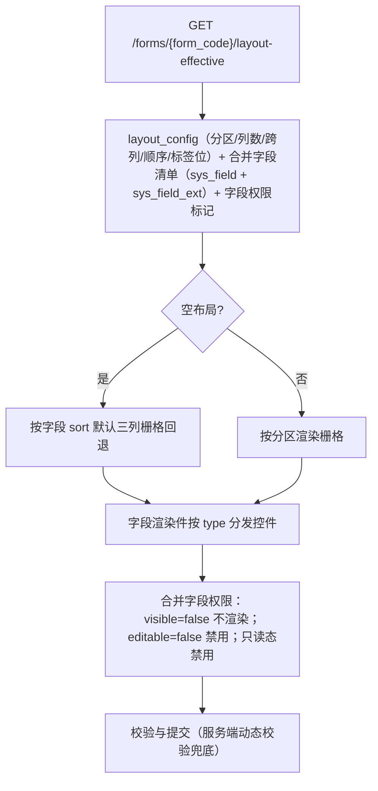

# 组件设计 · 表单渲染器

> 布局元数据驱动的表单渲染：分区与栅格 / 字段类型分发 / 三态共用 / 权限叠加 / 校验与提交 / 明细区
> 实现侧命名与落点见《[前端基类清单](../../../../前端基类清单.md)》，实现契约细节见项目详细设计。

[文档首页](../../../../文档首页.md) › [项目规划说明](../../../../规划/项目规划说明.md) › [组件设计](../../01_组件设计_总览.md) › 表单渲染器　|　[← 国际化文案编辑器](../11_组件设计_国际化文案编辑器/11_组件设计_国际化文案编辑器.md)　[侧边菜单 →](../13_组件设计_侧边菜单/13_组件设计_侧边菜单.md)

> 可交互原型：[12_原型设计_表单渲染器.html](12_原型设计_表单渲染器.html)（演示布局元数据驱动的分区/栅格渲染、字段按类型分发、三态（新增/编辑/查看）、权限叠加、校验与提交、明细区）

## 1. 目的与适用范围 

定义 BMS 前端 PC 管理端**表单渲染器**的组件设计：渲染容器（按布局元数据渲染主表/分区/明细、三态、权限叠加、校验与提交），字段渲染件（按字段类型分发到具体控件），以及状态与提交装配（元数据取数、字段分发映射、三态与权限合并、校验、明细、提交）。适用于**全部业务表单页**（表单页 Tab）与列表页查询区/明细区的**布局驱动渲染**（[《概要设计 · 表单定制》](../../../概要设计/36_概要设计_表单定制.md)核心）。

本节对应[《项目规划说明》](../../../../规划/项目规划说明.md)「功能模块」之**表单定制**模块「布局驱动渲染」；上游设计依据[《概要设计 · 表单定制》](../../../概要设计/36_概要设计_表单定制.md)（`layout-effective` 渲染路径、三态共用、权限叠加、服务端动态校验、明细区/查询区配置、组件类型）与[《架构设计 · 表单定制》](../../../架构设计/30_架构设计_子系统_表单定制.md)（前端布局驱动渲染器、字段组件映射、空布局回退）；页面形态依据[《布局设计 · 表单页》](../../../布局设计/08_布局设计_表单页.html)（主表三列、窄容器单列、长字段跨整行、系统信息、明细 Tab、只读）与[《布局设计 · 表单定制》](../../../布局设计/14_布局设计_表单定制.html)「渲染规则（三态共用/回退/权限叠加）」节、[《布局设计 · 表格明细》](../../../布局设计/09_布局设计_表格明细.html)（明细行内编辑）；协作节点为字段类 [字典字段](../../06_字段类/01_组件设计_字典字段/01_组件设计_字典字段.md)～[级联选择](../../06_字段类/12_组件设计_级联选择/12_组件设计_级联选择.md)（控件分发）、[展示类「通用表格」](../../07_展示类/01_组件设计_通用表格/01_组件设计_通用表格.md)（明细/查询区）、[展示类「状态标签与描述列表」](../../07_展示类/03_组件设计_状态标签与描述列表/03_组件设计_状态标签与描述列表.md)（只读渲染）、[交互类「表单设计器」](../05_组件设计_表单设计器/05_组件设计_表单设计器.md)（设计态与渲染器**同一套字段渲染**，所见即所得）、[基础类「请求封装」](../../09_基础类/01_组件设计_请求封装/01_组件设计_请求封装.md)（取数/提交）、[基础类「格式化工具」](../../09_基础类/03_组件设计_格式化工具/03_组件设计_格式化工具.md)（校验规则工厂）。

> 本篇为「表单渲染器」节点。**范围边界**：**布局配置**（设计器）归[交互类「表单设计器」](../05_组件设计_表单设计器/05_组件设计_表单设计器.md)；**字段控件本体**归 基础控件类与字段类（本节点只做**分发与组合**）；**服务端动态校验**归[《架构设计 · 表单定制》](../../../架构设计/30_架构设计_子系统_表单定制.md)（前端对齐规则，后端强制）；**列表页查询区/明细区**的筛选与列配置分别复用 [查询筛选区](../../07_展示类/02_组件设计_查询筛选区/02_组件设计_查询筛选区.md) 与 [通用表格](../../07_展示类/01_组件设计_通用表格/01_组件设计_通用表格.md)；移动端不复用 PC 组件（见第 12 节）。

## 2. 职责与组成 

| 组成部分 | 职责 |
| --- | --- |
| 渲染容器 | 按布局元数据渲染分区/栅格/分组、三态（新增/编辑/查看）、系统信息区、明细 Tab、权限叠加、校验与提交、空布局回退、加载/错误态 |
| 字段渲染件 | 按字段 `type` 分发到对应控件（基础控件类、字段类）；标签/占位/必填/错误由[字段壳能力](../../02_基础组件类/02_能力类/10_组件设计_字段壳能力/10_组件设计_字段壳能力.md)装配，受控/三态/禁用由[输入组件基类](../../02_基础组件类/03_域基类/01_组件设计_输入域基类/01_组件设计_输入域基类.md)提供，可见/可编辑/脱敏由[字段权限能力](../../02_基础组件类/02_能力类/11_组件设计_字段权限能力/11_组件设计_字段权限能力.md)判定 |
| 状态与提交装配 | `layout-effective` 取数、字段清单与权限标记合并、字段分发映射、三态与只读判定、校验规则构建、明细数据、提交 |

- **设计态与渲染态同源**：渲染容器与[交互类「表单设计器」](../05_组件设计_表单设计器/05_组件设计_表单设计器.md)的画布复用同一字段渲染与栅格口径，保证所见即所得。

## 3. 元数据与渲染流程 

| 步骤 | 说明 |
| --- | --- |
| 取元数据 | 渲染路径接口一次返回布局 + 合并字段清单 + 当前用户字段权限标记（短缓存/版本失效） |
| 空布局回退 | 无配置时按字段 `sort` 默认三列栅格（与既有表单页一致，保证可用） |
| 字段分发 | 字段渲染件按 `type` 映射控件（基础控件类 / 字段类，见第 5 节） |
| 权限叠加 | 布局可见性 + 字段权限（`visible`/`editable`，见 [字段权限能力](../../02_基础组件类/02_能力类/11_组件设计_字段权限能力/11_组件设计_字段权限能力.md)）叠加，**权限优先** |
| 未知字段 | 布局引用失效字段自动跳过并提示，不阻断 |
| 三态 | 新增/编辑/查看共用一套布局（见第 4 节） |

## 4. 交互与契约语义 

| 语义项 | 说明 |
| --- | --- |
| 表单标识 | 渲染路径的表单标识（`form_code`） |
| 三态 | `create`（新增）/ `edit`（编辑）/ `view`（查看） |
| 表单数据 | 受控双向绑定（数据变化通知） |
| 记录主键 | `edit`/`view` 拉取详情的记录主键 |
| 明细区配置 | 明细区 Tab 配置（主从模块） |
| 标签位置 | `top` / `left`（缺省按布局元数据） |
| 强制只读 | 覆盖三态的只读开关 |
| 提交与通知 | 提交（由页面接入创建/更新，或容器内提交）、保存成功、字段变化通知 |
| 对外能力 | 校验、取表单数据、设置表单数据、重置字段、提交 |

## 5. 字段分发映射 

| 字段 `type` | 控件（组件设计节点） |
| --- | --- |
| `text` | **基础控件类·文本框**（继承 [输入组件基类](../../02_基础组件类/03_域基类/01_组件设计_输入域基类/01_组件设计_输入域基类.md)） |
| `longtext` | **基础控件类·文本域**；可切富文本时用 [富文本字段](../../06_字段类/07_组件设计_富文本字段/07_组件设计_富文本字段.md) |
| `number` | **基础控件类·数字框**；`amount`/`percent` 语义用 [数值与金额字段](../../06_字段类/03_组件设计_数值与金额字段/03_组件设计_数值与金额字段.md) |
| `date` / `datetime` | [日期时间字段](../../06_字段类/02_组件设计_日期时间字段/02_组件设计_日期时间字段.md) |
| `select` / `multi_select`（字典） | [字典字段](../../06_字段类/01_组件设计_字典字段/01_组件设计_字典字段.md)（继承基础控件类的下拉/单选/复选语义） |
| `select` / `radio` / `checkbox`（自定义选项/枚举） | [开关与枚举字段](../../06_字段类/08_组件设计_开关与枚举字段/08_组件设计_开关与枚举字段.md)（继承基础控件类的单选/复选语义） |
| `switch` | [开关与枚举字段](../../06_字段类/08_组件设计_开关与枚举字段/08_组件设计_开关与枚举字段.md)（继承基础控件类的开关语义） |
| `file` / `image` | [文件上传字段](../../06_字段类/06_组件设计_文件上传字段/06_组件设计_文件上传字段.md) |
| `richtext` | [富文本字段](../../06_字段类/07_组件设计_富文本字段/07_组件设计_富文本字段.md) |
| `dept` / `tree` | [树选择字段](../../06_字段类/04_组件设计_树选择字段/04_组件设计_树选择字段.md) |
| `user` / `post` / `org` | [组织选择字段](../../06_字段类/05_组件设计_组织选择字段/05_组件设计_组织选择字段.md) |
| `transfer` | [穿梭框](../../06_字段类/09_组件设计_穿梭框/09_组件设计_穿梭框.md) |
| `cascader` | [级联选择](../../06_字段类/12_组件设计_级联选择/12_组件设计_级联选择.md) |
| `tags` | [标签输入](../../06_字段类/11_组件设计_标签输入/11_组件设计_标签输入.md) |
| `captcha` | [验证码](../../06_字段类/10_组件设计_验证码/10_组件设计_验证码.md)（登录/表单场景） |
| 未知类型 | 纯文本回退 + 开发告警（不阻断） |

- 控件由字段渲染件装配、外层结构由 [字段壳能力](../../02_基础组件类/02_能力类/10_组件设计_字段壳能力/10_组件设计_字段壳能力.md) 提供（标签/占位/必填/错误/栅格跨度），控件行为由 [输入组件基类](../../02_基础组件类/03_域基类/01_组件设计_输入域基类/01_组件设计_输入域基类.md) 提供（受控/三态/禁用），权限与脱敏由 [字段权限能力](../../02_基础组件类/02_能力类/11_组件设计_字段权限能力/11_组件设计_字段权限能力.md) 判定，校验规则由服务端一致的规则工厂（[基础类「格式化工具」](../../09_基础类/03_组件设计_格式化工具/03_组件设计_格式化工具.md)）构建。

## 6. 栅格、三态与权限 

| 项 | 设计 |
| --- | --- |
| 栅格 | 标签置顶；主表分区按列数 1/2/3 等分栅格；长文本/备注跨整行；窄容器（窄抽屉/移动端）单列 |
| 分区/分组 | 超过 8 字段用分区标题分组；顺序按布局 `sort` |
| 三态共用 | 新增/编辑/详情同一布局（[《布局设计 · 表单定制》](../../../布局设计/14_布局设计_表单定制.html)）；只读回显按只读模式（纯文本/禁用控件）由 [字段壳能力](../../02_基础组件类/02_能力类/10_组件设计_字段壳能力/10_组件设计_字段壳能力.md) 决定 |
| 权限叠加 | `visible=false` 不渲染；`editable=false` 编辑态禁用；权限优先于布局（判定见 [字段权限能力](../../02_基础组件类/02_能力类/11_组件设计_字段权限能力/11_组件设计_字段权限能力.md)） |
| 系统信息 | 详情页系统信息区（ID/版本/创建/修改等）只读三列（[《布局设计 · 表单页》](../../../布局设计/08_布局设计_表单页.html)） |
| 脱敏 | 敏感字段默认掩码，持明文动作权限时可切换明文（[字段权限能力](../../02_基础组件类/02_能力类/11_组件设计_字段权限能力/11_组件设计_字段权限能力.md)口径） |

## 7. 明细区 

| 项 | 设计 |
| --- | --- |
| 结构 | 多个明细 Tab；每个明细为可编辑表格（[通用表格](../../07_展示类/01_组件设计_通用表格/01_组件设计_通用表格.md) 行内编辑，仅编辑态可用） |
| 关联 | 明细行含「主表数据 id」列，对应当前主表 ID；新增主表明细 id 在保存事务内回填 |
| 列配置 | 列显隐/顺序/宽度来自布局 `detail` 配置（[交互类「表单设计器」](../05_组件设计_表单设计器/05_组件设计_表单设计器.md)） |
| 整体保存 | 主表 + 全部明细**单事务**提交，保证一致性（[《布局设计 · 表单页》](../../../布局设计/08_布局设计_表单页.html)「校验与提交」节） |
| 行操作 | 新增行/删除行/行内编辑（编辑态）；校验行级规则 |

## 8. 校验与提交 

| 项 | 设计 |
| --- | --- |
| 前端校验 | 按字段属性（必填/长度/范围/正则/选项集）构建规则（[基础类「格式化工具」](../../09_基础类/03_组件设计_格式化工具/03_组件设计_格式化工具.md) 规则工厂），与后端一致 |
| 服务端校验 | 后端按生效布局**动态校验**（强制，前端不依赖）；字段级错误返回并定位 |
| 提交 | 校验通过 → 提交（创建/更新）；保存中防重复提交；成功通知 → 页面刷新列表 |
| 乐观锁 | `edit` 携带 `version`；409 提示「记录已被修改」并重载 |
| 冲突/错误 | 按错误码提示并定位字段（i18n） |

## 9. 状态与提交装配 

| 项 | 语义 |
| --- | --- |
| 取数 | 取布局元数据 + 合并字段清单 + 权限标记；编辑/查看再取详情 |
| 分发 | 按字段类型返回对应控件（基础控件类 / 字段类）；未知类型回退纯文本 |
| 权限 | 只读由查看态或整体无编辑权限决定；字段级可见/可编辑逐字段处理（[字段权限能力](../../02_基础组件类/02_能力类/11_组件设计_字段权限能力/11_组件设计_字段权限能力.md)） |
| 校验 | 构建字段规则并触发校验；明细行级校验 |
| 提交 | 主表 + 明细单事务；成功回调 |
| 空布局 | 无布局配置时按字段 `sort` 默认栅格回退 |

## 10. 场景集成 

| 场景 | 说明 |
| --- | --- |
| 业务表单页（记录 Tab） | 本节点主体：按布局渲染主表 + 明细（[《布局设计 · 表单页》](../../../布局设计/08_布局设计_表单页.html)） |
| 表单设计器画布预览 | [交互类「表单设计器」](../05_组件设计_表单设计器/05_组件设计_表单设计器.md) 复用同一字段渲染（所见即所得） |
| 明细区 | 可编辑表格（[通用表格](../../07_展示类/01_组件设计_通用表格/01_组件设计_通用表格.md)） |
| 列表页查询区 | 归 [查询筛选区](../../07_展示类/02_组件设计_查询筛选区/02_组件设计_查询筛选区.md)（同一字段元数据） |
| 打印/导出 | 按布局渲染打印模板 |
| 移动端 | 独立工程单列渲染（同一元数据），不复用 PC 组件 |

## 11. 依赖接口与上游变更 

### 11.1 上游接口与口径 

| 项 | 说明 | 目标文档 |
| --- | --- | --- |
| 渲染路径 | `GET /forms/{form_code}/layout-effective`（布局 + 合并字段 + 权限标记） | [《概要设计 · 表单定制》](../../../概要设计/36_概要设计_表单定制.md) |
| 业务详情/写接口 | 各模块创建/更新/详情（动态校验在服务层） | [《概要设计 · 表单定制》](../../../概要设计/36_概要设计_表单定制.md) |
| 字段/权限 | `sys_field`/`sys_field_ext`/`sys_role_field` | [《概要设计 · 菜单管理》](../../../概要设计/07_概要设计_菜单管理.md)、[《概要设计 · 角色管理》](../../../概要设计/06_概要设计_角色管理.md) |
| 组件类型 | 字段类型与控件映射（含新增类型） | [《概要设计 · 表单定制》](../../../概要设计/36_概要设计_表单定制.md)（登记项②） |
| 新增依赖 | **无**：复用基础控件类与字段类控件（均继承 [输入组件基类](../../02_基础组件类/03_域基类/01_组件设计_输入域基类/01_组件设计_输入域基类.md)） | — |

### 11.2 需登记的上游变更 

| 变更点 | 目标文档 | 内容 |
| --- | --- | --- |
| ① 渲染器前端契约 | [《概要设计 · 表单定制》](../../../概要设计/36_概要设计_表单定制.md)「功能点分解」「渲染规则」节；[《架构设计 · 表单定制》](../../../架构设计/30_架构设计_子系统_表单定制.md)「前端渲染与设计器架构」节 | 明确布局驱动渲染器契约：`layout-effective` 下发分区/列数/跨列/顺序/标签位 + 合并字段 + 权限标记；三态共用；空布局按 `sort` 回退；权限优先；明细区列配置与整体单事务提交；设计器与渲染器**同一套字段渲染** |
| ② 字段类型→控件映射（含新增） | [《概要设计 · 表单定制》](../../../概要设计/36_概要设计_表单定制.md)「组件类型与自建字段边界」节 | 明确 `type → 控件` 映射表，含新增 **穿梭框/级联/标签输入/验证码** 等组件类型（登记各字段类节点）；未知类型纯文本回退 + 告警 |
| ③ 服务端动态校验一致性 | [《架构设计 · 表单定制》](../../../架构设计/30_架构设计_子系统_表单定制.md)「服务端动态校验」节 | 明确字段级动态校验错误返回结构与前端定位口径（字段 key + 规则类型），前端规则与服务端一致、后端强制 |

> 按[《文档生成规范》](../../../../规范/文档生成规范.md)「引用与追溯」节，上述变更需用户确认后由上游文档同步；本节点只定义组件契约，不单独裁决接口与校验规则。

## 12. 权限 / i18n / 移动端 

- **权限**：字段 `visible`/`editable`/`required` 与脱敏的权威契约见 [字段权限能力](../../02_基础组件类/02_能力类/11_组件设计_字段权限能力/11_组件设计_字段权限能力.md)（叠加布局、权限优先、明文切换动作权限）；后端逐接口权限校验与动态校验兜底。
- **i18n**：字段 label、提示、占位按元数据 locale 下发（`sys_field_i18n`/`sys_field_ext_i18n`）；错误文案按 `error.404xx` 映射（i18n）；**不翻译用户数据**。
- **移动端**：移动端为同一契约的另一实现（契约套件同一套断言）；按同一 `layout-effective` 元数据**单列重排**渲染（[《布局设计 · 移动端细化》](../../../布局设计/16_布局设计_移动端细化.html)），校验规则与提交同源。

## 13. 性能与边界 

| 场景 | 设计 |
| --- | --- |
| 元数据 | 渲染路径短缓存 + 版本失效；同表单多次进入零额外请求 |
| 字段渲染 | 按需懒加载重控件（富文本/代码/图表）；字典/组织走各自缓存与批量接口 |
| 校验 | 前端规则工厂即时；服务端动态校验在提交时；异步唯一性校验防抖 |
| 明细 | 行内编辑按需渲染；大数据明细分页/虚拟滚动 |
| 边界 | 空布局回退、未知字段跳过、未知类型纯文本、字段停用、权限叠加、脱敏切换、区间起止校验、必填失败定位、409 冲突、明细行级错误、窄容器单列、只读态 |
| 不支持 | 布局配置（表单设计器）、字段控件本体（基础控件类、字段类）、服务端动态校验（后端）、查询区（查询筛选区）、移动端组件复用 |

## 14. 检查清单 

- □ 职责分层：渲染容器与提交、字段类型分发、状态与校验装配；字段壳/输入域/权限复用字段壳能力/输入组件基类/字段权限能力；设计器与渲染器同一套字段渲染
- □ 元数据：`layout-effective` 取布局 + 合并字段 + 权限标记；空布局按 `sort` 回退；未知字段跳过
- □ 字段分发：`type → 控件` 映射覆盖 基础控件类（text/longtext/number/select/radio/checkbox/switch）与字段类（含穿梭框/级联/标签/验证码）；未知类型纯文本 + 告警
- □ 栅格与形态：分区/分组、列数 1/2/3、跨整行、标签位、窄容器单列
- □ 三态与权限：三态共用；`visible=false` 不渲染、`editable=false` 禁用、权限优先；系统信息只读三列；脱敏
- □ 明细区：多 Tab、行内编辑（编辑态）、列配置、主从单事务提交、行级校验
- □ 校验提交：前端规则与后端动态校验一致；必填/区间/409 冲突处理
- □ 权限（字段权限/脱敏）、i18n（label/错误码，数据不翻译）、移动端（单列同源）符合第 12 节
- □ 性能：元数据缓存、重控件懒加载、字典批量、明细分页/虚拟滚动
- □ 三项上游登记已确认：渲染器前端契约、字段类型→控件映射（含新增）、服务端动态校验一致性

> 组件设计节点 · 与[《概要设计 · 表单定制》](../../../概要设计/36_概要设计_表单定制.md)[《架构设计 · 表单定制》](../../../架构设计/30_架构设计_子系统_表单定制.md)[《布局设计 · 表单页》](../../../布局设计/08_布局设计_表单页.html)[《布局设计 · 表单定制》](../../../布局设计/14_布局设计_表单定制.html)[《布局设计 · 表格明细》](../../../布局设计/09_布局设计_表格明细.html)[字典字段](../../06_字段类/01_组件设计_字典字段/01_组件设计_字典字段.md)[展示类「通用表格」](../../07_展示类/01_组件设计_通用表格/01_组件设计_通用表格.md)[交互类「表单设计器」](../05_组件设计_表单设计器/05_组件设计_表单设计器.md)[基础类「格式化工具」](../../09_基础类/03_组件设计_格式化工具/03_组件设计_格式化工具.md)《命名规范》配套
