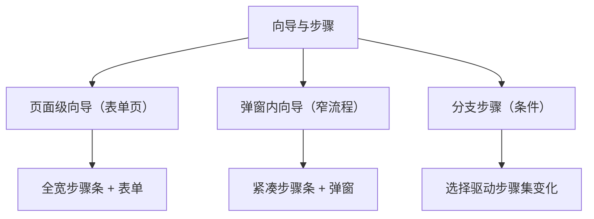

# 组件设计 · 向导与步骤

> 多步流程的步骤编排：步骤条 / 分步校验 / 上一步·下一步·提交 / 已到达步可跳 / 条件分支步骤 / 草稿 / 结果页（含弹窗内紧凑向导）
> 实现侧命名与落点见《[前端基类清单](../../../../前端基类清单.md)》，实现契约细节见项目详细设计。

[文档首页](../../../../文档首页.md) › [项目规划说明](../../../../规划/项目规划说明.md) › [组件设计](../../01_组件设计_总览.md) › 向导与步骤　|　[← 侧边菜单](../13_组件设计_侧边菜单/13_组件设计_侧边菜单.md)　[偏好设置面板 →](../15_组件设计_偏好设置面板/15_组件设计_偏好设置面板.md)

> 可交互原型：[14_原型设计_向导与步骤.html](14_原型设计_向导与步骤.html)（演示步骤条、分步校验、上一步/下一步/提交、已到达步骤可跳、条件分支步骤、草稿、结果页与弹窗内紧凑向导）

## 1. 目的与适用范围 

定义 BMS 前端 PC 管理端**向导与步骤**的组件设计：向导壳（步骤条 + 步骤内容 + 底部操作栏）、单步容器（当前步渲染与校验）、步骤状态编排（当前步、各步数据、校验、草稿、分支）。适用于**多步表单/开通流程**（租户开通、数据导入映射、初始化引导、复杂业务申请），支撑[《布局设计 · 表单页》](../../../布局设计/08_布局设计_表单页.html)的分步表单形态与[《布局设计 · 弹窗》](../../../布局设计/10_布局设计_弹窗.html)的弹窗内向导。

### 1.1 定位与边界 

职责边界与形态分流如下：

- **页面级向导**：整页承载多步表单（[《布局设计 · 表单页》](../../../布局设计/08_布局设计_表单页.html)），步骤条横向（宽屏）/纵向或进度（窄屏）。
- **弹窗内向导**：步骤数少、字段少的流程放在弹窗（[《布局设计 · 弹窗》](../../../布局设计/10_布局设计_弹窗.html)），步骤条紧凑。
- **分支步骤**：前序步骤的选择决定后续步骤集合（如「导入方式 = Excel/CSV」影响映射步骤）。

上游/协作：步骤内容通常由[交互类「表单渲染器」](../12_组件设计_表单渲染器/12_组件设计_表单渲染器.md)渲染单步表单；弹窗承载由[交互类「弹窗抽屉表单」](../../04_容器组件类/01_组件设计_弹窗抽屉表单/01_组件设计_弹窗抽屉表单.md)负责；结果页复用[展示类「状态标签与描述列表」](../../07_展示类/03_组件设计_状态标签与描述列表/03_组件设计_状态标签与描述列表.md)/[展示类「异常与空状态」](../../07_展示类/05_组件设计_异常与空状态/05_组件设计_异常与空状态.md)。

> 本篇为「向导与步骤」节点。**范围边界**：**单步表单渲染与校验**归[交互类「表单渲染器」](../12_组件设计_表单渲染器/12_组件设计_表单渲染器.md)（本节点只做步骤编排与整向导校验汇总）；**弹窗壳**归[交互类「弹窗抽屉表单」](../../04_容器组件类/01_组件设计_弹窗抽屉表单/01_组件设计_弹窗抽屉表单.md)；**导入映射**等具体业务步骤归[交互类「导入导出」](../01_组件设计_导入导出/01_组件设计_导入导出.md)（复用本向导）。

## 2. 职责与组成 

| 组成部分 | 职责 |
| --- | --- |
| 向导壳 | 步骤条（横/纵/进度）、步骤内容切换、底部操作栏（上一步/下一步/提交/取消）、分支步骤、结果页、弹窗紧凑模式 |
| 单步容器 | 单步标题/描述、内容插槽、当前步校验触发、步骤内错误汇总 |
| 步骤状态编排 | 当前步、各步数据、已完成步集合、校验（当前步/全部）、草稿存取、分支解析、步骤导航 |
| 继承链 | 向导件沿继承链派生（总基类 → 组件根 → 中间层基类 → 能力域基类 → 域基类 → 具体件）：步骤表单复用[交互类「表单渲染器」](../12_组件设计_表单渲染器/12_组件设计_表单渲染器.md)，草稿与步骤状态在链上对应层维护，不在件内重复实现 |

- 能力域基类是继承链上的一类基类，主体内建走继承轨，不在链外自由挂接能力。

## 3. 交互与契约语义 

| 语义项 | 说明 |
| --- | --- |
| 步骤定义 | 步骤集合：步骤键、标题、描述、可见条件（分支）、当前步校验器 |
| 向导数据 | 各步共用的数据模型，按步读写；提交时组装 |
| 步骤条方向 | 横向（宽屏）/ 纵向或进度（窄屏）；弹窗内为紧凑模式（简化步骤条、压缩间距） |
| 步骤跳转 | 仅可回到**已到达/已完成**步骤；向前跳需通过中间步骤校验（可配） |
| 分步校验 | 「下一步」前校验当前步；不通过停在本步并提示 |
| 提交 | 末步「提交」先整体校验（不可见步跳过），通过后发请求；失败定位到出错步 |
| 取消 | 有未保存修改时二次确认 |
| 草稿 | 设置草稿键后按步变更/防抖保存；进入时有草稿提示恢复/丢弃；提交成功后清除 |
| 结果页 | 提交成功/失败展示结果步（成功详情/继续操作，失败原因/重试） |
| 提交按钮文案 | 末步按钮文案（默认「提交」，可配） |
| 状态入口 | 对外提供下一步、上一步、跳转、整体校验、重置等语义入口 |

## 4. 交互与校验 

| 项 | 设计 |
| --- | --- |
| 步骤条 | 宽屏横向、窄屏纵向/进度；显示当前步、已完成、未开始状态 |
| 步骤内容 | 每步内容为插槽（常为表单渲染器/自定义表单）；同一时刻仅渲染当前步（或按需保留已过步） |
| 分步校验 | 点「下一步」先校验当前步；不通过停在本步并提示 |
| 步骤跳转 | 仅可回到**已到达**步骤；向前跳需通过中间步骤校验（可配） |
| 分支步骤 | 步骤可见条件决定步骤是否出现；选择变化时**重算可见步骤**并修正当前步 |
| 草稿 | 草稿键设置后按步变更/防抖保存；进入时若有草稿提示恢复/丢弃；提交成功后清除 |
| 提交 | 末步「提交」先整体校验（含不可见步跳过），通过后发请求；失败定位到出错步 |
| 取消/关闭 | 有未保存修改时确认（[交互类「弹窗抽屉表单」](../../04_容器组件类/01_组件设计_弹窗抽屉表单/01_组件设计_弹窗抽屉表单.md)） |
| 结果页 | 提交成功/失败展示结果步骤（成功详情/继续操作，失败原因/重试） |
| 弹窗内向导 | 紧凑模式随弹窗宽度；步骤条简化为当前/总数或极简步骤 |
| 数据流 | 各步共用向导数据；提交时组装；步骤间依赖（后步读前步数据）由业务在步骤校验/渲染中处理 |

## 5. 场景集成 

| 场景 | 步骤示例 |
| --- | --- |
| 租户开通 | 基本信息 → 套餐/资源 → 管理员账号 → 确认提交 |
| 数据导入映射 | 上传文件 → 字段映射 → 校验预览 → 执行导入（[交互类「导入导出」](../01_组件设计_导入导出/01_组件设计_导入导出.md)） |
| 初始化引导 | 组织信息 → 字典/参数 → 完成 |
| 复杂业务申请 | 申请人信息 → 明细 → 附件 → 提交 |
| 弹窗内向导 | 短流程（≤3 步）置于弹窗 |

## 6. 依赖接口与上游变更 

### 6.1 上游接口与口径 

| 项 | 说明 | 目标文档 |
| --- | --- | --- |
| 分步表单形态 | 页面级向导的步骤条/操作栏位置 | [《布局设计 · 表单页》](../../../布局设计/08_布局设计_表单页.html)（登记项①） |
| 弹窗承载 | 弹窗内向导的宽度/步骤条/关闭 | [《布局设计 · 弹窗》](../../../布局设计/10_布局设计_弹窗.html)（登记项②） |
| 单步表单 | 表单渲染与校验 | [交互类「表单渲染器」](../12_组件设计_表单渲染器/12_组件设计_表单渲染器.md) |
| 窄屏适配 | 步骤条方向/进度、按钮布局 | [《布局设计 · 响应式适配》](../../../布局设计/11_布局设计_响应式适配.html)（登记项③） |
| 草稿 | 草稿键与存储（本地/服务端） | [交互类「弹窗抽屉表单」](../../04_容器组件类/01_组件设计_弹窗抽屉表单/01_组件设计_弹窗抽屉表单.md)（口径） |
| 新增依赖 | **无**：复用既有步骤条与表单基础件 | — |

### 6.2 需登记的上游变更 

| 变更点 | 目标文档 | 内容 |
| --- | --- | --- |
| ① 向导/步骤表单细则 | [《布局设计 · 表单页》](../../../布局设计/08_布局设计_表单页.html)「分步表单」节 | 补向导细则：步骤条位置/方向、底部操作栏（上一步/下一步/提交/取消）、分步校验、已到达步可跳、分支步骤、草稿提示、结果页；标注组件设计 交互类「向导与步骤」为组件契约依据 |
| ② 弹窗内向导细则 | [《布局设计 · 弹窗》](../../../布局设计/10_布局设计_弹窗.html)「弹窗内多步」节 | 明确弹窗内向导：步骤数上限建议、紧凑步骤条、弹窗宽度、关闭/取消脏数据确认、结果步 |
| ③ 窄屏向导适配 | [《布局设计 · 响应式适配》](../../../布局设计/11_布局设计_响应式适配.html)「分步表单窄屏」节 | 明确窄屏步骤条转纵向或进度条、操作栏吸附底部、按钮全宽/堆叠 |

> 按[《文档生成规范》](../../../../规范/文档生成规范.md)「引用与追溯」节，上述变更需用户确认后由上游文档同步；本节点只定义组件契约，不单独裁决布局与交互规范。

## 7. 权限 / i18n / 移动端 

- **权限**：进入向导按入口权限；步骤内数据范围/操作权限由各步表单控件控制（[基础类「权限指令」](../../09_基础类/02_组件设计_权限指令/02_组件设计_权限指令.md)）。
- **i18n**：步骤标题/描述由业务 i18n；界面文案（下一步/提交/草稿提示/确认）走全局语言能力。
- **移动端**：步骤条纵向或进度、操作栏吸附底部、内容单列；弹窗向导在移动端转为整页或全屏抽屉（[《布局设计 · 移动端》](../../../布局设计/15_布局设计_移动端.html)）。

## 8. 性能与边界 

| 场景 | 设计 |
| --- | --- |
| 渲染 | 仅渲染当前步；步骤数据保留在向导数据中不重渲染已过步（可配保留） |
| 校验 | 当前步校验轻量；整体校验汇总；异步校验并发 |
| 草稿 | 防抖保存；大对象注意序列化开销；提交成功清除 |
| 边界 | 分支步骤导致当前步失效（回退到最近有效步）、已到达步跳转、校验失败定位、草稿冲突（多人/多端）、弹窗关闭脏数据、提交失败重试、步骤依赖前序数据缺失、单步（无步骤条隐藏）、纯结果步 |
| 不支持 | 单步表单渲染/校验（表单渲染器）、弹窗壳（弹窗抽屉表单）、具体业务步骤（导入导出等） |

## 9. 检查清单 

- □ 分层：向导壳、单步容器、步骤状态编排各司其职；单步表单复用表单渲染器；经继承链派生（能力域基类为链上的一类基类）
- □ 步骤条：横向/纵向/进度、当前/已完成/未开始、窄屏适配、弹窗紧凑模式
- □ 导航与校验：上一步/下一步/提交/取消、分步校验、已到达步可跳、整体校验定位出错步
- □ 分支：步骤可见条件重算、当前步修正
- □ 草稿：自动保存/恢复/丢弃、提交成功后清除、多端冲突提示
- □ 结果页：成功详情/继续、失败原因/重试
- □ 权限（入口/各步）、i18n（步骤名/文案）、移动端（纵向/吸附/全宽）符合第 7 节
- □ 性能边界：仅渲染当前步、防抖草稿、异步校验并发
- □ 三项上游登记已确认：向导/步骤表单细则、弹窗内向导细则、窄屏向导适配

> 组件设计节点 · 与[《布局设计 · 表单页》](../../../布局设计/08_布局设计_表单页.html)[《布局设计 · 弹窗》](../../../布局设计/10_布局设计_弹窗.html)[《布局设计 · 响应式适配》](../../../布局设计/11_布局设计_响应式适配.html)[《布局设计 · 移动端》](../../../布局设计/15_布局设计_移动端.html)[交互类「弹窗抽屉表单」](../../04_容器组件类/01_组件设计_弹窗抽屉表单/01_组件设计_弹窗抽屉表单.md)[交互类「导入导出」](../01_组件设计_导入导出/01_组件设计_导入导出.md)[交互类「表单渲染器」](../12_组件设计_表单渲染器/12_组件设计_表单渲染器.md)[展示类「状态标签与描述列表」](../../07_展示类/03_组件设计_状态标签与描述列表/03_组件设计_状态标签与描述列表.md)[展示类「异常与空状态」](../../07_展示类/05_组件设计_异常与空状态/05_组件设计_异常与空状态.md)《命名规范》配套
