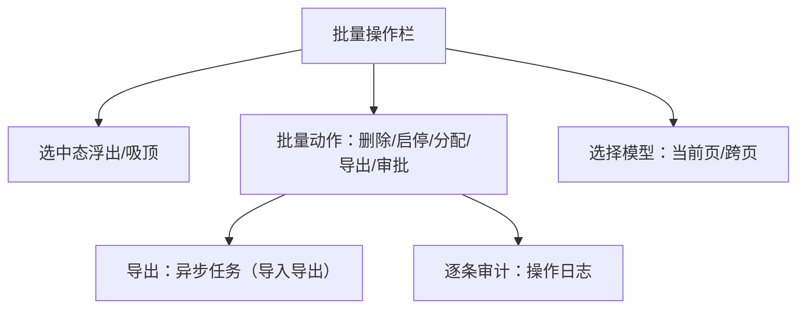

# 组件设计 · 批量操作栏

> 列表多选后的批量操作：选中浮出 / 批量启停与删除 / 批量导出 / 跨页全选 / 权限过滤 / 二次确认与部分成功反馈
> 实现侧命名与落点见《[前端基类清单](../../../../前端基类清单.md)》，实现契约细节见项目详细设计。

[文档首页](../../../../文档首页.md) › [项目规划说明](../../../../规划/项目规划说明.md) › [组件设计](../../01_组件设计_总览.md) › 批量操作栏　|　[← 偏好设置面板](../15_组件设计_偏好设置面板/15_组件设计_偏好设置面板.md)　[主题与品牌化 →](../17_组件设计_主题与品牌化/17_组件设计_主题与品牌化.md)

> 可交互原型：[16_原型设计_批量操作栏.html](16_原型设计_批量操作栏.html)（演示选中浮出操作栏、显示选中数、批量启停/删除/导出、跨页选择、权限控制、二次确认与异步结果反馈）

## 1. 目的与适用范围 

定义 BMS 前端 PC 管理端**批量操作栏**的组件设计：操作栏（列表选中行后出现、显示选中数量、批量操作按钮、清除选择、进度与结果反馈）与选择模型（当前页/跨页选择、全选、选中集合维护）。用于**列表页多选后的批量操作**（批量删除、批量启用/停用、批量移动/分配、批量导出、批量审批等），是[《布局设计 · 列表页》](../../../布局设计/07_布局设计_列表页.html)「批量操作」形态的通用组件。

### 1.1 定位与边界 

职责边界与相关节点分流如下：

- **选择模型**：由[展示类「通用表格」](../../07_展示类/01_组件设计_通用表格/01_组件设计_通用表格.md)提供行选择能力，本节点维护**选中集合**与**跨页选择**语义。
- **批量动作**：删除/启停等由业务提供；**批量导出**复用[交互类「导入导出」](../01_组件设计_导入导出/01_组件设计_导入导出.md)（大结果集异步任务）。
- **权限**：按钮按权限码显示/禁用（[基础类「权限指令」](../../09_基础类/02_组件设计_权限指令/02_组件设计_权限指令.md)）。

上游/协作：[《概要设计 · 操作日志》](../../../概要设计/11_概要设计_操作日志.md)（批量操作逐条审计）、[《概要设计 · 导入导出》](../../../概要设计/19_概要设计_导入导出.md)（批量导出异步任务）、[展示类「通知与消息」](../../07_展示类/06_组件设计_通知与消息/06_组件设计_通知与消息.md)（异步结果通知）、[基础类「请求封装」](../../09_基础类/01_组件设计_请求封装/01_组件设计_请求封装.md)。

> 本篇为「批量操作栏」节点。**范围边界**：**行选择控件**归[展示类「通用表格」](../../07_展示类/01_组件设计_通用表格/01_组件设计_通用表格.md)；**导出实现**归[交互类「导入导出」](../01_组件设计_导入导出/01_组件设计_导入导出.md)；**批量接口的幂等/事务**归各业务概要（本节点只定义交互契约）。

## 2. 职责与组成 

| 组成部分 | 职责 |
| --- | --- |
| 操作栏 | 选中数、动作按钮（含下拉更多）、清除选择、跨页提示、吸顶/浮出、进度与结果反馈、权限过滤 |
| 选择模型 | 当前页/跨页选中集合、全选、反选、清除、行键、选中数、跨页合并 |
| 继承链 | 操作栏沿继承链派生（根系 → 组件根 → 机制基类 → 能力层 → 域基类 → 具体件）：行选择复用[展示类「通用表格」](../../07_展示类/01_组件设计_通用表格/01_组件设计_通用表格.md)，权限判定与异步任务等经链上能力层消费 |

- 能力与域基类是继承链上的一层，主体内建走继承轨，不在链外自由挂接能力。

## 3. 交互与契约语义 

| 语义项 | 说明 |
| --- | --- |
| 选中项 | 选中集合（行对象或 id 集合），双向绑定 |
| 总记录数 | 当前查询总记录数（用于跨页全选提示） |
| 动作定义 | 动作集合：动作键、名称、图标、类型、危险标记、权限码、二次确认、处理逻辑 |
| 呈现位置 | 浮出（表格上方浮层）或吸顶（随滚动吸顶） |
| 跨页选择 | 是否支持跨页选择（服务端全选） |
| 超量确认 | 超过该数量需二次确认（0=不限制） |
| 完成后清空 | 动作完成后是否清空选择 |
| 反馈与通知 | 选中变化、动作触发、清除选择、异步进度与完成通知 |
| 状态入口 | 触发动作、设置进度、清除选择 |

## 4. 交互与反馈 

| 项 | 设计 |
| --- | --- |
| 出现时机 | 有选中项时出现；清空后隐藏（浮现/吸顶两种形态） |
| 选中数 | 显示「已选 N 项」；跨页时显示「已选 N 项（可全选本条件下共 M 项）」 |
| 全选/反选 | 当前页全选由表格提供；跨页全选进入服务端全选模式，切换页/条件清空 |
| 动作按钮 | 常用动作直显，更多收进下拉；危险动作（删除）红色并二次确认 |
| 权限 | 按动作权限码过滤/禁用（[基础类「权限指令」](../../09_基础类/02_组件设计_权限指令/02_组件设计_权限指令.md)） |
| 二次确认 | 删除/不可逆动作弹确认（含数量、影响）；超过超量阈值强制确认 |
| 异步任务 | 长任务（批量导出/导入）展示进度或转后台任务并通知（[交互类「导入导出」](../01_组件设计_导入导出/01_组件设计_导入导出.md)） |
| 结果反馈 | 全成功提示 + 刷新列表；部分成功提示「成功 X / 失败 Y」并支持查看失败明细 |
| 完成后 | 默认清空选择；保留选中（如连续操作）可配 |
| 审计 | 批量操作逐条记录操作日志（[《概要设计 · 操作日志》](../../../概要设计/11_概要设计_操作日志.md)） |
| 无障碍 | 键盘可达、操作栏出现时焦点管理（可选） |

## 5. 场景集成 

| 场景 | 批量动作 |
| --- | --- |
| 用户/角色管理 | 批量启用/停用、批量分配角色/部门、批量删除 |
| 字典/参数 | 批量启用/停用、批量删除 |
| 业务数据（商品/订单等） | 批量上下架、批量审核、批量导出 |
| 通知/公告 | 批量已读/删除 |
| 文件管理 | 批量下载/移动/删除 |
| 跨页操作 | 按当前筛选条件全选后批量处理 |

## 6. 依赖接口与上游变更 

### 6.1 上游接口与口径 

| 项 | 说明 | 目标文档 |
| --- | --- | --- |
| 批量接口 | 批量删除/启停等（`ids[]`，幂等、部分失败返回明细） | 各业务概要（[《概要设计 · 导入导出》](../../../概要设计/19_概要设计_导入导出.md) 参照） |
| 批量导出 | 大结果集异步任务 | [交互类「导入导出」](../01_组件设计_导入导出/01_组件设计_导入导出.md) |
| 审计 | 逐条操作日志 | [《概要设计 · 操作日志》](../../../概要设计/11_概要设计_操作日志.md)（登记项②） |
| 权限码 | 动作权限 | [基础类「权限指令」](../../09_基础类/02_组件设计_权限指令/02_组件设计_权限指令.md) |
| 列表批量形态 | 操作栏出现时机/位置/反馈 | [《布局设计 · 列表页》](../../../布局设计/07_布局设计_列表页.html)（登记项①） |
| 跨页选择 | 服务端全选语义 | [《布局设计 · 列表页》](../../../布局设计/07_布局设计_列表页.html)（登记项③） |
| 新增依赖 | **无**：复用既有按钮/下拉基础件 | — |

### 6.2 需登记的上游变更 

| 变更点 | 目标文档 | 内容 |
| --- | --- | --- |
| ① 批量操作栏细则 | [《布局设计 · 列表页》](../../../布局设计/07_布局设计_列表页.html)「批量操作」节 | 补批量操作细则：选中后操作栏出现（浮出/吸顶）、显示选中数、常用动作直显+更多下拉、危险动作二次确认与超量确认、权限过滤、完成后清空、部分成功反馈；标注组件设计 交互类「批量操作栏」为组件契约依据 |
| ② 批量操作审计 | [《概要设计 · 操作日志》](../../../概要设计/11_概要设计_操作日志.md)「记录范围」节 | 明确批量操作逐条记审计日志（操作人/动作/对象/结果），部分失败记录失败项与原因 |
| ③ 跨页（全选）选择语义 | [《布局设计 · 列表页》](../../../布局设计/07_布局设计_列表页.html)「选择模型」节 | 明确当前页/跨页选择：跨页全选按「当前筛选条件」由服务端全选，切换条件清空，批接口接受条件或显式 id 集 |

> 按[《文档生成规范》](../../../../规范/文档生成规范.md)「引用与追溯」节，上述变更需用户确认后由上游文档同步；本节点只定义组件契约，不单独裁决接口与选择语义。

## 7. 权限 / i18n / 移动端 

- **权限**：动作按钮按权限码过滤/禁用；数据范围权限由后端在批量执行时校验（越权项拒绝）；危险动作可加二次确认/审批。
- **i18n**：动作名称/确认文案走业务 i18n；界面文案（已选 N 项/成功失败提示）走全局语言能力（含复数）。
- **移动端**：操作栏转为底部固定操作条/抽屉，按钮收纳进「更多」；全选/跨页在移动端简化为当前页（[《布局设计 · 移动端》](../../../布局设计/15_布局设计_移动端.html)）。

## 8. 性能与边界 

| 场景 | 设计 |
| --- | --- |
| 大量选择 | 跨页选择只存 id 集合或条件（不全量拉取行数据）；显示数量用总数 |
| 大结果导出 | 走异步任务，避免同步阻塞 |
| 刷新 | 动作后按需局部刷新；避免整表重取 |
| 边界 | 选中项被其他操作删除（执行时跳过/报失败）、部分成功、跨页后翻页/条件变化、超大量确认、权限不足、并发执行、异步任务未完成即离开页（后台任务通知）、选中行数据变更导致 id 失效 |
| 不支持 | 行选择控件（通用表格）、导出实现（导入导出）、批量接口事务（业务概要） |

## 9. 检查清单 

- □ 分层：操作栏与选择模型各司其职；与通用表格选择联动；经继承链派生（能力/域基类为链上的一层）
- □ 出现/隐藏：选中后出现、清空隐藏、浮出/吸顶、选中数展示
- □ 动作：常用直显+更多下拉、危险动作二次确认、超量确认、权限过滤
- □ 选择模型：当前页/跨页全选、条件变化清空、只存 id/条件不全量拉取
- □ 反馈：进度/异步任务、全成功/部分成功（成功 X 失败 Y 明细）、完成后清空/保留
- □ 审计：逐条操作日志，部分失败记录原因
- □ 权限（动作码/数据范围）、i18n（动作名/复数文案）、移动端（底部操作条/更多）符合第 7 节
- □ 性能边界：大选择只存 id、大导出异步、局部刷新、选中失效处理
- □ 三项上游登记已确认：批量操作栏细则、批量操作审计、跨页选择语义

> 组件设计节点 · 与[《布局设计 · 列表页》](../../../布局设计/07_布局设计_列表页.html)[《概要设计 · 操作日志》](../../../概要设计/11_概要设计_操作日志.md)[《概要设计 · 导入导出》](../../../概要设计/19_概要设计_导入导出.md)[展示类「通用表格」](../../07_展示类/01_组件设计_通用表格/01_组件设计_通用表格.md)[展示类「通知与消息」](../../07_展示类/06_组件设计_通知与消息/06_组件设计_通知与消息.md)[交互类「导入导出」](../01_组件设计_导入导出/01_组件设计_导入导出.md)[基础类「请求封装」](../../09_基础类/01_组件设计_请求封装/01_组件设计_请求封装.md)[基础类「权限指令」](../../09_基础类/02_组件设计_权限指令/02_组件设计_权限指令.md)《命名规范》配套
