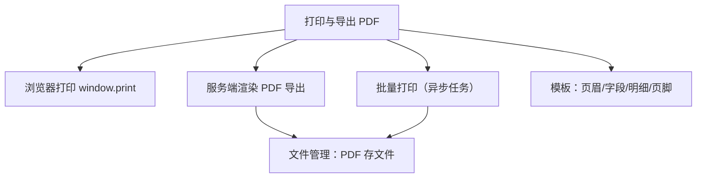

# 组件设计 · 打印与导出 PDF

> PrintTemplate · PrintPreview · usePrint（协作：导入导出 / 通用表格 / 文件管理）

[文档首页](../../../../文档首页.md) › [项目规划说明](../../../../规划/项目规划说明.md) › [组件设计](../../01_组件设计_总览.md) › 打印与导出PDF　|　[← 租户切换](../18_组件设计_租户切换/18_组件设计_租户切换.md)　[请求封装 →](../../09_基础类/01_组件设计_请求封装/01_组件设计_请求封装.md)

> 可交互原型：[19_原型设计_打印与导出PDF.html](19_原型设计_打印与导出PDF.html)（演示打印模板（页眉/标题/字段/表格/页脚）、打印预览、浏览器打印、服务端导出 PDF、批量打印与黑白打印样式）

## 1. 目的与适用范围 

定义 BMS 前端 `frontend/` **打印与导出 PDF** 的组件设计：打印模板 `PrintTemplate.vue`（页眉/标题/字段区/明细表格/签章/页脚，按数据渲染）、打印预览 `PrintPreview.vue`（A4 预览、分页、缩放、黑白/彩色）、编排 `usePrint.ts`（浏览器打印、服务端 PDF 导出、批量打印、打印任务与下载）。用于**单据打印**（业务表单/详情）、**列表导出 PDF**、**批量打印**（交异步任务），是[《布局设计 · 表单页》](../../../布局设计/08_布局设计_表单页.html)「打印」与[《概要设计 · 导入导出》](../../../概要设计/19_概要设计_导入导出.md)的 PDF 导出前端实现。

### 1.1 定位与边界 

职责边界与相关节点分流如下：

- **浏览器打印**：前端按打印样式渲染后 `window.print()`，所见即所得，适合单条单据。
- **服务端 PDF**：由后端按模板渲染高保真 PDF（适合归档/签章/批量），前端发起导出并下载/通知。
- **批量打印**：多选后打印 → 异步任务 → 完成通知下载（[06 交互类 02 导入导出](../01_组件设计_导入导出/01_组件设计_导入导出.md)、[06 交互类 19 批量操作栏](../16_组件设计_批量操作栏/16_组件设计_批量操作栏.md)）。
- **产物存储**：生成的 PDF 存[《概要设计 · 文件管理》](../../../概要设计/13_概要设计_文件管理.md)，可下载/分享/归档。

上游/协作：[《布局设计 · 表单页》](../../../布局设计/08_布局设计_表单页.html)（打印入口/预览）、[《布局设计 · 设计令牌》](../../../布局设计/02_布局设计_设计令牌.html)（打印样式令牌：字号/边距/线宽）、[《概要设计 · 导入导出》](../../../概要设计/19_概要设计_导入导出.md)（导出任务）、[《概要设计 · 文件管理》](../../../概要设计/13_概要设计_文件管理.md)（PDF 存储）、[05 展示类 01 通用表格](../../07_展示类/01_组件设计_通用表格/01_组件设计_通用表格.md)（列表导出/打印列）、[06 交互类 13 表单渲染器](../12_组件设计_表单渲染器/12_组件设计_表单渲染器.md)（单据字段渲染口径）、[05 展示类 03 状态标签与描述列表](../../07_展示类/03_组件设计_状态标签与描述列表/03_组件设计_状态标签与描述列表.md)（明细展示）。

> 本篇为组件设计体系交互类第 22 篇（本批补充节点收官）。**范围边界**：**导出任务/异步机制**归[06 交互类 02 导入导出](../01_组件设计_导入导出/01_组件设计_导入导出.md)与[《概要设计 · 导入导出》](../../../概要设计/19_概要设计_导入导出.md)；**PDF 文件存储**归[《概要设计 · 文件管理》](../../../概要设计/13_概要设计_文件管理.md)；**单据字段与布局元数据**归[06 交互类 13 表单渲染器](../12_组件设计_表单渲染器/12_组件设计_表单渲染器.md)/[《概要设计 · 表单定制》](../../../概要设计/36_概要设计_表单定制.md)（本节点只做打印/导出的渲染与编排）。

## 2. 组件清单与职责 

| 组件 / 工具 | 位置 | 职责 |
| --- | --- | --- |
| `PrintTemplate.vue` | `src/components/print/` | 打印模板：页眉（Logo/租户名）、标题、字段区、明细表格、汇总、签章区、页脚（页码/打印时间），按数据渲染 |
| `PrintPreview.vue` | `src/components/print/` | 打印预览：A4 纸张分页、缩放、单/多页、黑白/彩色、直接打印、导出 PDF |
| `usePrint.ts` | `src/components/print/` | 编排：模板选择、数据装配、浏览器打印、服务端导出、批量打印任务、下载/通知 |

- 命名遵循[《命名规范》](../../../../规范/命名规范.md)：组件 PascalCase；目录遵循[《前端开发规范》](../../../../规范/前端开发规范.md)（打印归 `print/`）。

## 3. Props 与事件 

### 3.1 PrintTemplate 

| 属性 | 类型 | 默认 | 说明 |
| --- | --- | --- | --- |
| `template` | PrintTemplateDef | — | 模板定义（页眉/标题/字段/明细列/汇总/页脚；字段与明细列来源） |
| `data` | Record<string, any> | {} | 单据数据（主表 + 明细数组） |
| `paper` | 'A4' \| 'A5' \| 'custom' | 'A4' | 纸张 |
| `orientation` | 'portrait' \| 'landscape' | 'portrait' | 方向 |
| `monochrome` | boolean | false | 黑白打印（省墨/规范） |
| `brand` | BrandBrief \| null | null | 租户品牌（Logo/名称，见 [06 交互类 20](../17_组件设计_主题与品牌化/17_组件设计_主题与品牌化.md)） |
| `watermark` | string | '' | 水印文案（如「样张/作废」） |

### 3.2 PrintPreview 

| 属性 | 类型 | 默认 | 说明 |
| --- | --- | --- | --- |
| `visible` | boolean | false | 预览显隐（v-model） |
| `records` | any[] | [] | 待打印数据（单条=单据打印，多条=批量/合并打印或逐份） |
| `templateKey` | string | '' | 模板选择（多模板时） |
| `allowExport` | boolean | true | 允许导出 PDF |
| `batchMode` | 'separate' \| 'merged' | 'separate' | 批量：逐份 / 合并 |

| 事件 | 载荷 | 说明 |
| --- | --- | --- |
| `print` | (records, template) | 触发打印（浏览器） |
| `export` | (records, template) | 触发导出 PDF（服务端/前端） |
| `export-done` | file | 导出完成（文件对象） |

- 暴露方法（`usePrint`）：`print(records, templateKey)`、`exportPdf(records, templateKey)`、`batchPrint(ids, templateKey)`。

## 4. 交互与渲染 

| 项 | 设计 |
| --- | --- |
| 入口 | 表单页/详情工具栏「打印」；列表工具栏/批量操作栏「打印/导出 PDF」（[《布局设计 · 表单页》](../../../布局设计/08_布局设计_表单页.html)） |
| 模板 | 按业务选择模板（单据类型/租户自定义）；模板定义页眉/标题/字段/明细列/汇总/页脚/签章，字段复用单据元数据口径 |
| 预览 | 打开预览：A4 纸张、分页、缩放、黑白/彩色切换；预览内容与打印结果一致（同一样式源） |
| 浏览器打印 | 打印样式（`@media print`）隐藏导航/工具栏，仅打印模板；`window.print()` 由用户确认打印/另存 PDF |
| 服务端导出 | 调用导出接口生成高保真 PDF（支持签章/归档/水印），返回文件或异步任务 |
| 批量打印 | 多选 → 逐份/合并 → 异步任务 → 完成通知下载（[06 交互类 19 批量操作栏](../16_组件设计_批量操作栏/16_组件设计_批量操作栏.md)） |
| 品牌 | 页眉使用租户 Logo/名称（[06 交互类 20 主题与品牌化](../17_组件设计_主题与品牌化/17_组件设计_主题与品牌化.md)） |
| 水印 | 支持水印（样张/作废/机密）与页码、打印时间、打印人（审计友好） |
| 黑白 | 黑白模式去除背景色/彩色，仅线条与文字，保证可读 |
| 长明细 | 明细跨页时表头重复、页码连续（分页策略） |
| 数据为空 | 空单据打印提示/占位 |
| 多语言 | 模板文案与字段名按 locale；金额/日期按格式化（[07 基础类 03 格式化工具](../../09_基础类/03_组件设计_格式化工具/03_组件设计_格式化工具.md)） |

## 5. 场景集成 

| 场景 | 说明 |
| --- | --- |
| 单据打印 | 采购/销售/合同/报账单条打印 |
| 标签/票据 | 小纸张（A5/自定义）打印 |
| 列表导出 PDF | 当前筛选结果导出 PDF |
| 批量打印 | 多选批量，异步任务 |
| 归档 | 服务端生成 PDF 存文件管理，供审计/下载 |

## 6. 依赖接口与上游变更 

### 6.1 上游接口与口径 

| 项 | 说明 | 目标文档 |
| --- | --- | --- |
| 导出任务 | 导出 PDF 接口/异步任务（大结果集） | [《概要设计 · 导入导出》](../../../概要设计/19_概要设计_导入导出.md)（登记项①） |
| PDF 存储 | 生成文件存文件管理，可下载/分享 | [《概要设计 · 文件管理》](../../../概要设计/13_概要设计_文件管理.md)（登记项③） |
| 打印入口/预览 | 表单页打印入口与预览形态 | [《布局设计 · 表单页》](../../../布局设计/08_布局设计_表单页.html)（登记项②） |
| 打印样式令牌 | 字号/边距/线宽/黑白 | [《布局设计 · 设计令牌》](../../../布局设计/02_布局设计_设计令牌.html)（登记项②配套） |
| 品牌 | 页眉 Logo/名称 | [06 交互类 20 主题与品牌化](../17_组件设计_主题与品牌化/17_组件设计_主题与品牌化.md) |
| 模板来源 | 模板定义与业务字段 | [《概要设计 · 表单定制》](../../../概要设计/36_概要设计_表单定制.md) |
| 新增依赖 | **无**：`@media print` + 前端渲染；服务端 PDF 由后端实现 | — |

### 6.2 需登记的上游变更 

| 变更点 | 目标文档 | 内容 |
| --- | --- | --- |
| ① 打印/导出 PDF 任务 | [《概要设计 · 导入导出》](../../../概要设计/19_概要设计_导入导出.md)「导出类型」节 | 明确导出类型含 PDF（单据/列表）、模板选择、逐份/合并、异步任务与完成通知；下载与重试；标注组件设计 交互类 22 为组件契约依据 |
| ② 打印入口与预览 | [《布局设计 · 表单页》](../../../布局设计/08_布局设计_表单页.html)「打印」节 | 明确打印入口（表单/详情工具栏）、预览形态（A4、缩放、黑白/彩色）、批量打印入口（批量操作栏）；打印样式令牌约定（字号/边距/线宽）；标注组件契约 |
| ③ 打印产物存储 | [《概要设计 · 文件管理》](../../../概要设计/13_概要设计_文件管理.md)「来源与归档」节 | 明确生成的 PDF 存文件管理（来源=打印/导出），命名、保留期、下载与分享、审计关联 |

> 按[《文档生成规范》](../../../../规范/文档生成规范.md)「引用与追溯」节，上述变更需用户确认后由上游文档同步；本节点只定义组件契约，不单独裁决接口与渲染实现。

## 7. 权限 / i18n / 移动端 

- **权限**：打印/导出按业务操作权限（[07 基础类 02 权限指令](../../09_基础类/02_组件设计_权限指令/02_组件设计_权限指令.md)）；数据范围随查询；导出留审计（含敏感字段脱敏策略）。
- **i18n**：模板文案/字段名按 locale；金额/日期/数字格式化（[07 基础类 03 格式化工具](../../09_基础类/03_组件设计_格式化工具/03_组件设计_格式化工具.md)）；多语言模板字段。
- **移动端**：预览适配窄屏（缩放/横向滚动）；移动端以「分享/另存 PDF」为主，浏览器打印受限（[《布局设计 · 移动端》](../../../布局设计/15_布局设计_移动端.html)）。

## 8. 性能与边界 

| 场景 | 设计 |
| --- | --- |
| 大批量 | 异步任务生成，前端轮询/通知；逐份合并控制体积 |
| 渲染 | 预览虚拟分页；大量明细按需渲染，避免一次性 DOM 过大 |
| 导出 | 服务端渲染高保真与签章；前端导出用于简单场景 |
| 边界 | 长明细跨页表头重复、空数据、超大批量、黑白可读性、水印遮挡、模板字段缺失、异步失败重试、浏览器打印样式差异（跨浏览器）、PDF 体积过大 |
| 不支持 | 导出任务/异步机制（导入导出）、PDF 存储（文件管理）、模板定义来源（表单定制）、产品化 PDF 引擎（后端） |

## 9. 检查清单 

- □ 组件分层：`PrintTemplate` 模板、`PrintPreview` 预览、`usePrint` 编排
- □ 模板：页眉（品牌）/标题/字段/明细列/汇总/签章/页脚（页码/时间/打印人）
- □ 预览：A4/纸张方向、分页、缩放、黑白/彩色、预览与打印一致
- □ 打印：浏览器打印（`@media print` 隐藏导航）、服务端高保真 PDF（签章/水印）
- □ 批量：逐份/合并、异步任务、完成通知下载、与批量操作栏联动
- □ 边界：长明细跨页表头重复、空数据、黑白可读、水印、模板字段缺失、跨浏览器样式
- □ 权限（操作码/数据范围/脱敏/审计）、i18n（模板文案/格式化）、移动端（分享另存）符合第 7 节
- □ 性能边界：大批量异步、预览虚拟分页、导出体积控制
- □ 三项上游登记已确认：打印/导出 PDF 任务、打印入口与预览、打印产物存储

> 组件设计节点（补充批次收官）· 与[《布局设计 · 表单页》](../../../布局设计/08_布局设计_表单页.html)[《布局设计 · 设计令牌》](../../../布局设计/02_布局设计_设计令牌.html)[《概要设计 · 导入导出》](../../../概要设计/19_概要设计_导入导出.md)[《概要设计 · 文件管理》](../../../概要设计/13_概要设计_文件管理.md)[《概要设计 · 表单定制》](../../../概要设计/36_概要设计_表单定制.md)[05 展示类 01 通用表格](../../07_展示类/01_组件设计_通用表格/01_组件设计_通用表格.md)[06 交互类 02 导入导出](../01_组件设计_导入导出/01_组件设计_导入导出.md)[06 交互类 13 表单渲染器](../12_组件设计_表单渲染器/12_组件设计_表单渲染器.md)[06 交互类 19 批量操作栏](../16_组件设计_批量操作栏/16_组件设计_批量操作栏.md)[06 交互类 20 主题与品牌化](../17_组件设计_主题与品牌化/17_组件设计_主题与品牌化.md)[07 基础类 03 格式化工具](../../09_基础类/03_组件设计_格式化工具/03_组件设计_格式化工具.md)《命名规范》配套
