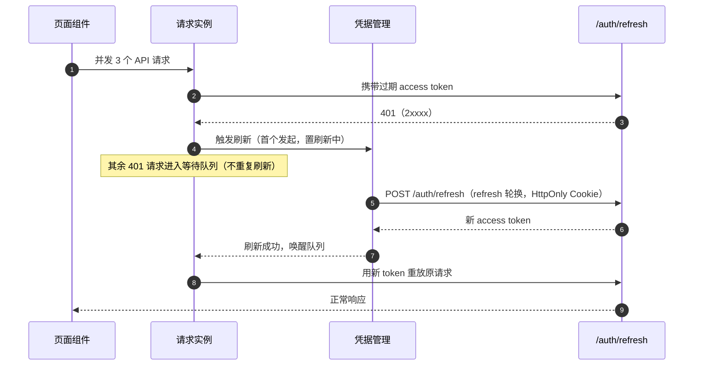

# 组件设计 · 请求封装

> 全站 HTTP 交互的通用底座：统一请求实例与拦截、统一响应解包、模块接口基类、异步状态与列表页公共逻辑、错误码到提示文案的映射、登录态过期的静默刷新与并发排队
> 实现侧命名与落点见《[前端基类清单](../../../../前端基类清单.md)》，实现契约细节见项目详细设计。

[文档首页](../../../../文档首页.md) › [项目规划说明](../../../../规划/项目规划说明.md) › [组件设计](../../01_组件设计_总览.md) › 请求封装　|　[← 代码表达式编辑器](../../08_交互类/04_组件设计_代码表达式编辑器/04_组件设计_代码表达式编辑器.md)　[权限指令 →](../02_组件设计_权限指令/02_组件设计_权限指令.md)

> 可交互原型：[19_原型设计_请求封装.html](01_原型设计_请求封装.html)（演示统一响应解包、错误码 → 文案映射、401 静默刷新与并发排队、幂等键、异步状态竞态处理与列表分页）

## 1. 目的与适用范围 

定义 BMS 前端**请求封装**的组件设计：PC 管理端全部 HTTP 交互的通用底座——统一请求实例与请求/响应拦截、统一响应解包、模块接口基类、异步状态与列表页公共逻辑、错误码到提示文案的映射，以及登录态过期时的静默刷新与并发排队机制。适用于管理端所有模块接口与全部页面组件。

本节对应[《项目规划说明》](../../../../规划/项目规划说明.md)前端章节与「性能与高并发设计」；架构依据[《架构设计 · 接口与集成》](../../../架构设计/09_架构设计_接口与集成.md)（统一响应、错误码分段、分页、幂等）与[《架构设计 · 前端架构》](../../../架构设计/08_架构设计_前端架构.md)（登录凭据注入、401 刷新、响应拦截统一错误提示）；编码约定依据[《前端开发规范》](../../../../规范/前端开发规范.md)「请求封装」「基础类与继承约定」节。

> 本篇为「请求封装」节点。基础类不带界面或为横切能力，其契约被字段类、展示类、交互类组件共同复用；编码风格与通用约定以[《前端开发规范》](../../../../规范/前端开发规范.md)为准，本文档只描述组件化契约层面的设计。

## 2. 职责与组成 

| 组成部分 | 职责 |
| --- | --- |
| 请求实例 | 统一接口基地址、超时、请求/响应拦截；注入登录凭据、解包响应、统一错误 |
| 请求函数 | 解开统一响应结构，成功返回数据，失败抛出统一错误对象 |
| 模块接口基类 | 按模块派生接口集合；写接口自动生成幂等键；禁止绕过统一实例直连 |
| 统一错误对象 | 承载错误码、HTTP 状态、提示信息、明细与链路标识 |
| 异步状态能力 | 异步状态与竞态处理：加载中 / 数据 / 错误 / 发起 / 刷新 / 取消 |
| 列表页公共逻辑 | 列表页查询参数、分页、排序、加载、重置、选择行 |
| 登录凭据管理 | 访问凭据仅存内存、刷新轮换、并发刷新排队、登出清理 |
| 错误文案映射 | 错误码 → 提示文案映射（`error.{code}`），含兜底 |

- **继承轨**：模块接口基类沿继承链派生（挂接总基类），统一走链上请求通道；主体内建不得在链外另起请求实现。
- 移动端工程独立，使用自身轻量请求封装（同一统一响应契约与错误码映射），不复用 PC 的模块接口基类与列表页公共逻辑（见第 12 节）。

## 3. 统一响应与错误码契约 

### 3.1 响应与分页结构 

沿用[《架构设计 · 接口与集成》](../../../架构设计/09_架构设计_接口与集成.md)「接口规范」节，前后端契约一致：

- 统一响应：`code`（业务码，`0` 成功）/ `message`（提示信息）/ `data`（数据体）。
- 分页结构：`list` / `total` / `page` / `size`；大数据量列表用游标分页 `cursor` / `limit`。
- `code === 0` 为成功；非 0 为业务错误码（5 位，万位为模块段；业务模块扩展段 10xxxx 起 6 位）。
- HTTP 状态码与业务错误码**分离**：HTTP 200 也可能携带业务错误 `code`；HTTP 401/403/5xx 另有语义（见第 5、8 节）。

### 3.2 错误码分段与前端映射 

| 分段 | 域 | 前端处理 |
| --- | --- | --- |
| 1xxxx | 通用 | 统一提示 `error.{code}`；参数错误高亮表单字段（`details` 含字段名） |
| 2xxxx | 认证 | 401 走刷新/登出流程（见第 5 节），不弹普通提示 |
| 3xxxx | 用户与组织 | 统一提示（如唯一约束冲突、引用拒绝） |
| 4xxxx | 系统配置 | 统一提示 |
| 5xxxx | 文件 | 上传组件内联反馈（见 [文件上传字段](../../06_字段类/06_组件设计_文件上传字段/06_组件设计_文件上传字段.md)） |
| 6xxxx | 工作流 | 业务组件内联反馈（见 [审批流展示](../../08_交互类/02_组件设计_审批流展示/02_组件设计_审批流展示.md)） |
| 8xxxx | 开放接口/租户/SSO | 统一提示 |
| 10xxxx+ | 业务扩展 | 由业务模块注册映射，缺省走通用提示 |

- 文案来源：错误码优先取语言包 `error.{code}`，缺失回退后端 `message`，再回退通用「操作失败，请稍后重试」。
- 语言包运行时拉取（`GET /api/v1/i18n/messages`，两级缓存）见[《架构设计 · 国际化》](../../../架构设计/24_架构设计_子系统_国际化.md)。

## 4. 请求实例与拦截器 

### 4.1 实例配置 

| 项 | 设计 |
| --- | --- |
| 基地址 | 按环境注入（默认 `/api/v1`） |
| 超时 | 默认 15s；上传/导出/导入按请求放宽（30s 起，见 [文件上传字段](../../06_字段类/06_组件设计_文件上传字段/06_组件设计_文件上传字段.md) 与 [导入导出](../../08_交互类/01_组件设计_导入导出/01_组件设计_导入导出.md)） |
| 默认请求头 | `Content-Type: application/json`；`Accept-Language` 取当前 locale；租户识别由子域名解析，必要时带 `X-Tenant-ID` |
| 认证 | 请求拦截器注入 `Authorization: Bearer <access token>`（access token 仅存内存） |
| 幂等 | 写接口自动生成 `Idempotency-Key`（见第 7 节） |
| 实例单一 | 全站唯一实例；模块接口经继承轨基类派生，禁止绕过直连 |

### 4.2 请求拦截器 

| 步骤 | 设计 |
| --- | --- |
| 凭据注入 | 取访问凭据，存在则写入 `Authorization` |
| 语言与链路 | 写入 `Accept-Language`（当前 locale）与 `X-Request-Id`（前端生成，便于链路追踪） |
| 幂等键 | 写请求（POST/PUT/DELETE）且未显式提供 `Idempotency-Key` 时自动生成 |
| 耗时记录 | 记录请求开始时间，用于耗时统计与慢请求告警 |

### 4.3 响应拦截器 

- **成功（HTTP 2xx 且 `code === 0`）**：返回响应数据，由请求函数后续解包。
- **业务错误（HTTP 2xx 且 `code !== 0`）**：构造统一错误对象；默认统一提示；标记为静默的请求由调用方自行处理（如登录失败、表单校验回显）。
- **HTTP 错误**：401 → 静默刷新流程（第 5 节）；403 → 提示无权限并跳 403 页；404 → 提示资源不存在；409 → 提示「记录已被修改」（乐观锁冲突，见[《布局设计 · 表单页》](../../../布局设计/08_布局设计_表单页.html)）；5xx → 提示服务异常并记录 traceId。
- 响应结构异常（非 `{code,message,data}`，如反向代理返回 HTML 错误页）→ 归一为统一错误（错误码 -1）并提示。

## 5. 401 静默刷新与并发排队 

| 项 | 设计 |
| --- | --- |
| refresh 存储 | refresh token 走 HttpOnly Cookie（前端不可读），access token 仅存内存，降低 XSS 风险 |
| 并发收敛 | 同一时刻仅一次 refresh；其余 401 请求入队，刷新成功后统一重放（每请求最多重放 1 次，防循环） |
| 刷新失败 | 清空会话、跳登录页并携带 `redirect`；`session.revoked`（实时推送）触发强制登出 |
| 白名单 | `/auth/login`、`/auth/refresh`、健康检查不参与刷新流程 |
| 提示 | 刷新过程对用户透明（不弹错误）；仅最终失败时提示「登录已过期，请重新登录」 |

## 6. 请求函数与模块接口基类 

### 6.1 请求函数 

| 请求选项 | 说明 |
| --- | --- |
| 静默 | 不自动提示，由调用方处理错误 |
| 原文返回 | 需读取提示信息时返回完整统一响应 |
| 超时覆盖 | 按请求覆盖默认超时 |
| 显式幂等键 | 由调用方指定幂等键 |

- 成功：返回解包后的数据（类型随调用推断）；失败：抛出统一错误对象（含错误码 / HTTP 状态 / 提示信息 / 明细 / 链路标识）。

### 6.2 模块接口基类 

- 按模块派生接口集合，统一提供查询 / 新增 / 修改 / 删除收发方法，全量走请求实例。
- 模块接口文件按模块组织，函数以查询 / 新增 / 修改 / 删除语义开头（[《命名规范》](../../../../规范/命名规范.md)）。
- 查询参数与实体沿用统一基础类型；实体标识以字符串传输（雪花标识不丢精度）。
- 列表查询参数统一 `page` / `size`；导出接口参数与列表接口一致（见 [导入导出](../../08_交互类/01_组件设计_导入导出/01_组件设计_导入导出.md)）。

## 7. 幂等键、取消与竞态 

| 项 | 设计 |
| --- | --- |
| 幂等键 | 写接口（POST/PUT/DELETE）自动生成 `Idempotency-Key`（UUID v4）；同一业务操作重试复用同一键；后端幂等前置拦截 + 唯一约束兜底（见[《架构设计 · 接口与集成》](../../../架构设计/09_架构设计_接口与集成.md)） |
| 请求取消 | 组件卸载/查询条件变化时取消在途请求；异步状态能力内置取消 |
| 竞态处理 | 异步状态能力以请求序号判定，仅最后一次发起的响应可写回状态，避免旧响应覆盖新数据 |
| 防抖 | 远程搜索、筛选区输入等高频场景在调用方做防抖（如字典远程搜索 300ms）；封装层不内置隐式防抖 |
| 重试 | 默认不自动重试写请求（幂等由幂等键保证）；读请求可按需开启有限重试（网络类错误，≤ 2 次） |

## 8. 异步状态与列表页公共逻辑 

### 8.1 异步状态能力 

| 状态 / 动作 | 说明 |
| --- | --- |
| 加载中 | 请求中状态 |
| 数据 | 成功数据 |
| 错误 | 统一错误对象或空 |
| 发起 | 手动发起（默认自动发起可配置） |
| 刷新 | 用上次参数重新发起 |
| 取消 | 取消在途请求 |
| 序号机制 | 竞态保护：仅最新请求写回状态 |

### 8.2 列表页公共逻辑 

| 成员 | 说明 |
| --- | --- |
| 查询条件 | 查询条件对象（含 `page` / `size` / 排序） |
| 列表 / 总数 / 加载中 | 表格数据源与分页总数、加载状态 |
| 查询 | 按当前条件查询（重置回第 1 页） |
| 重置 | 重置筛选条件并查询（[《布局设计 · 列表页》](../../../布局设计/07_布局设计_列表页.html)查询条件变化回第 1 页） |
| 分页 / 排序变化 | 分页/排序变化保留筛选条件（布局设计列表页交互） |
| 已选行 | 批量操作按钮启用依据 |
| 删除 | 删除后二次确认并局部刷新（列表页删除交互） |

- 列表页公共逻辑由展示类「查询筛选区」与「通用表格」复用；服务端数据不重复入全局状态（[《前端开发规范》](../../../../规范/前端开发规范.md)状态管理约定），列表/详情由页面组件持有。

## 9. 错误提示与降级 

| 场景 | 处理 |
| --- | --- |
| 表单提交校验失败 | 不弹全局提示，错误明细按字段回填表单校验（静默请求） |
| 乐观锁冲突 409 | 提示「记录已被修改」，重新加载详情（表单页） |
| 引用拒绝（删除被引用） | 提示具体引用来源（后端 message） |
| 网络断开 | 提示「网络异常，请检查网络」；读请求可重试 |
| 服务端 5xx | 提示「服务异常（traceId: xxx）」，traceId 便于排查 |
| 权限不足 403 | 跳 403 页（[《布局设计 · 异常与空状态》](../../../布局设计/12_布局设计_异常与空状态.html)） |
| 未知业务码 | 回退后端 message，再回退通用文案 |

## 10. 性能与边界 

| 场景 | 设计 |
| --- | --- |
| 并发请求 | 401 刷新收敛为单次；同 key 读请求可共享在途结果（字典批量取数） |
| 大响应体 | 导出/大列表走流式或游标分页；避免一次性渲染超大数据集 |
| 包体 | 请求库按需引入；拦截器逻辑不做重计算；请求元数据轻量 |
| 慢请求观测 | 记录耗时，超阈值（如 3s）打点告警（接入[《架构设计 · 可观测性》](../../../架构设计/27_架构设计_子系统_可观测性.md)） |
| 内存 | access token 仅内存；取消在途请求避免回调持有已卸载组件 |

## 11. 与字段权限 / i18n / 脱敏协作 

- **i18n**：错误文案走 `error.{code}`；`Accept-Language` 由请求拦截器注入当前 locale。
- **字段权限**：后端读时过滤不可见字段（`sys_role_field.visible=false` 不出现在响应），前端不感知；`editable=false` 由表单页置禁用，保存时后端按权限兜底。
- **脱敏**：敏感字段默认脱敏返回；持 `data:plain` 的动作权限方可请求明文（见 [权限指令](../02_组件设计_权限指令/02_组件设计_权限指令.md)节点）。
- **审计**：写请求 `X-Request-Id` 与后端操作日志关联，便于链路追踪。

## 12. 移动端说明 

- 移动端工程独立，使用自身轻量请求封装（同一 `{code,message,data}` 契约与错误码映射），不复用 PC 的模块接口基类与列表页公共逻辑。
- refresh 机制同源（HttpOnly Cookie），移动端内嵌（企业微信/钉钉）免登由 SSO 流程处理（[《概要设计 · 身份认证 SSO》](../../../概要设计/26_概要设计_身份认证SSO.md)）。
- 错误提示用移动端轻提示组件。

## 13. 检查清单 

- □ 统一请求实例全站唯一，模块接口经继承轨基类派生，无绕过直连
- □ 统一响应 `{code, message, data}` 解包正确，分页 `{list,total,page,size}` 结构对齐
- □ 错误码 → 文案映射（`error.{code}`）与兜底完整；静默请求不自动提示
- □ 401 静默刷新：并发收敛、单次重放、失败跳登录、白名单排除
- □ 写接口自动幂等键 `Idempotency-Key`；请求可取消；异步状态竞态保护
- □ 列表页公共逻辑覆盖查询/重置/分页/排序/选择，查询变化回第 1 页且保留筛选
- □ 乐观锁 409、引用拒绝、403、5xx 提示与[《布局设计》](../../../布局设计/01_布局设计_总览.html)一致
- □ access token 仅内存、refresh 走 HttpOnly Cookie、`session.revoked` 强制登出
- □ 移动端独立封装、错误契约同源（第 12 节）

> 组件设计节点 · 与[《架构设计 · 接口与集成》](../../../架构设计/09_架构设计_接口与集成.md)[《架构设计 · 前端架构》](../../../架构设计/08_架构设计_前端架构.md)[《前端开发规范》](../../../../规范/前端开发规范.md)[《命名规范》](../../../../规范/命名规范.md)配套
