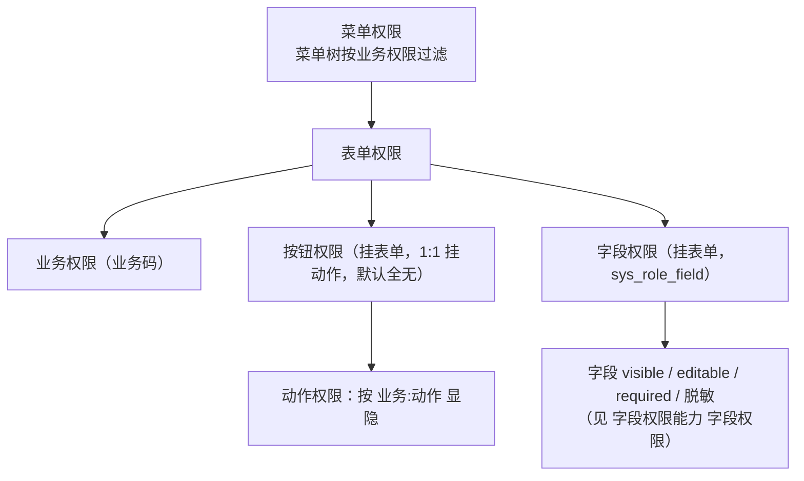

# 组件设计 · 权限指令

> 动作权限渲染的通用契约：按钮与入口按动作权限码显隐、编程式权限判断、权限集合与菜单装配、路由守卫与无权限兜底（字段权限见字段权限能力）
> 实现侧命名与落点见《[前端基类清单](../../../../前端基类清单.md)》，实现契约细节见项目详细设计。

[文档首页](../../../../文档首页.md) › [项目规划说明](../../../../规划/项目规划说明.md) › [组件设计](../../01_组件设计_总览.md) › 权限指令　|　[← 请求封装](../01_组件设计_请求封装/01_组件设计_请求封装.md)　[格式化工具 →](../03_组件设计_格式化工具/03_组件设计_格式化工具.md)

> 可交互原型：[20_原型设计_权限指令.html](02_原型设计_权限指令.html)（演示动作权限判定控制按钮显隐、无权限跳 403、前后端双重控制；字段权限 visible/editable 见 [字段权限能力 字段权限原型](../../02_基础组件类/02_能力类/11_组件设计_字段权限能力/11_原型设计_字段权限能力.html)）

## 1. 目的与适用范围 

定义 BMS 前端**动作权限渲染**的组件设计：按钮与入口按动作权限码显隐的动作权限判定、编程式权限判断、权限集合与菜单装配、路由守卫与无权限兜底。适用于 PC 管理端全部页面与按钮。

> **范围边界**：字段权限（字段可见 / 可编辑 / 必填 / 脱敏）的权威定义见 [字段权限能力 字段权限](../../02_基础组件类/02_能力类/11_组件设计_字段权限能力/11_组件设计_字段权限能力.md)；本篇专注**动作 / 按钮权限**。

本节对应[《项目规划说明》](../../../../规划/项目规划说明.md)权限体系；架构依据[《架构设计 · 权限计算引擎》](../../../架构设计/15_架构设计_子系统_权限计算引擎.md)（权限分层、双端下发）、[《架构设计 · 前端架构》](../../../架构设计/08_架构设计_前端架构.md)（动态菜单与权限渲染）与[《架构设计 · 接口与集成》](../../../架构设计/09_架构设计_接口与集成.md)（动作权限两级校验）；数据来源依据[《概要设计 · 菜单管理》](../../../概要设计/07_概要设计_菜单管理.md)（权限码下发）；无权限页面依据[《布局设计 · 异常与空状态》](../../../布局设计/12_布局设计_异常与空状态.html)（403）。

> 本篇为基础类节点之一。组件设计只描述契约，编码约定以[《前端开发规范》](../../../../规范/前端开发规范.md)「动态菜单与权限」节为准。

## 2. 职责与组成 

| 组成部分 | 职责 |
| --- | --- |
| 动作权限判定 | 按动作权限码控制元素显隐；无权限时不渲染（移出 DOM，非隐藏样式） |
| 编程式权限判断 | 脚本内判断单个/多个权限码（条件渲染、计算、方法内判断、路由元信息校验） |
| 权限状态 | 当前用户权限集合、菜单树、表单元数据、权限版本；登录/刷新后装配 |
| 路由守卫 | 登录态 + 权限码校验，无权限跳 403 |
| 权限按钮（可选件） | 动作权限判定的组件化封装（需按条件渲染禁用提示时使用） |

- **继承轨**：权限码集合与判定由继承链上的权限上下文能力域基类承载（能力即链上的一层）；动作权限判定与权限状态均为链层能力的消费，不各自维护权限集合。
- 移动端为同一契约的另一实现（契约套件同一套断言）：动作权限判定经统一注入点，不共用 PC 实现（见第 9 节）。

## 3. 权限模型与数据来源 

### 3.1 权限分层 

- 权限码格式 `业务:动作`（如 `user:create`、`wf:approve`）；业务存 `sys_business`、动作存 `sys_action`（平台库）。
- 前端权限集合来自菜单接口下发；后端按 `业务:动作` 强制校验，前端显隐仅为体验（**双重控制**，默认无按钮权限）。
- **字段权限**（`visible`/`editable`/`required`/脱敏）不在本篇，见 [字段权限能力 字段权限](../../02_基础组件类/02_能力类/11_组件设计_字段权限能力/11_组件设计_字段权限能力.md)。

### 3.2 动作权限数据来源 

| 项 | 设计 |
| --- | --- |
| 动作定义 | `sys_action`（业务:动作），角色经授权持有 |
| 下发路径 | `GET /api/v1/menus/my` 随菜单下发当前用户动作权限集合 |
| 默认口径 | 默认无按钮权限（未授予即不渲染）；菜单权限决定页面可达 |
| 存储 | 权限集合以集合结构存放，判定开销常数级 |

## 4. 动作权限判定 

| 项 | 设计 |
| --- | --- |
| 语义 | 有权限 → 保留元素；无权限 → 移出 DOM（非隐藏样式，避免被绕过） |
| 参数 | 支持单个权限码或多个权限码；多码默认「任一满足」，可要求「全部满足」 |
| 取反 | 支持取反用法（如「取消置顶」仅在有权限时显示） |
| 时机 | 挂载与更新时评估；权限集合变化（登录/切换租户/权限版本变更）触发重新评估 |
| 与禁用区别 | 需要「可见但禁用并提示原因」时，用权限按钮组件传禁用，而非移出 |
| 无权限默认 | 默认无按钮权限：未授予的动作权限对应按钮不渲染 |

## 5. 编程式判断与权限状态 

### 5.1 权限状态 

| 成员 | 说明 |
| --- | --- |
| 权限集合 | 当前用户动作权限码集合（`业务:动作`） |
| 菜单树 | 动态菜单树（按业务权限过滤，含 i18n 名称） |
| 表单元数据 | 按钮/字段定义与本用户 visible/editable/required 状态；字段权限消费见 [字段权限能力](../../02_基础组件类/02_能力类/11_组件设计_字段权限能力/11_组件设计_字段权限能力.md) |
| 权限版本 | 权限版本号；变更（角色/授权/主体绑定）时递增，触发重新装配 |
| 判断 | 判断单个/数组权限码 |
| 装配 | 拉取菜单与权限（登录后、租户切换、权限版本变化时） |
| 清空 | 登出/会话失效时清空 |

### 5.2 编程式判断与路由守卫 

- 编程式判断用于不可直接指令化的场景：条件渲染、计算属性、方法内判断、路由元信息校验；支持单个/多个权限码与「任一 / 全部」模式。
- 路由守卫：登录态校验（无 → 跳登录并带 `redirect`）→ 路由权限码校验（无 → 跳 403 页，见[《布局设计 · 异常与空状态》](../../../布局设计/12_布局设计_异常与空状态.html)）。
- 路由动态注册由菜单树驱动，前端不硬编码路由表；无权限路由不注册。

## 6. 与请求封装协作 

- 双重控制：前端显隐 + 后端动作权限强校验；即使前端被绕过，后端仍拒绝。
- 403 响应由请求层统一提示并跳 403（见 [请求封装](../01_组件设计_请求封装/01_组件设计_请求封装.md)第 9 节）。
- 权限版本变更（实时推送或下次请求）→ 权限状态重新装配菜单、权限集合与字段元数据；字段权限重算见 [字段权限能力](../../02_基础组件类/02_能力类/11_组件设计_字段权限能力/11_组件设计_字段权限能力.md)。

## 7. 性能与边界 

| 场景 | 设计 |
| --- | --- |
| 大量按钮 | 权限集合以集合结构存放，判定开销常数级；指令求值轻量 |
| 重评估 | 仅在权限版本变化或组件更新时评估，避免频繁遍历 |
| DOM | 无权限元素不进入 DOM，减少渲染开销 |
| 安全边界 | 前端显隐不构成安全边界，后端强校验为准（见[《架构设计 · 性能与安全》](../../../架构设计/31_架构设计_性能与安全.md)） |
| 边界态 | 未登录/租户未解析时的权限为空集，页面显示加载/跳登录 |

## 8. i18n 

- 菜单名、按钮名、字段标签均由后端按 locale 下发（i18n 附表），前端不硬编码。
- 无权限提示、403 页文案走语言包（`common.noPermission` 等）。

## 9. 移动端说明 

- 移动端为同一契约的另一实现（契约套件同一套断言）：以编程式判断 / 动作权限判定控制按钮与入口显隐（移动端组件），判定经统一注入点，不共用 PC 实现。
- 字段权限同为表单元数据下发，契约见 [字段权限能力 字段权限](../../02_基础组件类/02_能力类/11_组件设计_字段权限能力/11_组件设计_字段权限能力.md)；移动端表单按 `visible` 跳过、`editable` 置只读。

## 10. 检查清单 

- □ 动作权限判定按 `业务:动作` 显隐，无权限移出 DOM；多码默认任一，可要求全部
- □ 编程式判断与权限状态集合来自菜单接口；路由守卫校验登录态与权限码
- □ 双重控制落实：前端显隐 + 后端动作权限强校验
- □ 权限版本变更触发重新装配；403 跳转与提示符合[《布局设计 · 异常与空状态》](../../../布局设计/12_布局设计_异常与空状态.html)
- □ 菜单/按钮文案走 i18n 附表，前端不硬编码
- □ 字段权限职责已分离，统一见 [字段权限能力 字段权限](../../02_基础组件类/02_能力类/11_组件设计_字段权限能力/11_组件设计_字段权限能力.md)
- □ 移动端为同契约另一实现（契约套件同一套断言，第 9 节）

> 组件设计节点 · 与[《架构设计 · 权限计算引擎》](../../../架构设计/15_架构设计_子系统_权限计算引擎.md)[《概要设计 · 菜单管理》](../../../概要设计/07_概要设计_菜单管理.md)[《布局设计 · 异常与空状态》](../../../布局设计/12_布局设计_异常与空状态.html)[字段权限能力 字段权限](../../02_基础组件类/02_能力类/11_组件设计_字段权限能力/11_组件设计_字段权限能力.md)[《前端开发规范》](../../../../规范/前端开发规范.md)配套
