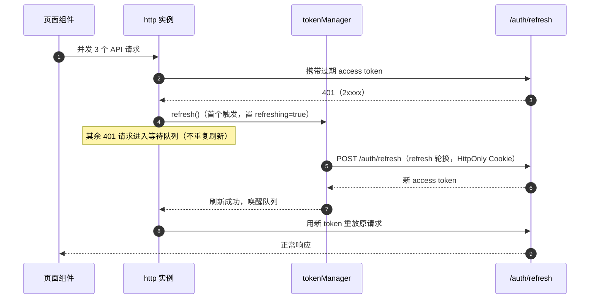

# 组件设计 · 请求封装与错误处理

> Axios 统一实例 · request&lt;T&gt;() · BaseApi · useRequest · useListPage · 401 静默刷新

[文档首页](../../../文档首页.md) › [项目规划说明](../../../规划/项目规划说明.md) › [组件设计](../01_组件设计_总览.md) › 请求封装　|　[← 组件设计总览](../01_组件设计_总览.md)　[20-权限指令与字段权限 →](../20_组件设计_权限指令/20_组件设计_权限指令.md)

> 可交互原型：[19_原型设计_请求封装.html](19_原型设计_请求封装.html)（演示统一响应解包、错误码 → i18n 文案、401 静默刷新与并发排队、幂等键、useRequest 竞态处理与列表分页）

## 1. 目的与适用范围 <a id="purpose"></a>

定义 BMS 前端 `frontend/`（Vue 3 + TypeScript + Axios）**桌面端全部 HTTP 交互**的通用底座：Axios 统一实例与拦截器、统一响应解包 `request<T>()`、模块 API 基类 `BaseApi`、异步状态组合式函数 `useRequest`、列表页公共逻辑 `useListPage`、错误码到提示文案的映射，以及 401 静默刷新机制。适用于管理端所有模块 API（`src/api/*.ts`）与全部页面组件。

本节对应[《项目规划说明》](../../../规划/项目规划说明.md)前端章节与「性能与高并发设计」；架构依据[《架构设计 · 接口与集成》](../../架构设计/06_架构设计_接口与集成.md)（统一响应、错误码分段、分页、幂等）与[《架构设计 · 前端架构》](../../架构设计/28_架构设计_前端架构.md)（Axios 注入 access token、401 刷新、响应拦截统一错误提示）；编码约定依据[《前端开发规范》](../../../规范/前端开发规范.md)「请求封装」「基础类与继承约定」节。

> 本篇为基础类（19-21）第 19 篇。基础类不带界面或为横切能力，其契约被字段类、展示类、交互类组件共同复用；编码风格与通用约定以[《前端开发规范》](../../../规范/前端开发规范.md)为准，本文档只描述组件化/工具契约层面的设计。

## 2. 组件清单与职责 <a id="components"></a>

| 组件 / 工具 | 位置 | 职责 |
| --- | --- | --- |
| `http`（Axios 实例） | `src/api/http.ts` | 统一 baseURL、超时、请求/响应拦截器；注入 token、解包响应、统一错误 |
| `request<T>()` | `src/api/request.ts` | 泛型请求函数：解开 `{code, message, data}`，成功返回 `data`，失败抛 `ApiError` |
| `BaseApi` | `src/api/base.ts` | 模块 API 基类：封装 `get/post/put/delete`，禁止绕过基类裸用 axios |
| `ApiError` | `src/api/error.ts` | 统一错误对象（含 code / httpStatus / message / details / traceId） |
| `useRequest<T>()` | `src/utils/useRequest.ts` | 异步状态与竞态：loading / data / error / run / refresh / cancel |
| `useListPage<T>()` | `src/utils/useListPage.ts` | 列表页公共逻辑：查询参数、分页、排序、加载、重置、选择行 |
| `tokenManager` | `src/api/token.ts` | access token 仅存内存、refresh 轮换、并发刷新排队、登出清理 |
| `errorMessage()` | `src/utils/error.ts` | 错误码 → i18n 文案映射（`error.{code}`），含兜底 |

- 命名遵循[《命名规范》](../../../规范/命名规范.md)前端命名（工具函数 camelCase、`use` + 名词的组合式函数、API 模块 `src/api/模块.ts`）。
- 移动端（frontend-mobile）工程独立，不复用 PC 的 `BaseApi` / `useListPage`；统一响应解包与错误码映射机制同源（见第 12 节）。

## 3. 统一响应与错误码契约 <a id="contract"></a>

### 3.1 响应与分页结构 <a id="contract-response"></a>

沿用[《架构设计 · 接口与集成》](../../架构设计/06_架构设计_接口与集成.md)「接口规范」节，前端类型由 openapi-typescript 从后端 OpenAPI 自动生成，与 Pydantic schema 一致：

```typescript
type ApiResponse<T> = { code: number; message: string; data: T };
type PageResponse<T> = { list: T[]; total: number; page: number; size: number };
type CursorResponse<T> = { list: T[]; next_cursor: string | null };
```

- `code === 0` 为成功；非 0 为业务错误码（5 位，万位为模块段；业务模块扩展段 10xxxx 起 6 位）。
- HTTP 状态码与业务错误码**分离**：HTTP 200 也可能携带业务错误 `code`；HTTP 401/403/5xx 另有语义（见第 5、8 节）。
- 分页统一 `page`（从 1 起）/`size`；大数据量列表用游标分页 `cursor`/`limit`。

### 3.2 错误码分段与前端映射 <a id="contract-code"></a>

| 分段 | 域 | 前端处理 |
| --- | --- | --- |
| 1xxxx | 通用 | 统一提示 `error.{code}`；参数错误高亮表单字段（`details` 含字段名） |
| 2xxxx | 认证 | 401 走刷新/登出流程（见第 5 节），不弹普通提示 |
| 3xxxx | 用户与组织 | 统一提示（如唯一约束冲突、引用拒绝） |
| 4xxxx | 系统配置 | 统一提示 |
| 5xxxx | 文件 | 上传组件内联反馈（见 07 文件上传字段） |
| 6xxxx | 工作流 | 业务组件内联反馈（见 16 审批流展示） |
| 8xxxx | 开放接口/租户/SSO | 统一提示 |
| 10xxxx+ | 业务扩展 | 由业务模块注册映射，缺省走通用提示 |

- 文案来源：`errorMessage(code, fallback)` 优先取 vue-i18n 语言包 `error.{code}`，缺失回退后端 `message`，再回退通用「操作失败，请稍后重试」。
- 语言包运行时拉取（`GET /api/v1/i18n/messages`，Redis + localStorage 二次缓存）见[《架构设计 · 国际化》](../../架构设计/20_架构设计_子系统_国际化.md)。

## 4. Axios 实例与拦截器 <a id="axios"></a>

### 4.1 实例配置 <a id="axios-instance"></a>

| 项 | 设计 |
| --- | --- |
| baseURL | `import.meta.env.VITE_API_BASE`（默认 `/api/v1`） |
| 超时 | 默认 15s；上传/导出/导入走独立实例或按请求覆盖（30s 起，见 07 与 15 节点） |
| 默认请求头 | `Content-Type: application/json`；`Accept-Language` 取当前 locale；租户识别由子域名解析，必要时带 `X-Tenant-ID` |
| 认证 | 请求拦截器注入 `Authorization: Bearer <access token>`（access token 仅存内存） |
| 幂等 | 写接口由 `BaseApi` 自动生成 `Idempotency-Key`（见第 7 节） |
| 实例单一 | 全站唯一实例，模块 API 必须继承 `BaseApi`，禁止裸用 axios |

### 4.2 请求拦截器 <a id="axios-req"></a>

```text
1. 取 tokenManager.getAccessToken() → 存在则写入 Authorization
2. 写入 Accept-Language（当前 locale）与 X-Request-Id（前端生成，便于链路追踪）
3. 写请求（POST/PUT/DELETE）且未显式提供 Idempotency-Key 时自动生成
4. 记录请求开始时间到 config.metadata（用于耗时统计与慢请求告警）
```

### 4.3 响应拦截器 <a id="axios-res"></a>

- **成功（HTTP 2xx 且 `code === 0`）**：返回 `response.data`，由 `request<T>()` 后续解包。
- **业务错误（HTTP 2xx 且 `code !== 0`）**：构造 `ApiError`；默认统一 toast（`ElMessage.error`）；标记 `silent: true` 的请求由调用方自行处理（如登录失败、表单校验回显）。
- **HTTP 错误**：401 → 静默刷新流程（第 5 节）；403 → 提示无权限并跳 403 页；404 → 提示资源不存在；409 → 提示「记录已被修改」（乐观锁冲突，见[《布局设计 · 表单页》](../../布局设计/08_布局设计_表单页.html)）；5xx → 提示服务异常并记录 traceId。
- 响应结构异常（非 `{code,message,data}`，如反向代理返回 HTML 错误页）→ 归一为 `ApiError(code=-1)` 并提示。

## 5. 401 静默刷新与并发排队 <a id="refresh"></a>



| 项 | 设计 |
| --- | --- |
| refresh 存储 | refresh token 走 HttpOnly Cookie（前端不可读），access token 仅存内存，降低 XSS 风险 |
| 并发收敛 | 同一时刻仅一次 refresh；其余 401 请求入队，刷新成功后统一重放（每请求最多重放 1 次，防循环） |
| 刷新失败 | 清空会话、跳登录页并携带 `redirect`；`session.revoked`（实时推送）触发强制登出 |
| 白名单 | `/auth/login`、`/auth/refresh`、健康检查不参与刷新流程 |
| 提示 | 刷新过程对用户透明（不弹错误）；仅最终失败时提示「登录已过期，请重新登录」 |

## 6. request&lt;T&gt;() 与 BaseApi <a id="request"></a>

### 6.1 request&lt;T&gt;() <a id="request-fn"></a>

```typescript
// src/api/request.ts
interface RequestOptions {
  silent?: boolean;        // 不自动 toast，由调用方处理错误
  raw?: boolean;           // true 返回完整 ApiResponse（如需读 message）
  timeout?: number;        // 覆盖默认超时
  idempotencyKey?: string; // 显式幂等键
}
function request<T>(config: AxiosRequestConfig, options?: RequestOptions): Promise<T>
// 成功：返回 data（已解包 {code,message,data}），类型由 T 推断
// 失败：抛 ApiError（含 code/httpStatus/message/details/traceId）
```

### 6.2 BaseApi <a id="base-api"></a>

```typescript
// src/api/base.ts
class BaseApi {
  protected get<T>(url: string, params?: object, opts?: RequestOptions): Promise<T>
  protected post<T>(url: string, body?: object, opts?: RequestOptions): Promise<T>
  protected put<T>(url: string, body?: object, opts?: RequestOptions): Promise<T>
  protected del<T>(url: string, params?: object, opts?: RequestOptions): Promise<T>
}
// 模块 API：export class UserApi extends BaseApi { getUserList(q: UserQuery) { return this.get<PageResponse<UserItem>>('/users', q) } }
```

- 模块 API 文件 `src/api/模块.ts`，函数以 get/query/create/update/delete 开头（[《命名规范》](../../../规范/命名规范.md)）；查询参数类型继承 `BasePageQuery`，实体继承 `BaseEntity`（`id` 为 string，雪花 BIGINT 以字符串传输）。
- 列表查询参数统一 `page`/`size`；导出接口参数与列表接口一致（见 15 导入导出）。

## 7. 幂等键、取消与竞态 <a id="idempotency"></a>

| 项 | 设计 |
| --- | --- |
| 幂等键 | 写接口（POST/PUT/DELETE）由 `BaseApi` 自动生成 `Idempotency-Key`（UUID v4）；同一业务操作重试复用同一键；后端 Redis SETNX 前置拦截 + 唯一约束兜底（见[《架构设计 · 接口与集成》](../../架构设计/06_架构设计_接口与集成.md)） |
| 请求取消 | 组件卸载/查询条件变化时经 `AbortController` 取消在途请求；`useRequest` 内置取消能力（`cancel()`） |
| 竞态处理 | `useRequest` 以请求序号（seq）判定，仅最后一次发起的响应可写回状态，避免旧响应覆盖新数据 |
| 防抖 | 远程搜索、筛选区输入等高频场景在调用方做防抖（如字典远程搜索 300ms，见 02 组件设计）；封装层不内置隐式防抖 |
| 重试 | 默认不自动重试写请求（幂等由幂等键保证）；读请求可按需开启有限重试（网络类错误，≤ 2 次） |

## 8. useRequest / useListPage <a id="composables"></a>

### 8.1 useRequest <a id="use-request"></a>

| 成员 | 说明 |
| --- | --- |
| `loading` | 请求中状态（ref） |
| `data` | 成功数据（ref<T \| null>） |
| `error` | `ApiError \| null` |
| `run(...args)` | 手动发起（默认自动发起可配 `immediate`） |
| `refresh()` | 用上次参数重新发起 |
| `cancel()` | 取消在途请求 |
| `seq` 内部机制 | 竞态保护：仅最新请求写回状态 |

### 8.2 useListPage <a id="use-list-page"></a>

| 成员 | 说明 |
| --- | --- |
| `query` | 查询条件对象（reactive，含 `page`/`size`/排序） |
| `list` / `total` / `loading` | 表格数据源与分页总数 |
| `search()` | 按当前条件查询（重置回第 1 页） |
| `reset()` | 重置筛选条件并查询（[《布局设计 · 列表页》](../../布局设计/07_布局设计_列表页.html)查询条件变化回第 1 页） |
| `onPageChange` / `onSortChange` | 分页/排序变化保留筛选条件（布局设计列表页交互） |
| `selection` | 已选行（批量操作按钮启用依据） |
| `remove(id)` | 删除后二次确认并局部刷新（列表页删除交互） |

- `useListPage` 由展示类「查询筛选区」（11）与「通用表格」（10）复用；服务端数据不重复入 store（[《前端开发规范》](../../../规范/前端开发规范.md)状态管理约定），列表/详情由页面组件持有。

## 9. 错误提示与降级 <a id="fallback"></a>

| 场景 | 处理 |
| --- | --- |
| 表单提交校验失败 | 不弹全局 toast，`ApiError.details` 按字段回填 `el-form` 校验（`silent: true`） |
| 乐观锁冲突 409 | 提示「记录已被修改」，重新加载详情（表单页） |
| 引用拒绝（删除被引用） | 提示具体引用来源（后端 message） |
| 网络断开 | 提示「网络异常，请检查网络」；读请求可重试 |
| 服务端 5xx | 提示「服务异常（traceId: xxx）」，traceId 便于排查 |
| 权限不足 403 | 跳 403 页（[《布局设计 · 异常与空状态》](../../布局设计/12_布局设计_异常与空状态.html)） |
| 未知业务码 | 回退后端 message，再回退通用文案 |

## 10. 性能与边界 <a id="performance"></a>

| 场景 | 设计 |
| --- | --- |
| 并发请求 | 401 刷新收敛为单次；同 key 读请求可共享在途 Promise（字典批量取数见 02） |
| 大响应体 | 导出/大列表走流式或游标分页；避免一次性渲染超大数据集 |
| 包体 | Axios 按需引入；拦截器逻辑不做重计算；请求元数据轻量 |
| 慢请求观测 | 记录耗时，超阈值（如 3s）打点告警（接入[《架构设计 · 可观测性》](../../架构设计/23_架构设计_子系统_可观测性.md)） |
| 内存 | access token 仅内存；取消在途请求避免回调持有已卸载组件 |

## 11. 与字段权限 / i18n / 脱敏协作 <a id="cooperate"></a>

- **i18n**：错误文案走 `error.{code}`；`Accept-Language` 由请求拦截器注入当前 locale。
- **字段权限**：后端读时过滤不可见字段（`sys_role_field.visible=false` 不出现在响应），前端不感知；`editable=false` 由表单页置 `disabled`，保存时后端 `require_permission` 兜底。
- **脱敏**：敏感字段默认脱敏返回；持 `data:plain` 的动作权限方可请求明文（见 20 权限指令节点）。
- **审计**：写请求 `X-Request-Id` 与后端操作日志关联，便于链路追踪。

## 12. 移动端说明 <a id="mobile"></a>

- frontend-mobile 工程独立，使用自身轻量请求封装（同一 `{code,message,data}` 契约与错误码映射），不复用 `BaseApi` / `useListPage`。
- refresh 机制同源（HttpOnly Cookie），移动端内嵌（企业微信/钉钉）免登由 SSO 流程处理（[《概要设计 · 身份认证 SSO》](../../概要设计/26_概要设计_身份认证SSO.md)）。
- 错误提示用 Vant 轻提示（`showToast` / `showDialog`）。

## 13. 检查清单 <a id="checklist"></a>

- □ 统一实例 `src/api/http.ts`，模块 API 继承 `BaseApi`，无裸用 axios
- □ 统一响应 `{code, message, data}` 解包正确，分页 `{list,total,page,size}` 类型对齐
- □ 错误码 → i18n 文案映射（`error.{code}`）与兜底完整；`silent` 请求不自动 toast
- □ 401 静默刷新：并发收敛、单次重放、失败跳登录、白名单排除
- □ 写接口自动幂等键 `Idempotency-Key`；请求可取消；`useRequest` 竞态保护
- □ `useListPage` 覆盖查询/重置/分页/排序/选择，查询变化回第 1 页且保留筛选
- □ 乐观锁 409、引用拒绝、403、5xx 提示与[《布局设计》](../../布局设计/01_布局设计_总览.html)一致
- □ access token 仅内存、refresh 走 HttpOnly Cookie、`session.revoked` 强制登出
- □ 移动端独立封装、错误契约同源（第 12 节）

> 组件设计节点 · 与[《架构设计 · 接口与集成》](../../架构设计/06_架构设计_接口与集成.md)[《架构设计 · 前端架构》](../../架构设计/28_架构设计_前端架构.md)[《前端开发规范》](../../../规范/前端开发规范.md)[《命名规范》](../../../规范/命名规范.md)配套
