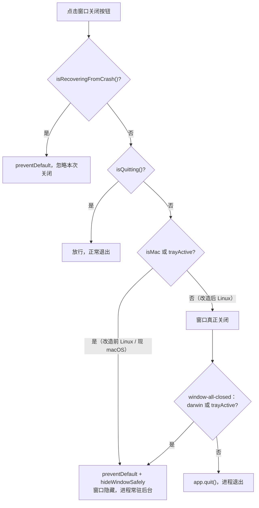

# WorkBuddy 部署使用说明

> mjpc 开发机 WorkBuddy（腾讯 AI Agent 桌面应用，deb 包 5.5.6 / Electron 37.10.3）部署、进程模型、数据目录、后台常驻成因与「关窗即退出」改造实录 · 2026-09-14

[文档首页](../../文档首页.md) › 资料 › 开发机 › WorkBuddy 部署使用说明　|　[同级：开发机部署使用说明总览](开发机部署使用说明总览.md)

## 1. 目的与适用范围 <a id="purpose"></a>

记录开发机 **mjpc**（Ubuntu 26.04.1 LTS，GNOME，Wayland，NVIDIA RTX 4090）上 **WorkBuddy** 的部署与使用：安装来源与版本、用户数据目录、配置文件、**运行时的进程模型与本地服务端口**、以及本机做的一处**「关窗即退出」改造**（WorkBuddy 在 Windows/Linux 上默认「关窗进托盘、后台常驻」，本机改掉该行为；成因、补丁步骤、验证与升级后重打见[第 7 节](#closequit)）。

本文档与《[开发机部署使用说明总览](开发机部署使用说明总览.md)》「开发设施清单」节配套；WorkBuddy 与 [CodeBuddy](CodeBuddy部署使用说明.md) 同出腾讯、同由 `www.codebuddy.ai` 分发，但**是两个独立应用**（各自的安装目录与数据目录互不相干，见[第 2 节](#env)），与 [opencode](opencode部署使用说明.md)、[deepseek-harness](../AI/deepseek_harness部署使用说明.md) 同属本机 AI 工具，各自独立部署。

> **取值说明**：本机路径统一用 `~` 表示（开发机开发用户为 `minjian`）；账号、令牌等凭据不在本文记录，以本机登录态与《[本地资源](../../用户文档/本地资源.md)》（已 gitignore）为准。

## 2. 环境概览 <a id="env"></a>

| 项 | 取值 |
| --- | --- |
| 系统 / 桌面 | Ubuntu 26.04.1 LTS（x86_64）；GNOME（`XDG_SESSION_TYPE=wayland`） |
| 应用名称 | WorkBuddy（`productName = WorkBuddy`，`applicationName = WorkBuddy`） |
| deb 包 | `workbuddy` **5.5.6**（amd64；Maintainer `Tencent Technology (Shenzhen) Company Limited <workbuddy@tencent.com>`，Homepage `https://www.codebuddy.ai`） |
| 应用目录 | `/opt/WorkBuddy/`（二进制 `/opt/WorkBuddy/workbuddy`，资源 `/opt/WorkBuddy/resources/app.asar`） |
| 数据目录名 | `.workbuddy`（即 `~/.workbuddy/`，与 CodeBuddy 的 `~/.codebuddy/` 不是同一目录） |
| 启动器 | `/usr/share/applications/workbuddy.desktop` → `Exec=/opt/WorkBuddy/workbuddy %U`（`StartupWMClass=WorkBuddy`，处理 `workbuddy://` 链接） |
| Electron 版本 | **37.10.3**（Chrome 138.0.7204.251；`/opt/WorkBuddy/version` 内容 `37.10.3-24`） |
| 安装形态 | **手工 `.deb` 安装，无 apt 源** → **不随 `apt upgrade` 升级**，需下载新包覆盖安装（见 3.2） |
| 内置 CLI | `/opt/WorkBuddy/resources/app.asar.unpacked/cli/bin/codebuddy`（`@genie/agent-cli`，提供 `codebuddy` / `cbc` / `codebuddy-code` 命令，**未加入 PATH**） |
| 自动更新 | 应用内置更新检查（更新服务 `https://copilot.tencent.com/v2/update`，下载域 `download.codebuddy.cn`）；升级会覆盖 `app.asar`，使[第 7 节](#closequit)的补丁失效 |

> WorkBuddy 与 [CodeBuddy](CodeBuddy部署使用说明.md) 的区分：CodeBuddy 是编码 IDE（`/usr/share/buddycn/`，数据 `~/.codebuddy*`），WorkBuddy 是 AI Agent 桌面应用（`/opt/WorkBuddy/`，数据 `~/.workbuddy`）；两者共享同一官网与下载域，但包名、目录、进程、登录态各自独立。

## 3. 安装与升级 <a id="install"></a>

### 3.1 安装形态 <a id="install-form"></a>

WorkBuddy 通过官方 `.deb` 安装（dpkg 包名 `workbuddy`），**未登记 apt 源**：

- `apt upgrade` **不会**更新 WorkBuddy，升级需人工下载新 `.deb`（见 3.2）；
- 查询已装版本：`dpkg -l workbuddy`（包版本）与 `/opt/WorkBuddy/version`（Electron 版本）；
- 卸载：`sudo dpkg -r workbuddy`（**不会**删除 `~/.workbuddy/` 用户数据，重装后登录态与配置仍在）；
- 安装目录归 root（`/opt/WorkBuddy`），普通用户只读；改应用文件需 `sudo`（见[第 7 节](#closequit)）。

### 3.2 升级步骤 <a id="upgrade"></a>

```bash
# 1) 从官网下载新版 deb（www.codebuddy.ai）
# 2) 覆盖安装（同包名，直接升级）
sudo dpkg -i workbuddy_<版本>_amd64.deb
# 3) 如提示依赖缺失，补装依赖
sudo apt-get -f install
# 4) 重启 WorkBuddy
```

安装前后确认版本：

```bash
dpkg -l workbuddy | tail -1
cat /opt/WorkBuddy/version
```

> **升级会使「关窗即退出」补丁失效**（新版覆盖 `app.asar`）：升级后按[第 7.5 节](#closequit-reapply)重打。升级前若已打补丁，`app.asar.bak` 仍是上一版原始文件，不要用它回滚到旧版应用。

## 4. 用户数据目录 <a id="dirs"></a>

WorkBuddy 的用户数据集中在 **`~/.workbuddy/`**（实测 2026-09-14 本机快照 540 MB，仅作量级参考）；另有 `~/.config/WorkBuddy/`（本机为空目录）：

| 路径 | 体积 | 内容 | 说明 |
| --- | --- | --- | --- |
| `~/.workbuddy/app/` | 150 MB | 应用运行时缓存 | 可清，重装后重建 |
| `~/.workbuddy/plugins/` | 105 MB | 内置/市场插件数据（含 `cache/`、`data/`） | 插件缓存可清；已装插件登记见第 5 节 |
| `~/.workbuddy/binaries/` | 86 MB | 按需下载的运行时二进制（如本地模型、llama 可执行等） | 可清，按需重新下载 |
| `~/.workbuddy/logs/` | 74 MB | `main.log` / `renderer.log` / `daemon.log` / `AppStartup.log` 等 | **排障首选**，见[第 8.2 节](#logs) |
| `~/.workbuddy/connectors-marketplace/` | 49 MB | 连接器市场（企业微信、飞书、钉钉等）缓存 | 可清 |
| `~/.workbuddy/workspace/` | 39 MB | 工作区（会话/项目）数据 | 含会话内容，慎清 |
| `~/.workbuddy/security/` | 22 MB | 安全相关（威胁库、凭据保护等） | 勿随意删 |
| `~/.workbuddy/settings.json` | 小 | **应用配置（见第 5 节）** | 配置，勿删 |
| `~/.workbuddy/workbuddy.db*` | 小 | SQLite 主库（`-shm` / `-wal` 为伴生文件） | 会话与索引数据 |
| `~/.config/WorkBuddy/` | 空 | 另一数据根（本机为空） | 保留 |

其余 `sessions/`、`memory/`、`traces/`、`audit-log/`、`file-history/`、`cache/` 等为会话、记忆、审计与缓存数据，属可再生成的运行数据。

清理建议：`app/`、`binaries/`、`cache/`、`connectors-marketplace/`、`logs/` 属可清缓存；`settings.json`、`security/`、`sessions/`、`workspace/`、`workbuddy.db*` 属配置/数据，勿随意删。

## 5. 配置与首次使用 <a id="setup"></a>

配置主文件为 **`~/.workbuddy/settings.json`**（与 CodeBuddy 的 `~/.codebuddy/settings.json` 互相独立）。本机 2026-09-14 取值（节选）：

```json
{
  "sandbox": {
    "extraAllowWrite": [
      "~/.local/share/agent-connectors/",
      "~/.tencent-cloudq",
      "~/.andonq",
      "~/.xiaoe-cloud",
      "~/.config/wecom/",
      "~/.lark-cli",
      "~/.lark-channel/",
      "~/Library/Application Support/beisencli/",
      "~/.dws",
      "/tmp/dws-cache",
      "~/.tmeet",
      "~/Library/Application Support/tmeet"
    ]
  },
  "claw": {
    "channels": { "wechatmp": { "enabled": true, "connectionMode": "webhook" } },
    "users": {},
    "legacyOwnerUid": "<登录账号标识>"
  },
  "enabledPlugins": {
    "weixinpay@workbuddy-builtin": true,
    "tencent-docs-plugin@workbuddy-builtin": true,
    "sheetagent@workbuddy-builtin": true,
    "tencent-pptx@workbuddy-builtin": true,
    "tencent-docx@workbuddy-builtin": true,
    "agent-browser@codebuddy-plugins-official": true,
    "find-skills@codebuddy-plugins-official": true,
    "document-skills@cb_teams_marketplace": true,
    "playwright-cli@codebuddy-plugins-official": true
  }
}
```

| 配置项 | 含义 |
| --- | --- |
| `sandbox.extraAllowWrite` | **沙箱额外可写目录**：AI 在沙箱内执行命令时，除默认范围外额外允许写入的路径（跨平台清单，macOS 路径在 Linux 上无效，属官方默认模板，可按需精简） |
| `claw.channels` | 消息通道开关与接入方式（本机启用微信公众号 `wechatmp`，webhook 模式） |
| `claw.legacyOwnerUid` | 预留的账号标识（凭据类，勿外传） |
| `enabledPlugins` | 内置/官方插件启用登记（腾讯文档、表格、PPT、微信支付、浏览器、技能查找等） |

> 登录与账号：以应用内登录态为准（本机已登录），凭据不入文档；退出登录后插件/连接器市场会重新校验。语言、快捷键、模型等运行时设置以应用内偏好为准，未单独落在本文件。

**开机自启**：本机**未**登记 WorkBuddy 自启（`~/.config/autostart/` 中只有 fcitx5 与 steamcommunity302），应用不会随登录自动启动；如需自启，自行在系统设置中添加。

## 6. 运行形态与进程模型 <a id="runtime"></a>

WorkBuddy 运行时会拉起一组进程（实测进程树，2026-09-14）：

| 进程（命令行特征） | 角色 |
| --- | --- |
| `/opt/WorkBuddy/workbuddy`（主进程） | Electron 主进程：创建窗口与系统托盘，承载应用服务（监听 `127.0.0.1:18488`） |
| `--type=zygote` / `--type=utility --utility-sub-type=network.mojom.NetworkService` | Electron 常规辅助进程（渲染隔离、网络服务、GPU 进程） |
| `.../resources/app.asar/main/daemon-app-server-entry.js` | **桌面守护（App Server）**：主进程之外的应用服务，提供本地 RPC |
| `.../resources/extensions/edge-sync/server/index.cjs` | **边缘同步服务**：局域网/多端同步，监听 `127.0.0.1:44665`、`127.0.0.1:44733` |
| `.../cli/vendor/sandbox/<版本>/sandbox-center` | **CLI 沙箱中心**：隔离 AI 执行命令的环境 |
| `/opt/WorkBuddy/chrome_crashpad_handler` | 崩溃转储收集 |

> 本地端口均为回环地址（`127.0.0.1`），不对外暴露；端口号随运行环境可能变化，排障时以 `ss -tlnp | grep workbuddy` 实测为准。

**为什么关了窗口还在跑？** WorkBuddy 是「关窗进托盘、后台常驻」型应用：点窗口关闭只会把窗口隐藏到系统托盘，主进程与上表的守护/同步/沙箱进程继续运行（`~/.workbuddy/daemon.log`、`edge-sync` 持续活动），因此表现为「关掉了却还在系统里」。本机已改造为「关窗即退出」，见[第 7 节](#closequit)。关窗行为的判定逻辑：



## 7. 「关窗即退出」改造 <a id="closequit"></a>

### 7.1 现象与原因 <a id="closequit-why"></a>

- **现象**：点窗口关闭（X）后，WorkBuddy 主进程与守护/同步/沙箱进程仍在，占用显存与内存（本机曾见关窗 9 小时后仍在运行）。
- **原因**：应用在 Windows/Linux 上**硬编码**「关窗进托盘」——托盘控制器初始化时对非 macOS 平台无条件置 `trayActive = true`；窗口关闭事件见到 `trayActive` 为真就 `preventDefault()` 并隐藏窗口。该行为**没有用户设置开关**（`~/.workbuddy/settings.json` 无相关项，应用内也无对应偏好），也**没有命令行退出参数**；官方退出方式是右键托盘图标 →「退出应用」。
- **判定链路**：见[第 6 节](#runtime)流程图——`isMac || isTrayActive()` 一旦为真即隐藏窗口，`window-all-closed` 时若 `trayActive` 为真也不退出。

### 7.2 改造前提：asar 完整性校验已关闭 <a id="closequit-pre"></a>

修改打包产物前先确认 Electron fuse `EnableEmbeddedAsarIntegrityValidation` 为**关闭**状态（本机实测关闭），否则改动 `app.asar` 会因完整性校验失败导致启动异常：

```bash
# 读取 Electron fuse（哨兵串 dL7pKGdnNz796PbbjQWNKmHXBZaB9tsX 后：版本字节 + 1 字节长度 + 各 fuse 值）
python3 - <<'PY'
sentinel = b'dL7pKGdnNz796PbbjQWNKmHXBZaB9tsX'
data = open('/opt/WorkBuddy/workbuddy','rb').read()
i = data.find(sentinel)
ver, ln = data[i+len(sentinel)], data[i+len(sentinel)+1]
vals = data[i+len(sentinel)+2:i+len(sentinel)+2+ln].decode()
names = ['RunAsNode','EnableCookieEncryption','EnableNodeOptionsEnvironmentVariable',
         'EnableNodeCliInspectArguments','EnableEmbeddedAsarIntegrityValidation',
         'OnlyLoadAppFromAsar','LoadBrowserProcessSpecificV8Snapshot','GrantFileProtocolExtraPrivileges']
print('fuse 版本', ver)
for n, v in zip(names, vals):
    print(f'  {n} = {"ON" if v=="1" else "off"}')
PY
```

本机输出中 `EnableEmbeddedAsarIntegrityValidation = off`，故可直接就地改 `app.asar` 内容。

### 7.3 补丁步骤 <a id="closequit-apply"></a>

把托盘初始化里的「非 macOS 置 `trayActive = true`」改为不可达，即令 Linux 关窗时不走隐藏分支。采用**等长字节替换**（不改文件长度，避免重算 asar 头部偏移）：

```bash
# 0) 先完全退出 WorkBuddy（应无输出）
pgrep -a workbuddy

# 1) 备份原始 app.asar（约 298 MB）
sudo cp -p /opt/WorkBuddy/resources/app.asar /opt/WorkBuddy/resources/app.asar.bak
sha256sum /opt/WorkBuddy/resources/app.asar /opt/WorkBuddy/resources/app.asar.bak   # 两者应一致

# 2) 就地等长替换：把条件 !isDarwin(9 字节) 换成 false + 4 空格
sudo python3 - <<'PY'
path = "/opt/WorkBuddy/resources/app.asar"
target = b"if (!isDarwin) this.trayActive = true;"
repl   = b"if (false    ) this.trayActive = true;"   # 与 target 等长
raw = open(path, "rb").read()
assert len(target) == len(repl)
assert raw.count(target) == 1, f"目标出现 {raw.count(target)} 次，中止"
assert raw.count(repl) == 0, "疑似已打过补丁，中止"
new = raw.replace(target, repl)
assert len(new) == len(raw)
open(path, "r+b").write(new)
print("OK: 补丁已写入")
PY

# 3) 校验：仅 9 字节差异、目标串消失、补丁串出现一次
python3 - <<'PY'
a = open("/opt/WorkBuddy/resources/app.asar","rb").read()
o = open("/opt/WorkBuddy/resources/app.asar.bak","rb").read()
diff = sum(1 for x, y in zip(a, o) if x != y)
print("大小一致:", len(a) == len(o), "差异字节:", diff)
print("目标串残留:", a.count(b"if (!isDarwin) this.trayActive = true;"))
print("补丁串出现:", a.count(b"if (false    ) this.trayActive = true;"))
PY
```

> 补丁点在 asar 内 **`/main/index.js`**（本机 5.5.6 实测）；不同版本文件布局可能变化，脚本以**字符串匹配**定位而非固定偏移，升级后可原样重跑（若断言「目标出现 N 次，中止」失败，说明该版本改动或去除了这段逻辑，需重新定位后再改）。

**一键重打脚本**：上述步骤已封装为 [`bms/scripts/tools/workbuddy/patch_close_to_quit.py`](../../../scripts/tools/workbuddy/patch_close_to_quit.py)（同目录入口 `重打关窗即退出.sh`，供终端/桌面调用）。升级（`.deb` 覆盖安装或自动更新）后 app.asar 被替换，一条命令即可重打：

```bash
# 先完全退出 WorkBuddy，再执行（非 root 会自动 sudo 提权）
python3 bms/scripts/tools/workbuddy/patch_close_to_quit.py            # 一键重打（默认 apply）
python3 bms/scripts/tools/workbuddy/patch_close_to_quit.py status     # 查看补丁 / 备份 / 是否在运行
python3 bms/scripts/tools/workbuddy/patch_close_to_quit.py restore    # 用 app.asar.bak 还原官方默认行为

# 或用同目录入口脚本（等价）
bms/scripts/tools/workbuddy/重打关窗即退出.sh
```

脚本行为：已打补丁则跳过；首次自动备份 `app.asar.bak`（已存在则保留不动）；等长替换后校验差异为 **9 字节**；检测到应用在运行时中止并提示先退出。`status` 输出 `已打补丁（关窗即退出）` 即当前生效。

### 7.4 验证 <a id="closequit-verify"></a>

启动应用后，看窗口日志确认托盘开关已关：

```bash
gtk-launch workbuddy            # 或点击应用菜单 / 直接跑 /opt/WorkBuddy/workbuddy
grep -h "System tray initialized" ~/.workbuddy/logs/main.log | tail -1
#   期望：... trayActive=false        （改造前为 trayActive=true）
```

点窗口关闭（X）后，日志应出现真正关闭与退出的记录：

```bash
grep -h -E "close event|window-all-closed" ~/.workbuddy/logs/main.log | tail -3
#   期望：
#   [WindowManager] close event: isMac=false, trayActive=false, ...
#   [WindowManager] close event falling through — window will actually close
#   [WindowLifecycle] window-all-closed (stage=..., tray=false), quitting
pgrep -a workbuddy || echo "WorkBuddy 已退出"
```

### 7.5 还原与升级后重打 <a id="closequit-reapply"></a>

- **还原**：`sudo cp -p /opt/WorkBuddy/resources/app.asar.bak /opt/WorkBuddy/resources/app.asar`，重启应用即恢复「关窗进托盘」。
- **升级后重打**：`.deb` 覆盖安装或应用自动更新后，`app.asar` 被替换、补丁丢失，直接跑一键重打脚本即可（`python3 bms/scripts/tools/workbuddy/patch_close_to_quit.py`，见 7.3；备份对旧版仍有效，新版本建议重新备份）。
- **备选方案**：若不想改应用文件，只能保持默认并**每次从托盘图标右键「退出应用」**；本机此前即在托盘中退出，改造后关窗即退，无需再操作托盘。

## 8. 常用操作与排障 <a id="trouble"></a>

### 8.1 启动与退出 <a id="start-stop"></a>

```bash
# 启动（三者等效）
gtk-launch workbuddy
/opt/WorkBuddy/workbuddy
# 或点击应用菜单 / 桌面图标

# 退出
#   改造后：直接点窗口关闭（X）即退出
#   改造前 / 还原后：右键托盘图标 →「退出应用」

# 强制结束（兜底；先确认主进程 PID）
pgrep -a workbuddy
kill <主进程PID>          # 主进程对 SIGTERM 可能无响应，必要时用 kill -9
```

> 注意 `pkill -f workbuddy` 会误伤含该字符串的其它命令（包括执行它的 shell 自身），建议按 PID 处理（`pgrep` 取出后 `kill`）。

### 8.2 日志与诊断 <a id="logs"></a>

| 日志 | 内容 |
| --- | --- |
| `~/.workbuddy/logs/main.log` | 主进程（窗口、托盘、关闭/退出、更新等；改造验证看这里） |
| `~/.workbuddy/logs/renderer.log` | 渲染进程（界面） |
| `~/.workbuddy/logs/daemon.log` | 桌面守护 / 应用服务 |
| `~/.workbuddy/logs/AppStartup.log` | 启动阶段耗时与阶段记录 |
| `~/.workbuddy/logs/`（其余 `mcp-apps-diag.log`、`automation.log`、`vendor-extract.log` 等） | 分模块诊断日志 |

查看本地服务端口：`ss -tlnp | grep workbuddy`（主进程 `18488`，边缘同步 `44665` / `44733`，均为回环地址）。

### 8.3 资源占用 <a id="resource"></a>

WorkBuddy 空闲时常驻内存数百 MB、显存约 300–500 MB（主进程 + GPU 进程 + 守护进程合计；本机曾在 `nvidia-smi` 中见约 291 MB）。若不需要后台常驻，改造为关窗即退出（[第 7 节](#closequit)）；临时看谁占显存用 `nvidia-smi`，占用大的进程可直接读 PID 与进程名。

### 8.4 常见问题 <a id="faq"></a>

| 现象 | 处理 |
| --- | --- |
| 关窗后进程仍在、显存/内存被占 | 默认行为（关窗进托盘）。改造关窗即退出见[第 7 节](#closequit)，或从托盘右键「退出应用」 |
| 补丁后仍关窗进托盘 | 检查 `app.asar` 是否已被升级覆盖（`~/.workbuddy/logs/main.log` 里 `trayActive` 若为 `true` 即补丁失效），跑一键重打脚本重打（见 7.3） |
| 补丁后应用起不来 | 用备份还原：`sudo cp -p app.asar.bak app.asar`（见 7.5）；确认改前 `EnableEmbeddedAsarIntegrityValidation` 为 off（见[7.2](#closequit-pre)） |
| 想恢复到官方默认 | 还原 `app.asar.bak`；或重装同版本 deb |
| 卸载后数据还在？ | dpkg 卸载不删 `~/.workbuddy/`，属预期；彻底清理需手动删该目录 |
| 开机自启 | 默认不自启；如需，在系统设置 → 应用 → 启动应用 中添加 |
| 升级/自动更新后找不到改的代码 | 更新只替换应用文件，不影响 `~/.workbuddy/`；应用文件处的修改会被覆盖 |

## 9. 检查清单 <a id="checklist"></a>

- □ 版本已核实：包 `workbuddy` 与 `/opt/WorkBuddy/version`（Electron）分别取自 `dpkg -l` 与文件读取
- □ 明确无 apt 源 → 升级靠手工 `.deb` 覆盖安装，卸载不删用户数据
- □ 用户数据目录职责清晰（配置 / 插件 / 二进制 / 日志 / 会话），清理只动缓存目录
- □ 进程模型与本地端口明确（主进程 `18488`、边缘同步 `44665`/`44733`，均为回环）
- □ 「关窗进托盘」成因与判定链路已记录，官方退出方式（托盘右键）与改造方式均已写明
- □ 「关窗即退出」改造前置（asar 完整性校验关闭）、步骤、验证、还原、升级后重打齐备
- □ 改动前已备份 `app.asar.bak` 并校验 sha256 一致
- □ 一键重打脚本（`scripts/tools/workbuddy/patch_close_to_quit.py`）已就位，`status` 能正确区分「已打补丁 / 官方原始」，升级后可用其重打
- □ 本机事实均经核实（2026-09-14），未写入账号/令牌等凭据

> 依《[文档生成规范](../../规范/文档生成规范.md)》编写 · 与《[开发机部署使用说明总览](开发机部署使用说明总览.md)》《[CodeBuddy部署使用说明](CodeBuddy部署使用说明.md)》《[命名规范](../../规范/命名规范.md)》配套 · 记录 2026-09-14 mjpc 本机核实与「关窗即退出」改造
