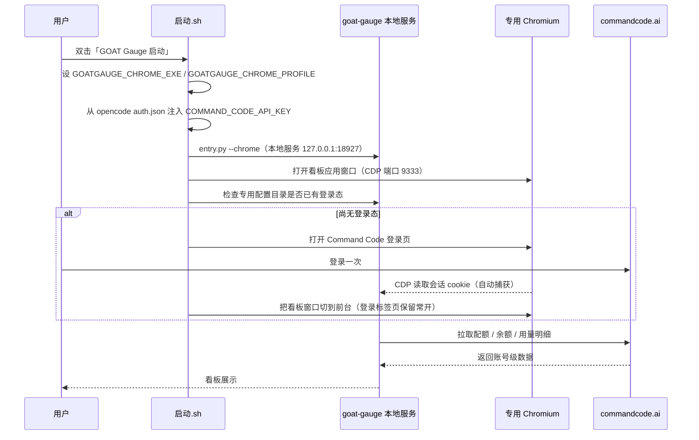

# goat-gauge 部署使用说明

> mjpc 开发机 Command Code GOAT 用量看板（goat-gauge）部署与验证实录

[文档首页](../../文档首页.md) › 资料 › 开发机 › goat-gauge 部署使用说明　|　[同级：开发机部署使用说明总览 →](开发机部署使用说明总览.md)　[opencode 部署使用说明 →](opencode部署使用说明.md)　[Steamcommunity_302部署使用说明 →](Steamcommunity_302部署使用说明.md)

## 1. 目的与适用范围 <a id="purpose"></a>

记录开发机 **mjpc**（Ubuntu 26.04.1 LTS，GNOME，Wayland，NVIDIA RTX 4090）上 **goat-gauge** 的部署与使用。goat-gauge 是一个本地优先（local-first）的 **Command Code GOAT 用量看板**：读取 Command Code 账号与计费接口，展示配额环、额度余额、账单周期与本地累积的用量明细。

它服务的场景是：opencode 桌面版/CLI 通过本机的 `commandcode` provider 调用模型，而 Command Code 账号的配额、余额、请求明细在 opencode 自身界面看不到——goat-gauge 把这部分**账号侧数据**单独呈现出来，作为 opencode 的配套看板。

> 定位说明：goat-gauge **不是 opencode 插件**（opencode 插件是 JS/TS 模块，无法加载 Python 程序），与 opencode 也没有进程耦合；二者只是**共用同一个 Command Code 账号与 API Key**。opencode 侧的部署见《[opencode部署使用说明](opencode部署使用说明.md)》，本文只写 goat-gauge 自身。

## 2. 背景与结论 <a id="background"></a>

### 2.1 能力与数据来源 <a id="capability"></a>

goat-gauge 是纯本地服务（Python 标准库 `http.server` + SQLite），读的是 Command Code 官方 CLI 用的同一批接口：

| 接口 | 用途 |
| --- | --- |
| `GET /alpha/whoami` | 账号（用户名/邮箱/组织） |
| `GET /alpha/billing/credits` | 额度余额与 5 小时 / 周 / 月度配额窗口 |
| `GET /alpha/billing/subscriptions` | 套餐与账单周期 |
| `GET /alpha/usage/summary` | 账单周期内聚合统计（请求数、token、费用） |
| `GET /internal/usage/charts` | 按模型的时间分桶（缓存读/写 token，用于缓存命中率） |
| 用量明细记录接口 | 逐条请求（模型、输入/输出 token、各项成本、耗时） |

页面形态对齐 GoGauge：配额环、时间范围切换（今天 / 近 7 天 / 近 30 天 / 全部）、总览 KPI、模型用量环图、每日趋势图、分页明细表，以及缓存命中率、缓存读/写量与按模型命中率。

### 2.2 口径：账号级，不是按客户端 <a id="scope"></a>

**这是使用前必须分清的一点**：

- goat-gauge 展示的是**整个 Command Code 账号**的用量——只要用同一个账号的 API Key（无论 opencode 桌面版、opencode CLI，还是其它客户端），调用都计入同一份统计。本机 `commandcode` 账号日常主要由 opencode 在用，所以**账号看板实际约等于 opencode 的 commandcode 用量看板**。
- **无法区分某条请求来自哪个客户端**。Command Code 的用量接口不返回客户端/会话标识（明细记录里只有 `model`、`tokensIn/Out`、`totalCost/inputCost/outputCost/cacheCost`、`createdAt`），因此出不了「仅 opencode 桌面版」的单独统计。
- 若确实需要「只统计 opencode 自身」，数据源不在 Command Code，而在 opencode 本机数据（`~/.local/share/opencode/opencode.db` 等），需另行开发，不属 goat-gauge 能力范围。

### 2.3 为什么采用浏览器会话模式 <a id="browser-mode"></a>

goat-gauge 支持两种凭据：**浏览器登录会话**与 **API Key**。两种都能读配额与余额，但**用量明细记录只有浏览器会话能取**（API Key 调用明细接口会返回 `usage-records-requires-browser-session`）。因此本机采用**浏览器会话模式**：

- 以 `entry.py --chrome` 启动，拉起本地服务并用**专用 Chromium 配置目录**打开看板；
- 在该专用窗口登录一次 Command Code 后，goat-gauge 经 **Chrome DevTools Protocol（CDP）**读取 `commandcode.ai` 的会话 cookie 并缓存在内存，之后自动刷新与同步；
- 登录完成后自动把**看板窗口切到前台**（登录标签页保留常开，见 2.4）；
- 同时注入 **API Key 作为兜底**，即使登录态失效，配额与余额仍可用。

### 2.4 登录会话有效期 <a id="session"></a>

- 会话 cookie `__Secure-commandcode_prod_.session_token` 有效期约 **7 天**，且站点在有活动时会续期，因此**正常情况不需要每次启动都登录**；完整重启（停止后再启动）实测不弹登录、明细照常同步。
- 另有一个短命 cookie `session_data`（约 2 分钟、频繁轮换），是站点自身机制；只要**专用 Chromium 常开、且登录标签页不关**，站点会持续刷新它，goat-gauge 的 cookie 监听（每 2 秒）随之续上。
- 因此本机把「登录后切回看板」实现为**把看板窗口切到前台**，而**不把登录标签页导航走**——导航走会断了会话续期。
- **能否永久有效取决于上游**，不能保证；但按上述做法可做到长时间免登录，真正失效时重登一次即可，期间配额/余额始终由 API Key 兜底。

## 3. 技术环境 <a id="environment"></a>

| 项 | 取值 |
| --- | --- |
| 系统 | Ubuntu 26.04.1 LTS（resolute），x86_64 |
| 桌面 | GNOME（`XDG_SESSION_TYPE=wayland`） |
| 浏览器 | snap 版 Chromium（`/snap/bin/chromium`，Chrome 153.0.8010.36）；本机**无** Google Chrome |
| Python | 系统 `python3` 3.14.4（externally-managed，故用仓库内 venv） |
| 仓库位置 | `/home/minjian/develop/goat-gauge/` |
| 虚拟环境 | `/home/minjian/develop/goat-gauge/.venv/` |
| 上游仓库 | `https://github.com/langjinusi985360/goat-gauge`（MIT，非官方社区项目，与 Command Code 无隶属关系） |
| 程序版本 | `app/__init__.py` 内 `__version__ = 0.1.3` |
| 监听地址 | `127.0.0.1:18927`（仅本机回环） |
| Chrome 调试端口 | `127.0.0.1:9333`（CDP，供 cookie 捕获） |
| 数据目录 | `~/.local/share/goat-gauge/`（SQLite `gauge.db`、`chrome-mode.log`） |
| 专用 Chrome 配置目录 | `~/snap/chromium/common/goat-gauge-profile/` |

### 3.1 依赖 <a id="deps"></a>

`requirements.txt` 只有一个依赖：

```text
websocket-client>=1.8
```

本机实际安装 **websocket-client 1.9.2**（用于连接 CDP 读取 cookie）。其余均为 Python 标准库。

## 4. 部署 <a id="deploy"></a>

部署顺序：克隆仓库 → 建 venv 装依赖 → 写启动/停止脚本 → 建桌面快捷方式 → 首次登录验证。下载类命令统一走国内镜像（GitHub 用 `ghfast.top` 加速、PyPI 用阿里云源，见《[git部署使用说明](git部署使用说明.md)》）。

### 4.1 克隆仓库 <a id="clone"></a>

```bash
cd ~/develop
git clone https://ghfast.top/https://github.com/langjinusi985360/goat-gauge.git goat-gauge
cd goat-gauge
```

> 用 `git clone`（而非下载 zip）是为了按 git 方式升级，见[第 7 节](#maintain)。

### 4.2 建虚拟环境并安装依赖 <a id="venv"></a>

系统 Python 3.14 为 externally-managed，不能直接 `pip install` 到系统环境，故在仓库内建 venv：

```bash
cd ~/develop/goat-gauge
python3 -m venv .venv
.venv/bin/pip install -i https://mirrors.aliyun.com/pypi/simple/ -r requirements.txt
```

验证：

```bash
.venv/bin/python -c "import websocket; print(websocket.__version__)"   # 1.9.2
```

### 4.3 启动/停止脚本 <a id="scripts"></a>

仓库根新增两个脚本（上游只提供 Windows 的 `.bat` / `.ps1`，Linux 侧需自建）：

- **`启动.sh`**：设好环境变量后执行 `entry.py --chrome`；
- **`停止.sh`**：关闭本地服务与专用 Chromium 窗口。

`启动.sh` 做五件事：

1. **检查上游版本**：`git fetch` 比对本地与 `origin/master`，有上游新提交就先 `git pull --rebase` 更新（`requirements.txt` 有变化时再 `pip install` 同步依赖）再启动；取不到远端或已是最新则直接启动（见[第 7 节](#maintain)）；
2. `GOATGAUGE_CHROME_EXE=/snap/bin/chromium` —— 本机无 Google Chrome，指定 snap Chromium；
3. `GOATGAUGE_CHROME_PROFILE=~/snap/chromium/common/goat-gauge-profile` —— **专用配置目录必须放在 snap 可写区**（原因见 4.3.1）；
4. 从 opencode 凭据文件 `~/.local/share/opencode/auth.json` 读取 `commandcode` 的 key，注入环境变量 `COMMAND_CODE_API_KEY` 作为兜底（**不二次落盘明文**）；
5. 首次运行（专用配置目录尚无登录态）时，服务与 CDP 就绪后自动打开 Command Code 登录页；**登录完成后自动把看板窗口切到前台**（登录标签页保留常开，供会话续期，见 2.4）。

> 权限：两个脚本需可执行位（`chmod 755 启动.sh 停止.sh`）。脚本内不使用 `exec` 直接替换进程，而是后台拉起服务、前台等待，以便插入「自动打开登录页 + 登录后切回看板」的辅助逻辑。

#### 4.3.1 snap Chromium 的配置目录限制 <a id="snap-profile"></a>

snap 版 Chromium 受 AppArmor 限制，**不能写入 `~/.local` 等隐藏目录**。若按默认把专用配置目录放在 `~/.local/share/goat-gauge/chrome-profile`，启动会报：

```text
Failed to create .../chrome-profile/SingletonLock: Permission denied (13)
Failed to create a ProcessSingleton for your profile directory. ... Aborting now to avoid profile corruption.
```

因此把专用配置目录改到 snap 可写区 `~/snap/chromium/common/goat-gauge-profile`（经环境变量 `GOATGAUGE_CHROME_PROFILE` 覆盖）。这是本机适配的关键点。

### 4.4 桌面快捷方式 <a id="shortcut"></a>

按《[开发机部署使用说明总览](开发机部署使用说明总览.md)》「桌面快捷方式设置」节的两去向约定，双份放置：

| 文件 | 作用 | Exec |
| --- | --- | --- |
| `~/桌面/GOAT Gauge 启动.desktop` | 桌面图标（启动） | `/home/minjian/develop/goat-gauge/启动.sh` |
| `~/桌面/GOAT Gauge 停止.desktop` | 桌面图标（停止） | `/home/minjian/develop/goat-gauge/停止.sh` |
| `~/.local/share/applications/goat-gauge.desktop` | 应用菜单入口（启动） | `/home/minjian/develop/goat-gauge/启动.sh` |

图标统一放 `~/.local/share/icons/goat-gauge.png`（取自仓库 `app/web/icon-192.png`）。桌面项均 `Terminal=false`（启动即弹出专用 Chromium 窗口，无需终端）。授权与注册：

```bash
chmod +x ~/桌面/"GOAT Gauge 启动.desktop" ~/桌面/"GOAT Gauge 停止.desktop"
gio set ~/桌面/"GOAT Gauge 启动.desktop" metadata::trusted true
gio set ~/桌面/"GOAT Gauge 停止.desktop" metadata::trusted true
update-desktop-database ~/.local/share/applications
```

### 4.5 首次登录与验证 <a id="first-login"></a>

双击 **GOAT Gauge 启动**（或跑 `~/develop/goat-gauge/启动.sh`）。首次运行时专用 Chromium 会打开两个窗口：看板页与 Command Code 登录页；在登录页完成一次登录后，goat-gauge 自动捕获会话并开始同步用量明细，同时把看板窗口切到前台（登录标签页保留常开，不再需要我们手动切窗口）。

启动流程：



验证（服务与 CDP 端口、账户读取）：

```bash
ss -lptn 'sport = :18927 or sport = :9333'                 # 两个端口均 LISTEN
curl -s http://127.0.0.1:18927/api/state | head -c 300     # configured:true，可见账户名
tail -n 5 ~/.local/share/goat-gauge/chrome-mode.log        # server started / captured 记录
```

## 5. 部署产物与配置 <a id="artifacts"></a>

```text
~/develop/goat-gauge/                     # 仓库克隆（上游代码）
├── .venv/                                # Python 虚拟环境（websocket-client）
├── 启动.sh                               # 启动脚本（本机新增；上游无 Linux 脚本）
├── 停止.sh                               # 停止脚本（本机新增）
├── entry.py                              # 启动入口（--chrome / --serve）
└── app/                                  # 服务、CDP、凭据、存储与前端资源

~/.local/share/goat-gauge/                # 运行数据目录（默认）
├── gauge.db                              # SQLite：本地累积的用量记录
└── chrome-mode.log                       # 启动与 cookie 捕获日志

~/snap/chromium/common/goat-gauge-profile/  # 专用 Chromium 配置（登录态所在）

~/桌面/GOAT Gauge 启动.desktop            # 桌面快捷方式（启动）
~/桌面/GOAT Gauge 停止.desktop            # 桌面快捷方式（停止）
~/.local/share/applications/goat-gauge.desktop   # 应用菜单入口
~/.local/share/icons/goat-gauge.png       # 图标
```

可用环境变量（见上游 README）：

| 变量 | 作用 | 本机取值 |
| --- | --- | --- |
| `GOATGAUGE_DATA` | 覆盖运行数据目录 | 默认 `~/.local/share/goat-gauge` |
| `GOATGAUGE_CHROME_EXE` | 指定 Chrome/Chromium 可执行文件 | `/snap/bin/chromium` |
| `GOATGAUGE_CHROME_PROFILE` | 指定专用浏览器配置目录 | `~/snap/chromium/common/goat-gauge-profile` |
| `GOATGAUGE_CHROME_CDP_PORT` | Chrome 调试端口 | 默认 `9333` |
| `COMMAND_CODE_API_KEY` / `COMMANDCODE_API_KEY` | API Key（兜底） | 由 `启动.sh` 从 opencode 凭据注入 |

## 6. 使用说明 <a id="usage"></a>

### 6.1 启动与停止 <a id="start-stop"></a>

| 操作 | 方式 |
| --- | --- |
| 启动 | 双击桌面 **GOAT Gauge 启动**；或 `~/develop/goat-gauge/启动.sh` |
| 停止 | 双击桌面 **GOAT Gauge 停止**；或 `~/develop/goat-gauge/停止.sh` |
| 打开看板 | 启动后自动弹出专用 Chromium 窗口；也可手动访问 `http://127.0.0.1:18927/` |

> 服务仅监听 `127.0.0.1`，不对外网/局域网开放，无需改 ufw 规则。

### 6.2 界面与功能 <a id="ui"></a>

- **配额总览**：5 小时 / 本周 / 本月三个配额环，显示已用/剩余与重置倒计时（数据来自账号额度窗口）；
- **总览 KPI**：总费用、平均每次费用、总请求、总 token、缓存命中率、缓存读/写量；
- **时间范围**：今天 / 近 7 天 / 近 30 天 / 全部；宽范围的趋势与明细由**本地 SQLite 累积**补齐（上游只提供最近约 1 天、100 条明细）；
- **模型用量**：按模型的 token 与费用环图；
- **明细**：分页用量记录表（时间、模型、输入/输出 token、缓存费用、费用、耗时）；
- **账户**：套餐、账单周期、连接方式与脱敏后的 Key。

### 6.3 设置项 <a id="settings"></a>

在页面「设置」抽屉内可调：

- **API Key**：重新验证或更换；「自动检测」尝试从环境/已知位置发现 Key；
- **刷新频率**：服务端向上游拉取额度的时间间隔（30 秒 / 1 分钟 / 2 分钟 / 5 分钟）；
- **计费货币**：`USD`（默认）/ `CNY`；费用始终以 USD 存储，切换只影响显示，CNY 用可编辑汇率换算（默认 1 USD = 7.2 CNY）；
- **浏览器登录**：登录页在**未登录时由启动脚本自动打开**并等待登录完成（也可手动触发接口 `POST /api/open-login`）。保持专用 Chromium 与登录标签页常开可持续续期会话（见 2.4）。

> 说明：账号配额与余额的数字是 Command Code 的 **credits**，不是美元，货币换算不适用。

## 7. 维护与升级 <a id="maintain"></a>

- **升级 goat-gauge**：`启动.sh` **每次启动会自动检查上游版本**——`git fetch` 后若 `origin/master` 有本地没有的新提交，先 `git pull --rebase`（本地新增脚本提交会自动 rebase 到最新）更新，且仅当 `requirements.txt` 变化时才 `pip install` 同步依赖；取不到远端或已是最新则直接启动，不阻塞。也可手动升级：

  ```bash
  cd ~/develop/goat-gauge
  git pull                                    # 若直连慢，可临时把 remote 换成 ghfast.top 前缀
  .venv/bin/pip install -i https://mirrors.aliyun.com/pypi/simple/ -r requirements.txt
  ```

  升级后重新启动服务生效。注意 `启动.sh` / `停止.sh` 为**本机新增并已提交的文件**，`git pull --rebase` 会保留并 rebase 到上游最新之上。

- **数据保留**：历史记录存 `~/.local/share/goat-gauge/gauge.db`，可整目录备份/迁移；迁移后登录态随专用浏览器配置目录 `~/snap/chromium/common/goat-gauge-profile` 一并带走。
- **登录态失效**：Command Code 会话过期后，明细同步会失败；重跑一次启动脚本（未登录时自动打开登录页，登完自动切回看板）即可。保持专用 Chromium 常开、登录标签页不关可延长有效期（见 2.4）；期间配额与余额由 API Key 兜底维持。

## 8. 常见问题与故障排查 <a id="troubleshoot"></a>

| 现象 | 原因与处理 |
| --- | --- |
| 启动报 `SingletonLock: Permission denied` | 专用配置目录落在 `~/.local` 等 snap 不可写的隐藏目录；改到 `~/snap/chromium/common/goat-gauge-profile`（见 4.3.1） |
| 端口 18927 / 9333 被占用 | 已有实例在跑，先执行 `停止.sh`；或核查占用：`ss -lptn 'sport = :18927 or sport = :9333'` |
| 明细/趋势一直为空 | 未登录浏览器会话：API Key 模式取不到明细（返回 `usage-records-requires-browser-session`）；重跑启动脚本，在自动弹出的登录页登录一次 |
| 登录后停在 commandcode.ai 页面 | 登录后 Command Code 自身页面会跳转到其用量页；启动脚本会自动把 goat-gauge 看板窗口切到前台，看板其实是另一个窗口（见 2.4） |
| 反复要求登录 | 会话 `session_token` 约 7 天；若频繁失效，确认专用 Chromium 与登录标签页保持常开、未用 `停止.sh` 清掉会话（见 2.4） |
| 日志出现 `'--ozone-platform=wayland' is not compatible with Vulkan` | snap Chromium 在 Wayland 下的告警，本机实测不影响看板渲染（窗口与页面正常），可忽略 |
| 页面显示但配额为 0 / 报 Key 无效 | 兜底 Key 失效或过期：在「设置」里重新验证/更换 API Key |
| 更换了登录账号 | 「设置」内清除本机保存的登录状态与连接后，重新登录一次 |
| 关闭看板窗口后服务仍在 | `--chrome` 模式窗口关闭不必然停服务；用「GOAT Gauge 停止」显式关停 |

排查用日志与端口：

```bash
tail -n 30 ~/.local/share/goat-gauge/chrome-mode.log    # 启动、cookie 捕获、同步错误
ss -lptn 'sport = :18927 or sport = :9333'              # 服务与 CDP 端口
```

## 9. 关联文档 <a id="related"></a>

- 《[opencode部署使用说明](opencode部署使用说明.md)》：opencode 桌面端 / CLI 部署；本文看板监控的正是其使用的 `commandcode` 账号用量
- 《[开发机部署使用说明总览](开发机部署使用说明总览.md)》：mjpc 开发机设施总览与桌面快捷方式约定（本文档在其中的定位）
- 《[llamacpp部署使用说明](../AI/llamacpp部署使用说明.md)》：本机本地模型推理（opencode 的 `llamacpp` provider 后端）
- 《[Ubuntu安装部署使用说明](../工具/Ubuntu安装部署使用说明.md)》：系统安装与基础配置
- 《[文档生成规范](../../规范/文档生成规范.md)》：本文档的组织、格式与图形约定
- 《[本地资源](../../用户文档/本地资源.md)》：mjpc 相关机器信息取值（已 gitignore）
- 上游项目：`https://github.com/langjinusi985360/goat-gauge`（goat-gauge 仓库与 README）

> 依《[文档生成规范](../../规范/文档生成规范.md)》编写 · 记录 mjpc 上 goat-gauge（Command Code GOAT 用量看板）的部署、使用与排障 · 口径为 Command Code 账号级，不区分客户端
