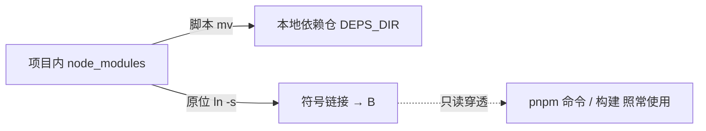

# pnpm 部署使用说明

> mjpc 开发机 pnpm（前端包管理 + 单一 workspace 收敛 + 依赖外置）部署与使用 · 2026-09-24

[文档首页](../../文档首页.md) › 资料 › 开发机 › pnpm 部署使用说明　|　[同级：uv 部署使用说明 →](uv部署使用说明.md)　[git 部署使用说明 →](git部署使用说明.md)　[开发机部署使用说明总览 →](开发机部署使用说明总览.md)

## 1. 目的与适用范围 <a id="purpose"></a>

记录开发机 **mjpc** 上 pnpm 的部署与使用：**前端依赖管理统一走 pnpm（npm 时代退役）**、**单一 workspace 收敛**、以及**依赖物理外置到项目外**（本地依赖仓），保证：

- **严格依赖树**：pnpm 内容寻址 store + 符号链接，消灭 npm 平铺的幽灵依赖；依赖必须逐项声明（按需补齐）；
- **单一锁文件**：`frontend/packages/*`（core / vue / ui-ep）、`frontend/apps/*`（desktop）、`frontend/modules/*`（demo / sample）**全收敛为一个 workspace**，根 `pnpm-lock.yaml` 唯一锁定，删除各子包独立 `package-lock.json`；
- **依赖不进仓库树**：项目内 `node_modules` 经脚本外置为指向本地依赖仓的符号链接，检索工具（glob / ripgrep / 搜索）默认不跟随链接，**检索零污染**；CI 也改为 job 内现装（镜像不再预置依赖），本地与 CI 口径一致。

适用范围：开发机本地一切前端开发与构建；CI 侧原则见《[前端开发规范](../../规范/前端开发规范.md)》。

## 2. 背景与结论 <a id="background"></a>

### 2.1 为什么弃用 npm <a id="why-npm"></a>

- npm 平铺 node_modules：幽灵依赖（未声明却可 import）成常态，缺失声明长期不被发现；
- 多份 `package-lock.json`（根、desktop、demo、sample 各一份）需镜像侧三套 `npm ci` 预置，CI 依赖镜像内预装整仓节点，又慢又绕；
- 检索工具会扫入海量 node_modules 文件，搜索零污染无从谈起。

### 2.2 结论：pnpm 单一 workspace + 依赖外置 <a id="conclusion"></a>

- **pnpm 11.7.0**（与 CI 基础镜像固定版本一致，pnpm-lock.yaml 锁语义由此版本解析）；
- **workspace 全收敛**：`packages/* / apps/* / modules/*` 统一到根 `pnpm-workspace.yaml`，平台基座包（`@bms/core` / `@bms/vue` / `@bms/ui-ep`）与模块的依赖协议全部改 `workspace:*`（原 `file:` / `0.0.0`）；
- **依赖物理外置**：根与各工程 `node_modules` 经 `bms/scripts/tools/deps/` 三入口脚本（外置 / 还原 / 重装）整体 `mv` 到本地依赖仓并原位符号链接；pnpm store 本身就在项目外（`~/.local/share/pnpm/store/v11`，内容寻址全局缓存）。

## 3. 技术环境 <a id="environment"></a>

| 项 | 取值 |
| --- | --- |
| node（nvm） | v24.20.0（默认；`~/.nvm/versions/node/` 下另有 v22.23.2） |
| npm | 11.19.0（随 node；pnpm 经其全局安装） |
| pnpm | **11.7.0**（`~/.nvm/versions/node/v24.20.0/bin/pnpm`） |
| pnpm store | `~/.local/share/pnpm/store/v11`（内容寻址；store 内的真实文件以硬链接挂入各 node_modules） |
| 项目 registry | npmmirror（`bms/.npmrc` 的 `registry=https://registry.npmmirror.com`） |
| workspace 收敛 | `bms/pnpm-workspace.yaml`：`frontend/packages/*`、`frontend/apps/*`、`frontend/modules/*` |
| 单一锁文件 | `bms/pnpm-lock.yaml`（删除 4 份 `package-lock.json`：根 / desktop / demo / sample） |
| 本地依赖仓 | `bms/deploy/.env` 的 `DEPS_DIR` 指定（默认 `$HOME/dev-deps/bms`；含前端 node_modules 与后端 backend-venv，见[uv 部署使用说明](uv部署使用说明.md)） |

> 依赖安装一律走国内镜像（npmmirror）；`pnpm install` 命中 store 即秒级「link 出目录」，重装基本不耗时。

## 4. 部署 <a id="deploy"></a>

### 4.1 安装 pnpm <a id="install"></a>

pnpm 随 node（nvm）的全局 npm 安装，路径落在 nvm 当前版本 bin 下，切换 node 版本后需重新 global 安装：

```bash
npm install -g pnpm@11.7.0
pnpm -v          # 11.7.0
which pnpm       # ~/.nvm/versions/node/<当前版本>/bin/pnpm
```

> 版本与 CI 基础镜像固定版本一致（`deploy/ci/Dockerfile.frontend` 内 `pnpm@11.7.0`）；升级须同步改 Dockerfile 并核对 `pnpm-lock.yaml` 的 `lockfileVersion`。

### 4.2 项目配置 <a id="config"></a>

`bms/` 根三个配置（均已入库，脚本/CI 依赖）：

| 文件 | 作用 |
| --- | --- |
| `.npmrc` | registry=npmmirror；`auto-install-peers=true`、`strict-peer-dependencies=false`（平滑迁移、peer 冲突仅告警） |
| `pnpm-workspace.yaml` | workspace 包范围；`allowBuilds`（@parcel/watcher、vue-demi 放行 postinstall 脚本） |
| `pnpm-lock.yaml` | 单一锁文件（**必须提交**；CI 以 `--frozen-lockfile` 为准） |

> **pnpm 11 只读 `pnpm-workspace.yaml` 的 `allowBuilds`**：`package.json` 里的 `pnpm.onlyBuiltDependencies` 等字段已不读取（会告警），build 类包放行一律写 workspace 配置。@parcel/watcher 与 vue-demi 属依赖树中**有 postinstall 脚本但默认拦截**的包，放行后才能正常装。

## 5. 依赖外置（本地依赖仓） <a id="externalize"></a>

前端依赖**不落仓库树**：项目内 node_modules 整体外置到本地依赖仓（默认 `$HOME/dev-deps/bms`），原位替换为符号链接。符号链接内容 glob / ripgrep / IDE 搜索默认**不跟随**，检索零污染。

外置逻辑：



| 形态 | 说明 |
| --- | --- |
| 外置态 | node_modules 为符号链接；日常开发、构建、检索均在此态（**推荐常驻**） |
| 还原态 | 符号链接删除、真实目录搬回项目内；仅 pnpm install 前需要（安装器重建时若遇符号链接会误判跳过） |

### 5.1 三入口脚本 <a id="scripts"></a>

`bms/scripts/tools/deps/`（三脚本 + 本说明；语法 POSIX sh）：

| 脚本 | 作用 |
| --- | --- |
| `外置依赖.sh` | 项目内全部 node_modules → mv 到本地依赖仓 + 原位符号链接；`--dry-run` 预览 |
| `还原依赖.sh` | 经符号链接定位并把真实目录整体搬回项目内（还原态） |
| `重装依赖.sh` | **还原 → 安装 → 再外置**的完整闭环；参数 `--frontend-only` / `--backend-only` / 不带（前后端都装） |

本地依赖仓路径读取顺序：环境变量 `DEPS_DIR` → `bms/deploy/.env` 的 `DEPS_DIR=` → 默认 `$HOME/dev-deps/bms`。

```bash
# 外置（推荐常驻此态）
sh bms/scripts/tools/deps/外置依赖.sh            # 或 --dry-run 先预览
ls -la node_modules                              # → /home/xxx/dev-deps/bms/node_modules（符号链接）

# 重装（先还原避免安装器误判，装完自动再外置）
sh bms/scripts/tools/deps/重装依赖.sh --frontend-only
```

> `mv` 与 `ln -s` 都在同分区（/）内完成：mv 是 rename、保留硬链接结构，秒级完成、无复制损耗。

## 6. 使用 <a id="usage"></a>

workspace 唯一，命令一律在 `bms/` 根执行（子包不设独立 node_modules 状态——已外置）：

| 用途 | 命令 |
| --- | --- |
| 全量安装（按锁文件） | `pnpm install --frozen-lockfile` |
| 单包命令 | `pnpm --filter @bms/desktop run lint` |
| 全包门禁（core 等） | `pnpm run check` |
| 构建 + 计量 | `pnpm --filter @bms/desktop run build`（再 `run budget`） |
| 模块构建 + 隔离扫描 | `pnpm --filter @bms/module-demo run build && pnpm --filter @bms/module-demo run budget && pnpm --filter @bms/module-demo run guard:isolation` |

常用组合（本地验证顺序，与 CI 各前端 job 对齐）：

```bash
pnpm install --frozen-lockfile
pnpm --filter @bms/core run typecheck && pnpm --filter @bms/core run test
pnpm --filter @bms/vue run typecheck && pnpm --filter @bms/vue run test
pnpm --filter @bms/ui-ep run typecheck && pnpm --filter @bms/ui-ep run test
pnpm --filter @bms/desktop run lint && pnpm --filter @bms/desktop run test:cov && pnpm --filter @bms/desktop run build && pnpm --filter @bms/desktop run budget
pnpm --filter @bms/module-demo run lint && pnpm --filter @bms/module-demo run typecheck && pnpm --filter @bms/module-demo run test
```

## 7. 常见问题 <a id="troubleshoot"></a>

### 7.1 幽灵依赖报错 / 解析不到某包 <a id="ghost"></a>

npm 平铺时代能 import、pnpm 严格树下解析不到的包，必须在**实际使用它的工程**的 `package.json` 里声明（该工程 `dependencies`/`devDependencies`）。例：ui-ep 源码 `import('bpmn-moddle')` → ui-ep `dependencies` 补 `bpmn-moddle`；缺 vitest 声明则补 `devDependencies`。**判定口径**：按「import 面的包名」逐包补，不要按「别的工程安装了它」来写。

### 7.2 build 类依赖的 postinstall 被拦 <a id="allowlist"></a>

装完某些包（@parcel/watcher 等）未正常构建，属 postinstall 默认拦截。放行写入 `pnpm-workspace.yaml` 的 `allowBuilds`（pnpm 11 不读 package.json 的 `pnpm` 字段）后重新：

```bash
pnpm rebuild @parcel/watcher vue-demi
pnpm install --frozen-lockfile
```

### 7.3 pnpm install 什么都没重装 / 跳过 <a id="skipped"></a>

先确认处于**还原态**（`ls -la node_modules` 不是符号链接）；安装器见到符号链接会误判依赖已齐而跳过。步骤：`还原依赖.sh` → `pnpm install --frozen-lockfile` → `外置依赖.sh`（或直接 `重装依赖.sh`）。

### 7.4 锁文件与版本对齐 <a id="frozen"></a>

`--frozen-lockfile` 失败说明 `package.json` 与 `pnpm-lock.yaml` 不一致：改完依赖声明先 `pnpm install`（更新锁），再回到 frozen 校验。CI 只认 frozen，本地一致后才能推送。

## 8. 关联文档 <a id="related"></a>

- 《[uv 部署使用说明](uv部署使用说明.md)》：后端 Python 依赖管理（uv.lock + .venv 外置），与本文同走本地依赖仓
- 《[开发机部署使用说明总览](开发机部署使用说明总览.md)》：mjpc 开发设施汇总（本文档在其中的定位）
- 《[前端开发规范](../../规范/前端开发规范.md)》：前端依赖方向、共享面白名单与 CI 口径（pnpm 单一 workspace 为现状依据）
- 《[git 部署使用说明](git部署使用说明.md)》：开发机 git 与仓库接入（提交前预检、锁文件提交要求见 Git 协作规范）
- 《[文档生成规范](../../规范/文档生成规范.md)》：本文档的组织、格式与图形约定

> 依《[文档生成规范](../../规范/文档生成规范.md)》编写 · 记录 2026-09-24 mjpc 前端依赖迁移（npm → pnpm）落地状态