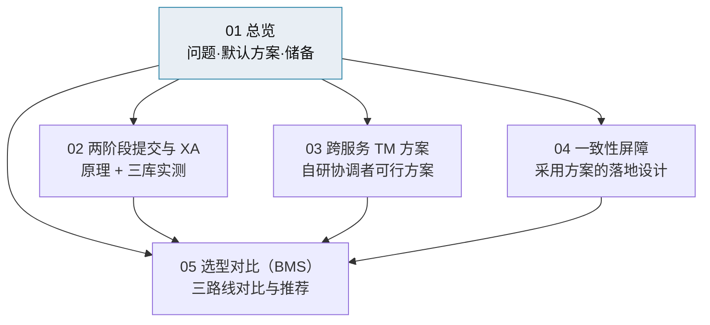

# 分布式事务总览

> 单库原子 · 跨服务最终一致 · 一致性屏障 · 强一致（2PC / XA / TM）技术储备

[文档首页](../../../文档首页.md) › [知识档案](../技术栈知识档案总览.md) › 分布式事务总览　|　[← 返回总览](../技术栈知识档案总览.md)

---

> **定位**：本目录是**知识档案**（辅助参考），沉淀 BMS 在分布式场景下保证「事务一致性」的**全部可行方案**——默认采用的「本地事务 + 最终一致 + 一致性屏障」，以及**作为技术储备**的强一致方案（两阶段提交 / XA / 自研跨服务事务管理器）。
>
> **默认口径以规范与架构为准**（《[后端开发规范](../../../规范/后端开发规范.md)》平台《架构设计 · 服务间通信与分布式一致性》）；本目录提供原理、实测证据、代价与可替换方案，**不替代**规范与设计。强一致内容为**储备**，未启用。

## 1. 问题本质 

一句话：**同一个数据库里改多张表，数据库自己就能保证「要么全成功、要么全失败」；一旦跨两个服务的两个数据库，数据库就管不了对方了。**

| 场景 | 能否原子 | 靠什么 |
| --- | --- | --- |
| 单库多表 | **能**（天然） | 数据库本地事务（`BEGIN … COMMIT / ROLLBACK`） |
| 跨库 / 跨服务 | **不能**（默认） | 需额外机制：最终一致（默认）或分布式事务（储备） |

由此分两类目标：

| 类型 | 含义 | 达成手段 |
| --- | --- | --- |
| **强一致（原子）** | 要么全改、要么全不改，中间半成品对外**永远看不到** | 仅「同一数据库内」免费；跨库需 2PC / XA / TM（本目录储备方案） |
| **最终一致** | 先容忍短暂中间态，靠重试收敛 | 本地事务 + Outbox + 幂等（**平台事件 / 读侧基线**；**跨服务写不采用**——见下） |

## 2. 术语速查 

| 术语 | 含义 |
| --- | --- |
| 本地事务 | 单个数据库内的 ACID 事务；平台最可靠的地基 |
| 事务性发件箱（Outbox） | 业务写入与事件发布**同库同事务**，避免「库改了但消息没发」 |
| 幂等消费 | 消费者维护「已处理事件（consumer + event_id）」唯一记录，重复消息只生效一次 |
| Saga / 补偿 | 跨服务业务事务 = 一串本地事务 + 每个失败步骤的**反向操作**；协同式（各服务听事件）或编排式（中心协调器） |
| 最终一致 | 接受短暂中间态，最终收敛一致 |
| 两阶段提交（2PC） | 协调者先让所有参与方「准备」（改好并加锁、不提交），全票通过才「提交」，否则「回滚」 |
| XA | 数据库 / 驱动暴露的、供外部协调者驱动 2PC 的标准接口（X/Open XA） |
| 事务管理器（TM） | 2PC 的「总协调人」：维护全局事务状态、驱动各参与方 prepare / commit / rollback、崩溃后按账本恢复 |
| 一致性屏障 | 「执行前校验目标变更是否已应用，未应用则有界等待、超时报错」的机制（本目录采用方案） |
| 悬挂事务 | 已 prepare 但未被 commit / rollback、且参与者会话已断的分支（需对账清理） |

## 3. 平台默认方案（已采用） 

BMS 的**跨服务写**统一走 **TM + XA 强一致**（2026-10-10 拍板；**Saga / 补偿已作废**），**事件 / 读侧**基线为**本地事务 + 自研薄 Outbox + 幂等消费**，并在需要「执行前已收敛」的关键路径叠加**一致性屏障**。数据链：

- **可靠从哪来**：不是名词叠加，而是一条每环都有兜底的数据链——单库原子靠本地事务、跨服务写靠 TM + XA、库↔事件原子靠 Outbox、重复投递靠幂等、执行前收敛靠屏障、最终失败靠死信 + 重放。
- **要盯三件事**：Outbox 积压、消费延迟、死信数量（可观测基座已做）。
- **性质**：工程级**最终一致**，不是数学级跨库原子；只保证走屏障校验的路看不到半成品，绕过屏障直读他库仍可能看到中间态（靠数据所有权纪律封堵）。
- 详见《[04 一致性屏障](04_分布式事务_一致性屏障.md)》与平台《[微服务 · 05 通信与分布式一致性](../微服务/05_微服务_通信与分布式一致性.md)》。

## 4. 强一致技术储备（未启用） 

当客户对「中间态一秒钟都不能忍」且**无法把数据收敛到单库**时，可经插件化替换引入强一致方案。可行性已用真库实测（2026-10-06，三库服务器均支持 XA）：

| 方案 | 能力 | 代价 | 篇目 |
| --- | --- | --- | --- |
| 单进程多库 2PC | 同进程跨库原子（迁移 / 共址运维） | 需同步引擎；PG 需开参数；握锁握连接 | [02 两阶段提交与 XA](02_分布式事务_两阶段提交与XA.md) |
| 外部 / 自研 TM + 各服务 XA | 跨独立服务原子 | Python 无成熟 TM；阻塞长、可用性差、需账本 + 恢复 + 悬挂对账 | [03 跨服务 TM 方案](03_分布式事务_跨服务TM方案.md) |
| 单库收敛（**首选替代**） | 把要求原子的数据收进一个服务库 | 几乎为零 | [05 选型对比](05_分布式事务_选型对比（BMS）.md) |

> **替换口径**：强一致方案以**能力基类 + 插件注册表 + 配置选择 + 提供者**实现（与平台「对冲供应链风险」的插件化策略一致），默认 `null` / 关闭；客户需要时切配置启用，不改业务调用面。替换点见《[03 跨服务 TM 方案](03_分布式事务_跨服务TM方案.md)》§插件化替换。

## 5. 子篇地图 

1. [两阶段提交与 XA](02_分布式事务_两阶段提交与XA.md)：协议原理、三库（MySQL / PostgreSQL / 达梦）**实测可行性与限制**、悬挂与恢复。
2. [跨服务 TM 方案](03_分布式事务_跨服务TM方案.md)：自研协调者的可行方案（形态、协调算法、全局事务账本、服务侧参与协议、崩溃恢复与悬挂对账）与插件化替换口径。
3. [一致性屏障](04_分布式事务_一致性屏障.md)：**平台采用**的「写后读校验 / 有界等待 / 超时报错 / 永久失败补偿」落地设计。
4. [选型对比（BMS）](05_分布式事务_选型对比（BMS）.md)：面向权限保存等场景的三路线对比与推荐。

## 6. 与相邻专题的边界 

| 专题 | 边界 |
| --- | --- |
| [微服务 · 05 通信与分布式一致性](../微服务/05_微服务_通信与分布式一致性.md) | 该篇讲**模式总论**（Saga / Outbox / 幂等与最终一致）；本目录聚焦**事务一致性方案本身**（含 2PC / XA / TM 储备与屏障落地） |
| [插件化架构](../插件化架构/01_插件化架构_总览.md) | 强一致方案的**可替换落地机制**（端口 + 注册表 + 配置 + 提供者）来自插件化专题 |
| 平台《架构设计 · 服务间通信与分布式一致性》 | **默认口径的权威源**；本目录为其证据与储备补充 |
| 平台《数据库设计 · 方言特性》三库「事务与连接」节 | 各库 XA / 2PC 的**方言级事实源**（本目录引用其实测结论） |

---

> 依《[文档生成规范](../../../规范/文档生成规范.md)》编写
