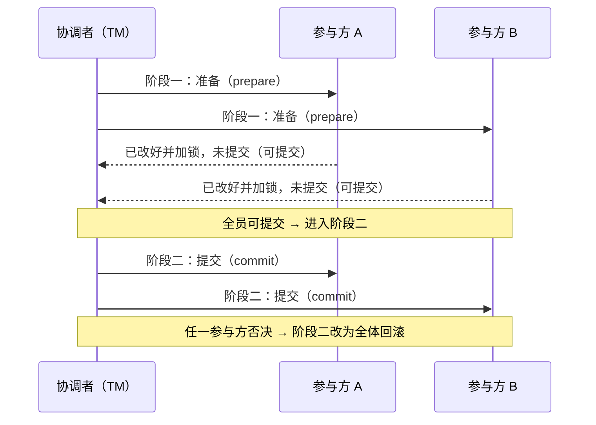

# 两阶段提交与 XA

> 2PC 协议原理 · XA 接口 · 三库实测可行性与限制 · 悬挂与恢复

[文档首页](../../../文档首页.md) › [知识档案](../技术栈知识档案总览.md) › [分布式事务总览](01_分布式事务_总览.md) › 两阶段提交与 XA

---

> **定位**：本目录为知识档案（辅助参考）。本篇讲**两阶段提交（2PC）与 XA** 的原理与 BMS 三库实测结论，是《[跨服务 TM 方案](03_分布式事务_跨服务TM方案.md)》的基础。**默认口径以规范与架构为准**，本篇为技术储备。

## 1. 协议原理 

2PC 用一个**协调者（TM）**统一驱动所有参与方（数据库），分两步走：

- **阶段一（准备 / 投票）**：协调者要求每个参与方执行变更、写入日志、**加锁但暂不提交**，并回复「可提交 / 不可提交」。
- **阶段二（提交 / 回滚）**：**全票可提交**才通知全体提交；**任一否决**则通知全体回滚。
- **关键点**：从「准备」到「提交」之间，参与方**一直持有数据库锁与连接**；这段时间谁卡住或宕机，全体一起等（阻塞协议）。

## 2. XA 接口 

XA（X/Open XA）是数据库 / 驱动暴露给外部协调者、用于驱动 2PC 的**标准接口**。核心概念：

| 概念 | 说明 |
| --- | --- |
| `xid` | 全局事务标识（含 `formatId` / `gtrid` / `bqual`）：区分全局事务与其中各分支 |
| `XA_START` / `XA_END` | 开启 / 结束一个分支（分支内做业务变更） |
| `XA_PREPARE` | 准备：写日志、加锁、不提交 |
| `XA_COMMIT` / `XA_ROLLBACK` | 提交 / 回滚整个全局事务 |
| `XA_RECOVER` | 列举**悬挂 / 启发式完成**的分支（崩溃恢复与对账用） |
| 1PC / 2PC | 单阶段（TM 判定只有单个分支时可省准备）与两阶段提交 |

## 3. 三库实测（2026-10-06） 

> 所有实测均在 mjbk 开发服务器真库完成，探针库 / 模式跑完即清理；结论已回写《数据库设计 · 方言特性》三库「事务与连接」节（**唯一事实源**，本篇为汇总）。

| 库 | 服务器支持 | 应用驱动路径 | 前置条件 |
| --- | --- | --- | --- |
| **MySQL 8.4** | 原生 `XA`（InnoDB） | 同步引擎（`pymysql`）`begin_twophase` 直接可用 | 无 |
| **PostgreSQL 16** | `PREPARE TRANSACTION` | 同步引擎（`psycopg`）`begin_twophase` **可用，已实测** | 见《[PostgreSQL 部署使用说明](../../开发服务器/linux/PostgreSQL部署使用说明.md#twophase)》 |
| **达梦 DM8** | `DBMS_XA` 包（`XA_START / XA_END / XA_PREPARE / XA_COMMIT / XA_ROLLBACK / XA_RECOVER`） | 默认 `dmSQLAlchemy` 同步方言**未接** → 抛 `NotImplementedError`；**由纯 Python 自定义方言 `dmxa`（05_05 交付）接 `DBMS_XA`，已可用** | 见《[达梦 DM8 部署使用说明](../../开发服务器/linux/达梦DM8部署使用说明.md#xa)》 |

**实测通过项**（单进程，经 SQLAlchemy `Connection.begin_twophase()`）：

- 单库三态（`prepare→commit` 生效 / `rollback` 未 prepare 未落库 / `prepare→rollback` 未落库）：**MySQL、PostgreSQL、达梦 `dmxa` 全通过**。
- **单进程跨库三库 2PC**：MySQL × PostgreSQL × 达梦 全员 `prepare→commit` **全部生效**；全员 `prepare→rollback` **全部未落库**。
- **悬挂分支可见性**：MySQL `XA RECOVER`（rows=1）、PostgreSQL `pg_prepared_xacts`（count=1）、达梦 `SELECT COUNT(*) FROM TABLE(DBMS_XA.XA_RECOVER())`（count=1）均可见 prepared 分支。

## 4. 限制与代价 

| 限制 | 说明 |
| --- | --- |
| **异步 API 不暴露两阶段** | SQLAlchemy `AsyncConnection` **无** `begin_twophase`；2PC **一律走同步引擎**。达梦本就是同步门面（`SyncSession`），MySQL / PostgreSQL 需显式用同步引擎 |

| 达梦 `DBMS_XA_XID(INTEGER)` 是 32 位 | 大值报「数据溢出」，须用 **RAW 形态** `DBMS_XA_XID(fmt, HEXTORAW(gtrid), HEXTORAW(bqual))`（05_05 已处理） |
| **阻塞与锁** | 准备到提交期间持有锁与连接；协调者 / 参与方卡顿会放大为全局阻塞，可用性差 |
| **需外部协调者** | 跨独立服务 2PC 必须有 TM（见 03 篇）；**Python 无成熟通用 TM，本方案为自研**（05_07 专项） |
| 悬挂事务 | prepare 后崩溃 / 断连的分支会悬挂，须 `XA_RECOVER` 对账清理（见 §5） |

> **结论**：三库 2PC **技术上可行**（服务器 + 同步引擎），但**仅适用「同一进程多库」**；**跨独立服务仍需外部 TM**，且伴随阻塞 / 可用性 / 运维代价。BMS **不引入为主路径**，仅作储备。

## 5. 悬挂与恢复 

- **悬挂事务**：已 prepare 但未 commit / rollback、且参与者会话已断的分支。它**占着锁**，必须清理，否则阻塞后续对该数据的操作。
- **可见**：三库均可列举悬挂分支（`XA_RECOVER` / `pg_prepared_xacts`、达梦 `TABLE(DBMS_XA.XA_RECOVER())`）。
- **清理**：按 `xid` 逐个 `XA_COMMIT` / `XA_ROLLBACK`；决定提交还是回滚依赖**协调者的全局事务账本**（见 [03 篇](03_分布式事务_跨服务TM方案.md)）——没有账本无法安全判定，故**自动回收必须与 TM 一起设计**。
- **BMS 本期口径**：**仅取证 + 人工 / 脚本处置**，不建自动回收器（无 2PC 消费场景，避免先建常驻组件与误杀在途分支的风险）。

## 6. 参考资源 

| 资源 | 说明 |
| --- | --- |
| 平台《数据库设计 · 方言特性 · MySQL》§7 / §8 | MySQL XA 实测（2026-10-06） |
| 平台《数据库设计 · 方言特性 · PostgreSQL》§7 / §8 | PG `PREPARE TRANSACTION` 实测（2026-10-06） |
| 平台《数据库设计 · 方言特性 · 达梦》§7 / §8 | 达梦 `DBMS_XA` 与 `dmxa` 方言实测（2026-10-06） |
| 《[后端基类清单](../../../后端基类清单.md)》数据访问基座 | `DMXADialect`（`dmxa`）落点 |
| microservices.io：Distributed Transaction | https://microservices.io/patterns/data/saga.html |
| 周志明《凤凰架构》「事务处理」 | https://icyfenix.cn/ |

---

> 依《[文档生成规范](../../../规范/文档生成规范.md)》编写
